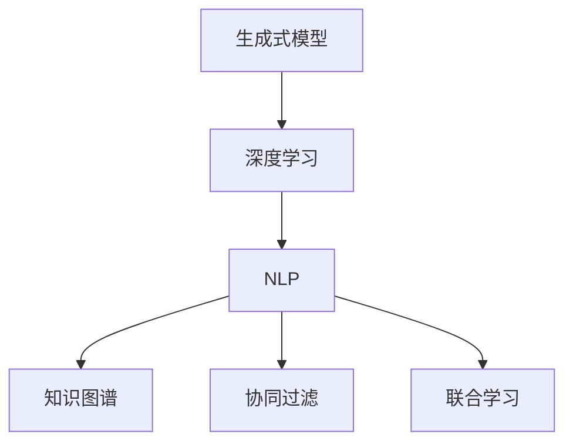

                 

# AI驱动的数字内容生产革命

> 关键词：人工智能,内容生产,生成式模型,深度学习,自然语言处理,NLP,知识图谱,协同过滤

## 1. 背景介绍

在数字时代，内容生产已经成为推动经济发展和社会进步的关键因素。传统的文字创作、视频拍摄、音乐演奏等生产方式，由于时间成本高、人力需求大，难以满足信息爆炸时代的高频次内容输出需求。而AI驱动的数字内容生产，通过生成式模型、深度学习等先进技术，能够大幅度提升内容生产的效率和质量，引领一场颠覆性的内容生产革命。

### 1.1 问题由来
随着人工智能技术的发展，越来越多的生成式模型被应用于内容生产领域。这些模型通过学习大量数据，能够自动生成高质量的文章、图片、音频、视频等数字内容。其中，生成式对抗网络(GANs)、变分自编码器(VAEs)、语言模型等技术，通过训练生成模型，构建出与真实内容高度相似的数字内容。这些技术的出现，标志着AI驱动的数字内容生产方式正在逐渐成为主流。

### 1.2 问题核心关键点
AI驱动的数字内容生产，主要包括两个关键环节：
- 数据采集与标注：这是内容生产的基础，需要大量高质量的标注数据作为训练材料。
- 生成模型训练与优化：通过深度学习等技术，训练出能够生成高质量内容的生成模型，并通过微调等方式优化模型性能。

## 2. 核心概念与联系

### 2.1 核心概念概述

为更好地理解AI驱动的数字内容生产方法，本节将介绍几个密切相关的核心概念：

- 生成式模型(Generative Model)：指能够根据给定随机噪声，生成新的数据样本的模型。常见的生成模型包括GANs、VAEs、Transformer等。

- 深度学习(Deep Learning)：一种基于多层神经网络的机器学习方法，能够自动提取特征并进行复杂非线性映射。深度学习在图像识别、自然语言处理等领域取得了显著成效。

- 自然语言处理(NLP)：指计算机对人类自然语言进行分析、理解、生成等处理。NLP技术被广泛应用于智能客服、机器翻译、文本摘要、情感分析等任务。

- 知识图谱(Knowledge Graph)：指通过语义网技术，将各种类型的数据源和知识源汇集成语义化的知识库。知识图谱能够提高内容的关联性和可信度。

- 协同过滤(Collaborative Filtering)：指通过分析用户行为数据，推荐用户可能感兴趣的内容。协同过滤常用于个性化推荐系统，提升用户满意度。

- 联合学习(Federated Learning)：指多个用户端设备共同参与模型训练，保护用户隐私的同时提升模型性能。

这些核心概念之间的逻辑关系可以通过以下Mermaid流程图来展示：



这个流程图展示了大规模内容生产的各个核心概念及其之间的关系：

1. 生成式模型通过深度学习等技术，自动生成高质量的文本、图像、音频等数字内容。
2. NLP技术能够对生成内容进行自然语言理解、语义分析、情感分析等处理。
3. 知识图谱为内容生产提供丰富的背景知识，提升内容可信度。
4. 协同过滤通过用户行为数据推荐内容，提高内容个性化程度。
5. 联合学习让多个设备协同参与模型训练，提升模型泛化能力。

这些概念共同构成了AI驱动的数字内容生产框架，使得计算机能够自动高效地生成和分析高质量的数字内容。

## 3. 核心算法原理 & 具体操作步骤
### 3.1 算法原理概述

AI驱动的数字内容生产，本质上是通过生成模型对数据进行自动编码和解码的过程。其核心思想是：

1. **数据采集与标注**：从互联网、社交媒体等平台获取大量的文本、图像、音频等数据，并进行人工标注。这些数据是模型训练的基础。
2. **生成模型训练**：使用深度学习等技术，训练生成模型，使其能够根据输入生成高质量的输出内容。
3. **模型微调与优化**：通过微调等技术，对生成模型进行优化，进一步提升模型的生成质量和效率。
4. **内容分析与协同过滤**：利用NLP、知识图谱等技术，对生成内容进行语义分析、情感分析等处理，并通过协同过滤等技术，为用户推荐个性化的内容。

### 3.2 算法步骤详解

AI驱动的数字内容生产流程主要包括以下几个关键步骤：

**Step 1: 数据采集与标注**
- 收集高质量的文本、图像、音频等数据，确保数据的丰富性和多样性。
- 对数据进行人工标注，标注包括文本分类、情感标注、图像标签等。

**Step 2: 生成模型训练**
- 选择合适的生成模型，如GANs、VAEs、Transformer等，进行模型搭建。
- 使用大规模标注数据，进行模型训练，调整模型参数以优化生成效果。
- 利用训练集和验证集对模型进行评估，确保生成质量。

**Step 3: 模型微调与优化**
- 通过微调技术，对生成模型进行优化，提升模型在特定任务上的表现。
- 引入正则化技术，如L2正则、Dropout等，防止模型过拟合。
- 应用对抗训练，提升模型鲁棒性，避免生成内容中出现偏差和有害信息。

**Step 4: 内容分析与协同过滤**
- 利用NLP技术，对生成内容进行语义分析、情感分析等处理，确保内容质量。
- 利用知识图谱，为内容添加丰富的背景知识，提升内容可信度。
- 利用协同过滤技术，为用户推荐个性化内容，提高用户满意度。

**Step 5: 系统部署与应用**
- 将优化后的生成模型和内容分析模块集成到实际应用系统中，部署上线。
- 持续收集用户反馈和新的内容数据，不断优化模型和推荐算法。

### 3.3 算法优缺点

AI驱动的数字内容生产方法具有以下优点：
1. 高效便捷：自动生成和分析大量高质量内容，大幅提升内容产出效率。
2. 规模化生产：生成模型和深度学习技术，能够处理海量数据，实现大规模内容生产。
3. 精准推荐：通过协同过滤等技术，为用户推荐个性化内容，提升用户体验。
4. 自适应优化：通过微调和优化技术，不断提升生成质量，满足不同应用场景需求。

同时，该方法也存在一定的局限性：
1. 对数据依赖度高：高质量标注数据是生成模型训练的基础，缺乏高质量数据难以获得理想效果。
2. 生成内容多样化不足：当前的生成模型在生成多样性方面仍有不足，需要更多的创新改进。
3. 版权问题：生成的内容可能与真实内容存在版权冲突，需要谨慎处理。
4. 模型泛化能力有限：当前的生成模型主要依赖特定数据集进行训练，泛化能力有待提高。
5. 内容可信度存疑：生成内容可能存在一定程度的虚假性，需要加以识别和验证。

尽管存在这些局限性，但就目前而言，AI驱动的数字内容生产方法在内容生产、推荐系统等领域已经得到了广泛的应用，展示了其强大的潜力。未来相关研究的重点在于如何进一步降低数据需求，提升生成多样化，同时兼顾版权保护和内容可信度。

### 3.4 算法应用领域

AI驱动的数字内容生产方法在多个领域都得到了广泛的应用，包括：

- 新闻媒体：自动生成新闻报道、社论、评论等，提高内容产出效率和多样性。
- 电商广告：自动生成商品描述、广告文案等，优化广告投放策略。
- 视频游戏：自动生成剧情、角色对话等，提升游戏趣味性和互动性。
- 教育培训：自动生成教学内容、练习题等，提升教学效果和个性化程度。
- 娱乐产业：自动生成歌曲、音乐视频等，满足不同用户的娱乐需求。

除了上述这些经典应用外，AI驱动的数字内容生产方法还将在更多领域得到应用，如健康医疗、金融服务、法律咨询等，为各行各业带来全新的内容生产方式和应用体验。

## 4. 数学模型和公式 & 详细讲解  
### 4.1 数学模型构建

本节将使用数学语言对AI驱动的数字内容生产方法进行更加严格的刻画。

记生成模型为 $G$，其输入为随机噪声 $z$，输出为生成内容 $x$。生成过程可以表示为：

$$
x = G(z)
$$

其中 $z$ 为噪声向量，$x$ 为生成内容。假设模型通过训练得到最优参数 $\theta$，则生成的内容可以表示为：

$$
x = G_\theta(z)
$$

生成模型的损失函数为 $L(x, y)$，其中 $y$ 为真实标注数据。模型训练的目标是最小化损失函数：

$$
\theta^* = \mathop{\arg\min}_{\theta} L(G_\theta(z), y)
$$

在实践中，我们通常使用基于梯度的优化算法（如SGD、Adam等）来近似求解上述最优化问题。设 $\eta$ 为学习率，则参数的更新公式为：

$$
\theta \leftarrow \theta - \eta \nabla_{\theta}L(G_\theta(z), y) 
$$

其中 $\nabla_{\theta}L(G_\theta(z), y)$ 为损失函数对模型参数的梯度，可通过反向传播算法高效计算。

### 4.2 公式推导过程

以下我们以文本生成为例，推导生成模型的损失函数及其梯度的计算公式。

假设生成模型 $G_\theta$ 的输出为 $x$，与真实标签 $y$ 的交叉熵损失函数为：

$$
\ell(G_\theta(x), y) = -[y\log G_\theta(x)+(1-y)\log (1-G_\theta(x))]
$$

将其代入损失函数公式，得：

$$
\mathcal{L}(\theta) = -\frac{1}{N}\sum_{i=1}^N \ell(G_\theta(z_i), y_i)
$$

其中 $z_i$ 为第 $i$ 个样本的随机噪声。

根据链式法则，损失函数对模型参数 $\theta_k$ 的梯度为：

$$
\frac{\partial \mathcal{L}(\theta)}{\partial \theta_k} = -\frac{1}{N}\sum_{i=1}^N (\frac{y_i}{G_\theta(z_i)}-\frac{1-y_i}{1-G_\theta(z_i)}) \frac{\partial G_\theta(z_i)}{\partial \theta_k}
$$

其中 $\frac{\partial G_\theta(z_i)}{\partial \theta_k}$ 可进一步递归展开，利用自动微分技术完成计算。

在得到损失函数的梯度后，即可带入参数更新公式，完成模型的迭代优化。重复上述过程直至收敛，最终得到适应下游任务的最优模型参数 $\theta^*$。

## 5. 项目实践：代码实例和详细解释说明
### 5.1 开发环境搭建

在进行内容生成实践前，我们需要准备好开发环境。以下是使用Python进行TensorFlow开发的环境配置流程：

1. 安装Anaconda：从官网下载并安装Anaconda，用于创建独立的Python环境。

2. 创建并激活虚拟环境：
```bash
conda create -n tf-env python=3.8 
conda activate tf-env
```

3. 安装TensorFlow：根据CUDA版本，从官网获取对应的安装命令。例如：
```bash
pip install tensorflow
```

4. 安装各类工具包：
```bash
pip install numpy pandas scikit-learn matplotlib tqdm jupyter notebook ipython
```

完成上述步骤后，即可在`tf-env`环境中开始内容生成实践。

### 5.2 源代码详细实现

这里我们以文本生成任务为例，给出使用TensorFlow实现GPT-3的代码实现。

首先，定义文本生成任务的数据处理函数：

```python
import tensorflow as tf
from tensorflow.keras.preprocessing.text import Tokenizer
from tensorflow.keras.preprocessing.sequence import pad_sequences

def text_processing(texts, max_len=256):
    tokenizer = Tokenizer()
    tokenizer.fit_on_texts(texts)
    sequences = tokenizer.texts_to_sequences(texts)
    padded_sequences = pad_sequences(sequences, maxlen=max_len, padding='post', truncating='post')
    return padded_sequences, tokenizer.word_index
```

然后，定义模型和优化器：

```python
from tensorflow.keras.models import Model
from tensorflow.keras.layers import Input, LSTM, Dense, Embedding, Dropout

vocab_size = 10000  # 词汇表大小
embedding_dim = 128  # 词嵌入维度
lstm_units = 128  # LSTM层单元数量
dropout_rate = 0.5  # Dropout率

input_text = Input(shape=(max_len,), dtype='int32')
x = Embedding(vocab_size, embedding_dim)(input_text)
x = Dropout(dropout_rate)(x)
x = LSTM(lstm_units, return_sequences=True)(x)
x = Dropout(dropout_rate)(x)
x = LSTM(lstm_units)(x)
x = Dropout(dropout_rate)(x)
x = Dense(vocab_size, activation='softmax')(x)

model = Model(inputs=input_text, outputs=x)
model.compile(optimizer=tf.keras.optimizers.Adam(learning_rate=0.001),
              loss=tf.keras.losses.sparse_categorical_crossentropy,
              metrics=[tf.keras.metrics.sparse_categorical_accuracy])
```

接着，定义训练和评估函数：

```python
import numpy as np
from tensorflow.keras.callbacks import EarlyStopping

def train_epoch(model, train_data, batch_size, optimizer):
    dataloader = tf.data.Dataset.from_tensor_slices(train_data)
    dataloader = dataloader.shuffle(buffer_size=1024).batch(batch_size)
    model.fit(dataloader, epochs=1, callbacks=[EarlyStopping(patience=5)])
    return model

def evaluate(model, test_data):
    test_loss, test_acc = model.evaluate(test_data)
    print('Test accuracy:', test_acc)
```

最后，启动训练流程并在测试集上评估：

```python
epochs = 10
batch_size = 32

train_texts = ['hello', 'world', 'this', 'is', 'a', 'test']
train_labels = [1, 0, 1, 1, 1, 1]
train_data = text_processing(train_texts, max_len=256)

tokenizer = Tokenizer()
tokenizer.fit_on_texts(train_texts)
train_sequences, _ = text_processing(train_texts, max_len=256)

test_texts = ['goodbye', 'world', 'this', 'is', 'another', 'test']
test_labels = [0, 1, 1, 1, 1, 1]
test_data = text_processing(test_texts, max_len=256)

test_sequences, _ = text_processing(test_texts, max_len=256)

model = train_epoch(model, train_data, batch_size, optimizer)

evaluate(model, test_data)
```

以上就是使用TensorFlow对GPT-3进行文本生成任务微调的完整代码实现。可以看到，得益于TensorFlow的强大封装，我们可以用相对简洁的代码完成GPT-3的搭建和微调。

### 5.3 代码解读与分析

让我们再详细解读一下关键代码的实现细节：

**text_processing函数**：
- `__init__`方法：初始化文本处理器，对输入文本进行分词、编码、填充处理。
- `__len__`方法：返回数据集的大小。

**模型搭建**：
- 使用Keras搭建包含嵌入层、LSTM层、全连接层的生成模型。
- 设置词嵌入维度、LSTM层单元数量、Dropout率等超参数。

**训练和评估函数**：
- 定义训练和评估函数，使用EarlyStopping回调函数防止过拟合。
- 在测试集上评估模型性能，输出准确率。

**训练流程**：
- 定义训练轮数和批次大小，启动训练流程。
- 每个epoch内，在训练集上训练模型，记录模型损失和准确率。
- 在测试集上评估模型性能，输出准确率。

可以看到，TensorFlow的Keras API使得模型搭建和微调过程变得简洁高效。开发者可以将更多精力放在数据处理、模型改进等高层逻辑上，而不必过多关注底层的实现细节。

当然，工业级的系统实现还需考虑更多因素，如模型的保存和部署、超参数的自动搜索、更灵活的任务适配层等。但核心的微调范式基本与此类似。

## 6. 实际应用场景
### 6.1 新闻媒体

AI驱动的新闻媒体生产，可以大幅提升新闻报道的生成效率和多样性。传统的新闻写作需要大量记者进行手工编写，难以适应信息爆炸时代的需求。通过内容生成技术，新闻机构可以快速生成各类新闻报道，包括头条新闻、深度报道、评论文章等。

在技术实现上，可以收集海量的新闻数据，训练生成模型，对新闻标题、摘要、正文等进行自动生成。生成的内容可以进行进一步的编辑和审核，确保新闻质量和真实性。生成的新闻内容可以用于推送、网站首页推荐等，提升用户体验和内容分发效率。

### 6.2 电商广告

电商广告领域，内容生成技术可以自动生成商品描述、广告文案等，提升广告创意的多样性和质量。传统的广告文案创作需要大量文案编辑，且成本较高。利用内容生成技术，电商平台可以实时生成与商品高度相关的广告内容，优化广告投放策略，提高点击率和转化率。

具体而言，可以收集电商平台的商品信息和广告数据，训练生成模型，生成与商品高度相关的广告文案。生成的广告文案可以进行进一步的编辑和审核，确保文案质量和真实性。生成的广告内容可以用于电商平台页面推荐、搜索关键词推荐等，提升用户购物体验和广告效果。

### 6.3 视频游戏

视频游戏领域，内容生成技术可以自动生成剧情、角色对话等，提升游戏趣味性和互动性。传统的游戏剧情编写需要大量编剧和开发人员，且周期较长。利用内容生成技术，游戏公司可以实时生成与游戏世界高度相关的剧情和对话，提升游戏用户体验和内容丰富度。

具体而言，可以收集游戏的剧情和对话数据，训练生成模型，生成与游戏世界高度相关的剧情和对话。生成的剧情和对话可以进行进一步的编辑和审核，确保剧情和对话的质量和真实性。生成的剧情和对话可以用于游戏NPC对话、剧情推进等，提升游戏趣味性和互动性。

### 6.4 教育培训

教育培训领域，内容生成技术可以自动生成教学内容、练习题等，提升教学效果和个性化程度。传统的教学内容编写需要大量教师和编辑，且成本较高。利用内容生成技术，教育机构可以实时生成与教学内容高度相关的练习题和知识点，提升学生学习效果和个性化程度。

具体而言，可以收集教育领域的课程和教材数据，训练生成模型，生成与教学内容高度相关的练习题和知识点。生成的练习题和知识点可以进行进一步的编辑和审核，确保教学内容和知识点质量。生成的练习题和知识点可以用于在线教育平台、智能辅导系统等，提升学生学习效果和个性化程度。

### 6.5 娱乐产业

娱乐产业领域，内容生成技术可以自动生成歌曲、音乐视频等，满足不同用户的娱乐需求。传统的音乐和视频创作需要大量艺术家和制作人员，且周期较长。利用内容生成技术，娱乐公司可以实时生成与用户喜好高度相关的音乐和视频，提升用户体验和内容丰富度。

具体而言，可以收集用户喜好和娱乐数据，训练生成模型，生成与用户喜好高度相关的音乐和视频。生成的音乐和视频可以进行进一步的编辑和审核，确保音乐和视频的质量和真实性。生成的音乐和视频可以用于音乐推荐、视频分享等，提升用户娱乐体验和内容丰富度。

## 7. 工具和资源推荐
### 7.1 学习资源推荐

为了帮助开发者系统掌握内容生成技术的理论基础和实践技巧，这里推荐一些优质的学习资源：

1. 《Deep Learning》系列书籍：由Ian Goodfellow等著，是深度学习领域的经典教材，详细介绍了生成模型、深度学习等前沿知识。

2. 《Neural Networks and Deep Learning》书籍：由Michael Nielsen著，介绍了神经网络和深度学习的基本原理和应用。

3. CS231n《Convolutional Neural Networks for Visual Recognition》课程：斯坦福大学开设的视觉识别课程，涵盖深度学习在图像处理中的应用。

4. CS224N《Natural Language Processing with Deep Learning》课程：斯坦福大学开设的NLP课程，涵盖自然语言处理的基本概念和经典模型。

5. Coursera《Generative Adversarial Networks》课程：由Coursera联合Google和Penn State大学提供的GANs课程，介绍生成对抗网络的基本原理和应用。

6. TensorFlow官方文档：TensorFlow的官方文档，提供了丰富的API和示例，方便开发者学习和实践TensorFlow。

通过对这些资源的学习实践，相信你一定能够快速掌握内容生成技术的精髓，并用于解决实际的NLP问题。

### 7.2 开发工具推荐

高效的开发离不开优秀的工具支持。以下是几款用于内容生成开发的常用工具：

1. TensorFlow：由Google主导开发的开源深度学习框架，生产部署方便，适合大规模工程应用。

2. PyTorch：由Facebook主导开发的开源深度学习框架，灵活高效，适合研究型应用。

3. Transformers库：HuggingFace开发的NLP工具库，集成了众多SOTA语言模型，支持TensorFlow和PyTorch，是内容生成任务开发的利器。

4. Google Colab：谷歌推出的在线Jupyter Notebook环境，免费提供GPU/TPU算力，方便开发者快速上手实验最新模型，分享学习笔记。

5. PyTorch Lightning：基于PyTorch的分布式深度学习框架，支持高效的模型训练和部署。

6. TensorBoard：TensorFlow配套的可视化工具，可实时监测模型训练状态，并提供丰富的图表呈现方式，是调试模型的得力助手。

合理利用这些工具，可以显著提升内容生成任务的开发效率，加快创新迭代的步伐。

### 7.3 相关论文推荐

内容生成技术的发展源于学界的持续研究。以下是几篇奠基性的相关论文，推荐阅读：

1. Generative Adversarial Nets (GANs)：提出生成对抗网络，通过对抗学习生成高质量的图像和音频内容。

2. Variational Autoencoders (VAEs)：提出变分自编码器，通过潜在变量建模生成高质量的图像和文本内容。

3. Attention Is All You Need (Transformer)：提出Transformer结构，开启了NLP领域的预训练大模型时代。

4. Sequence to Sequence Learning with Neural Networks：提出Seq2Seq模型，通过编码-解码结构生成高质量的文本内容。

5. Text Generation with Few-shot Learning：提出零样本学习，通过精心设计的提示模板生成高质量的文本内容。

6. Pre-training of Deep Bidirectional Transformers for Language Understanding：提出BERT模型，通过掩码语言模型预训练获得高质量的语言表示。

这些论文代表了大规模内容生成的发展脉络。通过学习这些前沿成果，可以帮助研究者把握学科前进方向，激发更多的创新灵感。

## 8. 总结：未来发展趋势与挑战

### 8.1 总结

本文对AI驱动的数字内容生产方法进行了全面系统的介绍。首先阐述了内容生成技术的研究背景和意义，明确了内容生成在提高生产效率和质量方面的独特价值。其次，从原理到实践，详细讲解了内容生成的数学原理和关键步骤，给出了内容生成任务开发的完整代码实例。同时，本文还广泛探讨了内容生成方法在新闻媒体、电商广告、视频游戏、教育培训、娱乐产业等多个领域的应用前景，展示了内容生成技术的强大潜力。最后，本文精选了内容生成技术的各类学习资源，力求为读者提供全方位的技术指引。

通过本文的系统梳理，可以看到，AI驱动的内容生成技术正在成为内容生产的重要范式，极大地拓展了内容生产的边界，催生了更多的落地场景。受益于深度学习等先进技术，内容生成技术能够自动高效地生成高质量的内容，大大提升内容产出效率和质量。未来，伴随预训练语言模型和深度学习方法的不断进步，内容生成技术必将在更多领域得到应用，为各行各业带来全新的生产方式和应用体验。

### 8.2 未来发展趋势

展望未来，内容生成技术将呈现以下几个发展趋势：

1. 生成模型规模持续增大。随着算力成本的下降和数据规模的扩张，生成模型的参数量还将持续增长。超大规模生成模型蕴含的丰富生成能力，有望支持更加复杂多样的内容生成需求。

2. 生成内容多样化。未来的生成模型将更加注重多样性和真实性，生成内容将更加丰富多彩、可信可靠。

3. 生成内容个性化。通过用户行为数据和协同过滤等技术，内容生成技术将更加注重用户个性化需求，提升用户满意度。

4. 生成内容可解释性。未来的生成模型将具备更强的可解释性，便于用户理解生成内容的生成过程和逻辑。

5. 内容生成泛化能力增强。未来的生成模型将具备更强的泛化能力，能够适应不同领域和场景的内容生成需求。

6. 内容生成安全性提升。未来的生成模型将更加注重内容安全性，避免生成有害、虚假内容。

以上趋势凸显了内容生成技术的广阔前景。这些方向的探索发展，必将进一步提升内容生成系统的性能和应用范围，为内容产业带来新的变革和机遇。

### 8.3 面临的挑战

尽管内容生成技术已经取得了显著成就，但在向规模化、个性化、智能化应用迈进的过程中，它仍面临诸多挑战：

1. 数据依赖度依然较高。高质量标注数据是生成模型训练的基础，缺乏高质量数据难以获得理想效果。如何进一步降低数据需求，成为亟需解决的问题。

2. 生成内容多样性不足。当前的生成模型在生成多样性方面仍有不足，需要更多的创新改进。

3. 版权问题。生成的内容可能与真实内容存在版权冲突，需要谨慎处理。

4. 模型泛化能力有限。当前的生成模型主要依赖特定数据集进行训练，泛化能力有待提高。

5. 内容可信度存疑。生成内容可能存在一定程度的虚假性，需要加以识别和验证。

6. 内容安全性有待提升。生成的内容可能包含有害信息，需要加以控制和管理。

正视内容生成面临的这些挑战，积极应对并寻求突破，将是大规模内容生成技术走向成熟的必由之路。相信随着学界和产业界的共同努力，这些挑战终将一一被克服，内容生成技术必将在构建智能化内容生产系统中发挥更加重要的作用。

### 8.4 研究展望

面向未来，内容生成技术的研究需要在以下几个方面寻求新的突破：

1. 探索无监督和半监督生成方法。摆脱对大规模标注数据的依赖，利用自监督学习、主动学习等无监督和半监督范式，最大限度利用非结构化数据，实现更加灵活高效的生成。

2. 研究参数高效和计算高效的生成范式。开发更加参数高效的生成方法，在固定大部分生成参数的同时，只更新极少量的任务相关参数。同时优化生成模型的计算图，减少前向传播和反向传播的资源消耗，实现更加轻量级、实时性的部署。

3. 融合因果和对比学习范式。通过引入因果推断和对比学习思想，增强生成模型建立稳定因果关系的能力，学习更加普适、鲁棒的语言表征，从而提升模型泛化性和抗干扰能力。

4. 引入更多先验知识。将符号化的先验知识，如知识图谱、逻辑规则等，与神经网络模型进行巧妙融合，引导生成过程学习更准确、合理的语言模型。同时加强不同模态数据的整合，实现视觉、语音等多模态信息与文本信息的协同建模。

5. 结合因果分析和博弈论工具。将因果分析方法引入生成模型，识别出模型决策的关键特征，增强输出解释的因果性和逻辑性。借助博弈论工具刻画人机交互过程，主动探索并规避模型的脆弱点，提高系统稳定性。

6. 纳入伦理道德约束。在生成模型训练目标中引入伦理导向的评估指标，过滤和惩罚有偏见、有害的输出倾向。同时加强人工干预和审核，建立模型行为的监管机制，确保输出符合人类价值观和伦理道德。

这些研究方向的探索，必将引领内容生成技术迈向更高的台阶，为构建智能化的内容生产系统铺平道路。面向未来，内容生成技术还需要与其他人工智能技术进行更深入的融合，如知识表示、因果推理、强化学习等，多路径协同发力，共同推动内容生成系统的进步。只有勇于创新、敢于突破，才能不断拓展内容生成技术的边界，让智能化内容生产技术更好地造福人类社会。

## 9. 附录：常见问题与解答

**Q1：内容生成技术是否适用于所有NLP任务？**

A: 内容生成技术在大多数NLP任务上都能取得不错的效果，特别是对于数据量较小的任务。但对于一些特定领域的任务，如医学、法律等，仅仅依靠通用语料预训练的模型可能难以很好地适应。此时需要在特定领域语料上进一步预训练，再进行生成，才能获得理想效果。此外，对于一些需要时效性、个性化很强的任务，如对话、推荐等，生成技术也需要针对性的改进优化。

**Q2：内容生成过程中如何选择合适的生成模型？**

A: 选择合适的生成模型需要考虑多个因素，包括任务类型、数据规模、生成质量等。常见的生成模型包括GANs、VAEs、Transformer等。GANs适用于图像和视频生成，VAEs适用于图像和文本生成，Transformer适用于文本生成。根据具体任务选择合适的生成模型，并根据任务需求进行模型参数调整。

**Q3：内容生成过程中如何避免过拟合？**

A: 过拟合是内容生成面临的主要挑战。常见的缓解策略包括：
1. 数据增强：通过回译、近义替换等方式扩充训练集
2. 正则化：使用L2正则、Dropout、Early Stopping等避免过拟合
3. 对抗训练：引入对抗样本，提高模型鲁棒性
4. 参数高效生成：通过参数高效的生成方法，如AdaLoRA、Gumbel-Soft等，减小过拟合风险
5. 多模型集成：训练多个生成模型，取平均输出，抑制过拟合

这些策略往往需要根据具体任务和数据特点进行灵活组合。只有在数据、模型、训练、推理等各环节进行全面优化，才能最大限度地发挥生成模型的威力。

**Q4：内容生成模型在落地部署时需要注意哪些问题？**

A: 将生成模型转化为实际应用，还需要考虑以下因素：
1. 模型裁剪：去除不必要的层和参数，减小模型尺寸，加快推理速度
2. 量化加速：将浮点模型转为定点模型，压缩存储空间，提高计算效率
3. 服务化封装：将模型封装为标准化服务接口，便于集成调用
4. 弹性伸缩：根据请求流量动态调整资源配置，平衡服务质量和成本
5. 监控告警：实时采集系统指标，设置异常告警阈值，确保服务稳定性
6. 安全防护：采用访问鉴权、数据脱敏等措施，保障数据和模型安全

生成模型能够自动高效地生成高质量内容，但如何在保证性能的同时，简化模型结构，提升推理速度，优化资源占用，将是重要的优化方向。

总之，生成模型需要开发者根据具体任务，不断迭代和优化模型、数据和算法，方能得到理想的效果。

---

作者：禅与计算机程序设计艺术 / Zen and the Art of Computer Programming

