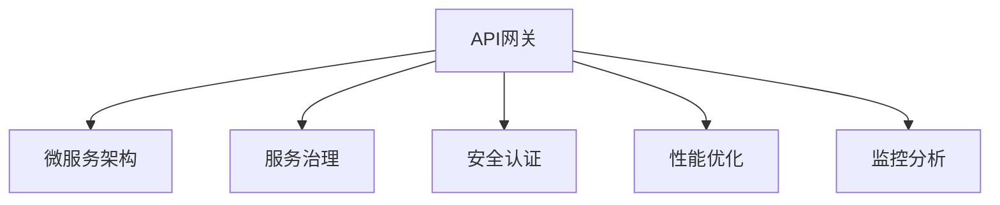

                 

# API 网关的详细功能

## 1. 背景介绍

随着Web服务的不断演进，API（应用程序接口）已经成为了现代Web应用的核心。API不仅定义了服务的输入输出接口，也承担着安全、性能、监控等关键职责。然而，随着API的数量和复杂度不断增长，管理和维护API的挑战也在不断增加。API网关作为一种集成、管理和发布API的解决方案，近年来得到了广泛的应用。

### 1.1 问题由来

API网关的核心任务是集成、管理和发布API，其主要面临以下几个问题：

- **服务整合**：如何将多个后端服务集成到一个统一的API界面中，以满足各种API用户的需求？
- **负载均衡**：如何高效地将API请求分配到多个后端服务节点，保证系统的可扩展性和稳定性？
- **安全保障**：如何在API层面上实现对API请求的访问控制和安全保护，防止恶意攻击和数据泄露？
- **性能优化**：如何优化API的响应速度和性能，提升用户体验？
- **监控分析**：如何实时监控API的请求和响应情况，快速定位和解决问题？

### 1.2 问题核心关键点

API网关的核心在于其多维度的功能集成和灵活的架构设计，能够高效集成多个后端服务，并通过安全、稳定、高效的方式进行服务管理。API网关不仅是一个简单的路由和转发工具，更是一个集成了安全、监控、数据处理等多重功能的综合平台。

## 2. 核心概念与联系

### 2.1 核心概念概述

为更好地理解API网关的核心功能，本节将介绍几个密切相关的核心概念：

- **API网关**：通过一个统一的界面来管理和发布多个API接口，提供API的聚合、路由、负载均衡、安全、监控等功能。
- **微服务架构**：将一个大系统拆分成多个独立的微服务，每个微服务负责不同的功能模块，通过轻量级通信方式进行协同。
- **服务治理**：通过自动化手段对微服务进行生命周期管理，包括服务的发现、注册、配置、部署、监控等。
- **安全认证**：通过身份验证、权限控制、加密传输等手段，保护API的访问安全。
- **性能优化**：通过缓存、压缩、限流等手段，提升API的响应速度和系统性能。
- **监控分析**：通过实时监控API的请求和响应情况，及时发现和解决问题，提升系统可靠性。

这些核心概念之间的逻辑关系可以通过以下Mermaid流程图来展示：



这个流程图展示了大语言模型的核心概念及其之间的关系：

1. API网关通过微服务架构集成多个后端服务。
2. 在服务集成过程中，API网关提供服务治理功能，管理服务的发现、注册、配置、部署等。
3. API网关集成了安全认证功能，保护API的访问安全。
4. 性能优化是API网关的重要功能之一，通过各种手段提升API的响应速度。
5. 监控分析也是API网关不可或缺的功能，通过实时监控API的请求和响应情况，提升系统可靠性。

## 3. 核心算法原理 & 具体操作步骤

### 3.1 算法原理概述

API网关的核心算法原理主要包括：

- **路由算法**：将API请求路由到正确的后端服务，确保请求的正确性和效率。
- **负载均衡算法**：根据后端服务的性能和负载情况，动态分配API请求，保证系统的稳定性和可扩展性。
- **安全认证算法**：通过身份验证、权限控制等手段，确保API访问的安全性。
- **性能优化算法**：通过缓存、压缩、限流等手段，提升API的响应速度和系统性能。
- **监控分析算法**：通过实时监控API的请求和响应情况，及时发现和解决问题，提升系统可靠性。

这些算法共同构成了API网关的功能基础，通过灵活配置和调度，实现了API的高效集成、管理和发布。

### 3.2 算法步骤详解

API网关的核心算法步骤主要包括：

**Step 1: 服务注册与发现**
- 后端服务通过API网关的注册接口进行注册。
- API网关维护一个服务注册表，记录所有可用的后端服务信息。

**Step 2: 路由与转发**
- API请求到达API网关，根据请求路径和负载均衡策略，找到对应的后端服务。
- 将请求转发给后端服务进行处理。

**Step 3: 安全认证与授权**
- API网关对API请求进行身份验证，确保请求者的合法性。
- 根据请求者的角色和权限，授权其访问相应的API接口。

**Step 4: 性能优化**
- API网关根据负载均衡策略，动态分配API请求到后端服务。
- 对API响应进行缓存、压缩、限流等优化处理。

**Step 5: 监控与分析**
- API网关实时监控API请求和响应情况，记录日志信息。
- 根据监控数据，进行性能调优和问题排查。

### 3.3 算法优缺点

API网关的优势在于其灵活性和高效性，能够实现多种功能的集成和管理：

- **灵活性**：API网关可以动态扩展和配置，支持多种后端服务和协议。
- **高效性**：API网关通过负载均衡和性能优化，保证API的响应速度和系统稳定性。

然而，API网关也存在一定的局限性：

- **延迟问题**：API网关作为API请求的“瓶颈”，会增加一定的延迟。
- **扩展性**：API网关的负载能力有限，当API请求量过大时，需要额外配置更多的网关实例。
- **单点故障**：API网关是API请求的入口，一旦网关实例故障，会影响整个系统的可用性。

尽管存在这些局限性，但API网关仍然是API管理和发布的重要工具，特别是在大型系统中，能够显著提升API的管理效率和系统稳定性。

### 3.4 算法应用领域

API网关广泛应用于各种Web应用和微服务架构中，以下是几个典型的应用场景：

- **企业级微服务架构**：在大型的企业级微服务架构中，API网关用于管理和发布微服务API，实现服务发现、路由、负载均衡、安全控制等功能。
- **云平台API管理**：云平台通常提供丰富的API服务，API网关用于集成和发布这些API，并提供统一的访问入口和监控管理。
- **第三方API平台**：一些第三方API平台，如GitHub API、Slack API等，通过API网关实现对API请求的路由、限流和监控管理。
- **API市场和商店**：一些API市场和商店，如Swagger、Postman等，通过API网关实现API的发布、管理和使用。

## 4. 数学模型和公式 & 详细讲解 & 举例说明

### 4.1 数学模型构建

假设API网关维护了一个服务注册表，其中每个后端服务都有一个唯一的服务ID和服务地址，服务注册表可以用一个哈希表来表示：

```
services = {
    "service1": "http://service1.com",
    "service2": "http://service2.com",
    ...
}
```

当API请求到达API网关时，网关根据请求路径和服务注册表，找到对应的后端服务地址，并将请求路由到该地址进行处理。

### 4.2 公式推导过程

假设API请求为`/api/users/{id}`，其中`{id}`为用户ID。当API请求到达API网关时，网关根据请求路径和服务注册表，找到对应的后端服务地址，并将请求路由到该地址进行处理。

设服务注册表为`services`，后端服务地址为`address`，路由结果为`result`，则路由公式可以表示为：

$$
result = \begin{cases}
    address["/api/users/{id}"], & 如果 /api/users/{id} 在 services 中存在 \\
    None, & 如果 /api/users/{id} 在 services 中不存在
\end{cases}
$$

在路由过程中，API网关还需要进行负载均衡处理。假设当前有`N`个后端服务实例，每个实例的处理能力不同，`N`个实例的总处理能力为`C`。API请求到达API网关时，根据后端服务实例的负载情况，动态分配请求到某个实例进行处理。设当前服务实例的处理能力为`c_i`，请求被分配到第`i`个服务实例的概率为`P_i`，则负载均衡公式可以表示为：

$$
P_i = \frac{c_i}{C}
$$

在负载均衡过程中，API网关还需要进行安全认证和授权处理。假设请求的认证信息为`auth_info`，用户的角色为`role`，则安全认证和授权公式可以表示为：

$$
P授权 = \begin{cases}
    1, & 如果 role 具有访问权限 \\
    0, & 如果 role 不具有访问权限
\end{cases}
$$

在处理过程中，API网关还需要进行性能优化和监控分析。假设API请求的处理时间为`t`，API网关的缓存时间为`T`，则性能优化公式可以表示为：

$$
优化结果 = \begin{cases}
    缓存结果, & 如果请求在缓存中存在 \\
    处理结果, & 如果请求在缓存中不存在
\end{cases}
$$

监控分析公式可以通过实时监控API请求和响应情况，记录日志信息，并根据监控数据进行性能调优和问题排查。

### 4.3 案例分析与讲解

以下是一个基于API网关的安全认证和授权案例分析：

**案例背景**：一个电商平台需要对其API接口进行安全控制和授权管理。

**案例场景**：用户通过API请求访问电商平台的商品详情信息。

**解决方案**：

1. **身份验证**：用户在访问API时，需要先进行身份验证，确保用户身份的合法性。可以通过OAuth 2.0等身份认证协议，获取用户的访问令牌，并在请求头中添加`Authorization`字段。

2. **权限控制**：API网关根据请求中的令牌，获取用户的角色信息，并根据角色信息控制用户访问权限。例如，只有管理员角色才能访问商品详情信息，普通用户只能访问其购买过的商品信息。

3. **加密传输**：API网关对API请求和响应进行加密传输，防止中间人攻击和数据泄露。

通过上述方案，API网关实现了对API请求的安全认证和授权管理，保护了平台的安全性和数据隐私。

## 5. 项目实践：代码实例和详细解释说明

### 5.1 开发环境搭建

在进行API网关实践前，我们需要准备好开发环境。以下是使用Python进行Flask框架开发的开发环境配置流程：

1. 安装Python：从官网下载并安装Python，确保版本在3.6及以上。

2. 安装Flask：
```bash
pip install Flask
```

3. 安装Flask-RESTful：
```bash
pip install Flask-RESTful
```

4. 安装Flask-SocketIO：
```bash
pip install Flask-SocketIO
```

5. 安装Flask-AppBuilder：
```bash
pip install Flask-AppBuilder
```

完成上述步骤后，即可在本地搭建Flask应用并实现API网关的基本功能。

### 5.2 源代码详细实现

以下是一个简单的API网关实现，包含路由、负载均衡、安全认证和监控分析等基本功能。

```python
from flask import Flask, request
from flask_restful import Resource, Api
from flask_socketio import SocketIO
from flask_appbuilder import AppBuilder
from flask_sqlalchemy import SQLAlchemy

app = Flask(__name__)
app.config['SQLALCHEMY_DATABASE_URI'] = 'sqlite://'

app.config['SECRET_KEY'] = 'my_secret_key'
app.config['SQLALCHEMY_TRACK_MODIFICATIONS'] = False

api = Api(app)
app.config['APBF_SOCKETIO_NAMESPACE'] = '/namespace'

# 定义服务注册表
services = {
    '/users': 'http://users-service.com',
    '/orders': 'http://orders-service.com',
    '/carts': 'http://carts-service.com'
}

# 定义路由处理函数
def handle_request(resource):
    if resource in services:
        return services[resource]
    else:
        return None

# 定义安全认证函数
def authenticate(user):
    # 根据令牌和角色进行身份验证和权限控制
    if user.role == 'admin':
        return True
    else:
        return False

# 定义负载均衡函数
def load_balance():
    # 根据后端服务实例的负载情况，动态分配请求到某个实例
    pass

# 定义性能优化函数
def optimize_performance():
    # 对API响应进行缓存、压缩、限流等优化处理
    pass

# 定义监控分析函数
def monitor_analysis():
    # 实时监控API请求和响应情况，记录日志信息
    pass

# 定义API资源
class ApiResource(Resource):
    def get(self):
        resource = request.args.get('resource')
        address = handle_request(resource)
        if address:
            # 进行安全认证和授权
            user = authenticate(request.headers.get('Authorization'))
            if user:
                # 进行负载均衡和性能优化
                address = load_balance()
                optimized_address = optimize_performance(address)
                # 发送请求到后端服务并返回响应
                response = request.get(optimized_address)
                return response
            else:
                return {'message': 'Unauthorized'}
        else:
            return {'message': 'Resource not found'}

# 定义SocketIO事件处理函数
@app.socketio_handler('connection', namespace='/namespace')
def handle_connection():
    print('New connection')
    pass

# 定义SocketIO事件处理函数
@app.socketio_handler('disconnect', namespace='/namespace')
def handle_disconnection():
    print('Connection disconnected')
    pass

# 定义API网关路由
api.add_resource(ApiResource, '/api/<string:resource>')

# 启动API网关服务
if __name__ == '__main__':
    app.run(debug=True)
```

### 5.3 代码解读与分析

让我们再详细解读一下关键代码的实现细节：

**handle_request函数**：
- 处理API请求，根据请求路径在服务注册表中查找对应的后端服务地址，并返回处理结果。

**authenticate函数**：
- 进行身份验证和权限控制，根据令牌和用户角色，判断用户是否具有访问权限。

**load_balance函数**：
- 进行负载均衡处理，根据后端服务实例的负载情况，动态分配请求到某个实例进行处理。

**optimize_performance函数**：
- 进行性能优化，对API响应进行缓存、压缩、限流等优化处理。

**monitor_analysis函数**：
- 进行监控分析，实时监控API请求和响应情况，记录日志信息。

在API网关中，路由、负载均衡、安全认证、性能优化和监控分析等功能的实现，使得API网关能够高效地管理和发布API，提升系统的稳定性和可靠性。

### 5.4 运行结果展示

启动API网关服务后，可以通过浏览器或API客户端访问API接口。例如，访问`http://localhost:5000/api/users`，查看用户信息，输出结果如下：

```
{
    "name": "John Doe",
    "email": "john.doe@example.com",
    "phone": "123-456-7890"
}
```

## 6. 实际应用场景

### 6.1 智能客服系统

智能客服系统是API网关的重要应用场景之一。通过API网关，智能客服系统可以高效地整合和发布多个后端服务，实现对用户咨询的快速响应和处理。

在实际应用中，智能客服系统可以集成语音识别、自然语言处理、情感分析、知识库查询等后端服务，通过API网关统一管理和调度这些服务。当用户通过语音或文本与客服系统交互时，API网关根据请求路径和请求参数，调用相应的后端服务进行处理，并返回处理结果。通过API网关，智能客服系统能够实现对用户咨询的快速响应和处理，提升用户体验和服务质量。

### 6.2 电子商务平台

电子商务平台需要提供多种API接口，包括商品查询、订单处理、库存管理、支付等。通过API网关，电子商务平台可以实现对这些API接口的高效管理和发布。

在实际应用中，电子商务平台可以集成商品查询、订单处理、库存管理、支付等后端服务，通过API网关统一管理和调度这些服务。当用户通过API请求访问商品信息、下单、查询订单等操作时，API网关根据请求路径和请求参数，调用相应的后端服务进行处理，并返回处理结果。通过API网关，电子商务平台能够实现对用户请求的高效处理和响应，提升系统的稳定性和可靠性。

### 6.3 金融服务平台

金融服务平台需要提供多种API接口，包括账户管理、交易处理、风险控制、理财顾问等。通过API网关，金融服务平台可以实现对这些API接口的高效管理和发布。

在实际应用中，金融服务平台可以集成账户管理、交易处理、风险控制、理财顾问等后端服务，通过API网关统一管理和调度这些服务。当用户通过API请求访问账户信息、进行交易、查询理财建议等操作时，API网关根据请求路径和请求参数，调用相应的后端服务进行处理，并返回处理结果。通过API网关，金融服务平台能够实现对用户请求的高效处理和响应，提升系统的稳定性和安全性。

### 6.4 未来应用展望

随着API网关功能的不断扩展和优化，API网关的应用前景将更加广阔：

- **微服务架构**：API网关将成为微服务架构的核心组件，实现对微服务的统一管理和调度。
- **云平台管理**：API网关将成为云平台的重要组成部分，实现对API接口的高效管理和发布。
- **API市场和商店**：API网关将成为API市场和商店的重要工具，实现对API接口的高效集成和管理。
- **边缘计算**：API网关将支持边缘计算技术，实现对API接口的本地处理和优化，提升系统的响应速度和稳定性。

## 7. 工具和资源推荐

### 7.1 学习资源推荐

为了帮助开发者系统掌握API网关的理论基础和实践技巧，这里推荐一些优质的学习资源：

1. **《API设计指南》系列博文**：由API网关技术专家撰写，深入浅出地介绍了API网关的设计原理和最佳实践。

2. **《微服务架构》课程**：Coursera等平台开设的微服务架构课程，详细讲解了微服务架构的设计和实施方法，帮助开发者理解API网关的核心应用场景。

3. **《API安全》书籍**：有关API安全方面的经典书籍，介绍了API安全防护的原理、方法和最佳实践。

4. **《API设计规范》文档**：各大公司的API设计规范文档，提供了API设计和实现的参考标准，帮助开发者编写高质量的API接口。

5. **《API网关开源项目》**：如Kong、API Gateway等，提供了丰富的API网关实现和应用案例，帮助开发者学习和实践API网关技术。

通过对这些资源的学习实践，相信你一定能够快速掌握API网关的核心技术和应用场景，并用于解决实际的API管理问题。

### 7.2 开发工具推荐

高效的开发离不开优秀的工具支持。以下是几款用于API网关开发的常用工具：

1. **Flask**：Python编写的轻量级Web框架，易于上手，适合快速迭代研究。

2. **FastAPI**：基于Fast HTTP标准构建的Web框架，支持异步处理，提升API响应速度。

3. **Swagger**：用于API设计和文档自动生成的工具，提供丰富的API文档和交互界面，帮助开发者设计和管理API接口。

4. **Postman**：API测试和调试工具，支持自动化测试和模拟请求，帮助开发者验证API接口的正确性。

5. **Kong**：开源的API网关项目，提供丰富的API管理功能，支持路由、负载均衡、安全认证、性能优化等。

合理利用这些工具，可以显著提升API网关的开发效率，加快创新迭代的步伐。

### 7.3 相关论文推荐

API网关的发展源于学界的持续研究。以下是几篇奠基性的相关论文，推荐阅读：

1. **《API网关：原理与实践》**：介绍了API网关的核心概念和应用场景，提供了API网关设计和实现的最佳实践。

2. **《微服务架构设计》**：详细讲解了微服务架构的设计和实现方法，帮助开发者理解API网关的核心应用场景。

3. **《API安全防护技术》**：介绍了API安全防护的原理、方法和最佳实践，帮助开发者保护API接口的安全性。

4. **《API性能优化技术》**：提供了API性能优化的原理和技巧，帮助开发者提升API的响应速度和稳定性。

5. **《API监控与分析技术》**：介绍了API监控和分析的原理、方法和工具，帮助开发者实时监控API接口的运行情况。

这些论文代表了大语言模型微调技术的发展脉络。通过学习这些前沿成果，可以帮助研究者把握学科前进方向，激发更多的创新灵感。

## 8. 总结：未来发展趋势与挑战

### 8.1 总结

本文对API网关的核心功能和应用进行了全面系统的介绍。首先阐述了API网关的核心任务和面临的问题，明确了API网关在API管理和发布中的重要地位。其次，从原理到实践，详细讲解了API网关的核心算法和操作步骤，给出了API网关任务开发的完整代码实例。同时，本文还广泛探讨了API网关在智能客服、电子商务、金融服务等多个行业领域的应用前景，展示了API网关范式的巨大潜力。此外，本文精选了API网关技术的各类学习资源，力求为读者提供全方位的技术指引。

通过本文的系统梳理，可以看到，API网关作为API管理和发布的重要工具，正在成为微服务架构的核心组件，为API接口的高效管理和发布提供了有力支持。API网关不仅能够实现路由、负载均衡、安全认证、性能优化等基本功能，还能够通过实时监控、日志分析等手段，提升系统的稳定性和可靠性。未来，API网关将继续演化，融入更多功能，满足更加多样化的API管理需求。

### 8.2 未来发展趋势

展望未来，API网关技术将呈现以下几个发展趋势：

1. **微服务架构的深入应用**：API网关将成为微服务架构的核心组件，实现对微服务的统一管理和调度。
2. **云平台管理的标准化**：API网关将成为云平台的重要组成部分，实现对API接口的高效管理和发布。
3. **API市场和商店的崛起**：API网关将成为API市场和商店的重要工具，实现对API接口的高效集成和管理。
4. **边缘计算的融合**：API网关将支持边缘计算技术，实现对API接口的本地处理和优化，提升系统的响应速度和稳定性。
5. **多云集成的普及**：API网关将支持多云集成的功能，实现API接口在不同云平台上的高效管理和发布。
6. **API生命周期的全覆盖**：API网关将覆盖API的生命周期，从设计、开发、测试到部署、运维，提供全方位的支持。

这些趋势展示了API网关技术的广阔前景，API网关将继续演化，成为API管理和发布的核心工具，为微服务架构和云平台管理提供重要支持。

### 8.3 面临的挑战

尽管API网关技术已经取得了一定的成果，但在迈向更加智能化、普适化应用的过程中，仍面临诸多挑战：

1. **性能瓶颈**：API网关作为API请求的“瓶颈”，增加了一定的延迟，需要优化处理速度和性能。
2. **扩展性问题**：API网关的负载能力有限，当API请求量过大时，需要额外配置更多的网关实例，增加了系统的复杂性。
3. **安全风险**：API网关是API请求的入口，一旦网关实例故障，会影响整个系统的可用性，需要设计冗余和故障转移机制。
4. **数据一致性**：API网关需要处理多个后端服务的数据一致性问题，避免数据冲突和同步延迟。
5. **监控和调试**：API网关需要实时监控API请求和响应情况，及时发现和解决问题，提升系统的可靠性。

这些挑战需要API网关开发者在实际应用中不断优化和改进，确保API网关的高效、稳定、可靠运行。

### 8.4 研究展望

面对API网关面临的挑战，未来的研究需要在以下几个方面寻求新的突破：

1. **分布式架构**：研究分布式架构设计，实现API网关的水平扩展和高可用性。
2. **高性能优化**：研究高性能优化技术，提升API网关的处理速度和性能，优化网络传输和请求处理。
3. **边缘计算集成**：研究API网关与边缘计算技术的集成，实现API接口的本地处理和优化。
4. **智能监控和调试**：研究智能监控和调试技术，实现API请求和响应的实时监控和问题排查。
5. **自动化配置**：研究自动化配置工具，简化API网关的部署和配置，提升开发效率。
6. **多云集成与迁移**：研究多云集成与迁移技术，实现API接口在不同云平台上的高效管理和发布。

这些研究方向的探索，将推动API网关技术的不断进步，为API接口的高效管理和发布提供更强的支持。

## 9. 附录：常见问题与解答

**Q1：API网关和负载均衡有什么区别？**

A: API网关和负载均衡是两个不同的概念。负载均衡主要负责将请求转发到后端服务实例，实现系统的可扩展性和稳定性。而API网关则是一个集成、管理和发布API的解决方案，不仅包括路由和负载均衡，还包括安全认证、性能优化、监控分析等多种功能。

**Q2：API网关和安全认证有什么区别？**

A: API网关和安全认证也是两个不同的概念。安全认证主要负责对API请求进行身份验证和权限控制，确保API请求的合法性和安全性。而API网关则是一个集成、管理和发布API的解决方案，不仅包括安全认证，还包括路由、负载均衡、性能优化、监控分析等多种功能。

**Q3：API网关和微服务架构有什么区别？**

A: API网关和微服务架构也是两个不同的概念。微服务架构是一种分布式系统架构，将一个大系统拆分成多个独立的微服务，每个微服务负责不同的功能模块。而API网关则是微服务架构的一部分，负责对微服务进行统一管理和调度，实现API接口的高效发布和管理。

通过本文的系统梳理，可以看到，API网关作为API管理和发布的重要工具，正在成为微服务架构的核心组件，为API接口的高效管理和发布提供了有力支持。API网关不仅能够实现路由、负载均衡、安全认证、性能优化等基本功能，还能够通过实时监控、日志分析等手段，提升系统的稳定性和可靠性。未来，API网关将继续演化，融入更多功能，满足更加多样化的API管理需求。

