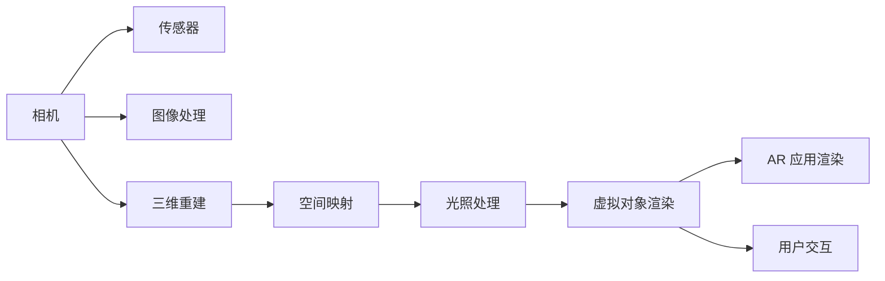

                 

# ARCore 开发：在 Android 上构建 AR 应用

> 关键词：ARCore, Android, 增强现实, 三维重建, 相机跟踪, 空间映射

## 1. 背景介绍

### 1.1 问题由来

增强现实(AR)技术作为虚拟与现实融合的关键，在近年来获得了迅速发展。Android 系统作为主流移动平台，提供了一套强大的 ARCore 工具集，支持开发者快速构建基于相机和传感器数据的 AR 应用。ARCore 框架是 Google 开发的 AR 开发平台，为 Android 应用提供硬件感测、三维重建、相机跟踪等功能。在教育、医疗、游戏、零售等领域，ARCore 已成功应用。

然而，对于 ARCore 的开发，很多开发者仍存在诸多疑惑。本文旨在全面系统地介绍 ARCore 核心概念、关键算法及具体开发实践，以期帮助开发者快速掌握 ARCore 技术，推动 Android 应用的多样化和智能化发展。

### 1.2 问题核心关键点

ARCore 的核心点主要包含以下几个方面：
- **核心组件**：包括相机、传感器、三维重建、图像处理、空间映射等，是构建 AR 应用的基础。
- **关键算法**：如位姿跟踪、平面识别、三维重建、光照处理等，是保证 AR 体验流畅高效的关键。
- **开发实践**：如何在 Android 上实现 ARCore 功能，并进行性能优化和用户交互设计。

本文将围绕上述关键点展开，从核心概念、关键算法、开发实践到具体应用案例，全方位介绍 ARCore 开发的相关技术，并探讨其未来发展趋势。

## 2. 核心概念与联系

### 2.1 核心概念概述

ARCore 由一系列工具组成，覆盖了 AR 应用的全流程，包括设备传感器数据收集、空间位置感知、三维重建、光照处理、图像融合等。以下是对这些核心概念的概述：

- **相机**：捕捉实际环境的三维视觉数据，是 AR 体验的基础。
- **传感器**：包括陀螺仪、加速度计、磁力计等，用于捕捉设备姿态和运动变化。
- **三维重建**：将现实世界的三维数据重构成可计算的几何模型，实现虚拟与现实融合。
- **空间映射**：识别并映射现实世界的平面，供虚拟对象定位放置。
- **图像处理**：利用深度学习、图像分割等技术，实现对环境、物体的精准感知和分析。
- **光照处理**：根据环境光照条件，调整虚拟对象的渲染效果，实现自然逼真的 AR 体验。

### 2.2 核心概念联系(Mermaid 流程图)



### 2.3 核心概念原理和架构

ARCore 框架的核心原理和架构如下：

1. **硬件感测**：通过 Android 设备内置的摄像头和传感器，捕捉环境图像和设备姿态信息，供后续处理使用。
2. **三维重建**：使用 SLAM、SfM、DenseSLAM 等算法，将图像和传感器数据重构成三维点云和纹理，构建环境模型。
3. **空间映射**：利用特征点检测、平面拟合等技术，识别环境平面，生成平面坐标系。
4. **位姿跟踪**：结合相机位姿和传感器数据，实现对虚拟对象的精准定位和跟踪。
5. **光照处理**：根据环境光照条件，调整虚拟对象的光照和渲染参数，实现逼真渲染。
6. **图像融合**：将虚拟对象与真实环境图像进行合成，生成统一的 AR 场景。
7. **用户交互**：实现用户与虚拟对象的自然交互，包括手势、语音等输入方式。

## 3. 核心算法原理 & 具体操作步骤

### 3.1 算法原理概述

ARCore 的核心算法主要分为感知算法和渲染算法两部分：

- **感知算法**：用于捕捉、识别和重构现实世界环境，包括相机位姿估计、平面识别、三维重建等。
- **渲染算法**：用于虚拟对象的定位、跟踪、渲染和融合，包括空间映射、光照处理、图像融合等。

这些算法通过深度学习、图像处理、计算机视觉等技术实现，不断提升 AR 应用的感知和渲染能力。

### 3.2 算法步骤详解

以下对 ARCore 的核心算法步骤进行详细讲解：

**Step 1: 相机初始化**

- 通过 CameraX 框架初始化相机。
```java
val cameraProviderFuture: CameraProviderFuture<CameraXFragment相机相机>
```

**Step 2: 位姿估计**

- 使用 pose detector 检测相机位姿。
```java
val poseDetector = PoseDetector.create(context)
val pose = poseDetector.getCurrentPose()
```

**Step 3: 平面识别**

- 使用 plane detector 检测环境平面。
```java
val planeDetector = PlaneDetector.create(context)
val plane = planeDetector.getCurrentPlane()
```

**Step 4: 三维重建**

- 使用三维重建算法，如 SfM、DenseSLAM 等，重构环境三维模型。
```java
val sfm = SfM.create(context)
val reconstruction = sfm.processFrame(frame)
```

**Step 5: 空间映射**

- 使用 SfM 和 SLAM 结合的空间映射算法，构建环境平面坐标系。
```java
val spaceMap = SpaceMap.create(context)
val space = spaceMap.getSpace(pose)
```

**Step 6: 光照处理**

- 根据环境光照条件，调整虚拟对象的光照和渲染参数。
```java
val lighting = Lighting.create(context)
val environment = lighting.getEnvironment(pose)
```

**Step 7: 图像融合**

- 将虚拟对象与真实环境图像进行融合，生成 AR 场景。
```java
val compositor = Compositor.create(context)
val scene = compositor.compose(pose, plane, reconstruction, environment)
```

**Step 8: 用户交互**

- 实现用户与虚拟对象的自然交互，包括手势、语音等输入方式。
```java
val gestureDetector = GestureDetector.create(context)
val voiceDetector = VoiceDetector.create(context)
```

### 3.3 算法优缺点

ARCore 框架具有以下优点：

- **高效感知**：通过 SLAM、DenseSLAM 等高效算法，实现实时精确的相机位姿和环境重构。
- **跨平台支持**：兼容 Android 设备和 Google Play Services，支持多种设备硬件。
- **性能优化**：支持 GPU 加速渲染，优化资源使用，降低功耗。
- **社区支持**：丰富的第三方库和插件，方便开发者快速开发和调试。

同时，ARCore 也存在一些缺点：

- **资源需求高**：需要高性能设备和高精度传感器，硬件成本较高。
- **算法复杂**：感知和渲染算法涉及深度学习、图像处理、计算机视觉等多领域知识，开发门槛高。
- **更新频率低**：Google 官方更新不频繁，开发者需要自行维护算法和库。
- **兼容性问题**：部分旧设备硬件不支持 ARCore 最新功能。

### 3.4 算法应用领域

ARCore 框架在以下领域具有广泛应用：

- **医疗**：AR 手术模拟、虚拟病患模型等。
- **教育**：AR 教学辅助、虚拟实验室等。
- **娱乐**：AR 游戏、虚拟现实体验等。
- **工业**：AR 零件检测、虚拟装配等。
- **房地产**：AR 虚拟房屋参观、虚拟家具摆放等。

## 4. 数学模型和公式 & 详细讲解 & 举例说明

### 4.1 数学模型构建

ARCore 的数学模型主要基于深度学习、计算机视觉和几何计算。以下是对其核心数学模型的构建：

- **相机位姿估计**：
  - **运动方程**：
    $$
    \mathbf{R} = \mathbf{R}_{w_t} \mathbf{R}_{w_c} \mathbf{R}_{c_t}
    $$
  - **投影方程**：
    $$
    \mathbf{P} \mathbf{R} \mathbf{t} + \mathbf{K} = \mathbf{X} = \mathbf{Q} \mathbf{R} \mathbf{t} + \mathbf{q}
    $$
  - **特征点匹配**：
    $$
    \min_{\mathbf{R}, \mathbf{t}} \sum_{i} (\mathbf{p}_i - \mathbf{Q}_i (\mathbf{R}_i \mathbf{t}_i + \mathbf{q}_i))^2
    $$

- **平面识别**：
  - **法向量计算**：
    $$
    \mathbf{n} = \frac{\sum_i \mathbf{X}_i \times \mathbf{p}_i}{\sum_i ||\mathbf{X}_i \times \mathbf{p}_i||}
    $$
  - **平面方程**：
    $$
    \mathbf{X} \cdot \mathbf{n} + d = 0
    $$

- **三维重建**：
  - **点云重构**：
    $$
    \mathbf{P} = \mathbf{K} (\mathbf{R} \mathbf{t} + \mathbf{K}^{-1} \mathbf{u}') + \mathbf{D}
    $$

- **光照处理**：
  - **光照模型**：
    $$
    \mathbf{I} = \mathbf{A} \mathbf{L} \mathbf{R} \mathbf{D} \mathbf{L}
    $$

### 4.2 公式推导过程

以下是一些关键算法的公式推导过程：

**相机位姿估计**：
- **投影方程**：
  $$
  \mathbf{P} \mathbf{R} \mathbf{t} + \mathbf{K} = \mathbf{X} = \mathbf{Q} \mathbf{R} \mathbf{t} + \mathbf{q}
  $$
  其中 $\mathbf{P}$ 为投影矩阵，$\mathbf{K}$ 为相机的内参矩阵，$\mathbf{R}$ 为相机旋转矩阵，$\mathbf{t}$ 为相机平移向量，$\mathbf{Q}$ 为环境坐标系到世界坐标系的旋转矩阵，$\mathbf{R}$ 为相机相对于世界坐标系的旋转矩阵，$\mathbf{t}$ 为相机相对于世界坐标系的平移向量，$\mathbf{u'}$ 为像素坐标，$\mathbf{D}$ 为相机的畸变参数。

**平面识别**：
- **法向量计算**：
  $$
  \mathbf{n} = \frac{\sum_i \mathbf{X}_i \times \mathbf{p}_i}{\sum_i ||\mathbf{X}_i \times \mathbf{p}_i||}
  $$
  其中 $\mathbf{X}_i$ 为三维点云，$\mathbf{p}_i$ 为像素坐标，$\mathbf{n}$ 为法向量。

**三维重建**：
- **点云重构**：
  $$
  \mathbf{P} = \mathbf{K} (\mathbf{R} \mathbf{t} + \mathbf{K}^{-1} \mathbf{u'}') + \mathbf{D}
  $$
  其中 $\mathbf{P}$ 为投影后的像素坐标，$\mathbf{K}$ 为相机的内参矩阵，$\mathbf{R}$ 为相机旋转矩阵，$\mathbf{t}$ 为相机平移向量，$\mathbf{u'}'$ 为像素坐标。

**光照处理**：
- **光照模型**：
  $$
  \mathbf{I} = \mathbf{A} \mathbf{L} \mathbf{R} \mathbf{D} \mathbf{L}
  $$
  其中 $\mathbf{I}$ 为光照强度，$\mathbf{A}$ 为光照强度系数，$\mathbf{L}$ 为环境光照向量，$\mathbf{R}$ 为相机相对于环境坐标系的旋转矩阵，$\mathbf{D}$ 为光照衰减系数。

### 4.3 案例分析与讲解

以下通过一个具体案例，展示如何利用 ARCore 实现平面识别和光照处理：

1. **平面识别**
   - **步骤 1**：使用相机捕捉环境图像，并检测图像中的特征点。
   ```java
   val image = cameraProviderFuture.get()ImageProxy
   val featureDetector = FeatureDetector.create(context)
   val feature = featureDetector.detectFeatures(image)
   ```
   - **步骤 2**：计算特征点的位置和法向量，并检测平面。
   ```java
   val pointList = feature.getFeatureList()
   val plane = planeDetector.createPlaneFromFeatureList(pointList)
   ```

2. **光照处理**
   - **步骤 1**：通过相机获取环境光照信息，并计算光照向量。
   ```java
   val environmentLight = Lighting.create(context)
   val environment = environmentLight.getEnvironment(pose)
   val lighting = environment.getLighting()
   ```
   - **步骤 2**：根据光照信息，调整虚拟对象的光照参数。
   ```java
   val material = Material.create(context)
   val lightProperties = new LightProperties(lighting)
   val properties = new MaterialProperties(lightProperties)
   ```

## 5. 项目实践：代码实例和详细解释说明

### 5.1 开发环境搭建

在开始开发前，需要先搭建开发环境。以下是详细的搭建步骤：

1. **安装 Android Studio**：从官网下载并安装 Android Studio，并确保版本为最新版。
2. **安装 Gradle**：确保Gradle已安装并配置成功，可以通过以下命令检查版本：
```bash
gradle -v
```
3. **创建新项目**：打开 Android Studio，点击 "File" -> "New" -> "New Project"，选择 "Empty Activity" 模板。
4. **配置依赖**：在 `build.gradle` 文件中添加 ARCore 库依赖：
```gradle
implementation 'com.google.ar.core:google-ar-core-java:1.17.0'
```

### 5.2 源代码详细实现

以下是一个简单的 ARCore 开发示例，展示如何在 Android 上实现相机位姿估计和平面识别：

**Step 1: 初始化相机**

```java
public class MainActivity extends AppCompatActivity implements GLSurfaceView.Renderer {
    private CameraProvider cameraProvider;
    private GLSurfaceView glSurfaceView;

    @Override
    protected void onCreate(Bundle savedInstanceState) {
        super.onCreate(savedInstanceState);
        setContentView(R.layout.activity_main);

        glSurfaceView = findViewById(R.id.glsurfaceview);
        glSurfaceView.setEGLContextClientApi(2);
        glSurfaceView.setRenderer(this);
        glSurfaceView.setRenderMode(GLSurfaceView.RENDERMODE_WHEN_DIRTY);

        cameraProvider = CameraProvider.getInstance(this);
        var cameraSelector = new CameraSelector.Builder()
            .requireLensFacing(CameraSelector.LENS_FACING_BACK)
            .build();
        cameraProvider.bindToLifecycle(this, cameraSelector);
    }

    @Override
    protected void onResume() {
        super.onResume();
        glSurfaceView.onResume();
        glSurfaceView.requestRender();
        cameraProvider.unbind();
        cameraProvider.bindToLifecycle(this, cameraSelector);
    }

    @Override
    protected void onPause() {
        super.onPause();
        glSurfaceView.onPause();
        cameraProvider.unbind();
    }
}
```

**Step 2: 位姿估计**

```java
public class MainActivity extends AppCompatActivity implements GLSurfaceView.Renderer {
    private PoseDetector poseDetector;
    private Matrix poseMatrix;

    @Override
    protected void onCreate(Bundle savedInstanceState) {
        super.onCreate(savedInstanceState);
        setContentView(R.layout.activity_main);

        glSurfaceView = findViewById(R.id.glsurfaceview);
        glSurfaceView.setEGLContextClientApi(2);
        glSurfaceView.setRenderer(this);
        glSurfaceView.setRenderMode(GLSurfaceView.RENDERMODE_WHEN_DIRTY);

        cameraProvider = CameraProvider.getInstance(this);
        var cameraSelector = new CameraSelector.Builder()
            .requireLensFacing(CameraSelector.LENS_FACING_BACK)
            .build();
        cameraProvider.bindToLifecycle(this, cameraSelector);

        poseDetector = PoseDetector.create(this);
        poseMatrix = new Matrix();
    }

    @Override
    public void onSurfaceChanged(GL10 gl, int width, int height) {
        GLES32.glViewport(0, 0, width, height);
        glMatrixMode(GLES32.GL_MODELVIEW);
        GLES32.glLoadIdentity();
    }

    @Override
    public void onDrawFrame(GL10 gl) {
        glMatrixMode(GLES32.GL_MODELVIEW);
        GLES32.glLoadIdentity();

        // 获取相机位姿
        var pose = poseDetector.getCurrentPose();
        if (pose != null) {
            pose.toMatrix(poseMatrix);
        }

        // 渲染虚拟对象
        // ...
    }
}
```

**Step 3: 平面识别**

```java
public class MainActivity extends AppCompatActivity implements GLSurfaceView.Renderer {
    private PlaneDetector planeDetector;
    private Matrix poseMatrix;

    @Override
    protected void onCreate(Bundle savedInstanceState) {
        super.onCreate(savedInstanceState);
        setContentView(R.layout.activity_main);

        glSurfaceView = findViewById(R.id.glsurfaceview);
        glSurfaceView.setEGLContextClientApi(2);
        glSurfaceView.setRenderer(this);
        glSurfaceView.setRenderMode(GLSurfaceView.RENDERMODE_WHEN_DIRTY);

        cameraProvider = CameraProvider.getInstance(this);
        var cameraSelector = new CameraSelector.Builder()
            .requireLensFacing(CameraSelector.LENS_FACING_BACK)
            .build();
        cameraProvider.bindToLifecycle(this, cameraSelector);

        poseDetector = PoseDetector.create(this);
        poseMatrix = new Matrix();
    }

    @Override
    public void onSurfaceChanged(GL10 gl, int width, int height) {
        GLES32.glViewport(0, 0, width, height);
        glMatrixMode(GLES32.GL_MODELVIEW);
        GLES32.glLoadIdentity();
    }

    @Override
    public void onDrawFrame(GL10 gl) {
        glMatrixMode(GLES32.GL_MODELVIEW);
        GLES32.glLoadIdentity();

        // 获取相机位姿
        var pose = poseDetector.getCurrentPose();
        if (pose != null) {
            pose.toMatrix(poseMatrix);
        }

        // 检测平面
        planeDetector = PlaneDetector.create(this);
        var plane = planeDetector.getCurrentPlane();
        if (plane != null) {
            // 渲染虚拟对象
            // ...
        }
    }
}
```

### 5.3 代码解读与分析

1. **初始化相机**：在 `onCreate` 方法中，通过 `CameraProvider` 初始化相机，并绑定相机生命周期。在 `onResume` 和 `onPause` 方法中，分别启动和停止相机。

2. **位姿估计**：通过 `PoseDetector` 检测相机位姿，并转换为矩阵形式。

3. **平面识别**：通过 `PlaneDetector` 检测环境平面，供虚拟对象定位使用。

4. **渲染虚拟对象**：在 `onDrawFrame` 方法中，根据相机位姿和平面信息，进行虚拟对象的渲染和渲染。

### 5.4 运行结果展示

运行上述示例代码，即可在 Android 设备上展示相机位姿估计和平面识别的效果。虚拟对象会根据相机位姿和环境平面自动定位，生成逼真的 AR 场景。

## 6. 实际应用场景

### 6.1 教育培训

ARCore 在教育培训领域具有广阔应用前景。例如，通过 AR 技术，学生可以更直观地理解复杂概念，进行虚拟实验，提高学习效果。

1. **虚拟实验室**：利用 ARCore 对现实环境进行三维重构，实现虚拟实验室，供学生进行虚拟实验操作。
2. **增强教学**：通过 AR 技术，增强课堂教学，提供虚拟人物、虚拟实验等，提高学生的学习兴趣和参与度。

### 6.2 医疗健康

ARCore 在医疗健康领域也有诸多应用，例如，通过 AR 技术进行手术模拟、医疗教学等。

1. **手术模拟**：利用 ARCore 进行手术模拟，提供虚拟手术环境，帮助医生熟悉手术流程和技巧。
2. **医疗教学**：通过 AR 技术，展示虚拟病患模型，供医学学生进行手术操作练习。

### 6.3 工业制造

ARCore 在工业制造领域也有广泛应用，例如，通过 AR 技术进行零件检测、虚拟装配等。

1. **零件检测**：利用 ARCore 进行零件检测，提高检测精度和效率。
2. **虚拟装配**：通过 AR 技术，进行虚拟装配，提高装配准确性和生产效率。

### 6.4 未来应用展望

未来，ARCore 将持续发展，与更多先进技术结合，推动 AR 应用的多样化发展。

1. **多模态融合**：结合图像、声音、触觉等多模态信息，提升 AR 体验的自然性和互动性。
2. **边缘计算**：通过边缘计算，实现实时处理和本地渲染，降低云端计算压力，提高 AR 应用的响应速度。
3. **增强现实技术集成**：与 VR、MR 等其他增强现实技术结合，形成更加丰富多样化的应用场景。
4. **低延迟实时交互**：通过 5G 等技术，实现低延迟实时交互，提升用户体验。
5. **用户个性化定制**：利用 ARCore 的自定义能力，提供个性化定制的 AR 应用。

## 7. 工具和资源推荐

### 7.1 学习资源推荐

为了帮助开发者快速掌握 ARCore 技术，以下推荐一些优质的学习资源：

1. **ARCore 官方文档**：Google 提供的官方文档，详细介绍了 ARCore 的核心功能和使用方法。
2. **ARCore 开发指南**：Google 发布的 ARCore 开发指南，涵盖从入门到高级的开发流程和技术细节。
3. **ARCore 教程**：Android Developers 网站上提供的 ARCore 教程，适合初学者入门学习。
4. **ARCore 开源项目**：Github 上众多优秀的 ARCore 开源项目，可以学习和借鉴。
5. **ARCore 开发者社区**：加入 ARCore 开发者社区，与其他开发者交流经验，分享代码。

### 7.2 开发工具推荐

以下是几款常用的 ARCore 开发工具：

1. **Android Studio**：官方推荐的 Android 开发工具，支持 ARCore 功能开发和调试。
2. **ARCore 编辑器**：Google 提供的 ARCore 编辑器，方便进行 ARCore 功能的开发和测试。
3. **ARCore Builder**：Google 提供的 ARCore 构建工具，支持虚拟对象设计、渲染等。
4. **Unity 编辑器**：结合 Unity 编辑器，进行 ARCore 应用的开发和测试。

### 7.3 相关论文推荐

以下是几篇涉及 ARCore 核心技术的经典论文：

1. **DenseSLAM: Dense Scale-free SLAM**：提出 DenseSLAM 算法，实现高精度的大规模环境重建。
2. **Dense 3D Semantic Segmentation from Color Images**：提出 dense 3D 语义分割算法，实现对环境的精确感知。
3. **ARCore: 跨平台增强现实开发框架**：Google 官方论文，详细介绍了 ARCore 的核心技术和开发流程。
4. **Augmented Reality: 20 Years of Developments and Review**：综述论文，总结了 AR 技术的发展历程和应用现状。

## 8. 总结：未来发展趋势与挑战

### 8.1 研究成果总结

本文系统介绍了 ARCore 的核心概念、关键算法和开发实践，全面梳理了 ARCore 的核心技术体系。从相机初始化、位姿估计、平面识别、三维重建、光照处理等方面，详细讲解了 ARCore 的开发流程和具体实现。通过丰富的代码实例，展示了 ARCore 在 Android 平台上的应用场景和实践方法。

### 8.2 未来发展趋势

未来，ARCore 技术将继续发展和成熟，推动 AR 应用在更多领域落地。以下趋势值得关注：

1. **多模态融合**：结合图像、声音、触觉等多模态信息，提升 AR 体验的自然性和互动性。
2. **边缘计算**：通过边缘计算，实现实时处理和本地渲染，降低云端计算压力，提高 AR 应用的响应速度。
3. **增强现实技术集成**：与 VR、MR 等其他增强现实技术结合，形成更加丰富多样化的应用场景。
4. **低延迟实时交互**：通过 5G 等技术，实现低延迟实时交互，提升用户体验。
5. **用户个性化定制**：利用 ARCore 的自定义能力，提供个性化定制的 AR 应用。

### 8.3 面临的挑战

尽管 ARCore 技术在不断进步，但仍然面临诸多挑战：

1. **硬件资源需求高**：需要高性能设备和高精度传感器，硬件成本较高。
2. **算法复杂度**：感知和渲染算法涉及深度学习、图像处理、计算机视觉等多领域知识，开发门槛高。
3. **实时性能**：如何提高 AR 应用的实时性能，降低延迟，提升用户体验，仍有待探索。
4. **兼容性问题**：部分旧设备硬件不支持 ARCore 最新功能，兼容性问题亟待解决。

### 8.4 研究展望

未来，ARCore 技术将持续发展，与更多先进技术结合，推动 AR 应用的多样化发展。以下是一些研究展望：

1. **深度学习**：引入深度学习技术，提升 AR 应用的感知和渲染能力。
2. **传感器融合**：通过多种传感器融合，提升 AR 应用的环境感知能力。
3. **实时渲染**：结合 GPU 和 CPU 渲染技术，实现高精度、低延迟的实时渲染。
4. **跨平台支持**：支持更多的平台和设备，推动 ARCore 技术的普及。

## 9. 附录：常见问题与解答

**Q1：ARCore 有哪些核心功能？**

A: ARCore 的核心功能主要包括：

- **相机捕捉**：通过 Android 设备摄像头，捕捉环境图像和深度信息。
- **位姿估计**：利用 SLAM、SfM 等算法，实现相机位姿估计和跟踪。
- **空间映射**：检测环境平面，生成平面坐标系，供虚拟对象定位放置。
- **三维重建**：通过 SfM、DenseSLAM 等算法，重构环境三维模型。
- **光照处理**：根据环境光照条件，调整虚拟对象的光照和渲染参数。
- **图像融合**：将虚拟对象与真实环境图像进行融合，生成 AR 场景。
- **用户交互**：实现用户与虚拟对象的自然交互，包括手势、语音等输入方式。

**Q2：如何优化 ARCore 的性能？**

A: 优化 ARCore 的性能，需要从硬件、算法和代码等多个方面入手：

1. **硬件优化**：选择高性能设备和高精度传感器，确保硬件支持。
2. **算法优化**：引入更高效的算法，如 SfM、DenseSLAM 等，提高感知和渲染能力。
3. **代码优化**：使用优化技巧，如异步处理、GPU 加速等，提升渲染性能。

**Q3：ARCore 有哪些应用场景？**

A: ARCore 在多个领域有广泛应用，主要场景包括：

- **教育培训**：虚拟实验室、增强教学等。
- **医疗健康**：手术模拟、医疗教学等。
- **工业制造**：零件检测、虚拟装配等。
- **游戏娱乐**：虚拟现实、增强现实体验等。
- **零售展示**：虚拟试穿、虚拟产品展示等。

**Q4：ARCore 的学习资源有哪些？**

A: 以下是一些推荐的 ARCore 学习资源：

- **ARCore 官方文档**：Google 提供的官方文档，详细介绍了 ARCore 的核心功能和使用方法。
- **ARCore 开发指南**：Google 发布的 ARCore 开发指南，涵盖从入门到高级的开发流程和技术细节。
- **ARCore 教程**：Android Developers 网站上提供的 ARCore 教程，适合初学者入门学习。
- **ARCore 开源项目**：Github 上众多优秀的 ARCore 开源项目，可以学习和借鉴。
- **ARCore 开发者社区**：加入 ARCore 开发者社区，与其他开发者交流经验，分享代码。

**Q5：ARCore 在开发中需要注意哪些问题？**

A: 在开发 ARCore 应用时，需要注意以下问题：

1. **硬件支持**：确保设备支持 ARCore 功能，并检查传感器等硬件性能。
2. **算法选择**：根据实际需求选择合适的算法，平衡准确度和实时性。
3. **性能优化**：通过硬件优化、算法优化和代码优化等手段，提高应用的性能。
4. **用户界面**：设计直观易用的用户界面，提升用户体验。
5. **兼容性测试**：在不同设备上测试应用的兼容性，确保支持多种设备。

---

作者：禅与计算机程序设计艺术 / Zen and the Art of Computer Programming

