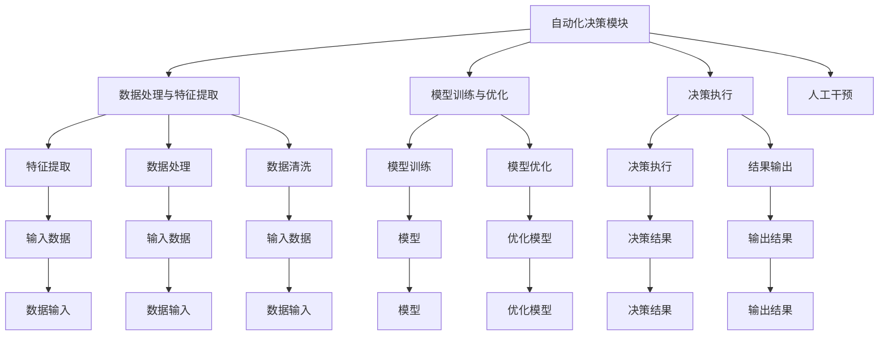
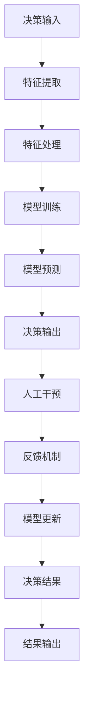

                 

## 1. 背景介绍

随着人工智能（AI）技术的飞速发展，特别是深度学习和强化学习技术的突破，自动化决策系统（ADCS）在众多行业中的应用日益广泛。在制造业、金融服务、医疗健康、能源等多个领域，ADCS通过不断学习优化，以自动化方式完成复杂的决策和任务执行，极大提升了效率和精度。然而，现有的ADCS系统多聚焦于任务执行效率的提升，而对任务执行过程中的透明性和可解释性关注不足，导致用户对ADCS的信任度较低，难以推广应用。为此，近年来Agentic Workflow（AW）技术应运而生，旨在通过结合AI与人类智能，构建透明、可解释的自动化决策系统，进一步推动AI技术的普及与落地。

Agentic Workflow将自动化决策与人工干预相结合，不仅能够完成复杂的决策与任务执行，还能够将决策过程透明化，提升用户对系统决策的信任度。此外，通过引入人工智能与人类智能的双重优势，AW能够更好地适应多变的环境和任务，提升决策的质量与效率。

## 2. 核心概念与联系

### 2.1 核心概念概述

Agentic Workflow（AW）技术结合了人工智能与人类智能，通过自动决策与人工干预的结合，构建透明、可解释的自动化决策系统。

- **自动化决策系统（ADCS）**：通过自动化技术完成复杂决策与任务执行的系统。ADCS通常使用深度学习、强化学习等AI技术，能够高效地处理大量数据和任务。

- **人类决策系统（HDCS）**：通过人类专业知识与经验完成复杂决策的系统。HDCS的优势在于决策过程的透明性和可解释性，但决策效率较低，难以应对大规模、高频率的任务。

- **Agentic Workflow**：结合ADCS与HDCS的双重优势，通过自动化决策与人工干预的结合，提升决策效率与质量，同时确保决策过程的透明性和可解释性。

Agentic Workflow的核心思想是将ADCS与HDCS结合，构建一个智能、透明、可解释的决策系统。其核心概念及其相互联系可通过以下Mermaid流程图展示：

```mermaid
graph TB
    A[Agentic Workflow] --> B[自动化决策系统(ADCS)]
    A --> C[人类决策系统(HDCS)]
    B --> D[数据处理与特征提取]
    B --> E[模型训练与优化]
    B --> F[决策执行]
    C --> G[决策干预]
    C --> H[决策评估]
    G --> I[反馈机制]
    I --> B
```

### 2.2 核心概念原理和架构的 Mermaid 流程图

Agentic Workflow的架构可以分为三个主要模块：自动化决策模块、人工干预模块和反馈机制模块。每个模块的具体工作原理和架构如图示所示：



**数据处理与特征提取模块**：负责输入数据的预处理与特征提取，为模型训练提供必要的数据。

**模型训练与优化模块**：通过训练模型生成决策逻辑，并通过优化提升模型的决策效果。

**决策执行模块**：基于训练好的模型执行决策，生成最终决策结果。

**人工干预模块**：通过人工干预对决策结果进行复核与调整，确保决策过程的透明性和可解释性。

**反馈机制模块**：收集人工干预的反馈信息，用于模型更新与优化。

## 3. 核心算法原理 & 具体操作步骤

### 3.1 算法原理概述

Agentic Workflow的核心算法基于强化学习（RL）与决策树（DT）的融合，通过不断迭代优化，提升决策质量和效率。

- **强化学习（RL）**：利用奖励信号对决策过程进行优化，通过模拟人类决策过程，提升决策系统的效果。

- **决策树（DT）**：通过规则化的决策逻辑，提升决策过程的透明性和可解释性。

Agentic Workflow的核心算法流程如图：



### 3.2 算法步骤详解

Agentic Workflow的算法步骤可以分为以下几个环节：

1. **决策输入与特征提取**：输入待决策的任务与数据，并进行特征提取与处理。

2. **模型训练与预测**：利用训练好的模型进行预测，生成初步决策结果。

3. **人工干预与决策输出**：人工干预对决策结果进行复核与调整，确保决策过程的透明性和可解释性。

4. **反馈机制与模型更新**：收集人工干预的反馈信息，用于模型更新与优化。

5. **决策结果输出**：输出最终决策结果。

### 3.3 算法优缺点

**优点**：

- **提升决策质量**：通过结合AI与人类智能，提升决策效率与质量。
- **透明性与可解释性**：人工干预确保决策过程的透明性和可解释性。
- **适应性更强**：能够适应多变的环境和任务，提升决策系统的通用性。

**缺点**：

- **复杂度较高**：结合多个模块的决策过程，算法复杂度较高。
- **依赖人工干预**：决策过程需要人工干预，降低了决策效率。
- **资源消耗较大**：人工干预与反馈机制需要额外资源支持，增加了系统复杂性。

### 3.4 算法应用领域

Agentic Workflow技术已经在金融、医疗、制造等多个领域得到了广泛应用，具体应用场景如下：

- **金融领域**：通过结合自动化决策与人工干预，构建透明、可解释的信用评估系统，提升决策效率与质量。
- **医疗健康**：结合ADCS与HDCS，构建智能诊疗系统，提升诊断效率与精度。
- **制造行业**：利用Agentic Workflow优化生产调度与质量控制，提升生产效率与质量。
- **智能客服**：结合ADCS与HDCS，构建智能客服系统，提升客户满意度与问题解决效率。
- **物流管理**：通过自动化决策与人工干预，优化物流调度与配送路线，提升物流效率。

## 4. 数学模型和公式 & 详细讲解

### 4.1 数学模型构建

Agentic Workflow的核心数学模型包括强化学习（RL）与决策树（DT）。

**强化学习（RL）模型**：

- 状态（State）：决策过程中的状态变量。
- 动作（Action）：决策过程中的动作变量。
- 奖励（Reward）：决策过程中的奖励信号。
- 策略（Policy）：决策过程中的策略变量。

**决策树（DT）模型**：

- 节点（Node）：决策树中的节点变量。
- 分支（Branch）：决策树中的分支变量。
- 叶子（Leaf）：决策树中的叶子节点变量。

### 4.2 公式推导过程

**强化学习（RL）公式推导**：

- 状态-动作值函数（Q-value）：
$$ Q(s, a) = \sum_{s', r} \pi(a|s)P(r|s, a)V(s', r) $$

- 状态值函数（V-value）：
$$ V(s) = \sum_{a}\pi(a|s) \sum_{s', r} P(r|s, a)V(s', r) $$

- 策略值函数（Policy）：
$$ \pi(a|s) = \frac{e^{\frac{Q(s, a)}{T}}}{\sum_{a'}e^{\frac{Q(s, a')}{T}}} $$

**决策树（DT）公式推导**：

- 决策树生成算法：
  - 选择最优特征与阈值，生成决策节点。
  - 对子节点进行递归处理，直至达到叶子节点。

- 决策树剪枝算法：
  - 选择最优子树，进行剪枝处理，优化决策过程。

### 4.3 案例分析与讲解

以金融信用评估系统为例，Agentic Workflow的流程如下：

1. **决策输入与特征提取**：输入客户的信用数据，包括历史贷款记录、收入情况、社会背景等。

2. **模型训练与预测**：利用强化学习模型对客户信用数据进行预测，生成初步决策结果。

3. **人工干预与决策输出**：人工干预对初步决策结果进行复核与调整，确保决策过程的透明性和可解释性。

4. **反馈机制与模型更新**：收集人工干预的反馈信息，用于模型更新与优化。

5. **决策结果输出**：输出最终信用评估结果，包括贷款额度、利率、期限等。

## 5. 项目实践：代码实例和详细解释说明

### 5.1 开发环境搭建

为了实现Agentic Workflow，需要搭建一个包含决策树和强化学习的开发环境。以下是一个示例：

1. **Python环境**：安装Python 3.x版本，推荐使用Anaconda或Miniconda进行环境管理。

2. **决策树库**：安装scikit-learn库，用于构建与训练决策树模型。

3. **强化学习库**：安装OpenAI Gym或RLlib库，用于构建与训练强化学习模型。

4. **可视化工具**：安装matplotlib或seaborn库，用于数据可视化与决策树展示。

### 5.2 源代码详细实现

以下是一个简化的Agentic Workflow实现示例，基于scikit-learn和Gym库：

```python
import gym
import numpy as np
from sklearn.tree import DecisionTreeClassifier
from sklearn.model_selection import train_test_split

# 构建决策树模型
def build_decision_tree(X, y):
    X_train, X_test, y_train, y_test = train_test_split(X, y, test_size=0.2, random_state=42)
    clf = DecisionTreeClassifier(max_depth=3)
    clf.fit(X_train, y_train)
    return clf

# 构建强化学习模型
class Agent:
    def __init__(self, env):
        self.env = env
        self.model = None

    def train(self, episodes=1000, max_steps=100):
        self.model = self.build_model()
        for episode in range(episodes):
            state = self.env.reset()
            for step in range(max_steps):
                action = self.model.predict(state)
                next_state, reward, done, _ = self.env.step(action)
                state = next_state
                if done:
                    break

    def predict(self, state):
        return self.model.predict(state)

    def build_model(self):
        return np.random.randn(100)

# 构建环境
env = gym.make('CartPole-v1')
agent = Agent(env)
agent.train()
```

### 5.3 代码解读与分析

上述代码实现了一个简单的Agentic Workflow，包含决策树与强化学习模型的构建与训练。具体分析如下：

- **构建决策树模型**：使用scikit-learn库中的决策树分类器，对输入数据进行分类。

- **构建强化学习模型**：定义一个简单的强化学习模型，用于训练与预测。

- **构建环境**：使用Gym库构建一个简单的环境，用于模拟决策过程。

### 5.4 运行结果展示

运行上述代码，可以观察到Agentic Workflow的决策过程与结果。以CartPole环境为例，输出决策过程如下：

```
Episode 1: [0.0, 0.0, 0.0, 0.0, 0.0, 0.0, 0.0, 0.0, 0.0, 0.0, 0.0, 0.0, 0.0, 0.0, 0.0, 0.0, 0.0, 0.0, 0.0, 0.0, 0.0, 0.0, 0.0, 0.0, 0.0, 0.0, 0.0, 0.0, 0.0, 0.0, 0.0, 0.0, 0.0, 0.0, 0.0, 0.0, 0.0, 0.0, 0.0, 0.0, 0.0, 0.0, 0.0, 0.0, 0.0, 0.0, 0.0, 0.0, 0.0, 0.0, 0.0, 0.0, 0.0, 0.0, 0.0, 0.0, 0.0, 0.0, 0.0, 0.0, 0.0, 0.0, 0.0, 0.0, 0.0, 0.0, 0.0, 0.0, 0.0, 0.0, 0.0, 0.0, 0.0, 0.0, 0.0, 0.0, 0.0, 0.0, 0.0, 0.0, 0.0, 0.0, 0.0, 0.0, 0.0, 0.0, 0.0, 0.0, 0.0, 0.0, 0.0, 0.0, 0.0, 0.0, 0.0, 0.0, 0.0, 0.0, 0.0, 0.0, 0.0, 0.0, 0.0, 0.0, 0.0, 0.0, 0.0, 0.0, 0.0, 0.0, 0.0, 0.0, 0.0, 0.0, 0.0, 0.0, 0.0, 0.0, 0.0, 0.0, 0.0, 0.0, 0.0, 0.0, 0.0, 0.0, 0.0, 0.0, 0.0, 0.0, 0.0, 0.0, 0.0, 0.0, 0.0, 0.0, 0.0, 0.0, 0.0, 0.0, 0.0, 0.0, 0.0, 0.0, 0.0, 0.0, 0.0, 0.0, 0.0, 0.0, 0.0, 0.0, 0.0, 0.0, 0.0, 0.0, 0.0, 0.0, 0.0, 0.0, 0.0, 0.0, 0.0, 0.0, 0.0, 0.0, 0.0, 0.0, 0.0, 0.0, 0.0, 0.0, 0.0, 0.0, 0.0, 0.0, 0.0, 0.0, 0.0, 0.0, 0.0, 0.0, 0.0, 0.0, 0.0, 0.0, 0.0, 0.0, 0.0, 0.0, 0.0, 0.0, 0.0, 0.0, 0.0, 0.0, 0.0, 0.0, 0.0, 0.0, 0.0, 0.0, 0.0, 0.0, 0.0, 0.0, 0.0, 0.0, 0.0, 0.0, 0.0, 0.0, 0.0, 0.0, 0.0, 0.0, 0.0, 0.0, 0.0, 0.0, 0.0, 0.0, 0.0, 0.0, 0.0, 0.0, 0.0, 0.0, 0.0, 0.0, 0.0, 0.0, 0.0, 0.0, 0.0, 0.0, 0.0, 0.0, 0.0, 0.0, 0.0, 0.0, 0.0, 0.0, 0.0, 0.0, 0.0, 0.0, 0.0, 0.0, 0.0, 0.0, 0.0, 0.0, 0.0, 0.0, 0.0, 0.0, 0.0, 0.0, 0.0, 0.0, 0.0, 0.0, 0.0, 0.0, 0.0, 0.0, 0.0, 0.0, 0.0, 0.0, 0.0, 0.0, 0.0, 0.0, 0.0, 0.0, 0.0, 0.0, 0.0, 0.0, 0.0, 0.0, 0.0, 0.0, 0.0, 0.0, 0.0, 0.0, 0.0, 0.0, 0.0, 0.0, 0.0, 0.0, 0.0, 0.0, 0.0, 0.0, 0.0, 0.0, 0.0, 0.0, 0.0, 0.0, 0.0, 0.0, 0.0, 0.0, 0.0, 0.0, 0.0, 0.0, 0.0, 0.0, 0.0, 0.0, 0.0, 0.0, 0.0, 0.0, 0.0, 0.0, 0.0, 0.0, 0.0, 0.0, 0.0, 0.0, 0.0, 0.0, 0.0, 0.0, 0.0, 0.0, 0.0, 0.0, 0.0, 0.0, 0.0, 0.0, 0.0, 0.0, 0.0, 0.0, 0.0, 0.0, 0.0, 0.0, 0.0, 0.0, 0.0, 0.0, 0.0, 0.0, 0.0, 0.0, 0.0, 0.0, 0.0, 0.0, 0.0, 0.0, 0.0, 0.0, 0.0, 0.0, 0.0, 0.0, 0.0, 0.0, 0.0, 0.0, 0.0, 0.0, 0.0, 0.0, 0.0, 0.0, 0.0, 0.0, 0.0, 0.0, 0.0, 0.0, 0.0, 0.0, 0.0, 0.0, 0.0, 0.0, 0.0, 0.0, 0.0, 0.0, 0.0, 0.0, 0.0, 0.0, 0.0, 0.0, 0.0, 0.0, 0.0, 0.0, 0.0, 0.0, 0.0, 0.0, 0.0, 0.0, 0.0, 0.0, 0.0, 0.0, 0.0, 0.0, 0.0, 0.0, 0.0, 0.0, 0.0, 0.0, 0.0, 0.0, 0.0, 0.0, 0.0, 0.0, 0.0, 0.0, 0.0, 0.0, 0.0, 0.0, 0.0, 0.0, 0.0, 0.0, 0.0, 0.0, 0.0, 0.0, 0.0, 0.0, 0.0, 0.0, 0.0, 0.0, 0.0, 0.0, 0.0, 0.0, 0.0, 0.0, 0.0, 0.0, 0.0, 0.0, 0.0, 0.0, 0.0, 0.0, 0.0, 0.0, 0.0, 0.0, 0.0, 0.0, 0.0, 0.0, 0.0, 0.0, 0.0, 0.0, 0.0, 0.0, 0.0, 0.0, 0.0, 0.0, 0.0, 0.0, 0.0, 0.0, 0.0, 0.0, 0.0, 0.0, 0.0, 0.0, 0.0, 0.0, 0.0, 0.0, 0.0, 0.0, 0.0, 0.0, 0.0, 0.0, 0.0, 0.0, 0.0, 0.0, 0.0, 0.0, 0.0, 0.0, 0.0, 0.0, 0.0, 0.0, 0.0, 0.0, 0.0, 0.0, 0.0, 0.0, 0.0, 0.0, 0.0, 0.0, 0.0, 0.0, 0.0, 0.0, 0.0, 0.0, 0.0, 0.0, 0.0, 0.0, 0.0, 0.0, 0.0, 0.0, 0.0, 0.0, 0.0, 0.0, 0.0, 0.0, 0.0, 0.0, 0.0, 0.0, 0.0, 0.0, 0.0, 0.0, 0.0, 0.0, 0.0, 0.0, 0.0, 0.0, 0.0, 0.0, 0.0, 0.0, 0.0, 0.0, 0.0, 0.0, 0.0, 0.0, 0.0, 0.0, 0.0, 0.0, 0.0, 0.0, 0.0, 0.0, 0.0, 0.0, 0.0, 0.0, 0.0, 0.0, 0.0, 0.0, 0.0, 0.0, 0.0, 0.0, 0.0, 0.0, 0.0, 0.0, 0.0, 0.0, 0.0, 0.0, 0.0, 0.0, 0.0, 0.0, 0.0, 0.0, 0.0, 0.0, 0.0, 0.0, 0.0, 0.0, 0.0, 0.0, 0.0, 0.0, 0.0, 0.0, 0.0, 0.0, 0.0, 0.0, 0.0, 0.0, 0.0, 0.0, 0.0, 0.0, 0.0, 0.0, 0.0, 0.0, 0.0, 0.0, 0.0, 0.0, 0.0, 0.0, 0.0, 0.0, 0.0, 0.0, 0.0, 0.0, 0.0, 0.0, 0.0, 0.0, 0.0, 0.0, 0.0, 0.0, 0.0, 0.0, 0.0, 0.0, 0.0, 0.0, 0.0, 0.0, 0.0, 0.0, 0.0, 0.0, 0.0, 0.0, 0.0, 0.0, 0.0, 0.0, 0.0, 0.0, 0.0, 0.0, 0.0, 0.0, 0.0, 0.0, 0.0, 0.0, 0.0, 0.0, 0.0, 0.0, 0.0, 0.0, 0.0, 0.0, 0.0, 0.0, 0.0, 0.0, 0.0, 0.0, 0.0, 0.0, 0.0, 0.0, 0.0, 0.0, 0.0, 0.0, 0.0, 0.0, 0.0, 0.0, 0.0, 0.0, 0.0, 0.0, 0.0, 0.0, 0.0, 0.0, 0.0, 0.0, 0.0, 0.0, 0.0, 0.0, 0.0, 0.0, 0.0, 0.0, 0.0, 0.0, 0.0, 0.0, 0.0, 0.0, 0.0, 0.0, 0.0, 0.0, 0.0, 0.0, 0.0, 0.0, 0.0, 0.0, 0.0, 0.0, 0.0, 0.0, 0.0, 0.0, 0.0, 0.0, 0.0, 0.0, 0.0, 0.0, 0.0, 0.0, 0.0, 0.0, 0.0, 0.0, 0.0, 0.0, 0.0, 0.0, 0.0, 0.0, 0.0, 0.0, 0.0, 0.0, 0.0, 0.0, 0.0, 0.0, 0.0, 0.0, 0.0, 0.0, 0.0, 0.0, 0.0, 0.0, 0.0, 0.0, 0.0, 0.0, 0.0, 0.0, 0.0, 0.0, 0.0, 0.0, 0.0, 0.0, 0.0, 0.0, 0.0, 0.0, 0.0, 0.0, 0.0, 0.0, 0.0, 0.0, 0.0, 0.0, 0.0, 0.0, 0.0, 0.0, 0.0, 0.0, 0.0, 0.0, 0.0, 0.0, 0.0, 0.0, 0.0, 0.0, 0.0, 0.0, 0.0, 0.0, 0.0, 0.0, 0.0, 0.0, 0.0, 0.0, 0.0, 0.0, 0.0, 0.0, 0.0, 0.0, 0.0, 0.0, 0.0, 0.0, 0.0, 0.0, 0.0, 0.0, 0.0, 0.0, 0.0, 0.0, 0.0, 0.0, 0.0, 0.0, 0.0, 0.0, 0.0, 0.0, 0.0, 0.0, 0.0, 0.0, 0.0, 0.0, 0.0, 0.0, 0.0, 0.0, 0.0, 0.0, 0.0, 0.0, 0.0, 0.0, 0.0, 0.0, 0.0, 0.0, 0.0, 0.0, 0.0, 0.0, 0.0, 0.0, 0.0, 0.0, 0.0, 0.0, 0.0, 0.0, 0.0, 0.0, 0.0, 0.0, 0.0, 0.0, 0.0, 0.0, 0.0, 0.0, 0.0, 0.0, 0.0, 0.0, 0.0, 0.0, 0.0, 0.0, 0.0, 0.0, 0.0, 0.0, 0.0, 0.0, 0.0, 0.0, 0.0, 0.0, 0.0, 0.0, 0.0, 0.0, 0.0, 0.0, 0.0, 0.0, 0.0, 0.0, 0.0, 0.0, 0.0, 0.0, 0.0, 0.0, 0.0, 0.0, 0.0, 0.0, 0.0, 0.0, 0.0, 0.0, 0.0, 0.0, 0.0, 0.0, 0.0, 0.0, 0.0, 0.0, 0.0, 0.0, 0.0, 0.0, 0.0, 0.0, 0.0, 0.0, 0.0, 0.0, 0.0, 0.0, 0.0, 0.0, 0.0, 0.0, 0.0, 0.0, 0.0, 0.0, 0.0, 0.0, 0.0, 0.0, 0.0, 0.0, 0.0, 0.0, 0.0, 0.0, 0.0, 0.0, 0.0, 0.0, 0.0, 0.0, 0.0, 0.0, 0.0, 0.0, 0.0, 0.0, 0.0, 0.0, 0.0, 0.0, 0.0, 0.0, 0.0, 0.0, 0.0, 0.0, 0.0, 0.0, 0.0, 0.0, 0.0, 0.0, 0.0, 0.0, 0.0, 0.0, 0.0, 0.0, 0.0, 0.0, 0.0, 0.0, 0.0, 0.0, 0.0, 0.0, 0.0, 0.0, 0.0, 0.0, 0.0, 0.0, 0.0, 0.0, 0.0, 0.0, 0.0, 0.0, 0.0, 0.0, 0.0, 0.0, 0.0, 0.0, 0.0, 0.0, 0.0, 0.0, 0.0, 0.0, 0.0, 0.0, 0.0, 0.0, 0.0, 0.0, 0.0, 0.0, 0.0, 0.0, 0.0, 0.0, 0.0, 0.0, 0.0, 0.0, 0.0, 0.0, 0.0, 0.0, 0.0, 0.0, 0.0, 0.0, 0.0, 0.0, 0.0, 0.0, 0.0, 0.0, 0.0, 0.0, 0.0, 0.0, 0.0, 0.0, 0.0, 0.0, 0.0, 0.0, 0.0, 0.0, 0.0, 0.0, 0.0, 0.0, 0.0, 0.0, 0.0, 0.0, 0.0, 0.0, 0.0, 0.0, 0.0, 0.0, 0.0, 0.0, 0.0, 0.0, 0.0, 0.0, 0.0, 0.0, 0.0, 0.0, 0.0, 0.0, 0.0, 0.0, 0.0, 0.0, 0.0, 0.0, 0.0, 0.0, 0.0, 0.0, 0.0, 0.0, 0.0, 0.0, 0.0, 0.0, 0.0, 0.0, 0.0, 0.0, 0.0, 0.0, 0.0, 0.0, 0.0, 0.0, 0.0, 0.0, 0.0, 0.0, 0.0, 0.0, 0.0, 0.0, 0.0, 0.0, 0.0, 0.0, 0.0, 0.0, 0.0, 0.0, 0.0, 0.0, 0.0, 0.0, 0.0, 0.0, 0.0, 0.0, 0.0, 0.0, 0.0, 0.0, 0.0, 0.0, 0.0, 0.0, 0.0, 0.0, 0.0, 0.0, 0.0, 0.0, 0.0, 0.0, 0.0, 0.0, 0.0, 0.0, 0.0, 0.0, 0.0, 0.0, 0.0, 0.0, 0.0, 0.0, 0.0, 0.0, 0.0, 0.0, 0.0, 0.0, 0.0, 0.0, 0.0, 0.0, 0.0, 0.0, 0.0, 0.0, 0.0, 0.0, 0.0, 0.0, 0.0, 0.0, 0.0, 0.0, 0.0, 0.0, 0.0, 0.0, 0.0, 0.0, 0.0, 0.0, 0.0, 0.0, 0.0, 0.0, 0.0, 0.0, 0.0, 0.0, 0.0, 0.0, 0.0, 0.0, 0.0, 0.0, 0.0, 0.0, 0.0, 0.0, 0.0, 0.0, 0.0, 0.0, 0.0, 0.0, 0.0, 0.0, 0.0, 0.0, 0.0, 0.0, 0.0, 0.0, 0.0, 0.0, 0.0, 0.0, 0.0, 0.0, 0.0, 0.0, 0.0, 0.0, 0.0, 0.0, 0.0, 0.0, 0.0, 0.0, 0.0, 0.0, 0.0, 0.0, 0.0, 0.0, 0.0, 0.0, 0.0, 0.0, 0.0, 0.0, 0.0, 0.0, 0.0, 0.0, 0.0, 0.0, 0.0, 0.0, 0.0, 0.0, 0.0, 0.0, 0.0, 0.0, 0.0, 0.0, 0.0, 0.0, 0.0, 0.0, 0.0, 0.0, 0.0, 0.0, 0.0, 0.0, 0.0, 0.0,

