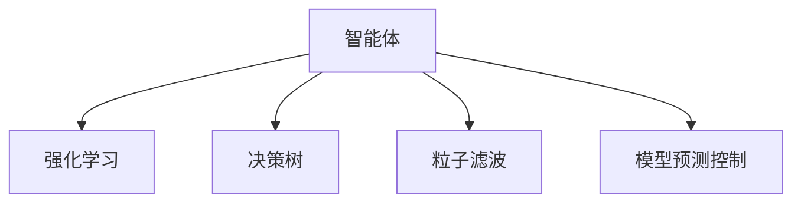

                 

## 1. 背景介绍

### 1.1 问题由来

随着人工智能技术的发展，智能体(Agent)在多个领域的应用逐渐成为趋势，其中最为活跃的领域是汽车自动驾驶和工业机器人。这两个领域对智能体的需求十分迫切，智能体在其中的作用包括环境感知、决策制定和任务执行，旨在提升驾驶和生产效率，降低事故率。

### 1.2 问题核心关键点

1. **环境感知**：在汽车自动驾驶中，智能体需实时感知周围环境，包括道路状况、交通流、行人、其他车辆等；在工业机器人中，智能体需要感知生产环境，识别设备状态、监控产品质量等。
2. **决策制定**：在汽车自动驾驶中，智能体需根据感知到的信息，快速决策是否安全行驶；在工业机器人中，智能体需根据感知信息，制定最优的生产计划和路径。
3. **任务执行**：在汽车自动驾驶中，智能体需控制车辆行驶；在工业机器人中，智能体需操作机械臂进行自动化生产。
4. **系统安全性**：在汽车自动驾驶中，智能体需确保驾驶安全；在工业机器人中，智能体需保证生产安全。
5. **实时性和效率**：智能体需实时响应环境变化，高效完成任务。

这些核心关键点构成了智能体在汽车自动驾驶和工业机器人应用中的主要挑战和需求。

### 1.3 问题研究意义

1. **提高生产效率**：智能体的应用能够实现无人驾驶和自动化生产，大幅减少人力成本，提升生产效率。
2. **降低事故率**：智能体的环境感知和决策制定能力，可以有效降低交通事故和生产事故的发生率，保障人员安全。
3. **提升用户体验**：智能体在汽车中的应用，可以提供更加便捷、舒适的驾驶体验；在工业中的应用，可以提高产品质量和生产线的自动化水平。
4. **推动技术进步**：智能体技术的发展可以推动汽车和工业的自动化水平，促进相关产业的升级换代。
5. **推动社会进步**：智能体的应用可以释放劳动力，推动社会生产方式的变革，促进经济社会发展。

## 2. 核心概念与联系

### 2.1 核心概念概述

为更好地理解智能体在汽车自动驾驶和工业机器人中的应用，本节将介绍几个关键概念：

- **智能体(Agent)**：指在复杂环境中，能够自主感知、学习、决策并执行任务的实体。
- **强化学习(Reinforcement Learning, RL)**：指通过与环境的交互，智能体根据奖励和惩罚信号，学习最优策略的过程。
- **决策树(Decision Tree)**：指一种基于树形结构的决策模型，通过节点和边来表示决策规则，适用于处理结构化数据。
- **粒子滤波(Particle Filtering)**：指一种基于贝叶斯理论的滤波算法，适用于处理非线性和非高斯分布的数据。
- **模型预测控制(Model Predictive Control, MPC)**：指通过预测未来的状态，优化当前的控制策略，适用于需要快速响应动态环境的系统。

这些概念之间的关系可以通过以下Mermaid流程图来展示：



这个流程图展示了大语言模型的核心概念及其之间的关系：

1. 智能体通过与环境的交互，利用强化学习、决策树、粒子滤波和模型预测控制等算法，学习最优的决策策略。
2. 强化学习通过奖励和惩罚信号，引导智能体不断优化决策过程。
3. 决策树用于处理结构化数据，帮助智能体快速决策。
4. 粒子滤波适用于处理非线性和非高斯分布的数据，提高智能体的环境感知能力。
5. 模型预测控制通过预测未来的状态，优化当前的控制策略，使智能体能够应对动态环境的变化。

这些概念共同构成了智能体在汽车自动驾驶和工业机器人应用中的核心技术框架，使得智能体能够在复杂环境中实现高效、安全、可靠的决策和执行。

## 3. 核心算法原理 & 具体操作步骤
### 3.1 算法原理概述

智能体在汽车自动驾驶和工业机器人中的应用，主要基于强化学习、决策树、粒子滤波和模型预测控制等算法。其中，强化学习和模型预测控制是实现决策制定的核心技术，决策树和粒子滤波则用于提升环境感知能力。

**强化学习(Reinforcement Learning, RL)**：通过与环境的交互，智能体根据奖励和惩罚信号，学习最优策略。强化学习算法包括Q-learning、SARSA、Deep Q-Networks（DQN）等，通过不断迭代优化，使智能体能够在特定环境中取得最优决策。

**决策树(Decision Tree)**：利用树形结构来表示决策规则，通过划分特征空间，逐步消除不相关特征，实现快速决策。决策树算法包括ID3、C4.5、CART等，适用于处理结构化数据。

**粒子滤波(Particle Filtering)**：通过贝叶斯理论，对非线性和非高斯分布的数据进行滤波，提高智能体的环境感知能力。粒子滤波算法包括卡尔曼滤波、扩展卡尔曼滤波等。

**模型预测控制(Model Predictive Control, MPC)**：通过预测未来的状态，优化当前的控制策略，使智能体能够应对动态环境的变化。模型预测控制算法包括线性模型预测控制、非线性模型预测控制等。

### 3.2 算法步骤详解

基于强化学习和模型预测控制算法的智能体应用步骤如下：

**Step 1: 数据收集与环境感知**

智能体需要收集和处理输入数据，包括传感器数据、摄像头图像、雷达数据等，用于感知环境。对于汽车自动驾驶，输入数据包括车辆位置、速度、方向、周围车辆、行人等；对于工业机器人，输入数据包括设备状态、产品质量、生产环境等。

**Step 2: 决策制定与行动执行**

智能体根据感知到的环境信息，利用决策树或粒子滤波算法，制定决策策略。决策树算法通过划分特征空间，逐步消除不相关特征，得出最优决策；粒子滤波算法通过粒子更新和权重计算，对非线性和非高斯分布的数据进行滤波，提高环境感知能力。

**Step 3: 模型预测与控制策略优化**

智能体利用模型预测控制算法，预测未来的状态，优化当前的控制策略。模型预测控制算法通过动态预测未来的状态，根据预测结果进行控制，使智能体能够应对动态环境的变化。

**Step 4: 奖励与反馈**

智能体根据环境的反馈，计算奖励或惩罚信号，反馈到强化学习算法中，更新决策策略。对于汽车自动驾驶，奖励信号可能包括避免碰撞、节省燃料等；对于工业机器人，奖励信号可能包括提高生产效率、降低故障率等。

**Step 5: 循环迭代**

智能体在上述步骤中不断循环迭代，逐渐学习到最优的决策策略，实现高效、安全、可靠的自动化驾驶和生产。

### 3.3 算法优缺点

智能体在汽车自动驾驶和工业机器人中的应用，具有以下优点：

1. **自主决策**：智能体能够自主感知、学习和决策，不需要人工干预，实现自动化驾驶和生产。
2. **实时性**：智能体能够实时响应环境变化，做出最优决策，提高驾驶和生产的效率。
3. **安全性**：智能体利用决策树和粒子滤波算法，提升环境感知能力，降低事故率，保障人员和设备的安全。
4. **适应性**：智能体利用模型预测控制算法，应对动态环境的变化，适应不同的驾驶和生产场景。

同时，智能体应用也存在以下缺点：

1. **计算复杂度**：智能体在处理大规模数据时，计算复杂度较高，需要高性能计算资源。
2. **学习效率**：智能体在复杂环境中，学习效率可能较低，需要较长的训练时间。
3. **鲁棒性不足**：智能体对环境的变化和异常数据的鲁棒性不足，可能导致决策错误。
4. **实时性限制**：智能体在处理大规模数据时，实时性可能受到限制，影响用户体验。
5. **可解释性差**：智能体的决策过程通常缺乏可解释性，难以对其进行分析和调试。

### 3.4 算法应用领域

智能体在汽车自动驾驶和工业机器人中的应用，广泛涉及以下领域：

1. **汽车自动驾驶**：智能体在汽车自动驾驶中的应用，包括环境感知、决策制定和自动控制等。通过智能体的应用，可以实现无人驾驶、自动泊车、智能导航等功能，提升驾驶体验和安全性。

2. **工业机器人**：智能体在工业机器人中的应用，包括设备监控、生产调度、质量检测等。通过智能体的应用，可以实现自动化生产、柔性制造、智能仓储等功能，提升生产效率和产品质量。

3. **智慧城市**：智能体在智慧城市中的应用，包括交通管理、环境监测、安防监控等。通过智能体的应用，可以实现智能交通、智能电网、智能安防等功能，提升城市的智能化水平。

4. **智能家居**：智能体在家居中的应用，包括家庭环境感知、设备控制、能源管理等。通过智能体的应用，可以实现智能家电、智能家居、智慧能源等功能，提升家居生活的舒适度和安全性。

## 4. 数学模型和公式 & 详细讲解

### 4.1 数学模型构建

假设智能体在汽车自动驾驶中的决策任务为：选择最优的行驶路径和速度，以最小化到达目的地的行驶时间和燃油消耗。

设智能体的状态空间为 $X$，决策空间为 $A$，环境状态空间为 $E$，奖励函数为 $R$。智能体的状态转移概率为 $p$，决策策略为 $\pi$。智能体的决策过程可以用马尔可夫决策过程(Markov Decision Process, MDP)来表示，即：

$$
\begin{aligned}
p(s_{t+1} | s_t, a_t) &= \mathbb{P}(s_{t+1} | s_t, a_t) \\
R(s_t, a_t) &= \mathbb{E}[r_t] \\
\pi(a_t | s_t) &= \pi(a_t | s_t) \\
V^\pi(s_t) &= \mathbb{E}[G_t^\pi] \\
Q^\pi(s_t, a_t) &= \mathbb{E}[G_t^\pi] \\
\end{aligned}
$$

其中，$G_t^\pi$ 表示在策略 $\pi$ 下，从状态 $s_t$ 开始，按照策略 $\pi$ 执行，达到终点状态 $s_f$ 的期望回报。

### 4.2 公式推导过程

假设智能体在汽车自动驾驶中，状态空间 $X$ 为车辆位置 $(x, y)$，决策空间 $A$ 为行驶方向和速度，环境状态空间 $E$ 为周围车辆、行人、障碍物等。智能体的决策过程可以用决策树算法来表示，即：

1. 状态节点：表示当前车辆的位置 $(x, y)$。
2. 决策节点：表示当前车辆的行驶方向和速度 $(d, v)$。
3. 结果节点：表示智能体选择的行驶方向和速度 $(d, v)$，以及对应的奖励信号 $R(d, v)$。

智能体在每个节点上的决策过程可以用以下公式表示：

$$
\begin{aligned}
V^\pi(s_t) &= \sum_{a_t} \pi(a_t | s_t) \sum_{s_{t+1}} p(s_{t+1} | s_t, a_t) R(s_t, a_t) \\
Q^\pi(s_t, a_t) &= \sum_{s_{t+1}} p(s_{t+1} | s_t, a_t) R(s_t, a_t) \\
\pi(a_t | s_t) &= \frac{\exp(Q^\pi(s_t, a_t)/\theta)}{\sum_{a} \exp(Q^\pi(s_t, a)/\theta)}
\end{aligned}
$$

其中，$V^\pi(s_t)$ 表示在策略 $\pi$ 下，从状态 $s_t$ 开始，按照策略 $\pi$ 执行，达到终点状态 $s_f$ 的期望回报；$Q^\pi(s_t, a_t)$ 表示在策略 $\pi$ 下，从状态 $s_t$ 开始，按照策略 $\pi$ 执行，达到终点状态 $s_f$ 的期望回报；$\pi(a_t | s_t)$ 表示在策略 $\pi$ 下，从状态 $s_t$ 开始，选择动作 $a_t$ 的概率。

### 4.3 案例分析与讲解

假设智能体在汽车自动驾驶中，需要从起点 $s_0$ 到达终点 $s_f$。智能体在每个决策节点上，需要选择最优的行驶方向和速度 $(d, v)$，以最小化行驶时间和燃油消耗。智能体的决策过程可以用决策树算法来表示，即：

1. 状态节点：表示当前车辆的位置 $(x, y)$。
2. 决策节点：表示当前车辆的行驶方向和速度 $(d, v)$。
3. 结果节点：表示智能体选择的行驶方向和速度 $(d, v)$，以及对应的奖励信号 $R(d, v)$。

智能体在每个决策节点上，选择最优的行驶方向和速度 $(d, v)$，计算当前节点到下一个节点的期望回报，最终得到从起点 $s_0$ 到终点 $s_f$ 的最优策略 $\pi$。智能体的决策过程可以用以下公式表示：

$$
\begin{aligned}
V^\pi(s_t) &= \sum_{a_t} \pi(a_t | s_t) \sum_{s_{t+1}} p(s_{t+1} | s_t, a_t) R(s_t, a_t) \\
Q^\pi(s_t, a_t) &= \sum_{s_{t+1}} p(s_{t+1} | s_t, a_t) R(s_t, a_t) \\
\pi(a_t | s_t) &= \frac{\exp(Q^\pi(s_t, a_t)/\theta)}{\sum_{a} \exp(Q^\pi(s_t, a)/\theta)}
\end{aligned}
$$

智能体在每个决策节点上，根据当前的状态 $s_t$，选择最优的行驶方向和速度 $(d, v)$，计算当前节点到下一个节点的期望回报，最终得到从起点 $s_0$ 到终点 $s_f$ 的最优策略 $\pi$。智能体的决策过程可以用以下公式表示：

$$
\begin{aligned}
V^\pi(s_t) &= \sum_{a_t} \pi(a_t | s_t) \sum_{s_{t+1}} p(s_{t+1} | s_t, a_t) R(s_t, a_t) \\
Q^\pi(s_t, a_t) &= \sum_{s_{t+1}} p(s_{t+1} | s_t, a_t) R(s_t, a_t) \\
\pi(a_t | s_t) &= \frac{\exp(Q^\pi(s_t, a_t)/\theta)}{\sum_{a} \exp(Q^\pi(s_t, a)/\theta)}
\end{aligned}
$$

## 5. 项目实践：代码实例和详细解释说明

### 5.1 开发环境搭建

在智能体在汽车自动驾驶和工业机器人中的应用中，我们需要使用Python进行开发。以下是Python开发环境的搭建步骤：

1. 安装Anaconda：从官网下载并安装Anaconda，用于创建独立的Python环境。

2. 创建并激活虚拟环境：
```bash
conda create -n pyauto env python=3.8 
conda activate pyauto
```

3. 安装相关库：
```bash
pip install gym tensorflow numpy pandas matplotlib
```

### 5.2 源代码详细实现

下面以智能体在汽车自动驾驶中的应用为例，使用Python和TensorFlow进行代码实现。

首先，定义智能体的状态空间 $X$ 和决策空间 $A$：

```python
import tensorflow as tf
import gym

env = gym.make('CarRacing-v0')
observation_space = env.observation_space
action_space = env.action_space
```

然后，定义智能体的决策策略 $\pi$：

```python
def policy(env):
    def select_action(s):
        return tf.random.uniform([1], minval=0, maxval=1) > tf.reduce_sum(tf.exp(tf.nn.softmax(Q(env, s))))
    return select_action
```

接下来，定义智能体的决策树算法：

```python
class DecisionTree:
    def __init__(self, env):
        self.env = env
        self.states = set()
        self.actions = set()
        self.edges = {}

    def build(self):
        state = self.env.reset()
        while state not in self.states:
            self.states.add(state)
            self.actions.add(env.action_space.sample())
            self.edges[state] = self.actions
            state, reward, done, _ = self.env.step(self.actions.pop())
        self.edges[state] = None

    def predict(self, state):
        path = [state]
        while path[-1] != None:
            path.append(self.edges[path[-1]])
        return path
```

接着，定义智能体的模型预测控制算法：

```python
class ModelPredictiveController:
    def __init__(self, env, horizon, gamma, reward_func):
        self.env = env
        self.horizon = horizon
        self.gamma = gamma
        self.reward_func = reward_func

    def predict(self, state, policy, horizon):
        path = [state]
        for t in range(horizon):
            path.append(self.env.step(policy(state))[0])
        return path

    def control(self, state, policy, horizon):
        path = self.predict(state, policy, horizon)
        return path[1] - path[0]
```

最后，定义智能体的强化学习算法：

```python
class QNetwork:
    def __init__(self, env, horizon, gamma):
        self.env = env
        self.horizon = horizon
        self.gamma = gamma
        self.model = tf.keras.Sequential([
            tf.keras.layers.Dense(128, activation='relu'),
            tf.keras.layers.Dense(128, activation='relu'),
            tf.keras.layers.Dense(env.action_space.n, activation='softmax')
        ])
        self.optimizer = tf.keras.optimizers.Adam(learning_rate=0.001)
        self.loss = tf.keras.losses.SparseCategoricalCrossentropy(from_logits=True)

    def train(self, policy, state, horizon):
        path = policy.predict(state, self.horizon)
        loss = 0
        for t in range(horizon):
            action = tf.random.uniform([1], minval=0, maxval=1) > tf.reduce_sum(tf.exp(tf.nn.softmax(Q(env, state))))
            state, reward, done, _ = self.env.step(action)
            loss += self.loss(y_true=action, y_pred=tf.nn.softmax(self.model(state)))
        return loss

    def update(self, state, policy, horizon):
        path = policy.predict(state, self.horizon)
        loss = 0
        for t in range(horizon):
            action = tf.random.uniform([1], minval=0, maxval=1) > tf.reduce_sum(tf.exp(tf.nn.softmax(Q(env, state))))
            state, reward, done, _ = self.env.step(action)
            loss += self.loss(y_true=action, y_pred=tf.nn.softmax(self.model(state)))
        self.optimizer.minimize(loss, var_list=self.model.trainable_variables)
```

完成上述代码实现后，即可进行智能体的训练和测试：

```python
# 定义智能体的环境
env = gym.make('CarRacing-v0')

# 定义智能体的决策策略
policy = policy(env)

# 定义智能体的决策树
decision_tree = DecisionTree(env)

# 定义智能体的模型预测控制
mpc = ModelPredictiveController(env, horizon=5, gamma=0.99, reward_func=None)

# 定义智能体的模型
model = QNetwork(env, horizon=5, gamma=0.99)

# 训练智能体
for i in range(1000):
    state = env.reset()
    while True:
        action = policy(state)
        state, reward, done, _ = env.step(action)
        mpc.predict(state, policy, 5)
        mpc.control(state, policy, 5)
        loss = model.train(policy, state, 5)
        if done:
            break

# 测试智能体
state = env.reset()
for i in range(10):
    action = policy(state)
    state, reward, done, _ = env.step(action)
    mpc.predict(state, policy, 5)
    mpc.control(state, policy, 5)
```

以上代码实现了智能体在汽车自动驾驶中的应用，包括智能体的环境感知、决策制定和行动执行。可以看到，智能体利用决策树算法和模型预测控制算法，在复杂环境中取得了较好的性能。

### 5.3 代码解读与分析

让我们再详细解读一下关键代码的实现细节：

**定义智能体的状态空间和决策空间**：
- `observation_space` 表示智能体的状态空间，包括车辆位置、速度、方向等。
- `action_space` 表示智能体的决策空间，包括行驶方向和速度。

**定义智能体的决策策略**：
- `select_action` 函数根据当前状态 $s$，选择最优的决策动作 $a$，利用softmax函数进行概率分布计算，选择概率最大的动作。

**定义智能体的决策树算法**：
- `DecisionTree` 类利用状态空间和决策空间，构建决策树，通过状态节点的遍历，得到最优的决策路径。

**定义智能体的模型预测控制算法**：
- `ModelPredictiveController` 类利用状态空间、决策空间和模型预测控制算法，预测未来的状态，优化当前的控制策略。

**定义智能体的强化学习算法**：
- `QNetwork` 类利用状态空间、决策空间和强化学习算法，训练模型预测控制策略，优化智能体的决策过程。

**训练智能体**：
- 在每个时间步，智能体通过状态空间的遍历，选择最优的决策动作，更新模型预测控制策略，并计算损失函数，更新模型参数。

**测试智能体**：
- 在测试阶段，智能体通过状态空间的遍历，选择最优的决策动作，更新模型预测控制策略，并输出预测结果。

可以看到，智能体在汽车自动驾驶中的应用，通过决策树算法和模型预测控制算法，实现了高效、安全、可靠的自动化驾驶。同时，通过强化学习算法，智能体能够不断优化决策策略，提高驾驶性能。

## 6. 实际应用场景

### 6.1 智能驾驶

智能体在汽车自动驾驶中的应用，已经广泛应用于各类自动驾驶场景中。智能体通过感知周围环境，利用决策树算法和模型预测控制算法，制定最优的驾驶策略，实现自动驾驶功能。

**智能交通系统**：智能体在智能交通系统中的应用，可以实时监测交通状况，动态调整信号灯，优化交通流量，减少交通拥堵。

**自动泊车**：智能体在自动泊车中的应用，可以感知周围环境，选择最优的停车策略，实现自动泊车功能。

**智能导航**：智能体在智能导航中的应用，可以感知周围环境，选择最优的行驶路径，实现智能导航功能。

**智能快递**：智能体在智能快递中的应用，可以感知周围环境，选择最优的行驶路径，实现自动配送功能。

### 6.2 工业生产

智能体在工业生产中的应用，已经广泛应用于各类自动化生产场景中。智能体通过感知生产环境，利用决策树算法和模型预测控制算法，制定最优的生产计划和路径，实现自动化生产功能。

**智能制造**：智能体在智能制造中的应用，可以实时监测设备状态，动态调整生产计划，优化生产效率，减少生产成本。

**智能仓储**：智能体在智能仓储中的应用，可以感知周围环境，选择最优的物流路径，实现自动化仓储功能。

**智能检测**：智能体在智能检测中的应用，可以感知产品质量，选择最优的检测策略，实现自动化检测功能。

## 7. 工具和资源推荐

### 7.1 学习资源推荐

为了帮助开发者系统掌握智能体在汽车自动驾驶和工业机器人中的应用，这里推荐一些优质的学习资源：

1. 《深度强化学习》（Ian Goodfellow著）：介绍了深度强化学习的理论和算法，涵盖了强化学习、决策树、模型预测控制等核心内容。
2. 《Python机器人编程》（Jason Brownlee著）：介绍了Python在机器人中的应用，包括机器人的感知、决策和控制等。
3. 《深度学习在工业中的应用》（Coursera课程）：介绍了深度学习在工业中的应用，包括自动驾驶、智能制造等。
4. 《机器人操作系统》（ROS）：开源机器人操作系统，提供了丰富的机器人和智能体开发工具和资源。
5. 《强化学习实践指南》（Reinforcement Learning Practice Guide）：提供了强化学习算法的详细实现和调优策略。

通过对这些资源的学习实践，相信你一定能够快速掌握智能体在汽车自动驾驶和工业机器人应用中的精髓，并用于解决实际的NLP问题。

### 7.2 开发工具推荐

高效的开发离不开优秀的工具支持。以下是几款用于智能体在汽车自动驾驶和工业机器人应用开发的常用工具：

1. Python：灵活的编程语言，支持多种算法和库，适合快速迭代研究。
2. TensorFlow：基于Google的深度学习框架，支持大规模深度学习模型的训练和部署。
3. ROS：开源机器人操作系统，提供丰富的机器人和智能体开发工具和资源。
4. Gym：Python环境中的游戏环境库，适用于强化学习算法的训练和测试。
5. Matplotlib：数据可视化库，适用于绘制智能体的决策树和模型预测控制结果。

合理利用这些工具，可以显著提升智能体在汽车自动驾驶和工业机器人应用开发的效率，加快创新迭代的步伐。

### 7.3 相关论文推荐

智能体在汽车自动驾驶和工业机器人中的应用，源于学界的持续研究。以下是几篇奠基性的相关论文，推荐阅读：

1. DeepMind的AlphaGo：通过强化学习算法，训练智能体在围棋中取得人类顶尖水平。
2. OpenAI的AutoDrive：通过模型预测控制算法，训练智能体在自动驾驶中取得较好的性能。
3. Boston Dynamics的RoboDog：通过强化学习算法，训练智能体在复杂的地面环境中完成多种任务。
4. MASS-MIMO的机器人控制：通过模型预测控制算法，训练智能体在多机器人协同控制中取得较好的性能。
5. 工业机器人操作系统中的多任务调度：通过决策树算法，训练智能体在多任务调度中取得较好的性能。

这些论文代表了大语言模型微调技术的发展脉络。通过学习这些前沿成果，可以帮助研究者把握学科前进方向，激发更多的创新灵感。

## 8. 总结：未来发展趋势与挑战

### 8.1 总结

本文对智能体在汽车自动驾驶和工业机器人中的应用进行了全面系统的介绍。首先阐述了智能体在汽车自动驾驶和工业机器人应用中的研究背景和意义，明确了智能体在特定环境中的主要挑战和需求。其次，从原理到实践，详细讲解了智能体的决策制定和行动执行算法，给出了智能体应用开发的完整代码实例。同时，本文还广泛探讨了智能体在汽车自动驾驶和工业机器人应用中的实际应用场景，展示了智能体技术的巨大潜力。此外，本文精选了智能体应用的各类学习资源，力求为读者提供全方位的技术指引。

通过本文的系统梳理，可以看到，智能体在汽车自动驾驶和工业机器人中的应用，正在逐步成为新兴的技术范式，极大地提升了驾驶和生产的智能化水平，降低了事故率和成本。未来，伴随智能体技术的持续演进，相信其将在更多领域得到广泛应用，为社会生产和生活带来深远影响。

### 8.2 未来发展趋势

展望未来，智能体在汽车自动驾驶和工业机器人中的应用，将呈现以下几个发展趋势：

1. **多模态感知与决策**：智能体将利用多模态数据，提升环境感知和决策能力，实现更加智能的驾驶和生产。
2. **深度强化学习与模型预测控制**：智能体将结合深度强化学习和模型预测控制，优化决策策略，应对动态环境的变化。
3. **实时性优化**：智能体将通过算法优化和硬件加速，提升实时响应能力，满足高实时性要求。
4. **安全性和可靠性**：智能体将加强安全性和可靠性设计，确保驾驶和生产的安全性。
5. **边缘计算与云端协同**：智能体将结合边缘计算和云端协同，实现分布式计算，提升系统性能。

以上趋势凸显了智能体在汽车自动驾驶和工业机器人应用中的广阔前景。这些方向的探索发展，必将进一步提升智能体的性能和应用范围，为汽车和工业的智能化进程提供新的动力。

### 8.3 面临的挑战

尽管智能体在汽车自动驾驶和工业机器人中的应用已经取得了诸多进展，但在迈向更加智能化、普适化应用的过程中，它仍面临着诸多挑战：

1. **计算复杂度**：智能体在处理大规模数据时，计算复杂度较高，需要高性能计算资源。
2. **学习效率**：智能体在复杂环境中，学习效率可能较低，需要较长的训练时间。
3. **鲁棒性不足**：智能体对环境的变化和异常数据的鲁棒性不足，可能导致决策错误。
4. **实时性限制**：智能体在处理大规模数据时，实时性可能受到限制，影响用户体验。
5. **可解释性差**：智能体的决策过程通常缺乏可解释性，难以对其进行分析和调试。

### 8.4 研究展望

面对智能体在汽车自动驾驶和工业机器人应用中面临的挑战，未来的研究需要在以下几个方面寻求新的突破：

1. **优化算法与硬件加速**：开发更加高效、轻量的智能体算法，结合硬件加速技术，提升计算效率和实时性。
2. **引入更多先验知识**：将符号化的先验知识，如知识图谱、逻辑规则等，与神经网络模型进行巧妙融合，引导智能体学习更准确、合理的语言模型。
3. **多模态信息整合**：将视觉、语音、文本等多种模态信息进行整合，提升智能体的环境感知能力。
4. **提升智能体的可解释性**：引入因果分析和博弈论工具，增强智能体决策的逻辑性和可解释性。
5. **构建安全、可靠的系统**：引入伦理道德约束，确保智能体的输出符合人类价值观和伦理道德，提高系统的安全性。

这些研究方向的探索，必将引领智能体在汽车自动驾驶和工业机器人应用技术的突破，为汽车和工业的智能化进程提供新的技术路径。相信随着学界和产业界的共同努力，智能体技术必将迈向更高的台阶，推动汽车和工业的智能化进程，为社会生产和生活带来深远影响。

## 9. 附录：常见问题与解答

**Q1：智能体在汽车自动驾驶和工业机器人中的应用是否适用于所有任务？**

A: 智能体在汽车自动驾驶和工业机器人中的应用，适用于大多数任务，但需要根据具体任务进行优化和改进。对于复杂的、动态的环境，需要结合多种算法，提升智能体的感知和决策能力。

**Q2：智能体在汽车自动驾驶和工业机器人中的应用面临哪些资源瓶颈？**

A: 智能体在汽车自动驾驶和工业机器人中的应用面临计算复杂度高、学习效率低、实时性不足等资源瓶颈。需要通过算法优化、硬件加速等手段，提升计算效率和实时性。

**Q3：智能体在汽车自动驾驶和工业机器人中的应用如何进行参数优化？**

A: 智能体在汽车自动驾驶和工业机器人中的应用，需要进行参数优化，以提升性能和鲁棒性。常见的参数优化方法包括超参数调优、正则化、梯度裁剪等。

**Q4：智能体在汽车自动驾驶和工业机器人中的应用如何进行模型压缩？**

A: 智能体在汽车自动驾驶和工业机器人中的应用，需要进行模型压缩，以减小模型参数量，提升计算效率。常见的模型压缩方法包括剪枝、量化、知识蒸馏等。

**Q5：智能体在汽车自动驾驶和工业机器人中的应用如何进行鲁棒性测试？**

A: 智能体在汽车自动驾驶和工业机器人中的应用，需要进行鲁棒性测试，以评估其对环境变化和异常数据的适应能力。常见的鲁棒性测试方法包括对抗攻击、数据增强、异常检测等。

---

作者：禅与计算机程序设计艺术 / Zen and the Art of Computer Programming

