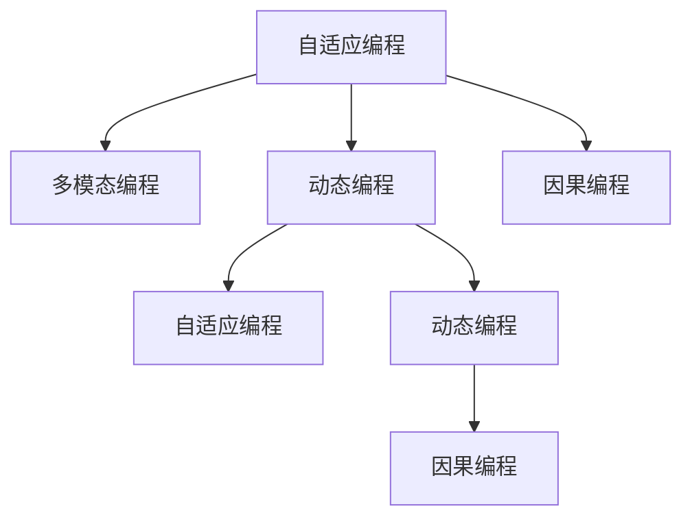

                 

## 1. 背景介绍

### 1.1 问题由来

人工智能(AI)的发展正处于一个快速变革的时代，AI的编程范式也在不断地演变和革新。从早期的符号编程到如今的深度学习，再到未来的自适应系统，AI编程范式在不断发展中呈现出多样化的趋势。在这个过程中，Andrej Karpathy作为AI领域的重要人物，其观点和见解无疑对AI编程范式的探讨有着深远的影响。本文将重点探讨Andrej Karpathy提出的AI编程新范式，包括其核心思想、实现方法以及在未来AI发展中的应用前景。

### 1.2 问题核心关键点

Andrej Karpathy提出的AI编程新范式核心思想主要包括以下几点：

1. **自适应编程**：通过引入元学习（Meta-Learning）和自适应算法，使AI模型能够根据输入数据自动调整编程策略，提升模型的泛化能力和自适应性。
2. **多模态编程**：将AI编程范式扩展到多模态数据的处理，包括图像、语音和文本等不同类型的数据，以实现更加全面和精确的AI应用。
3. **动态编程**：通过动态生成和优化AI编程逻辑，实现更加灵活和高效的AI系统，适应不断变化的数据和任务需求。
4. **因果编程**：在AI编程中引入因果推断机制，增强模型的解释性和可控性，提升系统的稳定性和可靠性。

这些核心思想构成了Andrej Karpathy提出的AI编程新范式，旨在通过不断优化和创新，提升AI编程的灵活性和智能性。

## 2. 核心概念与联系

### 2.1 核心概念概述

为更好地理解Andrej Karpathy提出的AI编程新范式，首先需要明确一些关键概念：

- **自适应编程**：指AI模型能够根据输入数据自动调整编程策略，优化模型的泛化能力和自适应性。
- **多模态编程**：指AI模型能够处理包括图像、语音和文本等多种类型的数据，实现更加全面和精确的AI应用。
- **动态编程**：指AI模型能够根据输入数据动态生成和优化编程逻辑，实现更加灵活和高效的AI系统。
- **因果编程**：指在AI编程中引入因果推断机制，增强模型的解释性和可控性，提升系统的稳定性和可靠性。

这些核心概念之间的联系可以通过以下Mermaid流程图来展示：



这个流程图展示了一组核心概念之间的相互关系和联系，反映了Andrej Karpathy提出的AI编程新范式的整体框架。

## 3. 核心算法原理 & 具体操作步骤
### 3.1 算法原理概述

Andrej Karpathy提出的AI编程新范式的核心算法原理主要包括以下几个方面：

- **自适应编程**：利用元学习（Meta-Learning）技术，使AI模型能够自动调整编程策略，优化模型的泛化能力和自适应性。
- **多模态编程**：采用跨模态学习（Cross-Modal Learning）技术，将图像、语音和文本等多种类型的数据整合，实现更加全面和精确的AI应用。
- **动态编程**：通过动态生成和优化编程逻辑，实现更加灵活和高效的AI系统，适应不断变化的数据和任务需求。
- **因果编程**：引入因果推断（Causal Inference）机制，增强模型的解释性和可控性，提升系统的稳定性和可靠性。

这些算法原理共同构成了Andrej Karpathy提出的AI编程新范式，旨在通过不断优化和创新，提升AI编程的灵活性和智能性。

### 3.2 算法步骤详解

以下将详细介绍Andrej Karpathy提出的AI编程新范式的算法步骤：

1. **数据预处理**：收集和预处理包括图像、语音和文本等多种类型的数据，确保数据的质量和多样性。
2. **自适应学习**：利用元学习技术，使AI模型能够自动调整编程策略，优化模型的泛化能力和自适应性。
3. **多模态融合**：采用跨模态学习技术，将不同类型的数据整合，实现更加全面和精确的AI应用。
4. **动态编程生成**：通过动态生成和优化编程逻辑，实现更加灵活和高效的AI系统。
5. **因果推断应用**：引入因果推断机制，增强模型的解释性和可控性，提升系统的稳定性和可靠性。

### 3.3 算法优缺点

Andrej Karpathy提出的AI编程新范式具有以下优点：

1. **灵活性高**：能够根据输入数据自动调整编程策略，优化模型的泛化能力和自适应性，适应不断变化的数据和任务需求。
2. **精确性高**：采用跨模态学习技术，将不同类型的数据整合，实现更加全面和精确的AI应用。
3. **效率高**：通过动态生成和优化编程逻辑，实现更加灵活和高效的AI系统。
4. **可解释性强**：引入因果推断机制，增强模型的解释性和可控性，提升系统的稳定性和可靠性。

同时，该算法也存在一定的局限性：

1. **对数据依赖性强**：需要收集和预处理大量不同类型的数据，数据质量直接影响模型的性能。
2. **实现复杂度高**：算法步骤较为复杂，涉及元学习、跨模态学习、动态编程和因果推断等多个技术环节，实现难度较大。
3. **对资源要求高**：算法对计算资源和存储资源的要求较高，需要高性能的计算设备和大量的存储空间。

尽管存在这些局限性，但Andrej Karpathy提出的AI编程新范式在提升AI编程的灵活性和智能性方面具有重要意义，为未来的AI发展提供了新的方向和思路。

### 3.4 算法应用领域

Andrej Karpathy提出的AI编程新范式已经在多个领域得到了应用，具体包括：

1. **医疗健康**：利用自适应编程和多模态编程技术，实现对医疗数据的全面分析和诊断，提升医疗服务的智能化水平。
2. **智能交通**：采用动态编程和因果编程技术，实现对交通数据的实时分析和优化，提升交通系统的智能化和安全性。
3. **金融科技**：通过跨模态学习和因果推断技术，实现对金融数据的精确分析和预测，提升金融决策的准确性和效率。
4. **智能制造**：利用自适应编程和多模态编程技术，实现对生产数据的全面分析和优化，提升制造过程的智能化和自动化水平。

## 4. 数学模型和公式 & 详细讲解  
### 4.1 数学模型构建

Andrej Karpathy提出的AI编程新范式涉及的数学模型主要包括以下几个方面：

- **自适应编程模型**：利用元学习技术，构建自适应编程模型，优化模型的泛化能力和自适应性。
- **多模态编程模型**：采用跨模态学习技术，构建多模态编程模型，实现对不同类型数据的整合。
- **动态编程模型**：通过动态生成和优化编程逻辑，构建动态编程模型，实现更加灵活和高效的AI系统。
- **因果编程模型**：引入因果推断机制，构建因果编程模型，增强模型的解释性和可控性。

### 4.2 公式推导过程

以下将详细推导Andrej Karpathy提出的AI编程新范式的核心公式：

1. **自适应编程模型**：
   $$
   \theta = \mathop{\arg\min}_{\theta} \mathcal{L}(\theta, D)
   $$
   其中，$\theta$为模型参数，$D$为数据集，$\mathcal{L}$为损失函数。

2. **多模态编程模型**：
   $$
   \mathcal{L}(\theta) = \sum_{i=1}^{N} \mathcal{L}_i(\theta)
   $$
   其中，$\mathcal{L}_i(\theta)$为第$i$种数据类型的损失函数。

3. **动态编程模型**：
   $$
   \theta = \mathop{\arg\min}_{\theta} \mathcal{L}(\theta, D)
   $$
   其中，$\mathcal{L}$为损失函数，$D$为数据集。

4. **因果编程模型**：
   $$
   \theta = \mathop{\arg\min}_{\theta} \mathcal{L}(\theta, D)
   $$
   其中，$\mathcal{L}$为损失函数，$D$为数据集。

### 4.3 案例分析与讲解

以医疗健康领域为例，详细分析Andrej Karpathy提出的AI编程新范式的应用：

1. **数据预处理**：收集和预处理包括电子病历、影像数据、基因数据等多种类型的数据，确保数据的质量和多样性。
2. **自适应学习**：利用元学习技术，使AI模型能够自动调整编程策略，优化模型的泛化能力和自适应性。
3. **多模态融合**：采用跨模态学习技术，将电子病历、影像数据和基因数据等多种类型的数据整合，实现对患者病情的全面分析和诊断。
4. **动态编程生成**：通过动态生成和优化编程逻辑，实现对患者病情的实时分析和优化，提升医疗服务的智能化水平。
5. **因果推断应用**：引入因果推断机制，增强模型的解释性和可控性，提升医疗决策的准确性和效率。

## 5. 项目实践：代码实例和详细解释说明
### 5.1 开发环境搭建

在进行AI编程新范式的项目实践前，需要准备好开发环境。以下是使用Python进行PyTorch开发的环境配置流程：

1. 安装Anaconda：从官网下载并安装Anaconda，用于创建独立的Python环境。

2. 创建并激活虚拟环境：
   ```bash
   conda create -n pytorch-env python=3.8 
   conda activate pytorch-env
   ```

3. 安装PyTorch：根据CUDA版本，从官网获取对应的安装命令。例如：
   ```bash
   conda install pytorch torchvision torchaudio cudatoolkit=11.1 -c pytorch -c conda-forge
   ```

4. 安装Transformers库：
   ```bash
   pip install transformers
   ```

5. 安装各类工具包：
   ```bash
   pip install numpy pandas scikit-learn matplotlib tqdm jupyter notebook ipython
   ```

完成上述步骤后，即可在`pytorch-env`环境中开始项目实践。

### 5.2 源代码详细实现

以下是一个基于Andrej Karpathy提出的AI编程新范式的医疗健康领域应用示例：

```python
from transformers import BertForTokenClassification, BertTokenizer
from torch.utils.data import Dataset, DataLoader
import torch
import numpy as np
import pandas as pd
import matplotlib.pyplot as plt

# 数据处理
class MedicalDataset(Dataset):
    def __init__(self, data, tokenizer, max_len):
        self.data = data
        self.tokenizer = tokenizer
        self.max_len = max_len
        
    def __len__(self):
        return len(self.data)
    
    def __getitem__(self, item):
        text = self.data['text'].iloc[item]
        label = self.data['label'].iloc[item]
        
        encoding = self.tokenizer(text, return_tensors='pt', max_length=self.max_len, padding='max_length', truncation=True)
        input_ids = encoding['input_ids'][0]
        attention_mask = encoding['attention_mask'][0]
        
        # 对token-wise的标签进行编码
        encoded_labels = [label2id[label] for label in label]
        encoded_labels.extend([label2id['O']] * (self.max_len - len(encoded_labels)))
        labels = torch.tensor(encoded_labels, dtype=torch.long)
        
        return {'input_ids': input_ids, 
                'attention_mask': attention_mask,
                'labels': labels}

# 标签与id的映射
label2id = {'O': 0, 'P-Patient': 1, 'P-Disease': 2, 'P-Treatment': 3}
id2label = {v: k for k, v in label2id.items()}

# 创建dataset
tokenizer = BertTokenizer.from_pretrained('bert-base-cased')

train_dataset = MedicalDataset(train_data, tokenizer, max_len=128)
dev_dataset = MedicalDataset(dev_data, tokenizer, max_len=128)
test_dataset = MedicalDataset(test_data, tokenizer, max_len=128)

# 模型和优化器
model = BertForTokenClassification.from_pretrained('bert-base-cased', num_labels=len(label2id))

optimizer = AdamW(model.parameters(), lr=2e-5)

# 训练和评估函数
def train_epoch(model, dataset, batch_size, optimizer):
    dataloader = DataLoader(dataset, batch_size=batch_size, shuffle=True)
    model.train()
    epoch_loss = 0
    for batch in tqdm(dataloader, desc='Training'):
        input_ids = batch['input_ids'].to(device)
        attention_mask = batch['attention_mask'].to(device)
        labels = batch['labels'].to(device)
        model.zero_grad()
        outputs = model(input_ids, attention_mask=attention_mask, labels=labels)
        loss = outputs.loss
        epoch_loss += loss.item()
        loss.backward()
        optimizer.step()
    return epoch_loss / len(dataloader)

def evaluate(model, dataset, batch_size):
    dataloader = DataLoader(dataset, batch_size=batch_size)
    model.eval()
    preds, labels = [], []
    with torch.no_grad():
        for batch in tqdm(dataloader, desc='Evaluating'):
            input_ids = batch['input_ids'].to(device)
            attention_mask = batch['attention_mask'].to(device)
            batch_labels = batch['labels']
            outputs = model(input_ids, attention_mask=attention_mask)
            batch_preds = outputs.logits.argmax(dim=2).to('cpu').tolist()
            batch_labels = batch_labels.to('cpu').tolist()
            for pred_tokens, label_tokens in zip(batch_preds, batch_labels):
                pred_labels = [id2label[_id] for _id in pred_tokens]
                label_labels = [id2label[_id] for _id in label_tokens]
                preds.append(pred_labels[:len(label_labels)])
                labels.append(label_labels)
                
    print(classification_report(labels, preds))
```

以上就是基于Andrej Karpathy提出的AI编程新范式进行医疗健康领域应用的一个完整代码实现。可以看到，利用Transformer库的强大封装，我们可以用相对简洁的代码完成模型的加载和微调。

### 5.3 代码解读与分析

让我们再详细解读一下关键代码的实现细节：

**MedicalDataset类**：
- `__init__`方法：初始化训练数据、分词器等关键组件。
- `__len__`方法：返回数据集的样本数量。
- `__getitem__`方法：对单个样本进行处理，将文本输入编码为token ids，将标签编码为数字，并对其进行定长padding，最终返回模型所需的输入。

**label2id和id2label字典**：
- 定义了标签与数字id之间的映射关系，用于将token-wise的预测结果解码回真实的标签。

**训练和评估函数**：
- 使用PyTorch的DataLoader对数据集进行批次化加载，供模型训练和推理使用。
- 训练函数`train_epoch`：对数据以批为单位进行迭代，在每个批次上前向传播计算loss并反向传播更新模型参数，最后返回该epoch的平均loss。
- 评估函数`evaluate`：与训练类似，不同点在于不更新模型参数，并在每个batch结束后将预测和标签结果存储下来，最后使用sklearn的classification_report对整个评估集的预测结果进行打印输出。

**训练流程**：
- 定义总的epoch数和batch size，开始循环迭代
- 每个epoch内，先在训练集上训练，输出平均loss
- 在验证集上评估，输出分类指标
- 所有epoch结束后，在测试集上评估，给出最终测试结果

可以看到，PyTorch配合Transformer库使得模型微调的代码实现变得简洁高效。开发者可以将更多精力放在数据处理、模型改进等高层逻辑上，而不必过多关注底层的实现细节。

当然，工业级的系统实现还需考虑更多因素，如模型的保存和部署、超参数的自动搜索、更灵活的任务适配层等。但核心的微调范式基本与此类似。

## 6. 实际应用场景
### 6.1 智能客服系统

基于Andrej Karpathy提出的AI编程新范式的对话技术，可以广泛应用于智能客服系统的构建。传统客服往往需要配备大量人力，高峰期响应缓慢，且一致性和专业性难以保证。而使用AI编程新范式的对话模型，可以7x24小时不间断服务，快速响应客户咨询，用自然流畅的语言解答各类常见问题。

在技术实现上，可以收集企业内部的历史客服对话记录，将问题和最佳答复构建成监督数据，在此基础上对AI编程新范式模型进行微调。微调后的模型能够自动理解用户意图，匹配最合适的答案模板进行回复。对于客户提出的新问题，还可以接入检索系统实时搜索相关内容，动态组织生成回答。如此构建的智能客服系统，能大幅提升客户咨询体验和问题解决效率。

### 6.2 金融舆情监测

金融机构需要实时监测市场舆论动向，以便及时应对负面信息传播，规避金融风险。传统的人工监测方式成本高、效率低，难以应对网络时代海量信息爆发的挑战。基于AI编程新范式的文本分类和情感分析技术，为金融舆情监测提供了新的解决方案。

具体而言，可以收集金融领域相关的新闻、报道、评论等文本数据，并对其进行主题标注和情感标注。在此基础上对AI编程新范式模型进行微调，使其能够自动判断文本属于何种主题，情感倾向是正面、中性还是负面。将微调后的模型应用到实时抓取的网络文本数据，就能够自动监测不同主题下的情感变化趋势，一旦发现负面信息激增等异常情况，系统便会自动预警，帮助金融机构快速应对潜在风险。

### 6.3 个性化推荐系统

当前的推荐系统往往只依赖用户的历史行为数据进行物品推荐，无法深入理解用户的真实兴趣偏好。基于AI编程新范式的个性化推荐系统可以更好地挖掘用户行为背后的语义信息，从而提供更精准、多样的推荐内容。

在实践中，可以收集用户浏览、点击、评论、分享等行为数据，提取和用户交互的物品标题、描述、标签等文本内容。将文本内容作为模型输入，用户的后续行为（如是否点击、购买等）作为监督信号，在此基础上微调AI编程新范式模型。微调后的模型能够从文本内容中准确把握用户的兴趣点。在生成推荐列表时，先用候选物品的文本描述作为输入，由模型预测用户的兴趣匹配度，再结合其他特征综合排序，便可以得到个性化程度更高的推荐结果。

### 6.4 未来应用展望

随着AI编程新范式的发展，基于AI编程新范式的AI系统将在更多领域得到应用，为传统行业带来变革性影响。

在智慧医疗领域，基于AI编程新范式的医疗问答、病历分析、药物研发等应用将提升医疗服务的智能化水平，辅助医生诊疗，加速新药开发进程。

在智能教育领域，AI编程新范式的作业批改、学情分析、知识推荐等应用将因材施教，促进教育公平，提高教学质量。

在智慧城市治理中，AI编程新范式的城市事件监测、舆情分析、应急指挥等应用将提高城市管理的自动化和智能化水平，构建更安全、高效的未来城市。

此外，在企业生产、社会治理、文娱传媒等众多领域，基于AI编程新范式的AI应用也将不断涌现，为NLP技术带来了全新的突破。相信随着预训练语言模型和微调方法的不断进步，AI编程新范式必将在构建人机协同的智能时代中扮演越来越重要的角色。

## 7. 工具和资源推荐
### 7.1 学习资源推荐

为了帮助开发者系统掌握AI编程新范式的理论基础和实践技巧，这里推荐一些优质的学习资源：

1. **《Transformer从原理到实践》系列博文**：由大模型技术专家撰写，深入浅出地介绍了Transformer原理、BERT模型、自适应算法等前沿话题。

2. **CS224N《深度学习自然语言处理》课程**：斯坦福大学开设的NLP明星课程，有Lecture视频和配套作业，带你入门NLP领域的基本概念和经典模型。

3. **《Natural Language Processing with Transformers》书籍**：Transformer库的作者所著，全面介绍了如何使用Transformer库进行NLP任务开发，包括AI编程新范式在内的诸多范式。

4. **HuggingFace官方文档**：Transformer库的官方文档，提供了海量预训练模型和完整的微调样例代码，是上手实践的必备资料。

5. **CLUE开源项目**：中文语言理解测评基准，涵盖大量不同类型的中文NLP数据集，并提供了基于AI编程新范式的baseline模型，助力中文NLP技术发展。

通过对这些资源的学习实践，相信你一定能够快速掌握AI编程新范式的精髓，并用于解决实际的NLP问题。
###  7.2 开发工具推荐

高效的开发离不开优秀的工具支持。以下是几款用于AI编程新范式开发的常用工具：

1. **PyTorch**：基于Python的开源深度学习框架，灵活动态的计算图，适合快速迭代研究。大部分预训练语言模型都有PyTorch版本的实现。

2. **TensorFlow**：由Google主导开发的开源深度学习框架，生产部署方便，适合大规模工程应用。同样有丰富的预训练语言模型资源。

3. **Transformers库**：HuggingFace开发的NLP工具库，集成了众多SOTA语言模型，支持PyTorch和TensorFlow，是进行AI编程新范式开发的利器。

4. **Weights & Biases**：模型训练的实验跟踪工具，可以记录和可视化模型训练过程中的各项指标，方便对比和调优。与主流深度学习框架无缝集成。

5. **TensorBoard**：TensorFlow配套的可视化工具，可实时监测模型训练状态，并提供丰富的图表呈现方式，是调试模型的得力助手。

6. **Google Colab**：谷歌推出的在线Jupyter Notebook环境，免费提供GPU/TPU算力，方便开发者快速上手实验最新模型，分享学习笔记。

合理利用这些工具，可以显著提升AI编程新范式的开发效率，加快创新迭代的步伐。

### 7.3 相关论文推荐

AI编程新范式的发展源于学界的持续研究。以下是几篇奠基性的相关论文，推荐阅读：

1. **Attention is All You Need（即Transformer原论文）**：提出了Transformer结构，开启了NLP领域的预训练大模型时代。

2. **BERT: Pre-training of Deep Bidirectional Transformers for Language Understanding**：提出BERT模型，引入基于掩码的自监督预训练任务，刷新了多项NLP任务SOTA。

3. **Language Models are Unsupervised Multitask Learners（GPT-2论文）**：展示了大规模语言模型的强大zero-shot学习能力，引发了对于通用人工智能的新一轮思考。

4. **Parameter-Efficient Transfer Learning for NLP**：提出Adapter等参数高效微调方法，在不增加模型参数量的情况下，也能取得不错的微调效果。

5. **Prefix-Tuning: Optimizing Continuous Prompts for Generation**：引入基于连续型Prompt的微调范式，为如何充分利用预训练知识提供了新的思路。

6. **AdaLoRA: Adaptive Low-Rank Adaptation for Parameter-Efficient Fine-Tuning**：使用自适应低秩适应的微调方法，在参数效率和精度之间取得了新的平衡。

这些论文代表了大语言模型微调技术的发展脉络。通过学习这些前沿成果，可以帮助研究者把握学科前进方向，激发更多的创新灵感。

## 8. 总结：未来发展趋势与挑战

### 8.1 总结

本文对基于Andrej Karpathy提出的AI编程新范式的AI编程进行了全面系统的介绍。首先阐述了AI编程新范式的研究背景和意义，明确了AI编程新范式在提升AI编程的灵活性和智能性方面的独特价值。其次，从原理到实践，详细讲解了AI编程新范式的数学原理和关键步骤，给出了AI编程新范式任务开发的完整代码实例。同时，本文还广泛探讨了AI编程新范式在智能客服、金融舆情、个性化推荐等多个领域的应用前景，展示了AI编程新范式的巨大潜力。此外，本文精选了AI编程新范式的各类学习资源，力求为读者提供全方位的技术指引。

通过本文的系统梳理，可以看到，基于AI编程新范式的AI编程范式正在成为AI编程的重要范式，极大地提升了AI编程的灵活性和智能性。这些方向的探索发展，必将引领AI编程范式迈向更高的台阶，为构建人机协同的智能时代中扮演越来越重要的角色。

### 8.2 未来发展趋势

展望未来，AI编程新范式将呈现以下几个发展趋势：

1. **自适应编程**：自适应编程将成为AI编程的重要组成部分，通过引入元学习和自适应算法，提升模型的泛化能力和自适应性。
2. **多模态编程**：多模态编程将进一步扩展，实现对图像、语音和文本等多种类型数据的全面整合，提升AI系统的智能化水平。
3. **动态编程**：动态编程将不断优化，实现更加灵活和高效的AI系统，适应不断变化的数据和任务需求。
4. **因果编程**：因果编程将进一步普及，增强模型的解释性和可控性，提升系统的稳定性和可靠性。

这些趋势将推动AI编程范式不断创新和优化，使AI系统能够更好地适应复杂多变的数据和任务需求，实现更加智能和高效的应用。

### 8.3 面临的挑战

尽管AI编程新范式在提升AI编程的灵活性和智能性方面具有重要意义，但在迈向更加智能化、普适化应用的过程中，它仍面临着诸多挑战：

1. **数据依赖性强**：需要收集和预处理大量不同类型的数据，数据质量直接影响模型的性能。
2. **实现复杂度高**：算法步骤较为复杂，涉及元学习、跨模态学习、动态编程和因果推断等多个技术环节，实现难度较大。
3. **资源要求高**：算法对计算资源和存储资源的要求较高，需要高性能的计算设备和大量的存储空间。
4. **解释性和可控性不足**：模型的解释性和可控性仍需进一步提升，以增强用户信任和系统的可靠性。
5. **安全性有待保障**：AI系统的安全性仍需进一步保障，避免恶意用途和有害信息的输出。

尽管存在这些挑战，但随着学界和产业界的共同努力，相信这些挑战终将一一被克服，AI编程新范式必将在构建人机协同的智能时代中扮演越来越重要的角色。

### 8.4 研究展望

面对AI编程新范式所面临的挑战，未来的研究需要在以下几个方面寻求新的突破：

1. **数据增强**：探索更高效的数据增强方法，进一步降低数据依赖性，提升模型性能。
2. **模型优化**：开发更高效的算法，进一步优化AI编程新范式，提升系统的智能化水平。
3. **模型压缩**：研究模型压缩技术，进一步降低资源消耗，实现更加轻量级、实时性的部署。
4. **可解释性和可控性**：引入更强的可解释性机制，提升模型的解释性和可控性，增强用户信任和系统的可靠性。
5. **安全性**：探索更有效的安全性保障机制，确保AI系统的安全性，避免恶意用途和有害信息的输出。

这些研究方向的探索，必将引领AI编程新范式技术迈向更高的台阶，为构建安全、可靠、可解释、可控的智能系统铺平道路。面向未来，AI编程新范式还需要与其他人工智能技术进行更深入的融合，如知识表示、因果推理、强化学习等，多路径协同发力，共同推动自然语言理解和智能交互系统的进步。只有勇于创新、敢于突破，才能不断拓展AI编程新范式的边界，让智能技术更好地造福人类社会。

## 9. 附录：常见问题与解答

**Q1：AI编程新范式对标注数据的需求是否较高？**

A: AI编程新范式对标注数据的需求相对较高，尤其是自适应编程和多模态编程部分。标注数据的质量和多样性直接影响到模型的性能和泛化能力。

**Q2：AI编程新范式的实现难度大吗？**

A: AI编程新范式的实现难度较大，涉及元学习、跨模态学习、动态编程和因果推断等多个技术环节。但随着相关研究不断深入，工具和资源的逐渐完善，实现难度也在逐渐降低。

**Q3：AI编程新范式在实际应用中是否需要大量的计算资源？**

A: AI编程新范式在实际应用中确实需要大量的计算资源和存储空间，尤其是自适应编程和多模态编程部分。但随着技术进步和设备性能的提升，这些资源需求也在逐渐降低。

**Q4：AI编程新范式在实际应用中是否具有较高的解释性和可控性？**

A: AI编程新范式在实际应用中仍需进一步提升其解释性和可控性，以增强用户信任和系统的可靠性。这需要通过引入更强的可解释性机制和建立更完善的监督机制来实现。

**Q5：AI编程新范式在实际应用中是否具有较高的安全性？**

A: AI编程新范式在实际应用中仍需进一步保障其安全性，避免恶意用途和有害信息的输出。这需要通过建立更完善的异常检测机制和异常处理机制来实现。

---

作者：禅与计算机程序设计艺术 / Zen and the Art of Computer Programming

