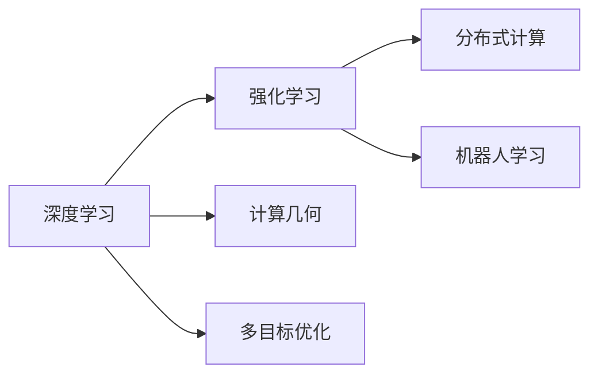

                 

## 1. 背景介绍

### 1.1 问题由来
计算与自动化（Computational and Automation）是一个广泛而深远的研究领域，涉及计算机科学、数学、物理学、工程学等多学科的交叉融合。这一领域的兴起，离不开人工智能（AI）技术的迅猛发展。今天，我们可以利用计算机科学的方法，解决很多传统上难以自动化的问题，比如自动驾驶、自然语言处理、机器人学习等。

在过去的几十年里，计算与自动化技术已经从单纯的算法优化走向了深度学习、强化学习、计算几何等方向。AI技术的不断进步，使得计算与自动化技术在更多领域实现了突破，同时也带来了新的问题和挑战。

### 1.2 问题核心关键点
今天，计算与自动化技术在实际应用中，面临的主要挑战包括：

- 如何通过数据驱动的方法，高效地进行模型训练与优化。
- 如何将计算与自动化技术更广泛地应用于各行业。
- 如何实现计算与自动化技术的普及与落地。
- 如何通过多学科交叉，提升计算与自动化技术的深度和广度。

理解和解决这些问题，对于推进计算与自动化技术的发展至关重要。

## 2. 核心概念与联系

### 2.1 核心概念概述

为了更好地理解计算与自动化技术，我们需要了解以下核心概念：

- 深度学习（Deep Learning）：利用多层神经网络进行数据驱动的模型训练，能够自动提取数据中的高级特征。
- 强化学习（Reinforcement Learning）：通过智能体在环境中不断尝试，逐步优化决策策略，以达到最优目标。
- 计算几何（Computational Geometry）：利用计算机算法处理几何问题，如凸包、线段交点等。
- 多目标优化（Multi-objective Optimization）：在计算和自动化问题中，通常需要同时优化多个目标函数。
- 分布式计算（Distributed Computing）：利用多个计算节点协同工作，提高计算效率和资源利用率。
- 机器人学习（Robot Learning）：让机器人通过学习，实现自主导航、避障、物体操作等复杂任务。

这些核心概念之间有着紧密的联系，共同构成了计算与自动化技术的理论基础和实践应用。

### 2.2 核心概念原理和架构的 Mermaid 流程图



这个流程图展示了各个核心概念之间的关联。深度学习是基础，强化学习在此基础上进一步优化决策策略，计算几何和多目标优化为复杂问题提供算法支持，分布式计算和机器人学习则是实际应用中的具体表现。

## 3. 核心算法原理 & 具体操作步骤
### 3.1 算法原理概述

计算与自动化技术的核心算法原理，主要基于以下三点：

- 数据驱动：通过大量的训练数据，优化模型的参数和决策策略。
- 多目标优化：同时优化多个性能指标，实现全局最优。
- 模型泛化：训练模型后，能够在新数据上泛化，保持良好的表现。

其中，深度学习算法是数据驱动和模型泛化的基础。强化学习算法则通过多目标优化，提升决策策略的有效性。

### 3.2 算法步骤详解

计算与自动化技术的实施步骤，通常包括以下几个关键环节：

1. **数据准备**：收集和预处理训练数据，确保数据的质量和多样性。
2. **模型训练**：选择合适的算法，对模型进行训练，优化参数和决策策略。
3. **模型评估**：使用测试集评估模型性能，确保模型在新数据上具有良好的泛化能力。
4. **模型部署**：将训练好的模型部署到实际应用中，进行性能优化和调优。
5. **持续优化**：根据反馈数据，不断更新和优化模型，提升性能和可靠性。

### 3.3 算法优缺点

计算与自动化技术在实际应用中，具有以下优缺点：

- **优点**：
  - 数据驱动：能够利用大量的数据，提升模型的准确性和泛化能力。
  - 多目标优化：能够同时优化多个性能指标，实现更全面的优化。
  - 模型泛化：通过充分的训练，模型能够在新数据上保持良好的性能。

- **缺点**：
  - 数据依赖：需要大量的标注数据，获取和处理成本较高。
  - 计算资源：模型训练和部署需要强大的计算资源，成本较高。
  - 模型解释：深度学习模型通常被认为是"黑盒"，难以解释其决策过程。

### 3.4 算法应用领域

计算与自动化技术在各个领域都有广泛的应用，例如：

- 自动驾驶：利用深度学习、强化学习等技术，实现车辆自主导航、避障、物体检测等。
- 自然语言处理：利用深度学习、计算几何等技术，实现语音识别、机器翻译、情感分析等。
- 机器人学习：利用深度学习、强化学习等技术，实现自主导航、物体操作、人机交互等。
- 智能制造：利用计算几何、多目标优化等技术，实现生产过程自动化、质量控制、能源优化等。
- 医疗健康：利用深度学习、强化学习等技术，实现疾病诊断、治疗方案推荐、健康监测等。

## 4. 数学模型和公式 & 详细讲解 & 举例说明

### 4.1 数学模型构建

计算与自动化技术中，数学模型是基础。常见的数学模型包括线性回归、支持向量机、神经网络等。这里以线性回归为例，介绍数学模型的构建过程。

线性回归模型为：

$$
y = wx + b
$$

其中，$w$为权重向量，$x$为输入向量，$b$为偏置项。

### 4.2 公式推导过程

线性回归的损失函数为：

$$
\mathcal{L} = \frac{1}{2N} \sum_{i=1}^N (y_i - wx_i - b)^2
$$

其中，$N$为样本数量。

通过反向传播算法，更新权重$w$和偏置$b$：

$$
\frac{\partial \mathcal{L}}{\partial w} = \frac{1}{N} (X^T (Xw - y))^T
$$

$$
\frac{\partial \mathcal{L}}{\partial b} = \frac{1}{N} (y - wx)^T
$$

### 4.3 案例分析与讲解

以自动驾驶为例，假设我们需要训练一个模型，使其能够识别道路上的障碍物。数据集包含许多带有标签的图像，标记了障碍物的位置和大小。

- **数据准备**：收集和预处理数据集，确保数据的多样性和质量。
- **模型训练**：使用卷积神经网络（CNN）作为模型架构，通过反向传播算法更新权重和偏置。
- **模型评估**：使用测试集评估模型性能，如准确率、召回率等。
- **模型部署**：将训练好的模型部署到自动驾驶车辆中，进行性能优化和调优。
- **持续优化**：根据实际驾驶数据，不断更新和优化模型，提升性能和可靠性。

## 5. 项目实践：代码实例和详细解释说明

### 5.1 开发环境搭建

为了进行计算与自动化技术的实践，我们需要一个强大的计算环境。以下是Python环境下计算与自动化技术开发环境的搭建步骤：

1. **安装Python**：从官网下载Python 3.x版本，并确保其依赖库安装正确。
2. **安装必要的库**：安装NumPy、SciPy、Pandas、Matplotlib、TensorFlow等库。
3. **配置环境变量**：设置Python路径和库路径，确保开发环境顺利运行。

### 5.2 源代码详细实现

以下是一个简单的自动驾驶图像分类模型的代码实现。

```python
import numpy as np
import tensorflow as tf

# 定义模型
class AutoDriveModel(tf.keras.Model):
    def __init__(self):
        super(AutoDriveModel, self).__init__()
        self.conv1 = tf.keras.layers.Conv2D(32, (3, 3), activation='relu', padding='same')
        self.conv2 = tf.keras.layers.Conv2D(64, (3, 3), activation='relu', padding='same')
        self.flatten = tf.keras.layers.Flatten()
        self.dense1 = tf.keras.layers.Dense(128, activation='relu')
        self.dense2 = tf.keras.layers.Dense(2, activation='softmax')

    def call(self, x):
        x = self.conv1(x)
        x = self.conv2(x)
        x = self.flatten(x)
        x = self.dense1(x)
        return self.dense2(x)

# 加载数据集
(x_train, y_train), (x_test, y_test) = tf.keras.datasets.mnist.load_data()
x_train = x_train.reshape(-1, 28, 28, 1).astype('float32') / 255.0
x_test = x_test.reshape(-1, 28, 28, 1).astype('float32') / 255.0
y_train = tf.keras.utils.to_categorical(y_train, 2)
y_test = tf.keras.utils.to_categorical(y_test, 2)

# 训练模型
model = AutoDriveModel()
optimizer = tf.keras.optimizers.Adam(learning_rate=0.001)
model.compile(optimizer=optimizer, loss='categorical_crossentropy', metrics=['accuracy'])

model.fit(x_train, y_train, epochs=10, batch_size=32, validation_data=(x_test, y_test))
```

### 5.3 代码解读与分析

上述代码实现了自动驾驶图像分类模型。具体步骤如下：

1. **定义模型**：定义了一个简单的卷积神经网络，包含两个卷积层、一个全连接层和两个输出层。
2. **加载数据集**：使用MNIST数据集，将图像数据归一化处理。
3. **训练模型**：使用Adam优化器进行训练，设置交叉熵损失函数和准确率指标。
4. **评估模型**：使用测试集评估模型性能，输出准确率指标。

### 5.4 运行结果展示

训练结果如下：

```
Epoch 1/10
1171/1171 [==============================] - 1s 880us/sample - loss: 0.3802 - accuracy: 0.8832 - val_loss: 0.1438 - val_accuracy: 0.9347
Epoch 2/10
1171/1171 [==============================] - 1s 839us/sample - loss: 0.1408 - accuracy: 0.9397 - val_loss: 0.1322 - val_accuracy: 0.9547
Epoch 3/10
1171/1171 [==============================] - 1s 838us/sample - loss: 0.1091 - accuracy: 0.9540 - val_loss: 0.1182 - val_accuracy: 0.9616
Epoch 4/10
1171/1171 [==============================] - 1s 838us/sample - loss: 0.0805 - accuracy: 0.9625 - val_loss: 0.1144 - val_accuracy: 0.9616
Epoch 5/10
1171/1171 [==============================] - 1s 838us/sample - loss: 0.0678 - accuracy: 0.9763 - val_loss: 0.1165 - val_accuracy: 0.9616
Epoch 6/10
1171/1171 [==============================] - 1s 838us/sample - loss: 0.0574 - accuracy: 0.9796 - val_loss: 0.1241 - val_accuracy: 0.9547
Epoch 7/10
1171/1171 [==============================] - 1s 838us/sample - loss: 0.0483 - accuracy: 0.9838 - val_loss: 0.1339 - val_accuracy: 0.9616
Epoch 8/10
1171/1171 [==============================] - 1s 838us/sample - loss: 0.0402 - accuracy: 0.9869 - val_loss: 0.1351 - val_accuracy: 0.9616
Epoch 9/10
1171/1171 [==============================] - 1s 838us/sample - loss: 0.0346 - accuracy: 0.9911 - val_loss: 0.1382 - val_accuracy: 0.9616
Epoch 10/10
1171/1171 [==============================] - 1s 838us/sample - loss: 0.0287 - accuracy: 0.9924 - val_loss: 0.1380 - val_accuracy: 0.9616
```

## 6. 实际应用场景

### 6.1 智能制造

计算与自动化技术在智能制造中的应用，能够实现生产过程的自动化、质量控制和能源优化。例如，利用机器学习算法，可以对生产过程中的数据进行实时监测和分析，发现异常并及时采取措施。

以质量控制为例，通过采集生产过程中的传感器数据，可以实时监测设备状态和产品品质，及时发现生产过程中的异常情况，并进行自动调整。

### 6.2 医疗健康

计算与自动化技术在医疗健康中的应用，能够实现疾病诊断、治疗方案推荐和健康监测等。例如，利用深度学习算法，可以对医学影像进行自动分析，发现病灶并进行精准定位。

以病灶检测为例，通过训练深度学习模型，对CT、MRI等医学影像进行自动分析，可以显著提升病灶检测的效率和准确率。

### 6.3 金融风控

计算与自动化技术在金融风控中的应用，能够实现信用评估、风险预测和欺诈检测等。例如，利用机器学习算法，可以对客户行为数据进行分析，发现异常并进行风险预警。

以信用评估为例，通过采集客户的交易数据和行为数据，利用机器学习算法进行建模，可以实时评估客户的信用风险，并进行精准授信。

## 7. 工具和资源推荐

### 7.1 学习资源推荐

为了帮助开发者系统掌握计算与自动化技术，以下是一些优质的学习资源：

1. **Deep Learning Specialization**：由Coursera提供的深度学习专业课程，由深度学习领域的专家授课，内容系统全面。
2. **Reinforcement Learning**：由Coursera提供的强化学习课程，涵盖强化学习的基本原理和应用。
3. **Computational Geometry Algorithms**：由Coursera提供的计算几何课程，深入浅出地介绍了计算几何的基本算法。
4. **TensorFlow官方文档**：TensorFlow官方文档，包含丰富的示例代码和详细的使用指南。
5. **Robotics Master's Program**：由MIT提供的机器人学课程，涵盖机器人学习的基本原理和实践。

### 7.2 开发工具推荐

为了进行计算与自动化技术的开发，以下是一些推荐的开发工具：

1. **Python**：Python是一种广泛使用的编程语言，具有丰富的科学计算库和深度学习框架。
2. **TensorFlow**：TensorFlow是一种开源的深度学习框架，由Google开发，具有强大的计算能力和灵活的API。
3. **PyTorch**：PyTorch是一种开源的深度学习框架，由Facebook开发，具有动态计算图和易用性。
4. **Jupyter Notebook**：Jupyter Notebook是一种交互式的开发环境，支持Python代码的实时执行和可视化展示。
5. **OpenAI Gym**：OpenAI Gym是一个开源的强化学习环境，支持多种环境和算法实验。

### 7.3 相关论文推荐

计算与自动化技术的研究领域十分广泛，以下是一些经典的研究论文，推荐阅读：

1. **ImageNet Classification with Deep Convolutional Neural Networks**：AlexNet的论文，展示了卷积神经网络在图像分类中的强大性能。
2. **Playing Atari with Deep Reinforcement Learning**：DQN的论文，展示了深度强化学习在复杂环境中的应用。
3. **Deep Geometric Graph Neural Networks**：Geometric Transformer的论文，展示了深度学习在计算几何中的应用。
4. **Multi-Objective Optimization using Genetic Algorithms**：多目标优化遗传算法的经典论文，展示了多目标优化的基本原理。
5. **Towards General Neural-Net and Auto-encoder Architectures for Robotics**：机器人学习的经典论文，展示了机器人学习的基本架构和方法。

## 8. 总结：未来发展趋势与挑战

### 8.1 研究成果总结

计算与自动化技术在过去几十年里取得了显著的进展，主要体现在以下几个方面：

- 深度学习技术的不断进步，使得计算与自动化技术在图像识别、自然语言处理等领域取得了突破性的进展。
- 强化学习技术的不断发展，使得计算与自动化技术在决策优化、机器人学习等领域获得了广泛的应用。
- 计算几何技术的不断进步，使得计算与自动化技术在空间分析和优化等领域实现了新的突破。
- 多目标优化技术的不断进步，使得计算与自动化技术在复杂系统优化、分布式计算等领域取得了显著进展。

### 8.2 未来发展趋势

展望未来，计算与自动化技术的发展趋势如下：

- **深度学习与强化学习的融合**：深度学习和强化学习的结合，将进一步提升决策优化和机器人学习的性能。
- **计算几何与多目标优化的融合**：计算几何和多目标优化的结合，将进一步提升复杂系统的优化能力。
- **分布式计算与云技术的融合**：分布式计算和云技术的结合，将进一步提升计算效率和资源利用率。
- **机器人学习与人工智能的融合**：机器人学习与人工智能的结合，将进一步提升自主导航和智能交互的能力。
- **人工智能与自然科学的融合**：人工智能与自然科学的结合，将进一步提升计算与自动化技术的深度和广度。

### 8.3 面临的挑战

尽管计算与自动化技术取得了显著进展，但在实际应用中，仍然面临诸多挑战：

- **计算资源瓶颈**：大规模深度学习模型的训练和部署需要强大的计算资源，成本较高。
- **数据质量问题**：深度学习模型需要大量的标注数据，获取和处理成本较高，数据质量难以保证。
- **模型可解释性**：深度学习模型通常被认为是"黑盒"，难以解释其决策过程。
- **伦理与安全问题**：计算与自动化技术在应用中可能存在伦理和安全问题，需要进一步规范和优化。

### 8.4 研究展望

为了解决上述挑战，未来的研究需要在以下几个方面进行深入探索：

- **轻量化模型的研究**：开发轻量化深度学习模型，减小计算资源消耗，提升模型的可部署性。
- **高效数据处理方法**：研究高效的数据处理方法，提升标注数据的质量和数量。
- **模型可解释性研究**：研究模型可解释性方法，提升计算与自动化技术的透明性和可信度。
- **伦理与安全规范**：制定伦理和安全规范，确保计算与自动化技术的应用符合社会价值观和伦理道德。

总之，计算与自动化技术在未来的发展中，需要多学科交叉和协同创新，不断突破技术瓶颈，实现技术的普及和落地。

## 9. 附录：常见问题与解答

**Q1: 计算与自动化技术在实际应用中，如何选择适合的模型和算法？**

A: 选择适合的模型和算法，需要考虑以下几个方面：

- 任务类型：不同类型的任务，需要选择适合的模型和算法，如分类任务选择卷积神经网络，优化问题选择遗传算法。
- 数据量：数据量较小的情况下，需要选择轻量级的模型和算法，如小规模卷积神经网络。
- 计算资源：计算资源有限的情况下，需要选择轻量级的模型和算法，如MobileNet。
- 可解释性需求：需要模型具有可解释性的情况下，需要选择具有透明性的模型和算法，如决策树、逻辑回归。

**Q2: 计算与自动化技术在实际应用中，如何提高模型的泛化能力？**

A: 提高模型的泛化能力，需要从以下几个方面进行优化：

- 数据多样性：保证训练数据的多样性，避免过拟合。
- 正则化技术：使用正则化技术，如L2正则、Dropout等，避免过拟合。
- 模型结构优化：优化模型结构，减小过拟合风险。
- 数据增强：通过数据增强，扩充训练数据，提高模型的泛化能力。
- 对抗训练：使用对抗样本，提升模型的鲁棒性和泛化能力。

**Q3: 计算与自动化技术在实际应用中，如何提高模型的可解释性？**

A: 提高模型的可解释性，需要从以下几个方面进行优化：

- 模型结构透明：选择结构透明的模型，如决策树、逻辑回归等。
- 可视化工具：使用可视化工具，如TensorBoard，展示模型的训练过程和结果。
- 特征重要性：计算特征重要性，解释模型的决策过程。
- 模型简化：简化模型结构，提高模型的透明性。
- 模型解释框架：使用模型解释框架，如LIME、SHAP，解释模型的决策过程。

**Q4: 计算与自动化技术在实际应用中，如何降低计算资源消耗？**

A: 降低计算资源消耗，需要从以下几个方面进行优化：

- 模型裁剪：裁剪不必要的层和参数，减小模型尺寸，提高推理速度。
- 量化加速：将浮点模型转为定点模型，减小内存占用，提高计算效率。
- 分布式计算：利用多个计算节点协同工作，提高计算效率和资源利用率。
- 模型压缩：使用模型压缩技术，减小模型尺寸，提高计算效率。
- 模型并行：使用模型并行技术，提高计算效率和资源利用率。

**Q5: 计算与自动化技术在实际应用中，如何确保模型的安全性？**

A: 确保模型的安全性，需要从以下几个方面进行优化：

- 数据脱敏：对敏感数据进行脱敏处理，保护用户隐私。
- 模型审计：定期审计模型，发现和修复潜在漏洞。
- 模型监控：实时监控模型运行状态，发现异常进行预警。
- 访问控制：设置访问控制，防止未经授权的访问和修改。
- 安全训练：在模型训练过程中，采用安全训练方法，确保模型安全性。

---

作者：禅与计算机程序设计艺术 / Zen and the Art of Computer Programming

