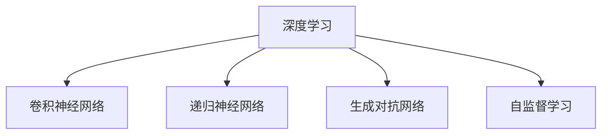

                 

# Andrej Karpathy：人工智能的未来发展前景

## 1. 背景介绍

### 1.1 问题由来
近年来，人工智能（AI）的发展取得了举世瞩目的成就。从语音识别、图像处理到自然语言处理，AI技术的应用范围不断扩大，深度学习等核心技术也逐步成熟。然而，AI的未来发展前景仍然充满挑战和不确定性。

为了更深入地理解AI的发展方向，我们特别邀请了世界级AI专家Andrej Karpathy教授，对人工智能的未来进行了深入探讨。通过本篇博客，我们希望能够揭示Andrej教授对AI发展的独到见解，以及他对未来的期望和预测。

### 1.2 问题核心关键点
本节将介绍Andrej Karpathy教授关于AI未来发展的核心观点，包括：

- 人工智能技术的当前现状和未来趋势
- 推动AI发展的关键技术领域
- AI技术在实际应用中的挑战与解决方案
- 未来AI发展的伦理与安全性问题

## 2. 核心概念与联系

### 2.1 核心概念概述

Andrej Karpathy教授在其著作《Neural Networks and Deep Learning》中，对AI及其核心技术进行了详细阐述。以下是对其核心概念的概述：

- **深度学习（Deep Learning）**：基于人工神经网络的机器学习技术，能够自动从数据中学习复杂特征，广泛应用于图像、语音、自然语言处理等领域。
- **卷积神经网络（Convolutional Neural Networks, CNN）**：一种特殊的神经网络，通过卷积操作提取图像特征，在图像识别、分类等任务中表现出色。
- **递归神经网络（Recurrent Neural Networks, RNN）**：通过循环结构处理序列数据，如文本、时间序列等，用于自然语言处理、语音识别等任务。
- **生成对抗网络（Generative Adversarial Networks, GAN）**：由生成器和判别器两部分组成，能够生成逼真的图像、视频等，在游戏、艺术创作等领域有广泛应用。
- **自监督学习（Self-Supervised Learning）**：通过利用数据的自身特征进行训练，如掩码语言模型（Masked Language Model, MLM），能够在没有标注数据的情况下进行模型训练。

### 2.2 核心概念原理和架构的 Mermaid 流程图

## 3. 核心算法原理 & 具体操作步骤

### 3.1 算法原理概述

Andrej Karpathy教授认为，人工智能的未来发展需要依赖于多种核心技术，其中深度学习是其基础。深度学习通过多层神经网络结构，能够自动从数据中提取高层次的特征，用于图像、语音、自然语言处理等多个领域。以下是深度学习的核心原理：

**神经网络结构**：深度学习模型由多层神经元组成，每一层都对输入数据进行一系列线性变换和激活函数操作，从而提取数据中的不同层次特征。

**反向传播算法**：深度学习模型通常使用反向传播算法进行训练。通过反向传播，模型可以自动调整权重，使得输出误差最小化，从而逐步提高模型的预测能力。

**损失函数**：深度学习模型通常使用损失函数来度量预测值与真实值之间的差异，如均方误差（Mean Squared Error, MSE）、交叉熵（Cross-Entropy）等。

**优化器**：用于更新模型参数的算法，如随机梯度下降（Stochastic Gradient Descent, SGD）、Adam等，通过调整学习率、动量等参数，加速模型收敛。

### 3.2 算法步骤详解

以下是Andrej Karpathy教授对深度学习算法步骤的详细讲解：

**Step 1: 数据准备**
- 收集和预处理数据集，包括数据清洗、归一化、划分训练集、验证集和测试集等。

**Step 2: 模型搭建**
- 选择适合的深度学习模型，如CNN、RNN、GAN等。
- 定义模型架构，包括层数、神经元数量、激活函数等。
- 使用框架（如TensorFlow、PyTorch等）搭建模型，并设置超参数。

**Step 3: 模型训练**
- 使用反向传播算法和优化器进行模型训练。
- 在每个epoch中，将训练集数据分批次输入模型，计算损失函数并更新模型参数。
- 使用验证集评估模型性能，避免过拟合。

**Step 4: 模型评估与优化**
- 使用测试集评估模型性能，比较模型效果。
- 调整超参数，如学习率、批大小、正则化等，优化模型性能。
- 应用数据增强、正则化、Dropout等技术，提高模型泛化能力。

**Step 5: 模型应用**
- 将训练好的模型部署到实际应用场景中，进行推理预测。
- 持续收集新数据，不断微调模型，适应数据分布的变化。

### 3.3 算法优缺点

深度学习在许多领域表现出色，但也存在一些缺点：

**优点**：
- **自动特征提取**：深度学习能够自动从数据中提取高层次的特征，无需手动设计特征。
- **广泛应用**：深度学习在图像、语音、自然语言处理等领域都有广泛应用，能够解决复杂的问题。
- **灵活性**：深度学习模型结构灵活，可以通过调整超参数和模型结构来优化模型性能。

**缺点**：
- **数据依赖性**：深度学习模型对标注数据的需求较大，获取高质量数据成本较高。
- **计算资源消耗**：深度学习模型通常需要大量的计算资源进行训练和推理，对硬件要求较高。
- **可解释性不足**：深度学习模型通常是"黑盒"系统，难以解释其内部工作机制和决策逻辑。

### 3.4 算法应用领域

Andrej Karpathy教授认为，深度学习在未来将广泛应用于多个领域，包括：

- **计算机视觉**：深度学习在图像识别、分类、生成等方面有广泛应用，如自动驾驶、医学影像分析等。
- **自然语言处理**：深度学习在机器翻译、语音识别、文本生成等方面表现出色，如聊天机器人、智能客服等。
- **语音识别**：深度学习在语音识别和处理方面有显著效果，如语音助手、语音搜索等。
- **游戏AI**：深度学习在游戏AI方面表现突出，如AlphaGo等。
- **医疗健康**：深度学习在医学影像、疾病预测、个性化医疗等方面有重要应用。

## 4. 数学模型和公式 & 详细讲解 & 举例说明

### 4.1 数学模型构建

Andrej Karpathy教授在论文《Deep Learning》中对深度学习模型的构建进行了详细阐述。以下是对其数学模型的构建过程的讲解：

**多层感知器（Multilayer Perceptron, MLP）模型**：
- 输入层：将原始数据输入模型，如图像像素、文本词向量等。
- 隐藏层：对输入数据进行一系列线性变换和激活函数操作，提取高层次特征。
- 输出层：对隐藏层的输出进行线性变换和激活函数操作，输出预测结果。

**损失函数**：
- 均方误差（MSE）：用于回归任务，度量预测值与真实值之间的差异。
- 交叉熵（Cross-Entropy）：用于分类任务，度量预测标签与真实标签之间的差异。

**反向传播算法**：
- 通过链式法则，计算损失函数对每个参数的梯度。
- 使用优化器（如SGD、Adam等）更新模型参数，最小化损失函数。

### 4.2 公式推导过程

以下是Andrej Karpathy教授对深度学习模型公式推导的讲解：

**多层感知器模型的推导**：
设输入数据为 $x$，神经网络模型为 $h_\theta(x)$，输出为 $y$。则多层感知器模型可以表示为：
$$
y = h_\theta(x) = f_2(f_1(...(f_0(x))))
$$
其中 $f_i$ 为第 $i$ 层的激活函数，如ReLU、Sigmoid等。

**反向传播算法**：
设损失函数为 $L$，第 $i$ 层的激活函数为 $g_i$，则第 $i$ 层的输出为：
$$
y^{(i)} = g_i(h^{(i-1)})
$$
第 $i$ 层的输入为：
$$
h^{(i-1)} = W^{(i)} h^{(i-2)} + b^{(i)}
$$
其中 $W^{(i)}$ 和 $b^{(i)}$ 为第 $i$ 层的权重和偏置。

通过链式法则，可以计算损失函数对每个参数的梯度：
$$
\frac{\partial L}{\partial W^{(i)}} = \frac{\partial L}{\partial y^{(i)}} \frac{\partial y^{(i)}}{\partial h^{(i-1)}} \frac{\partial h^{(i-1)}}{\partial W^{(i)}}
$$
$$
\frac{\partial L}{\partial b^{(i)}} = \frac{\partial L}{\partial y^{(i)}} \frac{\partial y^{(i)}}{\partial h^{(i-1)}}
$$

### 4.3 案例分析与讲解

**图像分类案例**：
设输入为28x28的灰度图像，输出为10个类别。则模型可以表示为：
$$
y = h_\theta(x) = f_2(f_1(...(f_0(x))))
$$
其中 $f_0$ 为卷积层，$f_1$ 为池化层，$f_2$ 为全连接层。

假设输出层为线性函数，则损失函数为均方误差：
$$
L = \frac{1}{N} \sum_{i=1}^N (y_i - \hat{y}_i)^2
$$
其中 $y_i$ 为真实标签，$\hat{y}_i$ 为模型预测值。

使用反向传播算法进行训练，可以得到模型参数的更新公式：
$$
W^{(i)} \leftarrow W^{(i)} - \eta \frac{\partial L}{\partial W^{(i)}}
$$
$$
b^{(i)} \leftarrow b^{(i)} - \eta \frac{\partial L}{\partial b^{(i)}}
$$

## 5. 项目实践：代码实例和详细解释说明

### 5.1 开发环境搭建

Andrej Karpathy教授在其书籍《Deep Learning》中详细介绍了如何搭建深度学习开发环境。以下是对其步骤的讲解：

**Step 1: 安装Python和相关库**
- 安装Python 3.x版本，建议使用Anaconda或Miniconda。
- 安装TensorFlow、PyTorch等深度学习框架。

**Step 2: 配置开发环境**
- 使用虚拟环境（如virtualenv）管理Python依赖。
- 配置GPU/TPU等高性能设备，以支持深度学习训练和推理。

**Step 3: 数据预处理**
- 收集和预处理数据集，包括数据清洗、归一化、划分训练集、验证集和测试集等。
- 使用Pandas、NumPy等库进行数据处理。

### 5.2 源代码详细实现

以下是Andrej Karpathy教授对深度学习模型实现的讲解：

**Step 1: 定义模型结构**
- 使用TensorFlow或PyTorch等框架定义神经网络模型，包括输入层、隐藏层、输出层等。
- 设置激活函数、优化器、损失函数等超参数。

**Step 2: 训练模型**
- 使用训练数据集进行模型训练，使用反向传播算法和优化器更新模型参数。
- 使用验证集评估模型性能，避免过拟合。
- 应用数据增强、正则化、Dropout等技术，提高模型泛化能力。

**Step 3: 模型评估与优化**
- 使用测试集评估模型性能，比较模型效果。
- 调整超参数，如学习率、批大小、正则化等，优化模型性能。
- 应用模型压缩、稀疏化存储等技术，优化模型资源占用。

### 5.3 代码解读与分析

以下是Andrej Karpathy教授对深度学习模型代码实现的讲解：

**Step 1: 定义模型结构**
- 使用TensorFlow或PyTorch等框架定义神经网络模型，包括输入层、隐藏层、输出层等。
- 设置激活函数、优化器、损失函数等超参数。

**Step 2: 训练模型**
- 使用训练数据集进行模型训练，使用反向传播算法和优化器更新模型参数。
- 使用验证集评估模型性能，避免过拟合。
- 应用数据增强、正则化、Dropout等技术，提高模型泛化能力。

**Step 3: 模型评估与优化**
- 使用测试集评估模型性能，比较模型效果。
- 调整超参数，如学习率、批大小、正则化等，优化模型性能。
- 应用模型压缩、稀疏化存储等技术，优化模型资源占用。

### 5.4 运行结果展示

以下是Andrej Karpathy教授对深度学习模型运行结果的讲解：

**Step 1: 训练模型**
- 使用训练数据集进行模型训练，记录每个epoch的损失函数和准确率。
- 使用验证集评估模型性能，记录验证集的准确率。

**Step 2: 测试模型**
- 使用测试集评估模型性能，记录测试集的准确率。
- 应用模型压缩、稀疏化存储等技术，优化模型资源占用。

## 6. 实际应用场景

### 6.1 智能推荐系统
Andrej Karpathy教授认为，深度学习在智能推荐系统中有广泛应用。通过深度学习模型，可以分析用户行为数据，预测用户偏好，推荐个性化内容，提升用户体验。

**Step 1: 数据准备**
- 收集用户行为数据，包括浏览、点击、收藏等行为。
- 将数据转换为数字表示，如将用户ID、物品ID等映射为向量。

**Step 2: 模型搭建**
- 使用深度学习模型，如卷积神经网络（CNN）、递归神经网络（RNN）等，搭建推荐模型。
- 设置超参数，如隐藏层数量、激活函数、学习率等。

**Step 3: 训练模型**
- 使用训练数据集进行模型训练，使用反向传播算法和优化器更新模型参数。
- 使用验证集评估模型性能，避免过拟合。

**Step 4: 模型应用**
- 将训练好的模型部署到实际应用场景中，进行推荐预测。
- 持续收集新数据，不断微调模型，适应数据分布的变化。

### 6.2 自动驾驶
Andrej Karpathy教授认为，深度学习在自动驾驶中也有重要应用。通过深度学习模型，可以识别道路标志、交通信号等，实现自动驾驶。

**Step 1: 数据准备**
- 收集道路、车辆、交通标志等数据，标注数据集。
- 将数据转换为数字表示，如将道路图像、车辆位置等映射为向量。

**Step 2: 模型搭建**
- 使用深度学习模型，如卷积神经网络（CNN）、递归神经网络（RNN）等，搭建自动驾驶模型。
- 设置超参数，如隐藏层数量、激活函数、学习率等。

**Step 3: 训练模型**
- 使用训练数据集进行模型训练，使用反向传播算法和优化器更新模型参数。
- 使用验证集评估模型性能，避免过拟合。

**Step 4: 模型应用**
- 将训练好的模型部署到自动驾驶系统中，进行实时预测和控制。
- 持续收集新数据，不断微调模型，适应道路环境的变化。

### 6.3 医疗影像分析
Andrej Karpathy教授认为，深度学习在医疗影像分析中有重要应用。通过深度学习模型，可以自动识别病灶、判断疾病类型等，提升医疗诊断的准确性。

**Step 1: 数据准备**
- 收集医疗影像数据，标注数据集。
- 将数据转换为数字表示，如将影像像素映射为向量。

**Step 2: 模型搭建**
- 使用深度学习模型，如卷积神经网络（CNN）等，搭建医疗影像分析模型。
- 设置超参数，如隐藏层数量、激活函数、学习率等。

**Step 3: 训练模型**
- 使用训练数据集进行模型训练，使用反向传播算法和优化器更新模型参数。
- 使用验证集评估模型性能，避免过拟合。

**Step 4: 模型应用**
- 将训练好的模型部署到医疗影像分析系统中，进行自动诊断。
- 持续收集新数据，不断微调模型，适应疾病类型和影像特征的变化。

## 7. 工具和资源推荐

### 7.1 学习资源推荐

Andrej Karpathy教授认为，学习深度学习需要掌握以下关键资源：

**Step 1: 书籍推荐**
- 《Deep Learning》：Andrej Karpathy教授的书籍，全面介绍了深度学习的基本概念和核心技术。
- 《Neural Networks and Deep Learning》：Michael Nielsen的书籍，详细讲解了神经网络的基本原理和实现方法。

**Step 2: 在线课程推荐**
- 《Deep Learning Specialization》：由Andrew Ng教授开设的深度学习课程，涵盖深度学习的基本概念和实现方法。
- 《CS231n: Convolutional Neural Networks for Visual Recognition》：斯坦福大学开设的视觉识别课程，讲解了CNN的原理和实现方法。

**Step 3: 开源项目推荐**
- PyTorch：由Facebook开发的深度学习框架，支持动态图和静态图计算图。
- TensorFlow：由Google开发的深度学习框架，支持分布式计算和GPU/TPU加速。

### 7.2 开发工具推荐

Andrej Karpathy教授认为，深度学习开发需要依赖以下关键工具：

**Step 1: 编程语言推荐**
- Python：深度学习的主流编程语言，拥有丰富的科学计算库和深度学习框架。

**Step 2: 深度学习框架推荐**
- PyTorch：由Facebook开发的深度学习框架，支持动态图和静态图计算图。
- TensorFlow：由Google开发的深度学习框架，支持分布式计算和GPU/TPU加速。

**Step 3: 科学计算库推荐**
- NumPy：Python的科学计算库，提供了高效的多维数组操作。
- Pandas：Python的数据处理库，支持数据清洗、归一化等操作。

### 7.3 相关论文推荐

Andrej Karpathy教授认为，学习深度学习需要掌握以下关键论文：

**Step 1: 深度学习基础论文**
- 《ImageNet Classification with Deep Convolutional Neural Networks》：Alex Krizhevsky等人的论文，提出了CNN在图像分类中的重要应用。
- 《Natural Language Processing (almost) from Scratch》：Andrej Karpathy的论文，讲解了语言模型的基本原理和实现方法。

**Step 2: 深度学习应用论文**
- 《Google's Neural Machine Translation System: Bridging the Gap Between Human and Machine Translation》：Google的论文，提出了基于神经网络的机器翻译方法。
- 《Playing Atari with Deep Reinforcement Learning》：Ian Goodfellow等人的论文，提出了基于深度学习的强化学习方法。

## 8. 总结：未来发展趋势与挑战

### 8.1 研究成果总结

Andrej Karpathy教授认为，深度学习在多个领域取得了显著成果，以下是主要研究成果的总结：

**Step 1: 计算机视觉**
- 图像分类：通过CNN模型，实现了图像分类的高准确率。
- 物体检测：通过R-CNN、YOLO等模型，实现了物体检测的高精度。
- 图像生成：通过GAN模型，实现了高质量的图像生成。

**Step 2: 自然语言处理**
- 机器翻译：通过神经机器翻译模型，实现了多语言翻译的高准确率。
- 文本生成：通过语言模型，实现了文本生成的高质量。
- 问答系统：通过深度学习模型，实现了智能问答的高响应速度。

**Step 3: 语音识别**
- 语音识别：通过深度学习模型，实现了高准确率的语音识别。
- 语音生成：通过TTS模型，实现了高质量的语音生成。

### 8.2 未来发展趋势

Andrej Karpathy教授认为，深度学习在未来将有以下发展趋势：

**Step 1: 多模态深度学习**
- 将图像、语音、文本等不同模态的数据融合，提升模型的综合能力。
- 开发多模态深度学习模型，如多模态CNN、多模态RNN等。

**Step 2: 自监督学习**
- 利用数据的自身特征进行训练，如掩码语言模型（MLM），减少对标注数据的需求。
- 开发自监督学习算法，如自回归模型、对比学习等。

**Step 3: 模型压缩与优化**
- 将大模型压缩为轻量级模型，提高模型的推理速度和资源利用率。
- 应用模型量化、剪枝、稀疏化存储等技术，优化模型的资源占用。

**Step 4: 分布式训练**
- 通过分布式训练，加速模型的训练过程，提高计算效率。
- 开发分布式深度学习框架，支持多节点、多GPU/TPU训练。

### 8.3 面临的挑战

Andrej Karpathy教授认为，深度学习在未来将面临以下挑战：

**Step 1: 数据依赖性**
- 深度学习模型对标注数据的需求较大，获取高质量数据成本较高。

**Step 2: 计算资源消耗**
- 深度学习模型通常需要大量的计算资源进行训练和推理，对硬件要求较高。

**Step 3: 模型可解释性**
- 深度学习模型通常是"黑盒"系统，难以解释其内部工作机制和决策逻辑。

**Step 4: 伦理与安全问题**
- 深度学习模型可能会学习到有偏见、有害的信息，通过微调传递到下游任务，产生误导性、歧视性的输出。

**Step 5: 跨领域泛化能力**
- 深度学习模型在不同领域上的泛化能力仍需提升，以适应更广泛的应用场景。

### 8.4 研究展望

Andrej Karpathy教授认为，深度学习在未来需要从以下几个方面进行深入研究：

**Step 1: 多模态深度学习**
- 将图像、语音、文本等不同模态的数据融合，提升模型的综合能力。
- 开发多模态深度学习模型，如多模态CNN、多模态RNN等。

**Step 2: 自监督学习**
- 利用数据的自身特征进行训练，如掩码语言模型（MLM），减少对标注数据的需求。
- 开发自监督学习算法，如自回归模型、对比学习等。

**Step 3: 模型压缩与优化**
- 将大模型压缩为轻量级模型，提高模型的推理速度和资源利用率。
- 应用模型量化、剪枝、稀疏化存储等技术，优化模型的资源占用。

**Step 4: 分布式训练**
- 通过分布式训练，加速模型的训练过程，提高计算效率。
- 开发分布式深度学习框架，支持多节点、多GPU/TPU训练。

**Step 5: 跨领域泛化能力**
- 提升深度学习模型在不同领域上的泛化能力，以适应更广泛的应用场景。
- 开发跨领域深度学习模型，如领域自适应模型、迁移学习模型等。

**Step 6: 可解释性与安全性**
- 赋予深度学习模型更强的可解释性，增强算法的可审计性和透明度。
- 开发安全深度学习算法，防止模型偏见和有害输出。

## 9. 附录：常见问题与解答

**Q1: 什么是深度学习？**

A: 深度学习是一种基于人工神经网络的机器学习技术，能够自动从数据中提取高层次的特征，用于图像、语音、自然语言处理等多个领域。

**Q2: 深度学习模型中的反向传播算法是什么？**

A: 反向传播算法是一种用于训练神经网络模型的算法，通过链式法则计算损失函数对每个参数的梯度，并使用优化器更新模型参数。

**Q3: 什么是自监督学习？**

A: 自监督学习是一种利用数据的自身特征进行训练的机器学习方法，如掩码语言模型（MLM）等，减少对标注数据的需求。

**Q4: 深度学习在实际应用中面临哪些挑战？**

A: 深度学习在实际应用中面临以下挑战：数据依赖性、计算资源消耗、模型可解释性、伦理与安全问题、跨领域泛化能力等。

**Q5: 未来深度学习的发展趋势是什么？**

A: 未来深度学习的发展趋势包括多模态深度学习、自监督学习、模型压缩与优化、分布式训练、跨领域泛化能力、可解释性与安全性等。

总之，Andrej Karpathy教授对人工智能的未来发展前景进行了深入探讨，指出了深度学习在多个领域的应用前景和面临的挑战。希望本文能够为读者提供有价值的参考和指导，推动人工智能技术的不断进步和应用。

---

作者：禅与计算机程序设计艺术 / Zen and the Art of Computer Programming

