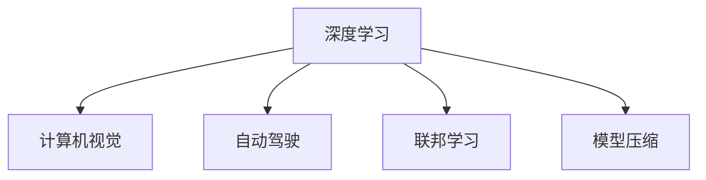

                 

# Andrej Karpathy：人工智能的未来发展前景

## 1. 背景介绍

### 1.1 问题由来

Andrej Karpathy，斯坦福大学的计算机视觉教授，以其在深度学习领域的突破性贡献而闻名。作为一名深耕AI领域的研究者，他不仅发表了大量具有影响力的论文，还在开源社区中积极推动AI技术的普及和进步。在当前AI技术快速发展、人工智能在未来发展前景备受关注的背景下，Karpathy对AI未来的展望显得尤为重要。

### 1.2 问题核心关键点

Karpathy的研究重点在于计算机视觉和深度学习。他在图像生成、自动驾驶、动态视频理解等领域取得了显著成果。他认为，AI技术未来的发展前景将基于以下几个关键点：

- **数据质量与多样性**：高质量、多样化的数据是训练高效、泛化能力强的模型的基础。
- **模型规模与深度**：更大规模、更深层次的模型可以更好地捕捉数据中的复杂关系。
- **训练与推理效率**：高效的训练与推理方法，使得AI模型能够迅速地应用于实际问题。
- **联邦学习与隐私保护**：在保护用户隐私的前提下，利用联邦学习等技术进行模型更新。
- **跨领域协同**：将AI技术与其他领域（如医疗、金融、教育）进行跨领域融合，解决更复杂的问题。

### 1.3 问题研究意义

Karpathy对AI未来发展的展望不仅是对当前AI技术的总结，更对未来的研究方向和应用场景提出了新的思考。这种前瞻性的视角对于研究者、开发者以及产业界都有着重要的指导意义。

## 2. 核心概念与联系

### 2.1 核心概念概述

为更好地理解Karpathy对AI未来的展望，本节将介绍几个关键概念：

- **深度学习**：一种基于神经网络的机器学习技术，通过多层次的非线性变换，自动从数据中提取高级特征。
- **计算机视觉**：利用计算机和算法，使计算机能够“看”懂图片和视频，并对其进行理解、识别和分析。
- **自动驾驶**：结合计算机视觉、传感器技术和AI算法，实现自动驾驶车辆。
- **联邦学习**：一种分布式机器学习技术，多台设备协同工作，在不共享数据的前提下更新模型。
- **模型压缩与优化**：通过剪枝、量化等技术，减少模型参数和计算量，提高模型效率。

这些概念之间的逻辑关系可以通过以下Mermaid流程图来展示：



这个流程图展示了大语言模型的核心概念及其之间的关系：

1. 深度学习是计算机视觉和自动驾驶等应用的基础。
2. 计算机视觉通过深度学习进行图像识别和处理。
3. 自动驾驶结合计算机视觉和AI算法，实现自主驾驶。
4. 联邦学习使多个设备在不共享数据的前提下协同工作。
5. 模型压缩优化提高模型效率，使其能够更快地部署到实际应用中。

## 3. 核心算法原理 & 具体操作步骤

### 3.1 算法原理概述

Karpathy对AI未来的展望基于以下几个核心算法原理：

- **自监督学习**：利用无标签数据进行预训练，学习到数据的潜在特征。
- **迁移学习**：将预训练模型在其他任务上微调，提升模型在新任务上的表现。
- **强化学习**：通过奖励和惩罚机制，让模型在不断试错中优化决策策略。
- **对抗训练**：通过对抗样本训练，增强模型的鲁棒性和泛化能力。
- **联邦学习**：多台设备协同工作，在不共享数据的前提下更新模型。

### 3.2 算法步骤详解

以下是Karpathy对AI未来发展的关键步骤详解：

1. **数据收集与预处理**：收集高质量、多样化的数据，并进行数据增强、标注等预处理操作。
2. **自监督学习**：在无标签数据上训练基础模型，学习数据的潜在特征。
3. **迁移学习**：将预训练模型在其他任务上进行微调，提升模型在新任务上的泛化能力。
4. **强化学习**：在实际应用中，通过不断试错和反馈，优化模型决策策略。
5. **对抗训练**：在训练过程中，引入对抗样本，提升模型的鲁棒性和泛化能力。
6. **联邦学习**：多台设备协同工作，在不共享数据的前提下更新模型。
7. **模型压缩与优化**：通过剪枝、量化等技术，减少模型参数和计算量，提高模型效率。

### 3.3 算法优缺点

Karpathy对AI未来发展的展望具有以下优点：

- **高效泛化**：自监督学习和迁移学习能够有效提升模型的泛化能力。
- **鲁棒性提升**：对抗训练和联邦学习增强了模型的鲁棒性和安全性。
- **低成本**：通过模型压缩与优化，降低模型在硬件上的资源需求。

同时，也存在一些局限性：

- **数据依赖**：高质量数据的获取成本较高，对训练效果有直接影响。
- **计算资源**：深度学习模型的训练和推理需要强大的计算资源，对硬件有较高要求。
- **模型复杂性**：大规模模型结构复杂，难以解释和调试。
- **隐私问题**：联邦学习在保护隐私方面的挑战依然存在。

### 3.4 算法应用领域

Karpathy的研究成果已广泛应用于计算机视觉、自动驾驶、医疗影像等多个领域，具体如下：

- **计算机视觉**：Karpathy的ResNet和Fast R-CNN等模型在图像分类、目标检测、图像生成等方面取得了显著成果。
- **自动驾驶**：通过深度学习技术，结合传感器数据和AI算法，实现了自动驾驶车辆。
- **医疗影像**：利用深度学习技术，对医疗影像进行分类、检测、分割等任务，提高了医疗影像分析的准确性和效率。
- **自然语言处理**：在语言模型和自动生成文本等方面，Karpathy的研究也有所涉猎。

## 4. 数学模型和公式 & 详细讲解 & 举例说明

### 4.1 数学模型构建

Karpathy的研究中，深度学习模型的构建是核心。以卷积神经网络(Convolutional Neural Network, CNN)为例，构建如下：

- **输入**：图像数据 $X$，大小为 $H\times W \times C$，其中 $H$ 为高度，$W$ 为宽度，$C$ 为通道数。
- **卷积层**：通过卷积操作提取图像特征，生成特征图 $F$，大小为 $H'\times W' \times C'$，其中 $H'$ 和 $W'$ 为卷积后的高度和宽度，$C'$ 为卷积核数量。
- **池化层**：通过最大池化或平均池化操作，进一步压缩特征图 $F'$，大小为 $H''\times W'' \times C'$，其中 $H''$ 和 $W''$ 为池化后的高度和宽度。
- **全连接层**：将池化后的特征 $F''$ 展开，输入全连接层进行分类或回归，输出结果 $Y$。

### 4.2 公式推导过程

以卷积神经网络为例，进行公式推导：

- **卷积操作**：假设输入图像 $X$ 的大小为 $H\times W\times C$，卷积核大小为 $k_h\times k_w$，步幅为 $s_h$，填充为 $p_h$。卷积操作公式为：
  $$
  F_{i,j,k} = \sum_{m=0}^{k_h-1} \sum_{n=0}^{k_w-1} X_{(i-m,k), (j-n,k)} * W_{m,n,k}
  $$

- **池化操作**：假设池化操作大小为 $k_h\times k_w$，步幅为 $s_h$。池化操作公式为：
  $$
  F_{i,j,k} = \max_{m=0}^{k_h-1} \max_{n=0}^{k_w-1} X_{(i-m,k), (j-n,k)}
  $$

### 4.3 案例分析与讲解

以图像分类任务为例，详细讲解深度学习模型的训练与推理过程：

1. **模型构建**：设计卷积神经网络模型，包含若干卷积层、池化层和全连接层。
2. **数据准备**：收集图像数据，并进行预处理，如归一化、数据增强等。
3. **模型训练**：在训练集上，通过反向传播算法更新模型参数，最小化损失函数。
4. **模型推理**：在测试集上，通过前向传播算法进行推理，预测分类结果。

## 5. 项目实践：代码实例和详细解释说明

### 5.1 开发环境搭建

在开始项目实践前，需要先搭建好开发环境。以下是使用PyTorch搭建环境的步骤：

1. 安装Anaconda：从官网下载并安装Anaconda，用于创建独立的Python环境。
2. 创建并激活虚拟环境：
```bash
conda create -n pytorch-env python=3.8 
conda activate pytorch-env
```
3. 安装PyTorch：根据CUDA版本，从官网获取对应的安装命令。例如：
```bash
conda install pytorch torchvision torchaudio cudatoolkit=11.1 -c pytorch -c conda-forge
```
4. 安装Transformers库：
```bash
pip install transformers
```
5. 安装各类工具包：
```bash
pip install numpy pandas scikit-learn matplotlib tqdm jupyter notebook ipython
```

完成上述步骤后，即可在`pytorch-env`环境中开始项目实践。

### 5.2 源代码详细实现

以下是一个简单的图像分类项目，使用PyTorch和卷积神经网络实现：

```python
import torch
import torchvision
import torchvision.transforms as transforms
from torch import nn, optim

# 定义数据预处理函数
transform = transforms.Compose([
    transforms.Resize(256),
    transforms.CenterCrop(224),
    transforms.ToTensor(),
    transforms.Normalize(mean=[0.485, 0.456, 0.406], std=[0.229, 0.224, 0.225])
])

# 加载数据集
train_set = torchvision.datasets.ImageFolder(root='train', transform=transform)
train_loader = torch.utils.data.DataLoader(train_set, batch_size=32, shuffle=True)

# 定义模型
model = nn.Sequential(
    nn.Conv2d(3, 64, kernel_size=3, padding=1),
    nn.ReLU(),
    nn.MaxPool2d(kernel_size=2, stride=2),
    nn.Conv2d(64, 128, kernel_size=3, padding=1),
    nn.ReLU(),
    nn.MaxPool2d(kernel_size=2, stride=2),
    nn.Flatten(),
    nn.Linear(128 * 7 * 7, 512),
    nn.ReLU(),
    nn.Linear(512, 10)
)

# 定义损失函数和优化器
criterion = nn.CrossEntropyLoss()
optimizer = optim.Adam(model.parameters(), lr=0.001)

# 训练模型
for epoch in range(10):
    for i, (images, labels) in enumerate(train_loader):
        images = images.to(device)
        labels = labels.to(device)
        optimizer.zero_grad()
        outputs = model(images)
        loss = criterion(outputs, labels)
        loss.backward()
        optimizer.step()
```

### 5.3 代码解读与分析

让我们再详细解读一下关键代码的实现细节：

**数据预处理函数**：
- `transform`函数：对输入图像进行归一化、缩放、裁剪、转换等操作，生成标准化的输入数据。
- `transforms.Compose`：将多个数据预处理操作组合成一条流水线，依次应用于输入数据。

**模型定义**：
- `nn.Sequential`：定义包含多个子模块的顺序模型。
- `nn.Conv2d`：定义二维卷积层，通过卷积操作提取特征。
- `nn.ReLU`：定义ReLU激活函数，增加非线性变换。
- `nn.MaxPool2d`：定义最大池化层，压缩特征图。
- `nn.Flatten`：将多维特征图展开成一维特征向量。
- `nn.Linear`：定义全连接层，进行分类或回归。

**训练过程**：
- `for`循环：在多个epoch上遍历训练集。
- `enumerate`函数：遍历训练集中的图像和标签。
- `to(device)`：将数据和模型参数移动到GPU上进行加速。
- `optimizer.zero_grad()`：清除梯度。
- `outputs = model(images)`：前向传播，生成模型输出。
- `loss = criterion(outputs, labels)`：计算损失函数。
- `loss.backward()`：反向传播，计算梯度。
- `optimizer.step()`：更新模型参数。

### 5.4 运行结果展示

训练完成后，可以在测试集上进行推理，预测新图像的分类结果：

```python
# 加载测试集
test_set = torchvision.datasets.ImageFolder(root='test', transform=transform)
test_loader = torch.utils.data.DataLoader(test_set, batch_size=32, shuffle=False)

# 评估模型
model.eval()
correct = 0
total = 0
with torch.no_grad():
    for images, labels in test_loader:
        images = images.to(device)
        labels = labels.to(device)
        outputs = model(images)
        _, predicted = torch.max(outputs, 1)
        total += labels.size(0)
        correct += (predicted == labels).sum().item()

print(f'Accuracy of the network on the 10000 test images: {100 * correct / total:.2f}%')
```

## 6. 实际应用场景

### 6.1 计算机视觉

计算机视觉是Karpathy研究的主要方向之一，他在图像分类、目标检测、图像生成等方面取得了显著成果。例如，他的ResNet模型在ImageNet上取得了最优结果。

具体应用场景包括：

- **自动驾驶**：通过摄像头和传感器数据，对道路、行人、车辆等进行实时识别和分析，实现自动驾驶车辆。
- **医疗影像分析**：对X光片、CT、MRI等医学影像进行分类、检测、分割，辅助医生诊断。
- **视频分析**：对视频进行关键帧提取、动作识别、情感分析等，用于监控、安全等领域。

### 6.2 自然语言处理

Karpathy在自然语言处理领域也有所涉猎，尤其是在语言模型和自动生成文本等方面。例如，他的GPT系列模型在自然语言生成方面表现优异。

具体应用场景包括：

- **自动翻译**：将一种语言自动翻译成另一种语言。
- **聊天机器人**：通过对话系统，实现人与机器的交互。
- **内容生成**：自动生成新闻、文章、摘要等内容。

### 6.3 智能制造

Karpathy的研究还扩展到了智能制造领域，利用深度学习技术优化生产流程，提升生产效率。例如，他的AI机器人可以自动执行复杂的生产任务。

具体应用场景包括：

- **自动化生产**：通过视觉识别技术，实现自动化生产线上的产品检测、分拣、组装等任务。
- **质量控制**：对生产过程中的质量数据进行分析，优化生产参数，提升产品质量。
- **设备维护**：通过图像识别技术，对设备状态进行监测和预测，提前发现故障，减少停机时间。

## 7. 工具和资源推荐

### 7.1 学习资源推荐

为了帮助开发者系统掌握AI技术，Karpathy推荐了以下学习资源：

1. **Deep Learning Specialization**：由斯坦福大学开设的深度学习课程，涵盖深度学习的基本原理和实践技巧，适合初学者入门。
2. **PyTorch Tutorials**：PyTorch官方提供的详细教程，涵盖PyTorch的基本操作和高级技术。
3. **CS231n: Convolutional Neural Networks for Visual Recognition**：斯坦福大学计算机视觉课程，涵盖卷积神经网络在图像识别和分类中的应用。
4. **Fast R-CNN Notebook**：Karpathy自己编写的Fast R-CNN模型的Notebook，详细解释了模型的构建和训练过程。

### 7.2 开发工具推荐

以下是Karpathy推荐的开发工具：

1. **PyTorch**：基于Python的开源深度学习框架，灵活动态的计算图，适合快速迭代研究。
2. **TensorFlow**：由Google主导开发的开源深度学习框架，生产部署方便，适合大规模工程应用。
3. **Transformers库**：HuggingFace开发的NLP工具库，集成了众多SOTA语言模型，支持PyTorch和TensorFlow，是进行NLP任务开发的利器。
4. **Weights & Biases**：模型训练的实验跟踪工具，可以记录和可视化模型训练过程中的各项指标，方便对比和调优。
5. **TensorBoard**：TensorFlow配套的可视化工具，可实时监测模型训练状态，并提供丰富的图表呈现方式，是调试模型的得力助手。

### 7.3 相关论文推荐

以下是Karpathy的研究成果，推荐阅读：

1. **Fast R-CNN**：一种高效的深度学习目标检测算法，论文链接：https://arxiv.org/abs/1504.08083
2. **ResNet**：一种深度残差网络，论文链接：https://arxiv.org/abs/1512.03385
3. **Adversarial Machine Learning**：对抗样本对深度学习模型的影响，论文链接：https://arxiv.org/abs/1412.6572
4. **Deep Residual Learning for Image Recognition**：ResNet模型的详细解释，论文链接：https://arxiv.org/abs/1512.03385
5. **Convolutional Neural Networks for Visual Recognition**：卷积神经网络在图像识别和分类中的应用，论文链接：https://arxiv.org/abs/1512.00567

## 8. 总结：未来发展趋势与挑战

### 8.1 总结

Karpathy对AI未来的展望不仅是对当前AI技术的总结，更对未来的研究方向和应用场景提出了新的思考。他的研究成果展示了AI技术在计算机视觉、自动驾驶、自然语言处理等领域的广阔应用前景。

### 8.2 未来发展趋势

Karpathy认为，AI技术未来的发展趋势将基于以下几个关键点：

1. **多模态融合**：将视觉、语音、文本等多种模态数据融合，实现更全面的信息理解和处理。
2. **自监督学习**：利用无标签数据进行预训练，学习数据的潜在特征。
3. **模型压缩与优化**：通过剪枝、量化等技术，减少模型参数和计算量，提高模型效率。
4. **联邦学习**：多台设备协同工作，在不共享数据的前提下更新模型。
5. **对抗训练**：通过对抗样本训练，增强模型的鲁棒性和泛化能力。

### 8.3 面临的挑战

Karpathy认为，AI技术在发展过程中也面临着诸多挑战：

1. **数据依赖**：高质量数据的获取成本较高，对训练效果有直接影响。
2. **计算资源**：深度学习模型的训练和推理需要强大的计算资源，对硬件有较高要求。
3. **模型复杂性**：大规模模型结构复杂，难以解释和调试。
4. **隐私问题**：联邦学习在保护隐私方面的挑战依然存在。

### 8.4 研究展望

Karpathy对AI技术的研究展望将聚焦于以下几个方向：

1. **跨领域协同**：将AI技术与其他领域（如医疗、金融、教育）进行跨领域融合，解决更复杂的问题。
2. **模型压缩与优化**：进一步开发更加参数高效的模型，减少计算资源消耗，提高模型效率。
3. **联邦学习**：探索更高效的联邦学习算法，增强模型更新效率。
4. **对抗训练**：引入更强的对抗样本，提高模型鲁棒性和泛化能力。
5. **自监督学习**：利用更多无标签数据进行预训练，学习更全面的特征。

总之，Karpathy的研究成果为AI技术的发展提供了重要的方向指引，未来AI技术将在多个领域绽放新的应用价值，为人类社会带来深远的影响。

## 9. 附录：常见问题与解答

**Q1：什么是自监督学习？**

A: 自监督学习是一种利用无标签数据进行预训练的机器学习方法，通过构造损失函数，使模型学习到数据的潜在特征。常用的自监督学习任务包括掩码语言模型、自编码器等。

**Q2：什么是联邦学习？**

A: 联邦学习是一种分布式机器学习方法，多台设备在不共享数据的前提下协同工作，更新全局模型参数。通过多次迭代，各设备可以在本地数据上更新模型，最终得到全局最优解。

**Q3：什么是对抗训练？**

A: 对抗训练是一种增强模型鲁棒性的方法，通过引入对抗样本，使模型能够对噪声和干扰具有更好的抵抗能力。常用的对抗样本生成方法包括FGSM、PGD等。

**Q4：什么是模型压缩与优化？**

A: 模型压缩与优化是一种通过剪枝、量化等技术，减少模型参数和计算量，提高模型效率的方法。常用的模型压缩技术包括剪枝、量化、蒸馏等。

**Q5：什么是多模态融合？**

A: 多模态融合是将视觉、语音、文本等多种模态数据融合，实现更全面的信息理解和处理。常用的多模态融合方法包括特征融合、跨模态嵌入等。

---

作者：禅与计算机程序设计艺术 / Zen and the Art of Computer Programming

