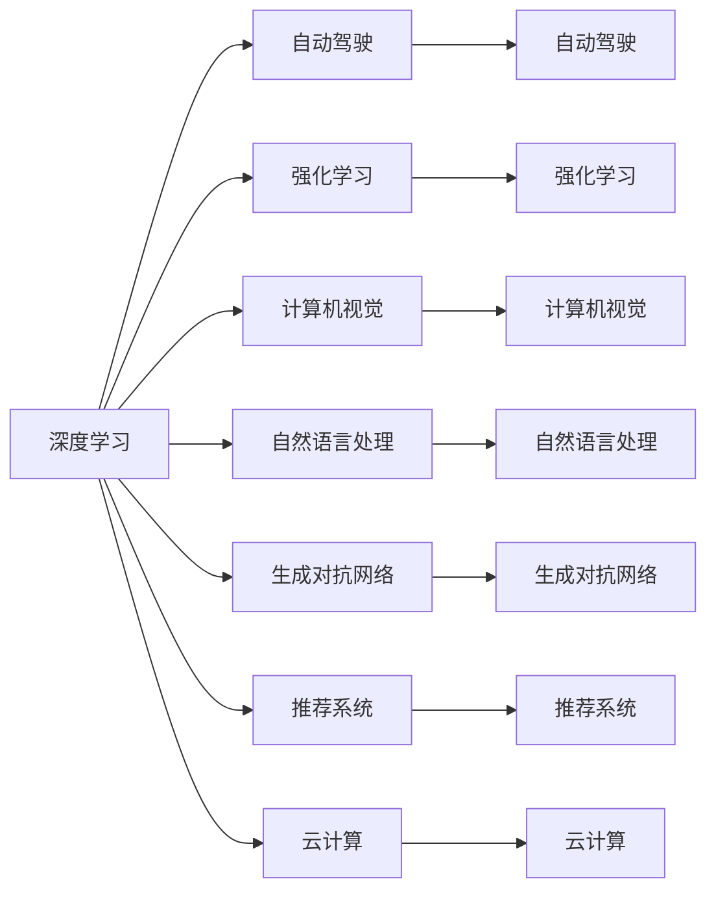

                 

## 1. 背景介绍

Andrej Karpathy，作为深度学习和计算机视觉领域的先驱之一，其见解在技术界具有极高的权威性和指导意义。他的观点和预测往往能预示未来AI技术的方向，指导着研发人员的实践与探索。在探讨人工智能的未来发展前景时，Karpathy提出了一系列深刻洞见，为我们理解AI的发展趋势提供了重要的视角。

## 2. 核心概念与联系

### 2.1 核心概念概述

Andrej Karpathy的研究重点聚焦于深度学习在计算机视觉、自动驾驶等领域的应用。他特别强调了自动驾驶、机器人控制和强化学习在实现通用智能方面的潜力。同时，他也关注了深度学习在自然语言处理、生成对抗网络、推荐系统和云计算等领域的广泛应用。

### 2.2 核心概念原理和架构的 Mermaid 流程图



该流程图清晰地展示了Andrej Karpathy研究的主要方向和概念联系。深度学习作为底层技术，支撑着自动驾驶、强化学习、计算机视觉、自然语言处理、生成对抗网络、推荐系统和云计算等多领域的创新与发展。

## 3. 核心算法原理 & 具体操作步骤

### 3.1 算法原理概述

Karpathy强调了深度学习在各领域的广泛应用和巨大潜力。以自动驾驶为例，深度学习模型通过大量数据进行训练，能够自动感知环境和道路规则，进行路径规划和决策。强化学习进一步提升了模型的自适应能力，使其能够在复杂多变的环境中不断优化和改进。

### 3.2 算法步骤详解

在自动驾驶领域，深度学习模型通常包括以下步骤：
1. 数据收集：获取大量的驾驶数据，包括图像、传感器数据和车辆状态信息。
2. 数据预处理：清洗数据，进行特征提取，将图像数据转换为模型输入。
3. 模型训练：使用深度神经网络模型，如卷积神经网络(CNN)或循环神经网络(RNN)，对收集到的数据进行训练。
4. 模型评估：在测试集上评估模型性能，通过准确率和召回率等指标衡量模型效果。
5. 模型优化：根据评估结果，调整模型参数和架构，进一步提升性能。
6. 部署测试：将优化后的模型部署到实际车辆中，进行实际驾驶测试，确保模型可靠性。

### 3.3 算法优缺点

深度学习的优点包括强大的模型表达能力、自适应学习和泛化能力，能够处理大规模复杂数据。但缺点也显而易见，如模型训练成本高、数据需求大、易过拟合等。因此，在实际应用中，需要结合具体情况，进行算法优化和调整。

### 3.4 算法应用领域

深度学习的应用领域非常广泛，涵盖了自动驾驶、机器人控制、自然语言处理、计算机视觉、生成对抗网络、推荐系统和云计算等。

## 4. 数学模型和公式 & 详细讲解 & 举例说明

### 4.1 数学模型构建

以自动驾驶中的深度学习模型为例，假设模型输入为$t$时刻的摄像头图像，输出为$t+1$时刻的车辆速度和方向。模型可以表示为：

$$
y = f(x; \theta)
$$

其中，$x$为输入图像，$\theta$为模型参数，$f$为深度神经网络模型。

### 4.2 公式推导过程

对于图像分类任务，通常使用卷积神经网络(CNN)模型。以LeNet为例，其基本结构包括卷积层、池化层和全连接层。以手写数字识别为例，模型的目标是最小化交叉熵损失函数：

$$
L = -\frac{1}{N}\sum_{i=1}^N\sum_{j=1}^{10}y_{ij}\log\hat{y}_{ij}
$$

其中，$y_{ij}$为第$i$张图片第$j$个类别的标签，$\hat{y}_{ij}$为模型预测的第$i$张图片第$j$个类别的概率。

### 4.3 案例分析与讲解

以生成对抗网络(GAN)为例，其基本结构包括生成器$G$和判别器$D$。生成器的目标是从噪声中生成逼真的图像，判别器的目标是区分真实图像和生成的假图像。GAN的训练过程通过对抗博弈实现：

1. 固定$G$，更新$D$，使得$D$能够准确区分真实和假图像。
2. 固定$D$，更新$G$，使得$G$生成的图像越来越逼真，难以被$D$区分。
3. 重复步骤1和2，直到$G$和$D$达到均衡状态。

## 5. 项目实践：代码实例和详细解释说明

### 5.1 开发环境搭建

在Python环境中安装必要的深度学习框架，如TensorFlow或PyTorch。同时安装OpenCV等计算机视觉库，以及相关硬件设备（如GPU或TPU）。

### 5.2 源代码详细实现

以自动驾驶中的深度学习模型为例，以下是一个简单的卷积神经网络实现：

```python
import tensorflow as tf
from tensorflow.keras import layers

# 定义模型
model = tf.keras.Sequential([
    layers.Conv2D(32, (3, 3), activation='relu', input_shape=(28, 28, 1)),
    layers.MaxPooling2D((2, 2)),
    layers.Flatten(),
    layers.Dense(10, activation='softmax')
])

# 编译模型
model.compile(optimizer='adam', loss='categorical_crossentropy', metrics=['accuracy'])

# 训练模型
model.fit(train_images, train_labels, epochs=10, validation_data=(test_images, test_labels))
```

### 5.3 代码解读与分析

以上代码实现了一个简单的CNN模型，用于手写数字识别。模型包括一个卷积层、一个池化层和一个全连接层。通过`compile`方法指定优化器、损失函数和评估指标，然后使用`fit`方法进行模型训练。

### 5.4 运行结果展示

训练完成后，可以通过`evaluate`方法在测试集上评估模型性能，输出准确率等指标：

```python
test_loss, test_acc = model.evaluate(test_images, test_labels)
print('Test accuracy:', test_acc)
```

## 6. 实际应用场景

### 6.1 自动驾驶

自动驾驶技术在近年来取得了显著进展。Karpathy指出，自动驾驶将极大改善交通安全和交通效率，带来交通领域的革命性变革。然而，自动驾驶的实现仍面临诸多挑战，如环境感知、决策制定、系统鲁棒性等。

### 6.2 机器人控制

深度学习在机器人控制中的应用同样备受关注。通过强化学习，机器人能够在复杂环境中进行自主决策和路径规划，提升作业效率和安全性。

### 6.3 自然语言处理

自然语言处理(NLP)是深度学习的重要应用领域。Karpathy认为，NLP将推动机器理解和生成自然语言，成为人工智能的核心技术之一。

### 6.4 未来应用展望

未来，深度学习将广泛应用于更多领域，推动人工智能技术的发展和应用。预计AI将更加普及和智能化，带来更多便利和变革。

## 7. 工具和资源推荐

### 7.1 学习资源推荐

1. [Deep Learning Specialization](https://www.coursera.org/specializations/deep-learning)：由Andrew Ng教授主讲的深度学习课程，涵盖深度学习基础、卷积神经网络、生成对抗网络等。
2. [CS231n: Convolutional Neural Networks for Visual Recognition](https://cs231n.github.io/)：斯坦福大学的计算机视觉课程，涵盖卷积神经网络、图像分类、目标检测等。
3. [CS224n: Natural Language Processing with Deep Learning](https://web.stanford.edu/class/cs224n/)：斯坦福大学的自然语言处理课程，涵盖深度学习在NLP中的应用。

### 7.2 开发工具推荐

1. TensorFlow：由Google开发的深度学习框架，支持分布式计算和GPU加速。
2. PyTorch：由Facebook开发的深度学习框架，支持动态计算图和GPU加速。
3. OpenCV：开源计算机视觉库，提供丰富的图像处理和识别功能。

### 7.3 相关论文推荐

1. [ImageNet Classification with Deep Convolutional Neural Networks](https://papers.nips.cc/paper/4824-imagenet-classification-with-deep-convolutional-neural-networks.pdf)：AlexNet论文，介绍了深度卷积神经网络在图像分类中的应用。
2. [Generative Adversarial Nets](https://papers.nips.cc/paper/5346-generative-adversarial-nets.pdf)：GAN论文，介绍了生成对抗网络的基本结构和工作原理。
3. [Attention Is All You Need](https://arxiv.org/abs/1706.03762)：Transformer论文，介绍了Transformer模型在自然语言处理中的应用。

## 8. 总结：未来发展趋势与挑战

### 8.1 研究成果总结

Andrej Karpathy的研究成果在深度学习领域具有深远影响，推动了自动驾驶、计算机视觉、自然语言处理等技术的发展。

### 8.2 未来发展趋势

未来，深度学习将更加普及和智能化，应用于更多领域。自动驾驶、机器人控制、自然语言处理等领域将迎来更多突破。

### 8.3 面临的挑战

尽管深度学习技术取得显著进展，但仍面临诸多挑战，如数据需求大、计算资源消耗高、模型复杂度高等。

### 8.4 研究展望

未来，需要进一步优化深度学习模型，降低计算资源消耗，提升模型效率和可解释性。同时，需要加强多模态数据的融合，拓展深度学习的应用场景。

## 9. 附录：常见问题与解答

**Q1：如何处理深度学习中的过拟合问题？**

A: 深度学习模型通常面临过拟合问题，可通过以下方法解决：
1. 数据增强：扩充训练集，增加数据多样性。
2. 正则化：使用L2正则化、Dropout等技术，防止模型过拟合。
3. 早停策略：在验证集上评估模型性能，当性能不再提升时停止训练。

**Q2：深度学习在实际应用中如何部署和优化？**

A: 深度学习模型在实际应用中需要进行优化和部署，具体方法包括：
1. 模型裁剪：去除不必要的层和参数，减小模型尺寸。
2. 量化加速：将浮点模型转为定点模型，压缩存储空间，提高计算效率。
3. 服务化封装：将模型封装为标准API接口，便于集成调用。
4. 弹性伸缩：根据请求流量动态调整资源配置，平衡服务质量和成本。
5. 监控告警：实时采集系统指标，设置异常告警阈值，确保服务稳定性。

**Q3：深度学习在自动驾驶中的具体应用有哪些？**

A: 深度学习在自动驾驶中的应用包括：
1. 环境感知：使用摄像头、雷达等传感器获取周围环境信息。
2. 目标检测：识别车辆、行人、障碍物等目标。
3. 路径规划：通过导航地图和传感器数据进行路径规划和路径选择。
4. 决策制定：结合环境感知和目标检测结果，进行避障、车道保持等决策。

**Q4：生成对抗网络GAN的原理是什么？**

A: GAN由生成器$G$和判别器$D$组成。生成器$G$的目标是从噪声中生成逼真的图像，判别器$D$的目标是区分真实图像和生成的假图像。通过对抗博弈训练，生成器$G$和判别器$D$达到均衡状态，生成的图像越来越逼真。

**Q5：深度学习在云计算中的应用有哪些？**

A: 深度学习在云计算中的应用包括：
1. 云服务提供商：提供基于深度学习的云服务，如图像识别、语音识别等。
2. 云计算平台：集成深度学习框架，支持模型训练和推理。
3. 大数据分析：利用深度学习进行数据挖掘和分析，提升数据价值。

---

作者：禅与计算机程序设计艺术 / Zen and the Art of Computer Programming

