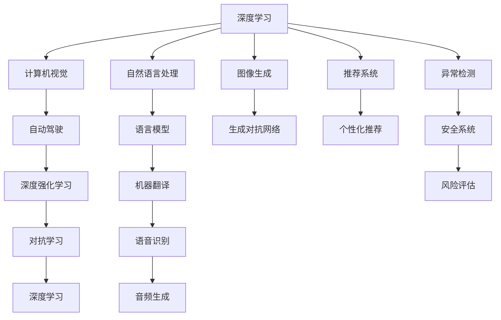

                 

# Andrej Karpathy：人工智能的未来发展挑战

> 关键词：人工智能, 深度学习, 自动驾驶, 计算机视觉, 机器学习, 深度强化学习

## 1. 背景介绍

安德烈·卡尔帕奇（Andrej Karpathy），作为深度学习领域的前沿研究者，在图像识别、自动驾驶、计算机视觉、机器学习等多个领域均有杰出贡献。他的工作为人工智能技术的发展打下了坚实的基础，并在实际应用中产生了广泛影响。本文将围绕卡尔帕奇的研究和观点，探讨人工智能未来可能面临的挑战，以及应对这些挑战的策略。

## 2. 核心概念与联系

### 2.1 核心概念概述

在深入讨论人工智能未来的发展挑战之前，我们需要先了解一些核心概念：

- **深度学习（Deep Learning）**：通过多层神经网络模型对复杂数据进行学习和提取特征的技术。深度学习在图像识别、自然语言处理等领域取得了显著成果。

- **自动驾驶（Autonomous Driving）**：利用计算机视觉、深度学习、传感器融合等技术，实现车辆自主导航和决策的智能系统。

- **计算机视觉（Computer Vision）**：使计算机能够像人类一样“看”和“理解”图像和视频内容的技术。

- **深度强化学习（Deep Reinforcement Learning）**：结合深度学习和强化学习，让智能体通过与环境的交互，不断优化行为策略。

- **对抗学习（Adversarial Learning）**：训练模型抵御攻击，使其能够在对抗条件下保持稳健性。

这些概念构成了人工智能技术发展的基础，它们之间存在紧密的联系，并通过互相支持、共同进化的方式，推动着人工智能技术的不断突破。

### 2.2 核心概念原理和架构的 Mermaid 流程图



这个流程图展示了深度学习、计算机视觉、自动驾驶、深度强化学习、对抗学习等核心概念之间的关系，以及它们与其他相关技术如自然语言处理、图像生成、机器翻译、语音识别、推荐系统等的连接。

## 3. 核心算法原理 & 具体操作步骤

### 3.1 算法原理概述

深度学习技术的核心在于通过多层神经网络模型对数据进行非线性拟合和特征提取，使其能够在复杂的任务中取得优异表现。自动驾驶系统依赖于计算机视觉、深度学习和传感器数据融合技术，实现车辆的自主导航和决策。计算机视觉通过训练模型来识别和理解图像和视频内容，广泛应用于图像识别、目标检测、场景理解等领域。深度强化学习结合了深度学习和强化学习，通过与环境的交互不断优化行为策略，实现了如AlphaGo、OpenAI Gym等在复杂游戏和任务中的突破。对抗学习通过训练模型抵御攻击，提升模型的鲁棒性和安全性。

### 3.2 算法步骤详解

在具体算法实现上，深度学习通常包括以下步骤：

1. **数据准备**：收集和标注训练数据集，确保数据的多样性和代表性。
2. **模型构建**：设计合适的神经网络结构，包括卷积层、池化层、全连接层等。
3. **模型训练**：使用优化算法（如Adam、SGD等）和损失函数（如交叉熵、均方误差等），最小化预测误差，优化模型参数。
4. **模型评估**：在验证集上评估模型性能，调整超参数以避免过拟合。
5. **模型应用**：将训练好的模型部署到实际应用中，进行实时预测或决策。

自动驾驶系统的核心在于计算机视觉和深度学习，具体步骤包括：

1. **传感器数据融合**：将摄像头、雷达、激光雷达等传感器数据进行融合，获得高质量的环境信息。
2. **目标检测**：利用深度学习模型检测和识别道路、车辆、行人等关键目标。
3. **路径规划**：结合地图数据和实时环境信息，规划车辆行驶路径。
4. **决策执行**：控制车辆加速、制动、转向等，确保安全行驶。

计算机视觉任务，如图像识别、目标检测、场景理解等，通常涉及以下步骤：

1. **数据预处理**：对图像进行裁剪、归一化、增强等预处理操作。
2. **特征提取**：通过卷积神经网络（CNN）等模型提取图像特征。
3. **分类/检测**：使用分类器或检测器对图像中的对象进行分类或定位。
4. **后处理**：对检测结果进行非极大值抑制、阈值调整等后处理操作。

深度强化学习通常包括以下步骤：

1. **环境建模**：定义环境状态和动作空间，建立环境模型。
2. **策略学习**：利用深度神经网络作为策略模型，通过与环境的交互，优化策略参数。
3. **策略评估**：通过蒙特卡洛方法或重要性采样等方法，评估策略的性能。
4. **策略改进**：使用策略改进算法（如Thompson Sampling、REINFORCE等），进一步优化策略。

对抗学习通常包括以下步骤：

1. **生成对抗样本**：使用对抗生成网络生成能够欺骗模型的样本。
2. **模型训练**：使用对抗样本训练模型，增强其鲁棒性。
3. **对抗检测**：使用检测器检测模型的鲁棒性，确保其在对抗攻击下依然表现良好。

### 3.3 算法优缺点

深度学习算法具有以下优点：

- **强大的非线性拟合能力**：能够处理高维、非线性的复杂数据。
- **端到端的学习**：可以直接从原始数据到输出结果，减少了中间过程。
- **高度可扩展**：可以通过增加层数和节点数来提升模型的复杂度和能力。

然而，深度学习也存在一些缺点：

- **模型复杂度高**：需要大量的计算资源和时间来训练和优化模型。
- **数据需求大**：需要大量的标注数据来训练模型，标注成本高。
- **模型黑盒**：深度学习模型通常是“黑盒”，难以解释其内部工作机制。

自动驾驶系统的优点包括：

- **自主导航**：能够在复杂环境中自主导航，减少对人工干预的依赖。
- **减少事故**：通过算法优化和感知系统提升，降低交通事故发生率。

但自动驾驶系统也面临以下挑战：

- **环境复杂性**：城市交通、天气变化等复杂因素，对系统提出了高要求。
- **安全可靠性**：必须确保在各种情况下都能做出正确决策，保障安全。

计算机视觉的优势包括：

- **高精度识别**：能够实现高精度的对象识别和分类。
- **实时处理**：实时处理图像和视频数据，满足实时应用需求。

然而，计算机视觉也存在以下缺点：

- **光照和视角变化**：不同光照和视角条件下，识别效果可能有所下降。
- **场景多样性**：对复杂场景的适应能力有限，需要大量数据进行训练。

深度强化学习的优点包括：

- **自我优化**：能够通过与环境的交互不断优化策略，适应复杂任务。
- **环境交互**：通过与环境的交互，学习到更接近真实世界的策略。

深度强化学习的缺点包括：

- **探索与利用矛盾**：在探索新策略的同时，需要保证对已有策略的利用。
- **时间复杂度高**：需要大量时间进行策略优化，训练成本高。

对抗学习的优点包括：

- **鲁棒性增强**：通过训练抵御攻击，提高模型的鲁棒性。
- **安全性提升**：保障系统在对抗攻击下依然安全可靠。

对抗学习的缺点包括：

- **对抗样本生成**：生成对抗样本需要复杂算法和计算资源。
- **攻击方式多样**：对抗攻击方式多样，防御策略复杂。

### 3.4 算法应用领域

深度学习在计算机视觉、自然语言处理、语音识别等领域均有广泛应用，特别是在图像识别、语音识别、机器翻译等任务上取得了显著成果。自动驾驶系统通过计算机视觉、深度学习和传感器数据融合技术，实现车辆的自主导航和决策。计算机视觉技术在安防监控、医疗影像分析、工业检测等领域均有重要应用。深度强化学习在游戏、机器人、自动驾驶等领域展现了其强大的学习和优化能力。对抗学习在图像识别、自然语言处理等领域提升了模型的鲁棒性和安全性。

## 4. 数学模型和公式 & 详细讲解 & 举例说明

### 4.1 数学模型构建

深度学习模型的数学基础包括线性代数、概率论和微积分等。以卷积神经网络（CNN）为例，其数学模型可以表示为：

$$
\mathcal{L}(\theta) = \frac{1}{N}\sum_{i=1}^N \ell(f(x_i; \theta), y_i)
$$

其中，$\mathcal{L}$ 为损失函数，$\theta$ 为模型参数，$x_i$ 为输入数据，$y_i$ 为标签，$f(x_i; \theta)$ 为模型输出，$\ell$ 为损失函数，如交叉熵损失、均方误差等。

在CNN中，输入数据经过卷积层、池化层等操作，最终通过全连接层进行分类或回归。卷积层的参数可以表示为：

$$
\mathcal{F}(\theta) = \sum_{i=1}^N \sum_{j=1}^M k_{ij}\sigma\left(\sum_{k=1}^N w_{k}^{(ij)}x_k + b_{ij}\right)
$$

其中，$k_{ij}$ 为卷积核，$\sigma$ 为激活函数，$w_{k}^{(ij)}$ 和 $b_{ij}$ 分别为卷积核权重和偏置。

### 4.2 公式推导过程

以图像识别任务为例，假设输入图像为 $x_i$，标签为 $y_i$，使用CNN进行分类，输出为 $f(x_i; \theta)$。损失函数为交叉熵损失，即：

$$
\ell(f(x_i; \theta), y_i) = -\sum_{k=1}^K y_{ik} \log f_k(x_i; \theta)
$$

其中，$K$ 为类别数，$f_k(x_i; \theta)$ 为模型对第 $k$ 类的输出概率。

通过反向传播算法，计算损失函数对模型参数 $\theta$ 的梯度，并使用优化算法进行模型更新。例如，使用SGD优化算法，更新公式为：

$$
\theta \leftarrow \theta - \eta \nabla_{\theta}\mathcal{L}(\theta)
$$

其中，$\eta$ 为学习率，$\nabla_{\theta}\mathcal{L}(\theta)$ 为损失函数对参数 $\theta$ 的梯度。

### 4.3 案例分析与讲解

以AlphaGo为例，AlphaGo的深度强化学习框架中，模型通过与围棋环境的交互进行学习，目标是最大化博弈的胜率。环境状态和动作空间由状态表示函数 $s$ 和动作表示函数 $a$ 定义，策略模型 $f$ 用于选择动作，策略的性能通过蒙特卡洛树搜索（MCTS）进行评估。AlphaGo通过与环境交互，不断优化策略，最终实现了在围棋领域超越人类专家的突破。

## 5. 项目实践：代码实例和详细解释说明

### 5.1 开发环境搭建

在深度学习项目中，开发环境搭建是一个重要的环节。以TensorFlow为例，搭建步骤如下：

1. 安装TensorFlow：
```bash
pip install tensorflow
```

2. 安装必要的库：
```bash
pip install numpy matplotlib scikit-learn
```

3. 配置环境变量：
```bash
export TF_CPP_MIN_LOG_LEVEL=0
```

### 5.2 源代码详细实现

以图像识别为例，使用卷积神经网络（CNN）实现。以下是一个简单的CNN模型实现：

```python
import tensorflow as tf

class CNN(tf.keras.Model):
    def __init__(self, input_shape):
        super(CNN, self).__init__()
        self.conv1 = tf.keras.layers.Conv2D(32, 3, activation='relu', input_shape=input_shape)
        self.maxpool = tf.keras.layers.MaxPooling2D(2, 2)
        self.conv2 = tf.keras.layers.Conv2D(64, 3, activation='relu')
        self.maxpool2 = tf.keras.layers.MaxPooling2D(2, 2)
        self.flatten = tf.keras.layers.Flatten()
        self.dense1 = tf.keras.layers.Dense(128, activation='relu')
        self.dense2 = tf.keras.layers.Dense(10, activation='softmax')

    def call(self, inputs):
        x = self.conv1(inputs)
        x = self.maxpool(x)
        x = self.conv2(x)
        x = self.maxpool2(x)
        x = self.flatten(x)
        x = self.dense1(x)
        x = self.dense2(x)
        return x

model = CNN(input_shape=(28, 28, 1))
model.compile(optimizer=tf.keras.optimizers.Adam(0.001),
              loss=tf.keras.losses.SparseCategoricalCrossentropy(from_logits=True),
              metrics=['accuracy'])

# 训练模型
model.fit(train_images, train_labels, epochs=5)
```

### 5.3 代码解读与分析

在上述代码中，我们定义了一个简单的CNN模型，包括卷积层、池化层、全连接层等组件。通过`compile`方法设置优化器、损失函数和评估指标，并通过`fit`方法进行模型训练。在训练过程中，我们使用了`Adam`优化算法和`SparseCategoricalCrossentropy`损失函数，并设置了5个epochs进行训练。

### 5.4 运行结果展示

在训练完成后，我们可以使用测试集进行模型评估：

```python
test_loss, test_acc = model.evaluate(test_images, test_labels)
print(f'Test accuracy: {test_acc}')
```

通过运行结果，我们可以获得模型在测试集上的准确率，评估模型的性能。

## 6. 实际应用场景

### 6.1 自动驾驶

自动驾驶系统通过计算机视觉和深度学习技术，实现车辆的自主导航和决策。以特斯拉Autopilot为例，Autopilot系统通过摄像头、雷达、激光雷达等传感器数据，进行环境感知、目标检测和路径规划，从而实现自动驾驶。Autopilot系统依赖于大量的传感器数据和深度学习模型的优化，通过与环境的交互不断改进决策策略，提升行车安全性和舒适性。

### 6.2 医疗影像分析

在医疗影像分析领域，深度学习技术被广泛应用于疾病诊断和影像分析。通过训练深度学习模型，可以对医学影像进行自动化的分析和诊断，提高诊断的准确性和效率。例如，使用卷积神经网络（CNN）进行医学影像分类，可以帮助医生快速识别和诊断疾病，减少误诊和漏诊的发生。

### 6.3 自然语言处理

自然语言处理（NLP）领域，深度学习技术也发挥了重要作用。例如，使用BERT模型进行情感分析，可以自动识别文本中的情感倾向，应用于社交媒体情感监测、产品评价分析等场景。通过深度学习模型进行语言翻译，可以实现高效、准确的跨语言交流。

### 6.4 未来应用展望

未来，人工智能技术将在更多领域得到应用。例如：

- **智能家居**：通过深度学习技术，实现家庭设备的智能控制和自动化管理。
- **智慧城市**：通过计算机视觉、深度学习等技术，实现交通管理、环境监测、公共安全等功能。
- **智能制造**：通过深度学习技术，实现生产线的智能化和自动化，提高生产效率和质量。

## 7. 工具和资源推荐

### 7.1 学习资源推荐

1. 《深度学习》（Ian Goodfellow）：深度学习领域的经典教材，涵盖深度学习的理论和实践。
2. Coursera《深度学习专项课程》：由深度学习专家Andrew Ng教授开设的在线课程，系统介绍深度学习的基本概念和技术。
3. arXiv：全球最大的预印本服务器，涵盖深度学习、计算机视觉、自然语言处理等领域的最新研究成果。

### 7.2 开发工具推荐

1. PyTorch：由Facebook开发的深度学习框架，支持动态图和静态图，适合研究和小规模应用。
2. TensorFlow：由Google开发的深度学习框架，支持分布式计算和多种硬件平台。
3. Jupyter Notebook：轻量级开发环境，支持代码编写、运行和展示。

### 7.3 相关论文推荐

1. "ImageNet Classification with Deep Convolutional Neural Networks"（AlexNet论文）：深度学习领域的开创性论文，展示了卷积神经网络在图像分类任务上的潜力。
2. "Playing Atari with Deep Reinforcement Learning"（AlphaGo论文）：展示深度强化学习在复杂游戏中的应用，取得了历史性突破。
3. "Adversarial Examples for Deep-Neural Networks"：深度学习领域的经典论文，探讨对抗攻击对深度学习模型的影响。

## 8. 总结：未来发展趋势与挑战

### 8.1 研究成果总结

深度学习、自动驾驶、计算机视觉、深度强化学习和对抗学习等技术在人工智能领域均有重要应用。这些技术的发展，推动了人工智能技术的不断突破，提升了其在实际应用中的表现和可靠性。

### 8.2 未来发展趋势

未来，人工智能技术将在更多领域得到应用。深度学习技术将不断突破，实现更加高效、准确的学习和预测。自动驾驶系统将更加智能化和自动化，实现更高级别的无人驾驶。计算机视觉技术将更加广泛应用，提升其在医疗、安防、工业等领域的性能。深度强化学习将应用于更多复杂的任务和游戏，提升其应用范围和效果。对抗学习将增强模型的鲁棒性和安全性，提升其在实际应用中的可靠性。

### 8.3 面临的挑战

尽管人工智能技术在各个领域取得了显著成果，但仍面临以下挑战：

1. **数据需求高**：深度学习模型需要大量数据进行训练，数据获取和标注成本高。
2. **模型复杂度高**：模型参数量庞大，训练和优化复杂。
3. **鲁棒性不足**：模型在对抗攻击下可能失效，安全性有待提升。
4. **可解释性不足**：深度学习模型通常为“黑盒”，难以解释其内部工作机制。
5. **伦理道德问题**：深度学习模型可能存在偏见和歧视，影响公平性。

### 8.4 研究展望

未来，人工智能研究将更多地关注解决上述挑战，提升模型的性能和可靠性。研究方向包括：

1. **无监督和半监督学习**：开发更加高效、低成本的深度学习模型，减少对标注数据的依赖。
2. **模型压缩与优化**：通过模型压缩、量化等技术，降低模型复杂度，提高计算效率。
3. **对抗攻击防御**：开发更加鲁棒的深度学习模型，提高其对抗攻击的防御能力。
4. **模型可解释性**：开发可解释的深度学习模型，提高其透明性和可理解性。
5. **伦理道德规范**：制定深度学习模型的伦理道德规范，保障公平性和安全性。

## 9. 附录：常见问题与解答

**Q1: 深度学习模型在实际应用中，有哪些常见的挑战？**

A: 深度学习模型在实际应用中，面临以下挑战：

1. **数据需求高**：需要大量数据进行训练，数据获取和标注成本高。
2. **模型复杂度高**：模型参数量庞大，训练和优化复杂。
3. **鲁棒性不足**：模型在对抗攻击下可能失效，安全性有待提升。
4. **可解释性不足**：深度学习模型通常为“黑盒”，难以解释其内部工作机制。
5. **伦理道德问题**：深度学习模型可能存在偏见和歧视，影响公平性。

**Q2: 如何提高深度学习模型的鲁棒性？**

A: 提高深度学习模型的鲁棒性，可以从以下方面入手：

1. **数据增强**：通过数据增强技术，丰富训练集的多样性，提升模型的泛化能力。
2. **对抗训练**：使用对抗样本训练模型，增强其对对抗攻击的防御能力。
3. **模型压缩**：通过模型压缩、量化等技术，降低模型复杂度，提高计算效率。
4. **对抗检测**：开发对抗检测工具，及时发现和修复模型的脆弱点。

**Q3: 如何提高深度学习模型的可解释性？**

A: 提高深度学习模型的可解释性，可以从以下方面入手：

1. **可视化技术**：使用可视化工具，展示模型内部状态和决策过程。
2. **可解释模型**：开发可解释的深度学习模型，如LIME、SHAP等，提高其透明性和可理解性。
3. **特征重要性分析**：通过特征重要性分析，揭示模型对输入数据的依赖关系。

**Q4: 深度学习技术在医疗影像分析中的应用有哪些？**

A: 深度学习技术在医疗影像分析中的应用包括：

1. **疾病诊断**：通过深度学习模型，自动识别和诊断疾病，提高诊断的准确性和效率。
2. **影像分割**：使用分割模型，对医学影像进行自动分割，帮助医生进行精准定位。
3. **病灶检测**：使用检测模型，识别医学影像中的病灶位置，辅助医生进行精准治疗。

**Q5: 未来人工智能技术的发展方向有哪些？**

A: 未来人工智能技术的发展方向包括：

1. **深度学习**：通过模型压缩、量化等技术，降低模型复杂度，提高计算效率。
2. **自动驾驶**：实现更高级别的无人驾驶，提升行车安全性和舒适性。
3. **计算机视觉**：提升在医疗、安防、工业等领域的性能。
4. **深度强化学习**：应用于更多复杂的任务和游戏，提升其应用范围和效果。
5. **对抗学习**：增强模型的鲁棒性和安全性，提升其在实际应用中的可靠性。

通过深入了解这些核心概念和算法，开发者可以更好地掌握人工智能技术的发展趋势，应对未来的挑战，推动人工智能技术的不断进步。

---

作者：禅与计算机程序设计艺术 / Zen and the Art of Computer Programming

