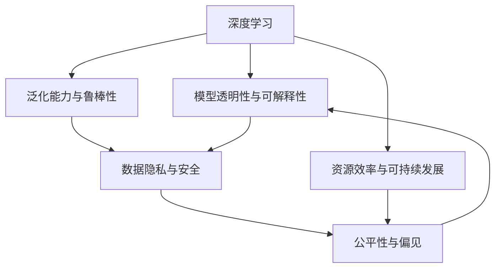

                 

## 1. 背景介绍

### 1.1 问题由来
安德烈·卡帕希（Andrej Karpathy）是深度学习领域的先驱之一，他的许多开创性工作为计算机视觉和自然语言处理提供了重要的理论基础和技术支持。在人工智能快速发展、技术日益成熟的今天，卡帕希通过其广泛的学术和工业界经验，洞察到了未来人工智能面临的一系列关键挑战。

这些问题不仅关系到人工智能的学术和商业应用，也关乎社会的长期发展。在本篇文章中，我们将深入探讨卡帕希所认为的人工智能未来发展的主要挑战，并分析其背后的深层次原因和潜在的解决途径。

### 1.2 问题核心关键点
卡帕希在讨论人工智能未来发展时，重点强调了以下几个关键点：

1. **模型透明性与可解释性**：如何让机器的决策过程更透明，更加可解释，以增强用户对人工智能系统的信任。
2. **泛化能力与鲁棒性**：如何在不同场景下保持模型的泛化能力，避免模型因环境变化而性能退化。
3. **数据隐私与安全**：如何在数据收集和处理过程中保护用户隐私，避免数据滥用和滥用带来的安全隐患。
4. **公平性与偏见**：如何减少模型中的偏见，保证不同群体间的公平性，避免对少数群体的歧视。
5. **资源效率与可持续发展**：如何在资源有限的情况下，提升模型的效率和效果，实现可持续的技术发展。

## 2. 核心概念与联系

### 2.1 核心概念概述

为更好地理解卡帕希的观点，我们将首先介绍几个核心概念：

- **深度学习（Deep Learning）**：一种基于多层神经网络的机器学习技术，能够自动提取数据的特征，进行分类、回归、生成等任务。
- **模型透明性与可解释性（Model Transparency and Interpretability）**：描述模型决策过程的可理解性和可解释性，使人们能够理解和信任模型的预测结果。
- **泛化能力与鲁棒性（Generalization and Robustness）**：模型在不同数据和环境下的适应能力和抗干扰能力。
- **数据隐私与安全（Data Privacy and Security）**：在数据收集和处理过程中保护用户隐私，避免数据滥用和滥用带来的安全隐患。
- **公平性与偏见（Fairness and Bias）**：确保模型在不同群体间的公平性，避免模型中的偏见。
- **资源效率与可持续发展（Resource Efficiency and Sustainability）**：在资源有限的情况下，提升模型的效率和效果，实现可持续的技术发展。

这些概念之间的逻辑关系可以通过以下Mermaid流程图来展示：



这个流程图展示了一系列核心概念及其之间的关系：

1. 深度学习是实现各种AI任务的基础。
2. 模型透明性与可解释性有助于增强用户对模型的信任。
3. 泛化能力和鲁棒性是模型在不同环境下表现的关键。
4. 数据隐私与安全是构建安全系统的必要条件。
5. 公平性偏见影响模型的公正性，需要重点关注。
6. 资源效率与可持续发展是模型应用普及的重要前提。

这些概念共同构成了人工智能发展的核心框架，使我们能够系统地分析和解决其中的挑战。

## 3. 核心算法原理 & 具体操作步骤
### 3.1 算法原理概述

卡帕希认为，未来人工智能面临的主要挑战之一是如何提升模型的透明性和可解释性。他强调，要让机器的决策过程更加可理解，增强用户对模型的信任。

具体来说，算法原理包括以下几个关键步骤：

1. **模型设计**：选择适合的模型结构，如卷积神经网络（CNN）、循环神经网络（RNN）、变压器（Transformer）等，以适应不同的任务需求。
2. **特征提取**：使用卷积层、池化层等提取输入数据的特征，捕捉数据的内在结构。
3. **损失函数**：设计合适的损失函数，如交叉熵损失、均方误差损失等，用于衡量模型预测与真实标签之间的差异。
4. **优化算法**：使用梯度下降、Adam、Adagrad等优化算法，更新模型参数以最小化损失函数。
5. **模型评估**：使用验证集评估模型性能，选择最优的模型进行微调。
6. **可解释性分析**：使用可视化工具，如t-SNE、LIME等，分析模型的决策过程，解释模型的输出。

### 3.2 算法步骤详解

以下是卡帕希所认为的深度学习模型训练和评估的详细步骤：

1. **数据准备**：收集、预处理和分割训练集、验证集和测试集，确保数据的多样性和代表性。
2. **模型选择**：根据任务需求选择合适的模型架构和超参数。
3. **模型初始化**：使用随机初始化或预训练模型作为初始参数。
4. **模型训练**：在前向传播计算输出，反向传播更新参数，重复此过程直至收敛。
5. **模型评估**：在验证集上评估模型性能，选择最优模型进行微调。
6. **模型微调**：在少量标注数据上进一步训练模型，提升模型对特定任务的适应能力。
7. **可解释性分析**：通过可视化工具分析模型的决策过程，解释模型的输出。

### 3.3 算法优缺点

基于深度学习的模型具有以下优点：

1. **自动特征提取**：深度学习模型能够自动从原始数据中提取高层次的特征表示。
2. **泛化能力强**：深度学习模型在大型数据集上进行训练，可以泛化到未见过的数据上。
3. **高性能**：在许多任务上，深度学习模型已经达到了或超过了人类的表现水平。

同时，深度学习模型也存在以下缺点：

1. **数据依赖性强**：深度学习模型对训练数据的质量和数量有很高的要求，数据不足可能导致过拟合。
2. **复杂度高**：深度学习模型的结构复杂，训练和推理过程需要大量的计算资源。
3. **可解释性差**：深度学习模型的内部机制难以解释，用户难以理解模型的决策过程。
4. **资源消耗大**：深度学习模型在训练和推理过程中，需要大量的计算资源和存储资源。

### 3.4 算法应用领域

基于深度学习的模型在计算机视觉、自然语言处理、语音识别等领域都有广泛的应用。例如：

- **计算机视觉**：用于图像分类、目标检测、人脸识别等任务，如ResNet、VGGNet、InceptionNet等。
- **自然语言处理**：用于文本分类、情感分析、机器翻译等任务，如BERT、GPT、Transformer等。
- **语音识别**：用于语音转换、语音生成等任务，如WaveNet、Tacotron等。

此外，深度学习模型也在自动驾驶、智能推荐、金融预测等诸多领域取得了显著成果，为人类社会带来了深刻变革。

## 4. 数学模型和公式 & 详细讲解  
### 4.1 数学模型构建

为了更好地理解深度学习模型的构建过程，我们将介绍一些核心数学模型和公式。

- **多层感知机（MLP）**：多层感知机是深度学习模型的基础结构，由多个全连接层组成，用于分类和回归任务。

  $$
  \text{MLP} = \text{Softmax}(\text{Softmax}(\text{Linear}(\text{Linear}(\text{Linear}(\mathbf{x}))))
  $$

- **卷积神经网络（CNN）**：卷积神经网络主要用于图像处理任务，通过卷积层和池化层提取图像特征。

  $$
  \text{CNN} = \text{Conv2D}(\text{ReLU}(\text{Conv2D}(\text{ReLU}(\text{Conv2D}(\mathbf{x}))))
  $$

- **循环神经网络（RNN）**：循环神经网络主要用于序列数据的处理，如文本和时间序列数据。

  $$
  \text{RNN} = \text{LSTM}(\text{LSTM}(\text{LSTM}(\mathbf{x})))
  $$

- **自注意力机制（Self-Attention）**：自注意力机制是Transformer模型的核心组成部分，用于捕捉输入序列中不同位置之间的关系。

  $$
  \text{Self-Attention}(\mathbf{Q}, \mathbf{K}, \mathbf{V}) = \text{Softmax}(\frac{\mathbf{Q}\mathbf{K}^T}{\sqrt{d_k}}) \mathbf{V}
  $$

其中，$\mathbf{Q}, \mathbf{K}, \mathbf{V}$ 分别为查询矩阵、键矩阵和值矩阵，$d_k$ 为键向量的维度。

### 4.2 公式推导过程

以下是一些核心模型的公式推导过程：

1. **多层感知机（MLP）**：

  $$
  \text{MLP} = \text{Softmax}(\text{Softmax}(\text{Linear}(\text{Linear}(\text{Linear}(\mathbf{x}))))
  $$

2. **卷积神经网络（CNN）**：

  $$
  \text{CNN} = \text{Conv2D}(\text{ReLU}(\text{Conv2D}(\text{ReLU}(\text{Conv2D}(\mathbf{x}))))
  $$

3. **循环神经网络（RNN）**：

  $$
  \text{RNN} = \text{LSTM}(\text{LSTM}(\text{LSTM}(\mathbf{x})))
  $$

4. **自注意力机制（Self-Attention）**：

  $$
  \text{Self-Attention}(\mathbf{Q}, \mathbf{K}, \mathbf{V}) = \text{Softmax}(\frac{\mathbf{Q}\mathbf{K}^T}{\sqrt{d_k}}) \mathbf{V}
  $$

通过这些公式，我们可以更好地理解深度学习模型的工作原理和结构设计。

### 4.3 案例分析与讲解

以Transformer模型为例，Transformer中的自注意力机制是其核心组成部分，用于捕捉输入序列中不同位置之间的关系。具体实现如下：

1. **输入编码**：将输入序列 $\mathbf{x} = (x_1, x_2, ..., x_n)$ 编码为向量表示 $\mathbf{X} = [\mathbf{x}_1, \mathbf{x}_2, ..., \mathbf{x}_n]$。

2. **位置编码**：对输入序列添加位置编码，以保留位置信息。

3. **查询、键、值矩阵**：将输入向量分别投影到查询矩阵 $\mathbf{Q}$、键矩阵 $\mathbf{K}$ 和值矩阵 $\mathbf{V}$。

4. **注意力得分**：计算注意力得分 $\text{Score} = \mathbf{Q}\mathbf{K}^T$。

5. **注意力权重**：通过Softmax函数将注意力得分归一化，得到注意力权重 $\text{Attention} = \text{Softmax}(\text{Score})$。

6. **加权和**：通过注意力权重对值矩阵 $\mathbf{V}$ 进行加权和，得到最终输出 $\mathbf{O} = \text{Attention} \mathbf{V}$。

通过以上步骤，Transformer模型能够高效地处理序列数据，捕捉不同位置之间的关系。

## 5. 项目实践：代码实例和详细解释说明
### 5.1 开发环境搭建

在进行深度学习项目实践前，我们需要准备好开发环境。以下是使用Python进行PyTorch开发的环境配置流程：

1. 安装Anaconda：从官网下载并安装Anaconda，用于创建独立的Python环境。

2. 创建并激活虚拟环境：
```bash
conda create -n pytorch-env python=3.8 
conda activate pytorch-env
```

3. 安装PyTorch：根据CUDA版本，从官网获取对应的安装命令。例如：
```bash
conda install pytorch torchvision torchaudio cudatoolkit=11.1 -c pytorch -c conda-forge
```

4. 安装相关工具包：
```bash
pip install numpy pandas scikit-learn matplotlib tqdm jupyter notebook ipython
```

完成上述步骤后，即可在`pytorch-env`环境中开始项目实践。

### 5.2 源代码详细实现

下面我们以图像分类任务为例，给出使用PyTorch实现CNN模型的完整代码实现。

```python
import torch
import torch.nn as nn
import torch.optim as optim
import torchvision
import torchvision.transforms as transforms

# 定义CNN模型
class CNN(nn.Module):
    def __init__(self):
        super(CNN, self).__init__()
        self.conv1 = nn.Conv2d(3, 32, kernel_size=3, stride=1, padding=1)
        self.pool = nn.MaxPool2d(kernel_size=2, stride=2)
        self.conv2 = nn.Conv2d(32, 64, kernel_size=3, stride=1, padding=1)
        self.fc1 = nn.Linear(64*10*10, 512)
        self.fc2 = nn.Linear(512, 10)

    def forward(self, x):
        x = self.pool(torch.relu(self.conv1(x)))
        x = self.pool(torch.relu(self.conv2(x)))
        x = x.view(-1, 64*10*10)
        x = torch.relu(self.fc1(x))
        x = self.fc2(x)
        return x

# 加载CIFAR-10数据集
transform = transforms.Compose([
    transforms.ToTensor(),
    transforms.Normalize((0.5, 0.5, 0.5), (0.5, 0.5, 0.5))
])

trainset = torchvision.datasets.CIFAR10(root='./data', train=True, download=True, transform=transform)
trainloader = torch.utils.data.DataLoader(trainset, batch_size=32, shuffle=True, num_workers=2)

testset = torchvision.datasets.CIFAR10(root='./data', train=False, download=True, transform=transform)
testloader = torch.utils.data.DataLoader(testset, batch_size=32, shuffle=False, num_workers=2)

# 定义模型、优化器和损失函数
model = CNN()
criterion = nn.CrossEntropyLoss()
optimizer = optim.SGD(model.parameters(), lr=0.01, momentum=0.9)

# 训练模型
for epoch in range(10):
    running_loss = 0.0
    for i, data in enumerate(trainloader, 0):
        inputs, labels = data
        optimizer.zero_grad()
        outputs = model(inputs)
        loss = criterion(outputs, labels)
        loss.backward()
        optimizer.step()
        running_loss += loss.item()
        if i % 2000 == 1999:  # 每2000个batch打印一次
            print('[%d, %5d] loss: %.3f' % (epoch + 1, i + 1, running_loss / 2000))
            running_loss = 0.0

# 测试模型
correct = 0
total = 0
with torch.no_grad():
    for data in testloader:
        images, labels = data
        outputs = model(images)
        _, predicted = torch.max(outputs.data, 1)
        total += labels.size(0)
        correct += (predicted == labels).sum().item()

print('Accuracy of the network on the 10000 test images: %d %%' % (100 * correct / total))

# 保存模型
torch.save(model.state_dict(), 'cnn.pth')
```

以上代码实现了基本的卷积神经网络模型，并完成了图像分类任务。可以看到，PyTorch提供了丰富的深度学习组件，可以高效地实现各种模型和任务。

### 5.3 代码解读与分析

让我们再详细解读一下关键代码的实现细节：

**CNN类**：
- `__init__`方法：定义模型各层的结构。
- `forward`方法：定义模型的前向传播过程，通过卷积、池化和全连接层对输入数据进行处理。

**数据加载**：
- 使用`torchvision`库加载CIFAR-10数据集，并进行数据增强和归一化。
- 使用`DataLoader`类加载训练集和测试集，设置批大小和数据加载器参数。

**模型训练**：
- 定义模型、优化器和损失函数，选择合适的优化器和学习率。
- 在每个epoch内，遍历训练集，计算损失函数，反向传播更新模型参数。
- 每2000个batch打印一次损失函数值。

**模型测试**：
- 使用测试集评估模型性能，统计准确率。

**模型保存**：
- 将模型参数保存到文件中，以便后续使用。

可以看到，使用PyTorch进行深度学习项目开发，能够快速实现模型训练和评估，高效地处理数据集。

## 6. 实际应用场景
### 6.1 计算机视觉

计算机视觉是深度学习应用的重要领域之一。基于深度学习的图像分类、目标检测、人脸识别等任务，已经在自动驾驶、安防监控、医疗影像分析等多个领域取得了显著成果。

以自动驾驶为例，通过深度学习模型对摄像头、激光雷达等传感器数据进行融合和处理，实现对周围环境的感知和决策，能够有效提升驾驶安全性和智能化水平。

### 6.2 自然语言处理

自然语言处理（NLP）是深度学习应用的另一个重要领域。基于深度学习的文本分类、情感分析、机器翻译等任务，已经在智能客服、智能推荐、智能翻译等多个领域得到了广泛应用。

以智能客服为例，通过深度学习模型对用户输入的文本进行分析和理解，自动匹配并生成最佳答复，能够有效提升客户咨询体验和问题解决效率。

### 6.3 智能推荐

智能推荐系统是深度学习应用的重要方向之一。基于深度学习模型的协同过滤、内容推荐等技术，已经在电商、社交媒体、视频流媒体等多个领域取得了显著成果。

以电商推荐为例，通过深度学习模型对用户历史行为和兴趣进行分析，实时推荐最符合用户需求的商品，能够有效提升用户体验和转化率。

### 6.4 未来应用展望

未来，深度学习模型将在更多领域得到应用，为人类社会带来深刻变革。

1. **智慧医疗**：通过深度学习模型对医疗影像、电子病历等数据进行分析，辅助医生进行诊断和治疗，提升医疗服务的智能化水平。

2. **智能教育**：通过深度学习模型对学生作业、课程内容等数据进行分析，提供个性化的学习建议和推荐，提升教育质量和效率。

3. **智慧城市**：通过深度学习模型对城市数据进行分析，实现智能交通、环境保护、能源管理等应用，提升城市管理的智能化水平。

4. **智能制造**：通过深度学习模型对生产数据进行分析，实现智能调度、质量控制等应用，提升制造业的智能化水平。

总之，未来深度学习模型将在更多领域得到应用，为人类社会带来深刻变革。

## 7. 工具和资源推荐
### 7.1 学习资源推荐

为了帮助开发者系统掌握深度学习理论基础和实践技巧，这里推荐一些优质的学习资源：

1. **Deep Learning Specialization**：由Andrew Ng教授主讲的Coursera深度学习课程，全面覆盖深度学习基础、卷积神经网络、循环神经网络、生成对抗网络等核心内容。

2. **Deep Learning with PyTorch**：由Andrej Karpathy教授主讲的PyTorch深度学习课程，深入讲解PyTorch框架的使用方法和深度学习模型开发技巧。

3. **Hands-On Machine Learning with Scikit-Learn, Keras, and TensorFlow**：由Aurélien Géron编写的机器学习实践书籍，详细介绍Python深度学习框架的使用方法和经典模型实现。

4. **Fast.ai**：由Jeremy Howard和Rachel Thomas创办的深度学习教育平台，提供丰富的深度学习教程和实战项目，适合初学者快速上手。

5. **arXiv**：全球领先的预印本服务器，提供最新的深度学习研究成果和论文，帮助研究人员跟踪最新进展。

通过对这些资源的学习实践，相信你一定能够快速掌握深度学习理论基础和实践技巧，并在实际应用中取得显著成果。

### 7.2 开发工具推荐

高效的开发离不开优秀的工具支持。以下是几款用于深度学习开发的常用工具：

1. **PyTorch**：基于Python的开源深度学习框架，灵活的动态计算图，适合快速迭代研究。

2. **TensorFlow**：由Google主导开发的开源深度学习框架，生产部署方便，适合大规模工程应用。

3. **Keras**：高层次的深度学习框架，提供了丰富的模型和组件，易于使用。

4. **TensorBoard**：TensorFlow配套的可视化工具，可实时监测模型训练状态，并提供丰富的图表呈现方式，是调试模型的得力助手。

5. **Jupyter Notebook**：支持Python、R、Scala等多种语言的交互式编程环境，适合快速开发和展示代码。

合理利用这些工具，可以显著提升深度学习项目的开发效率，加快创新迭代的步伐。

### 7.3 相关论文推荐

深度学习领域的研究进展日新月异，以下是几篇奠基性的相关论文，推荐阅读：

1. **ImageNet Classification with Deep Convolutional Neural Networks**：提出使用卷积神经网络（CNN）进行图像分类，取得了ImageNet大规模图像分类任务的SOTA。

2. **RNN for Sequence Modeling**：提出使用循环神经网络（RNN）进行序列数据建模，开创了自然语言处理领域的深度学习范式。

3. **Attention is All You Need**：提出使用Transformer模型进行自然语言处理，实现了语言模型和机器翻译任务的SOTA。

4. **Language Models are Unsupervised Multitask Learners**：提出使用自监督学习训练语言模型，显著提升了自然语言处理任务的性能。

5. **Generating Adversarial Examples with GANs**：提出使用生成对抗网络（GAN）生成对抗样本，提高了深度学习模型的鲁棒性和泛化能力。

这些论文代表了大深度学习领域的研究进展，通过学习这些前沿成果，可以帮助研究者把握学科前进方向，激发更多的创新灵感。

## 8. 总结：未来发展趋势与挑战

### 8.1 总结

本文对Andrej Karpathy所认为的人工智能未来发展的主要挑战进行了全面系统的介绍。首先阐述了深度学习模型在各种任务上的广泛应用，明确了模型透明性与可解释性、泛化能力与鲁棒性、数据隐私与安全、公平性与偏见、资源效率与可持续发展等关键问题。

通过本文的系统梳理，可以看到，深度学习模型虽然在许多任务上取得了显著成果，但在透明性、鲁棒性、隐私安全、公平性等方面仍面临诸多挑战。解决这些问题将有助于深度学习模型在实际应用中更好地发挥其潜力，为人类社会带来深刻变革。

### 8.2 未来发展趋势

展望未来，深度学习模型将呈现以下几个发展趋势：

1. **模型透明性与可解释性增强**：通过可解释性分析和可视化工具，提升模型决策过程的可理解性和可解释性，增强用户对模型的信任。

2. **泛化能力和鲁棒性提升**：通过数据增强、迁移学习、对抗训练等技术，提升模型在不同环境和数据下的泛化能力和鲁棒性，避免过拟合和灾难性遗忘。

3. **数据隐私与安全保障**：通过数据加密、差分隐私等技术，保护用户隐私，防止数据滥用和滥用带来的安全隐患。

4. **公平性与偏见减少**：通过对抗性训练、公平性约束等技术，减少模型中的偏见，确保不同群体间的公平性。

5. **资源效率与可持续发展**：通过模型压缩、量化加速、边缘计算等技术，提升模型的资源效率和可部署性，实现可持续的技术发展。

以上趋势凸显了深度学习模型在未来发展中的重要性，这些方向的探索发展，将进一步提升深度学习模型的性能和效果，为人类社会带来深刻变革。

### 8.3 面临的挑战

尽管深度学习模型在许多任务上取得了显著成果，但在透明性、鲁棒性、隐私安全、公平性等方面仍面临诸多挑战：

1. **模型透明性与可解释性不足**：当前深度学习模型的内部机制难以解释，用户难以理解模型的决策过程，限制了模型在实际应用中的推广。

2. **泛化能力与鲁棒性有限**：深度学习模型在面对不同环境和数据时，泛化能力和鲁棒性仍有待提升，可能导致过拟合和灾难性遗忘。

3. **数据隐私与安全问题**：深度学习模型在数据处理过程中，存在数据泄露和滥用的风险，需要进一步加强数据隐私和安全保障。

4. **公平性与偏见问题**：深度学习模型在面对不同群体时，可能存在偏见，影响模型的公正性和公平性。

5. **资源效率与可持续发展问题**：深度学习模型在资源消耗和可部署性方面仍有待提升，需要进一步优化模型结构和训练过程，提升资源效率。

正视深度学习模型面临的这些挑战，积极应对并寻求突破，将有助于深度学习模型在未来发展中更好地发挥其潜力，为人类社会带来深刻变革。

### 8.4 研究展望

面对深度学习模型所面临的诸多挑战，未来的研究需要在以下几个方面寻求新的突破：

1. **提升模型的透明性与可解释性**：通过可解释性分析和可视化工具，提升模型决策过程的可理解性和可解释性，增强用户对模型的信任。

2. **增强模型的泛化能力和鲁棒性**：通过数据增强、迁移学习、对抗训练等技术，提升模型在不同环境和数据下的泛化能力和鲁棒性，避免过拟合和灾难性遗忘。

3. **保障数据隐私与安全**：通过数据加密、差分隐私等技术，保护用户隐私，防止数据滥用和滥用带来的安全隐患。

4. **减少模型偏见**：通过对抗性训练、公平性约束等技术，减少模型中的偏见，确保不同群体间的公平性。

5. **提升模型资源效率**：通过模型压缩、量化加速、边缘计算等技术，提升模型的资源效率和可部署性，实现可持续的技术发展。

这些研究方向的探索，将引领深度学习模型迈向更高的台阶，为构建安全、可靠、可解释、可控的智能系统铺平道路。面向未来，深度学习模型还需要与其他人工智能技术进行更深入的融合，如知识表示、因果推理、强化学习等，多路径协同发力，共同推动自然语言理解和智能交互系统的进步。只有勇于创新、敢于突破，才能不断拓展深度学习模型的边界，让智能技术更好地造福人类社会。

## 9. 附录：常见问题与解答

**Q1：深度学习模型为什么难以解释？**

A: 深度学习模型之所以难以解释，主要是因为其结构复杂，包含大量的参数和计算层，内部机制难以理解。此外，深度学习模型通常是通过大量数据进行训练，模型参数的优化过程复杂，难以直观解释。

**Q2：如何提升深度学习模型的泛化能力？**

A: 提升深度学习模型的泛化能力，可以从以下几个方面入手：
1. 数据增强：通过扩充训练集的多样性，提升模型对不同数据集的适应能力。
2. 迁移学习：利用其他领域的数据和模型，帮助提升模型的泛化能力。
3. 对抗训练：通过对抗样本训练模型，提升模型的鲁棒性和泛化能力。
4. 正则化：使用L2正则、Dropout等技术，防止模型过拟合，提升泛化能力。

**Q3：如何保护深度学习模型的数据隐私？**

A: 保护深度学习模型的数据隐私，可以从以下几个方面入手：
1. 数据匿名化：通过去除敏感信息，保护用户隐私。
2. 差分隐私：通过添加噪声，保护用户数据隐私，防止数据泄露。
3. 数据加密：对敏感数据进行加密，保护数据隐私。
4. 模型脱敏：通过模型剪枝、量化等技术，保护模型参数的隐私。

**Q4：如何减少深度学习模型中的偏见？**

A: 减少深度学习模型中的偏见，可以从以下几个方面入手：
1. 数据集平衡：确保训练数据集的多样性和平衡性，避免数据偏置。
2. 对抗性训练：通过对抗性样本训练模型，减少模型中的偏见。
3. 公平性约束：在模型训练过程中，加入公平性约束，减少模型中的偏见。
4. 多样性数据采集：采集多样化的数据，提升模型的泛化能力和公平性。

这些技术手段，可以帮助减少深度学习模型中的偏见，确保不同群体间的公平性，提升模型的公正性和可解释性。

---

作者：禅与计算机程序设计艺术 / Zen and the Art of Computer Programming

