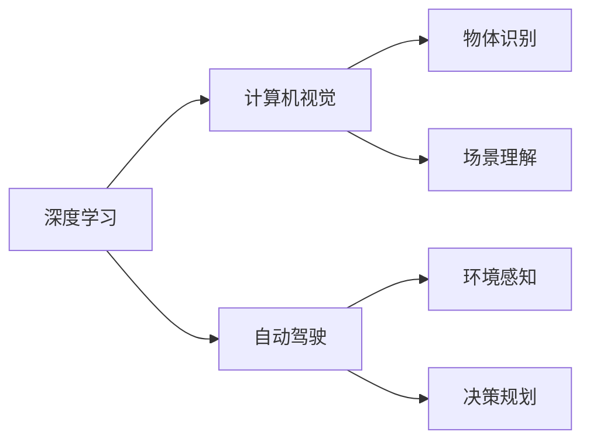

                 

# Andrej Karpathy：人工智能的未来发展方向

> 关键词：Andrej Karpathy, 人工智能, 深度学习, 计算机视觉, 强化学习, 自动驾驶, 技术预见, 未来趋势

## 1. 背景介绍

Andrej Karpathy是计算机视觉领域的一位杰出人物，作为特斯拉自动驾驶工程师团队的领导者，他一直在人工智能和深度学习的前沿进行研究。他的工作不仅限于学术界，更在工业界产生了广泛影响。在本文中，我们将深入探讨Andrej Karpathy对人工智能未来发展方向的见解。

### 1.1 问题由来

随着深度学习和人工智能技术的飞速发展，机器学习和计算机视觉领域在多个领域取得了显著突破。然而，AI技术的发展也带来了许多新的挑战和问题。为了更好地应对这些挑战，我们需要了解行业领导者的观点，并据此制定未来发展的策略。Andrej Karpathy的工作和研究成果为我们提供了一个宝贵的视角。

## 2. 核心概念与联系

### 2.1 核心概念概述

Andrej Karpathy的研究工作集中在深度学习、计算机视觉和自动驾驶等领域。他的工作不仅包括理论研究，还包括实际应用。在深入探讨未来发展方向之前，我们先了解他提出的几个核心概念。

- **深度学习**：通过构建多层神经网络，自动从数据中学习特征和模式，以实现复杂任务的解决。
- **计算机视觉**：使计算机能够理解并解释图像和视频中的视觉信息，包括物体识别、场景理解、动作识别等。
- **自动驾驶**：利用计算机视觉、传感器和深度学习技术，使汽车能够自主导航和决策。

### 2.2 核心概念原理和架构的 Mermaid 流程图



这个流程图展示了深度学习、计算机视觉和自动驾驶三者之间的关系。

## 3. 核心算法原理 & 具体操作步骤

### 3.1 算法原理概述

Andrej Karpathy的工作在多个领域都展现了深度学习的巨大潜力。以下是他对人工智能未来发展的几个核心见解：

1. **数据的重要性**：大数据是深度学习的基础。随着数据量的增加，模型的性能会持续提升。
2. **迁移学习**：将一个领域学到的知识迁移到另一个领域，使模型能够适应新任务。
3. **自监督学习**：利用未标记的数据训练模型，减少对标记数据的依赖。
4. **自动驾驶**：结合计算机视觉和深度学习，使汽车能够实现自主导航和决策。
5. **强化学习**：通过与环境的交互，使模型能够在特定任务中不断改进。

### 3.2 算法步骤详解

#### 3.2.1 数据收集与预处理

Andrej Karpathy强调，数据的质量和数量对模型性能至关重要。收集高质量的数据是模型训练的第一步。对于计算机视觉任务，数据通常包括图像、视频和标注信息。对于自动驾驶，数据则包括环境传感器数据、地图信息等。数据预处理包括数据清洗、数据增强和数据标准化。

#### 3.2.2 模型设计与训练

深度学习模型包括卷积神经网络（CNN）、循环神经网络（RNN）和Transformer等。Andrej Karpathy常使用卷积神经网络和Transformer来解决计算机视觉问题。模型训练通常使用梯度下降算法，通过反向传播计算梯度并更新模型参数。

#### 3.2.3 模型评估与调优

模型评估包括训练集和验证集上的性能评估，调优则涉及调整学习率、正则化参数和模型结构等。Andrej Karpathy使用交叉验证和验证集误差等方法评估模型性能。

#### 3.2.4 模型部署与优化

模型部署通常涉及将模型保存为二进制文件，并在实际应用中进行推理。Andrej Karpathy强调，模型优化（如剪枝、量化和混合精度训练）对于提升推理速度和降低内存占用非常重要。

### 3.3 算法优缺点

#### 3.3.1 优点

1. **高效性**：深度学习模型能够在大规模数据上高效地学习，从而实现复杂的任务。
2. **迁移学习能力**：模型可以在一个领域学习到的知识迁移到另一个领域，提高模型在特定任务上的性能。
3. **自监督学习**：可以利用未标记数据进行训练，减少标记数据需求。

#### 3.3.2 缺点

1. **过拟合风险**：深度学习模型可能出现过拟合，即在训练数据上表现良好但在测试数据上表现较差。
2. **计算资源需求高**：训练深度学习模型需要大量的计算资源和存储空间。
3. **模型解释性不足**：深度学习模型通常是“黑箱”，难以解释其决策过程。

### 3.4 算法应用领域

Andrej Karpathy的研究成果广泛应用在以下几个领域：

- **计算机视觉**：用于图像分类、目标检测、语义分割等任务。
- **自动驾驶**：用于环境感知、决策规划等任务。
- **游戏AI**：用于策略游戏、机器人控制等任务。

## 4. 数学模型和公式 & 详细讲解 & 举例说明

### 4.1 数学模型构建

Andrej Karpathy常使用卷积神经网络（CNN）来解决计算机视觉问题。以图像分类任务为例，输入为$x$，输出为$y$，模型的目标是学习从$x$到$y$的映射。

### 4.2 公式推导过程

卷积神经网络的公式推导过程涉及卷积操作、池化操作和全连接层等。以卷积层为例，其公式为：

$$
y=\sigma\left(\sum_{i,j,k} w_{i,j,k} x_{i,j,k}+b\right)
$$

其中$x_{i,j,k}$表示输入图像中的像素值，$w_{i,j,k}$表示卷积核，$b$表示偏置项，$\sigma$为激活函数。

### 4.3 案例分析与讲解

以自动驾驶为例，Andrej Karpathy的团队利用卷积神经网络进行环境感知和决策规划。环境感知任务通常涉及检测道路、车辆和行人等目标，决策规划任务则涉及路径规划和速度控制。

## 5. 项目实践：代码实例和详细解释说明

### 5.1 开发环境搭建

为了进行深度学习模型的开发，需要搭建一个高效的开发环境。以下是Andrej Karpathy推荐的步骤：

1. 安装Anaconda环境，以便管理不同版本的Python和库。
2. 使用虚拟环境（virtual environment）安装TensorFlow或PyTorch等深度学习框架。
3. 安装GPU驱动程序和CUDA库，以便在GPU上运行模型。
4. 使用Jupyter Notebook或Google Colab等交互式环境进行模型开发和调试。

### 5.2 源代码详细实现

以下是一个简单的卷积神经网络代码示例：

```python
import tensorflow as tf

# 定义模型
model = tf.keras.Sequential([
    tf.keras.layers.Conv2D(32, (3, 3), activation='relu', input_shape=(28, 28, 1)),
    tf.keras.layers.MaxPooling2D((2, 2)),
    tf.keras.layers.Flatten(),
    tf.keras.layers.Dense(10, activation='softmax')
])

# 编译模型
model.compile(optimizer='adam', loss='sparse_categorical_crossentropy', metrics=['accuracy'])

# 训练模型
model.fit(train_images, train_labels, epochs=5, validation_data=(test_images, test_labels))
```

### 5.3 代码解读与分析

在上述代码中，首先定义了一个简单的卷积神经网络模型，包含卷积层、池化层和全连接层。然后使用`compile`方法编译模型，指定优化器、损失函数和评估指标。最后使用`fit`方法训练模型，并指定训练集、验证集和训练轮数。

### 5.4 运行结果展示

训练完成后，可以使用以下代码评估模型性能：

```python
test_loss, test_acc = model.evaluate(test_images, test_labels)
print('Test accuracy:', test_acc)
```

## 6. 实际应用场景

### 6.1 自动驾驶

Andrej Karpathy在自动驾驶领域的工作成果显著。特斯拉自动驾驶团队利用深度学习技术进行环境感知、目标检测和路径规划。通过大量标注数据的训练，模型能够识别并跟踪道路上的车辆、行人和交通标志，从而实现自主驾驶。

### 6.2 游戏AI

Andrej Karpathy在游戏AI领域也有重要贡献。他领导的团队利用深度学习技术开发了能够在游戏中进行决策和控制的AI模型。这些模型能够在复杂的游戏中实现高水平的策略理解和动作执行。

### 6.3 未来应用展望

Andrej Karpathy认为，未来人工智能将在以下几个领域继续发展：

- **自动驾驶**：随着传感器和计算机视觉技术的进步，自动驾驶将更加安全可靠。
- **游戏AI**：AI游戏玩家将能够在更加复杂的环境中实现自主决策和策略执行。
- **医疗**：AI技术将用于医学影像分析、疾病预测和个性化治疗等领域。

## 7. 工具和资源推荐

### 7.1 学习资源推荐

Andrej Karpathy推荐了以下几个学习资源：

1. **深度学习课程**：斯坦福大学的CS231n《卷积神经网络》课程。
2. **计算机视觉书籍**：《Deep Learning》一书，由Ian Goodfellow、Yoshua Bengio和Aaron Courville合著。
3. **自动驾驶开源项目**：OpenAI和DeepMind的自动驾驶研究项目。

### 7.2 开发工具推荐

Andrej Karpathy推荐了以下几个开发工具：

1. **深度学习框架**：TensorFlow和PyTorch。
2. **代码编辑器**：Visual Studio Code。
3. **数据可视化工具**：TensorBoard。

### 7.3 相关论文推荐

Andrej Karpathy的研究成果广泛发表在以下几个会议和期刊上：

1. **ICCV 2017**：《Autonomous Driving in Adversarial Environments》。
2. **NIPS 2015**：《Learning Transferable Visual Models for Visual Recognition》。
3. **JMLR 2018**：《Adversarial Examples for Deep Neural Networks》。

## 8. 总结：未来发展趋势与挑战

### 8.1 研究成果总结

Andrej Karpathy在深度学习、计算机视觉和自动驾驶等领域的研究成果丰富，对人工智能的发展具有重要影响。他的工作推动了多个领域的进步，提高了AI技术的实际应用能力。

### 8.2 未来发展趋势

1. **自动驾驶**：随着传感器和计算机视觉技术的进步，自动驾驶将更加安全可靠。
2. **游戏AI**：AI游戏玩家将能够在更加复杂的环境中实现自主决策和策略执行。
3. **医疗**：AI技术将用于医学影像分析、疾病预测和个性化治疗等领域。

### 8.3 面临的挑战

1. **数据隐私**：自动驾驶和游戏AI等领域涉及大量个人数据，数据隐私问题需要得到妥善解决。
2. **计算资源**：大规模深度学习模型的训练和推理需要大量计算资源。
3. **模型可解释性**：深度学习模型通常是“黑箱”，难以解释其决策过程。

### 8.4 研究展望

未来，人工智能领域将面临更多的挑战和机遇。我们需要不断探索新的技术和方法，解决现有的问题，推动AI技术的不断进步。

## 9. 附录：常见问题与解答

**Q1: 什么是深度学习？**

A: 深度学习是一种通过多层神经网络自动从数据中学习特征和模式的方法，广泛应用于计算机视觉、自然语言处理和自动驾驶等领域。

**Q2: 如何提高模型的可解释性？**

A: 可以使用可视化工具（如TensorBoard）和模型压缩技术（如剪枝和量化）来提高模型的可解释性。

**Q3: 自动驾驶面临哪些技术挑战？**

A: 自动驾驶面临数据隐私、计算资源和模型可解释性等技术挑战，需要通过多方面的研究和创新来克服。

**Q4: 游戏AI在哪些领域有应用？**

A: 游戏AI可以应用于战略游戏、动作游戏和角色扮演游戏等领域，通过AI技术实现更加智能和灵活的游戏体验。

**Q5: 如何平衡数据隐私和模型性能？**

A: 数据隐私和模型性能之间的平衡是一个重要问题，可以通过差分隐私和联邦学习等技术来解决。

---

作者：禅与计算机程序设计艺术 / Zen and the Art of Computer Programming

