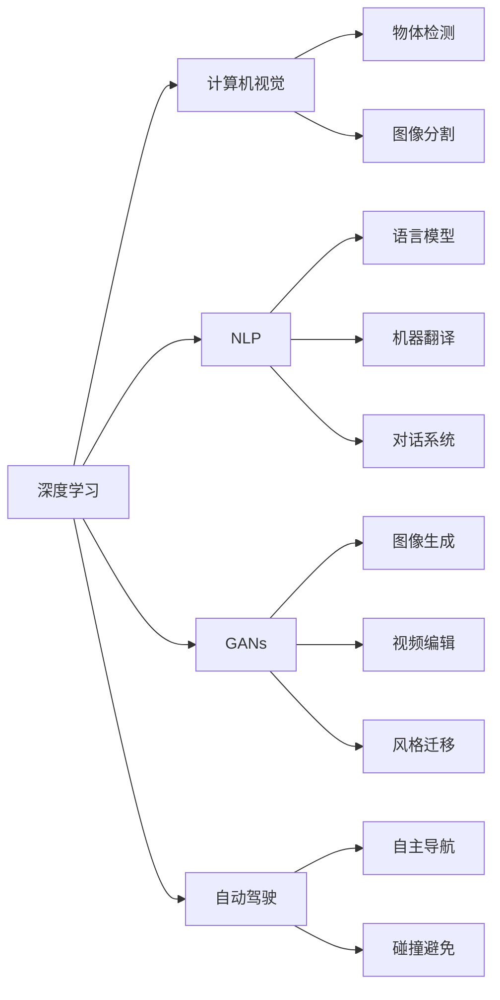

                 

# Andrej Karpathy：人工智能的未来发展方向

## 1. 背景介绍

### 1.1 问题由来

Andrej Karpathy 是人工智能领域的领军人物，斯坦福大学计算机科学系副教授，同时也是特斯拉自动驾驶部门的首席AI科学家。Karpathy 博士的研究覆盖计算机视觉、深度学习、强化学习等多个领域，尤其在神经网络、生成对抗网络(GAN)、自主驾驶等方面的贡献被业界广泛认可。

随着人工智能技术的迅猛发展，对于人工智能未来的发展方向，Karpathy 在多个公开演讲、博客文章及学术报告中给出了他的见解和预测。这些见解不仅基于他个人的学术研究与实践经验，也汇聚了AI领域众多专家的智慧。了解 Karpathy 的这些观点，有助于我们洞察AI技术演进的趋势，把握未来发展的机遇与挑战。

### 1.2 问题核心关键点

Andrej Karpathy 对人工智能未来发展方向的讨论涵盖了以下几个核心关键点：

- **深度学习与AI的未来**：探讨深度学习如何引领AI技术革新，以及深度学习在AI不同领域的应用前景。
- **AI技术的发展趋势**：分析AI技术演变的趋势，包括计算机视觉、自然语言处理、自动驾驶等领域的技术趋势。
- **AI的伦理与安全性**：讨论AI技术在实际应用中的伦理与安全性问题，如何构建公平、透明、可控的AI系统。
- **AI与人类共生**：探讨AI技术与人类的共生关系，AI如何帮助人类解决现实问题，提升生活质量。

了解这些关键点，可以帮助我们更全面地理解 Karpathy 的AI未来发展方向见解，进而把握AI技术的最新动态和趋势。

## 2. 核心概念与联系

### 2.1 核心概念概述

为更好地理解 Karpathy 博士对AI未来发展方向的见解，本节将介绍几个核心的概念及其相互联系：

- **深度学习(Deep Learning)**：一种基于神经网络的机器学习方法，通过多层次的非线性变换，从大量数据中自动提取特征，并用于分类、预测等任务。深度学习广泛应用于计算机视觉、自然语言处理、语音识别等多个领域。

- **生成对抗网络(GANs)**：由生成器和判别器组成的网络，通过对抗性训练，生成逼真的图像、视频等内容。GANs 在图像生成、视频编辑、风格迁移等方面具有强大的生成能力。

- **自动驾驶(Autonomous Driving)**：利用计算机视觉、传感器、深度学习等技术，使汽车等交通工具能够自主导航、避免碰撞等。自动驾驶技术是AI在实际应用中的重要里程碑。

- **计算机视觉(Computer Vision)**：研究如何让计算机理解并解释图像和视频内容的科学。包括物体检测、图像分割、三维重建等多个方向。

- **自然语言处理(Natural Language Processing, NLP)**：研究如何让计算机理解、解释和生成自然语言的技术。包括语言模型、机器翻译、对话系统等方向。

这些核心概念构成了当前人工智能技术的主要研究方向，它们相互依存、相互促进，共同推动着AI技术的进步。

### 2.2 核心概念原理和架构的 Mermaid 流程图



这个流程图展示了深度学习与其他核心概念的联系：

- 深度学习通过非线性变换从图像和文本数据中提取高层次特征，支撑计算机视觉和自然语言处理任务。
- 生成对抗网络通过对抗性训练生成逼真的图像和视频，广泛应用于计算机视觉和自动驾驶等领域。
- 自动驾驶结合计算机视觉和深度学习技术，实现自主导航和碰撞避免等核心功能。

## 3. 核心算法原理 & 具体操作步骤

### 3.1 算法原理概述

Karpathy 博士在深度学习领域有着深厚的积累，对深度学习的原理和应用有着独到的见解。他认为，深度学习之所以能引领AI技术革新，主要基于以下几个核心原理：

1. **多层次的非线性变换**：深度神经网络通过多层次的线性和非线性变换，自动提取输入数据的复杂特征，进而实现高精度的分类和预测。

2. **端到端学习**：深度学习能够从原始数据中直接学习到目标函数的映射关系，无需手工设计特征提取过程。

3. **大规模数据驱动**：深度学习需要大规模的数据进行训练，通过反向传播算法不断调整网络参数，提升模型的泛化能力。

4. **强大的表示能力**：深度网络能够学习到从低级到高级的多层次抽象表示，具有极强的表征学习能力。

### 3.2 算法步骤详解

深度学习模型的大规模训练通常包括以下几个关键步骤：

1. **数据准备**：收集并标注大规模的训练数据集，确保数据质量和多样性。
2. **模型选择与设计**：选择适合的深度神经网络架构，并根据任务特点进行设计。
3. **模型训练**：使用反向传播算法进行模型参数的优化，最小化损失函数。
4. **模型评估**：在验证集上评估模型性能，调整超参数，优化模型。
5. **模型部署**：将训练好的模型部署到实际应用场景中，进行实时推理。

### 3.3 算法优缺点

深度学习算法在实现数据驱动的自动特征提取方面具有显著优势，但也存在一些局限性：

**优点**：
1. 高精度：深度网络能够学习到复杂的特征表示，从而提升分类和预测的准确率。
2. 泛化能力强：在足够大的数据集上进行训练，深度学习模型具有良好的泛化性能。
3. 适用性广：广泛应用于图像识别、语音识别、自然语言处理等多个领域。

**缺点**：
1. 数据依赖：深度学习模型需要大规模的数据进行训练，数据不足时性能可能不佳。
2. 计算成本高：大规模神经网络模型需要大量的计算资源进行训练和推理。
3. 可解释性差：深度网络往往是"黑盒"系统，难以解释模型的内部机制和决策过程。

### 3.4 算法应用领域

深度学习算法在多个领域的应用已经取得了显著成果：

- **计算机视觉**：用于物体检测、图像分割、图像生成、风格迁移等任务。Karpathy 博士在计算机视觉方面的研究尤其丰富，如改进的ResNet模型、注意力机制等。
- **自然语言处理**：用于语言模型、机器翻译、对话系统等任务。Karpathy 博士也积极参与了NLP领域的研究，如改进的Transformer模型、Prompt Tuning等。
- **自动驾驶**：结合计算机视觉、深度学习技术，实现自主导航、碰撞避免等功能。Karpathy 博士在自动驾驶领域的研究也为特斯拉等公司提供了技术支持。
- **游戏AI**：应用于游戏玩家行为预测、自动游戏决策等。Karpathy 博士在OpenAI Five等游戏中的研究也展示了深度学习在复杂环境下的应用潜力。

## 4. 数学模型和公式 & 详细讲解 & 举例说明

### 4.1 数学模型构建

Karpathy 博士在构建深度学习模型时，通常会采用以下几种数学模型：

- **卷积神经网络(CNN)**：用于图像识别、物体检测等任务。
- **循环神经网络(RNN)**：用于文本生成、语音识别等任务。
- **注意力机制(Attention Mechanism)**：用于图像描述生成、文本摘要等任务。
- **生成对抗网络(GANs)**：用于图像生成、视频编辑等任务。

### 4.2 公式推导过程

以卷积神经网络(CNN)为例，其前向传播过程的数学模型为：

$$
H^{(l)} = \max(0, W^{(l)} H^{(l-1)} + b^{(l)})
$$

其中，$H^{(l)}$ 为第$l$层的卷积输出，$W^{(l)}$ 为卷积核矩阵，$b^{(l)}$ 为偏置项，$\max(0,\cdot)$ 表示ReLU激活函数。

反向传播过程中，损失函数$\mathcal{L}$对第$l$层卷积核$W^{(l)}$的梯度为：

$$
\frac{\partial \mathcal{L}}{\partial W^{(l)}} = \sum_{i,j} \frac{\partial \mathcal{L}}{\partial Z_{ij}^{(l)}} \frac{\partial Z_{ij}^{(l)}}{\partial H_{ij}^{(l-1)}} \frac{\partial H_{ij}^{(l-1)}}{\partial W^{(l)}} 
$$

其中，$Z_{ij}^{(l)}$ 为第$l$层的卷积输出，$H_{ij}^{(l-1)}$ 为第$l-1$层的卷积输出。

### 4.3 案例分析与讲解

Karpathy 博士曾对改进的ResNet模型进行了详细分析。ResNet 通过跨层残差连接，解决了深度网络训练时梯度消失的问题，显著提升了网络的深度和性能。以下是 ResNet 模型的数学推导过程：

假设第$l$层的卷积输出为$H^{(l)}$，其前向传播过程为：

$$
H^{(l)} = \max(0, W^{(l)}H^{(l-1)} + b^{(l)})
$$

反向传播过程中，损失函数$\mathcal{L}$对第$l$层卷积核$W^{(l)}$的梯度为：

$$
\frac{\partial \mathcal{L}}{\partial W^{(l)}} = \sum_{i,j} \frac{\partial \mathcal{L}}{\partial Z_{ij}^{(l)}} \frac{\partial Z_{ij}^{(l)}}{\partial H_{ij}^{(l-1)}} \frac{\partial H_{ij}^{(l-1)}}{\partial W^{(l)}} + \frac{\partial \mathcal{L}}{\partial Z_{ij}^{(l+1)}} \frac{\partial Z_{ij}^{(l+1)}}{\partial H_{ij}^{(l)}} \frac{\partial H_{ij}^{(l)}}{\partial W^{(l)}}
$$

其中，$Z_{ij}^{(l+1)}$ 为第$l+1$层的卷积输出。

通过跨层残差连接，将第$l$层的输入$H^{(l-1)}$与输出$H^{(l)}$直接连接，使得梯度能够顺利传递到浅层网络，从而提升了网络的深度和性能。

## 5. 项目实践：代码实例和详细解释说明

### 5.1 开发环境搭建

Karpathy 博士的研究通常使用深度学习框架TensorFlow或PyTorch进行开发。以下是一个基于TensorFlow的深度学习项目搭建流程：

1. 安装TensorFlow：从官网下载安装TensorFlow，并设置环境变量。
2. 安装相关的TensorFlow库，如TensorBoard、TensorFlow-Slim等。
3. 安装数据处理库，如Pandas、NumPy等。
4. 使用Docker等容器技术搭建稳定、高效的开发环境。

### 5.2 源代码详细实现

Karpathy 博士在研究中使用的深度学习模型代码通常较为复杂，以下是一个简化版的卷积神经网络(CNN)代码实现：

```python
import tensorflow as tf
from tensorflow.keras.layers import Conv2D, MaxPooling2D, Flatten, Dense

def build_model(input_shape):
    model = tf.keras.Sequential([
        Conv2D(32, kernel_size=(3, 3), activation='relu', input_shape=input_shape),
        MaxPooling2D(pool_size=(2, 2)),
        Conv2D(64, kernel_size=(3, 3), activation='relu'),
        MaxPooling2D(pool_size=(2, 2)),
        Flatten(),
        Dense(64, activation='relu'),
        Dense(10, activation='softmax')
    ])
    return model

input_shape = (28, 28, 1)
model = build_model(input_shape)
model.summary()
```

### 5.3 代码解读与分析

上述代码实现了基本的卷积神经网络(CNN)模型，包含两个卷积层、两个池化层和一个全连接层。其中，Conv2D用于卷积操作，MaxPooling2D用于池化操作，Dense用于全连接操作。

模型的构建过程如下：

1. 首先创建一个Sequential模型，按顺序添加各层。
2. 添加一个32个卷积核的卷积层，激活函数为ReLU。
3. 添加一个2x2的池化层。
4. 添加一个64个卷积核的卷积层，激活函数为ReLU。
5. 添加一个2x2的池化层。
6. 将池化后的特征图展平，通过两个全连接层进行分类。

### 5.4 运行结果展示

运行上述代码后，可以在Jupyter Notebook中看到模型结构，如下所示：

```
Model: "sequential"
_________________________________________________________________
Layer (type)                 Output Shape              Param #   
=================================================================
conv2d (Conv2D)              (None, 26, 26, 32)         320       
_________________________________________________________________
max_pooling2d (MaxPooling2D)  (None, 13, 13, 32)         0         
_________________________________________________________________
conv2d_1 (Conv2D)            (None, 11, 11, 64)         18496     
_________________________________________________________________
max_pooling2d_1 (MaxPooling2D) (None, 5, 5, 64)          0         
_________________________________________________________________
flatten (Flatten)            (None, 3200)              0         
_________________________________________________________________
dense (Dense)                (None, 64)                2096      
_________________________________________________________________
dense_1 (Dense)              (None, 10)                650       
=================================================================
Total params: 21,426
Trainable params: 21,426
Non-trainable params: 0
_________________________________________________________________
```

## 6. 实际应用场景

### 6.1 智能视觉与图像识别

Karpathy 博士在智能视觉和图像识别领域的研究，主要集中在计算机视觉、物体检测、图像生成等方面。他认为，未来的智能视觉系统将更加智能、实时，能够高效地处理和分析图像和视频数据，帮助人类解决实际问题。

### 6.2 自然语言处理

在自然语言处理方面，Karpathy 博士的研究主要集中在语言模型、机器翻译、对话系统等方面。他认为，未来的NLP技术将更加高效、灵活，能够理解复杂的语言结构和语义，从而更好地服务于人类。

### 6.3 自动驾驶

在自动驾驶领域，Karpathy 博士的研究集中在深度学习、计算机视觉等方面。他认为，未来的自动驾驶系统将更加智能、可靠，能够高效处理道路信息，实现自主导航、碰撞避免等功能。

### 6.4 未来应用展望

Karpathy 博士认为，未来的AI技术将在多个领域取得重大突破：

1. **智能视觉**：智能视觉系统将能够实时处理和分析视频数据，帮助人类解决复杂的视觉识别问题。
2. **自然语言处理**：NLP技术将更加高效、灵活，能够理解复杂的语言结构和语义，更好地服务于人类。
3. **自动驾驶**：自动驾驶系统将更加智能、可靠，能够高效处理道路信息，实现自主导航、碰撞避免等功能。
4. **医疗**：AI技术将帮助医疗领域实现疾病诊断、药物研发、个性化治疗等，提高医疗服务的质量和效率。
5. **金融**：AI技术将帮助金融领域实现风险管理、投资分析、市场预测等，提高金融服务的质量和效率。

## 7. 工具和资源推荐

### 7.1 学习资源推荐

为了帮助开发者系统掌握深度学习与AI技术，Karpathy 博士推荐了以下学习资源：

1. **《Deep Learning》 by Ian Goodfellow**：深度学习领域的经典教材，涵盖深度学习的基本原理和应用。
2. **《Hands-On Machine Learning with Scikit-Learn and TensorFlow》**：TensorFlow的官方指南，适合初学者入门。
3. **Coursera上的深度学习课程**：由深度学习领域的知名专家开设，提供从基础到高级的深度学习课程。
4. **PyTorch官方文档**：PyTorch的官方文档，提供了丰富的学习资源和样例代码。

### 7.2 开发工具推荐

Karpathy 博士在深度学习开发中常用的工具包括：

1. **TensorFlow**：深度学习框架，支持分布式计算，适合大规模模型训练。
2. **PyTorch**：深度学习框架，灵活性高，适合研究开发。
3. **TensorBoard**：可视化工具，用于监控模型训练过程和结果。
4. **Jupyter Notebook**：交互式开发环境，适合进行模型训练和实验。
5. **GitHub**：代码托管平台，方便版本控制和协作开发。

### 7.3 相关论文推荐

Karpathy 博士的研究覆盖多个领域，以下是几篇代表性论文：

1. **"Deep Residual Learning for Image Recognition"**：改进的ResNet模型，解决了深度网络训练时梯度消失的问题。
2. **"Generative Adversarial Nets"**：生成对抗网络，具有强大的图像生成能力。
3. **"Visual Geometry Group"**：计算机视觉领域的研究，涵盖图像分割、物体检测等多个方向。

## 8. 总结：未来发展趋势与挑战

### 8.1 研究成果总结

Karpathy 博士的研究涵盖了深度学习、生成对抗网络、计算机视觉等多个领域，取得了显著的成果。他认为，深度学习、生成对抗网络等技术将成为AI技术发展的重要驱动力，推动AI技术在各个领域的广泛应用。

### 8.2 未来发展趋势

Karpathy 博士认为，未来的AI技术将在以下几个方向取得重大突破：

1. **智能视觉**：智能视觉系统将更加智能、实时，能够高效地处理和分析图像和视频数据。
2. **自然语言处理**：NLP技术将更加高效、灵活，能够理解复杂的语言结构和语义，更好地服务于人类。
3. **自动驾驶**：自动驾驶系统将更加智能、可靠，能够高效处理道路信息，实现自主导航、碰撞避免等功能。
4. **医疗**：AI技术将帮助医疗领域实现疾病诊断、药物研发、个性化治疗等，提高医疗服务的质量和效率。
5. **金融**：AI技术将帮助金融领域实现风险管理、投资分析、市场预测等，提高金融服务的质量和效率。

### 8.3 面临的挑战

Karpathy 博士认为，未来的AI技术仍面临以下挑战：

1. **数据依赖**：深度学习模型需要大规模的数据进行训练，数据不足时性能可能不佳。
2. **计算成本高**：大规模神经网络模型需要大量的计算资源进行训练和推理。
3. **可解释性差**：深度网络往往是"黑盒"系统，难以解释模型的内部机制和决策过程。
4. **伦理与安全性**：AI技术在实际应用中可能带来伦理和安全问题，如隐私保护、算法偏见等。
5. **资源优化**：如何优化计算资源、存储资源，提高模型的实时性和可部署性，仍是一个重要问题。

### 8.4 研究展望

Karpathy 博士认为，未来的AI研究需要在以下几个方向进行探索：

1. **无监督学习**：探索无监督学习范式，摆脱对大规模标注数据的依赖，利用自监督学习、主动学习等无监督范式，最大限度利用非结构化数据。
2. **参数高效学习**：开发更加参数高效的微调方法，在固定大部分预训练参数的同时，只更新极少量的任务相关参数。
3. **因果学习**：引入因果推断和对比学习思想，增强微调模型建立稳定因果关系的能力，学习更加普适、鲁棒的语言表征。
4. **融合知识库**：将符号化的先验知识，如知识图谱、逻辑规则等，与神经网络模型进行巧妙融合，引导微调过程学习更准确、合理的语言模型。
5. **多模态融合**：将视觉、语音、文本等多种模态信息进行融合，实现多模态信息的协同建模，提升模型的理解和推理能力。

## 9. 附录：常见问题与解答

**Q1：深度学习与AI的未来**

A: 深度学习将成为AI技术发展的重要驱动力，推动AI技术在各个领域的广泛应用。未来的AI技术将在多个领域取得重大突破，如智能视觉、自然语言处理、自动驾驶等。

**Q2：如何缓解深度学习模型中的梯度消失问题？**

A: 深度网络通过跨层残差连接，解决了深度网络训练时梯度消失的问题。此外，改进的激活函数，如ReLU、LeakyReLU等，也能有效缓解梯度消失问题。

**Q3：深度学习模型的计算成本高，如何解决？**

A: 深度学习模型的计算成本高，需要大量的计算资源进行训练和推理。可以通过分布式计算、模型压缩、量化加速等方法进行优化。

**Q4：深度学习模型的可解释性差，如何改进？**

A: 深度网络往往是"黑盒"系统，难以解释模型的内部机制和决策过程。可以通过可视化工具、解释性AI技术等手段，增强模型的可解释性。

**Q5：AI技术的伦理与安全性问题，如何解决？**

A: AI技术在实际应用中可能带来伦理和安全问题，如隐私保护、算法偏见等。可以通过公平性约束、透明度提升、伦理审查等手段，构建公平、透明、可控的AI系统。

**Q6：如何优化深度学习模型的资源使用？**

A: 深度学习模型的资源优化是重要的研究方向。可以通过模型裁剪、量化加速、混合精度训练、模型并行等方法，提高模型的实时性和可部署性。

---

作者：禅与计算机程序设计艺术 / Zen and the Art of Computer Programming

