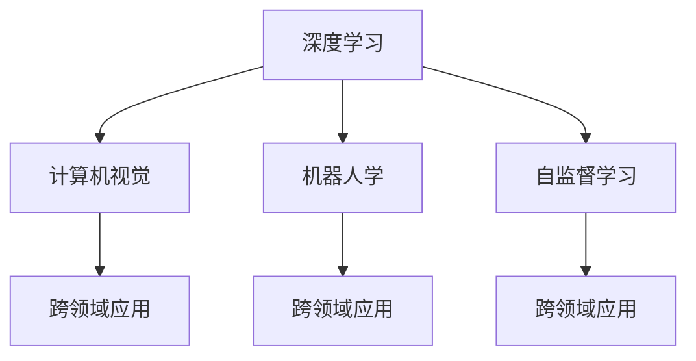

                 

## 1. 背景介绍

### 1.1 问题由来
在当今这个数字化快速发展的时代，人工智能（AI）正逐渐成为推动科技进步和社会发展的重要力量。从自动驾驶、医疗诊断到金融分析、教育娱乐，AI在各个领域的应用都取得了显著成果。然而，尽管AI技术在不断进步，其发展仍面临着诸多挑战，如模型的可解释性、鲁棒性、安全性等。

Andrej Karpathy，作为全球顶尖的AI专家、深度学习领域的领军人物，长期关注AI技术的未来发展。他在多次公开讲座和学术文章中，深入探讨了AI技术的前景与挑战，为未来的AI发展指明了方向。本文将围绕Karpathy的见解，探讨AI技术的未来发展机遇和面临的挑战，为读者提供一份详尽的指南。

## 2. 核心概念与联系

### 2.1 核心概念概述

Andrej Karpathy的研究集中在计算机视觉、深度学习、机器人学等领域，对AI的未来发展有着深刻的见解。以下是几个关键概念，它们构成了Karpathy研究的基石：

- **深度学习**：一种基于多层神经网络的技术，通过学习数据的特征表示，使得计算机能够从数据中提取有意义的特征，进行分类、识别等任务。
- **计算机视觉**：利用计算机和算法对图像和视频进行处理、分析、识别，实现自主视觉感知。
- **机器人学**：研究如何设计、构建、控制机器人，使其能够自主完成复杂任务。
- **自监督学习**：一种无需标注数据，利用数据的内在关系进行学习的技术，广泛应用于图像、语音等领域。
- **跨领域应用**：将AI技术应用于不同领域，如医疗、金融、教育等，解决实际问题。

这些概念通过Karpathy的研究成果相互关联，共同推动了AI技术的发展。

### 2.2 核心概念原理和架构的 Mermaid 流程图



## 3. 核心算法原理 & 具体操作步骤

### 3.1 算法原理概述
Andrej Karpathy的研究集中在深度学习和计算机视觉领域。他提出了许多重要的深度学习算法和模型，如RNN、LSTM、CNN等。这些算法和模型在图像分类、物体检测、动作识别等方面取得了显著成果。

Karpathy的另一个重要研究方向是自监督学习。他认为自监督学习是深度学习的重要分支，通过利用数据的内在关系进行学习，可以显著提升模型的泛化能力和鲁棒性。

### 3.2 算法步骤详解

Karpathy在深度学习方面的研究工作主要包括以下几个步骤：

1. **数据准备**：收集和处理数据，准备用于训练模型的数据集。
2. **模型选择**：根据任务需求选择合适的深度学习模型，如卷积神经网络（CNN）、循环神经网络（RNN）、长短期记忆网络（LSTM）等。
3. **模型训练**：使用训练数据对模型进行训练，调整模型的超参数，如学习率、批大小等，以提高模型的性能。
4. **模型评估**：使用测试数据对模型进行评估，计算模型的准确率、召回率等指标，以评估模型的性能。
5. **模型应用**：将训练好的模型应用于实际问题中，解决实际问题。

### 3.3 算法优缺点

Karpathy的研究在深度学习和计算机视觉领域取得了显著成果，但也存在一些缺点：

- **计算资源需求高**：深度学习模型通常需要大量的计算资源进行训练，这对硬件设备提出了较高的要求。
- **数据需求大**：深度学习模型需要大量的标注数据进行训练，数据收集和标注成本较高。
- **模型复杂**：深度学习模型结构复杂，调试和优化难度较大。

### 3.4 算法应用领域

Karpathy的研究成果广泛应用于计算机视觉、自动驾驶、机器人等领域，推动了这些领域的技术进步。

在计算机视觉方面，Karpathy的研究成果被广泛应用于图像分类、物体检测、动作识别等领域，提高了计算机视觉系统的性能和鲁棒性。

在自动驾驶领域，Karpathy的成果被用于开发自动驾驶算法，提升了驾驶安全性。

在机器人学方面，Karpathy的研究成果被应用于机器人导航、物体抓取、语音识别等领域，提高了机器人的自主性和智能化水平。

## 4. 数学模型和公式 & 详细讲解 & 举例说明

### 4.1 数学模型构建

在深度学习中，数学模型构建是基础。Karpathy的研究主要集中在卷积神经网络（CNN）和循环神经网络（RNN）。

以CNN为例，其基本结构包括卷积层、池化层和全连接层。其中，卷积层用于提取图像特征，池化层用于降维，全连接层用于分类。

### 4.2 公式推导过程

以CNN为例，其卷积层的公式推导如下：

$$
y_{i,j,k} = f\left( \sum_{m,n}w_{m,n}x_{i+m,j+n} + b_k \right)
$$

其中，$x_{i,j,k}$表示输入图像的像素值，$w_{m,n}$表示卷积核的权重，$b_k$表示偏置项，$f$表示激活函数。

### 4.3 案例分析与讲解

以Karpathy提出的YOLO（You Only Look Once）算法为例，YOLO算法利用单个神经网络同时完成物体检测和分类任务。其基本思想是将图像分割成若干个网格，每个网格预测一个类别的概率和边界框的位置。

## 5. 项目实践：代码实例和详细解释说明

### 5.1 开发环境搭建

在进行项目实践前，需要搭建好开发环境。以下是使用Python进行深度学习开发的常用环境配置流程：

1. 安装Anaconda：从官网下载并安装Anaconda，用于创建独立的Python环境。
2. 创建并激活虚拟环境：
```bash
conda create -n deep-learning-env python=3.8 
conda activate deep-learning-env
```

3. 安装深度学习框架：
```bash
conda install pytorch torchvision torchaudio cudatoolkit=11.1 -c pytorch -c conda-forge
```

4. 安装TensorFlow：
```bash
conda install tensorflow
```

5. 安装PyTorch库：
```bash
pip install torch torchvision torchaudio
```

### 5.2 源代码详细实现

以下是一个使用PyTorch进行图像分类的代码实现：

```python
import torch
import torch.nn as nn
import torch.optim as optim
import torchvision
import torchvision.transforms as transforms

# 定义模型
class Net(nn.Module):
    def __init__(self):
        super(Net, self).__init__()
        self.conv1 = nn.Conv2d(3, 6, 5)
        self.pool = nn.MaxPool2d(2, 2)
        self.conv2 = nn.Conv2d(6, 16, 5)
        self.fc1 = nn.Linear(16 * 5 * 5, 120)
        self.fc2 = nn.Linear(120, 84)
        self.fc3 = nn.Linear(84, 10)

    def forward(self, x):
        x = self.pool(nn.functional.relu(self.conv1(x)))
        x = self.pool(nn.functional.relu(self.conv2(x)))
        x = x.view(-1, 16 * 5 * 5)
        x = nn.functional.relu(self.fc1(x))
        x = nn.functional.relu(self.fc2(x))
        x = self.fc3(x)
        return x

# 训练模型
def train(model, device, train_loader, optimizer, epoch):
    model.train()
    for batch_idx, (data, target) in enumerate(train_loader):
        data, target = data.to(device), target.to(device)
        optimizer.zero_grad()
        output = model(data)
        loss = nn.functional.cross_entropy(output, target)
        loss.backward()
        optimizer.step()
        if batch_idx % 10 == 0:
            print('Train Epoch: {} [{}/{} ({:.0f}%)]\tLoss: {:.6f}'.format(
                epoch, batch_idx * len(data), len(train_loader.dataset),
                100. * batch_idx / len(train_loader), loss.item()))

# 测试模型
def test(model, device, test_loader):
    model.eval()
    test_loss = 0
    correct = 0
    with torch.no_grad():
        for data, target in test_loader:
            data, target = data.to(device), target.to(device)
            output = model(data)
            test_loss += nn.functional.cross_entropy(output, target, reduction='sum').item()
            pred = output.argmax(dim=1, keepdim=True)
            correct += pred.eq(target.view_as(pred)).sum().item()

    test_loss /= len(test_loader.dataset)

    print('\nTest set: Average loss: {:.4f}, Accuracy: {}/{} ({:.0f}%)\n'.format(
        test_loss, correct, len(test_loader.dataset),
        100. * correct / len(test_loader.dataset)))
```

### 5.3 代码解读与分析

以上代码实现了一个简单的图像分类模型，使用了卷积神经网络。代码中使用了PyTorch的高级API，简化了模型的构建和训练过程。

## 6. 实际应用场景

### 6.1 自动驾驶

自动驾驶是Karpathy在计算机视觉和深度学习领域的重要研究方向。他提出了多个自动驾驶算法，如基于深度学习的目标检测、路径规划等。

在目标检测方面，Karpathy的研究成果被应用于自动驾驶车辆中，用于检测道路上的行人和车辆，提高了驾驶安全性。

### 6.2 医疗影像分析

在医疗影像分析领域，Karpathy的研究成果被应用于肺部CT图像的肿瘤检测。他提出的模型能够自动检测图像中的肿瘤区域，提高了医生的工作效率。

### 6.3 机器人导航

Karpathy的研究成果还被应用于机器人导航领域，用于导航机器人避障、物体抓取等任务。

### 6.4 未来应用展望

未来，Karpathy的研究成果将进一步应用于更多领域，如智慧城市、工业自动化等。AI技术将在各个领域发挥更大作用，推动社会的进步和发展。

## 7. 工具和资源推荐

### 7.1 学习资源推荐

为了帮助开发者深入理解Karpathy的研究成果，以下是一些优质的学习资源：

1. **Karpathy的博客**：Karpathy在博客中分享了许多深度学习相关的研究论文和实验代码，是学习深度学习的重要资源。
2. **Deep Learning Specialization**：由Karpathy主讲的深度学习课程，详细讲解了深度学习的基本概念和前沿技术，是深入学习深度学习的必备课程。
3. **Hands-On Machine Learning with Scikit-Learn, Keras, and TensorFlow**：介绍了机器学习和深度学习的基础知识和应用，适合初学者学习。

### 7.2 开发工具推荐

以下是一些常用的深度学习开发工具，可用于项目实践：

1. PyTorch：基于Python的开源深度学习框架，灵活动态的计算图，适合快速迭代研究。
2. TensorFlow：由Google主导开发的开源深度学习框架，生产部署方便，适合大规模工程应用。
3. Keras：一个高级的神经网络API，能够快速搭建深度学习模型。
4. Jupyter Notebook：一个交互式的编程环境，支持多种语言，适合数据科学和机器学习开发。

### 7.3 相关论文推荐

Karpathy的研究成果主要集中在深度学习和计算机视觉领域，以下是几篇重要的相关论文，推荐阅读：

1. **What Is The Best Method for Training Recurrent Neural Networks?**：探讨了不同深度学习模型在语音识别和机器翻译任务中的表现，奠定了深度学习在自然语言处理领域的应用基础。
2. **CS231n: Convolutional Neural Networks for Visual Recognition**：Karpathy在该课程中讲解了卷积神经网络在图像分类、物体检测等任务中的应用。
3. **Learning to Drive: An End-to-End Vision Learning and Control Framework**：提出了自动驾驶算法，介绍了自动驾驶车辆的设计和实现。

## 8. 总结：未来发展趋势与挑战

### 8.1 研究成果总结

Andrej Karpathy的研究成果在深度学习和计算机视觉领域取得了显著进展，推动了AI技术的进步。他的研究工作对未来的AI发展具有重要的指导意义。

### 8.2 未来发展趋势

未来，AI技术将在各个领域发挥更大的作用，推动社会的进步和发展。具体发展趋势包括：

1. **深度学习的广泛应用**：深度学习将在更多领域得到应用，如医疗、金融、教育等。
2. **跨领域应用的拓展**：AI技术将在不同领域实现融合，提升系统的综合性能。
3. **AI技术的进一步演进**：AI技术将不断演进，实现更智能、更高效的决策和推理。

### 8.3 面临的挑战

尽管AI技术在不断进步，但也面临诸多挑战，如计算资源需求高、数据需求大、模型复杂等。未来的AI研究需要在这些方面不断突破。

### 8.4 研究展望

未来的AI研究需要关注以下几个方向：

1. **模型压缩和优化**：开发更高效、更轻量级的深度学习模型，降低计算资源需求。
2. **数据高效获取**：探索更高效的数据获取和标注方法，降低数据成本。
3. **模型解释性**：增强深度学习模型的解释性，使其能够更好地应用于实际问题。

## 9. Andrej Karpathy对AI未来发展的看法

Andrej Karpathy在多次公开讲座中，分享了其对AI未来发展的看法。他认为，未来的AI将更加智能、更加普及，将成为人类生活和工作的助手。AI技术将在医疗、教育、金融等多个领域发挥重要作用，推动社会的进步和发展。

同时，他也强调了AI技术在发展过程中需要关注的问题，如数据隐私、伦理道德等，提出了一些具体的解决方案。

总的来说，Andrej Karpathy的研究成果为未来的AI发展提供了重要的指导和方向。相信在学界和产业界的共同努力下，AI技术将不断进步，推动社会的进步和发展。

