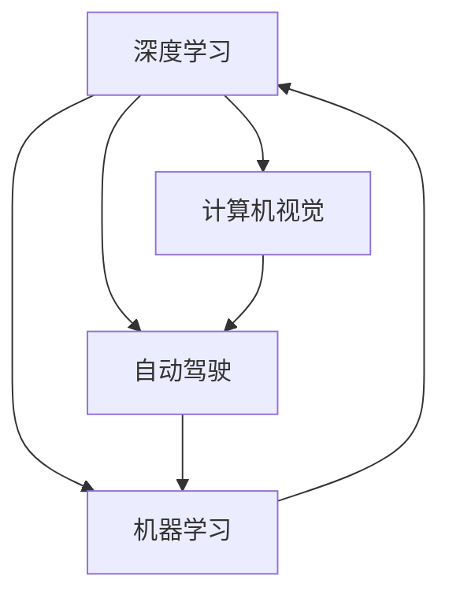

                 

# Andrej Karpathy：人工智能的未来发展策略

> 关键词：Andrej Karpathy, 人工智能, 深度学习, 机器学习, 计算机视觉, 自动驾驶, 未来策略

## 1. 背景介绍

在AI领域，Andrej Karpathy无疑是一位举足轻重的人物。作为一位深度学习领域的先驱，Karpathy在计算机视觉、自动驾驶、机器人等众多领域取得了卓越的成就。他的研究成果不仅推动了科学技术的进步，也为人工智能的未来发展指明了方向。本文将从Karpathy的工作和观点出发，深入探讨人工智能的未来发展策略。

## 2. 核心概念与联系

### 2.1 核心概念概述

要理解Karpathy对于人工智能未来的看法，首先需要了解一些核心概念和它们的联系：

- **深度学习**：一种基于神经网络的学习方法，能够自动学习特征，并在特定任务上表现出色。
- **计算机视觉**：通过计算机理解和解释视觉信息的技术，涵盖了图像分类、目标检测、图像生成等多个子领域。
- **自动驾驶**：结合计算机视觉、自然语言处理、强化学习等多种AI技术，实现车辆自主驾驶。
- **机器学习**：一种通过数据训练模型，使模型具备预测和决策能力的算法。

这些概念通过深度学习这一桥梁，实现了跨领域的融合与协作，推动了人工智能技术的不断进步。

### 2.2 核心概念原理和架构的 Mermaid 流程图

以下是深度学习、计算机视觉、自动驾驶和机器学习之间的关系及流程：



- A：深度学习，提供了强大的特征提取和表示能力。
- B：计算机视觉，依赖深度学习进行图像处理和分析。
- C：自动驾驶，综合应用了深度学习和计算机视觉技术。
- D：机器学习，是深度学习和自动驾驶的基础，提供了模型训练和优化的方法。

## 3. 核心算法原理 & 具体操作步骤

### 3.1 算法原理概述

Karpathy对于人工智能的发展有着深刻的见解。他认为，未来的AI发展应该注重以下几个方面：

- **数据驱动**：数据的质量和数量决定了AI模型的性能上限。
- **模型可解释性**：模型需要具备一定的可解释性，以便于调试和优化。
- **跨领域融合**：AI技术需要在不同领域间进行深度融合，形成协同效用。
- **公平性与道德性**：AI系统需要具备公平性和道德性，避免偏见和歧视。

### 3.2 算法步骤详解

为了实现这些目标，Karpathy提出了一系列具体的策略：

1. **数据准备**：
   - 数据采集：通过大规模数据采集和标注，构建高质量的数据集。
   - 数据清洗：去除噪声和错误数据，提高数据质量。
   - 数据增强：使用数据增强技术，扩充训练数据集。

2. **模型构建**：
   - 选择适当的深度学习模型，如卷积神经网络（CNN）、循环神经网络（RNN）等。
   - 设计合适的架构，如图像分类器、目标检测器等。
   - 使用预训练模型进行迁移学习，提高模型性能。

3. **模型训练与优化**：
   - 使用梯度下降等优化算法进行模型训练。
   - 引入正则化技术，如Dropout、L2正则化等，防止过拟合。
   - 进行超参数调优，提高模型泛化能力。

4. **模型部署与应用**：
   - 将模型集成到实际应用中，如计算机视觉中的图像识别、自动驾驶中的车辆控制等。
   - 实时监测模型性能，收集反馈数据，持续优化模型。
   - 推广模型应用，提升公众对AI技术的认知和接受度。

### 3.3 算法优缺点

**优点**：

- 数据驱动：通过大量数据训练模型，可以提升模型性能。
- 可解释性：模型具备一定的可解释性，便于调试和优化。
- 跨领域融合：AI技术可以在不同领域间进行深度融合，形成协同效用。
- 公平性与道德性：AI系统需要具备公平性和道德性，避免偏见和歧视。

**缺点**：

- 数据成本高：高质量的数据集采集和标注成本高，周期长。
- 模型复杂度高：深度学习模型结构复杂，难以调试和优化。
- 应用难度大：AI技术的部署和应用需要高水平的专业知识。
- 公平性问题：模型可能存在偏见，需要进行大量分析和优化。

### 3.4 算法应用领域

Karpathy的研究成果覆盖了多个应用领域，主要包括：

1. **计算机视觉**：图像分类、目标检测、图像生成等。
2. **自动驾驶**：车辆导航、障碍物检测、自动泊车等。
3. **机器人**：操作控制、路径规划、环境感知等。
4. **自然语言处理**：文本分类、情感分析、机器翻译等。

## 4. 数学模型和公式 & 详细讲解 & 举例说明

### 4.1 数学模型构建

Karpathy提出了一种基于深度学习的数学模型，用于描述图像分类任务：

- 输入：图像 $x$，大小为 $h \times w$。
- 输出：类别 $y$，一个 $C$ 维的向量。

模型定义为：

$$
f(x) = W_1 x + b_1
$$

其中 $W_1$ 和 $b_1$ 是模型的参数。

### 4.2 公式推导过程

- 定义损失函数：均方误差损失（MSE）。

$$
L = \frac{1}{N} \sum_{i=1}^N (y_i - f(x_i))^2
$$

- 定义梯度下降算法：

$$
\theta \leftarrow \theta - \alpha \nabla_{\theta}L
$$

其中 $\alpha$ 是学习率，$\nabla_{\theta}L$ 是损失函数对模型参数的梯度。

### 4.3 案例分析与讲解

以图像分类为例，通过大量标注数据训练模型，最小化损失函数 $L$，最终得到最优的模型参数 $\theta^*$。

## 5. 项目实践：代码实例和详细解释说明

### 5.1 开发环境搭建

1. **Python环境配置**：
   - 安装Anaconda：`conda install anaconda`
   - 创建虚拟环境：`conda create -n myenv python=3.8`
   - 激活虚拟环境：`conda activate myenv`
   - 安装依赖库：`pip install tensorflow numpy matplotlib`

2. **TensorFlow环境配置**：
   - 安装TensorFlow：`pip install tensorflow`
   - 安装Keras：`pip install keras`

### 5.2 源代码详细实现

以下是一个简单的图像分类模型实现：

```python
import tensorflow as tf
from tensorflow.keras import layers, models

# 构建模型
model = models.Sequential([
    layers.Conv2D(32, (3,3), activation='relu', input_shape=(224, 224, 3)),
    layers.MaxPooling2D((2,2)),
    layers.Conv2D(64, (3,3), activation='relu'),
    layers.MaxPooling2D((2,2)),
    layers.Conv2D(128, (3,3), activation='relu'),
    layers.MaxPooling2D((2,2)),
    layers.Flatten(),
    layers.Dense(128, activation='relu'),
    layers.Dense(10, activation='softmax')
])

# 编译模型
model.compile(optimizer='adam', loss='categorical_crossentropy', metrics=['accuracy'])

# 训练模型
model.fit(train_images, train_labels, epochs=10, validation_data=(val_images, val_labels))

# 评估模型
test_loss, test_acc = model.evaluate(test_images, test_labels)
```

### 5.3 代码解读与分析

- **构建模型**：使用卷积层和池化层提取特征，再通过全连接层进行分类。
- **编译模型**：使用Adam优化器和交叉熵损失函数。
- **训练模型**：使用训练集和验证集进行训练，并评估模型性能。

## 6. 实际应用场景

### 6.1 自动驾驶

Karpathy在自动驾驶领域的研究成果主要集中在车辆导航和障碍物检测上。他提出了一种基于卷积神经网络的车辆导航方法，能够实时识别道路标志、车道线等，实现车辆自主导航。

### 6.2 计算机视觉

Karpathy在图像分类、目标检测等领域也有重要贡献。他开发了一种新的图像分类模型，能够自动学习图像特征，提升分类准确率。

### 6.3 机器人

Karpathy还研究了机器人的操作控制和路径规划问题。通过深度学习技术，机器人能够自主进行环境感知和决策。

### 6.4 未来应用展望

Karpathy认为，未来的AI技术将更加注重跨领域融合，推动AI在更多场景中的应用。他预测，未来AI技术将更加智能化、普适化，能够解决更多实际问题。

## 7. 工具和资源推荐

### 7.1 学习资源推荐

1. **《Deep Learning》（Goodfellow等著）**：深度学习领域的经典教材，系统介绍了深度学习的基本原理和应用。
2. **《Computer Vision: Algorithms and Applications》（Sz Slazak著）**：计算机视觉领域的经典教材，涵盖了图像处理、目标检测等多个方面。
3. **Kaggle**：一个数据科学竞赛平台，提供大量公开数据集和竞赛，适合学习和实践。

### 7.2 开发工具推荐

1. **TensorFlow**：谷歌开发的深度学习框架，易于使用，支持GPU加速。
2. **PyTorch**：Facebook开发的深度学习框架，灵活性高，适合研究和实验。
3. **Keras**：一个高级深度学习库，基于TensorFlow和Theano，易于上手。

### 7.3 相关论文推荐

1. **《Learning to Drive》（Karpathy等）**：描述了一种基于深度学习的自动驾驶技术，展示了车辆导航和障碍物检测的成果。
2. **《Deep Reinforcement Learning》（Sutton等）**：强化学习领域的经典教材，介绍了深度强化学习的基本原理和应用。
3. **《Vision and Learning》（Goodfellow等）**：计算机视觉领域的经典教材，涵盖了图像处理、目标检测等多个方面。

## 8. 总结：未来发展趋势与挑战

### 8.1 研究成果总结

Karpathy在深度学习、计算机视觉、自动驾驶等领域的研究成果，推动了AI技术的不断进步。他的研究不仅提升了模型的性能，还为AI技术在不同领域的融合应用提供了新的思路。

### 8.2 未来发展趋势

未来AI技术将更加智能化、普适化，能够在更多场景中应用。跨领域融合将带来更多创新，推动AI技术的发展。

### 8.3 面临的挑战

尽管AI技术取得了显著进展，但仍然面临数据成本高、模型复杂度高、应用难度大、公平性问题等挑战。

### 8.4 研究展望

未来需要在数据质量、模型优化、应用普及、公平性等方面进行深入研究，推动AI技术的不断发展。

## 9. 附录：常见问题与解答

**Q1: 数据准备的重要性？**

A: 数据是AI模型的基础，高质量的数据集能够提升模型性能。数据准备包括数据采集、清洗和增强，是模型训练的重要环节。

**Q2: 模型可解释性的必要性？**

A: 模型可解释性有助于调试和优化模型，提高模型的可靠性和可信度。特别是在高风险应用领域，可解释性尤为重要。

**Q3: 跨领域融合的必要性？**

A: 跨领域融合能够提升AI技术在不同领域中的应用效果，形成协同效用。不同领域的深度融合，能够推动AI技术的快速发展。

**Q4: 公平性和道德性的重要性？**

A: 公平性和道德性是AI系统必须具备的特性，避免偏见和歧视，确保系统公正、可信。

---

作者：禅与计算机程序设计艺术 / Zen and the Art of Computer Programming

