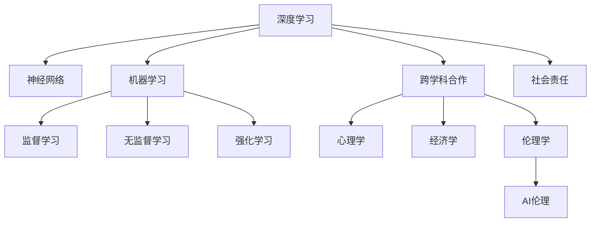

                 

# Andrej Karpathy：人工智能的未来发展策略

> 关键词：人工智能，未来发展策略，深度学习，神经网络，机器学习，AI伦理

## 1. 背景介绍

### 1.1 问题由来

Andrej Karpathy是人工智能领域的一位杰出专家，以其对深度学习、计算机视觉和神经网络的深入研究而闻名。作为Caffe框架的创始人，Karpathy还曾在Google、Facebook等顶级科技公司担任关键职务。他不仅在学术界贡献了诸多创新成果，更以对未来技术趋势的前瞻性见解，持续引领行业发展。

随着人工智能技术的迅猛发展，Karpathy对AI未来走向的思考愈发深刻。他强调，未来人工智能的发展不仅依赖于算法和技术的进步，更需要跨学科合作、伦理考量和社会责任感的提升。在本篇文章中，Karpathy将从多个维度探讨人工智能的未来发展策略，为行业同仁提供有价值的参考。

### 1.2 问题核心关键点

未来人工智能的发展，关键在于以下几个方面：

- **技术进步**：深度学习、神经网络和机器学习等技术的持续创新。
- **跨学科合作**：与心理学、经济学、伦理学等多学科的紧密协作，提升AI的智能水平和适应性。
- **伦理考量**：确保AI技术的应用符合人类价值观和伦理规范，避免潜在的负面影响。
- **社会责任**：AI技术应服务于社会，提升人类生活质量，而不是取代人类工作。

## 2. 核心概念与联系

### 2.1 核心概念概述

在探讨AI未来发展策略时，需要理解几个核心概念：

- **深度学习(Deep Learning)**：一种基于神经网络的人工智能技术，通过多层非线性变换提取数据特征，适用于大规模数据集和复杂模式识别。
- **神经网络(Neural Networks)**：模仿人类神经系统结构，通过多层神经元间的信息传递实现复杂计算，是深度学习的基础。
- **机器学习(Machine Learning)**：使计算机通过学习数据和规律，自动提升性能，包括监督学习、无监督学习和强化学习等多种方法。
- **跨学科合作**：与其他领域知识相结合，如心理学用于理解人机交互，经济学用于评估AI经济效益，伦理学用于指导AI伦理规范等。
- **AI伦理(Ethics in AI)**：确保AI技术的发展和应用符合人类价值观和社会规范，避免技术滥用。
- **社会责任**：强调AI应服务于人类福祉，提升生活质量，而非代替人类工作，引发失业和经济不平等等社会问题。

这些概念之间相互关联，共同构成了未来人工智能发展的框架。

### 2.2 核心概念原理和架构的 Mermaid 流程图



这个流程图展示了深度学习、神经网络、机器学习等技术如何通过跨学科合作和伦理考量，实现对人类社会的积极影响。

## 3. 核心算法原理 & 具体操作步骤

### 3.1 算法原理概述

未来人工智能的发展策略，建立在深度学习、神经网络和机器学习等技术的基础上。这些技术的核心原理在于通过大规模数据集的训练，构建复杂的非线性模型，从而实现对复杂模式和规律的自动提取和预测。

以深度学习为例，其基本流程包括数据预处理、模型训练、参数优化和结果评估。其中，模型训练是核心环节，通过反向传播算法不断调整模型参数，最小化损失函数，使得模型输出尽可能接近真实标签。

### 3.2 算法步骤详解

深度学习模型的训练步骤如下：

1. **数据预处理**：将原始数据进行清洗、归一化和标准化处理，转换为模型可以处理的格式。
2. **模型定义**：选择合适的神经网络架构和超参数，如卷积神经网络(CNN)、循环神经网络(RNN)或Transformer等。
3. **模型训练**：使用训练集数据对模型进行前向传播和反向传播，更新参数。
4. **模型评估**：在验证集和测试集上评估模型性能，选择最优模型。

### 3.3 算法优缺点

深度学习的优点在于其强大的模式识别能力和泛化能力，适用于图像、语音、文本等复杂数据类型。但同时也存在以下缺点：

- **数据需求高**：深度学习模型需要大量标注数据进行训练，数据获取成本较高。
- **模型复杂**：模型结构复杂，训练和推理速度较慢，资源消耗较大。
- **可解释性差**：深度学习模型通常是"黑盒"系统，难以解释其内部决策逻辑。
- **过度拟合风险**：模型在训练集上表现良好，但在测试集上可能过拟合，泛化能力不足。

### 3.4 算法应用领域

深度学习技术已广泛应用于计算机视觉、自然语言处理、语音识别等多个领域。例如：

- **计算机视觉**：用于图像分类、目标检测、人脸识别等任务。
- **自然语言处理**：用于文本分类、机器翻译、问答系统等任务。
- **语音识别**：用于语音转文本、情感识别、语音合成等任务。

## 4. 数学模型和公式 & 详细讲解 & 举例说明

### 4.1 数学模型构建

以图像分类为例，基本的深度学习模型为卷积神经网络(CNN)。其基本结构包括卷积层、池化层、全连接层和softmax层。

卷积层用于提取图像特征，池化层用于降维和参数共享，全连接层用于特征映射，softmax层用于输出类别概率。

### 4.2 公式推导过程

卷积神经网络中，卷积层和池化层的公式推导如下：

$$
f(x) = \sum_i \sum_j w_{i,j}x_{i,j}
$$

$$
P = \frac{e^{a}}{\sum_k e^{b_k}}
$$

其中，$w_{i,j}$为卷积核权重，$x_{i,j}$为输入特征，$a$为输出特征向量，$b_k$为所有特征向量的向量积。

### 4.3 案例分析与讲解

以图像分类为例，假设有10个类别的图像数据集。使用CNN进行训练，设训练集大小为$M$，测试集大小为$N$，超参数为学习率$\eta$，训练轮数为$T$。

在训练过程中，通过前向传播计算损失函数，并使用反向传播算法更新参数：

$$
L = \frac{1}{N}\sum_{i=1}^N \sum_{j=1}^C [y_j\log p_j + (1-y_j)\log(1-p_j)]
$$

$$
\theta \leftarrow \theta - \eta \nabla_{\theta}L
$$

其中，$L$为交叉熵损失函数，$p_j$为模型对第$j$个类别的预测概率。

## 5. 项目实践：代码实例和详细解释说明

### 5.1 开发环境搭建

要在Python中进行深度学习模型的开发，需要安装PyTorch、TensorFlow等深度学习框架。以下是安装步骤：

1. 安装Anaconda：
   ```bash
   conda install anaconda
   ```

2. 创建虚拟环境：
   ```bash
   conda create --name myenv python=3.8
   conda activate myenv
   ```

3. 安装深度学习框架：
   ```bash
   conda install pytorch torchvision torchaudio
   conda install tensorflow tensorflow-addons
   ```

### 5.2 源代码详细实现

以下是一个使用PyTorch进行图像分类任务的代码实现：

```python
import torch
import torch.nn as nn
import torch.optim as optim
import torchvision
import torchvision.transforms as transforms

# 定义模型
class Net(nn.Module):
    def __init__(self):
        super(Net, self).__init__()
        self.conv1 = nn.Conv2d(3, 6, 5)
        self.pool = nn.MaxPool2d(2, 2)
        self.conv2 = nn.Conv2d(6, 16, 5)
        self.fc1 = nn.Linear(16 * 5 * 5, 120)
        self.fc2 = nn.Linear(120, 84)
        self.fc3 = nn.Linear(84, 10)
        
    def forward(self, x):
        x = self.pool(torch.relu(self.conv1(x)))
        x = self.pool(torch.relu(self.conv2(x)))
        x = x.view(-1, 16 * 5 * 5)
        x = torch.relu(self.fc1(x))
        x = torch.relu(self.fc2(x))
        x = self.fc3(x)
        return x

# 定义数据加载器
train_loader = torch.utils.data.DataLoader(
    torchvision.datasets.MNIST('../data', train=True, download=True,
                               transform=transforms.ToTensor()),
    batch_size=64, shuffle=True)

test_loader = torch.utils.data.DataLoader(
    torchvision.datasets.MNIST('../data', train=False, transform=transforms.ToTensor()),
    batch_size=64, shuffle=True)

# 定义模型、优化器和损失函数
model = Net()
optimizer = optim.SGD(model.parameters(), lr=0.001, momentum=0.9)
loss_fn = nn.CrossEntropyLoss()

# 训练模型
for epoch in range(10):
    running_loss = 0.0
    for i, data in enumerate(train_loader, 0):
        inputs, labels = data
        optimizer.zero_grad()
        outputs = model(inputs)
        loss = loss_fn(outputs, labels)
        loss.backward()
        optimizer.step()
        running_loss += loss.item()
    print(f'Epoch {epoch+1}, Loss: {running_loss/len(train_loader)}')
    
# 测试模型
correct = 0
total = 0
with torch.no_grad():
    for data in test_loader:
        images, labels = data
        outputs = model(images)
        _, predicted = torch.max(outputs.data, 1)
        total += labels.size(0)
        correct += (predicted == labels).sum().item()

print(f'Accuracy: {100 * correct / total}%')
```

### 5.3 代码解读与分析

上述代码实现了一个简单的卷积神经网络模型，用于对MNIST数据集进行图像分类。

- **数据加载器**：使用`torch.utils.data.DataLoader`对数据集进行批量加载，并实现数据增强。
- **模型定义**：定义卷积层、池化层和全连接层，构建卷积神经网络模型。
- **训练过程**：通过前向传播和反向传播更新模型参数，并在每个epoch结束时输出损失。
- **测试过程**：使用测试集评估模型性能，输出准确率。

## 6. 实际应用场景

### 6.1 智能驾驶

智能驾驶是未来人工智能的重要应用场景之一。通过深度学习和计算机视觉技术，车辆可以实现自动驾驶、物体检测、道路识别等功能。

以自动驾驶为例，车辆搭载多个摄像头和传感器，实时采集环境信息。通过深度学习模型对图像进行语义分割和特征提取，识别出道路、车辆、行人等对象，并结合高精度地图数据，规划最优行驶路径，实现自动驾驶。

### 6.2 医疗诊断

医疗诊断是另一个AI的重要应用领域。深度学习技术可以用于医学影像分析、疾病预测和个性化治疗等多个环节。

以医学影像分析为例，深度学习模型可以对CT、MRI等医学图像进行自动标注和分析，快速识别出病变区域和病变类型。这不仅提高了诊断的准确性和效率，还减轻了医生的工作负担。

### 6.3 金融风控

金融风控是AI在金融领域的重要应用。通过深度学习和大数据分析，金融机构可以实现风险预测、欺诈检测和信用评估等任务。

以信用评估为例，深度学习模型可以分析用户的历史行为数据和社交网络信息，预测用户的信用风险。这不仅提高了风险评估的准确性，还为金融公司提供了精准的营销策略。

## 7. 工具和资源推荐

### 7.1 学习资源推荐

以下是一些推荐的学习资源，有助于深入理解未来人工智能的发展策略：

1. 《深度学习》：Ian Goodfellow、Yoshua Bengio和Aaron Courville合著的经典教材，全面介绍了深度学习的基本原理和应用。
2. 《Python深度学习》：Francois Chollet著，介绍了如何使用Keras框架进行深度学习开发。
3. 《AI Superpowers》：Andrej Karpathy的最新著作，深入探讨了AI技术的未来趋势和挑战。
4. 《NIPS论文》：深度学习领域的顶级会议论文，涵盖了最新的研究成果和前沿技术。
5. Coursera、edX等在线教育平台提供的深度学习课程，包括斯坦福大学的CS231n课程。

### 7.2 开发工具推荐

以下是一些推荐的使用深度学习工具，有助于高效开发和测试AI模型：

1. PyTorch：Google Brain团队开发的深度学习框架，灵活高效，支持GPU加速。
2. TensorFlow：Google开发的深度学习框架，支持分布式计算和模型优化。
3. Keras：基于TensorFlow的高层API，易于使用，支持多种深度学习模型。
4. Jupyter Notebook：交互式开发环境，支持多种编程语言和数据处理工具。
5. Scikit-learn：Python机器学习库，提供了丰富的数据处理和模型评估工具。

### 7.3 相关论文推荐

以下是一些推荐的相关论文，有助于了解深度学习和AI技术的前沿研究：

1. AlexNet：Hinton等人在2012年提出的卷积神经网络架构，开启了深度学习时代。
2. RNN：Hochreiter和Schmidhuber在1997年提出的循环神经网络，广泛应用于自然语言处理和序列数据处理。
3. CNN：LeCun等人在1998年提出的卷积神经网络，广泛应用于图像处理和计算机视觉。
4. GAN：Goodfellow等人在2014年提出的生成对抗网络，广泛应用于图像生成和图像修复。
5. Transformer：Vaswani等人在2017年提出的自注意力机制，广泛应用于自然语言处理和计算机视觉。

## 8. 总结：未来发展趋势与挑战

### 8.1 总结

本文介绍了Andrej Karpathy对未来人工智能发展策略的深入思考。未来人工智能的发展将依赖于深度学习、神经网络和机器学习等技术的持续创新。同时，跨学科合作、伦理考量和社会责任感的提升，将决定AI技术的未来走向。

### 8.2 未来发展趋势

未来人工智能的发展趋势包括：

1. **技术进步**：深度学习、神经网络和机器学习等技术的持续创新，将推动AI技术的不断进步。
2. **跨学科合作**：与其他领域知识相结合，如心理学、经济学、伦理学等，提升AI的智能水平和适应性。
3. **伦理考量**：确保AI技术的应用符合人类价值观和伦理规范，避免潜在的负面影响。
4. **社会责任**：AI技术应服务于人类福祉，提升生活质量，而非代替人类工作，引发失业和经济不平等等社会问题。

### 8.3 面临的挑战

未来人工智能的发展仍面临诸多挑战：

1. **数据需求高**：深度学习模型需要大量标注数据进行训练，数据获取成本较高。
2. **模型复杂**：模型结构复杂，训练和推理速度较慢，资源消耗较大。
3. **可解释性差**：深度学习模型通常是"黑盒"系统，难以解释其内部决策逻辑。
4. **过度拟合风险**：模型在训练集上表现良好，但在测试集上可能过拟合，泛化能力不足。
5. **伦理问题**：AI技术可能引发就业、隐私、安全等伦理问题，需加强规范和监管。
6. **社会影响**：AI技术的广泛应用可能带来就业和收入不平等，需关注社会公平问题。

### 8.4 研究展望

未来研究的方向包括：

1. **无监督学习和半监督学习**：探索无需大量标注数据的学习方法，降低数据获取成本。
2. **模型压缩和加速**：开发更高效、更轻量级的模型，提升训练和推理速度。
3. **可解释性提升**：引入因果分析、符号化知识等方法，增强AI模型的可解释性和透明度。
4. **多模态学习**：探索融合视觉、语音、文本等多模态数据的学习方法，提升AI系统的适应性。
5. **伦理和法律框架**：建立健全的伦理和法律框架，确保AI技术的应用符合人类价值观和社会规范。

## 9. 附录：常见问题与解答

**Q1：未来AI发展的最大挑战是什么？**

A: 未来AI发展的最大挑战在于数据获取和伦理考量。深度学习模型需要大量标注数据进行训练，而获取高质量数据成本较高。同时，AI技术的广泛应用可能引发就业、隐私、安全等伦理问题，需加强规范和监管。

**Q2：AI技术如何在各个行业应用？**

A: AI技术在各个行业的应用包括：

1. **智能驾驶**：用于自动驾驶、物体检测、道路识别等功能。
2. **医疗诊断**：用于医学影像分析、疾病预测和个性化治疗等。
3. **金融风控**：用于风险预测、欺诈检测和信用评估等。
4. **智能客服**：用于问答系统、智能推荐和语音交互等。

**Q3：如何提升AI模型的可解释性？**

A: 提升AI模型的可解释性，可以从以下几个方面入手：

1. 引入因果分析方法，增强模型的因果关系理解。
2. 使用符号化知识库，如知识图谱，增强模型的语义理解。
3. 开发可解释的模型架构，如LIME、SHAP等，用于解释模型的预测过程。

**Q4：AI技术在社会应用中的伦理问题有哪些？**

A: AI技术在社会应用中的伦理问题包括：

1. 就业问题：AI技术可能取代某些工作岗位，引发就业不平等。
2. 隐私问题：AI系统可能收集和分析个人信息，侵犯隐私权。
3. 安全问题：AI系统可能被恶意利用，造成安全威胁。
4. 公平问题：AI系统可能存在偏见和歧视，影响公平性。

总之，未来人工智能的发展需要从技术、伦理和社会多个维度进行全面考虑，以确保其对人类社会的积极影响。

