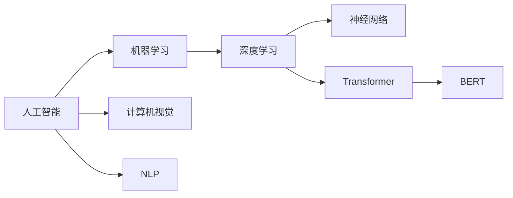
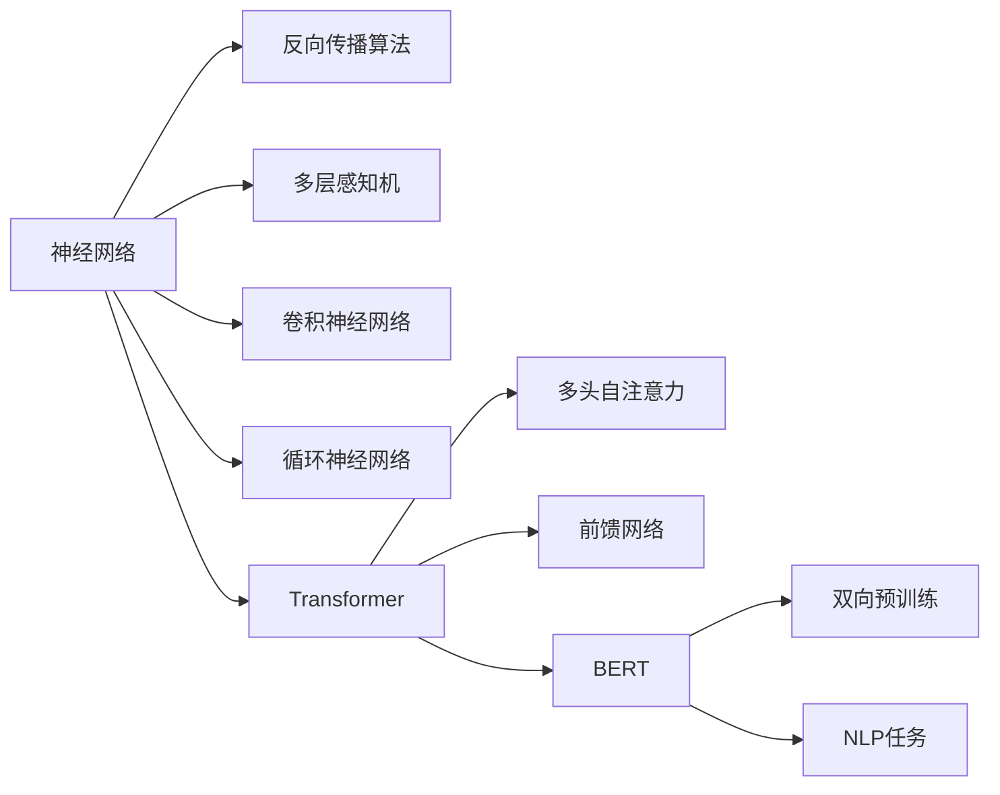

                 

# Andrej Karpathy：人工智能的未来发展策略

> 关键词：人工智能,机器学习,深度学习,神经网络,计算机视觉,自然语言处理,NLP,大模型,Transformer,BERT

## 1. 背景介绍

Andrej Karpathy，斯坦福大学教授，PyTorch的创始人之一，人工智能领域的知名专家。在深度学习和计算机视觉领域有着卓越的贡献。Karpathy对AI未来的发展趋势有独到的见解，本文将基于他的讲座和论文，梳理人工智能的未来发展策略。

## 2. 核心概念与联系

### 2.1 核心概念概述

1. **人工智能**：指通过计算机模拟人的智能行为，实现问题求解、决策、推理等能力的技术。

2. **机器学习**：一种数据驱动的技术，通过算法让计算机自动从数据中学习规律，并应用到新的数据上。

3. **深度学习**：一种基于神经网络的机器学习技术，通过多层网络对数据进行抽象和提取特征。

4. **计算机视觉**：研究如何让计算机理解并处理图像和视频数据的领域，广泛应用于图像识别、目标检测、图像生成等。

5. **自然语言处理**(NLP)：使计算机理解、处理、生成人类语言的技术，如文本分类、情感分析、机器翻译等。

6. **大模型**：指具有亿级参数的神经网络模型，如GPT、BERT等，能够处理复杂的自然语言和图像数据。

7. **Transformer**：一种基于自注意力机制的神经网络结构，广泛应用于NLP和计算机视觉任务。

8. **BERT(Bidirectional Encoder Representations from Transformers)**：一种双向的预训练语言模型，在自然语言理解上取得了显著的进步。

这些概念之间通过以下Mermaid流程图来展示：



### 2.2 核心概念原理和架构

- **神经网络**：由多层神经元组成的网络，通过反向传播算法更新权重，用于模式识别、分类等任务。
- **Transformer**：一种自注意力机制的神经网络，通过多头自注意力和前馈网络实现高效的序列处理。
- **BERT**：通过在大规模无标签文本数据上进行双向预训练，学习到丰富的语言表示，适用于各种NLP任务。

这些概念之间的工作原理和架构通过以下Mermaid流程图来展示：



## 3. 核心算法原理 & 具体操作步骤

### 3.1 算法原理概述

Andrej Karpathy对AI的未来发展策略主要集中在以下几个方面：

1. **大模型的发展**：他认为大模型的发展是AI未来发展的关键。通过在大规模无标签数据上进行预训练，学习到丰富的语言和视觉表示，再通过微调应用于特定任务，可以显著提升性能。

2. **迁移学习的应用**：在特定任务上对大模型进行微调，可以避免从头训练，节省时间和计算资源。这种迁移学习范式广泛应用于NLP、计算机视觉等任务。

3. **模型可解释性和公平性**：他强调，未来的AI模型需要具备可解释性和公平性，让用户理解和信任模型的决策过程，同时避免偏见和歧视。

### 3.2 算法步骤详解

以下是AI模型开发和训练的详细步骤：

1. **数据准备**：收集和标注大规模数据集，进行数据增强和预处理。

2. **模型选择**：选择适合的预训练模型（如BERT、GPT等）作为基础。

3. **迁移学习**：在特定任务上微调预训练模型，使用少量标注数据进行优化。

4. **模型评估**：在验证集上评估模型性能，调整超参数。

5. **模型部署**：将模型集成到应用中，进行实时推理。

### 3.3 算法优缺点

**优点**：
1. 大模型可以处理复杂的任务，提高模型性能。
2. 迁移学习可以减少从头训练的时间和成本。
3. 模型可解释性可以增强用户信任。

**缺点**：
1. 需要大量标注数据，标注成本高。
2. 过拟合风险高，需要正则化和数据增强。
3. 模型部署需要高性能硬件，资源消耗大。

### 3.4 算法应用领域

大模型和迁移学习在以下几个领域有着广泛的应用：

1. **自然语言处理**：如机器翻译、情感分析、文本分类等。
2. **计算机视觉**：如图像识别、目标检测、图像生成等。
3. **语音识别**：如语音转文本、语音情感分析等。
4. **推荐系统**：如协同过滤、内容推荐等。

## 4. 数学模型和公式 & 详细讲解 & 举例说明

### 4.1 数学模型构建

以下是深度学习模型的基本数学模型：

1. **多层感知机(Multilayer Perceptron, MLP)**：
   $$
   \text{MLP}(x) = \text{softmax}(W_2\text{ReLU}(W_1x + b_1) + b_2)
   $$

2. **卷积神经网络(Convolutional Neural Network, CNN)**：
   $$
   \text{CNN}(x) = \max_k\left(\sum_{ij} W_{ik} * x_{ij} + b_k\right)
   $$

3. **Transformer**：
   $$
   \text{Transformer}(x) = \text{softmax}\left(\sum_k\text{Attention}(Q, K, V)\right) \text{FFN}
   $$

其中，$\text{Attention}$为自注意力机制，$\text{FFN}$为前馈网络。

### 4.2 公式推导过程

以Transformer为例，其推导过程如下：

1. **输入表示**：
   $$
   \text{Input} = \text{Embedding}(x)
   $$

2. **自注意力机制**：
   $$
   \text{Attention}(Q, K, V) = \text{Softmax}\left(\frac{QK^T}{\sqrt{d_k}}\right)V
   $$

3. **多头自注意力**：
   $$
   \text{Multi-Head Attention} = \text{Concat}\left(\text{Attention}(QKV)\right)
   $$

4. **前馈网络**：
   $$
   \text{FFN}(x) = \text{Linear}(\text{ReLU}(\text{Linear}(x)))
   $$

5. **堆叠多层的Transformer**：
   $$
   \text{Transformer}(x) = \text{Feed-Forward}(\text{Multi-Head Attention}(\text{Positional Encoding}(x)))
   $$

### 4.3 案例分析与讲解

以BERT为例，其双向预训练过程如下：

1. **预训练任务**：
   - **掩码语言模型(Masked Language Model, MLM)**：预测被掩码的词汇，使得模型学习上下文语义。
   - **下一句预测(Next Sentence Prediction, NSP)**：预测两个句子是否是连续的，使得模型学习句子间关系。

2. **微调**：
   - **分类任务**：如情感分析、文本分类等，通过在特定任务的数据集上进行微调，使模型适应特定任务。

3. **优化目标**：
   - **交叉熵损失**：衡量预测输出和真实标签之间的差异。
   - **L2正则**：防止模型过拟合。

## 5. 项目实践：代码实例和详细解释说明

### 5.1 开发环境搭建

以下是使用PyTorch进行模型开发的开发环境配置：

1. **安装Anaconda**：
   ```bash
   conda create -n pytorch-env python=3.8 
   conda activate pytorch-env
   ```

2. **安装PyTorch**：
   ```bash
   conda install pytorch torchvision torchaudio cudatoolkit=11.1 -c pytorch -c conda-forge
   ```

3. **安装TensorFlow**：
   ```bash
   pip install tensorflow
   ```

4. **安装Transformers库**：
   ```bash
   pip install transformers
   ```

5. **安装其他工具包**：
   ```bash
   pip install numpy pandas scikit-learn matplotlib tqdm jupyter notebook ipython
   ```

### 5.2 源代码详细实现

以下是使用PyTorch进行BERT微调的代码实现：

```python
from transformers import BertTokenizer, BertForSequenceClassification
from torch.utils.data import Dataset, DataLoader
import torch
import numpy as np

class MyDataset(Dataset):
    def __init__(self, texts, labels):
        self.texts = texts
        self.labels = labels
        self.tokenizer = BertTokenizer.from_pretrained('bert-base-uncased')

    def __len__(self):
        return len(self.texts)

    def __getitem__(self, idx):
        text = self.texts[idx]
        label = self.labels[idx]
        encoding = self.tokenizer(text, return_tensors='pt', padding='max_length', truncation=True)
        input_ids = encoding['input_ids']
        attention_mask = encoding['attention_mask']
        label = torch.tensor(label, dtype=torch.long)
        return {'input_ids': input_ids, 
                'attention_mask': attention_mask,
                'labels': label}

# 加载数据集
train_dataset = MyDataset(train_texts, train_labels)
test_dataset = MyDataset(test_texts, test_labels)

# 设置超参数
device = torch.device('cuda' if torch.cuda.is_available() else 'cpu')
model = BertForSequenceClassification.from_pretrained('bert-base-uncased', num_labels=num_labels)
optimizer = AdamW(model.parameters(), lr=2e-5)

# 训练模型
epochs = 5
batch_size = 16

for epoch in range(epochs):
    for batch in DataLoader(train_dataset, batch_size=batch_size, shuffle=True):
        inputs = {k: v.to(device) for k, v in batch.items()}
        outputs = model(**inputs)
        loss = outputs.loss
        optimizer.zero_grad()
        loss.backward()
        optimizer.step()
    print(f'Epoch {epoch+1}, train loss: {loss:.3f}')
    
# 评估模型
for batch in DataLoader(test_dataset, batch_size=batch_size, shuffle=False):
    inputs = {k: v.to(device) for k, v in batch.items()}
    outputs = model(**inputs)
    predictions = outputs.logits.argmax(dim=1).to('cpu').tolist()
    labels = batch['labels'].to('cpu').tolist()
    for pred, label in zip(predictions, labels):
        print(f'Predicted: {id2tag[pred]}, True: {id2tag[label]}')
```

### 5.3 代码解读与分析

以下是关键代码的详细解读：

1. **数据集定义**：
   - `MyDataset`类继承自`torch.utils.data.Dataset`，定义了数据的加载和处理逻辑。
   - `__getitem__`方法将文本和标签转化为模型所需的输入格式。

2. **模型定义**：
   - `BertForSequenceClassification`定义了分类任务的模型结构，包括输入嵌入、多层自注意力和输出层。

3. **模型训练**：
   - 使用AdamW优化器更新模型参数，通过`torch.utils.data.DataLoader`对数据集进行批处理。
   - 在每个epoch内，循环迭代训练数据，计算损失并更新模型。

4. **模型评估**：
   - 在测试集上评估模型性能，输出预测结果和真实标签。

## 6. 实际应用场景

### 6.1 自动驾驶

自动驾驶是AI在计算机视觉和深度学习的重要应用。通过深度学习模型，可以从传感器数据中提取道路、车辆、交通标志等关键信息，进行路径规划和决策。

### 6.2 医疗诊断

AI在医疗领域的应用广泛，包括图像识别、自然语言处理、基因组学等。通过图像分割、文本分类等技术，可以辅助医生进行疾病诊断和个性化治疗。

### 6.3 智能推荐

推荐系统通过分析用户行为和偏好，为用户推荐感兴趣的内容。AI技术可以处理大规模用户数据，进行实时推荐，提升用户体验。

### 6.4 未来应用展望

未来，AI技术将进一步融合多模态数据，提升跨领域迁移能力。同时，通过模型可解释性和公平性研究，增强用户信任，避免偏见和歧视。

## 7. 工具和资源推荐

### 7.1 学习资源推荐

1. **深度学习**：
   - 《深度学习》by Ian Goodfellow, Yoshua Bengio, Aaron Courville。

2. **计算机视觉**：
   - 《计算机视觉：模型、学习和推理》by Simon J.D. Prince。

3. **自然语言处理**：
   - 《自然语言处理综论》by Daniel Jurafsky, James H. Martin。

4. **Transformer**：
   - 《Transformer: A Survey》by Jonathan Goodman, Anselm Levskaya, and Lucas Beyer。

5. **BERT**：
   - 《BERT: Pre-training of Deep Bidirectional Transformers for Language Understanding》by Jacob Devlin, Ming-Wei Chang, Kenton Lee, Kristina Toutanova。

### 7.2 开发工具推荐

1. **PyTorch**：
   - 官网：https://pytorch.org/

2. **TensorFlow**：
   - 官网：https://www.tensorflow.org/

3. **Transformers**：
   - 官网：https://huggingface.co/docs/transformers/main/en/stable/

4. **Weights & Biases**：
   - 官网：https://weightsandbiases.com/

5. **TensorBoard**：
   - 官网：https://www.tensorflow.org/tensorboard/

### 7.3 相关论文推荐

1. **深度学习**：
   - 《Deep Learning》by Ian Goodfellow, Yoshua Bengio, Aaron Courville。

2. **计算机视觉**：
   - 《Convolutional Neural Networks for Visual Recognition》by Alex Krizhevsky, Ilya Sutskever, and Geoffrey Hinton。

3. **自然语言处理**：
   - 《Attention Is All You Need》by Ashish Vaswani, Noam Shazeer, Niki Parmar, Jakob Uszkoreit, Llion Jones, Aidan N. Gomez, Lukasz Kaiser, and Illia Polosukhin。

4. **BERT**：
   - 《BERT: Pre-training of Deep Bidirectional Transformers for Language Understanding》by Jacob Devlin, Ming-Wei Chang, Kenton Lee, and Kristina Toutanova。

## 8. 总结：未来发展趋势与挑战

### 8.1 研究成果总结

1. 大模型和迁移学习提升了AI的性能和应用范围。
2. 模型可解释性和公平性研究得到重视。

### 8.2 未来发展趋势

1. 大模型的规模和性能将进一步提升。
2. 多模态融合将带来更强的泛化能力。
3. 跨领域迁移学习将拓展AI的应用边界。

### 8.3 面临的挑战

1. 标注成本高，数据获取困难。
2. 过拟合风险高，模型复杂性增加。
3. 模型公平性和可解释性有待加强。

### 8.4 研究展望

1. 无监督学习和自监督学习的应用。
2. 参数高效和计算高效的微调方法。
3. 因果学习和博弈论的应用。
4. 知识表示和规则库的融合。
5. 模型伦理和安全性的研究。

## 9. 附录：常见问题与解答

**Q1：如何提升模型的泛化能力？**

A: 采用数据增强、正则化和对抗训练等方法可以提升模型的泛化能力。

**Q2：如何降低模型的过拟合风险？**

A: 使用小学习率、早停策略和正则化技术可以有效降低过拟合风险。

**Q3：如何选择预训练模型？**

A: 根据任务类型和数据集特性选择适合的预训练模型，如BERT、GPT等。

**Q4：如何在低资源环境下进行模型训练？**

A: 采用模型剪枝、量化加速等技术可以优化模型资源消耗，提升训练效率。

**Q5：如何提升模型的可解释性？**

A: 通过模型蒸馏、可视化等方法可以增强模型的可解释性，提高用户信任度。

作者：禅与计算机程序设计艺术 / Zen and the Art of Computer Programming

