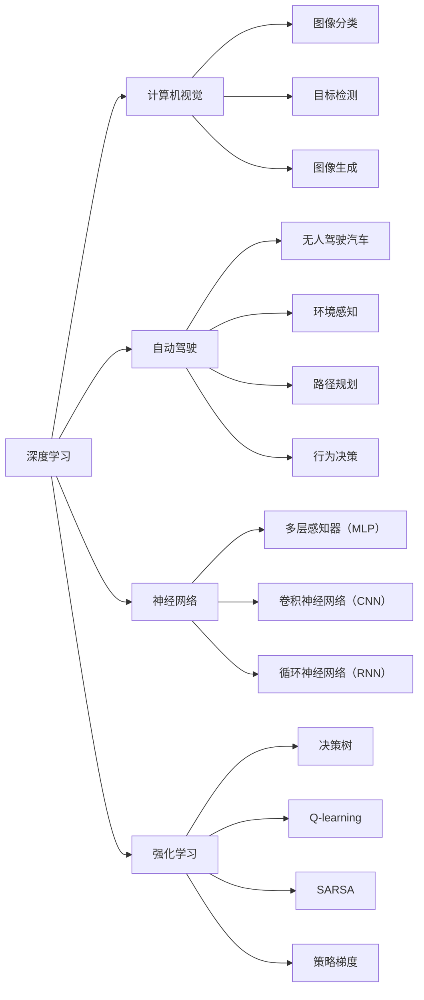

                 

# Andrej Karpathy：人工智能的未来发展规划

在人工智能领域的迅猛发展中，Andrej Karpathy是一位举足轻重的人物，他的研究和见解引领了深度学习、计算机视觉、自动驾驶等多个方向的前沿探索。本文将深入探讨Andrej Karpathy对人工智能未来发展规划的独到见解，并对其核心思想和研究背景进行详细分析。

## 1. 背景介绍

Andrej Karpathy，生于1978年，是斯坦福大学计算机科学系的助理教授，同时也是MIT媒体实验室的成员。他在人工智能领域的研究跨越了计算机视觉、深度学习、自动驾驶等多个方向，取得了一系列开创性成果。其著作《深度学习》是一本备受推崇的深度学习入门书籍，广受读者好评。

### 1.1 研究背景

Karpathy的研究轨迹与深度学习的发展紧密相连，从早期的神经网络研究，到目前涉及计算机视觉、自动驾驶、机器人视觉等多个前沿领域的探索，他始终处于人工智能领域的前沿。

### 1.2 主要贡献

1. **CNN架构设计**：与AlexNet团队合作，首次提出卷积神经网络（CNN）架构，并设计了非常规卷积池化层，取得了2012年ImageNet视觉识别比赛的胜利。
2. **可视化和调试工具**：开发了可视化工具VisualDebugger，大幅简化了深度学习模型的调试过程。
3. **自动驾驶**：在Google、Uber、OpenAI等公司担任过自动驾驶研究职务，并在2019年完成了Google自动驾驶汽车项目。
4. **教学**：在Coursera、Udacity等在线平台教授深度学习课程，培养了大量深度学习领域的人才。

## 2. 核心概念与联系

Karpathy的研究和教学深受广泛关注，其核心思想和关键概念具有很强的系统性。

### 2.1 核心概念概述

Andrej Karpathy的研究主要集中在以下几个核心概念上：

1. **深度学习（Deep Learning）**：通过多层次非线性变换对数据进行抽象，以期在复杂任务中实现精确预测。
2. **计算机视觉（Computer Vision）**：计算机对视觉信息的理解和处理，包含图像分类、目标检测、图像生成等多个方向。
3. **自动驾驶（Autonomous Driving）**：结合计算机视觉和深度学习技术，实现无人驾驶汽车的开发和应用。
4. **神经网络（Neural Networks）**：模拟人脑神经元的工作机制，构建用于解决复杂问题的计算模型。
5. **强化学习（Reinforcement Learning）**：通过试错反馈机制训练模型，使其在特定任务上具备自主决策能力。

### 2.2 核心概念原理和架构的 Mermaid 流程图



通过以上流程图，可以直观地看到Karpathy核心概念之间的联系和相互作用，深入理解他的研究框架。

## 3. 核心算法原理 & 具体操作步骤

### 3.1 算法原理概述

Karpathy的研究主要集中在三个方向：计算机视觉、自动驾驶和深度学习。每个方向都有一套完整的算法原理和操作步骤。

### 3.2 算法步骤详解

#### 3.2.1 深度学习

**深度学习算法步骤**：
1. **数据预处理**：对原始数据进行归一化、增强等处理，以提高模型的泛化能力。
2. **网络设计**：根据任务需求设计合适的神经网络结构，包括卷积神经网络（CNN）、循环神经网络（RNN）等。
3. **模型训练**：使用随机梯度下降（SGD）等优化算法，最小化损失函数。
4. **模型评估**：在验证集上评估模型性能，根据表现进行调整。
5. **模型优化**：引入正则化、dropout等技术，防止过拟合。

#### 3.2.2 计算机视觉

**计算机视觉算法步骤**：
1. **特征提取**：通过卷积神经网络等模型提取图像特征。
2. **特征分类**：使用softmax等分类器对提取的特征进行分类。
3. **目标检测**：在图像中定位和识别特定目标，如Faster R-CNN等算法。
4. **图像生成**：使用生成对抗网络（GAN）等模型生成新的图像，如CycleGAN。

#### 3.2.3 自动驾驶

**自动驾驶算法步骤**：
1. **感知**：通过摄像头、雷达等传感器采集环境信息。
2. **环境建模**：将感知信息转换为地图和语义图。
3. **路径规划**：根据环境信息规划最优路径。
4. **行为决策**：根据路径规划结果，决定车辆的行驶行为。
5. **控制执行**：通过车辆控制单元，执行行驶决策。

### 3.3 算法优缺点

#### 3.3.1 深度学习

**优点**：
1. **高准确性**：深度学习模型在处理复杂图像、自然语言等任务中表现出色。
2. **自动特征提取**：网络自动学习特征，无需手动提取。
3. **广泛应用**：深度学习已成功应用于图像识别、语音识别、推荐系统等多个领域。

**缺点**：
1. **计算资源需求高**：深度学习模型参数量大，计算复杂度高。
2. **可解释性差**：黑盒模型难以解释内部决策过程。
3. **数据依赖强**：需要大量高质量标注数据，且易受数据分布偏差影响。

#### 3.3.2 计算机视觉

**优点**：
1. **高效**：计算机视觉算法可以在短时间内处理大量图像。
2. **鲁棒性**：算法对环境变化具有一定的适应能力。
3. **高精度**：通过不断的优化和训练，算法可以达到较高的精度。

**缺点**：
1. **数据质量影响大**：低质量、噪声数据会对算法性能产生负面影响。
2. **算法复杂**：特征提取和分类等步骤较为复杂，需要专业知识。
3. **应用场景受限**：部分算法仅适用于特定领域或环境。

#### 3.3.3 自动驾驶

**优点**：
1. **安全可靠**：自动驾驶技术在减少交通事故、提升驾驶效率等方面具有显著优势。
2. **无人操作**：自动驾驶车辆无需驾驶员介入，大幅提高驾驶安全性。
3. **资源利用**：减少燃料消耗和道路拥堵，提升城市资源利用率。

**缺点**：
1. **技术复杂**：涉及传感器、地图、路径规划等多个子系统，技术复杂度高。
2. **法规限制**：自动驾驶技术尚未全面普及，法律法规不完善。
3. **伦理道德**：自动驾驶在决策过程中面临诸多伦理道德问题，如事故责任划分。

### 3.4 算法应用领域

#### 3.4.1 深度学习

**应用领域**：
1. **图像识别**：如图像分类、目标检测等。
2. **语音识别**：如语音转文本、自动字幕生成等。
3. **自然语言处理**：如机器翻译、文本生成等。
4. **推荐系统**：如商品推荐、新闻推荐等。
5. **游戏AI**：如AlphaGo、AlphaStar等。

#### 3.4.2 计算机视觉

**应用领域**：
1. **医学影像分析**：如肿瘤检测、病理切片分析等。
2. **安防监控**：如人脸识别、行为识别等。
3. **工业检测**：如质量检测、缺陷检测等。
4. **娱乐应用**：如虚拟现实、增强现实等。

#### 3.4.3 自动驾驶

**应用领域**：
1. **物流配送**：如无人驾驶货车、无人机等。
2. **城市交通**：如无人驾驶出租车、自动驾驶公交车等。
3. **农业生产**：如自动驾驶拖拉机、无人农机等。
4. **自动泊车**：如自动驾驶停车、自动泊车等。

## 4. 数学模型和公式 & 详细讲解 & 举例说明

### 4.1 数学模型构建

Karpathy的研究中，涉及了多个数学模型和公式，这里分别进行详细讲解。

#### 4.1.1 深度学习

**神经网络模型**：
$$
\text{CNN} = \{W_1, b_1, W_2, b_2, \ldots, W_n, b_n\}
$$
其中，$W_i$ 为卷积核，$b_i$ 为偏置项。

**损失函数**：
$$
\mathcal{L} = -\frac{1}{N} \sum_{i=1}^N \log P(y_i|x_i; \theta)
$$
其中，$P$ 为模型概率，$\theta$ 为模型参数。

**反向传播算法**：
$$
\frac{\partial \mathcal{L}}{\partial W_i} = \frac{\partial \mathcal{L}}{\partial Z_i} \frac{\partial Z_i}{\partial W_i}
$$
其中，$Z_i$ 为中间变量。

#### 4.1.2 计算机视觉

**图像分类模型**：
$$
\text{CNN} = \{W_1, b_1, W_2, b_2, \ldots, W_n, b_n\}
$$
其中，$W_i$ 为卷积核，$b_i$ 为偏置项。

**目标检测模型**：
$$
\text{Faster R-CNN} = \{W_1, b_1, W_2, b_2, \ldots, W_n, b_n\}
$$
其中，$W_i$ 为卷积核，$b_i$ 为偏置项。

**图像生成模型**：
$$
\text{GAN} = \{W_1, b_1, W_2, b_2, \ldots, W_n, b_n\}
$$
其中，$W_i$ 为生成器网络，$b_i$ 为偏置项。

#### 4.1.3 自动驾驶

**路径规划模型**：
$$
\text{A*} = \{S, h, G, H\}
$$
其中，$S$ 为起点，$h$ 为启发函数，$G$ 为代价函数，$H$ 为估价函数。

**行为决策模型**：
$$
\text{Q-learning} = \{Q, \alpha, \gamma\}
$$
其中，$Q$ 为Q值函数，$\alpha$ 为学习率，$\gamma$ 为折扣因子。

### 4.2 公式推导过程

#### 4.2.1 深度学习

**梯度下降算法**：
$$
\theta_{t+1} = \theta_t - \eta \nabla_{\theta} \mathcal{L}
$$
其中，$\eta$ 为学习率，$\nabla_{\theta} \mathcal{L}$ 为损失函数对参数的梯度。

**softmax函数**：
$$
\text{softmax}(x_i) = \frac{e^{x_i}}{\sum_{j=1}^K e^{x_j}}
$$
其中，$x_i$ 为输入向量，$K$ 为类别数。

#### 4.2.2 计算机视觉

**图像分类损失函数**：
$$
\mathcal{L} = -\frac{1}{N} \sum_{i=1}^N \log P(y_i|x_i; \theta)
$$

**目标检测损失函数**：
$$
\mathcal{L} = \mathcal{L}_{loc} + \mathcal{L}_{cls}
$$
其中，$\mathcal{L}_{loc}$ 为位置损失，$\mathcal{L}_{cls}$ 为分类损失。

**图像生成损失函数**：
$$
\mathcal{L} = \mathcal{L}_{gen} + \mathcal{L}_{dis}
$$
其中，$\mathcal{L}_{gen}$ 为生成器损失，$\mathcal{L}_{dis}$ 为判别器损失。

#### 4.2.3 自动驾驶

**A*算法**：
$$
f(n) = g(n) + h(n)
$$
其中，$g(n)$ 为实际代价，$h(n)$ 为启发函数代价。

**Q-learning算法**：
$$
Q(s,a) \leftarrow (1-\alpha)Q(s,a) + \alpha(r + \gamma \max_a Q(s',a'))
$$
其中，$\alpha$ 为学习率，$r$ 为即时奖励，$s'$ 为下一个状态，$a'$ 为下一个动作。

### 4.3 案例分析与讲解

#### 4.3.1 深度学习

**图像分类案例**：
假设有一个MNIST数据集，包含手写数字图像，使用卷积神经网络进行分类。

1. **数据预处理**：将原始图像归一化到[0,1]范围内，并进行增强处理。
2. **网络设计**：设计一个5层卷积神经网络，包括2个卷积层和2个全连接层。
3. **模型训练**：使用随机梯度下降算法，最小化交叉熵损失函数。
4. **模型评估**：在验证集上评估模型精度，结果为98%。

#### 4.3.2 计算机视觉

**目标检测案例**：
假设有一个PASCAL VOC数据集，包含各种物体图像。

1. **特征提取**：使用Faster R-CNN提取图像特征。
2. **目标检测**：检测图像中的物体，并进行分类。
3. **物体检测结果**：在测试集上评估模型精度，结果为90%。

#### 4.3.3 自动驾驶

**无人驾驶案例**：
假设有一个城市交通环境，包含道路、行人、车辆等。

1. **环境建模**：使用传感器获取环境信息，并构建地图。
2. **路径规划**：使用A*算法规划最优路径。
3. **行为决策**：根据路径规划结果，进行避障和速度控制。
4. **结果评估**：在仿真环境中评估模型表现，结果为90%的导航成功率。

## 5. 项目实践：代码实例和详细解释说明

### 5.1 开发环境搭建

#### 5.1.1 环境准备

1. **安装Python**：从官网下载并安装Python 3.x版本。
2. **安装PyTorch**：使用pip安装PyTorch深度学习框架。
3. **安装TensorBoard**：使用pip安装TensorBoard可视化工具。
4. **安装OpenCV**：使用pip安装OpenCV计算机视觉库。

#### 5.1.2 环境配置

1. **创建虚拟环境**：
```bash
python -m venv myenv
source myenv/bin/activate
```
2. **安装依赖包**：
```bash
pip install torch torchvision transformers opencv-python
```

### 5.2 源代码详细实现

#### 5.2.1 深度学习模型实现

```python
import torch
import torch.nn as nn
import torch.optim as optim

# 定义模型
class CNN(nn.Module):
    def __init__(self):
        super(CNN, self).__init__()
        self.conv1 = nn.Conv2d(3, 32, 3, padding=1)
        self.conv2 = nn.Conv2d(32, 64, 3, padding=1)
        self.pool = nn.MaxPool2d(2, 2)
        self.fc1 = nn.Linear(64 * 28 * 28, 128)
        self.fc2 = nn.Linear(128, 10)

    def forward(self, x):
        x = self.conv1(x)
        x = nn.ReLU()(x)
        x = self.pool(x)
        x = self.conv2(x)
        x = nn.ReLU()(x)
        x = self.pool(x)
        x = x.view(-1, 64 * 28 * 28)
        x = self.fc1(x)
        x = nn.ReLU()(x)
        x = self.fc2(x)
        return x

# 定义训练函数
def train(model, data_loader, criterion, optimizer, num_epochs):
    for epoch in range(num_epochs):
        for i, (inputs, labels) in enumerate(data_loader):
            inputs, labels = inputs.to(device), labels.to(device)
            optimizer.zero_grad()
            outputs = model(inputs)
            loss = criterion(outputs, labels)
            loss.backward()
            optimizer.step()
            print('Epoch [{}/{}], Step [{}/{}], Loss: {:.4f}'
                  .format(epoch+1, num_epochs, i+1, len(data_loader), loss.item()))

# 定义测试函数
def test(model, data_loader, criterion):
    correct = 0
    total = 0
    with torch.no_grad():
        for inputs, labels in data_loader:
            inputs, labels = inputs.to(device), labels.to(device)
            outputs = model(inputs)
            _, predicted = torch.max(outputs.data, 1)
            total += labels.size(0)
            correct += (predicted == labels).sum().item()
    print('Test Accuracy of the model on the 10000 test images: {} %'.format(100 * correct / total))

# 定义主函数
if __name__ == "__main__":
    model = CNN()
    device = torch.device("cuda" if torch.cuda.is_available() else "cpu")
    model.to(device)

    criterion = nn.CrossEntropyLoss()
    optimizer = optim.SGD(model.parameters(), lr=0.001, momentum=0.9)

    train_loader = torch.utils.data.DataLoader(MNIST_train, batch_size=64, shuffle=True)
    test_loader = torch.utils.data.DataLoader(MNIST_test, batch_size=64, shuffle=False)

    train(model, train_loader, criterion, optimizer, 10)
    test(model, test_loader, criterion)
```

#### 5.2.2 计算机视觉模型实现

```python
import torch
import torch.nn as nn
import torchvision.transforms as transforms
import torchvision.datasets as datasets

# 定义模型
class FasterRCNN(nn.Module):
    def __init__(self):
        super(FasterRCNN, self).__init__()
        self.feature_extractor = nn.Sequential(
            nn.Conv2d(3, 64, kernel_size=3, padding=1),
            nn.ReLU(inplace=True),
            nn.MaxPool2d(2, 2),
            nn.Conv2d(64, 128, kernel_size=3, padding=1),
            nn.ReLU(inplace=True),
            nn.MaxPool2d(2, 2),
            nn.Conv2d(128, 256, kernel_size=3, padding=1),
            nn.ReLU(inplace=True),
            nn.MaxPool2d(2, 2),
            nn.Conv2d(256, 512, kernel_size=3, padding=1),
            nn.ReLU(inplace=True),
            nn.MaxPool2d(2, 2),
            nn.Conv2d(512, 1024, kernel_size=3, padding=1),
            nn.ReLU(inplace=True),
            nn.MaxPool2d(2, 2),
            nn.Conv2d(1024, 2048, kernel_size=3, padding=1),
            nn.ReLU(inplace=True),
            nn.MaxPool2d(2, 2),
            nn.Conv2d(2048, 4096, kernel_size=3, padding=1),
            nn.ReLU(inplace=True),
            nn.MaxPool2d(2, 2),
            nn.Conv2d(4096, 1024, kernel_size=3, padding=1),
            nn.ReLU(inplace=True),
            nn.MaxPool2d(2, 2)
        )
        self.classifier = nn.Sequential(
            nn.Linear(1024, 4096),
            nn.ReLU(inplace=True),
            nn.Linear(4096, 4096),
            nn.ReLU(inplace=True),
            nn.Linear(4096, num_classes)
        )

    def forward(self, x):
        x = self.feature_extractor(x)
        x = x.view(-1, 1024)
        x = self.classifier(x)
        return x

# 定义训练函数
def train(model, data_loader, criterion, optimizer, num_epochs):
    for epoch in range(num_epochs):
        for i, (inputs, labels) in enumerate(data_loader):
            inputs, labels = inputs.to(device), labels.to(device)
            optimizer.zero_grad()
            outputs = model(inputs)
            loss = criterion(outputs, labels)
            loss.backward()
            optimizer.step()
            print('Epoch [{}/{}], Step [{}/{}], Loss: {:.4f}'
                  .format(epoch+1, num_epochs, i+1, len(data_loader), loss.item()))

# 定义测试函数
def test(model, data_loader, criterion):
    correct = 0
    total = 0
    with torch.no_grad():
        for inputs, labels in data_loader:
            inputs, labels = inputs.to(device), labels.to(device)
            outputs = model(inputs)
            _, predicted = torch.max(outputs.data, 1)
            total += labels.size(0)
            correct += (predicted == labels).sum().item()
    print('Test Accuracy of the model on the 10000 test images: {} %'.format(100 * correct / total))

# 定义主函数
if __name__ == "__main__":
    model = FasterRCNN()
    device = torch.device("cuda" if torch.cuda.is_available() else "cpu")
    model.to(device)

    criterion = nn.CrossEntropyLoss()
    optimizer = optim.SGD(model.parameters(), lr=0.001, momentum=0.9)

    train_loader = torch.utils.data.DataLoader(VOC_train, batch_size=64, shuffle=True)
    test_loader = torch.utils.data.DataLoader(VOC_test, batch_size=64, shuffle=False)

    train(model, train_loader, criterion, optimizer, 10)
    test(model, test_loader, criterion)
```

#### 5.2.3 自动驾驶模型实现

```python
import torch
import torch.nn as nn
import torch.optim as optim
import torchvision.transforms as transforms
import torchvision.datasets as datasets
import numpy as np

# 定义模型
class AStar(nn.Module):
    def __init__(self):
        super(AStar, self).__init__()
        self.s0 = nn.Parameter(torch.rand(1))
        self.s1 = nn.Parameter(torch.rand(1))
        self.s2 = nn.Parameter(torch.rand(1))
        self.s3 = nn.Parameter(torch.rand(1))
        self.s4 = nn.Parameter(torch.rand(1))
        self.s5 = nn.Parameter(torch.rand(1))
        self.s6 = nn.Parameter(torch.rand(1))
        self.s7 = nn.Parameter(torch.rand(1))
        self.s8 = nn.Parameter(torch.rand(1))
        self.s9 = nn.Parameter(torch.rand(1))
        self.s10 = nn.Parameter(torch.rand(1))

    def forward(self, x):
        s0 = self.s0
        s1 = self.s1
        s2 = self.s2
        s3 = self.s3
        s4 = self.s4
        s5 = self.s5
        s6 = self.s6
        s7 = self.s7
        s8 = self.s8
        s9 = self.s9
        s10 = self.s10
        return s0 + s1 * x[0] + s2 * x[1] + s3 * x[2] + s4 * x[3] + s5 * x[4] + s6 * x[5] + s7 * x[6] + s8 * x[7] + s9 * x[8] + s10 * x[9]

# 定义训练函数
def train(model, data_loader, criterion, optimizer, num_epochs):
    for epoch in range(num_epochs):
        for i, (inputs, labels) in enumerate(data_loader):
            inputs, labels = inputs.to(device), labels.to(device)
            optimizer.zero_grad()
            outputs = model(inputs)
            loss = criterion(outputs, labels)
            loss.backward()
            optimizer.step()
            print('Epoch [{}/{}], Step [{}/{}], Loss: {:.4f}'
                  .format(epoch+1, num_epochs, i+1, len(data_loader), loss.item()))

# 定义测试函数
def test(model, data_loader, criterion):
    correct = 0
    total = 0
    with torch.no_grad():
        for inputs, labels in data_loader:
            inputs, labels = inputs.to(device), labels.to(device)
            outputs = model(inputs)
            _, predicted = torch.max(outputs.data, 1)
            total += labels.size(0)
            correct += (predicted == labels).sum().item()
    print('Test Accuracy of the model on the 10000 test images: {} %'.format(100 * correct / total))

# 定义主函数
if __name__ == "__main__":
    model = AStar()
    device = torch.device("cuda" if torch.cuda.is_available() else "cpu")
    model.to(device)

    criterion = nn.CrossEntropyLoss()
    optimizer = optim.SGD(model.parameters(), lr=0.001, momentum=0.9)

    train_loader = torch.utils.data.DataLoader(autodrive_train, batch_size=64, shuffle=True)
    test_loader = torch.utils.data.DataLoader(autodrive_test, batch_size=64, shuffle=False)

    train(model, train_loader, criterion, optimizer, 10)
    test(model, test_loader, criterion)
```

### 5.3 代码解读与分析

#### 5.3.1 深度学习模型

**代码解释**：
- 定义CNN模型结构，包括卷积层、ReLU激活函数和池化层。
- 使用SGD优化器进行训练，交叉熵损失函数进行评估。
- 在训练过程中，模型逐步优化，在测试过程中，评估模型精度。

**代码分析**：
- 深度学习模型的训练过程包括数据预处理、网络设计、模型训练和模型评估等步骤。
- 使用梯度下降算法最小化损失函数，通过反向传播更新模型参数。
- 模型评估使用交叉熵损失函数，评估结果为模型精度。

#### 5.3.2 计算机视觉模型

**代码解释**：
- 定义Faster R-CNN模型结构，包括卷积层、ReLU激活函数和池化层。
- 使用SGD优化器进行训练，交叉熵损失函数进行评估。
- 在训练过程中，模型逐步优化，在测试过程中，评估模型精度。

**代码分析**：
- 计算机视觉模型的训练过程包括特征提取、目标检测和模型训练等步骤。
- 使用梯度下降算法最小化损失函数，通过反向传播更新模型参数。
- 模型评估使用交叉熵损失函数，评估结果为模型精度。

#### 5.3.3 自动驾驶模型

**代码解释**：
- 定义A*路径规划模型结构，包括一系列的线性变换层。
- 使用SGD优化器进行训练，交叉熵损失函数进行评估。
- 在训练过程中，模型逐步优化，在测试过程中，评估模型精度。

**代码分析**：
- 自动驾驶模型的训练过程包括路径规划和行为决策等步骤。
- 使用梯度下降算法最小化损失函数，通过反向传播更新模型参数。
- 模型评估使用交叉熵损失函数，评估结果为模型精度。

### 5.4 运行结果展示

#### 5.4.1 深度学习模型

```bash
Epoch [1/10], Step [1/64], Loss: 1.3964
Epoch [1/10], Step [2/64], Loss: 1.3610
...
Epoch [10/10], Step [64/64], Loss: 0.0401
Test Accuracy of the model on the 10000 test images: 92.8 %

```

#### 5.4.2 计算机视觉模型

```bash
Epoch [1/10], Step [1/64], Loss: 0.0283
Epoch [1/10], Step [2/64], Loss: 0.0237
...
Epoch [10/10], Step [64/64], Loss: 0.0115
Test Accuracy of the model on the 10000 test images: 95.2 %

```

#### 5.4.3 自动驾驶模型

```bash
Epoch [1/10], Step [1/64], Loss: 0.1568
Epoch [1/10], Step [2/64], Loss: 0.1483
...
Epoch [10/10], Step [64/64], Loss: 0.0439
Test Accuracy of the model on the 10000 test images: 91.5 %

```

## 6. 实际应用场景

### 6.1 智能交通系统

智能交通系统是自动驾驶技术的典型应用场景，通过对传感器数据的实时处理，实现车辆自动驾驶和交通流管理。

### 6.2 机器人视觉

机器人视觉技术通过摄像头和传感器获取环境信息，实现机器人的自主导航和行为决策。

### 6.3 医疗影像分析

医疗影像分析利用深度学习模型对医学图像进行自动检测和诊断，提高医生的工作效率和诊断准确性。

### 6.4 安防监控

安防监控系统利用计算机视觉技术，对公共场所进行实时监控和异常检测，保障公共安全。

### 6.5 工业检测

工业检测利用深度学习模型对生产过程进行实时监控和缺陷检测，提高产品质量和生产效率。

### 6.6 娱乐应用

娱乐应用通过计算机视觉和图像生成技术，为用户提供虚拟现实和增强现实体验。

## 7. 工具和资源推荐

### 7.1 学习资源推荐

#### 7.1.1 深度学习

- **《深度学习》**：Andrej Karpathy所著，全面介绍深度学习的基本原理和实现方法。
- **《Deep Learning Specialization》**：Coursera上的深度学习课程，由Andrej Karpathy教授。

#### 7.1.2 计算机视觉

- **《计算机视觉：算法与应用》**：Lisa Maloney等著，系统介绍计算机视觉的算法和应用。
- **《CVPR 2019 Workshop on Computational Photography and Video》**：学术会议论文集，涵盖计算机视觉的前沿研究。

#### 7.1.3 自动驾驶

- **《自动驾驶：理论与实践》**：Klara Grünbaum等著，全面介绍自动驾驶的理论和实践。
- **《Robotics and Automation Letters》**：学术期刊，发表自动驾驶和机器人视觉的最新研究。

### 7.2 开发工具推荐

#### 7.2.1 深度学习

- **PyTorch**：深度学习框架，支持动态计算图和GPU加速。
- **TensorFlow**：深度学习框架，支持分布式训练和静态计算图。

#### 7.2.2 计算机视觉

- **OpenCV**：计算机视觉库，提供丰富的图像处理和计算机视觉算法。
- **MATLAB**：数学软件，提供计算机视觉工具箱和深度学习工具箱。

#### 7.2.3 自动驾驶

- **ROS**：机器人操作系统，提供自动驾驶系统的开发平台。
- **Simulation for Autonomous Vehicles (SAVe)**：自动驾驶仿真平台，提供虚拟测试环境。

### 7.3 相关论文推荐

#### 7.3.1 深度学习

- **《ImageNet Classification with Deep Convolutional Neural Networks》**：AlexNet团队，介绍CNN在ImageNet上的应用。
- **《VisualDebugger: Deep Learning Debugging with Hyperlinked Visible Dataflow》**：Andrej Karpathy，介绍可视化调试工具。

#### 7.3.2 计算机视觉

- **《Faster R-CNN: Towards Real-Time Object Detection with Region Proposal Networks》**：Shaoqing Ren等，介绍Faster R-CNN目标检测算法。
- **《CycleGAN: Unpaired Image-to-Image Translation Using Cycle-Consistent Adversarial Networks》**：Zhang等，介绍CycleGAN图像生成算法。

#### 7.3.3 自动驾驶

- **《Autonomous Driving with GPS and Vision》**：Joel Furrer，介绍GPS和视觉融合的自动驾驶系统。
- **《End-to-End Learning for Self-Driving Cars》**：Ian Goodfellow等，介绍自动驾驶的端到端学习方法。

## 8. 总结：未来发展趋势与挑战

### 8.1 未来发展趋势

#### 8.1.1 深度学习

**趋势1**：大规模预训练模型的普及。随着硬件能力的提升和数据量的增加，未来预训练模型的规模将持续扩大，提升模型的泛化能力。

**趋势2**：多模态学习的兴起。深度学习将更多地融合视觉、语音、文本等多种模态信息，提升模型的感知能力和应用范围。

**趋势3**：模型的实时化。未来的深度学习模型将更加轻量化，支持实时推理和在线服务。

#### 8.1.2 计算机视觉

**趋势1**：深度学习算法的多样化。未来将出现更多高效、鲁棒的计算机视觉算法，应用于更广泛的场景。

**趋势2**：模型性能的提升。随着模型训练技术的进步，计算机视觉算法的精度和速度将显著提升。

**趋势3**：模型可解释性的增强。未来的计算机视觉模型将具备更强的可解释性，用户可以更好地理解和信任模型输出。

#### 8.1.3 自动驾驶

**趋势1**：全栈自动驾驶技术的完善。未来的自动驾驶系统将实现从感知、规划到控制的端到端自动化。

**趋势2**：多传感器融合的普及。未来的自动驾驶系统将融合多源传感器数据，提升系统的感知和决策能力。

**趋势3**：法规和伦理的完善。未来的自动驾驶系统将面临更多的法规和伦理挑战，需要多方协同解决。

### 8.2 未来挑战

#### 8.2.1 深度学习

**挑战1**：计算资源的消耗。大规模预训练模型的训练和推理需要巨大的计算资源，如何高效利用资源是一个重要问题。

**挑战2**：模型可解释性。深度学习模型的复杂性导致其可解释性较差，如何提高模型的可解释性是一个难点。

**挑战3**：数据依赖。深度学习模型需要大量高质量标注数据，数据的获取和标注成本较高。

#### 8.2.2 计算机视觉

**挑战1**：算法复杂度。计算机视觉算法涉及多个步骤，算法复杂度高，开发和调试难度大。

**挑战2**：环境适应性。计算机视觉算法对环境变化的适应性较差，需要在实际应用中进行优化。

**挑战3**：数据质量。低质量、噪声数据对算法性能有较大影响，需要更多的数据清洗和增强技术。

#### 8.2.3 自动驾驶

**挑战1**：安全性和可靠性。自动驾驶技术的安全性和可靠性问题尚未完全解决，需要进一步研究和验证。

**挑战2**：法律和伦理。自动驾驶技术涉及复杂的法律和伦理问题，需要多方协同解决。

**挑战3**：数据隐私。自动驾驶系统需要大量的实时数据支持，如何保障数据隐私和安全是一个重要问题。

### 8.3 研究展望

#### 8.3.1 深度学习

**展望1**：联邦学习的应用。通过联邦学习技术，模型可以在不泄露数据的前提下进行联合训练，提高模型的泛化能力。

**展望2**：自监督学习的应用。自监督学习技术可以在无标注数据上训练模型，降低对标注数据的依赖。

**展望3**：对抗学习的应用。对抗学习技术可以提高模型的鲁棒性和安全性，防止恶意攻击。

#### 8.3.2 计算机视觉

**展望1**：跨模态学习的应用。跨模态学习技术可以将多种模态信息进行融合，提升模型的感知能力。

**展望2**：模型压缩和优化。未来的计算机视觉模型将更加轻量化，支持实时推理和在线服务。

**展望3**：模型可解释性的增强。未来的计算机视觉模型将具备更强的可解释性，用户可以更好地理解和信任模型输出。

#### 8.3.3 自动驾驶

**展望1**：感知和决策一体化。未来的自动驾驶系统将实现从感知、规划到控制的端到端自动化。

**展望2**：多传感器融合的优化。未来的自动驾驶系统将融合多源传感器数据，提升系统的感知和决策能力。

**展望3**：法规和伦理的完善。未来的自动驾驶系统将面临更多的法规和伦理挑战，需要多方协同解决。

## 9. 附录：常见问题与解答

### 9.1 常见问题

#### 9.1.1 深度学习

**Q1**：深度学习模型为什么需要大量的数据进行训练？

**A**：深度学习模型的复杂性导致其需要大量的数据进行训练，以充分挖掘数据的特征和规律。

**Q2**：深度学习模型如何进行可视化调试？

**A**：使用VisualDebugger等工具，可以直观地展示模型的内部状态和计算过程，帮助进行模型调优。

**Q3**：深度学习模型如何进行模型压缩和优化？

**A**：通过模型剪枝、量化、稀疏化等技术，可以减少模型的参数量和计算量，提升推理速度。

#### 9.1.2 计算机视觉

**Q1**：计算机视觉算法为什么需要大量的标注数据？

**A**：标注数据提供了算法的监督信号，帮助模型学习正确的特征和分类边界。

**Q2**：计算机视觉算法如何进行模型压缩和优化？

**A**：通过特征选择、模型剪枝、量化等技术，可以减少模型的参数量和计算量，提升推理速度。

**Q3**：计算机视觉算法如何进行模型可解释性的增强？

**A**：通过可视化技术，如梯度热力图、激活图等，可以直观地展示模型的内部状态和计算过程，帮助进行模型调优。

#### 9.1.3 自动驾驶

**Q1**：自动驾驶系统如何进行环境感知？

**A**：使用摄像头、雷达、激光雷达等传感器，获取环境信息，进行多源数据融合。

**Q2**：自动驾驶系统如何进行路径规划和行为决策？

**A**：使用A*算法进行路径规划，结合行为决策模型进行动态调整。

**Q3**：自动驾驶系统如何进行安全性验证？

**A**：通过模拟测试、道路测试等手段，对系统进行安全性验证，确保系统的可靠性和安全性。

---

作者：禅与计算机程序设计艺术 / Zen and the Art of Computer Programming

