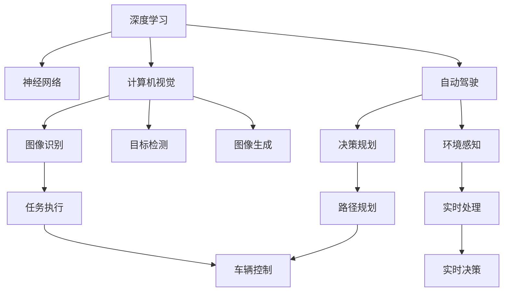

                 

# Andrej Karpathy：人工智能的未来发展规划

> 关键词：人工智能,深度学习,计算机视觉,自动驾驶,神经网络,未来发展,技术创新

## 1. 背景介绍

### 1.1 问题由来
在人工智能(AI)领域，Andrej Karpathy是一个令人瞩目的名字。作为一位技术科学家和领导者，他不仅在深度学习领域取得显著成就，还积极推动AI技术的创新应用，尤其是计算机视觉和自动驾驶。Karpathy的工作涵盖了从基础研究到实际部署的各个方面，为AI的未来发展指明了方向。

### 1.2 问题核心关键点
Karpathy的研究和实践涉及多个关键领域，包括：

- **深度学习**：作为深度学习领域的先驱之一，Karpathy对神经网络架构和优化技术做出了重要贡献，如残差网络(ResNet)。
- **计算机视觉**：他的工作促进了图像识别、目标检测、图像生成等计算机视觉技术的突破。
- **自动驾驶**：Karpathy在自动驾驶领域的研究推动了深度学习在实时环境感知和决策中的应用。
- **AI伦理**：他强调AI技术的责任和伦理问题，倡导负责任的AI开发和应用。
- **技术教育**：作为OpenAI的TPU团队负责人，Karpathy积极推动AI教育和技术传播，培养下一代AI人才。

## 2. 核心概念与联系

### 2.1 核心概念概述

Andrej Karpathy的研究涵盖了多个核心概念，这些概念构成了他对AI未来发展的规划：

- **深度学习**：使用多层神经网络进行复杂数据建模和分析的技术。
- **计算机视觉**：使计算机能够“看见”并理解图像和视频的技术。
- **自动驾驶**：通过AI技术实现车辆的自主导航和驾驶。
- **神经网络**：由大量相互连接的神经元组成的网络结构，用于学习和决策。
- **技术伦理**：在AI开发和应用中考虑伦理问题，确保技术的负责任使用。
- **技术教育**：通过教育和培训培养AI领域的专业人才，促进技术传播。

这些概念之间通过以下方式联系起来：

- **深度学习**和**神经网络**是实现计算机视觉和自动驾驶的基础技术。
- **计算机视觉**和**自动驾驶**是深度学习技术的典型应用领域。
- **技术伦理**和**技术教育**是为了确保AI技术在应用中的负责任和可持续发展。

### 2.2 核心概念原理和架构的 Mermaid 流程图



## 3. 核心算法原理 & 具体操作步骤

### 3.1 算法原理概述

Karpathy的研究集中在以下几个核心算法原理：

- **深度神经网络**：使用多层神经元进行非线性映射和特征提取。
- **卷积神经网络(CNN)**：针对图像数据，使用卷积操作提取局部特征。
- **循环神经网络(RNN)**：处理序列数据，如时间序列和文本。
- **残差网络(ResNet)**：通过跨层连接解决深度神经网络的梯度消失问题。
- **自注意力机制**：在Transformer中，通过自注意力机制实现对输入序列的灵活处理。

### 3.2 算法步骤详解

1. **深度神经网络设计**：选择合适的神经网络架构，如LeNet、AlexNet、VGG等，根据任务需求调整网络层数和神经元数量。
2. **数据预处理**：将原始数据进行归一化、增强和分割，为神经网络提供训练数据。
3. **模型训练**：使用反向传播算法更新网络权重，最小化损失函数。
4. **模型验证和测试**：在验证集和测试集上评估模型性能，调整超参数。
5. **模型应用**：将训练好的模型应用于实际任务，如图像分类、目标检测、自动驾驶等。

### 3.3 算法优缺点

**优点**：

- **高精度**：深度学习模型在许多任务上取得了超越人类的表现。
- **自动特征提取**：神经网络能够自动学习特征，减少人工干预。
- **泛化能力**：经过大量数据训练的模型在未见过的数据上表现良好。

**缺点**：

- **计算资源需求高**：训练深度神经网络需要大量的计算资源和时间。
- **可解释性差**：神经网络决策过程缺乏直观解释，难以理解其内部逻辑。
- **数据依赖性强**：模型的性能高度依赖于训练数据的数量和质量。

### 3.4 算法应用领域

Karpathy的工作主要应用在以下领域：

- **计算机视觉**：如ImageNet比赛、KITTI挑战赛、Cityscapes竞赛等，推动了图像识别和自动驾驶的发展。
- **自动驾驶**：通过深度学习实现了车辆在复杂环境下的自主导航和决策。
- **医学影像分析**：应用深度学习进行疾病诊断和治疗计划生成。
- **自然语言处理(NLP)**：如语言模型生成、机器翻译等。

## 4. 数学模型和公式 & 详细讲解 & 举例说明

### 4.1 数学模型构建

Karpathy的研究涉及多个数学模型，这里以图像识别中的卷积神经网络(CNN)为例：

- **输入层**：输入图像数据，大小为$W \times H \times C$。
- **卷积层**：使用卷积核提取特征，大小为$F \times F \times C$。
- **池化层**：对特征图进行下采样，减小尺寸。
- **全连接层**：将池化后的特征映射为类别概率，输出大小为$N$。

### 4.2 公式推导过程

卷积神经网络的输出公式为：

$$
\mathbf{y} = \sigma(\mathbf{W} \cdot \mathbf{x} + \mathbf{b})
$$

其中，$\mathbf{x}$为输入特征图，$\mathbf{y}$为输出特征图，$\mathbf{W}$为卷积核权重，$\mathbf{b}$为偏置项，$\sigma$为激活函数（如ReLU）。

### 4.3 案例分析与讲解

以图像分类为例，Karpathy使用卷积神经网络对ImageNet数据集进行训练，通过反向传播算法更新网络参数，最小化交叉熵损失函数：

$$
\mathcal{L}(\theta) = -\frac{1}{N} \sum_{i=1}^N \log p_i
$$

其中，$p_i$为模型对第$i$个样本的正确预测概率，$\theta$为网络参数。

## 5. 项目实践：代码实例和详细解释说明

### 5.1 开发环境搭建

为了实现上述研究，我们需要安装以下工具：

1. **Python**：选择Python 3.6及以上版本。
2. **PyTorch**：用于深度学习和神经网络实现。
3. **NumPy**：用于数值计算。
4. **TensorFlow**：用于图像处理和分布式计算。
5. **OpenCV**：用于图像和视频处理。

### 5.2 源代码详细实现

以下是一个简单的卷积神经网络代码示例：

```python
import torch
import torch.nn as nn
import torch.optim as optim
from torch.utils.data import DataLoader
from torchvision import datasets, transforms

# 定义卷积神经网络
class CNN(nn.Module):
    def __init__(self):
        super(CNN, self).__init__()
        self.conv1 = nn.Conv2d(3, 64, kernel_size=3, stride=1, padding=1)
        self.relu = nn.ReLU()
        self.maxpool = nn.MaxPool2d(kernel_size=2, stride=2)
        self.fc1 = nn.Linear(64 * 28 * 28, 10)
        
    def forward(self, x):
        x = self.conv1(x)
        x = self.relu(x)
        x = self.maxpool(x)
        x = x.view(-1, 64 * 28 * 28)
        x = self.fc1(x)
        return x

# 数据预处理
transform = transforms.Compose([
    transforms.ToTensor(),
    transforms.Normalize((0.5, 0.5, 0.5), (0.5, 0.5, 0.5))
])

# 加载MNIST数据集
trainset = datasets.MNIST(root='./data', train=True, download=True, transform=transform)
testset = datasets.MNIST(root='./data', train=False, download=True, transform=transform)

# 定义数据加载器
trainloader = DataLoader(trainset, batch_size=64, shuffle=True)
testloader = DataLoader(testset, batch_size=64, shuffle=False)

# 定义模型、损失函数和优化器
model = CNN()
criterion = nn.CrossEntropyLoss()
optimizer = optim.SGD(model.parameters(), lr=0.001, momentum=0.9)

# 训练模型
for epoch in range(10):
    running_loss = 0.0
    for i, data in enumerate(trainloader, 0):
        inputs, labels = data
        optimizer.zero_grad()
        outputs = model(inputs)
        loss = criterion(outputs, labels)
        loss.backward()
        optimizer.step()
        running_loss += loss.item()
    print(f'Epoch {epoch+1}, loss: {running_loss/len(trainloader):.3f}')
```

### 5.3 代码解读与分析

上述代码展示了如何使用PyTorch实现一个简单的卷积神经网络，用于手写数字识别。

- `CNN`类定义了卷积神经网络的结构，包括卷积层、激活函数、池化层和全连接层。
- `transform`用于数据预处理，将图像数据转换为Tensor张量并进行归一化。
- `datasets.MNIST`加载MNIST数据集，分为训练集和测试集。
- `DataLoader`定义数据加载器，用于批量加载数据。
- `SGD`优化器用于更新模型参数，最小化交叉熵损失。
- 训练循环使用`for`循环进行迭代，每个epoch迭代一次数据集。

### 5.4 运行结果展示

训练完成后，使用测试集评估模型性能：

```python
correct = 0
total = 0
with torch.no_grad():
    for data in testloader:
        images, labels = data
        outputs = model(images)
        _, predicted = torch.max(outputs.data, 1)
        total += labels.size(0)
        correct += (predicted == labels).sum().item()

print(f'Accuracy: {(100 * correct / total):.2f}%')
```

## 6. 实际应用场景

### 6.1 智能交通系统

Karpathy在自动驾驶领域的研究推动了AI在交通系统中的应用。通过深度学习技术，自动驾驶车辆能够实时感知环境，自动规划路径，实现高精度定位和避障。

### 6.2 医疗影像分析

深度学习在医学影像分析中展现了巨大的潜力，Karpathy的研究成果包括使用卷积神经网络进行肿瘤检测和分割，提高了医疗诊断的准确性和效率。

### 6.3 机器人视觉

Karpathy还研究了计算机视觉在机器人领域的应用，通过视觉引导机器人完成复杂任务，提升了机器人的智能水平。

## 7. 工具和资源推荐

### 7.1 学习资源推荐

为了帮助开发者掌握深度学习技术，Karpathy推荐以下学习资源：

- **Coursera深度学习课程**：由Andrew Ng教授开设的深度学习入门课程，涵盖神经网络、卷积神经网络等基础概念。
- **Deep Learning Specialization**：由Andrew Ng教授领导的深度学习专项课程，系统学习深度学习理论和实践。
- **Deep Learning with PyTorch**：由Karpathy本人撰写的深度学习教程，详细介绍了PyTorch的使用和深度学习技术。
- **PyTorch官方文档**：提供了丰富的深度学习模型和工具的使用指南。

### 7.2 开发工具推荐

为了支持深度学习研究，Karpathy推荐以下开发工具：

- **PyTorch**：用于深度学习和神经网络实现。
- **TensorFlow**：用于图像处理和分布式计算。
- **OpenCV**：用于图像和视频处理。
- **Jupyter Notebook**：用于交互式编程和数据可视化。
- **Visual Studio Code**：用于代码编写和调试。

### 7.3 相关论文推荐

Karpathy的研究成果主要发表于以下论文：

- **ImageNet Classification with Deep Convolutional Neural Networks**：提出了卷积神经网络(CNN)在图像分类中的应用。
- **End to End Learning for Self-Driving Cars**：展示了自动驾驶技术的深度学习实现。
- **Deep Residual Learning for Image Recognition**：介绍了残差网络(ResNet)及其在图像识别中的应用。
- **Visual Genome: Connecting Language and Vision Using Crowdsourced Dense Image Descriptions**：探讨了图像描述生成和语义理解的技术。

## 8. 总结：未来发展趋势与挑战

### 8.1 研究成果总结

Karpathy的研究推动了深度学习在计算机视觉和自动驾驶等领域的发展，为AI技术的未来应用奠定了坚实基础。

### 8.2 未来发展趋势

未来，AI技术将在以下几个方面继续发展：

- **深度学习技术**：神经网络结构和优化算法的改进，使得深度学习在更复杂任务上表现优异。
- **计算机视觉**：图像识别、目标检测和图像生成等技术的突破，推动了AI在视觉感知中的应用。
- **自动驾驶**：通过多传感器融合和实时决策算法，实现更安全、高效的自动驾驶。
- **医疗影像**：使用深度学习进行疾病诊断和治疗计划生成，提高医疗诊断的准确性和效率。
- **机器人**：通过视觉和感知技术，提升机器人的智能水平和任务执行能力。

### 8.3 面临的挑战

尽管AI技术取得了显著进展，但仍面临以下挑战：

- **计算资源需求高**：深度学习模型的训练和推理需要大量计算资源，制约了其在实际应用中的普及。
- **数据质量问题**：数据标注质量和多样性不足，限制了模型的泛化能力。
- **算法复杂性**：深度学习模型结构和优化算法复杂，难以理解和解释。
- **伦理问题**：AI技术的广泛应用可能带来隐私、安全和伦理问题，需进行规范和监管。

### 8.4 研究展望

未来研究需要关注以下方向：

- **轻量级模型**：开发更高效、更轻量级的深度学习模型，降低计算资源需求。
- **联邦学习**：通过分布式计算和数据隐私保护技术，实现跨领域和跨组织的数据共享。
- **可解释性**：开发更可解释的AI模型，提升算法的透明性和可信度。
- **跨学科融合**：将AI技术与心理学、社会学等学科结合，推动AI技术的社会化应用。

## 9. 附录：常见问题与解答

**Q1：深度学习算法是如何训练的？**

A: 深度学习算法通过反向传播算法进行训练。首先定义损失函数，然后计算模型预测输出与真实标签之间的误差，通过反向传播算法计算梯度，更新模型参数，使损失函数最小化。

**Q2：如何选择合适的深度神经网络架构？**

A: 选择合适的深度神经网络架构需要考虑以下几个因素：
- **任务类型**：不同类型的任务需要不同的网络结构，如分类任务可以使用卷积神经网络，序列任务可以使用循环神经网络。
- **数据量**：数据量较小时，应选择较浅的网络结构，避免过拟合。
- **计算资源**：计算资源有限时，应选择参数较少的模型，降低计算成本。

**Q3：深度学习在自动驾驶中有什么应用？**

A: 深度学习在自动驾驶中有广泛应用，包括：
- **环境感知**：使用卷积神经网络进行道路、车辆、行人等目标检测。
- **路径规划**：使用循环神经网络进行轨迹预测和路径规划。
- **决策控制**：使用强化学习进行驾驶策略优化和行为决策。

**Q4：如何处理深度学习中的过拟合问题？**

A: 处理深度学习中的过拟合问题可以采取以下措施：
- **数据增强**：通过旋转、缩放、裁剪等方式扩充训练数据集。
- **正则化**：使用L1、L2正则化、Dropout等技术防止过拟合。
- **早停法**：在验证集上监控模型性能，一旦性能下降则停止训练。

**Q5：AI技术的伦理问题有哪些？**

A: AI技术的伦理问题主要包括：
- **隐私保护**：AI技术可能侵犯个人隐私，需制定隐私保护机制。
- **公平性**：AI模型可能存在偏见，需进行公平性测试和改进。
- **安全性**：AI系统可能被恶意利用，需进行安全防护。
- **责任问题**：AI系统出现错误时，责任归属问题需明确。

**Q6：如何提高AI模型的可解释性？**

A: 提高AI模型的可解释性可以采取以下措施：
- **可视化**：通过可视化技术展示模型内部机制和决策过程。
- **简化模型**：减少模型的复杂度，使其更容易理解。
- **知识图谱**：使用知识图谱提供模型推理的逻辑和依据。

---

作者：禅与计算机程序设计艺术 / Zen and the Art of Computer Programming

