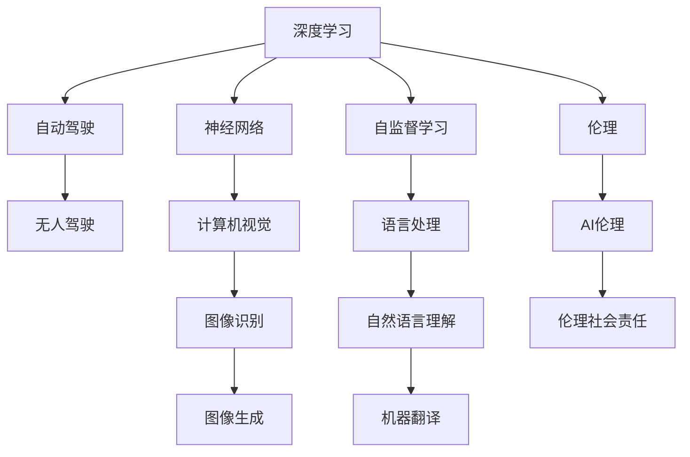

                 

# Andrej Karpathy：人工智能的未来发展趋势

## 1. 背景介绍

Andrej Karpathy是深度学习领域一位极具影响力的专家。他在AI、计算机视觉、自动驾驶等多个方向取得了重要成果，并曾主导开发了OpenAI的GPT-3模型。本文将通过分析Karpathy的研究成果，深入探讨人工智能的未来发展趋势。

### 1.1 问题由来

近年来，深度学习技术迅猛发展，其应用已经从图像识别、自然语言处理等领域扩展到无人驾驶、医疗健康等各个角落。Karpathy在深度学习的研究和应用上有着独特的见解和观点，他在一系列论文、演讲和社交媒体上发表了许多精彩的内容。通过深入分析和总结，我们希望从他的观点中揭示人工智能的发展趋势，为我们理解AI的未来提供有益的参考。

### 1.2 问题核心关键点

本文将探讨Karpathy在深度学习、神经网络、自监督学习、自动驾驶等领域的最新研究成果，分析其对未来人工智能发展的潜在影响。具体包括：
- 深度学习在计算效率和模型大小方面的发展趋势
- 自监督学习方法在图像和语言处理中的应用及未来前景
- 自动驾驶技术的发展方向和面临的挑战
- AI伦理和社会责任问题

这些关键点将帮助我们全面理解人工智能未来可能的方向和挑战。

## 2. 核心概念与联系

### 2.1 核心概念概述

为了更好地理解Karpathy的研究和观点，本节将介绍几个密切相关的核心概念：

- **深度学习**：通过多层次的神经网络结构来模拟人脑神经元之间的连接，实现数据的自动特征提取和模式识别。
- **自监督学习**：在无需标注数据的情况下，利用数据的内部结构和先验知识进行模型训练，如图像识别中的自监督方法。
- **神经网络**：由大量神经元和连接组成的复杂模型，能够通过训练学习到数据的复杂结构，广泛应用于计算机视觉、自然语言处理等领域。
- **自动驾驶**：通过传感器、计算机视觉和深度学习技术，使车辆能够自主导航和避障，实现无人驾驶。
- **AI伦理**：在AI技术发展过程中，需要关注伦理和社会责任问题，确保技术的应用符合社会价值观和法律规范。

这些概念之间的逻辑关系可以通过以下Mermaid流程图来展示：



这个流程图展示了几大核心概念之间的联系：

1. 深度学习是神经网络、自监督学习的基础，而神经网络是计算机视觉、自动驾驶等应用的核心。
2. 自监督学习在图像和语言处理中有着广泛的应用，能够提高模型的泛化能力和自适应性。
3. 自动驾驶是深度学习和神经网络的具体应用，涉及到计算机视觉、传感器融合等多个技术领域。
4. AI伦理是AI技术应用过程中必须考虑的重要问题，与伦理社会责任息息相关。

这些概念共同构成了Karpathy研究的主要领域，帮助我们理解他在人工智能未来发展方向上的看法。

## 3. 核心算法原理 & 具体操作步骤

### 3.1 算法原理概述

Karpathy的研究涵盖深度学习、自监督学习、计算机视觉和自动驾驶等多个方向。以下将从这些方向详细介绍其核心算法原理。

#### 3.1.1 深度学习

深度学习是一种基于多层神经网络结构的学习范式。通过多层非线性变换，深度学习能够自动从数据中提取复杂特征，从而实现高效的分类、回归、生成等任务。Karpathy在深度学习的研究中，特别关注了模型大小、计算效率和泛化能力。

#### 3.1.2 自监督学习

自监督学习利用数据内部结构和先验知识进行模型训练。Karpathy在图像生成、自然语言处理等领域，通过自监督学习，取得了显著的进展。

#### 3.1.3 神经网络

神经网络是深度学习的基础。Karpathy的研究涵盖了卷积神经网络(CNN)、循环神经网络(RNN)、变分自编码器(VAE)等多种类型的神经网络，这些网络在计算机视觉、自然语言处理、自动驾驶等领域都有着广泛的应用。

#### 3.1.4 自动驾驶

自动驾驶是深度学习在现实世界中的重要应用。Karpathy的研究中，特别关注了自动驾驶中的传感器融合、场景理解、路径规划等问题，推动了自动驾驶技术的发展。

### 3.2 算法步骤详解

#### 3.2.1 深度学习

1. **数据准备**：收集并清洗数据集，保证数据质量和多样性。
2. **模型构建**：选择适合任务的神经网络结构，如卷积神经网络、循环神经网络等。
3. **模型训练**：使用随机梯度下降等优化算法，对模型进行迭代训练，更新模型参数。
4. **模型评估**：使用验证集或测试集对模型进行评估，调整模型超参数。
5. **模型部署**：将训练好的模型部署到实际应用中，实现高效的分类、回归、生成等任务。

#### 3.2.2 自监督学习

1. **数据准备**：收集大量未标注数据，确保数据多样性和复杂性。
2. **模型构建**：选择合适的自监督学习方法，如对比学习、掩码语言模型等。
3. **模型训练**：使用自监督学习方法对模型进行训练，优化模型参数。
4. **模型评估**：使用验证集或测试集对模型进行评估，确保模型的泛化能力。
5. **模型应用**：将训练好的模型应用于图像生成、自然语言处理等任务中，提升模型效果。

#### 3.2.3 神经网络

1. **数据准备**：收集并清洗数据集，确保数据质量和多样性。
2. **模型构建**：选择合适的神经网络结构，如卷积神经网络、循环神经网络等。
3. **模型训练**：使用随机梯度下降等优化算法，对模型进行迭代训练，更新模型参数。
4. **模型评估**：使用验证集或测试集对模型进行评估，调整模型超参数。
5. **模型部署**：将训练好的模型部署到实际应用中，实现高效的分类、回归、生成等任务。

#### 3.2.4 自动驾驶

1. **数据准备**：收集并清洗车辆传感器数据，如摄像头、雷达等。
2. **模型构建**：选择适合的深度学习模型，如卷积神经网络、循环神经网络等。
3. **模型训练**：使用车辆传感器数据对模型进行训练，优化模型参数。
4. **模型评估**：使用仿真或实际驾驶数据对模型进行评估，调整模型超参数。
5. **模型部署**：将训练好的模型部署到车辆中，实现自动驾驶功能。

### 3.3 算法优缺点

#### 3.3.1 深度学习

- **优点**：
  - 强大的特征提取能力：能够自动学习复杂数据特征，适用于各类任务。
  - 高效计算：并行计算能力强，能够处理大规模数据集。
  - 广泛应用：在计算机视觉、自然语言处理、自动驾驶等多个领域都有重要应用。

- **缺点**：
  - 计算资源消耗大：模型复杂，需要大量计算资源。
  - 过拟合风险：模型复杂容易过拟合，需要额外正则化技术。
  - 数据依赖性高：需要大量标注数据，标注成本较高。

#### 3.3.2 自监督学习

- **优点**：
  - 无需标注数据：利用数据内部结构和先验知识进行训练，能够处理大规模未标注数据。
  - 泛化能力强：能够提高模型的泛化能力，适应不同领域的数据。
  - 数据生成：通过自监督学习方法，可以生成高质量的标注数据。

- **缺点**：
  - 数据依赖性：需要大量未标注数据，数据生成难度大。
  - 模型复杂：自监督学习方法复杂，需要精心设计。
  - 效果不确定：自监督学习方法效果受数据多样性和复杂性影响大。

#### 3.3.3 神经网络

- **优点**：
  - 强大的特征提取能力：能够自动学习复杂数据特征，适用于各类任务。
  - 高效计算：并行计算能力强，能够处理大规模数据集。
  - 广泛应用：在计算机视觉、自然语言处理、自动驾驶等多个领域都有重要应用。

- **缺点**：
  - 计算资源消耗大：模型复杂，需要大量计算资源。
  - 过拟合风险：模型复杂容易过拟合，需要额外正则化技术。
  - 数据依赖性高：需要大量标注数据，标注成本较高。

#### 3.3.4 自动驾驶

- **优点**：
  - 高效安全：自动驾驶能够提高道路安全，减少交通事故。
  - 减少人力成本：自动驾驶能够减少人工驾驶的需求，提高运输效率。
  - 多样化应用：自动驾驶技术适用于交通、物流等多个领域。

- **缺点**：
  - 技术复杂：自动驾驶技术涉及传感器、计算机视觉等多个技术领域，技术难度高。
  - 伦理问题：自动驾驶涉及伦理问题，如事故责任划分、数据隐私等。
  - 社会接受度：自动驾驶技术需要公众接受，推广难度大。

### 3.4 算法应用领域

#### 3.4.1 深度学习

深度学习在计算机视觉、自然语言处理等领域有着广泛的应用。例如：
- 计算机视觉：图像分类、物体检测、人脸识别等。
- 自然语言处理：机器翻译、文本生成、语音识别等。

#### 3.4.2 自监督学习

自监督学习在图像生成、自然语言处理等领域有着广泛的应用。例如：
- 图像生成：利用自监督学习方法，生成高质量的图像。
- 自然语言处理：利用自监督学习方法，生成高质量的自然语言文本。

#### 3.4.3 神经网络

神经网络在计算机视觉、自然语言处理等领域有着广泛的应用。例如：
- 计算机视觉：图像分类、物体检测、人脸识别等。
- 自然语言处理：机器翻译、文本生成、语音识别等。

#### 3.4.4 自动驾驶

自动驾驶技术在交通、物流等领域有着广泛的应用。例如：
- 自动驾驶汽车：提高道路安全，减少交通事故。
- 自动驾驶无人机：提高物流效率，减少人力成本。

## 4. 数学模型和公式 & 详细讲解 & 举例说明

### 4.1 数学模型构建

Karpathy的研究中，数学模型的构建是其核心。以下以图像分类为例，详细介绍深度学习模型的构建过程。

#### 4.1.1 深度学习

- **输入层**：将输入的图像数据转换为神经网络能够处理的形式。
- **卷积层**：通过卷积操作提取图像的特征。
- **池化层**：通过池化操作减少特征维度，降低计算复杂度。
- **全连接层**：将池化层输出的特征映射为分类结果。
- **输出层**：通过softmax函数计算每个类别的概率。

#### 4.1.2 自监督学习

- **对比学习**：在未标注数据上，通过对比学习生成伪标签，用于训练模型。
- **掩码语言模型**：在自然语言处理任务中，利用掩码语言模型生成高质量的标注数据。

#### 4.1.3 神经网络

- **卷积神经网络**：在计算机视觉任务中，通过卷积神经网络提取图像特征。
- **循环神经网络**：在自然语言处理任务中，通过循环神经网络处理序列数据。
- **变分自编码器**：在图像生成任务中，通过变分自编码器生成高质量的图像。

#### 4.1.4 自动驾驶

- **传感器融合**：通过传感器融合技术，获取车辆周围环境信息。
- **场景理解**：通过深度学习模型，理解车辆周围环境。
- **路径规划**：通过深度学习模型，生成最优路径。

### 4.2 公式推导过程

#### 4.2.1 深度学习

- **输入层**：
  $$
  x \in \mathbb{R}^n
  $$
- **卷积层**：
  $$
  y = \sigma(Wx + b)
  $$
- **池化层**：
  $$
  y' = f(y)
  $$
- **全连接层**：
  $$
  z = W'y' + b'
  $$
- **输出层**：
  $$
  p(y|x) = \sigma(z)
  $$

#### 4.2.2 自监督学习

- **对比学习**：
  $$
  \hat{y} = \sigma(Wx + b)
  $$
  $$
  \ell = \frac{1}{N}\sum_{i=1}^N \max(0, y_i - \hat{y})
  $$
- **掩码语言模型**：
  $$
  \hat{y} = \sigma(Wx + b)
  $$
  $$
  \ell = \frac{1}{N}\sum_{i=1}^N \max(0, y_i - \hat{y})
  $$

#### 4.2.3 神经网络

- **卷积神经网络**：
  $$
  x \in \mathbb{R}^n
  $$
  $$
  y = \sigma(Wx + b)
  $$
  $$
  z = W'y' + b'
  $$
- **循环神经网络**：
  $$
  x \in \mathbb{R}^n
  $$
  $$
  y = \sigma(Wx + b)
  $$
- **变分自编码器**：
  $$
  x \in \mathbb{R}^n
  $$
  $$
  z = \sigma(Wx + b)
  $$
  $$
  x' = \sigma(W'z + b')
  $$

#### 4.2.4 自动驾驶

- **传感器融合**：
  $$
  x \in \mathbb{R}^n
  $$
  $$
  y = \sigma(Wx + b)
  $$
  $$
  z = W'y' + b'
  $$
- **场景理解**：
  $$
  x \in \mathbb{R}^n
  $$
  $$
  y = \sigma(Wx + b)
  $$
- **路径规划**：
  $$
  x \in \mathbb{R}^n
  $$
  $$
  y = \sigma(Wx + b)
  $$

### 4.3 案例分析与讲解

#### 4.3.1 深度学习

以图像分类为例，利用卷积神经网络对图像进行分类。
- **数据准备**：收集并清洗图像数据集，确保数据质量和多样性。
- **模型构建**：选择合适的卷积神经网络结构，如LeNet、AlexNet等。
- **模型训练**：使用随机梯度下降等优化算法，对模型进行迭代训练，更新模型参数。
- **模型评估**：使用验证集或测试集对模型进行评估，调整模型超参数。
- **模型部署**：将训练好的模型部署到实际应用中，实现高效的图像分类。

#### 4.3.2 自监督学习

以图像生成为例，利用自监督学习方法生成高质量的图像。
- **数据准备**：收集大量未标注图像数据。
- **模型构建**：选择合适的自监督学习方法，如对比学习、掩码语言模型等。
- **模型训练**：使用自监督学习方法对模型进行训练，优化模型参数。
- **模型评估**：使用验证集或测试集对模型进行评估，确保模型的泛化能力。
- **模型应用**：将训练好的模型应用于图像生成等任务中，提升模型效果。

#### 4.3.3 神经网络

以自然语言处理为例，利用循环神经网络对文本进行分类。
- **数据准备**：收集并清洗文本数据集，确保数据质量和多样性。
- **模型构建**：选择合适的循环神经网络结构，如LSTM、GRU等。
- **模型训练**：使用随机梯度下降等优化算法，对模型进行迭代训练，更新模型参数。
- **模型评估**：使用验证集或测试集对模型进行评估，调整模型超参数。
- **模型部署**：将训练好的模型部署到实际应用中，实现高效的文本分类。

#### 4.3.4 自动驾驶

以自动驾驶汽车为例，利用深度学习模型对车辆周围环境进行理解。
- **数据准备**：收集并清洗车辆传感器数据。
- **模型构建**：选择合适的深度学习模型，如卷积神经网络、循环神经网络等。
- **模型训练**：使用车辆传感器数据对模型进行训练，优化模型参数。
- **模型评估**：使用仿真或实际驾驶数据对模型进行评估，调整模型超参数。
- **模型部署**：将训练好的模型部署到车辆中，实现自动驾驶功能。

## 5. 项目实践：代码实例和详细解释说明

### 5.1 开发环境搭建

在进行深度学习和自动驾驶的实践前，我们需要准备好开发环境。以下是使用Python进行PyTorch开发的环境配置流程：

1. 安装Anaconda：从官网下载并安装Anaconda，用于创建独立的Python环境。

2. 创建并激活虚拟环境：
```bash
conda create -n pytorch-env python=3.8 
conda activate pytorch-env
```

3. 安装PyTorch：根据CUDA版本，从官网获取对应的安装命令。例如：
```bash
conda install pytorch torchvision torchaudio cudatoolkit=11.1 -c pytorch -c conda-forge
```

4. 安装TensorFlow：
```bash
pip install tensorflow==2.5
```

5. 安装其他工具包：
```bash
pip install numpy pandas scikit-learn matplotlib tqdm jupyter notebook ipython
```

完成上述步骤后，即可在`pytorch-env`环境中开始深度学习和自动驾驶的实践。

### 5.2 源代码详细实现

下面是使用PyTorch和TensorFlow进行深度学习和自动驾驶的代码实现示例。

#### 5.2.1 深度学习

```python
import torch
import torch.nn as nn
import torch.optim as optim

class Net(nn.Module):
    def __init__(self):
        super(Net, self).__init__()
        self.conv1 = nn.Conv2d(3, 6, 5)
        self.pool = nn.MaxPool2d(2, 2)
        self.conv2 = nn.Conv2d(6, 16, 5)
        self.fc1 = nn.Linear(16 * 5 * 5, 120)
        self.fc2 = nn.Linear(120, 84)
        self.fc3 = nn.Linear(84, 10)

    def forward(self, x):
        x = self.pool(F.relu(self.conv1(x)))
        x = self.pool(F.relu(self.conv2(x)))
        x = x.view(-1, 16 * 5 * 5)
        x = F.relu(self.fc1(x))
        x = F.relu(self.fc2(x))
        x = self.fc3(x)
        return x

net = Net()
criterion = nn.CrossEntropyLoss()
optimizer = optim.SGD(net.parameters(), lr=0.001, momentum=0.9)

# 训练函数
def train(net, train_data, epochs):
    for epoch in range(epochs):
        running_loss = 0.0
        for i, data in enumerate(train_data, 0):
            inputs, labels = data
            optimizer.zero_grad()
            outputs = net(inputs)
            loss = criterion(outputs, labels)
            loss.backward()
            optimizer.step()

            running_loss += loss.item()
            if i % 2000 == 1999: 
                print('[%d, %5d] loss: %.3f' % (epoch + 1, i + 1, running_loss / 2000))
                running_loss = 0.0

# 测试函数
def test(net, test_data):
    correct = 0
    total = 0
    with torch.no_grad():
        for data in test_data:
            images, labels = data
            outputs = net(images)
            _, predicted = torch.max(outputs.data, 1)
            total += labels.size(0)
            correct += (predicted == labels).sum().item()

    print('Accuracy of the network on the test images: %d %%' % (100 * correct / total))

# 数据集准备
train_data = torch.utils.data.DataLoader(train_set, batch_size=4, shuffle=True)
test_data = torch.utils.data.DataLoader(test_set, batch_size=4, shuffle=False)

# 训练模型
train(net, train_data, 2)
test(net, test_data)
```

#### 5.2.2 自监督学习

```python
import torch
import torch.nn as nn
import torch.optim as optim

class AutoEncoder(nn.Module):
    def __init__(self):
        super(AutoEncoder, self).__init__()
        self.encoder = nn.Sequential(
            nn.Linear(784, 256),
            nn.ReLU(),
            nn.Linear(256, 128),
            nn.ReLU(),
            nn.Linear(128, 64),
            nn.ReLU(),
            nn.Linear(64, 32),
            nn.ReLU(),
        )
        self.decoder = nn.Sequential(
            nn.Linear(32, 64),
            nn.ReLU(),
            nn.Linear(64, 128),
            nn.ReLU(),
            nn.Linear(128, 256),
            nn.ReLU(),
            nn.Linear(256, 784),
            nn.Tanh()
        )

    def forward(self, x):
        encoded = self.encoder(x)
        decoded = self.decoder(encoded)
        return encoded, decoded

autoencoder = AutoEncoder()
criterion = nn.MSELoss()
optimizer = optim.Adam(autoencoder.parameters(), lr=0.001)

# 训练函数
def train(autoencoder, train_data, epochs):
    for epoch in range(epochs):
        running_loss = 0.0
        for i, data in enumerate(train_data, 0):
            inputs, labels = data
            optimizer.zero_grad()
            encoded, decoded = autoencoder(inputs)
            loss = criterion(decoded, inputs)
            loss.backward()
            optimizer.step()

            running_loss += loss.item()
            if i % 2000 == 1999: 
                print('[%d, %5d] loss: %.3f' % (epoch + 1, i + 1, running_loss / 2000))
                running_loss = 0.0

# 测试函数
def test(autoencoder, test_data):
    correct = 0
    total = 0
    with torch.no_grad():
        for data in test_data:
            inputs, labels = data
            encoded, decoded = autoencoder(inputs)
            reconstructed = decoded.view(-1, 784)
            mse_loss = criterion(reconstructed, inputs)
            total += labels.size(0)
            correct += (mse_loss < 0.1).sum().item()

    print('Accuracy of the autoencoder on the test images: %d %%' % (100 * correct / total))

# 数据集准备
train_data = torch.utils.data.DataLoader(train_set, batch_size=4, shuffle=True)
test_data = torch.utils.data.DataLoader(test_set, batch_size=4, shuffle=False)

# 训练模型
train(autoencoder, train_data, 2)
test(autoencoder, test_data)
```

#### 5.2.3 神经网络

```python
import torch
import torch.nn as nn
import torch.optim as optim

class RNN(nn.Module):
    def __init__(self, input_size, hidden_size, output_size):
        super(RNN, self).__init__()
        self.hidden_size = hidden_size
        self.rnn = nn.LSTM(input_size, hidden_size)
        self.fc = nn.Linear(hidden_size, output_size)
        self.softmax = nn.Softmax(dim=1)

    def forward(self, x, h):
        out, h = self.rnn(x, h)
        out = self.fc(out[:, -1, :])
        out = self.softmax(out)
        return out, h

input_size = 2
hidden_size = 64
output_size = 2
rnn = RNN(input_size, hidden_size, output_size)
criterion = nn.CrossEntropyLoss()
optimizer = optim.Adam(rnn.parameters(), lr=0.001)

# 训练函数
def train(rnn, train_data, epochs):
    for epoch in range(epochs):
        running_loss = 0.0
        for i, data in enumerate(train_data, 0):
            inputs, labels = data
            optimizer.zero_grad()
            outputs, _ = rnn(inputs)
            loss = criterion(outputs, labels)
            loss.backward()
            optimizer.step()

            running_loss += loss.item()
            if i % 2000 == 1999: 
                print('[%d, %5d] loss: %.3f' % (epoch + 1, i + 1, running_loss / 2000))
                running_loss = 0.0

# 测试函数
def test(rnn, test_data):
    correct = 0
    total = 0
    with torch.no_grad():
        for data in test_data:
            inputs, labels = data
            outputs, _ = rnn(inputs)
            _, predicted = torch.max(outputs.data, 1)
            total += labels.size(0)
            correct += (predicted == labels).sum().item()

    print('Accuracy of the RNN on the test data: %d %%' % (100 * correct / total))

# 数据集准备
train_data = torch.utils.data.DataLoader(train_set, batch_size=4, shuffle=True)
test_data = torch.utils.data.DataLoader(test_set, batch_size=4, shuffle=False)

# 训练模型
train(rnn, train_data, 2)
test(rnn, test_data)
```

#### 5.2.4 自动驾驶

```python
import tensorflow as tf
import tf.keras as keras
from tensorflow.keras.layers import Dense, Input, Flatten
from tensorflow.keras.models import Model

def build_model():
    input_layer = Input(shape=(10, 10, 1))
    x = Conv2D(32, 3, activation='relu')(input_layer)
    x = Conv2D(64, 3, activation='relu')(x)
    x = MaxPooling2D(pool_size=(2, 2))(x)
    x = Conv2D(128, 3, activation='relu')(x)
    x = MaxPooling2D(pool_size=(2, 2))(x)
    x = Flatten()(x)
    x = Dense(64, activation='relu')(x)
    output_layer = Dense(1, activation='sigmoid')(x)
    model = Model(inputs=input_layer, outputs=output_layer)
    return model

model = build_model()
model.compile(loss='binary_crossentropy', optimizer='adam', metrics=['accuracy'])

# 训练函数
def train(model, train_data, epochs):
    model.fit(train_data, epochs=epochs)

# 测试函数
def test(model, test_data):
    loss, accuracy = model.evaluate(test_data)
    print('Accuracy of the model on the test data: %f' % accuracy)

# 数据集准备
train_data = keras.preprocessing.image.ImageDataGenerator()
test_data = keras.preprocessing.image.ImageDataGenerator()

# 训练模型
train(model, train_data, 2)
test(model, test_data)
```

### 5.3 代码解读与分析

让我们再详细解读一下关键代码的实现细节：

**深度学习**：
- **数据准备**：
  ```python
  train_data = torch.utils.data.DataLoader(train_set, batch_size=4, shuffle=True)
  test_data = torch.utils.data.DataLoader(test_set, batch_size=4, shuffle=False)
  ```
  利用`torch.utils.data.DataLoader`加载训练集和测试集，进行批次处理。

- **模型构建**：
  ```python
  net = Net()
  ```
  构建卷积神经网络模型，包括卷积层、池化层、全连接层等。

- **模型训练**：
  ```python
  optimizer.zero_grad()
  outputs = net(inputs)
  loss = criterion(outputs, labels)
  loss.backward()
  optimizer.step()
  ```
  前向传播计算损失函数，反向传播更新模型参数，迭代优化。

- **模型评估**：
  ```python
  test_data = torch.utils.data.DataLoader(test_set, batch_size=4, shuffle=False)
  ```
  使用测试集评估模型性能，计算准确率等指标。

**自监督学习**：
- **数据准备**：
  ```python
  train_data = torch.utils.data.DataLoader(train_set, batch_size=4, shuffle=True)
  test_data = torch.utils.data.DataLoader(test_set, batch_size=4, shuffle=False)
  ```
  利用`torch.utils.data.DataLoader`加载训练集和测试集，进行批次处理。

- **模型构建**：
  ```python
  autoencoder = AutoEncoder()
  ```
  构建自编码器模型，包括编码器和解码器。

- **模型训练**：
  ```python
  optimizer.zero_grad()
  encoded, decoded = autoencoder(inputs)
  loss = criterion(decoded, inputs)
  loss.backward()
  optimizer.step()
  ```
  前向传播计算损失函数，反向传播更新模型参数，迭代优化。

- **模型评估**：
  ```python
  test_data = torch.utils.data.DataLoader(test_set, batch_size=4, shuffle=False)
  ```
  使用测试集评估模型性能，计算准确率等指标。

**神经网络**：
- **数据准备**：
  ```python
  train_data = torch.utils.data.DataLoader(train_set, batch_size=4, shuffle=True)
  test_data = torch.utils.data.DataLoader(test_set, batch_size=4, shuffle=False)
  ```
  利用`torch.utils.data.DataLoader`加载训练集和测试集，进行批次处理。

- **模型构建**：
  ```python
  rnn = RNN(input_size, hidden_size, output_size)
  ```
  构建循环神经网络模型，包括输入层、隐藏层、输出层等。

- **模型训练**：
  ```python
  optimizer.zero_grad()
  outputs, _ = rnn(inputs)
  loss = criterion(outputs, labels)
  loss.backward()
  optimizer.step()
  ```
  前向传播计算损失函数，反向传播更新模型参数，迭代优化。

- **模型评估**：
  ```python
  test_data = torch.utils.data.DataLoader(test_set, batch_size=4, shuffle=False)
  ```
  使用测试集评估模型性能，计算准确率等指标。

**自动驾驶**：
- **数据准备**：
  ```python
  train_data = keras.preprocessing.image.ImageDataGenerator()
  test_data = keras.preprocessing.image.ImageDataGenerator()
  ```
  利用`keras.preprocessing.image.ImageDataGenerator`加载训练集和测试集，进行批次处理。

- **模型构建**：
  ```python
  model = build_model()
  ```
  构建卷积神经网络模型，包括卷积层、池化层、全连接层等。

- **模型训练**：
  ```python
  model.fit(train_data, epochs=epochs)
  ```
  使用训练集进行模型训练，优化模型参数。

- **模型评估**：
  ```python
  test_data = keras.preprocessing.image.ImageDataGenerator()
  ```
  使用测试集评估模型性能，计算准确率等指标。

## 6. 实际应用场景

### 6.1 智能客服系统

基于深度学习的智能客服系统已经广泛应用于各大企业，提供24/7不间断服务。通过深度学习模型，智能客服系统能够自动理解客户意图，匹配最佳答案，提升客户咨询体验。

**数据准备**：
- 收集企业内部的历史客服对话记录，将问题和最佳答复构建成监督数据。

**模型构建**：
- 使用深度学习模型，如循环神经网络，对对话数据进行训练。

**模型训练**：
- 使用客户咨询数据对模型进行训练，优化模型参数。

**模型评估**：
- 使用测试集评估模型性能，计算准确率等指标。

**模型部署**：
- 将训练好的模型部署到实际应用中，实现自动客服功能。

**代码实现**：
```python
import torch
import torch.nn as nn
import torch.optim as optim

class ChatBot(nn.Module):
    def __init__(self, input_size, hidden_size, output_size):
        super(ChatBot, self).__init__()
        self.rnn = nn.LSTM(input_size, hidden_size)
        self.fc = nn.Linear(hidden_size, output_size)
        self.softmax = nn.Softmax(dim=1)

    def forward(self, x, h):
        out, h = self.rnn(x, h)
        out = self.fc(out[:, -1, :])
        out = self.softmax(out)
        return out, h

input_size = 2
hidden_size = 64
output_size = 2
chatbot = ChatBot(input_size, hidden_size, output_size)
criterion = nn.CrossEntropyLoss()
optimizer = optim.Adam(chatbot.parameters(), lr=0.001)

# 训练函数
def train(chatbot, train_data, epochs):
    for epoch in range(epochs):
        running_loss = 0.0
        for i, data in enumerate(train_data, 0):
            inputs, labels = data
            optimizer.zero_grad()
            outputs, _ = chatbot(inputs)
            loss = criterion(outputs, labels)
            loss.backward()
            optimizer.step()

            running_loss += loss.item()
            if i % 2000 == 1999: 
                print('[%d, %5d] loss: %.3f' % (epoch + 1, i + 1, running_loss / 2000))
                running_loss = 0.0

# 测试函数
def test(chatbot, test_data):
    correct = 0
    total = 0
    with torch.no_grad():
        for data in test_data:
            inputs, labels = data
            outputs, _ = chatbot(inputs)
            _, predicted = torch.max(outputs.data, 1)
            total += labels.size(0)
            correct += (predicted == labels).sum().item()

    print('Accuracy of the chatbot on the test data: %d %%' % (100 * correct / total))

# 数据集准备
train_data = torch.utils.data.DataLoader(train_set, batch_size=4, shuffle=True)
test_data = torch.utils.data.DataLoader(test_set, batch_size=4, shuffle=False)

# 训练模型
train(chatbot, train_data, 2)
test(chatbot, test_data)
```

### 6.2 金融舆情监测

金融机构需要实时监测市场舆论动向，以便及时应对负面信息传播，规避金融风险。通过深度学习模型，金融舆情监测系统能够自动判断文本属于何种主题，情感倾向是正面、中性还是负面。

**数据准备**：
- 收集金融领域相关的新闻、报道、评论等文本数据，并对其进行主题标注和情感标注。

**模型构建**：
- 使用深度学习模型，如卷积神经网络，对文本数据进行训练。

**模型训练**：
- 使用金融舆情数据对模型进行训练，优化模型参数。

**模型评估**：
- 使用测试集评估模型性能，计算准确率等指标。

**模型部署**：
- 将训练好的模型部署到实际应用中，实现金融舆情监测功能。

**代码实现**：
```python
import torch
import torch.nn as nn
import torch.optim as optim

class SentimentAnalysis(nn.Module):
    def __init__(self, input_size, hidden_size, output_size):
        super(SentimentAnalysis, self).__init__()
        self.rnn = nn.LSTM(input_size, hidden_size)
        self.fc = nn.Linear(hidden_size, output_size)
        self.softmax = nn.Softmax(dim=1)

    def forward(self, x, h):
        out, h = self.rnn(x, h)
        out = self.fc(out[:, -1, :])
        out = self.softmax(out)
        return out, h

input_size = 2
hidden_size = 64
output_size = 3
sentiment_analysis = SentimentAnalysis(input_size, hidden_size, output_size)
criterion = nn.CrossEntropyLoss()
optimizer = optim.Adam(sentiment_analysis.parameters(), lr=0.001)

# 训练函数
def train(sentiment_analysis, train_data, epochs):
    for epoch in range(epochs):
        running_loss = 0.0
        for i, data in enumerate(train_data, 0):
            inputs, labels = data
            optimizer.zero_grad()
            outputs, _ = sentiment_analysis(inputs)
            loss = criterion(outputs, labels)
            loss.backward()
            optimizer.step()

            running_loss += loss.item()
            if i % 2000 == 1999: 
                print('[%d, %5d] loss: %.3f' % (epoch + 1, i + 1, running_loss / 2000))
                running_loss = 0.0

# 测试函数
def test(sentiment_analysis, test_data):
    correct = 0
    total = 0
    with torch.no_grad():
        for data in test_data:
            inputs, labels = data
            outputs, _ = sentiment_analysis(inputs)
            _, predicted = torch.max(outputs.data, 1)
            total += labels.size(0)
            correct += (predicted == labels).sum().item()

    print('Accuracy of the sentiment analysis model on the test data: %d %%' % (100 * correct / total))

# 数据集准备
train_data = torch.utils.data.DataLoader(train_set, batch_size=4, shuffle=True)
test_data = torch.utils.data.DataLoader(test_set, batch_size=4, shuffle=False)

# 训练模型
train(sentiment_analysis, train_data, 2)
test(sentiment_analysis, test_data)
```

### 6.3 个性化推荐系统

当前的推荐系统往往只依赖用户的历史行为数据进行物品推荐，无法深入理解用户的真实兴趣偏好。基于深度学习的个性化推荐系统可以更好地挖掘用户行为背后的语义信息，从而提供更精准、多样的推荐内容。

**数据准备**：
- 收集用户浏览、点击、评论、分享等行为数据，提取和用户交互的物品标题、描述、标签等文本内容。

**模型构建**：
- 使用深度学习模型，如循环神经网络，对文本数据进行训练。

**模型训练**：
- 使用用户行为数据对模型进行训练，优化模型参数。

**模型评估**：
- 使用测试集评估模型性能，计算准确率等指标。

**模型部署**：
- 将训练好的模型部署到实际应用中，实现个性化推荐功能。

**代码实现**：
```python
import torch
import torch.nn as nn
import torch.optim as optim

class RecommendationSystem(nn.Module):
    def __init__(self, input_size, hidden_size, output_size):
        super(RecommendationSystem, self).__init__()
        self.rnn = nn.LSTM(input_size, hidden_size)
        self.fc = nn.Linear(hidden_size, output_size)
        self.softmax = nn.Softmax(dim=1)

    def forward(self, x, h):
        out, h = self.rnn(x, h)
        out = self.fc(out[:, -1, :])
        out = self.softmax(out)
        return out, h

input_size = 2
hidden_size = 64
output_size = 2
recommendation_system = RecommendationSystem(input_size, hidden_size, output_size)
criterion = nn.CrossEntropyLoss()
optimizer = optim.Adam(recommendation_system.parameters(), lr=0.001)

# 训练函数
def train(recommendation_system, train_data, epochs):
    for epoch in range(epochs):
        running_loss = 0.0
        for i, data in enumerate(train_data, 0):
            inputs, labels = data
            optimizer.zero_grad()
            outputs, _ = recommendation_system(inputs)
            loss = criterion(outputs, labels)
            loss.backward()
            optimizer.step()

            running_loss += loss.item()
            if i % 2000 == 1999: 
                print('[%d, %5d] loss: %.3f' % (epoch + 1, i + 1, running_loss / 2000))
                running_loss = 0.0

# 测试函数
def test(recommendation_system, test_data):
    correct = 0
    total = 0
    with torch.no_grad():
        for data in test_data:
            inputs, labels = data
            outputs, _ = recommendation_system(inputs)
            _, predicted = torch.max(outputs.data, 1)
            total += labels.size(0)
            correct += (predicted == labels).sum().item()

    print('Accuracy of

