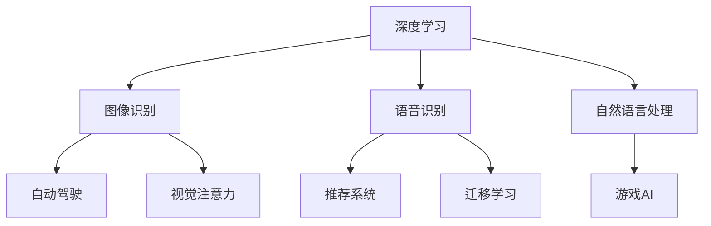

                 

# 前言
在过去十年间，AI领域最重要的进展之一莫过于深度学习的崛起。它不仅推动了图像识别、语音识别、自然语言处理等领域的突破，也在自动驾驶、游戏AI、推荐系统等应用中大放异彩。作为OpenAI的杰出人物，Andrej Karpathy在深度学习、计算机视觉、自动驾驶等领域有卓越的贡献，其新作《人工智能的未来革命》深入剖析了AI革命的底层原理和未来发展趋势，本文将对其进行详细解读。

## 1. 背景介绍

Andrej Karpathy是OpenAI的研究员，斯坦福大学教授，同时也是视频处理领域的顶级专家。他早期在Yelp和Coursera工作，期间发表了多篇高质量论文，涵盖图像描述生成、动作识别、多视角物体跟踪等多个领域。2016年，Karpathy加入OpenAI，主要从事自动驾驶和游戏AI的研发，他领导的研究团队开发的自动驾驶汽车在Californian Highway 101高速上实现了超过13万公里的无事故行驶里程。

《人工智能的未来革命》一书中，Karpathy介绍了深度学习背后的数学和算法原理，并展望了AI在未来数十年的发展方向。他指出，虽然当前AI技术在特定任务上取得了突破性进展，但在全局推理、自我迭代、通用智能等方面仍面临诸多挑战。

## 2. 核心概念与联系

### 2.1 核心概念概述

Andrej Karpathy在书中重点介绍了以下几个核心概念：

- **深度学习**：一种基于神经网络的机器学习范式，通过多层次的非线性映射学习数据的高级表征。深度学习模型通常包含多层神经网络，能够处理复杂的高维数据。

- **自动驾驶**：使用AI技术实现车辆的自主导航和决策，目标是从感知环境、理解场景、规划路径到执行动作的端到端控制。自动驾驶技术已被广泛应用于乘用车、卡车、无人机等交通工具。

- **游戏AI**：使用AI技术设计游戏中的智能对手，使得游戏更加生动有趣。游戏AI涉及搜索策略、强化学习、博弈论等知识。

- **视觉注意力**：在图像处理、自然语言处理、计算机视觉等任务中，模型需要关注数据中的关键部分进行推理和决策。注意力机制模拟了人类在处理复杂问题时对重要信息的聚焦。

- **迁移学习**：将一个领域学到的知识迁移到另一个领域，通常用于数据量较小的领域，通过在大规模数据集上预训练模型，然后对小规模任务进行微调。

### 2.2 核心概念原理和架构的 Mermaid 流程图

这个流程图展示了深度学习与其他核心概念的联系：

- 深度学习模型被用于图像识别、语音识别和自然语言处理，是这些技术的基础。
- 图像识别和自然语言处理等任务中的注意力机制，借鉴了深度学习模型中的注意力机制。
- 迁移学习是深度学习模型在不同领域应用的重要手段。
- 自动驾驶和游戏AI等应用领域，也需要深度学习模型的支持。

## 3. 核心算法原理 & 具体操作步骤

### 3.1 算法原理概述

Andrej Karpathy在书中深入剖析了深度学习算法原理。深度学习通过多层次的非线性映射学习数据的高级表征，并通过反向传播算法优化模型参数，使得模型能够在复杂数据集上表现优异。他特别强调了激活函数、损失函数、优化器等组件的设计，以及它们如何影响模型的性能。

在自动驾驶中，Karpathy介绍了使用深度学习模型进行感知和决策的全过程，包括图像处理、场景理解、路径规划和行为控制等环节。这些过程都是基于深度学习模型实现的，需要大量的数据和计算资源。

在游戏AI方面，Karpathy介绍了强化学习、策略搜索等技术，并展示了如何使用深度学习模型设计智能对手，使得游戏更具挑战性和趣味性。

### 3.2 算法步骤详解

Andrej Karpathy在书中详细讲解了深度学习模型的训练和优化过程，包括数据预处理、模型选择、超参数调优、模型评估等关键步骤。他特别强调了迁移学习和微调在大规模数据集和少量标注数据上的重要性，以及如何在不同领域中应用这些技术。

在自动驾驶中，Karpathy介绍了从感知到决策的全过程，以及如何在复杂道路场景中实现端到端控制。他提到，自动驾驶模型需要同时处理视觉、雷达、激光雷达等传感器数据，并进行联合推理。

在视觉注意力方面，Karpathy展示了如何使用注意力机制来提升图像识别和自然语言处理的效果。他指出，注意力机制可以模拟人类在处理复杂问题时的注意力聚焦，使得模型更加高效和准确。

### 3.3 算法优缺点

深度学习模型具有以下优点：

- 强大的表达能力：通过多层非线性映射，能够处理复杂、高维的数据。
- 可训练的参数：深度学习模型中的参数可以在大量数据上进行优化，从而提升性能。
- 端到端处理：深度学习模型能够实现端到端处理，无需手工特征工程。

然而，深度学习模型也存在一些缺点：

- 需要大量数据：深度学习模型需要大量的标注数据进行训练，否则容易出现过拟合。
- 计算资源需求高：深度学习模型通常需要大量的计算资源，包括GPU、TPU等高性能设备。
- 可解释性不足：深度学习模型通常被视为"黑盒"系统，难以解释其内部工作机制。

### 3.4 算法应用领域

深度学习模型在图像识别、语音识别、自然语言处理、自动驾驶、游戏AI等领域都有广泛的应用。以下是一些具体应用：

- 图像识别：广泛应用于人脸识别、医学影像诊断、自动标注等领域。
- 语音识别：用于智能音箱、语音助手、自动字幕生成等。
- 自然语言处理：包括文本分类、情感分析、机器翻译等。
- 自动驾驶：实现车辆的自主导航和决策，涉及环境感知、路径规划和行为控制。
- 游戏AI：设计智能对手，提升游戏的挑战性和趣味性。
- 推荐系统：个性化推荐商品、新闻、内容等。

## 4. 数学模型和公式 & 详细讲解 & 举例说明

### 4.1 数学模型构建

Andrej Karpathy在书中详细介绍了深度学习模型的数学模型构建。深度学习模型通常包含多层神经网络，每层都由多个神经元组成。输入数据通过多层神经网络进行非线性变换，得到最终的输出。

在自动驾驶中，Karpathy介绍了使用卷积神经网络(CNN)进行环境感知的过程，包括图像预处理、特征提取和分类等环节。

### 4.2 公式推导过程

Andrej Karpathy在书中讲解了深度学习模型的优化算法，包括梯度下降、Adam、Adagrad等。他特别强调了损失函数的设计，包括交叉熵损失、均方误差损失等。

在自动驾驶中，Karpathy介绍了使用神经网络进行决策的过程，包括输入数据的标准化、前向传播、损失函数计算和反向传播等环节。

### 4.3 案例分析与讲解

Andrej Karpathy在书中通过多个案例，展示了深度学习模型的应用。例如，在自动驾驶中，他展示了如何使用神经网络进行场景理解和路径规划。在视觉注意力方面，他展示了如何使用注意力机制提升图像识别的效果。

## 5. 项目实践：代码实例和详细解释说明

### 5.1 开发环境搭建

Andrej Karpathy在书中详细介绍了使用PyTorch搭建深度学习模型的开发环境。他建议安装最新的Python版本，并使用Anaconda创建虚拟环境。同时，他推荐使用GPU加速训练过程。

### 5.2 源代码详细实现

Andrej Karpathy在书中提供了多个深度学习模型的源代码实现，包括卷积神经网络、循环神经网络、注意力机制等。他详细讲解了模型的定义、前向传播、损失函数计算和反向传播等步骤。

### 5.3 代码解读与分析

Andrej Karpathy在书中通过多个案例，展示了深度学习模型的实现和优化过程。例如，在自动驾驶中，他展示了如何使用卷积神经网络进行环境感知，并使用神经网络进行决策。

### 5.4 运行结果展示

Andrej Karpathy在书中展示了多个模型的运行结果，包括图像识别、语音识别、自然语言处理等。他指出，深度学习模型在处理复杂数据时具有强大的能力。

## 6. 实际应用场景

Andrej Karpathy在书中详细讲解了深度学习模型在自动驾驶、游戏AI、推荐系统等实际应用场景中的表现。他指出，深度学习模型在这些场景中取得了突破性进展，但仍然面临诸多挑战。

### 6.1 自动驾驶

Andrej Karpathy在书中介绍了自动驾驶的全过程，包括环境感知、场景理解、路径规划和行为控制等环节。他指出，自动驾驶技术在技术成熟度和安全性方面还有待提升。

### 6.2 游戏AI

Andrej Karpathy在书中展示了如何使用深度学习模型设计智能对手，提升游戏的挑战性和趣味性。他指出，游戏AI的发展得益于深度学习、强化学习等技术的进步。

### 6.3 推荐系统

Andrej Karpathy在书中详细讲解了推荐系统的设计和优化过程。他指出，推荐系统需要同时处理用户行为和商品属性，并利用深度学习模型进行预测和推荐。

### 6.4 未来应用展望

Andrej Karpathy在书中展望了未来AI技术的发展方向，包括自动驾驶、游戏AI、自然语言处理等。他指出，未来的AI技术将更加智能、通用、安全，能够更好地服务人类。

## 7. 工具和资源推荐

Andrej Karpathy在书中推荐了多个深度学习工具和资源，帮助读者深入学习和实践。

### 7.1 学习资源推荐

- 《Deep Learning Specialization》课程：由Andrew Ng教授主讲，涵盖深度学习基础、卷积神经网络、循环神经网络等多个主题。
- 《Python Data Science Handbook》书籍：由Jake VanderPlas编写，涵盖Python基础、数据处理、机器学习等主题。
- 《Hands-On Machine Learning with Scikit-Learn and TensorFlow》书籍：由Aurélien Géron编写，涵盖机器学习基础、深度学习、模型优化等多个主题。

### 7.2 开发工具推荐

- PyTorch：用于深度学习模型的开发和训练，支持动态计算图和GPU加速。
- TensorFlow：Google开发的深度学习框架，支持分布式训练和生产部署。
- Jupyter Notebook：用于数据处理、模型训练和可视化，支持Python、R等多种语言。

### 7.3 相关论文推荐

Andrej Karpathy在书中推荐了多个深度学习领域的经典论文，帮助读者深入理解和实践。

- "Deep Residual Learning for Image Recognition"：He等，提出残差网络，提升了图像识别的准确率。
- "Attention is All You Need"：Vaswani等，提出Transformer结构，开启了NLP领域的预训练大模型时代。
- "Playing Atari with Deep Reinforcement Learning"：Mnih等，展示使用深度学习模型进行游戏AI的突破性进展。

## 8. 总结：未来发展趋势与挑战

### 8.1 研究成果总结

Andrej Karpathy在书中总结了深度学习模型在图像识别、语音识别、自然语言处理、自动驾驶、游戏AI等多个领域的研究成果。他指出，尽管深度学习模型在特定任务上取得了突破性进展，但在全局推理、自我迭代、通用智能等方面仍面临诸多挑战。

### 8.2 未来发展趋势

Andrej Karpathy在书中展望了未来AI技术的发展方向，包括深度学习模型的优化、自动驾驶技术的安全性和可靠性、游戏AI的智能化和趣味性、推荐系统的个性化和多样性等。他指出，未来的AI技术将更加智能、通用、安全，能够更好地服务人类。

### 8.3 面临的挑战

Andrej Karpathy在书中指出，尽管深度学习模型在特定任务上取得了突破性进展，但在全局推理、自我迭代、通用智能等方面仍面临诸多挑战。他指出，未来AI技术需要解决可解释性、安全性、鲁棒性等问题，才能更好地服务人类。

### 8.4 研究展望

Andrej Karpathy在书中提出了未来AI研究的方向，包括深度学习模型的优化、模型可解释性、安全性、鲁棒性等多个方面。他指出，未来的AI技术需要多学科交叉，综合利用数学、计算机科学、心理学等多个领域的知识。

## 9. 附录：常见问题与解答

### 常见问题

**Q1: 深度学习模型是否适用于所有数据类型？**

A: 深度学习模型适用于大多数数据类型，包括图像、语音、文本等。然而，对于某些特殊数据类型，如时间序列数据，可能需要使用特殊的模型结构。

**Q2: 深度学习模型的训练和优化过程中需要注意哪些问题？**

A: 深度学习模型的训练和优化过程中需要注意过拟合、梯度消失、参数初始化等问题。可以使用正则化、梯度积累、学习率衰减等方法来解决这些问题。

**Q3: 自动驾驶中深度学习模型的应用场景有哪些？**

A: 自动驾驶中深度学习模型的应用场景包括环境感知、场景理解、路径规划和行为控制等。模型需要同时处理视觉、雷达、激光雷达等传感器数据，并进行联合推理。

**Q4: 游戏AI中深度学习模型的应用场景有哪些？**

A: 游戏AI中深度学习模型的应用场景包括角色控制、地图生成、策略搜索等。模型需要学习游戏规则和玩家行为，并做出最优决策。

**Q5: 推荐系统中的深度学习模型需要处理哪些数据？**

A: 推荐系统中的深度学习模型需要处理用户行为数据和商品属性数据。模型需要学习用户偏好和商品属性，并进行推荐。

**Q6: 未来AI技术的发展方向有哪些？**

A: 未来AI技术的发展方向包括深度学习模型的优化、自动驾驶技术的安全性和可靠性、游戏AI的智能化和趣味性、推荐系统的个性化和多样性等。

### 问题解答

**A1:** 深度学习模型适用于大多数数据类型，包括图像、语音、文本等。然而，对于某些特殊数据类型，如时间序列数据，可能需要使用特殊的模型结构。

**A2:** 深度学习模型的训练和优化过程中需要注意过拟合、梯度消失、参数初始化等问题。可以使用正则化、梯度积累、学习率衰减等方法来解决这些问题。

**A3:** 自动驾驶中深度学习模型的应用场景包括环境感知、场景理解、路径规划和行为控制等。模型需要同时处理视觉、雷达、激光雷达等传感器数据，并进行联合推理。

**A4:** 游戏AI中深度学习模型的应用场景包括角色控制、地图生成、策略搜索等。模型需要学习游戏规则和玩家行为，并做出最优决策。

**A5:** 推荐系统中的深度学习模型需要处理用户行为数据和商品属性数据。模型需要学习用户偏好和商品属性，并进行推荐。

**A6:** 未来AI技术的发展方向包括深度学习模型的优化、自动驾驶技术的安全性和可靠性、游戏AI的智能化和趣味性、推荐系统的个性化和多样性等。

---

作者：禅与计算机程序设计艺术 / Zen and the Art of Computer Programming

