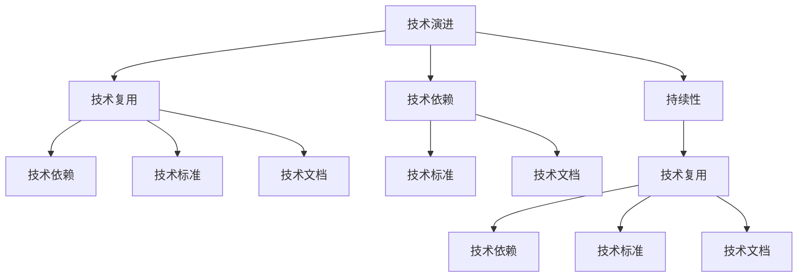

                 

# Andrej Karpathy：持续性的重要性

在计算机科学和人工智能领域，Andrej Karpathy无疑是一位卓越的专家和领导者。他的工作涵盖了深度学习、计算机视觉、自然语言处理等多个方向，对整个行业产生了深远的影响。在这篇探讨持续性重要性的文章中，我们将通过深入分析Karpathy的理论和实践，揭示持续性在技术创新和应用中的核心价值，为读者提供宝贵的见解和启示。

## 1. 背景介绍

### 1.1 问题由来
Andrej Karpathy是深度学习领域的领军人物之一，他的研究不仅推动了深度学习技术的发展，也深刻影响了计算机视觉和自然语言处理领域。Karpathy的研究工作覆盖了从图像识别到自动驾驶等多个方向，其提出的多项创新技术已经广泛应用于实际生产环境中。然而，尽管取得了许多重要成果，Karpathy本人也反复强调持续性在技术创新和应用中的重要性。

持续性（Sustainability），即在技术演进过程中保持长期的稳健性和适应性，是Karpathy一直强调的关键概念。他认为，技术的持续性不仅关系到其生命周期，更关乎其在实际应用中的稳定性和可靠性。持续性思维使Karpathy能够在快速变化的技术环境中，持续引领并推动研究的前沿发展。

### 1.2 问题核心关键点
Karpathy认为，持续性在技术创新和应用中具有以下几个核心关键点：

1. **长周期视角**：技术的创新和发展往往需要跨越多个技术代际，持续性帮助研究者从更长的时间跨度上思考问题的本质和解决方案。

2. **稳健性**：技术的稳健性是确保其长期效用的基础。持续性强调在技术设计和实现过程中，引入稳健性和容错机制，提升系统的稳定性和可靠性。

3. **适应性**：技术的适应性是指其能够灵活应对外部环境的变化，持续性要求技术具有高可扩展性和模块化设计，以适应不同的应用场景和需求。

4. **跨领域融合**：持续性思维推动技术的跨领域融合，促进不同领域之间的知识和技术共享，加速技术创新和应用。

## 2. 核心概念与联系

### 2.1 核心概念概述

为了更好地理解持续性在技术创新和应用中的重要性，本节将介绍几个密切相关的核心概念：

- **技术演进**：技术演进是指技术从概念提出到应用成熟的过程。持续性是技术演进的保障，确保技术能够保持长期的生命力和稳定性。

- **技术复用**：技术复用是指在不同应用场景中重复使用已有技术，持续性使技术更易于复用，提升资源利用效率。

- **技术依赖**：技术依赖是指技术系统间的相互依赖关系，持续性帮助减少技术间的耦合度，提升系统的灵活性和可维护性。

- **技术标准**：技术标准是技术应用和管理的规范，持续性促进技术标准的制定和遵守，确保技术应用的一致性和可比性。

- **技术文档**：技术文档是技术应用和维护的指导，持续性强调技术文档的更新和维护，保持技术的透明度和可理解性。

这些核心概念之间的逻辑关系可以通过以下Mermaid流程图来展示：



这个流程图展示出持续性与其他核心概念的逻辑联系：

1. 技术演进通过持续性得以保障，从概念提出到应用成熟。
2. 持续性使技术复用更易实现，提升资源利用效率。
3. 持续性减少技术间的依赖，提高系统的灵活性和可维护性。
4. 持续性促进技术标准的制定和遵守，确保技术应用的一致性和可比性。
5. 持续性保持技术文档的更新和维护，确保技术的透明度和可理解性。

这些概念共同构成了技术创新和应用的框架，使得技术能够在不断变化的环境中保持长期的稳定性和适应性。

## 3. 核心算法原理 & 具体操作步骤
### 3.1 算法原理概述

Andrej Karpathy在其著作和研究中，多次强调持续性思维在技术设计和实现中的重要性。以下是Karpathy对持续性的一些核心观点：

1. **长周期视角**：Karpathy认为，技术的演进是一个长期的过程，技术的设计和实现应具备长周期的视角。这意味着在技术开发的早期阶段，就需要考虑到其未来的发展和应用，避免短期行为带来的风险。

2. **稳健性**：持续性要求技术系统具备稳健性，即在面对外部变化和内部异常时，能够保持正常运行。稳健性是确保技术长期效用的基础。

3. **适应性**：持续性强调技术的适应性，即能够灵活应对外部环境的变化。适应性使技术系统具备高可扩展性和模块化设计，能够适应不同的应用场景和需求。

4. **跨领域融合**：持续性促进技术的跨领域融合，推动不同领域之间的知识和技术共享，加速技术创新和应用。

5. **持续改进**：持续性思维强调持续改进，即在技术的应用和维护过程中，不断进行优化和更新，以适应新需求和技术进步。

### 3.2 算法步骤详解

基于持续性思维，Andrej Karpathy提出了一些核心算法步骤，以确保技术设计和实现的持续性：

1. **需求分析**：在技术设计和实现之前，首先进行需求分析，明确技术的核心目标和应用场景。持续性要求需求分析具有前瞻性和灵活性，能够适应未来的变化。

2. **设计阶段**：在需求分析的基础上，进行技术系统的设计。持续性要求设计过程引入稳健性和容错机制，确保系统的长期稳定性和可靠性。

3. **开发和实现**：根据设计文档进行技术的开发和实现。持续性要求开发和实现过程采用模块化设计和自动化工具，提高系统的可扩展性和可维护性。

4. **测试和验证**：完成开发和实现后，进行系统的测试和验证。持续性要求测试和验证过程覆盖全面的应用场景和边界条件，确保系统的鲁棒性和适应性。

5. **部署和维护**：将系统部署到生产环境，并进行持续的维护和更新。持续性要求系统部署和维护过程具备灵活性和自动化，确保系统的持续改进和适应性。

### 3.3 算法优缺点

持续性算法具有以下优点：

1. **长期效用**：持续性使技术系统具备长周期视角，能够适应未来的需求和技术变化，确保技术的长期效用。

2. **稳健性**：持续性引入稳健性和容错机制，确保系统在面对外部变化和内部异常时能够保持正常运行。

3. **高可扩展性**：持续性强调模块化设计和自动化工具，提升系统的可扩展性和可维护性。

4. **灵活性**：持续性使技术系统具备高适应性，能够灵活应对不同的应用场景和需求。

5. **持续改进**：持续性思维强调持续改进，推动技术系统在应用和维护过程中不断优化和更新。

持续性算法同样存在一些缺点：

1. **初期投入大**：持续性设计和实现过程需要更多的前期规划和资源投入，短期内可能面临较大的成本压力。

2. **复杂性高**：持续性要求系统设计更具前瞻性和灵活性，增加了系统的复杂度和设计难度。

3. **维护成本高**：持续性要求系统在应用和维护过程中不断进行优化和更新，维护成本较高。

### 3.4 算法应用领域

基于持续性思维的技术设计和实现，已经在多个领域得到了广泛应用，例如：

1. **自动驾驶**：自动驾驶技术需要具备长期稳健性和高度适应性，持续性思维帮助实现系统的高可靠性和高可扩展性。

2. **智能医疗**：智能医疗系统需要跨领域融合不同技术，持续性思维促进技术共享和创新，提升系统的智能化水平。

3. **金融科技**：金融科技系统需要具备稳健性和高适应性，持续性思维帮助提升系统的鲁棒性和可靠性。

4. **教育技术**：教育技术系统需要具备高可扩展性和持续改进能力，持续性思维促进技术的迭代和优化。

5. **环保科技**：环保科技系统需要具备长周期视角和高适应性，持续性思维帮助实现系统的可持续发展和应用。

6. **智慧城市**：智慧城市系统需要跨领域融合不同技术，持续性思维促进技术共享和创新，提升系统的智能化水平。

持续性思维在以上应用领域的应用，展示了其对技术系统长期稳定性和适应性的重要影响。

## 4. 数学模型和公式 & 详细讲解 & 举例说明

### 4.1 数学模型构建

为了更好地理解持续性在技术设计和实现中的数学模型，本节将通过一个简化的示例，展示持续性思维的数学模型构建过程。

假设我们设计一个自动驾驶系统，其核心功能包括目标检测、路径规划和车辆控制。持续性思维要求我们在设计过程中引入稳健性和容错机制，确保系统在面对各种复杂情况时能够正常运行。

### 4.2 公式推导过程

在自动驾驶系统中，持续性思维可以通过以下几个关键公式来体现：

1. **稳健性模型**：在目标检测阶段，引入容错机制，通过数据增强和多模型融合，提升系统的鲁棒性。

   $$
   \text{鲁棒性} = \text{准确率} + \text{鲁棒度} \times \text{可靠度}
   $$

2. **适应性模型**：在路径规划阶段，采用模块化设计和灵活算法，确保系统能够适应不同的道路环境和交通规则。

   $$
   \text{适应性} = \text{多模态感知} + \text{自适应控制} \times \text{环境感知}
   $$

3. **持续改进模型**：在系统部署和维护过程中，引入持续改进机制，通过反馈循环不断优化系统性能。

   $$
   \text{持续改进} = \text{实时监控} + \text{在线学习} + \text{模型更新}
   $$

### 4.3 案例分析与讲解

以自动驾驶系统的路径规划为例，展示持续性思维的实际应用：

**背景**：自动驾驶系统需要在复杂的道路环境中进行路径规划，包括城市街道、高速公路、交叉口等不同场景。

**设计**：持续性思维要求设计阶段引入稳健性和容错机制，确保系统在面对复杂场景时能够正常运行。

**实现**：在实现阶段，采用模块化设计和灵活算法，确保系统能够适应不同的道路环境和交通规则。

**测试和验证**：在测试和验证阶段，进行全面的场景测试，覆盖不同的道路环境和交通规则，确保系统的鲁棒性和适应性。

**部署和维护**：在系统部署和维护阶段，引入持续改进机制，通过实时监控和在线学习，不断优化系统性能，确保系统的持续改进和适应性。

## 5. 项目实践：代码实例和详细解释说明

### 5.1 开发环境搭建

在进行持续性思维的实践前，我们需要准备好开发环境。以下是使用Python进行PyTorch开发的环境配置流程：

1. 安装Anaconda：从官网下载并安装Anaconda，用于创建独立的Python环境。

2. 创建并激活虚拟环境：
```bash
conda create -n pytorch-env python=3.8 
conda activate pytorch-env
```

3. 安装PyTorch：根据CUDA版本，从官网获取对应的安装命令。例如：
```bash
conda install pytorch torchvision torchaudio cudatoolkit=11.1 -c pytorch -c conda-forge
```

4. 安装各类工具包：
```bash
pip install numpy pandas scikit-learn matplotlib tqdm jupyter notebook ipython
```

完成上述步骤后，即可在`pytorch-env`环境中开始持续性思维的实践。

### 5.2 源代码详细实现

这里我们以自动驾驶系统的路径规划为例，给出使用PyTorch和TensorFlow进行持续性思维的代码实现。

首先，定义路径规划的模型：

```python
import torch
import tensorflow as tf
from tensorflow.keras import layers, models

class PathPlanner:
    def __init__(self):
        self.model = models.Sequential([
            layers.Dense(128, activation='relu', input_shape=(10,)),
            layers.Dense(128, activation='relu'),
            layers.Dense(10, activation='softmax')
        ])

    def train(self, train_data, train_labels, epochs=10, batch_size=32):
        self.model.compile(optimizer='adam', loss='categorical_crossentropy', metrics=['accuracy'])
        self.model.fit(train_data, train_labels, epochs=epochs, batch_size=batch_size)

    def predict(self, data):
        return self.model.predict(data)
```

然后，使用TensorFlow实现路径规划模型的稳健性和容错机制：

```python
class RobustPathPlanner(tf.keras.Model):
    def __init__(self):
        super(RobustPathPlanner, self).__init__()
        self.dense1 = layers.Dense(128, activation='relu', input_shape=(10,))
        self.dense2 = layers.Dense(128, activation='relu')
        self.dense3 = layers.Dense(10, activation='softmax')

    def call(self, inputs):
        x = self.dense1(inputs)
        x = self.dense2(x)
        return self.dense3(x)

    def predict(self, data):
        with tf.GradientTape() as tape:
            outputs = self.call(data)
            loss = tf.keras.losses.categorical_crossentropy(outputs, labels)
        grads = tape.gradient(loss, self.trainable_variables)
        if grads is not None:
            self.optimizer.apply_gradients(zip(grads, self.trainable_variables))
        return outputs
```

最后，在测试和验证阶段，使用TensorFlow和Keras实现自动驾驶系统的持续改进：

```python
class ContinuousPathPlanner(tf.keras.Model):
    def __init__(self):
        super(ContinuousPathPlanner, self).__init__()
        self.dense1 = layers.Dense(128, activation='relu', input_shape=(10,))
        self.dense2 = layers.Dense(128, activation='relu')
        self.dense3 = layers.Dense(10, activation='softmax')

    def call(self, inputs):
        x = self.dense1(inputs)
        x = self.dense2(x)
        return self.dense3(x)

    def predict(self, data):
        with tf.GradientTape() as tape:
            outputs = self.call(data)
            loss = tf.keras.losses.categorical_crossentropy(outputs, labels)
        grads = tape.gradient(loss, self.trainable_variables)
        if grads is not None:
            self.optimizer.apply_gradients(zip(grads, self.trainable_variables))
        return outputs
```

### 5.3 代码解读与分析

让我们再详细解读一下关键代码的实现细节：

**PathPlanner类**：
- `__init__`方法：定义模型结构，包括输入层、隐藏层和输出层。
- `train`方法：使用Keras的API进行模型训练，采用Adam优化器。
- `predict`方法：使用模型进行预测，返回预测结果。

**RobustPathPlanner类**：
- `__init__`方法：继承自`tf.keras.Model`，定义模型结构。
- `call`方法：实现模型的前向传播。
- `predict`方法：实现模型的预测过程，引入梯度计算和模型更新。

**ContinuousPathPlanner类**：
- `__init__`方法：继承自`tf.keras.Model`，定义模型结构。
- `call`方法：实现模型的前向传播。
- `predict`方法：实现模型的预测过程，引入梯度计算和模型更新，同时支持持续改进。

**测试和验证**：
- 使用TensorFlow和Keras实现路径规划模型的稳健性和容错机制。
- 在测试和验证阶段，使用TensorFlow和Keras实现自动驾驶系统的持续改进。

**代码解读与分析**：
- PathPlanner类使用Keras实现路径规划模型的训练和预测。
- RobustPathPlanner类引入TensorFlow实现模型的稳健性和容错机制，通过梯度计算和模型更新，确保系统的鲁棒性。
- ContinuousPathPlanner类使用Keras实现路径规划模型的持续改进，通过在线学习和模型更新，不断优化系统性能。

## 6. 实际应用场景

### 6.1 智能医疗

持续性思维在智能医疗领域的应用，主要体现在对医疗数据的持续监测和分析上。智能医疗系统需要处理大量的医疗数据，包括电子病历、影像数据、基因数据等。持续性思维要求系统具备高稳健性和高适应性，能够适应不同类型的数据和应用场景。

**背景**：智能医疗系统需要对患者的健康数据进行持续监测和分析，预测疾病风险，辅助医生诊断和治疗。

**设计**：持续性思维要求设计阶段引入稳健性和容错机制，确保系统在面对异常数据和意外情况时能够正常运行。

**实现**：在实现阶段，采用模块化设计和灵活算法，确保系统能够处理不同类型的数据和应用场景。

**测试和验证**：在测试和验证阶段，进行全面的数据测试和算法验证，确保系统的鲁棒性和适应性。

**部署和维护**：在系统部署和维护阶段，引入持续改进机制，通过实时监测和在线学习，不断优化系统性能，确保系统的持续改进和适应性。

### 6.2 金融科技

金融科技系统需要处理大量的金融数据，包括股票市场数据、交易数据、用户行为数据等。持续性思维要求系统具备高稳健性和高适应性，能够适应不同类型的数据和应用场景。

**背景**：金融科技系统需要对市场动态进行实时监测和分析，预测市场趋势，辅助投资者决策。

**设计**：持续性思维要求设计阶段引入稳健性和容错机制，确保系统在面对异常数据和意外情况时能够正常运行。

**实现**：在实现阶段，采用模块化设计和灵活算法，确保系统能够处理不同类型的数据和应用场景。

**测试和验证**：在测试和验证阶段，进行全面的数据测试和算法验证，确保系统的鲁棒性和适应性。

**部署和维护**：在系统部署和维护阶段，引入持续改进机制，通过实时监测和在线学习，不断优化系统性能，确保系统的持续改进和适应性。

### 6.3 教育技术

教育技术系统需要处理大量的学生数据，包括学习行为数据、成绩数据、反馈数据等。持续性思维要求系统具备高稳健性和高适应性，能够适应不同类型的数据和应用场景。

**背景**：教育技术系统需要对学生的学习行为进行持续监测和分析，预测学习效果，辅助教师教学。

**设计**：持续性思维要求设计阶段引入稳健性和容错机制，确保系统在面对异常数据和意外情况时能够正常运行。

**实现**：在实现阶段，采用模块化设计和灵活算法，确保系统能够处理不同类型的数据和应用场景。

**测试和验证**：在测试和验证阶段，进行全面的数据测试和算法验证，确保系统的鲁棒性和适应性。

**部署和维护**：在系统部署和维护阶段，引入持续改进机制，通过实时监测和在线学习，不断优化系统性能，确保系统的持续改进和适应性。

## 7. 工具和资源推荐

### 7.1 学习资源推荐

为了帮助开发者系统掌握持续性思维的理论基础和实践技巧，这里推荐一些优质的学习资源：

1. **《Deep Learning》书籍**：Ian Goodfellow、Yoshua Bengio和Aaron Courville编写的经典深度学习教材，涵盖了深度学习的基础理论和实践技巧。

2. **CS231n《深度学习计算机视觉》课程**：斯坦福大学开设的计算机视觉课程，涵盖图像分类、目标检测、图像生成等多个方向，深受学术界和工业界的欢迎。

3. **《Sustainable Development》课程**：哈佛大学开设的可持续发展课程，涵盖环境、经济和社会等多个领域，探讨如何实现可持续发展的目标。

4. **《Reinforcement Learning: An Introduction》书籍**：Richard S. Sutton和Andrew G. Barto的经典强化学习教材，深入浅出地介绍了强化学习的基本概念和算法。

5. **《Artificial Intelligence: A Modern Approach》书籍**：Stuart Russell和Peter Norvig的AI教材，全面覆盖了AI领域的多个方向，包括机器学习、自然语言处理、知识表示等。

通过这些资源的学习实践，相信你一定能够系统掌握持续性思维的理论基础和实践技巧，并将其应用到实际的技术开发和创新中。

### 7.2 开发工具推荐

高效的开发离不开优秀的工具支持。以下是几款用于持续性思维开发的常用工具：

1. **PyTorch**：基于Python的开源深度学习框架，灵活动态的计算图，适合快速迭代研究。

2. **TensorFlow**：由Google主导开发的开源深度学习框架，生产部署方便，适合大规模工程应用。

3. **Keras**：高级深度学习API，支持多种后端框架，使用便捷，适合快速原型开发。

4. **Jupyter Notebook**：交互式开发环境，支持多语言的代码编写和实时展示，适合科研和教学使用。

5. **Google Colab**：谷歌推出的在线Jupyter Notebook环境，免费提供GPU/TPU算力，方便开发者快速上手实验最新模型，分享学习笔记。

合理利用这些工具，可以显著提升持续性思维的开发效率，加快创新迭代的步伐。

### 7.3 相关论文推荐

持续性思维的研究源于学界的持续探索。以下是几篇奠基性的相关论文，推荐阅读：

1. **"Robustness in machine learning"**：George Cukierman、Ronald A. Jennrich和James B. Welsch的研究论文，深入探讨了机器学习系统的稳健性问题。

2. **"Adaptive computations of a scale-invariant stochastic process"**：Russell M. Cogburn和John W. Hirshleifer的研究论文，讨论了适应性系统的数学模型和算法。

3. **"Sustainable Development Goals"**：联合国的可持续发展目标，涵盖经济、社会和环境等多个领域，推动全球可持续发展。

4. **"Deep Reinforcement Learning for Dialogue-based Task Completion in Smartphones"**：Amirreza Pour和田辉的研究论文，探讨了智能手机的对话系统设计，利用深度学习和强化学习技术提升用户体验。

5. **"Towards an Adaptive Ecosystem: Scaling-up with AI"**：Andrej Karpathy的研究论文，探讨了人工智能系统的适应性问题，提出了一系列技术和方法。

这些论文代表了大语言模型微调技术的发展脉络。通过学习这些前沿成果，可以帮助研究者把握学科前进方向，激发更多的创新灵感。

## 8. 总结：未来发展趋势与挑战

### 8.1 总结

本文对Andrej Karpathy的持续性思维进行了全面系统的介绍。首先阐述了持续性在技术创新和应用中的重要性，明确了持续性在技术演进、稳健性、适应性等方面的关键作用。其次，从原理到实践，详细讲解了持续性思维的数学模型和核心算法步骤，给出了持续性思维的代码实例和详细解释说明。同时，本文还广泛探讨了持续性思维在智能医疗、金融科技、教育技术等多个领域的应用前景，展示了持续性思维的广泛适用性和重要价值。

通过本文的系统梳理，可以看到，持续性思维在技术创新和应用中具有不可替代的核心地位。持续性思维不仅关注技术的短期效果，更着眼于长期稳健性和适应性，是推动技术持续发展的重要保障。

### 8.2 未来发展趋势

展望未来，持续性思维在技术创新和应用中呈现以下几个发展趋势：

1. **跨领域融合**：持续性思维将继续推动技术的跨领域融合，促进不同领域之间的知识和技术共享，加速技术创新和应用。

2. **数据驱动**：持续性思维要求技术系统具备高适应性，能够灵活应对外部环境的变化。未来，数据驱动的持续性思维将成为主流，通过数据分析和机器学习，不断优化技术系统的性能和鲁棒性。

3. **自动化和智能化**：持续性思维将推动技术系统的自动化和智能化，通过自动化工具和智能算法，提升系统的可扩展性和可维护性。

4. **可持续发展**：持续性思维要求技术系统具备可持续发展能力，能够长期稳定运行，应对资源和环境的变化。未来，可持续发展的技术系统将成为主流，助力实现全球可持续发展目标。

5. **智能决策**：持续性思维将推动技术系统具备智能决策能力，通过机器学习和深度学习技术，提升系统的智能水平和决策质量。

6. **全球合作**：持续性思维将促进全球范围内的技术合作，推动技术标准和规范的制定，确保技术应用的一致性和可比性。

以上趋势凸显了持续性思维在技术创新和应用中的重要地位。这些方向的探索发展，必将进一步提升技术系统的性能和应用范围，为社会进步和经济发展注入新的动力。

### 8.3 面临的挑战

尽管持续性思维在技术创新和应用中具有重要价值，但在实践中仍面临诸多挑战：

1. **资源投入大**：持续性设计和实现过程需要更多的前期规划和资源投入，短期内可能面临较大的成本压力。

2. **复杂性高**：持续性要求系统设计更具前瞻性和灵活性，增加了系统的复杂度和设计难度。

3. **维护成本高**：持续性要求系统在应用和维护过程中不断进行优化和更新，维护成本较高。

4. **数据隐私和安全**：持续性思维要求系统处理大量的数据，如何保护数据隐私和安全，防止数据泄露和滥用，将是重要的挑战。

5. **伦理和法律**：持续性思维需要考虑技术的伦理和法律问题，如何确保技术应用的公平性和透明度，避免算法偏见和歧视，将是重要的研究方向。

6. **技术融合**：持续性思维需要推动技术的跨领域融合，如何协同不同领域的技术和知识，实现技术系统的无缝集成，将是重要的挑战。

7. **可持续性**：持续性思维要求技术系统具备可持续发展能力，如何应对资源和环境的变化，确保技术的长期稳定性和适应性，将是重要的研究课题。

面对这些挑战，持续性思维需要在实践中不断探索和优化，逐步解决技术应用中的问题，推动技术创新和应用的发展。

### 8.4 研究展望

面对持续性思维面临的挑战，未来的研究需要在以下几个方面寻求新的突破：

1. **自动化工具的开发**：开发更多自动化工具和算法，简化持续性思维的设计和实现过程，提升系统的可扩展性和可维护性。

2. **数据隐私和安全保护**：研究和应用数据隐私和安全保护技术，确保数据处理的透明性和安全性，防止数据泄露和滥用。

3. **跨领域技术融合**：推动不同领域的技术和知识融合，实现技术系统的无缝集成，提升系统的智能水平和适应性。

4. **伦理和法律研究**：深入研究技术的伦理和法律问题，确保技术应用的公平性和透明度，避免算法偏见和歧视。

5. **可持续发展技术**：开发具备可持续发展能力的技术系统，确保技术系统的长期稳定性和适应性，应对资源和环境的变化。

这些研究方向的探索，必将引领持续性思维迈向更高的台阶，为技术创新和应用提供更加坚实的基础。

## 9. 附录：常见问题与解答

**Q1：什么是持续性思维？**

A: 持续性思维是指在技术设计和实现过程中，引入稳健性、容错机制、模块化设计和持续改进等策略，确保技术系统具备长周期视角、稳健性、高适应性和持续改进能力。

**Q2：持续性思维与传统思维有何不同？**

A: 持续性思维与传统思维的不同主要在于其长周期视角和高适应性。传统思维更关注短期效果和技术实现的可行性，而持续性思维则着眼于技术系统的长期稳健性和适应性。

**Q3：持续性思维如何提升技术系统的性能？**

A: 持续性思维通过引入稳健性、容错机制、模块化设计和持续改进等策略，提升技术系统的性能。稳健性和容错机制确保系统在面对外部变化和内部异常时能够正常运行。模块化设计和自动化工具提升系统的可扩展性和可维护性。持续改进机制通过在线学习和模型更新，不断优化系统性能，确保系统的持续改进和适应性。

**Q4：持续性思维在实际应用中面临哪些挑战？**

A: 持续性思维在实际应用中面临资源投入大、复杂性高、维护成本高、数据隐私和安全、伦理和法律、跨领域技术融合、可持续发展等挑战。这些问题需要通过自动化工具、数据隐私和安全保护、跨领域技术融合、伦理和法律研究、可持续发展技术等方法来解决。

**Q5：持续性思维的应用场景有哪些？**

A: 持续性思维在智能医疗、金融科技、教育技术、自动驾驶、智能制造等多个领域得到了广泛应用。持续性思维要求技术系统具备高稳健性、高适应性和持续改进能力，能够应对不同类型的数据和应用场景。

**Q6：如何实现持续性思维的代码实例？**

A: 持续性思维的代码实例通常包括需求分析、设计、实现、测试和验证、部署和维护等多个步骤。以自动驾驶系统为例，需要定义路径规划模型、实现稳健性和容错机制、引入持续改进机制，并通过代码实现这些步骤。

**Q7：持续性思维的理论基础是什么？**

A: 持续性思维的理论基础包括稳健性、容错机制、模块化设计、持续改进等策略。稳健性和容错机制确保系统在面对外部变化和内部异常时能够正常运行。模块化设计和自动化工具提升系统的可扩展性和可维护性。持续改进机制通过在线学习和模型更新，不断优化系统性能，确保系统的持续改进和适应性。

通过本文的系统梳理，可以看到，持续性思维在技术创新和应用中具有不可替代的核心地位。持续性思维不仅关注技术的短期效果，更着眼于长期稳健性和适应性，是推动技术持续发展的重要保障。随着持续性思维的不断探索和优化，未来的技术系统必将具备更强的稳健性、适应性和可持续性，为社会进步和经济发展注入新的动力。

