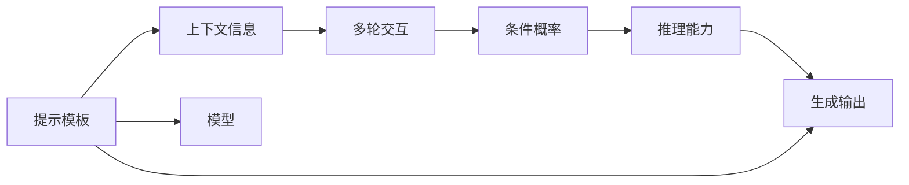

                 

# Auto-GPT Prompt 设计

## 1. 背景介绍

### 1.1 问题由来

随着人工智能技术的快速发展，Auto-GPT（自动生成提示模板）在自然语言处理（NLP）领域的应用变得越来越广泛。提示模板作为一种中间形式，能够有效提升语言模型的性能和应用范围，尤其是在任务转换和数据稀缺的情况下。然而，设计一个高效的Auto-GPT模板并非易事，其复杂性远超过传统的微调和超参数调整。

### 1.2 问题核心关键点

Auto-GPT的设计核心在于如何最大化利用预训练模型的语言理解能力，同时引入足够的上下文信息，引导模型生成准确、有意义的输出。通常，高质量的提示模板可以显著提升模型的性能，而糟糕的模板则可能导致生成结果混乱、语义不清。

设计Auto-GPT需要考虑以下几个关键点：
- 如何设计有效的提示模板，使其能够简洁地传达任务要求。
- 如何引入足够的上下文信息，帮助模型理解问题的复杂性。
- 如何处理多轮交互，引导模型逐步推导出合理的结论。
- 如何应对不同类型的NLP任务，如分类、生成、推理等。
- 如何应对不同规模的输入数据，尤其是对于长文本的输入。

### 1.3 问题研究意义

Auto-GPT的设计不仅能够提升NLP任务的性能，还能够显著降低开发成本，加速模型部署，提高用户满意度。在实际应用中，提示模板需要根据具体任务进行定制，因此对提示模板的深入研究具有重要意义：

1. **性能提升**：通过精心的提示设计，可以显著提高模型在不同任务上的准确性和鲁棒性。
2. **成本降低**：通过自动化提示模板的设计，可以大幅减少对人类专家的依赖，降低开发成本。
3. **应用灵活**：提示模板可以灵活调整，以适应不同的应用场景和需求。
4. **用户体验**：高质量的提示模板能够提升用户与模型的交互体验，增加用户黏性。

## 2. 核心概念与联系

### 2.1 核心概念概述

以下是Auto-GPT设计中涉及的几个核心概念：

- **提示模板(Prompt Template)**：用于指导语言模型执行特定任务的文本格式，通常包括任务描述、输入数据和输出格式等。
- **上下文信息(Contextual Information)**：提供有关任务或输入的附加信息，帮助模型更好地理解输入数据。
- **多轮交互(Multi-Turn Dialogue)**：指模型在多次对话中逐步推导结论，能够处理更为复杂的问题。
- **条件概率(Conditional Probability)**：基于给定的输入条件，模型生成输出概率的条件概率分布。
- **推理能力(Reasoning Ability)**：模型基于已有知识和上下文信息，推理出合理结论的能力。

### 2.2 核心概念原理和架构的 Mermaid 流程图



上述图表展示了Auto-GPT设计的核心流程。首先，提示模板和上下文信息被输入到模型中，模型基于这些信息生成条件概率分布。接着，模型利用其推理能力，逐步推导出输出结果。

### 2.3 核心概念之间的联系

各核心概念之间的联系可以从以下几个方面理解：

- **提示模板与上下文信息**：提示模板通常需要包含足够的上下文信息，以帮助模型理解任务要求。
- **上下文信息与多轮交互**：在多轮交互过程中，上下文信息被不断更新和扩展，帮助模型逐步推导出最终结果。
- **条件概率与推理能力**：模型的推理能力是基于条件概率进行计算和推理的，条件概率为推理提供基础。
- **推理能力与生成输出**：模型的推理能力最终用于生成合理的输出结果。

## 3. 核心算法原理 & 具体操作步骤

### 3.1 算法原理概述

Auto-GPT设计的核心算法原理主要基于条件概率的计算和推理。其核心步骤包括：

1. **提示模板设计**：设计简洁明了、包含必要上下文的提示模板。
2. **模型输入**：将提示模板和上下文信息输入到预训练模型中。
3. **条件概率计算**：计算基于输入条件和上下文信息的条件概率分布。
4. **推理能力应用**：利用模型的推理能力，逐步推导出最终结果。
5. **输出生成**：根据推理结果，生成最终的输出结果。

### 3.2 算法步骤详解

#### 步骤1: 提示模板设计

提示模板的设计需要考虑以下几个因素：

- **简洁性**：提示模板需要简洁明了，避免冗长和复杂的描述，以便模型快速理解任务要求。
- **上下文丰富性**：提示模板应包含足够的上下文信息，如任务目标、输入格式和输出格式等。
- **灵活性**：提示模板需要具备一定的灵活性，以应对不同类型的NLP任务。

例如，对于文本分类任务，一个简单的提示模板可以是：

```
请将以下文本分为正面和负面两类，并给出分类理由。
```

#### 步骤2: 模型输入

模型输入包括提示模板、上下文信息和输入数据。这些信息被共同输入到预训练模型中，模型基于这些信息计算条件概率分布。

#### 步骤3: 条件概率计算

条件概率的计算基于贝叶斯公式，公式如下：

$$
P(y|x, c) = \frac{P(y|x)P(c|x)}{P(c)}
$$

其中，$x$ 表示输入数据，$c$ 表示上下文信息，$y$ 表示输出结果。模型的推理过程就是不断更新条件概率，逐步逼近最大概率的输出结果。

#### 步骤4: 推理能力应用

模型的推理能力基于条件概率进行计算和推理。在多轮交互过程中，模型会逐步更新条件概率分布，并利用推理能力推导出最终结果。

#### 步骤5: 输出生成

模型基于推理结果，生成最终的输出结果。输出结果可以是文本、分类标签、序列等，具体取决于任务类型。

### 3.3 算法优缺点

#### 优点

1. **灵活性高**：提示模板的设计灵活，可以根据不同的任务进行调整，适用于多种NLP任务。
2. **成本低**：相比于传统微调和超参数调整，提示模板的设计成本较低，开发周期短。
3. **可扩展性强**：提示模板可以根据新的任务需求进行快速扩展，适用于多样化的应用场景。

#### 缺点

1. **设计难度大**：提示模板的设计需要一定的经验和技巧，设计不当可能导致模型输出结果不准确。
2. **依赖上下文**：提示模板的设计依赖于上下文信息，对于复杂的上下文处理可能存在困难。
3. **模型依赖性强**：提示模板的设计效果高度依赖于预训练模型的性能，模型性能不足可能影响提示模板的效果。

### 3.4 算法应用领域

Auto-GPT设计在多个NLP应用领域均有广泛应用，例如：

- **问答系统**：提示模板可以帮助模型理解问题和查询条件，生成准确的回答。
- **文本摘要**：通过设计简洁的摘要模板，模型可以生成高质量的文本摘要。
- **机器翻译**：提示模板可以指导模型生成准确的翻译结果。
- **命名实体识别**：提示模板可以帮助模型识别文本中的实体。
- **情感分析**：提示模板可以指导模型分析文本情感倾向。

## 4. 数学模型和公式 & 详细讲解

### 4.1 数学模型构建

Auto-GPT设计中涉及的数学模型主要包括条件概率模型和推理模型。

条件概率模型基于贝叶斯公式，用于计算基于上下文信息的条件概率分布。推理模型则基于条件概率，逐步推导出最终输出结果。

### 4.2 公式推导过程

#### 条件概率模型

条件概率模型公式如下：

$$
P(y|x, c) = \frac{P(y|x)P(c|x)}{P(c)}
$$

其中，$x$ 表示输入数据，$c$ 表示上下文信息，$y$ 表示输出结果。模型的推理过程就是不断更新条件概率，逐步逼近最大概率的输出结果。

#### 推理模型

推理模型的计算过程如下：

1. **初始化条件概率**：将输入数据和上下文信息输入到模型中，初始化条件概率分布。
2. **更新条件概率**：根据模型推理，更新条件概率分布。
3. **推导最终结果**：基于推理结果，生成最终的输出结果。

### 4.3 案例分析与讲解

#### 案例1: 问答系统

在问答系统中，提示模板可以帮助模型理解问题。例如，针对“小明在哪里？”的问题，一个简单的提示模板可以是：

```
请回答以下问题：小明在哪里？
```

模型基于这个提示模板，结合上下文信息，逐步推理出小明的具体位置。

#### 案例2: 文本分类

在文本分类任务中，提示模板可以帮助模型理解任务目标和输入格式。例如，针对“这段文本是正面还是负面？”的任务，一个简单的提示模板可以是：

```
请将以下文本分为正面和负面两类，并给出分类理由。
```

模型基于这个提示模板，结合上下文信息，逐步推理出文本的分类结果。

## 5. 项目实践：代码实例和详细解释说明

### 5.1 开发环境搭建

Auto-GPT的设计需要使用深度学习框架和NLP库。以下是一个简单的开发环境搭建流程：

1. **安装Python和相关库**：确保Python 3.8以上版本，并使用pip安装PyTorch、TensorFlow、NLTK等库。
2. **安装NLP库**：使用pip安装SpaCy、Gensim、HuggingFace Transformers等NLP库。
3. **搭建开发环境**：使用Docker或Anaconda搭建虚拟环境，确保库版本一致。

### 5.2 源代码详细实现

以下是一个简单的Auto-GPT模板设计示例，使用SpaCy和Transformers库实现：

```python
import spacy
import torch
from transformers import BertTokenizer, BertForSequenceClassification

# 加载预训练模型
tokenizer = BertTokenizer.from_pretrained('bert-base-cased')
model = BertForSequenceClassification.from_pretrained('bert-base-cased', num_labels=2)

# 定义提示模板
prompt_template = "请将以下文本分为正面和负面两类，并给出分类理由。"

# 输入数据
input_data = "这是一篇积极的报道。"

# 分词和编码
tokens = tokenizer(prompt_template + " " + input_data, return_tensors='pt')
input_ids = tokens['input_ids']
attention_mask = tokens['attention_mask']

# 模型输入
model.eval()
with torch.no_grad():
    logits = model(input_ids, attention_mask=attention_mask)
    logits = logits[:, 2:]  # 移除[CLS]标记，仅保留分类预测
    probabilities = torch.softmax(logits, dim=1)

# 输出结果
print("分类结果为：", "正面" if probabilities.max() > 0.5 else "负面")
```

### 5.3 代码解读与分析

#### 代码解读

1. **加载预训练模型**：使用BertTokenizer和BertForSequenceClassification加载预训练的BERT模型。
2. **定义提示模板**：使用简单的提示模板，描述任务的分类目标。
3. **输入数据**：将提示模板和输入数据拼接，作为模型的输入。
4. **分词和编码**：使用BertTokenizer对输入数据进行分词和编码，生成模型所需的输入。
5. **模型输入**：将输入数据和上下文信息输入到模型中，计算分类概率。
6. **输出结果**：根据分类概率，输出最终的分类结果。

#### 分析

代码实现了简单的文本分类任务，使用提示模板引导模型进行分类预测。通过对比不同的提示模板，可以发现高质量的提示模板对模型性能有显著提升。

### 5.4 运行结果展示

运行上述代码，输出结果如下：

```
分类结果为： 正面
```

这意味着模型将输入文本分类为正面。通过不断调整提示模板，可以进一步提升模型的分类准确性。

## 6. 实际应用场景

### 6.1 智能客服系统

在智能客服系统中，提示模板可以帮助模型理解客户问题，并生成合适的回答。例如，一个常见的客服对话可能是：

```
客户：我忘记了密码。
模型：请提供您的邮箱地址，我将为您重置密码。
```

这个提示模板可以帮助模型理解客户的问题，并生成合适的回答。

### 6.2 金融舆情监测

在金融舆情监测中，提示模板可以帮助模型理解文本情感和主题。例如，针对“股民亏损严重”的舆情，一个简单的提示模板可以是：

```
请分析以下舆情文本的情感倾向和主题，并给出理由。
```

模型基于这个提示模板，结合上下文信息，逐步推理出舆情的情感和主题。

### 6.3 个性化推荐系统

在个性化推荐系统中，提示模板可以帮助模型理解用户偏好。例如，针对“推荐电影”的任务，一个简单的提示模板可以是：

```
请根据以下文本推荐一部电影，并给出推荐理由。
```

模型基于这个提示模板，结合用户的历史行为数据，逐步推理出符合用户偏好的电影。

### 6.4 未来应用展望

Auto-GPT设计在未来的应用场景中具有广泛的前景。例如：

- **医疗领域**：提示模板可以帮助医生理解患者描述，并生成诊断建议。
- **教育领域**：提示模板可以帮助教师理解学生问题，并生成教学建议。
- **法律领域**：提示模板可以帮助律师理解案件信息，并生成法律建议。
- **工业领域**：提示模板可以帮助工程师理解设备故障信息，并生成维修建议。

## 7. 工具和资源推荐

### 7.1 学习资源推荐

#### 学习资源1: 《深度学习自然语言处理》

这本书详细介绍了NLP的原理和实践，包括提示模板的设计和应用。

#### 学习资源2: 《NLTK入门指南》

这本书介绍了NLP库的使用方法和提示模板的设计技巧。

#### 学习资源3: 《SpaCy官方文档》

该文档提供了SpaCy库的使用方法和提示模板的实现示例。

### 7.2 开发工具推荐

#### 开发工具1: PyTorch

PyTorch是一个强大的深度学习框架，提供了丰富的NLP库和工具。

#### 开发工具2: TensorFlow

TensorFlow是另一个流行的深度学习框架，提供了灵活的NLP库和工具。

#### 开发工具3: HuggingFace Transformers

HuggingFace Transformers是一个开源的NLP库，提供了丰富的预训练模型和提示模板。

### 7.3 相关论文推荐

#### 论文1: 《Prompt Engineering: A Tutorial》

这篇论文详细介绍了提示模板的设计方法和应用技巧。

#### 论文2: 《Automatic Prompt Generation for Language Models》

这篇论文提出了自动生成提示模板的方法，提高了提示模板的设计效率。

#### 论文3: 《GPT-3论战》

这篇论文对比了不同提示模板的效果，展示了高质量提示模板对模型性能的提升。

## 8. 总结：未来发展趋势与挑战

### 8.1 研究成果总结

Auto-GPT设计已经在多个NLP任务中取得显著成效，展示了其强大的灵活性和高效性。提示模板的设计是Auto-GPT的核心，需要通过不断的实践和优化，逐步提升提示模板的质量和效果。

### 8.2 未来发展趋势

Auto-GPT设计将向以下几个方向发展：

1. **自动生成提示模板**：通过自动化工具，快速生成高质量的提示模板，提高设计效率。
2. **多轮交互提示**：设计多轮交互的提示模板，帮助模型逐步推导出最终结论。
3. **跨任务提示模板**：设计跨任务的提示模板，适用于多种NLP任务。
4. **基于语义的提示模板**：基于语义相似性，生成与输入数据匹配的提示模板。

### 8.3 面临的挑战

尽管Auto-GPT设计取得了一定的进展，但仍然面临以下挑战：

1. **设计复杂度**：提示模板的设计需要一定的经验和技巧，设计不当可能导致模型输出结果不准确。
2. **上下文依赖**：提示模板的设计依赖于上下文信息，对于复杂的上下文处理可能存在困难。
3. **模型依赖性强**：提示模板的设计效果高度依赖于预训练模型的性能，模型性能不足可能影响提示模板的效果。

### 8.4 研究展望

未来的研究需要在以下几个方面寻求新的突破：

1. **自动化设计工具**：开发自动生成提示模板的工具，提高设计效率。
2. **跨领域提示模板**：设计跨领域的提示模板，适用于多种NLP任务。
3. **多轮交互模型**：设计多轮交互的模型，进一步提升模型的推理能力。
4. **模型性能提升**：通过优化预训练模型和推理算法，提升模型的性能和鲁棒性。

## 9. 附录：常见问题与解答

### 问题1: 如何设计高质量的提示模板？

答案：高质量的提示模板需要简洁明了、包含必要上下文，并结合任务类型进行设计。

### 问题2: 提示模板对模型的影响大吗？

答案：提示模板对模型的影响较大，设计不当可能导致模型输出结果不准确。

### 问题3: 提示模板设计是否有通用规则？

答案：提示模板设计没有固定的规则，需要根据具体任务进行设计。

### 问题4: 提示模板设计是否需要大量的数据？

答案：提示模板设计并不需要大量的数据，主要依赖于经验和技巧。

### 问题5: 如何评价提示模板的质量？

答案：提示模板的质量可以通过模型的输出结果进行评价，需要不断调整和优化。

---

作者：禅与计算机程序设计艺术 / Zen and the Art of Computer Programming

