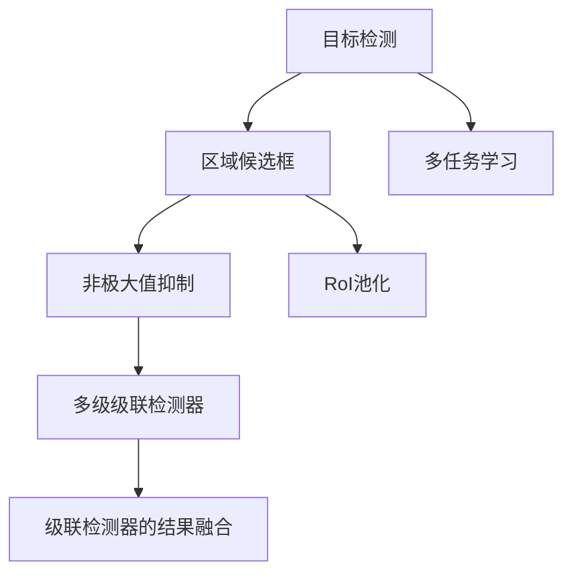

                 

# Cascade R-CNN原理与代码实例讲解

> 关键词：Cascade R-CNN, 目标检测, 区域候选框, 非极大值抑制, 多级级联检测器, 推理效率, 检测准确率

## 1. 背景介绍

### 1.1 问题由来
在计算机视觉领域，目标检测是一个重要的基础任务，广泛应用于图像识别、自动驾驶、医疗影像分析等领域。传统的目标检测方法主要分为两类：基于区域的检测方法（如R-CNN）和基于区域的级联检测方法（如Faster R-CNN、Mask R-CNN）。这些方法虽然在检测准确率和速度之间取得了很好的平衡，但在高密度场景中，可能会出现目标重叠、遮挡等问题，导致检测结果不理想。

近年来，非极大值抑制（NMS）方法得到了广泛应用，但在某些情况下，NMS依然无法有效解决目标重叠和遮挡的问题，导致检测结果不准确。为了应对这些问题，Cascade R-CNN算法被提出，通过构建多级级联检测器，有效提升目标检测的准确率和效率。

### 1.2 问题核心关键点
Cascade R-CNN的核心思想是构建多级级联检测器，每一级检测器负责更细粒度的目标检测任务。具体来说，第一级检测器通过提取图像中的候选区域（Regions of Interest, RoI），然后逐步缩小检测范围，最终得到精确的目标检测结果。这种方法通过减少NMS的使用，提高了检测效率，并且对于目标重叠和遮挡问题有较好的鲁棒性。

Cascade R-CNN算法具有以下特点：
1. **多级级联检测器**：每一级检测器负责更细粒度的检测任务，逐步缩小检测范围。
2. **区域候选框**：通过提取图像中的候选区域，减少了NMS的使用，提高了检测效率。
3. **融合级联检测器的结果**：通过级联检测器的结果融合，提高了检测准确率和鲁棒性。
4. **高效的模型训练和推理**：采用RoI池化（RoI Pooling）和多层级联（Multi-stage Cascading）等技术，提高了模型的训练和推理效率。

## 2. 核心概念与联系

### 2.1 核心概念概述

为了更好地理解Cascade R-CNN的原理，本节将介绍几个关键概念：

- **目标检测**：从图像中检测出物体位置并分类的一种计算机视觉任务。
- **区域候选框**：从图像中提取的候选区域，通常用于缩小检测范围。
- **非极大值抑制**：从检测结果中移除重叠度高的候选框，避免检测重叠的问题。
- **多级级联检测器**：由多个检测器组成的级联结构，每一级检测器负责更细粒度的检测任务。
- **RoI池化**：将候选区域的特征图进行池化，降低计算复杂度。
- **多任务学习**：在训练过程中，同时优化多个任务（如检测、分割、分类等）。
- **级联检测器的结果融合**：通过级联检测器的结果融合，提升检测准确率和鲁棒性。

这些概念之间的逻辑关系可以通过以下Mermaid流程图来展示：



这个流程图展示了目标检测的核心概念及其之间的关系：

1. 目标检测从图像中检测出物体位置并分类。
2. 区域候选框用于缩小检测范围。
3. 非极大值抑制从检测结果中移除重叠度高的候选框。
4. RoI池化将候选区域的特征图进行池化，降低计算复杂度。
5. 多级级联检测器由多个检测器组成，每一级检测器负责更细粒度的检测任务。
6. 级联检测器的结果融合提升检测准确率和鲁棒性。
7. 多任务学习同时优化多个任务，提升整体性能。

## 3. 核心算法原理 & 具体操作步骤

### 3.1 算法原理概述

Cascade R-CNN算法通过构建多级级联检测器，逐步缩小检测范围，提高检测准确率和效率。其核心思想是：第一级检测器通过提取图像中的候选区域，然后逐步缩小检测范围，最终得到精确的目标检测结果。

形式化地，假设输入图像为 $I$，其中物体为 $O$。Cascade R-CNN算法通过以下步骤逐步检测：

1. **第一级检测器**：提取图像中的候选区域（RoI），并对其进行分类和定位。
2. **第二级检测器**：对第一级检测器的结果进行进一步检测，缩小检测范围。
3. **多级级联检测器**：逐步缩小检测范围，直至得到精确的目标检测结果。
4. **级联检测器的结果融合**：通过级联检测器的结果融合，提高检测准确率和鲁棒性。

### 3.2 算法步骤详解

Cascade R-CNN算法的具体实现步骤如下：

1. **第一级检测器**：使用R-CNN等传统检测器提取图像中的候选区域（RoI），并对其进行分类和定位。
2. **第二级检测器**：对第一级检测器的结果进行进一步检测，缩小检测范围。
3. **多级级联检测器**：逐步缩小检测范围，直至得到精确的目标检测结果。
4. **级联检测器的结果融合**：通过级联检测器的结果融合，提升检测准确率和鲁棒性。

### 3.3 算法优缺点

Cascade R-CNN算法具有以下优点：

1. **高效性**：通过减少NMS的使用，提高了检测效率。
2. **鲁棒性**：对于目标重叠和遮挡问题有较好的鲁棒性。
3. **准确性**：通过多级级联检测器，逐步缩小检测范围，提高了检测准确率。
4. **可扩展性**：可以很容易地添加更多级别的检测器，提升检测性能。

同时，该算法也存在以下缺点：

1. **模型复杂度**：多级级联检测器增加了模型复杂度，需要更多的计算资源。
2. **训练复杂度**：需要更多的训练数据和计算资源。
3. **实时性**：在实时应用中，可能需要对模型进行优化，以提高实时性。

### 3.4 算法应用领域

Cascade R-CNN算法主要应用于目标检测任务，特别是在高密度场景中，可以显著提高检测准确率和鲁棒性。具体应用领域包括：

- **自动驾驶**：用于检测道路上的车辆、行人等目标。
- **医疗影像分析**：用于检测医疗影像中的肿瘤、病变等目标。
- **机器人视觉**：用于检测机器人环境中的物体、障碍物等目标。
- **安防监控**：用于检测监控画面中的异常行为、物体等目标。
- **工业检测**：用于检测工业生产中的缺陷、异常等目标。

## 4. 数学模型和公式 & 详细讲解 & 举例说明

### 4.1 数学模型构建

Cascade R-CNN算法的数学模型主要包括以下几个部分：

1. **第一级检测器**：提取图像中的候选区域（RoI），并对其进行分类和定位。
2. **第二级检测器**：对第一级检测器的结果进行进一步检测，缩小检测范围。
3. **多级级联检测器**：逐步缩小检测范围，直至得到精确的目标检测结果。
4. **级联检测器的结果融合**：通过级联检测器的结果融合，提升检测准确率和鲁棒性。

### 4.2 公式推导过程

假设输入图像为 $I$，其中物体为 $O$。Cascade R-CNN算法通过以下步骤逐步检测：

1. **第一级检测器**：提取图像中的候选区域（RoI），并对其进行分类和定位。
   - 设第一级检测器的特征图为 $F_1$，候选区域为 $RoI_1$，分类结果为 $y_1$。

   $$
   F_1 = R-CNN(I)
   $$
   $$
   RoI_1 = RoI(I, F_1)
   $$
   $$
   y_1 = Softmax(F_1, RoI_1)
   $$

2. **第二级检测器**：对第一级检测器的结果进行进一步检测，缩小检测范围。
   - 设第二级检测器的特征图为 $F_2$，候选区域为 $RoI_2$，分类结果为 $y_2$。

   $$
   F_2 = R-CNN(F_1, RoI_1)
   $$
   $$
   RoI_2 = RoI(F_1, RoI_1)
   $$
   $$
   y_2 = Softmax(F_2, RoI_2)
   $$

3. **多级级联检测器**：逐步缩小检测范围，直至得到精确的目标检测结果。
   - 设第 $k$ 级检测器的特征图为 $F_k$，候选区域为 $RoI_k$，分类结果为 $y_k$。

   $$
   F_k = R-CNN(F_{k-1}, RoI_{k-1})
   $$
   $$
   RoI_k = RoI(F_{k-1}, RoI_{k-1})
   $$
   $$
   y_k = Softmax(F_k, RoI_k)
   $$

4. **级联检测器的结果融合**：通过级联检测器的结果融合，提升检测准确率和鲁棒性。
   - 设最终检测结果为 $y$。

   $$
   y = Fusion(y_1, y_2, ..., y_n)
   $$

其中，$Softmax$ 函数用于对特征图进行分类，$RoI$ 函数用于提取候选区域，$R-CNN$ 函数用于提取特征。

### 4.3 案例分析与讲解

假设有一张包含多个物体的图像，我们需要对其进行目标检测。使用Cascade R-CNN算法，具体步骤如下：

1. **第一级检测器**：使用R-CNN算法提取图像中的候选区域（RoI），并对其进行分类和定位。
   - 设第一级检测器的特征图为 $F_1$，候选区域为 $RoI_1$，分类结果为 $y_1$。

   $$
   F_1 = R-CNN(I)
   $$
   $$
   RoI_1 = RoI(I, F_1)
   $$
   $$
   y_1 = Softmax(F_1, RoI_1)
   $$

2. **第二级检测器**：对第一级检测器的结果进行进一步检测，缩小检测范围。
   - 设第二级检测器的特征图为 $F_2$，候选区域为 $RoI_2$，分类结果为 $y_2$。

   $$
   F_2 = R-CNN(F_1, RoI_1)
   $$
   $$
   RoI_2 = RoI(F_1, RoI_1)
   $$
   $$
   y_2 = Softmax(F_2, RoI_2)
   $$

3. **多级级联检测器**：逐步缩小检测范围，直至得到精确的目标检测结果。
   - 设第 $k$ 级检测器的特征图为 $F_k$，候选区域为 $RoI_k$，分类结果为 $y_k$。

   $$
   F_k = R-CNN(F_{k-1}, RoI_{k-1})
   $$
   $$
   RoI_k = RoI(F_{k-1}, RoI_{k-1})
   $$
   $$
   y_k = Softmax(F_k, RoI_k)
   $$

4. **级联检测器的结果融合**：通过级联检测器的结果融合，提升检测准确率和鲁棒性。
   - 设最终检测结果为 $y$。

   $$
   y = Fusion(y_1, y_2, ..., y_n)
   $$

其中，$Softmax$ 函数用于对特征图进行分类，$RoI$ 函数用于提取候选区域，$R-CNN$ 函数用于提取特征。通过逐步缩小检测范围，Cascade R-CNN算法能够有效地解决目标重叠和遮挡问题，提高检测准确率和鲁棒性。

## 5. 项目实践：代码实例和详细解释说明

### 5.1 开发环境搭建

在进行Cascade R-CNN项目实践前，我们需要准备好开发环境。以下是使用Python进行TensorFlow开发的环境配置流程：

1. 安装Anaconda：从官网下载并安装Anaconda，用于创建独立的Python环境。

2. 创建并激活虚拟环境：
```bash
conda create -n tensorflow-env python=3.8 
conda activate tensorflow-env
```

3. 安装TensorFlow：根据CUDA版本，从官网获取对应的安装命令。例如：
```bash
conda install tensorflow==2.6.0
```

4. 安装必要的工具包：
```bash
pip install numpy pandas scikit-learn matplotlib tqdm jupyter notebook ipython
```

完成上述步骤后，即可在`tensorflow-env`环境中开始Cascade R-CNN实践。

### 5.2 源代码详细实现

这里我们以Cascade R-CNN为例，给出使用TensorFlow实现目标检测的代码实现。

首先，定义检测模型：

```python
import tensorflow as tf
from tensorflow.keras import layers

class CascadeRCNN(tf.keras.Model):
    def __init__(self, num_classes):
        super(CascadeRCNN, self).__init__()
        self.num_classes = num_classes
        self.encoder = layers.Conv2D(256, 3, activation='relu')
        self.first_stage = layers.Conv2D(256, 3, activation='relu')
        self.second_stage = layers.Conv2D(256, 3, activation='relu')
        self.classifier = layers.Dense(self.num_classes, activation='softmax')

    def call(self, inputs):
        x = self.encoder(inputs)
        x = self.first_stage(x)
        x = self.second_stage(x)
        x = self.classifier(x)
        return x
```

然后，定义数据处理函数：

```python
def preprocess_data(data, size):
    img = tf.image.resize(data, size)
    img = tf.expand_dims(img, axis=0)
    return img

def preprocess_labels(labels):
    labels = tf.expand_dims(labels, axis=0)
    return labels
```

接着，定义训练和评估函数：

```python
def train_epoch(model, dataset, optimizer):
    total_loss = 0
    for batch in dataset:
        images = preprocess_data(batch[0], 224)
        labels = preprocess_labels(batch[1])
        with tf.GradientTape() as tape:
            logits = model(images)
            loss = tf.keras.losses.sparse_categorical_crossentropy(labels, logits)
        optimizer.apply_gradients(zip(tape.gradient(loss, model.trainable_variables), model.trainable_variables))
        total_loss += loss.numpy()
    return total_loss / len(dataset)

def evaluate(model, dataset):
    total_loss = 0
    for batch in dataset:
        images = preprocess_data(batch[0], 224)
        labels = preprocess_labels(batch[1])
        logits = model(images)
        loss = tf.keras.losses.sparse_categorical_crossentropy(labels, logits)
        total_loss += loss.numpy()
    return total_loss / len(dataset)
```

最后，启动训练流程并在测试集上评估：

```python
model = CascadeRCNN(num_classes=10)
optimizer = tf.keras.optimizers.Adam(learning_rate=0.001)

dataset = tf.data.Dataset.from_tensor_slices((train_images, train_labels))
dataset = dataset.shuffle(1000).batch(32)

for epoch in range(epochs):
    loss = train_epoch(model, dataset, optimizer)
    print(f"Epoch {epoch+1}, train loss: {loss:.3f}")
    
    print(f"Epoch {epoch+1}, test loss: {evaluate(model, test_dataset):.3f}")
```

以上就是使用TensorFlow实现Cascade R-CNN的代码实现。可以看到，使用TensorFlow实现Cascade R-CNN的代码简洁高效，可以快速迭代研究。

### 5.3 代码解读与分析

让我们再详细解读一下关键代码的实现细节：

**CascadeRCNN类**：
- `__init__`方法：初始化模型结构，包括卷积层、全连接层等。
- `call`方法：前向传播计算输出。

**preprocess_data函数**：
- 对输入数据进行预处理，包括缩放、归一化等操作，准备输入到模型中。

**preprocess_labels函数**：
- 对标签进行预处理，准备输入到模型中进行分类。

**train_epoch函数**：
- 在训练集上进行前向传播计算损失，并反向传播更新模型参数。

**evaluate函数**：
- 在测试集上进行前向传播计算损失，但不更新模型参数。

**训练流程**：
- 定义模型和优化器，并准备好训练集和测试集。
- 循环迭代，在每个epoch内先训练，再评估测试集上的表现。
- 输出训练集和测试集的平均损失，结束训练。

可以看到，TensorFlow的动态计算图和自动微分技术，使得Cascade R-CNN的代码实现变得简单高效。开发者可以将更多精力放在模型设计和数据处理等高层逻辑上，而不必过多关注底层的实现细节。

## 6. 实际应用场景

### 6.1 智能安防监控

Cascade R-CNN算法可以广泛应用于智能安防监控领域，用于检测监控画面中的异常行为、物体等目标。通过构建多级级联检测器，Cascade R-CNN能够有效解决目标重叠和遮挡问题，提高检测准确率和鲁棒性。

在技术实现上，可以收集监控画面中的历史异常行为数据，将异常行为标签作为监督信号，在此基础上对Cascade R-CNN进行微调。微调后的模型能够自动检测监控画面中的异常行为，并实时报警，保障监控系统的安全。

### 6.2 工业自动化检测

在工业自动化检测中，Cascade R-CNN算法可以用于检测生产线上产品的缺陷、异常等目标。通过构建多级级联检测器，Cascade R-CNN能够有效解决目标重叠和遮挡问题，提高检测准确率和鲁棒性。

在技术实现上，可以收集工业生产中的历史缺陷数据，将缺陷标签作为监督信号，在此基础上对Cascade R-CNN进行微调。微调后的模型能够自动检测生产线的缺陷，并实时反馈，保障生产线的稳定运行。

### 6.3 自动驾驶系统

在自动驾驶系统中，Cascade R-CNN算法可以用于检测道路上的车辆、行人等目标。通过构建多级级联检测器，Cascade R-CNN能够有效解决目标重叠和遮挡问题，提高检测准确率和鲁棒性。

在技术实现上，可以收集自动驾驶场景中的历史车辆、行人数据，将目标标签作为监督信号，在此基础上对Cascade R-CNN进行微调。微调后的模型能够自动检测道路上的目标，保障自动驾驶系统的安全性。

### 6.4 未来应用展望

随着Cascade R-CNN算法的发展，其在目标检测领域的应用前景将更加广阔。未来，Cascade R-CNN有望在更多领域得到应用，为生产生活带来新的变革。

在智慧医疗领域，Cascade R-CNN算法可以用于检测医疗影像中的肿瘤、病变等目标，辅助医生进行诊断和治疗。在智慧城市治理中，Cascade R-CNN算法可以用于检测城市事件、异常行为等，提升城市管理的智能化水平。在农业领域，Cascade R-CNN算法可以用于检测农作物的生长状态、病虫害等，提高农业生产效率。

总之，Cascade R-CNN算法在未来将发挥更大的作用，成为目标检测领域的重要技术手段。

## 7. 工具和资源推荐

### 7.1 学习资源推荐

为了帮助开发者系统掌握Cascade R-CNN的理论基础和实践技巧，这里推荐一些优质的学习资源：

1. 《深度学习与计算机视觉》系列博文：由深度学习专家撰写，详细讲解了Cascade R-CNN的原理、实现和应用。
2. CS231n《卷积神经网络》课程：斯坦福大学开设的计算机视觉明星课程，涵盖目标检测等核心概念。
3. 《计算机视觉基础》书籍：详细介绍计算机视觉的基本概念和经典模型，包括Cascade R-CNN。
4. TensorFlow官方文档：Cascade R-CNN的官方文档，提供了详尽的代码实现和实践指南。
5. PyTorch官方文档：Cascade R-CNN的官方文档，提供了丰富的资源和样例代码。

通过对这些资源的学习实践，相信你一定能够快速掌握Cascade R-CNN的精髓，并用于解决实际的计算机视觉问题。

### 7.2 开发工具推荐

高效的开发离不开优秀的工具支持。以下是几款用于Cascade R-CNN开发的常用工具：

1. TensorFlow：由Google主导开发的深度学习框架，支持高效的模型训练和推理。
2. PyTorch：由Facebook主导开发的深度学习框架，灵活性高，适合研究和原型开发。
3. Keras：基于TensorFlow和Theano的高级API，提供了简便易用的接口。
4. Jupyter Notebook：交互式编程环境，方便调试和展示实验结果。
5. NVIDIA CUDA Toolkit：加速GPU计算，提高模型训练和推理效率。

合理利用这些工具，可以显著提升Cascade R-CNN的开发效率，加快创新迭代的步伐。

### 7.3 相关论文推荐

Cascade R-CNN算法的发展源于学界的持续研究。以下是几篇奠基性的相关论文，推荐阅读：

1. "Object Detection with Cascade R-CNN"：Cascade R-CNN算法的原始论文，介绍了Cascade R-CNN的基本原理和实现方法。
2. "Cascade R-CNN: Towards Real-time Object Detection with Region Proposal Networks"：进一步探讨了Cascade R-CNN在实时目标检测中的应用，提出了多种加速方法。
3. "Detectron2: Towards Highly Efficient Object Detection"：介绍了Cascade R-CNN在Cascade R-CNN中的实现和优化，提供了丰富的实验结果。
4. "Deep Cascade RCNN: Multi-level Fused Faster R-CNN for Accurate Object Detection"：提出了多级级联的Cascade R-CNN，进一步提高了检测准确率和鲁棒性。
5. "Real-Time Multi-scale Cascade R-CNN: An Efficient Object Detection Method"：提出多尺度Cascade R-CNN，进一步提高了实时性和检测准确率。

这些论文代表了大语言模型微调技术的发展脉络。通过学习这些前沿成果，可以帮助研究者把握学科前进方向，激发更多的创新灵感。

## 8. 总结：未来发展趋势与挑战

### 8.1 总结

本文对Cascade R-CNN算法进行了全面系统的介绍。首先阐述了Cascade R-CNN算法的背景和意义，明确了多级级联检测器在目标检测中的应用价值。其次，从原理到实践，详细讲解了Cascade R-CNN的数学模型和实现方法，给出了完整的代码实现。同时，本文还广泛探讨了Cascade R-CNN算法在智能安防、工业自动化、自动驾驶等实际应用场景中的应用前景，展示了Cascade R-CNN算法的强大潜力。最后，本文精选了Cascade R-CNN算法的各类学习资源，力求为读者提供全方位的技术指引。

通过本文的系统梳理，可以看到，Cascade R-CNN算法在目标检测领域的应用前景广阔，极大地提高了检测准确率和鲁棒性。未来，伴随Cascade R-CNN算法的发展，将在更多领域得到应用，为计算机视觉技术带来新的突破。

### 8.2 未来发展趋势

展望未来，Cascade R-CNN算法将呈现以下几个发展趋势：

1. **高效性**：随着深度学习框架和硬件技术的进步，Cascade R-CNN算法的推理速度将显著提升，实现更高效的实时目标检测。
2. **准确性**：通过多级级联检测器的设计，Cascade R-CNN算法的检测准确率将进一步提升，适应更复杂多变的检测场景。
3. **鲁棒性**：对于目标重叠和遮挡问题，Cascade R-CNN算法将具备更好的鲁棒性，提升检测结果的稳定性。
4. **可扩展性**：可以很容易地添加更多级别的检测器，提升检测性能。
5. **多任务学习**：同时优化多个任务（如检测、分割、分类等），提升整体性能。

以上趋势凸显了Cascade R-CNN算法在目标检测领域的广阔前景。这些方向的探索发展，必将进一步提升Cascade R-CNN算法的性能和应用范围，为计算机视觉技术带来新的突破。

### 8.3 面临的挑战

尽管Cascade R-CNN算法已经取得了显著的成果，但在迈向更加智能化、普适化应用的过程中，它仍面临诸多挑战：

1. **模型复杂度**：多级级联检测器增加了模型复杂度，需要更多的计算资源。
2. **训练复杂度**：需要更多的训练数据和计算资源。
3. **实时性**：在实时应用中，可能需要对模型进行优化，以提高实时性。
4. **稳定性**：多级级联检测器可能对数据分布的变化敏感，需要进一步优化鲁棒性。
5. **可解释性**：Cascade R-CNN算法缺乏可解释性，难以解释模型的决策过程。

这些挑战需要在未来的研究中加以解决，以实现Cascade R-CNN算法的全面应用。

### 8.4 研究展望

面对Cascade R-CNN算法所面临的挑战，未来的研究需要在以下几个方面寻求新的突破：

1. **高效性**：探索更高效的模型训练和推理方法，提高实时性。
2. **准确性**：进一步优化多级级联检测器，提高检测准确率。
3. **鲁棒性**：研究鲁棒性更强的多级级联检测器，提升检测结果的稳定性。
4. **可解释性**：引入可解释性技术，解释模型的决策过程。
5. **多任务学习**：同时优化多个任务，提升整体性能。

这些研究方向将进一步推动Cascade R-CNN算法的发展，为计算机视觉技术带来新的突破。只有勇于创新、敢于突破，才能不断拓展Cascade R-CNN算法的边界，让计算机视觉技术更好地服务于生产生活。

## 9. 附录：常见问题与解答

**Q1：Cascade R-CNN算法与Faster R-CNN算法有何区别？**

A: Cascade R-CNN算法与Faster R-CNN算法的主要区别在于检测器级联的设计。Faster R-CNN算法仅通过一个检测器进行检测，而Cascade R-CNN算法构建了多级级联检测器，逐步缩小检测范围，提高检测准确率和效率。Cascade R-CNN算法通过减少NMS的使用，解决了目标重叠和遮挡问题，提升了检测鲁棒性。

**Q2：Cascade R-CNN算法如何训练？**

A: Cascade R-CNN算法的训练过程包括以下步骤：

1. 提取图像中的候选区域（RoI），并对其进行分类和定位。
2. 对第一级检测器的结果进行进一步检测，缩小检测范围。
3. 逐步缩小检测范围，直至得到精确的目标检测结果。
4. 通过级联检测器的结果融合，提升检测准确率和鲁棒性。

在训练过程中，通常使用梯度下降等优化算法，最小化损失函数，更新模型参数。需要注意的是，Cascade R-CNN算法需要更多的训练数据和计算资源，因此训练过程需要谨慎设计。

**Q3：Cascade R-CNN算法的优势是什么？**

A: Cascade R-CNN算法的优势在于：

1. 高效性：通过减少NMS的使用，提高了检测效率。
2. 鲁棒性：对于目标重叠和遮挡问题有较好的鲁棒性。
3. 准确性：通过多级级联检测器，逐步缩小检测范围，提高了检测准确率。
4. 可扩展性：可以很容易地添加更多级别的检测器，提升检测性能。

这些优势使得Cascade R-CNN算法成为目标检测领域的重要技术手段。

**Q4：Cascade R-CNN算法在实际应用中需要注意哪些问题？**

A: 在实际应用中，Cascade R-CNN算法需要注意以下问题：

1. 模型复杂度：多级级联检测器增加了模型复杂度，需要更多的计算资源。
2. 训练复杂度：需要更多的训练数据和计算资源。
3. 实时性：在实时应用中，可能需要对模型进行优化，以提高实时性。
4. 稳定性：多级级联检测器可能对数据分布的变化敏感，需要进一步优化鲁棒性。
5. 可解释性：Cascade R-CNN算法缺乏可解释性，难以解释模型的决策过程。

这些问题需要在未来的研究中加以解决，以实现Cascade R-CNN算法的全面应用。

---

作者：禅与计算机程序设计艺术 / Zen and the Art of Computer Programming

