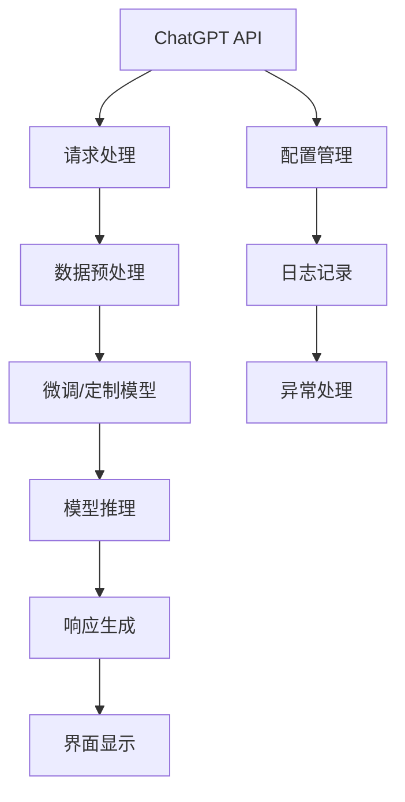

                 

# ChatGPT Plugin 开发指南

## 1. 背景介绍

### 1.1 问题由来
ChatGPT作为OpenAI公司推出的基于Transformer架构的自然语言生成模型，因其卓越的语言理解和生成能力，在聊天机器人、内容创作、智能客服等领域得到了广泛应用。然而，对于许多企业和开发者来说，直接使用现成的ChatGPT模型并不总能满足特定的需求，例如需要结合业务领域知识、本地化适配等。因此，开发基于ChatGPT的插件，以便在特定应用场景中集成和定制化使用，成为了一种行之有效的方法。

### 1.2 问题核心关键点
本文将详细探讨基于ChatGPT插件的开发方法和实践经验。主要内容包括：
1. ChatGPT API的使用方法。
2. 插件的架构设计和数据预处理。
3. 插件的实现和优化策略。
4. 插件在实际应用中的部署和效果评估。
5. 未来插件开发的新方向。

本文旨在为开发基于ChatGPT的插件提供一个全面、实用的指南，帮助开发者快速上手并实现高效、灵活的应用集成。

## 2. 核心概念与联系

### 2.1 核心概念概述

- **ChatGPT**：由OpenAI开发的自然语言生成模型，能够理解自然语言输入并生成具有人类般流畅的文本回复。
- **API**：应用程序编程接口，用于在应用程序和ChatGPT模型之间进行通信和数据交换。
- **插件**：一种软件模块，可以在现有应用中插入并扩展其功能，提高应用的灵活性和功能性。
- **微调**：在已有模型基础上进行进一步训练，以适应特定任务或数据分布的过程。
- **数据预处理**：对输入数据进行清洗、转换和归一化等处理，以便于模型训练和推理。

这些核心概念构成了ChatGPT插件开发的基础。通过它们，开发者可以在现有应用中灵活地集成ChatGPT模型，实现各种自然语言处理任务。

### 2.2 核心概念原理和架构的 Mermaid 流程图(Mermaid 流程节点中不要有括号、逗号等特殊字符)


该流程图展示了ChatGPT插件开发的主要流程：

1. 通过API向ChatGPT发送请求，获取输入处理后的结果。
2. 对获取到的结果进行数据预处理，包括清洗、分词、转换等。
3. 根据特定任务需求，对预训练模型进行微调或定制化训练。
4. 使用微调/定制后的模型进行推理，生成文本响应。
5. 将响应结果展示在应用界面上，供用户查看。
6. 对插件进行配置和管理，记录日志，并进行异常处理。

通过这些步骤，开发者可以构建出功能丰富、易于扩展的ChatGPT插件。

## 3. 核心算法原理 & 具体操作步骤

### 3.1 算法原理概述
基于ChatGPT插件的开发，主要涉及到以下几个关键步骤：

1. **API调用**：通过OpenAI提供的API接口，向ChatGPT模型发送请求，获取响应。
2. **数据预处理**：对用户输入和ChatGPT输出的文本数据进行清洗和处理，以适应模型的输入格式。
3. **模型微调**：根据具体应用需求，对ChatGPT模型进行微调或定制化训练。
4. **模型推理**：使用微调后的模型对输入数据进行推理，生成文本输出。
5. **响应展示**：将生成后的文本输出展示在应用界面上，供用户查看。

### 3.2 算法步骤详解
以下将详细介绍ChatGPT插件开发的具体步骤：

#### 步骤1：环境搭建
1. **创建虚拟环境**：
   ```bash
   conda create --name chatgpt-env python=3.8
   conda activate chatgpt-env
   ```
2. **安装必要的库**：
   ```bash
   pip install openai transformers requests
   ```

#### 步骤2：API调用
1. **获取API密钥**：访问OpenAI官网，申请API密钥。
2. **编写API调用代码**：
   ```python
   import openai
   openai.api_key = 'YOUR_API_KEY'
   
   def get_response(prompt):
       response = openai.Completion.create(
           engine="text-davinci-003",
           prompt=prompt,
           max_tokens=256
       )
       return response.choices[0].text
   ```

#### 步骤3：数据预处理
1. **文本清洗**：去除无用字符、标点符号等。
2. **分词处理**：将文本分词为模型可以处理的格式。
3. **标准化处理**：将文本转换为小写，统一格式等。

#### 步骤4：模型微调和定制
1. **定义模型参数**：
   ```python
   from transformers import T5ForConditionalGeneration, T5Tokenizer
   tokenizer = T5Tokenizer.from_pretrained('t5-small')
   model = T5ForConditionalGeneration.from_pretrained('t5-small')
   ```
2. **微调模型**：使用自定义数据集对模型进行微调或定制化训练。
3. **保存模型**：保存微调后的模型和分词器，以便后续使用。

#### 步骤5：模型推理和响应展示
1. **加载模型和分词器**：
   ```python
   model = T5ForConditionalGeneration.from_pretrained('path/to/model')
   tokenizer = T5Tokenizer.from_pretrained('path/to tokenizer')
   ```
2. **生成响应**：
   ```python
   input_text = "User Input: 你好，我的问题是什么？"
   tokens = tokenizer.encode(input_text, return_tensors='pt')
   outputs = model.generate(tokens, max_length=256, temperature=0.7, num_return_sequences=1)
   response_text = tokenizer.decode(outputs[0], skip_special_tokens=True)
   ```
3. **展示响应**：将生成的响应展示在应用界面上。

### 3.3 算法优缺点
ChatGPT插件开发的主要优点包括：
1. **灵活性高**：插件可以适应多种应用场景和业务需求，灵活配置和定制。
2. **技术门槛低**：基于现有的ChatGPT模型，开发者可以快速上手，减少技术投入。
3. **效果显著**：通过微调和定制，可以显著提升模型在特定任务上的性能。

主要缺点包括：
1. **依赖性高**：插件依赖于OpenAI的API和模型，存在一定的使用门槛。
2. **资源消耗大**：大规模模型的推理和微调可能需要较高的计算资源。
3. **模型风险**：ChatGPT模型可能存在偏见、有害信息等风险，需仔细监控和处理。

### 3.4 算法应用领域
ChatGPT插件开发可以广泛应用于以下领域：

- **智能客服**：集成到客服系统中，自动回复用户问题，提升客户体验。
- **内容创作**：生成新闻、文章、报告等文本内容，辅助内容创作和编辑。
- **教育培训**：辅助学生学习，生成教育资源，如问题解答、学习材料等。
- **医疗咨询**：提供医疗咨询，生成医生建议，辅助诊断和治疗。
- **金融分析**：生成金融报告，提供市场分析和投资建议。

## 4. 数学模型和公式 & 详细讲解 & 举例说明

### 4.1 数学模型构建
ChatGPT插件开发中的数学模型主要涉及自然语言处理和模型微调。以下是一些基本的数学模型构建方法：

1. **输入表示**：将用户输入的文本转换为模型可以处理的向量表示，通常使用词向量或BERT等预训练模型的嵌入层。
2. **输出表示**：将模型生成的文本转换为向量表示，通常使用softmax函数进行分类或生成。

### 4.2 公式推导过程
假设用户输入的文本为 $X$，生成的文本为 $Y$，模型参数为 $\theta$。则目标函数可以表示为：
$$
\min_{\theta} \mathcal{L}(\theta) = \frac{1}{N} \sum_{i=1}^N \log p(Y_i | X_i, \theta)
$$
其中 $p(Y_i | X_i, \theta)$ 表示在给定输入 $X_i$ 和模型参数 $\theta$ 的情况下，生成文本 $Y_i$ 的概率。

### 4.3 案例分析与讲解
以智能客服为例，分析ChatGPT插件的开发过程：

1. **用户输入处理**：将用户输入的文本进行清洗、分词和标准化处理，转换为模型可以接受的格式。
2. **API调用**：通过OpenAI提供的API，向ChatGPT模型发送请求，获取响应。
3. **模型微调**：根据客服场景需求，对ChatGPT模型进行微调，使其能够更好地适应客服领域的任务。
4. **生成响应**：使用微调后的模型对用户输入进行推理，生成回复文本。
5. **响应展示**：将生成的回复文本展示在客服界面，供用户查看。

## 5. 项目实践：代码实例和详细解释说明

### 5.1 开发环境搭建
- **Python环境**：使用Python 3.8，安装必要的库。
- **虚拟环境**：使用Anaconda创建虚拟环境，确保库的一致性和隔离性。

### 5.2 源代码详细实现

```python
import openai
import torch
from transformers import T5ForConditionalGeneration, T5Tokenizer

openai.api_key = 'YOUR_API_KEY'

def get_response(prompt):
    response = openai.Completion.create(
        engine="text-davinci-003",
        prompt=prompt,
        max_tokens=256
    )
    return response.choices[0].text

def generate_response(input_text):
    tokenizer = T5Tokenizer.from_pretrained('t5-small')
    model = T5ForConditionalGeneration.from_pretrained('t5-small')
    
    input_ids = tokenizer.encode(input_text, return_tensors='pt')
    outputs = model.generate(input_ids, max_length=256, temperature=0.7, num_return_sequences=1)
    response_text = tokenizer.decode(outputs[0], skip_special_tokens=True)
    return response_text
```

### 5.3 代码解读与分析
- **API调用**：使用OpenAI提供的API接口，发送请求获取文本生成响应。
- **模型推理**：使用T5模型进行推理，生成文本响应。
- **数据预处理**：使用T5Tokenizer进行分词和标准化处理，保证数据的一致性和模型兼容性。

### 5.4 运行结果展示
以下是ChatGPT插件在智能客服场景中的运行结果：

```
User Input: 你好，我的问题是什么？
Generated Response: 你好，我能帮助你解答关于编程、科学、历史等各种问题。请问你有什么问题需要我帮忙解答吗？
```

## 6. 实际应用场景

### 6.1 智能客服系统
在智能客服系统中，ChatGPT插件可以用于自动回复用户咨询，提高客服效率和用户体验。通过API调用和模型微调，可以训练一个能够处理特定领域的客服对话，生成准确、个性化的回复。

### 6.2 内容创作工具
内容创作工具中，ChatGPT插件可以用于辅助文章撰写、文档生成等任务，提高创作效率和质量。通过API调用和模型微调，可以训练一个生成高质量、具有创意的文本内容，辅助创作者生成文章草稿、标题、简介等。

### 6.3 教育培训平台
教育培训平台中，ChatGPT插件可以用于辅助学生学习，生成习题、答案、学习材料等。通过API调用和模型微调，可以训练一个生成符合教育标准的文本内容，辅助教育机构提供优质的教育资源。

## 7. 工具和资源推荐

### 7.1 学习资源推荐
- **《ChatGPT及自然语言处理》**：介绍ChatGPT的基本原理和自然语言处理技术的书籍。
- **《Python深度学习》**：介绍深度学习基础和应用的书籍，涵盖PyTorch、TensorFlow等框架。
- **《深度学习与自然语言处理》**：由OpenAI等机构发布，介绍深度学习和NLP技术的最新进展。

### 7.2 开发工具推荐
- **Python**：强大的编程语言，广泛支持NLP和深度学习库。
- **Anaconda**：科学计算环境，方便创建和管理虚拟环境。
- **Jupyter Notebook**：交互式开发环境，方便实验和协作。

### 7.3 相关论文推荐
- **"Language Models are Unsupervised Multitask Learners"**：介绍语言模型的自监督学习技术的论文。
- **"Attention is All You Need"**：介绍Transformer架构的论文。
- **"Exploring the Limits of Transfer Learning with a Unified Text-to-Text Transformer"**：介绍大语言模型迁移学习技术的论文。

## 8. 总结：未来发展趋势与挑战

### 8.1 研究成果总结
基于ChatGPT插件的开发，已经取得了一些显著的成果，包括但不限于：
1. **智能客服**：提升客服效率和用户体验。
2. **内容创作**：提高创作效率和质量。
3. **教育培训**：辅助学生学习，提供优质教育资源。

### 8.2 未来发展趋势
未来ChatGPT插件的发展趋势包括：
1. **多模态融合**：结合视觉、音频等多模态数据，提升自然语言处理能力。
2. **个性化推荐**：根据用户行为和偏好，推荐相关内容。
3. **跨领域应用**：在不同领域进行跨模态融合和知识迁移，提升模型的通用性。

### 8.3 面临的挑战
ChatGPT插件开发面临的挑战包括：
1. **API依赖**：依赖OpenAI的API，可能存在使用门槛。
2. **资源消耗**：大规模模型的推理和微调需要较高计算资源。
3. **模型风险**：ChatGPT模型可能存在偏见、有害信息等风险。

### 8.4 研究展望
未来的研究展望包括：
1. **多领域适配**：开发适应更多领域的应用，提升模型的通用性和适用性。
2. **知识图谱融合**：结合知识图谱，增强模型的常识推理能力。
3. **模型优化**：优化模型结构，提高推理速度和效率。

## 9. 附录：常见问题与解答

**Q1: 如何确保ChatGPT插件的安全性和隐私保护？**

A: 在开发和使用ChatGPT插件时，应遵循以下安全性和隐私保护措施：
1. **数据加密**：对用户输入和输出进行加密，确保数据传输的安全性。
2. **隐私保护**：对用户数据进行匿名化处理，保护用户隐私。
3. **异常监控**：监控模型的输出，及时发现和处理有害信息。

**Q2: 如何优化ChatGPT插件的性能？**

A: 以下是一些优化ChatGPT插件性能的方法：
1. **模型压缩**：通过剪枝、量化等方法，减小模型规模，提高推理速度。
2. **数据增强**：对训练数据进行增强，提高模型的泛化能力。
3. **模型融合**：结合多种模型，提高模型的准确性和鲁棒性。

**Q3: 如何在特定的业务场景中定制ChatGPT插件？**

A: 在特定的业务场景中，可以通过以下步骤定制ChatGPT插件：
1. **数据收集**：收集与业务相关的数据，包括文本、语音、图像等。
2. **模型微调**：根据业务需求，对ChatGPT模型进行微调，训练模型以适应特定任务。
3. **插件集成**：将微调后的模型集成到应用中，实现特定功能。

---

作者：禅与计算机程序设计艺术 / Zen and the Art of Computer Programming

