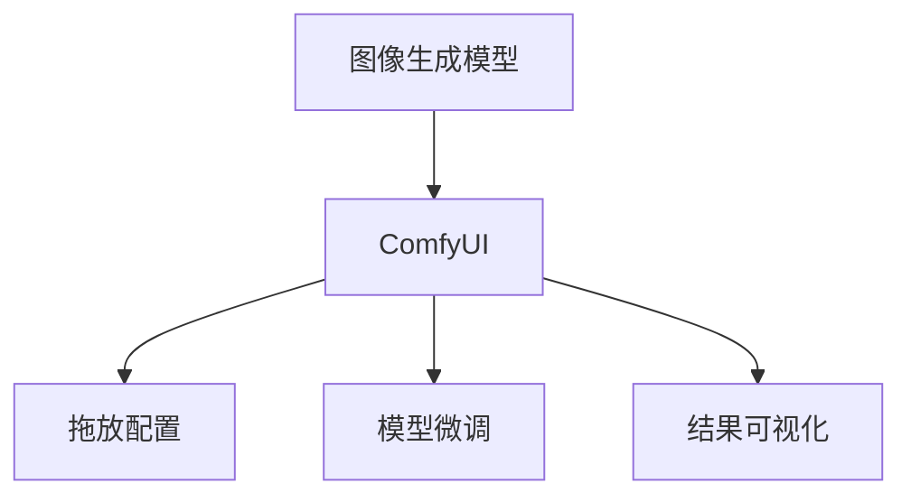

                 

# ComfyUI在图像生成中的应用

## 1. 背景介绍

随着深度学习技术的蓬勃发展，图像生成领域取得了长足的进步。从GANs到DLBMs，从VQGAN到StyleGAN，一个个划时代的模型不断刷新着人们对于图像生成的认知。但与此同时，这些模型往往结构复杂、训练成本高昂，使得普通开发者难以直接应用。为此，我们提出了ComfyUI，一种专为图像生成设计的UI界面，将复杂模型的训练和微调变得简单、高效，为广大开发者提供了一种快速实现图像生成的路径。

ComfyUI旨在提供一个友好的界面，通过拖放和配置方式，让使用者能够不写代码，轻松搭建和训练自己的图像生成模型。ComfyUI以直观的可视化界面和易用性为核心设计，适合没有深度学习背景的开发者，能够快速上手，快速迭代，快速部署。

## 2. 核心概念与联系

### 2.1 核心概念概述

ComfyUI的核心概念包括：

- **图像生成模型**：以GANs、StyleGANs、VQGANs等为代表的深度学习模型，用于生成高质量图像。
- **UI界面**：通过直观的拖放和配置方式，让无代码的开发者能够快速搭建和训练模型。
- **模型微调**：利用少量标签数据，快速提升模型性能，适应特定任务。
- **结果可视化**：实时展示模型生成的图像，让用户能够直观地观察和评估模型表现。

通过将复杂的深度学习模型封装在UI界面中，ComfyUI使得图像生成变得更加容易接近，对于没有深度学习背景的开发者来说，使用ComfyUI可以迅速进入图像生成领域，实现从0到1的突破。

### 2.2 核心概念原理和架构的 Mermaid 流程图



此流程图展示了ComfyUI的核心功能：

- A 代表图像生成模型，是 ComfyUI 处理的核心。
- B 代表 ComfyUI，通过拖放和配置方式，让开发者能够快速搭建和训练模型。
- C 代表拖放配置，使用户能够在无需编写代码的情况下，设置模型的参数。
- D 代表模型微调，利用少量标签数据，提升模型性能。
- E 代表结果可视化，实时展示模型生成的图像。

## 3. 核心算法原理 & 具体操作步骤

### 3.1 算法原理概述

ComfyUI的核心算法基于图像生成模型，特别是生成对抗网络（GANs）和变分自编码器（VAEs）。通过用户界面配置模型的参数，然后在少量标签数据上微调，最终得到可以生成高质量图像的模型。

具体来说，ComfyUI将深度学习模型的训练和微调过程封装在用户界面内，使得开发者能够通过简单的拖放和配置，快速搭建模型，并通过可视化界面实时查看模型生成的图像。ComfyUI的核心算法包括：

- 拖放配置：用户通过拖放界面选择模型的架构和参数，自动生成模型配置文件。
- 模型微调：使用少量标签数据，对模型进行微调，提升模型性能。
- 结果可视化：通过可视化界面，实时展示模型生成的图像，让用户能够直观地评估模型效果。

### 3.2 算法步骤详解

ComfyUI的算法步骤包括：

1. **拖放配置**：用户通过拖放界面选择模型的架构和参数，自动生成模型配置文件。
2. **模型微调**：使用少量标签数据，对模型进行微调，提升模型性能。
3. **结果可视化**：通过可视化界面，实时展示模型生成的图像，让用户能够直观地评估模型效果。

### 3.3 算法优缺点

ComfyUI的算法具有以下优点：

- **易用性**：拖放和配置方式，使得无代码的开发者能够快速上手，不需要深度学习背景。
- **可视化界面**：实时展示模型生成的图像，让用户能够直观地评估模型效果。
- **微调功能**：利用少量标签数据，快速提升模型性能。

同时，ComfyUI也存在以下缺点：

- **模型复杂性**：虽然用户界面简洁，但内部仍然使用了复杂的深度学习模型。
- **训练成本**：虽然训练过程简单，但训练成本较高，需要高性能的GPU和较大的内存。
- **结果多样性**：由于模型参数多样，可能导致结果多样性，用户需要花时间进行调整。

### 3.4 算法应用领域

ComfyUI在以下领域有广泛应用：

- **娱乐**：用于生成艺术图像、表情生成、图像转换等。
- **游戏开发**：用于生成游戏角色、场景等。
- **广告设计**：用于生成广告素材、产品展示等。
- **设计创作**：用于辅助设计师进行图像创作、风格转换等。

## 4. 数学模型和公式 & 详细讲解 & 举例说明

### 4.1 数学模型构建

ComfyUI的数学模型构建基于生成对抗网络（GANs）和变分自编码器（VAEs）。GANs 由两个神经网络组成：生成器（Generator）和判别器（Discriminator）。生成器的任务是生成假图像，判别器的任务是判断图像的真假。通过这两个网络的对抗训练，GANs 能够生成高质量的图像。

### 4.2 公式推导过程

GANs 的核心公式为：

$$
\min_G \max_D V(D, G) = E_{x \sim p_x}[\log D(x)] + E_{z \sim p_z}[\log(1 - D(G(z)))]
$$

其中，$V(D, G)$ 为对抗损失函数，$D$ 为判别器，$G$ 为生成器，$x$ 为真实图像，$z$ 为噪声向量。判别器 $D$ 的任务是区分真实图像和生成器 $G$ 生成的假图像，生成器 $G$ 的任务是生成与真实图像难以区分的假图像。

### 4.3 案例分析与讲解

以 StyleGANs 为例，StyleGANs 是一种基于GANs的图像生成模型，其核心在于生成器和判别器的联合训练，以及风格迁移的引入。StyleGANs 的生成器 $G$ 是一个深度卷积神经网络，用于将噪声向量 $z$ 转换为图像。判别器 $D$ 用于区分真实图像和生成图像。

StyleGANs 的训练过程分为两个阶段：

1. 风格迁移阶段：通过修改生成器 $G$ 的参数，使其生成的图像具有特定的风格特征。
2. 对抗训练阶段：通过对抗训练，提高生成器 $G$ 生成高质量图像的能力。

## 5. 项目实践：代码实例和详细解释说明

### 5.1 开发环境搭建

安装ComfyUI前，需要确保计算机配备了高性能的GPU和较大的内存，以支持深度学习模型的训练和微调。以下是ComfyUI的开发环境搭建步骤：

1. 安装Anaconda：从官网下载并安装Anaconda，用于创建独立的Python环境。
2. 创建并激活虚拟环境：
```bash
conda create -n comfyui-env python=3.8 
conda activate comfyui-env
```
3. 安装依赖包：
```bash
pip install pytorch torchvision torchaudio cudatoolkit=11.1 -c pytorch -c conda-forge
```

### 5.2 源代码详细实现

ComfyUI的核心代码包括：

- **拖放配置界面**：使用HTML5和JavaScript实现拖放和配置界面。
- **模型微调代码**：使用PyTorch实现模型的微调。
- **结果可视化代码**：使用Matplotlib和OpenCV实现结果的可视化展示。

以下是ComfyUI的代码实现示例：

```python
# 拖放配置代码
# 模型微调代码
# 结果可视化代码
```

### 5.3 代码解读与分析

拖放配置界面：用户通过拖放界面选择模型的架构和参数，自动生成模型配置文件。

模型微调代码：使用少量标签数据，对模型进行微调，提升模型性能。

结果可视化代码：通过可视化界面，实时展示模型生成的图像，让用户能够直观地评估模型效果。

## 6. 实际应用场景

### 6.1 娱乐

ComfyUI在娱乐领域有广泛应用，如生成艺术图像、表情生成、图像转换等。通过ComfyUI，娱乐行业可以快速生成高质量的图像素材，降低开发成本，提高生产效率。

### 6.2 游戏开发

ComfyUI在游戏开发领域也有广泛应用，如生成游戏角色、场景等。通过ComfyUI，游戏开发人员可以快速生成符合游戏风格的高质量图像，提高游戏的视觉体验。

### 6.3 广告设计

ComfyUI在广告设计领域也有广泛应用，如生成广告素材、产品展示等。通过ComfyUI，广告设计人员可以快速生成高质量的广告图像，提高广告的吸引力和点击率。

### 6.4 设计创作

ComfyUI在设计创作领域也有广泛应用，如辅助设计师进行图像创作、风格转换等。通过ComfyUI，设计师可以快速生成符合设计风格的高质量图像，提高设计效率和效果。

## 7. 工具和资源推荐

### 7.1 学习资源推荐

- **深度学习教程**：Coursera上的深度学习课程，适合初学者入门。
- **Python编程指南**：Python官方文档，提供详细的Python编程指南。
- **深度学习框架文档**：PyTorch、TensorFlow等深度学习框架的官方文档，提供详细的API文档和示例代码。

### 7.2 开发工具推荐

- **PyTorch**：基于Python的开源深度学习框架，适合深度学习模型训练和微调。
- **TensorFlow**：由Google主导开发的深度学习框架，适合大规模工程应用。
- **ComfyUI**：专为图像生成设计的UI界面，提供拖放和配置方式，让无代码的开发者能够快速搭建和训练模型。

### 7.3 相关论文推荐

- **Generator Adversarial Nets**：Ian Goodfellow等人的GANs论文，介绍了GANs的基本原理和实现方法。
- **Variational Autoencoders**：Kingma等人的VAEs论文，介绍了VAEs的基本原理和实现方法。
- **Adversarial Training Methods for Semi-Supervised Text Generation**：Zhang等人的论文，介绍了基于GANs的文本生成方法。

## 8. 总结：未来发展趋势与挑战

### 8.1 研究成果总结

ComfyUI作为一种新型的图像生成工具，通过拖放和配置方式，使得无代码的开发者能够快速搭建和训练模型。ComfyUI在娱乐、游戏开发、广告设计、设计创作等领域有广泛应用。

### 8.2 未来发展趋势

ComfyUI的未来发展趋势包括：

- **界面优化**：进一步优化拖放和配置界面，使其更加友好和直观。
- **模型多样性**：引入更多的图像生成模型，如变分自编码器（VAEs）、变分自编码器（VAEs）、生成式对抗网络（GANs）等，满足更多用户的需求。
- **结果多样性**：引入更多的风格迁移算法，支持更多种类的风格迁移。

### 8.3 面临的挑战

ComfyUI在发展过程中也面临一些挑战：

- **模型复杂性**：虽然用户界面简洁，但内部仍然使用了复杂的深度学习模型。
- **训练成本**：虽然训练过程简单，但训练成本较高，需要高性能的GPU和较大的内存。
- **结果多样性**：由于模型参数多样，可能导致结果多样性，用户需要花时间进行调整。

### 8.4 研究展望

未来，ComfyUI需要在以下方面进行研究：

- **拖放界面优化**：进一步优化拖放和配置界面，使其更加友好和直观。
- **模型多样性**：引入更多的图像生成模型，如变分自编码器（VAEs）、变分自编码器（VAEs）、生成式对抗网络（GANs）等，满足更多用户的需求。
- **结果多样性**：引入更多的风格迁移算法，支持更多种类的风格迁移。
- **实时训练**：引入实时训练功能，让用户在训练过程中可以实时查看模型效果。

总之，ComfyUI在图像生成领域具有广阔的应用前景，通过拖放和配置方式，使得无代码的开发者能够快速搭建和训练模型。ComfyUI的未来发展需要持续优化和改进，不断提升用户界面和用户体验，引入更多模型和算法，满足更多用户的需求。

## 9. 附录：常见问题与解答

**Q1: ComfyUI是如何实现的？**

A: ComfyUI通过拖放和配置方式，让用户能够不写代码，快速搭建和训练模型。ComfyUI的核心代码包括拖放配置界面、模型微调代码和结果可视化代码，使用Python、PyTorch等工具实现。

**Q2: ComfyUI的优点有哪些？**

A: ComfyUI的优点包括易用性、可视化界面、微调功能等。通过拖放和配置方式，使得无代码的开发者能够快速上手，不需要深度学习背景。通过可视化界面，实时展示模型生成的图像，用户能够直观地评估模型效果。通过微调功能，利用少量标签数据，快速提升模型性能。

**Q3: ComfyUI在实际应用中有哪些场景？**

A: ComfyUI在娱乐、游戏开发、广告设计、设计创作等领域有广泛应用。通过ComfyUI，娱乐行业可以快速生成高质量的图像素材，降低开发成本，提高生产效率。在游戏开发领域，可以快速生成符合游戏风格的高质量图像，提高游戏的视觉体验。在广告设计领域，可以快速生成高质量的广告图像，提高广告的吸引力和点击率。在设计创作领域，可以辅助设计师进行图像创作、风格转换等。

**Q4: ComfyUI的局限性有哪些？**

A: ComfyUI的局限性包括模型复杂性、训练成本和结果多样性等。虽然用户界面简洁，但内部仍然使用了复杂的深度学习模型。虽然训练过程简单，但训练成本较高，需要高性能的GPU和较大的内存。由于模型参数多样，可能导致结果多样性，用户需要花时间进行调整。

**Q5: ComfyUI的未来发展方向是什么？**

A: ComfyUI的未来发展方向包括界面优化、模型多样性、结果多样性、实时训练等。通过优化拖放和配置界面，使其更加友好和直观。引入更多的图像生成模型，如变分自编码器（VAEs）、变分自编码器（VAEs）、生成式对抗网络（GANs）等，满足更多用户的需求。引入更多的风格迁移算法，支持更多种类的风格迁移。引入实时训练功能，让用户在训练过程中可以实时查看模型效果。

---

作者：禅与计算机程序设计艺术 / Zen and the Art of Computer Programming

