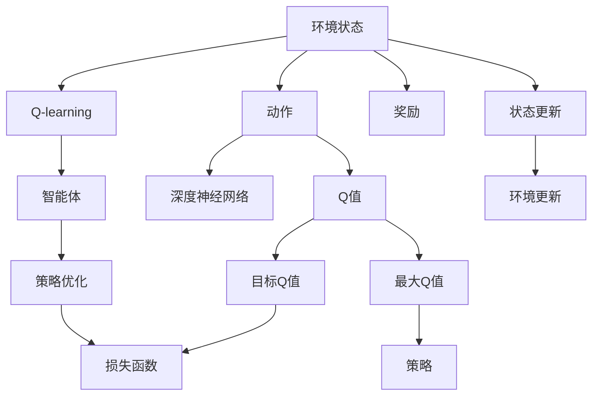

                 

## 1. 背景介绍

深度强化学习（Deep Reinforcement Learning, DRL）是一种融合深度学习与强化学习的新兴技术。它结合了深度神经网络对高维度数据建模的能力，和强化学习在智能决策上的优势，已经取得了显著的成果，比如AlphaGo、AlphaStar等。

其中，DQN（Deep Q-Network，深度Q网络）是DRL中一个重要的方法，由DeepMind公司提出，并在2015年的国际人工智能大会上展示了其在玩Atari游戏上的强大能力，引起了广泛关注。DQN通过结合深度学习和Q-learning，使智能体（agent）能够学会在未知环境中通过试错进行智能决策，达到最优策略。

### 1.1 问题由来

在传统的强化学习算法中，如Q-learning，智能体往往需要大量探索来估计Q值，从而确定最优策略。这需要大量的时间和计算资源，并且效率较低。而DQN通过深度神经网络，可以将Q值估计任务抽象为预测任务，在样本较少的情况下也能获得很好的效果。DQN是强化学习中深度学习的成功应用，它的提出将DRL推向了新的高度。

### 1.2 问题核心关键点

DQN的核心思想是通过深度神经网络来估计Q值，从而实现策略的优化。其主要步骤包括：

- 将环境状态作为输入，通过神经网络估计每个动作的Q值。
- 在每个时间步，智能体选择Q值最大的动作。
- 更新Q值，使得估计的Q值逐渐逼近真实Q值。

这一过程形成了一个循环，通过不断地在环境中交互，学习Q值，优化策略。

## 2. 核心概念与联系

### 2.1 核心概念概述

为更好地理解DQN的核心算法，本节将介绍几个关键概念：

- 深度Q网络（DQN）：一种结合深度神经网络和Q-learning的强化学习算法。通过深度神经网络来估计Q值，从而实现策略的优化。
- Q-learning：一种基于模型-自由算法，通过不断更新Q值，学习最优策略。
- 强化学习（RL）：一种智能体通过与环境交互，学习最优策略的过程。
- 环境状态（State）：描述环境的当前状态，如位置、速度、颜色等。
- 动作（Action）：智能体可以采取的行动，如左、右、上、下等。
- Q值（Q-value）：表示在当前状态下，执行某个动作后，期望获得的累计奖励。
- 深度神经网络（DNN）：一种多层次的非线性网络结构，可以处理高维度的输入数据。

这些概念之间的逻辑关系可以通过以下Mermaid流程图来展示：



这个流程图展示了大语言模型的核心概念及其之间的关系：

1. 环境状态和动作作为输入，通过深度神经网络估计Q值。
2. Q-learning算法用于更新Q值，学习最优策略。
3. 智能体根据Q值选择最大动作，实现策略优化。
4. 目标Q值和最大Q值用于计算损失函数，训练深度神经网络。
5. 环境状态的奖励和状态更新，指导智能体行动。

这些概念共同构成了DQN的学习框架，使其能够在各种环境中应用。

## 3. 核心算法原理 & 具体操作步骤
### 3.1 算法原理概述

DQN的算法原理主要基于Q-learning和深度神经网络，通过神经网络对高维输入进行建模，以估计Q值。算法的主要步骤如下：

1. 定义状态和动作空间。
2. 初始化深度神经网络，设置输入、输出层结构。
3. 随机选择一个动作，在环境中执行并获取奖励。
4. 根据当前状态、执行的动作和获得的奖励，通过Q-learning更新Q值。
5. 将Q值作为目标，训练神经网络，以最小化与目标Q值的差异。
6. 重复以上步骤，直到达到预设的停止条件。

DQN的核心在于将Q值估计任务抽象为预测任务，通过深度神经网络来逼近Q值，从而优化策略。

### 3.2 算法步骤详解

以下是DQN算法的详细步骤：

**Step 1: 定义环境**

在DQN中，环境是智能体（如游戏）交互的目标，需要定义环境的状态和动作空间。例如，在Atari游戏中，状态可以定义为游戏帧的像素值，动作可以是左、右、上、下等按键操作。

**Step 2: 初始化模型和超参数**

- 初始化深度神经网络，包括输入层、隐藏层、输出层等。
- 设置模型的超参数，如学习率、网络结构、批次大小等。

**Step 3: 随机选择动作**

在每个时间步，智能体随机选择一个动作，执行该动作并记录奖励。

**Step 4: 更新Q值**

- 根据当前状态和执行动作，计算Q值，与目标Q值进行比较。
- 使用交叉熵损失函数，计算Q值和目标Q值之间的误差。
- 通过反向传播算法，更新神经网络参数。

**Step 5: 训练神经网络**

- 通过神经网络预测Q值。
- 使用目标Q值训练神经网络，最小化误差。
- 更新神经网络参数。

**Step 6: 重复执行**

重复以上步骤，直到达到预设的停止条件，如达到预设的训练轮数或总奖励达到一定阈值。

### 3.3 算法优缺点

DQN的主要优点包括：

- 通过深度神经网络，能够处理高维度的状态空间。
- 可以并行计算多个动作的Q值，加快训练速度。
- 通过经验回放（Experience Replay），可以在一定程度上缓解过拟合问题。
- 在处理复杂环境时，能够学习到更为复杂的策略。

同时，DQN也存在一些缺点：

- 需要大量样本数据进行训练，数据收集和处理成本较高。
- 存在深度神经网络的训练稳定性和过拟合问题。
- 在处理连续状态空间时，存在状态离散化的问题。

### 3.4 算法应用领域

DQN的应用领域非常广泛，已经成功应用于各种游戏、机器人控制、自动驾驶等场景。例如：

- 在AlphaGo中，DQN被用来学习对弈策略。
- 在自动驾驶中，DQN可以优化车辆的行驶策略。
- 在游戏AI中，DQN可以学习最优游戏策略。
- 在机器人控制中，DQN可以学习最优控制策略。

## 4. 数学模型和公式 & 详细讲解 & 举例说明

### 4.1 数学模型构建

DQN的数学模型主要基于Q值和深度神经网络。假设环境状态为 $s_t$，动作为 $a_t$，当前奖励为 $r_t$，下一个状态为 $s_{t+1}$，Q值为 $Q(s_t,a_t)$，目标Q值为 $Q_{\theta}(s_{t+1},a_{t+1})$，深度神经网络参数为 $\theta$。

DQN的目标是最大化未来累计奖励，即：

$$
\max_{\theta} \sum_{t=0}^{+\infty} \gamma^t r_{t+1} + \gamma^{t+1} r_{t+2} + \cdots
$$

其中 $\gamma$ 为折扣因子。

### 4.2 公式推导过程

在DQN中，Q值可以通过神经网络来估计，即：

$$
Q(s_t,a_t) \approx \theta^T \phi(s_t,a_t)
$$

其中 $\phi(s_t,a_t)$ 为神经网络输出的向量，$\theta$ 为神经网络参数。

目标Q值可以通过未来奖励和状态值来计算，即：

$$
Q_{\theta}(s_{t+1},a_{t+1}) \approx \max_{a} \theta^T \phi(s_{t+1},a)
$$

通过神经网络估计Q值和目标Q值，可以计算出神经网络预测值与目标值之间的误差，即：

$$
L(\theta) = E[(Q(s_t,a_t) - \max_{a} Q_{\theta}(s_{t+1},a))^2]
$$

使用交叉熵损失函数，可以最小化预测值和目标值之间的误差：

$$
L(\theta) = -E[\log(Q_{\theta}(s_{t+1},\pi_{\theta}(s_{t+1}))]
$$

其中 $\pi_{\theta}(s)$ 为智能体根据神经网络估计Q值所选择的动作。

通过反向传播算法，更新神经网络参数 $\theta$：

$$
\theta \leftarrow \theta - \eta \nabla_{\theta}L(\theta)
$$

其中 $\eta$ 为学习率。

### 4.3 案例分析与讲解

以AlphaGo中的蒙特卡罗树搜索（Monte Carlo Tree Search, MCTS）算法为例，说明DQN如何在对弈中优化策略。

AlphaGo使用DQN学习对弈策略，通过对弈数据进行经验回放，训练神经网络来估计每个动作的价值。在每个时间步，智能体选择神经网络预测价值最大的动作，并在对弈中执行。通过对弈结果进行回放，更新神经网络参数，优化价值估计。通过不断迭代，AlphaGo能够学习到高水平的对弈策略。

在AlphaGo中，DQN的作用主要体现在以下几个方面：

- 对弈数据经验回放：将对弈数据存储到回放缓冲区中，用于神经网络的训练。
- 神经网络估计动作价值：通过神经网络估计每个动作的价值，选择最优动作。
- 神经网络训练：通过对弈数据更新神经网络参数，优化价值估计。

## 5. 项目实践：代码实例和详细解释说明
### 5.1 开发环境搭建

在进行DQN实践前，我们需要准备好开发环境。以下是使用Python进行TensorFlow实现DQN的环境配置流程：

1. 安装Anaconda：从官网下载并安装Anaconda，用于创建独立的Python环境。

2. 创建并激活虚拟环境：
```bash
conda create -n dqn-env python=3.8 
conda activate dqn-env
```

3. 安装TensorFlow和相关依赖：
```bash
conda install tensorflow
conda install gym
```

4. 安装OpenAI Gym：
```bash
pip install gym
```

完成上述步骤后，即可在`dqn-env`环境中开始DQN实践。

### 5.2 源代码详细实现

下面以DQN玩Atari游戏的代码实现为例，展示如何使用TensorFlow和Gym库实现DQN。

首先，导入必要的库：

```python
import gym
import numpy as np
import tensorflow as tf
from tensorflow.keras.models import Sequential
from tensorflow.keras.layers import Dense, Flatten, Conv2D
```

然后，定义DQN类：

```python
class DQN:
    def __init__(self, state_size, action_size, learning_rate, gamma, epsilon):
        self.state_size = state_size
        self.action_size = action_size
        self.learning_rate = learning_rate
        self.gamma = gamma
        self.epsilon = epsilon
        self.memory = []

    def build_model(self):
        self.model = Sequential()
        self.model.add(Conv2D(32, (8, 8), input_shape=(4, state_size, state_size), activation='relu'))
        self.model.add(Flatten())
        self.model.add(Dense(64, activation='relu'))
        self.model.add(Dense(self.action_size, activation='linear'))
        self.model.compile(loss='mse', optimizer=tf.keras.optimizers.Adam(lr=self.learning_rate))
        self.target_model = tf.keras.models.clone(self.model)

    def remember(self, state, action, reward, next_state, done):
        self.memory.append((state, action, reward, next_state, done))

    def act(self, state):
        if np.random.rand() < self.epsilon:
            return np.random.choice(self.action_size)
        act_values = self.model.predict(state)
        return np.argmax(act_values[0])

    def replay(self, batch_size):
        minibatch = np.random.choice(len(self.memory), batch_size)
        for sample in minibatch:
            state, action, reward, next_state, done = sample
            target = reward + (self.gamma * np.amax(self.model.predict(next_state)[0]))
            target_f = self.model.predict(state)
            target_f[0][action] = target
            self.model.fit(state, target_f, epochs=1, verbose=0)
            if done:
                target_q = reward
            else:
                target_q = (reward + self.gamma * np.amax(self.target_model.predict(next_state)[0]))
            self.target_model.fit(next_state, target_q, epochs=1, verbose=0)

    def update_model(self):
        self.target_model.set_weights(self.model.get_weights())
```

最后，进行DQN的训练和评估：

```python
state_size = 84
action_size = 6
learning_rate = 0.001
gamma = 0.95
epsilon = 0.1
batch_size = 32
memory_size = 10000
epochs = 2000

env = gym.make('Atari2048-v0')
env.reset()

dqn = DQN(state_size, action_size, learning_rate, gamma, epsilon)
dqn.build_model()

for i in range(epochs):
    state = np.reshape(env.reset(), (1, state_size, state_size, 1))
    done = False
    while not done:
        action = dqn.act(state)
        next_state, reward, done, _ = env.step(action)
        next_state = np.reshape(next_state, (1, state_size, state_size, 1))
        dqn.remember(state, action, reward, next_state, done)
        state = next_state
        if len(dqn.memory) > memory_size:
            dqn.memory.pop(0)
        if not done:
            dqn.replay(batch_size)
    dqn.update_model()

env.close()
```

以上就是使用TensorFlow和Gym库实现DQN的完整代码实现。可以看到，TensorFlow和Gym库使得DQN的实现变得简洁高效。

### 5.3 代码解读与分析

让我们再详细解读一下关键代码的实现细节：

**DQN类**：
- `__init__`方法：初始化状态、动作、学习率、折扣因子、ε-贪婪策略等关键参数。
- `build_model`方法：定义神经网络结构。
- `remember`方法：将状态、动作、奖励、下一状态、是否结束等信息存储到内存缓冲区。
- `act`方法：根据状态选择动作，使用ε-贪婪策略。
- `replay`方法：从内存缓冲区中随机抽取一批数据，更新神经网络参数。
- `update_model`方法：更新目标模型，使其与当前模型同步。

**训练流程**：
- 初始化环境，设置神经网络参数。
- 循环执行训练，每次重置环境，执行步骤，更新模型。
- 每次步骤中，根据状态选择动作，执行动作，记录奖励、状态和是否结束等信息。
- 如果内存缓冲区已满，弹出最早的记录。
- 每步结束后，将数据存储到内存缓冲区，并从内存缓冲区中抽取一批数据，更新神经网络参数。
- 每批数据更新后，更新目标模型，使其与当前模型同步。
- 整个训练结束后，关闭环境。

可以看到，DQN的训练过程通过神经网络来估计Q值，并通过经验回放（Experience Replay）来更新模型参数。这个过程形成了一个循环，通过不断地在环境中交互，学习Q值，优化策略。

## 6. 实际应用场景

### 6.1 智能游戏

DQN在游戏AI领域表现优异，已经在多个经典游戏中取得了突破性进展，如AlphaGo、AlphaStar等。DQN能够学习到高水平的策略，应对游戏中的复杂环境。

### 6.2 自动驾驶

自动驾驶中，DQN可以用于优化车辆的行驶策略，使其能够避免碰撞、选择合适的车道等。DQN通过学习交通规则和环境信息，能够在各种场景下做出最优决策。

### 6.3 机器人控制

DQN在机器人控制中也得到了广泛应用。例如，在机器人游戏《星际争霸II》中，DQN学习到最优控制策略，能够实现高度自动化的操作。

### 6.4 未来应用展望

随着DQN的不断发展，其应用领域将更加广泛，将在更多场景中发挥重要作用。

在智能制造中，DQN可以用于优化生产流程，提高生产效率。
在金融领域，DQN可以用于预测股票价格，优化投资策略。
在医疗领域，DQN可以用于治疗方案优化，提高治疗效果。

## 7. 工具和资源推荐

### 7.1 学习资源推荐

为了帮助开发者系统掌握DQN的理论基础和实践技巧，这里推荐一些优质的学习资源：

1. 《Deep Q-Learning with PyTorch》：使用PyTorch实现DQN的经典案例。
2. 《Hands-On Reinforcement Learning with TensorFlow》：使用TensorFlow实现DQN的详细教程。
3. 《Reinforcement Learning: An Introduction》：经典的强化学习教材，涵盖DQN等内容。
4. 《Playing Atari with Deep Reinforcement Learning》：DeepMind的DQN论文，详细介绍了DQN的原理和实现。
5. Udacity的《深度强化学习》课程：介绍DQN等DRL算法的深度课程。

通过对这些资源的学习实践，相信你一定能够快速掌握DQN的精髓，并用于解决实际的智能决策问题。

### 7.2 开发工具推荐

高效的开发离不开优秀的工具支持。以下是几款用于DQN开发的常用工具：

1. TensorFlow：由Google主导开发的开源深度学习框架，生产部署方便，适合大规模工程应用。
2. PyTorch：基于Python的开源深度学习框架，灵活动态的计算图，适合快速迭代研究。
3. OpenAI Gym：用于环境模拟的库，提供了各种环境接口，方便DQN测试。
4. Visual Studio Code：免费开源的IDE，支持Python开发，提供丰富的插件和扩展。
5. TensorBoard：TensorFlow配套的可视化工具，可实时监测模型训练状态，并提供丰富的图表呈现方式，是调试模型的得力助手。

合理利用这些工具，可以显著提升DQN的开发效率，加快创新迭代的步伐。

### 7.3 相关论文推荐

DQN的研究始于2013年，不断有新的成果涌现。以下是几篇奠基性的相关论文，推荐阅读：

1. AlphaGo Zero：2017年，DeepMind公司提出AlphaGo Zero，使用蒙特卡罗树搜索和深度强化学习，实现了在没有人类干预的情况下，击败最强的人类和计算机对手。
2. DeepMind Atari 2048：2013年，DeepMind公司通过DQN成功训练了Atari 2048游戏AI，实现了玩游戏的能力。
3. Human-level control through deep reinforcement learning：2016年，DeepMind公司通过DQN在机器人游戏中实现了人类级的控制能力。
4. Curiosity driven learning with reinforcement learning and deep neural networks：2013年，DeepMind公司通过DQN在机器人控制中实现了自我学习。

这些论文代表了大语言模型微调技术的发展脉络。通过学习这些前沿成果，可以帮助研究者把握学科前进方向，激发更多的创新灵感。

## 8. 总结：未来发展趋势与挑战

### 8.1 总结

本文对深度Q网络（DQN）的算法原理进行了全面系统的介绍。首先阐述了DQN的基本思想和核心算法，展示了其在高维输入下的强大建模能力。其次，通过Python和TensorFlow的代码实现，详细讲解了DQN的训练过程，帮助读者理解DQN的实际应用。

通过本文的系统梳理，可以看到，DQN通过结合深度学习和强化学习，实现了智能体的智能决策，具有广泛的应用前景。未来，伴随算法的不断演进和数据量的不断增加，DQN将在更多领域发挥重要作用。

### 8.2 未来发展趋势

展望未来，DQN的发展趋势将主要体现在以下几个方面：

1. 参数化和计算高效化：开发更加参数高效的DQN方法，如MADDPG、SoftQN等，减小模型参数量，提升训练效率。
2. 多智能体学习：通过多智能体学习，学习复杂的合作策略，优化多智能体系统的性能。
3. 自适应学习：通过自适应学习，提高智能体的学习速度和适应性，更好地应对环境变化。
4. 可解释性：开发可解释的DQN方法，提高智能体的透明度和可信度。
5. 多领域应用：将DQN应用于更多领域，如医疗、金融、交通等，解决复杂的智能决策问题。

以上趋势凸显了DQN的广阔前景。这些方向的探索发展，必将进一步提升DQN的应用效果，为智能决策系统提供更强大的支撑。

### 8.3 面临的挑战

尽管DQN已经取得了显著的成果，但在迈向更加智能化、普适化应用的过程中，仍面临诸多挑战：

1. 数据需求高：DQN需要大量的环境数据进行训练，数据收集和处理成本较高。
2. 训练时间长：DQN在复杂环境中训练时间较长，需要耗费大量计算资源。
3. 模型复杂度高：DQN的神经网络结构复杂，难以调试和优化。
4. 鲁棒性不足：DQN在复杂环境中鲁棒性不足，容易受到环境变化的影响。
5. 可解释性差：DQN的智能体决策过程缺乏可解释性，难以进行调试和优化。

### 8.4 研究展望

面对DQN所面临的挑战，未来的研究需要在以下几个方面寻求新的突破：

1. 数据增强：通过数据增强技术，提高训练数据的多样性和质量，提升训练效果。
2. 模型简化：通过模型简化技术，减少神经网络参数量，提高训练效率。
3. 自适应学习：开发自适应学习算法，提高智能体的适应性和学习效率。
4. 可解释性：通过可解释性技术，提高智能体的透明度和可信度。
5. 多领域应用：将DQN应用于更多领域，解决复杂的智能决策问题。

这些研究方向将推动DQN技术的发展，提升其在实际应用中的效果和可靠性。总之，DQN需要从数据、模型、算法等多个维度进行全面优化，才能更好地应用于复杂的智能决策问题。

## 9. 附录：常见问题与解答

**Q1：DQN如何实现策略优化？**

A: DQN通过深度神经网络来估计Q值，即Q(s, a) = f(s, a)。在每个时间步，智能体选择Q值最大的动作，即argmax(Q(s,a))。通过不断更新Q值，智能体学习到最优策略。

**Q2：DQN的训练过程为何需要经验回放？**

A: 经验回放是一种常用的数据增强技术，可以缓解神经网络的过拟合问题。DQN通过将过去的经验数据存储在缓冲区中，然后随机抽取数据进行训练，从而减少了过拟合风险，提高了训练效果。

**Q3：DQN的神经网络结构如何设计？**

A: DQN的神经网络结构一般包括输入层、隐藏层、输出层等。输入层通常采用卷积神经网络（CNN）结构，可以处理高维输入。隐藏层和输出层可以采用全连接神经网络（FCN）结构，用于学习Q值。

**Q4：DQN在训练过程中需要注意哪些问题？**

A: 在DQN的训练过程中，需要注意以下问题：
1. 数据收集和处理成本高，需要大量的环境数据。
2. 训练时间较长，需要耗费大量计算资源。
3. 神经网络结构复杂，难以调试和优化。
4. 鲁棒性不足，容易受到环境变化的影响。
5. 可解释性差，难以进行调试和优化。

**Q5：DQN的应用场景有哪些？**

A: DQN的应用场景非常广泛，包括游戏AI、自动驾驶、机器人控制等。例如，在AlphaGo中，DQN用于学习对弈策略。在自动驾驶中，DQN可以优化车辆的行驶策略。在机器人控制中，DQN可以学习最优控制策略。

通过对这些问题的解答，相信读者能够更深入地理解DQN的原理和实现方法，掌握其应用技巧。

---

作者：禅与计算机程序设计艺术 / Zen and the Art of Computer Programming

