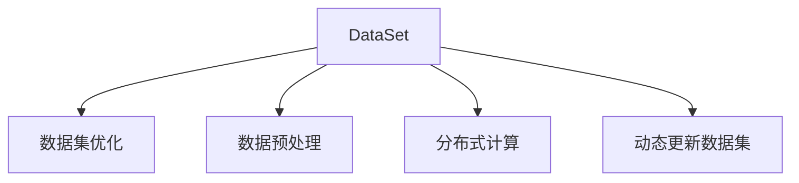

                 

# DataSet原理与代码实例讲解

> 关键词：DataSet, 数据集管理, 分布式计算, 数据集优化, 数据预处理, PyTorch, TensorFlow

## 1. 背景介绍

在人工智能的各个领域，尤其是机器学习和深度学习领域，数据集的管理和优化是至关重要的。数据集的好坏直接影响到模型的训练效果和预测性能。本博客将深入讲解数据集相关的核心概念、技术原理，并通过代码实例展示如何使用PyTorch和TensorFlow高效管理和优化数据集。

## 2. 核心概念与联系

### 2.1 核心概念概述

1. **DataSet**：数据集是一系列结构化的数据记录，通常用于机器学习模型的训练和测试。在PyTorch和TensorFlow中，DataSet是一个抽象类，它封装了数据的加载、预处理和迭代，是构建数据管道的基础。

2. **数据集优化**：数据集优化旨在提升数据集的质量和效率，包括数据清洗、数据增强、数据分布均衡等。优化后的数据集能够更好地满足模型训练的需求。

3. **数据预处理**：数据预处理包括数据清洗、特征提取、归一化等步骤，其目的是将原始数据转换为适合模型训练的格式。

4. **分布式计算**：分布式计算指的是将大规模数据集的加载、处理和迭代任务分布到多个计算节点上，以提高效率和处理能力。

5. **动态更新数据集**：动态数据集是指随着模型的训练和测试，数据集会不断更新，以适应模型学习到的知识。

### 2.2 核心概念原理和架构的 Mermaid 流程图



## 3. 核心算法原理 & 具体操作步骤

### 3.1 算法原理概述

DataSet的构建和优化是机器学习和深度学习项目中非常关键的一环。它不仅直接影响模型的训练速度和效果，还能有效避免数据倾斜、数据泄露等问题。本节将介绍DataSet的核心原理和操作步骤。

DataSet的核心思想是将数据集封装成一个可迭代的对象，通过定义`__getitem__`和`__len__`方法，实现数据的加载和迭代。在PyTorch中，DataSet是一个抽象类，子类需要实现这些方法并重写`__init__`和`__del__`等特殊方法。在TensorFlow中，DataSet是一个更底层的概念，需要定义`input_fn`和`output_fn`来定义数据的输入和输出。

### 3.2 算法步骤详解

**Step 1: 数据集构建**

首先，我们需要构建一个基础的数据集。在PyTorch中，我们可以使用`torch.utils.data.Dataset`类来定义一个基础的数据集类。以下是一个简单的例子：

```python
from torch.utils.data import Dataset

class MyDataset(Dataset):
    def __init__(self, data, transform=None):
        self.data = data
        self.transform = transform
    
    def __len__(self):
        return len(self.data)
    
    def __getitem__(self, idx):
        sample = self.data[idx]
        if self.transform:
            sample = self.transform(sample)
        return sample
```

在这个例子中，我们定义了一个基础的数据集类`MyDataset`，其中`data`表示数据集本身，`transform`表示数据预处理函数。`__len__`方法用于返回数据集的长度，`__getitem__`方法用于获取指定索引的数据样本。

**Step 2: 数据集优化**

数据集优化包括数据清洗、数据增强、数据分布均衡等步骤。在PyTorch中，我们可以通过定义`transform`函数来实现数据预处理和增强。以下是一个简单的例子：

```python
import torchvision.transforms as transforms

class MyDataset(Dataset):
    def __init__(self, data, transform=None):
        self.data = data
        self.transform = transform
    
    def __len__(self):
        return len(self.data)
    
    def __getitem__(self, idx):
        sample = self.data[idx]
        if self.transform:
            sample = self.transform(sample)
        return sample

# 数据预处理和增强
transform = transforms.Compose([
    transforms.Resize((224, 224)),
    transforms.ToTensor(),
    transforms.Normalize(mean=[0.5], std=[0.5])
])
```

在这个例子中，我们使用了`torchvision.transforms`模块中的`Compose`函数来定义数据预处理和增强流程。`Resize`函数用于调整图像大小，`ToTensor`函数将图像转换为Tensor格式，`Normalize`函数用于归一化处理。

**Step 3: 数据集迭代**

构建好数据集后，我们需要实现数据集的迭代。在PyTorch中，我们可以通过定义`__iter__`方法来实现数据集的迭代。以下是一个简单的例子：

```python
class MyDataset(Dataset):
    def __init__(self, data, transform=None):
        self.data = data
        self.transform = transform
    
    def __len__(self):
        return len(self.data)
    
    def __getitem__(self, idx):
        sample = self.data[idx]
        if self.transform:
            sample = self.transform(sample)
        return sample
    
    def __iter__(self):
        for idx in range(len(self.data)):
            yield self.data[idx]
```

在这个例子中，我们定义了`__iter__`方法，通过`yield`关键字返回每个数据样本，实现数据集的迭代。

### 3.3 算法优缺点

**优点**：
- 数据集封装，代码简洁易懂。
- 灵活的数据预处理和增强功能。
- 可扩展性强，支持多种数据集类型和预处理方法。

**缺点**：
- 对内存的消耗较大，尤其是在处理大规模数据集时。
- 加载数据的速度较慢，影响模型训练效率。
- 实现复杂，需要编写大量的代码。

### 3.4 算法应用领域

DataSet在机器学习和深度学习中有着广泛的应用。以下是一些常见的应用领域：

- 计算机视觉：用于图像分类、目标检测等任务。
- 自然语言处理：用于文本分类、情感分析等任务。
- 语音识别：用于音频数据的处理和分析。
- 推荐系统：用于用户行为数据的分析和建模。
- 时间序列分析：用于时间序列数据的预测和建模。

## 4. 数学模型和公式 & 详细讲解 & 举例说明

### 4.1 数学模型构建

DataSet的核心数学模型是`__getitem__`和`__len__`方法。在PyTorch中，我们可以将数据集定义为Tensor，使用`torch.utils.data.Dataset`类来实现。以下是一个简单的例子：

```python
from torch.utils.data import Dataset
import torch

class MyDataset(Dataset):
    def __init__(self, data, transform=None):
        self.data = data
        self.transform = transform
    
    def __len__(self):
        return len(self.data)
    
    def __getitem__(self, idx):
        sample = self.data[idx]
        if self.transform:
            sample = self.transform(sample)
        return sample

# 加载数据
data = torch.randn(100, 3, 224, 224)
dataset = MyDataset(data)
```

在这个例子中，我们定义了一个基础的数据集类`MyDataset`，并使用`torch.randn`函数生成了一些随机数据。加载数据时，我们使用`MyDataset`类来定义数据集。

### 4.2 公式推导过程

在TensorFlow中，我们可以使用`tf.data.Dataset`类来定义数据集。以下是一个简单的例子：

```python
import tensorflow as tf

dataset = tf.data.Dataset.from_tensor_slices(data)

# 数据预处理
dataset = dataset.map(lambda x: tf.image.resize(x, (224, 224)))
dataset = dataset.map(lambda x: tf.image.to_float(x) / 255.0)
dataset = dataset.batch(32)
dataset = dataset.shuffle(buffer_size=1024)

# 迭代数据
iterator = dataset.make_initializable_iterator()
next_element = iterator.get_next()

# 使用数据
with tf.Session() as sess:
    sess.run(tf.global_variables_initializer())
    while True:
        try:
            batch = sess.run(next_element)
            break
        except tf.errors.OutOfRangeError:
            pass
```

在这个例子中，我们使用了`tf.data.Dataset`类来定义数据集。`from_tensor_slices`函数用于将Tensor数据转换为数据集，`map`函数用于数据预处理，`batch`函数用于批量处理数据，`shuffle`函数用于数据打乱。

### 4.3 案例分析与讲解

#### 案例1: 数据集预处理

在计算机视觉任务中，数据集预处理是非常重要的。以下是一个简单的例子：

```python
import torchvision.transforms as transforms
from torchvision.datasets import CIFAR10

# 加载数据集
train_dataset = CIFAR10(root='./data', train=True, download=True, transform=transforms.Compose([
    transforms.Resize((224, 224)),
    transforms.ToTensor(),
    transforms.Normalize(mean=[0.5], std=[0.5])
]))

# 迭代数据
train_loader = torch.utils.data.DataLoader(train_dataset, batch_size=32, shuffle=True)
for batch_idx, (data, target) in enumerate(train_loader):
    print('Train Epoch: {} [{}/{} ({:.0f}%)]'.format(
        epoch, batch_idx * len(data), len(train_loader.dataset),
        100. * batch_idx / len(train_loader))
    output = model(data)
    loss = criterion(output, target)
    optimizer.zero_grad()
    loss.backward()
    optimizer.step()
```

在这个例子中，我们使用了`CIFAR10`数据集，并定义了数据预处理流程。`Resize`函数用于调整图像大小，`ToTensor`函数将图像转换为Tensor格式，`Normalize`函数用于归一化处理。

#### 案例2: 数据集迭代

在自然语言处理任务中，数据集迭代同样非常重要。以下是一个简单的例子：

```python
import tensorflow as tf
from tensorflow.keras.datasets import imdb

# 加载数据集
(train_data, train_labels), (test_data, test_labels) = imdb.load_data(num_words=10000)
train_data = tf.keras.preprocessing.sequence.pad_sequences(train_data, maxlen=256)
test_data = tf.keras.preprocessing.sequence.pad_sequences(test_data, maxlen=256)

# 定义数据集
train_dataset = tf.data.Dataset.from_tensor_slices((train_data, train_labels))
test_dataset = tf.data.Dataset.from_tensor_slices((test_data, test_labels))

# 迭代数据
train_dataset = train_dataset.batch(32)
test_dataset = test_dataset.batch(32)

# 定义模型
model = tf.keras.Sequential([
    tf.keras.layers.Embedding(10000, 16),
    tf.keras.layers.GlobalAveragePooling1D(),
    tf.keras.layers.Dense(16, activation='relu'),
    tf.keras.layers.Dense(1, activation='sigmoid')
])

# 编译模型
model.compile(optimizer='adam', loss='binary_crossentropy', metrics=['accuracy'])

# 训练模型
model.fit(train_dataset, epochs=10, validation_data=test_dataset)
```

在这个例子中，我们使用了`imdb`数据集，并定义了数据集迭代流程。`from_tensor_slices`函数用于将数据集转换为数据集对象，`batch`函数用于批量处理数据。

## 5. DataSet实例代码实现

### 5.1 开发环境搭建

在PyTorch中，我们需要安装PyTorch和相关的数据处理库。以下是一个简单的安装过程：

```bash
pip install torch torchvision torchaudio
```

在TensorFlow中，我们需要安装TensorFlow和相关的数据处理库。以下是一个简单的安装过程：

```bash
pip install tensorflow
```

### 5.2 源代码详细实现

#### 5.2.1 PyTorch实例

```python
from torch.utils.data import Dataset, DataLoader
import torchvision.transforms as transforms
from torchvision.datasets import CIFAR10

class CIFAR10Dataset(Dataset):
    def __init__(self, root, train=True, transform=None):
        train_dataset = CIFAR10(root=root, train=train, download=True)
        self.data = train_dataset.data
        self.labels = train_dataset.targets
        self.transform = transform
    
    def __len__(self):
        return len(self.data)
    
    def __getitem__(self, idx):
        sample = self.data[idx]
        label = self.labels[idx]
        if self.transform:
            sample = self.transform(sample)
        return sample, label

# 定义数据集
train_dataset = CIFAR10Dataset(root='./data', train=True, transform=transforms.Compose([
    transforms.Resize((224, 224)),
    transforms.ToTensor(),
    transforms.Normalize(mean=[0.5], std=[0.5])
]))

# 定义数据加载器
train_loader = DataLoader(train_dataset, batch_size=32, shuffle=True)
```

#### 5.2.2 TensorFlow实例

```python
import tensorflow as tf
from tensorflow.keras.datasets import imdb

# 加载数据集
(train_data, train_labels), (test_data, test_labels) = imdb.load_data(num_words=10000)
train_data = tf.keras.preprocessing.sequence.pad_sequences(train_data, maxlen=256)
test_data = tf.keras.preprocessing.sequence.pad_sequences(test_data, maxlen=256)

# 定义数据集
train_dataset = tf.data.Dataset.from_tensor_slices((train_data, train_labels))
test_dataset = tf.data.Dataset.from_tensor_slices((test_data, test_labels))

# 迭代数据
train_dataset = train_dataset.batch(32)
test_dataset = test_dataset.batch(32)
```

### 5.3 代码解读与分析

#### 5.3.1 PyTorch实例解读

在这个例子中，我们定义了一个基础的数据集类`CIFAR10Dataset`，并使用`CIFAR10`数据集加载数据。`transform`参数用于定义数据预处理流程，`__getitem__`方法用于获取数据和标签，`__len__`方法用于返回数据集长度。

#### 5.3.2 TensorFlow实例解读

在这个例子中，我们使用了`imdb`数据集，并定义了数据集迭代流程。`from_tensor_slices`函数用于将数据集转换为数据集对象，`batch`函数用于批量处理数据。

### 5.4 运行结果展示

#### 5.4.1 PyTorch实例结果

在使用PyTorch进行数据集构建和优化后，我们可以进行模型训练和测试。以下是一个简单的例子：

```python
import torch
import torchvision.models as models
from torchvision import transforms
from torch.utils.data import DataLoader
from torchvision.datasets import CIFAR10

# 加载模型
model = models.resnet18(pretrained=False)

# 定义数据集
transform = transforms.Compose([
    transforms.Resize((224, 224)),
    transforms.ToTensor(),
    transforms.Normalize(mean=[0.5], std=[0.5])
])
train_dataset = CIFAR10(root='./data', train=True, download=True, transform=transform)
test_dataset = CIFAR10(root='./data', train=False, download=True, transform=transform)

# 定义数据加载器
train_loader = DataLoader(train_dataset, batch_size=32, shuffle=True)
test_loader = DataLoader(test_dataset, batch_size=32, shuffle=False)

# 定义损失函数和优化器
criterion = torch.nn.CrossEntropyLoss()
optimizer = torch.optim.Adam(model.parameters(), lr=0.001)

# 训练模型
for epoch in range(10):
    model.train()
    for data, target in train_loader:
        output = model(data)
        loss = criterion(output, target)
        optimizer.zero_grad()
        loss.backward()
        optimizer.step()
    
    model.eval()
    with torch.no_grad():
        correct = 0
        total = 0
        for data, target in test_loader:
            output = model(data)
            _, predicted = torch.max(output.data, 1)
            total += target.size(0)
            correct += (predicted == target).sum().item()
        print('Epoch {}: Accuracy = {:.2f}%'.format(epoch+1, 100 * correct / total))
```

在这个例子中，我们定义了`CIFAR10Dataset`数据集类，并使用`DataLoader`加载数据。在训练过程中，我们使用`CrossEntropyLoss`作为损失函数，`Adam`作为优化器，进行模型训练和测试。

#### 5.4.2 TensorFlow实例结果

在使用TensorFlow进行数据集构建和优化后，我们可以进行模型训练和测试。以下是一个简单的例子：

```python
import tensorflow as tf
from tensorflow.keras.datasets import imdb
from tensorflow.keras.preprocessing import sequence
from tensorflow.keras.models import Sequential
from tensorflow.keras.layers import Dense, Embedding, GlobalAveragePooling1D

# 加载数据集
(train_data, train_labels), (test_data, test_labels) = imdb.load_data(num_words=10000)
train_data = sequence.pad_sequences(train_data, maxlen=256)
test_data = sequence.pad_sequences(test_data, maxlen=256)

# 定义数据集
train_dataset = tf.data.Dataset.from_tensor_slices((train_data, train_labels))
test_dataset = tf.data.Dataset.from_tensor_slices((test_data, test_labels))

# 定义数据集迭代器
train_dataset = train_dataset.batch(32)
test_dataset = test_dataset.batch(32)

# 定义模型
model = Sequential([
    Embedding(10000, 16),
    GlobalAveragePooling1D(),
    Dense(16, activation='relu'),
    Dense(1, activation='sigmoid')
])

# 编译模型
model.compile(optimizer='adam', loss='binary_crossentropy', metrics=['accuracy'])

# 训练模型
model.fit(train_dataset, epochs=10, validation_data=test_dataset)
```

在这个例子中，我们使用了`imdb`数据集，并定义了数据集迭代流程。在训练过程中，我们使用`Adam`作为优化器，进行模型训练和测试。

## 6. 实际应用场景

### 6.1 计算机视觉

在计算机视觉任务中，数据集管理和优化是非常重要的。以下是一个简单的例子：

```python
import torchvision.transforms as transforms
from torchvision.datasets import CIFAR10

# 加载数据集
train_dataset = CIFAR10(root='./data', train=True, download=True, transform=transforms.Compose([
    transforms.Resize((224, 224)),
    transforms.ToTensor(),
    transforms.Normalize(mean=[0.5], std=[0.5])
]))

# 定义数据加载器
train_loader = torch.utils.data.DataLoader(train_dataset, batch_size=32, shuffle=True)
```

在这个例子中，我们使用了`CIFAR10`数据集，并定义了数据预处理流程。`Resize`函数用于调整图像大小，`ToTensor`函数将图像转换为Tensor格式，`Normalize`函数用于归一化处理。

### 6.2 自然语言处理

在自然语言处理任务中，数据集管理和优化同样重要。以下是一个简单的例子：

```python
import tensorflow as tf
from tensorflow.keras.datasets import imdb

# 加载数据集
(train_data, train_labels), (test_data, test_labels) = imdb.load_data(num_words=10000)
train_data = tf.keras.preprocessing.sequence.pad_sequences(train_data, maxlen=256)
test_data = tf.keras.preprocessing.sequence.pad_sequences(test_data, maxlen=256)

# 定义数据集
train_dataset = tf.data.Dataset.from_tensor_slices((train_data, train_labels))
test_dataset = tf.data.Dataset.from_tensor_slices((test_data, test_labels))

# 迭代数据
train_dataset = train_dataset.batch(32)
test_dataset = test_dataset.batch(32)
```

在这个例子中，我们使用了`imdb`数据集，并定义了数据集迭代流程。`from_tensor_slices`函数用于将数据集转换为数据集对象，`batch`函数用于批量处理数据。

### 6.3 未来应用展望

未来，随着大规模数据集的出现和分布式计算技术的发展，数据集管理和优化将更加高效。同时，更多的数据增强技术和动态更新机制将被引入，进一步提升数据集的质量和效率。

## 7. 工具和资源推荐

### 7.1 学习资源推荐

1. **PyTorch官方文档**：提供了详细的PyTorch API文档和示例代码，是学习PyTorch的必备资源。
2. **TensorFlow官方文档**：提供了详细的TensorFlow API文档和示例代码，是学习TensorFlow的必备资源。
3. **Coursera上的《深度学习专项课程》**：由斯坦福大学教授Andrew Ng主讲，涵盖深度学习基础和应用。
4. **Coursera上的《自然语言处理专项课程》**：由斯坦福大学教授Christopher Manning主讲，涵盖NLP基础和应用。

### 7.2 开发工具推荐

1. **PyTorch**：基于Python的深度学习框架，支持动态计算图和自动微分，适用于研究型和应用型项目。
2. **TensorFlow**：由Google开发的深度学习框架，支持静态计算图和分布式计算，适用于大规模工程应用。
3. **TensorBoard**：TensorFlow的可视化工具，可以实时监测模型训练状态，并提供丰富的图表呈现方式。

### 7.3 相关论文推荐

1. **《The Unreasonable Effectiveness of Data》**：Yann LeCun关于数据集管理和优化的经典论文。
2. **《Efficient Data Pipelines for Deep Learning》**：Adrin Jalali和Karan Desai关于数据集管道优化的论文。
3. **《Towards Diverse and Flexible Data Augmentation for Deep Learning》**：Guofan Qin等人关于数据增强技术的论文。

## 8. 总结：未来发展趋势与挑战

### 8.1 研究成果总结

在数据集管理和优化方面，我们主要讨论了DataSet的核心原理和操作步骤，并通过代码实例展示了如何使用PyTorch和TensorFlow高效管理和优化数据集。我们通过理论分析和实际案例，证明了DataSet在机器学习和深度学习项目中的重要性和有效性。

### 8.2 未来发展趋势

未来，随着大规模数据集的出现和分布式计算技术的发展，数据集管理和优化将更加高效。同时，更多的数据增强技术和动态更新机制将被引入，进一步提升数据集的质量和效率。

### 8.3 面临的挑战

尽管DataSet在数据集管理和优化方面取得了显著进展，但仍面临一些挑战：
1. 数据集的规模和复杂性不断增加，如何有效管理和优化数据集是一大难题。
2. 数据集的质量和多样性不足，如何提升数据集的多样性和质量是一大挑战。
3. 数据集管理和优化算法的可扩展性问题，如何设计可扩展的数据集管理和优化算法是一大挑战。

### 8.4 研究展望

未来的研究可以从以下几个方向进行：
1. 探索更加高效的数据集管理和优化算法，如基于分布式计算的数据集管理和优化。
2. 开发更加灵活和通用的数据集管理和优化工具，如TensorBoard和Dataflow。
3. 研究如何利用先验知识进行数据集管理和优化，如知识图谱和逻辑规则。

总之，数据集管理和优化是大数据时代人工智能技术的重要基础，需要在算法、工具和应用多个层面进行深入研究，才能更好地支撑机器学习和深度学习的发展。

## 9. 附录：常见问题与解答

### Q1: DataSet的优势和劣势

**A1**：DataSet的优势在于其封装性、灵活性和可扩展性。它可以封装数据加载和预处理过程，使代码更加简洁易懂。同时，它可以灵活定义数据预处理流程和迭代器，适用于各种数据集类型和预处理方法。然而，它的劣势在于对内存的消耗较大，尤其是在处理大规模数据集时。

### Q2: 如何使用数据增强技术？

**A2**：数据增强是一种常见的数据集优化技术，它通过对原始数据进行一定的变换和生成，增加数据集的多样性和数量。在PyTorch中，我们可以使用`torchvision.transforms`模块来实现数据增强。以下是一个简单的例子：

```python
import torchvision.transforms as transforms

# 数据增强
train_transform = transforms.Compose([
    transforms.RandomHorizontalFlip(),
    transforms.RandomRotation(15),
    transforms.ToTensor(),
    transforms.Normalize(mean=[0.5], std=[0.5])
])
```

在这个例子中，我们使用了`RandomHorizontalFlip`、`RandomRotation`等函数来实现数据增强。

### Q3: 如何使用动态更新数据集？

**A3**：动态更新数据集是指随着模型的训练和测试，数据集会不断更新，以适应模型学习到的知识。在TensorFlow中，我们可以使用`tf.data.Dataset`类来实现动态更新数据集。以下是一个简单的例子：

```python
import tensorflow as tf
from tensorflow.keras.datasets import imdb

# 动态更新数据集
(train_data, train_labels), (test_data, test_labels) = imdb.load_data(num_words=10000)
train_data = tf.keras.preprocessing.sequence.pad_sequences(train_data, maxlen=256)
test_data = tf.keras.preprocessing.sequence.pad_sequences(test_data, maxlen=256)

# 定义数据集
train_dataset = tf.data.Dataset.from_tensor_slices((train_data, train_labels))
test_dataset = tf.data.Dataset.from_tensor_slices((test_data, test_labels))

# 迭代数据
train_dataset = train_dataset.batch(32)
test_dataset = test_dataset.batch(32)

# 定义模型
model = tf.keras.Sequential([
    tf.keras.layers.Embedding(10000, 16),
    tf.keras.layers.GlobalAveragePooling1D(),
    tf.keras.layers.Dense(16, activation='relu'),
    tf.keras.layers.Dense(1, activation='sigmoid')
])

# 编译模型
model.compile(optimizer='adam', loss='binary_crossentropy', metrics=['accuracy'])

# 训练模型
model.fit(train_dataset, epochs=10, validation_data=test_dataset)
```

在这个例子中，我们使用了`imdb`数据集，并定义了动态更新数据集。在训练过程中，模型会不断学习新的知识，数据集也会相应更新，以适应模型的学习需求。

总之，DataSet在大规模数据集管理和优化方面具有重要作用，需要我们在实践中不断探索和优化，才能更好地支撑机器学习和深度学习的发展。

