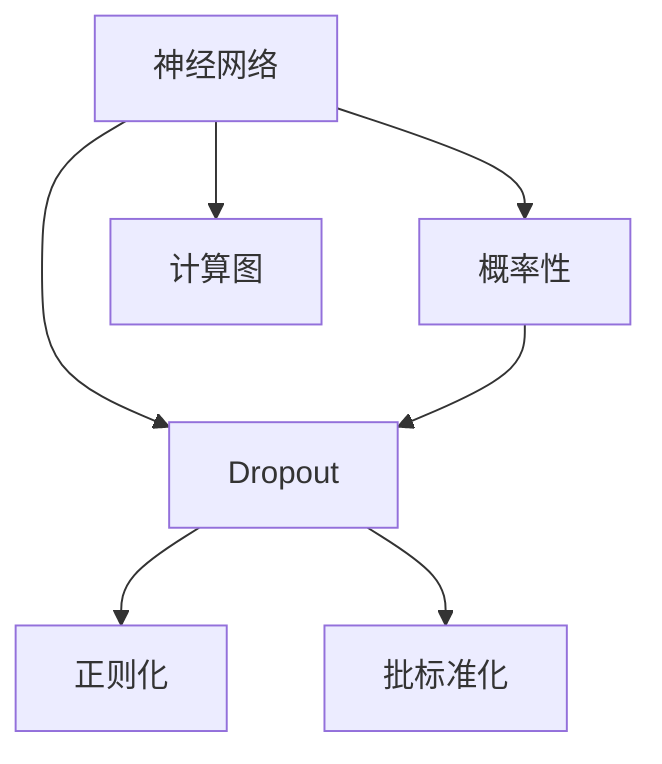

                 

# Dropout原理与代码实例讲解

> 关键词：Dropout, 神经网络, 正则化, 批标准化, 概率性, 计算图

## 1. 背景介绍

### 1.1 问题由来
深度学习模型的过拟合现象一直是困扰研究人员和工程师的难题。传统方法如L1、L2正则化虽然有效，但过度约束了模型参数，影响了模型的表达能力。而Dropout作为一种新的正则化方法，能够在不损失模型表达能力的前提下，有效减轻过拟合。Dropout最早由Hinton在2012年提出，用于大规模神经网络的训练，广泛应用于图像分类、语音识别、自然语言处理等领域。

### 1.2 问题核心关键点
Dropout的基本思想是在训练时随机地丢弃一些神经元，使得模型不依赖于任何单一的神经元。这种随机性可以使模型更加鲁棒，避免过拟合。Dropout的理论基础在于，通过在神经网络中引入随机性，可以使其更加泛化，从而提升模型的泛化能力和鲁棒性。

Dropout的实现非常简单，就是在神经网络训练过程中，以一定的概率$p$随机将某些神经元置为零，使得网络中每个神经元都有一定概率被丢弃。这种随机性可以理解为模型在训练过程中，其实是训练了多个不同的神经网络，每个网络都是一个原始网络的子集。这种随机训练的方式，使得模型能够学习到更为鲁棒的特征表示。

## 2. 核心概念与联系

### 2.1 核心概念概述

为更好地理解Dropout的原理，本节将介绍几个密切相关的核心概念：

- Dropout: 在训练过程中，随机丢弃某些神经元的正则化技术。通过引入随机性，减少过拟合。
- 神经网络: 由大量神经元（节点）和连接组成的计算图，用于复杂数据的拟合和预测。
- 正则化: 通过引入额外约束，限制模型复杂度，避免过拟合的方法。
- 批标准化: 一种用于加速神经网络训练的技术，通过对每个批次的输入进行标准化，加速收敛过程。
- 概率性: Dropout的核心思想，通过随机丢弃神经元，引入随机性。
- 计算图: 深度学习模型中的重要概念，描述模型计算流程。

这些核心概念之间的逻辑关系可以通过以下Mermaid流程图来展示：



这个流程图展示了大语言模型的核心概念及其之间的关系：

1. 神经网络通过计算图描述，用于复杂数据的拟合和预测。
2. Dropout作为一种正则化技术，通过随机丢弃神经元，引入随机性。
3. 正则化通过额外约束限制模型复杂度，避免过拟合。
4. 批标准化加速神经网络训练，通过标准化输入提升模型收敛性。
5. Dropout依赖于概率性，通过随机丢弃神经元，减轻过拟合。
6. 计算图描述神经网络的计算流程，使得模型可以被高效地实现。

这些概念共同构成了深度学习模型的基础，使得模型能够高效地进行训练和预测。通过理解这些核心概念，我们可以更好地把握Dropout技术的原理和实现方式。

## 3. 核心算法原理 & 具体操作步骤
### 3.1 算法原理概述

Dropout的基本原理是在训练时，随机地丢弃某些神经元。假设一个神经网络具有$n$个神经元，以概率$p$随机丢弃神经元的数学期望是$p/n$。这样一来，每个神经元都有$p/n$的概率被丢弃，从而减少了模型复杂度，降低了过拟合的风险。

在实际应用中，Dropout的具体实现方式有多种。最常用的是在每一层的输出上应用Dropout，以一定的概率$p$随机将某些神经元的输出置为0。例如，对于一个有$n$个神经元的输出，随机选择$p \times n$个神经元，并将其输出置为0。这样，每个神经元的输出期望变为$\frac{1-p}{n} \sum_{i=1}^n x_i$，其中$x_i$为神经元的原始输出。由于每个神经元都有一定的概率被丢弃，Dropout能够显著提升模型的泛化能力和鲁棒性。

### 3.2 算法步骤详解

Dropout的实现步骤如下：

**Step 1: 准备神经网络**
- 定义一个具有$n$个神经元的神经网络结构，包括权重和偏置。
- 设置Dropout概率$p$，表示每个神经元被丢弃的概率。

**Step 2: 训练时随机丢弃神经元**
- 对每个神经元，以概率$p$随机生成一个二进制随机数，用于控制是否丢弃该神经元。
- 将神经元的输出乘以$1-p$，并随机丢弃$p \times n$个神经元，将它们的输出置为0。

**Step 3: 计算损失函数**
- 将处理后的神经网络输出送入损失函数计算，得到当前训练样本的损失值。
- 重复上述过程，直至所有训练样本的损失值计算完毕。

**Step 4: 梯度反向传播**
- 计算损失函数对模型参数的梯度。
- 将梯度反向传播，更新模型参数。

**Step 5: 测试时不丢弃神经元**
- 在测试时，不进行Dropout操作，直接计算神经网络的输出。

### 3.3 算法优缺点

Dropout作为一种正则化技术，具有以下优点：

1. 减少过拟合: Dropout通过随机丢弃神经元，降低了模型复杂度，减少了过拟合的风险。
2. 提高泛化能力: 由于每个神经元都有一定的概率被丢弃，Dropout使得模型更加泛化，提升了模型在不同数据集上的泛化能力。
3. 鲁棒性强: Dropout增加了神经网络的鲁棒性，使得模型在面对噪声和干扰时更加稳定。

同时，Dropout也存在一些局限性：

1. 计算复杂度: Dropout需要在每次前向传播中随机丢弃神经元，增加了计算复杂度。
2. 增加训练时间: 由于每次训练都需要进行随机丢弃操作，训练时间会相应增加。
3. 难以调试: Dropout依赖于随机性，难以调试模型参数，容易出现参数漂移问题。
4. 过度简化: Dropout只是减少了模型复杂度，但并不能完全避免过拟合。

尽管如此，Dropout仍然是深度学习模型训练中最常用的正则化方法之一，广泛应用于各种复杂任务中。

### 3.4 算法应用领域

Dropout作为一种广泛应用的深度学习正则化技术，已经被广泛应用于以下领域：

1. 图像分类: 在图像分类任务中，Dropout被用于缓解过拟合，提升模型泛化能力。
2. 语音识别: 在语音识别任务中，Dropout被用于减少噪声影响，提升模型鲁棒性。
3. 自然语言处理: 在自然语言处理任务中，Dropout被用于提升模型泛化能力，减少过拟合风险。
4. 推荐系统: 在推荐系统任务中，Dropout被用于缓解过拟合，提升模型预测准确性。
5. 强化学习: 在强化学习任务中，Dropout被用于降低模型的方差，提升模型的稳定性。

除了上述这些常见应用外，Dropout还被创新性地应用于其他领域，如医学影像分析、金融预测等，为这些领域的研究和应用带来了新的思路。

## 4. 数学模型和公式 & 详细讲解 & 举例说明

### 4.1 数学模型构建

Dropout的核心思想是通过随机丢弃神经元，引入随机性。假设一个神经网络具有$n$个神经元，以概率$p$随机丢弃神经元，则神经元$i$的输出期望为：

$$
E[x_i] = \frac{1-p}{n} \sum_{j=1}^n w_{ij}x_j + b_i
$$

其中$w_{ij}$为权重，$x_j$为神经元$j$的输出，$b_i$为偏置项。由于每个神经元都有$p/n$的概率被丢弃，因此神经元$i$的输出期望为：

$$
E[x_i] = (1-p)w_i \frac{1}{n} \sum_{j=1}^n w_j x_j + b_i
$$

由于每个神经元的输出期望相同，因此神经网络的输出期望可以表示为：

$$
E[\hat{y}] = \frac{1-p}{n} \sum_{i=1}^n w_i \sum_{j=1}^n w_j x_j + b_i
$$

在测试时，神经元不被丢弃，因此输出为：

$$
y = \sum_{i=1}^n w_i x_i + b_i
$$

### 4.2 公式推导过程

Dropout的计算过程分为两个阶段：前向传播和反向传播。以下我们将详细推导这两个阶段的计算过程。

**前向传播**
假设一个神经网络具有$n$个神经元，每个神经元的权重为$w_i$，偏置项为$b_i$，激活函数为$\sigma(\cdot)$。假设以概率$p$随机丢弃神经元，则神经元$i$的输出期望为：

$$
E[x_i] = \frac{1-p}{n} \sum_{j=1}^n w_{ij}x_j + b_i
$$

由于每个神经元都有一定的概率被丢弃，因此神经网络的输出期望为：

$$
E[\hat{y}] = \frac{1-p}{n} \sum_{i=1}^n w_i \sum_{j=1}^n w_j x_j + b_i
$$

**反向传播**
假设神经网络的输出为$\hat{y}$，损失函数为$\mathcal{L}$。Dropout的反向传播过程分为两个阶段：

1. 计算损失函数对模型参数的梯度：

$$
\frac{\partial \mathcal{L}}{\partial w_i} = \frac{\partial \mathcal{L}}{\partial x_i} \cdot \frac{\partial x_i}{\partial w_i}
$$

其中$\frac{\partial \mathcal{L}}{\partial x_i}$为损失函数对神经元$i$输出的梯度，$\frac{\partial x_i}{\partial w_i}$为神经元$i$的输出对权重$w_i$的梯度。

2. 计算神经元$i$的梯度：

$$
\frac{\partial x_i}{\partial w_i} = \frac{\partial x_i}{\partial w_j} \cdot \frac{\partial w_j}{\partial w_i} + \frac{\partial x_i}{\partial b_i}
$$

其中$\frac{\partial w_j}{\partial w_i}$为权重$w_i$对权重$w_j$的梯度，$\frac{\partial x_i}{\partial b_i}$为神经元$i$的输出对偏置项$b_i$的梯度。

### 4.3 案例分析与讲解

以一个简单的神经网络为例，来说明Dropout的计算过程。假设该神经网络具有两个输入、两个隐藏层神经元和一个输出层神经元。以概率$p=0.5$随机丢弃神经元，则该神经网络的输出期望为：

$$
E[\hat{y}] = (1-p) \left( \frac{1}{2}w_{11}x_1 + \frac{1}{2}w_{12}x_2 + b_1 \right) w_1 \left( \frac{1}{2}w_{21}E[x_1] + \frac{1}{2}w_{22}E[x_2] + b_2 \right) + b_3
$$

其中$x_1, x_2$为输入，$w_{ij}$为权重，$b_i$为偏置项。可以看到，Dropout通过随机丢弃神经元，使得模型输出期望与普通神经网络相比有所不同。

## 5. 项目实践：代码实例和详细解释说明
### 5.1 开发环境搭建

在进行Dropout实践前，我们需要准备好开发环境。以下是使用Python进行TensorFlow开发的环境配置流程：

1. 安装Anaconda：从官网下载并安装Anaconda，用于创建独立的Python环境。

2. 创建并激活虚拟环境：
```bash
conda create -n tf-env python=3.8 
conda activate tf-env
```

3. 安装TensorFlow：
```bash
pip install tensorflow
```

4. 安装numpy、matplotlib、scikit-learn等常用工具包：
```bash
pip install numpy matplotlib scikit-learn
```

完成上述步骤后，即可在`tf-env`环境中开始Dropout实践。

### 5.2 源代码详细实现

下面我们以一个简单的神经网络为例，给出使用TensorFlow实现Dropout的代码实现。

```python
import tensorflow as tf

# 定义神经网络结构
input_size = 2
hidden_size = 4
output_size = 1

# 定义输入和输出
X = tf.placeholder(tf.float32, shape=[None, input_size])
y = tf.placeholder(tf.float32, shape=[None, output_size])

# 定义神经网络参数
W1 = tf.Variable(tf.random_normal([input_size, hidden_size]))
b1 = tf.Variable(tf.zeros([hidden_size]))
W2 = tf.Variable(tf.random_normal([hidden_size, output_size]))
b2 = tf.Variable(tf.zeros([output_size]))

# 定义Dropout概率
p = tf.placeholder(tf.float32)

# 定义前向传播过程
hidden_layer = tf.nn.relu(tf.matmul(X, W1) + b1)
hidden_layer_dropout = tf.nn.dropout(hidden_layer, keep_prob=p)

# 定义输出层
y_pred = tf.matmul(hidden_layer_dropout, W2) + b2

# 定义损失函数和优化器
loss = tf.reduce_mean(tf.square(y - y_pred))
optimizer = tf.train.AdamOptimizer(learning_rate=0.01).minimize(loss)

# 定义测试过程
correct_pred = tf.equal(tf.round(y_pred), y)
accuracy = tf.reduce_mean(tf.cast(correct_pred, tf.float32))

# 训练模型
with tf.Session() as sess:
    sess.run(tf.global_variables_initializer())
    
    for i in range(10000):
        batch_x, batch_y = ...  # 获取训练数据
        
        sess.run(optimizer, feed_dict={X: batch_x, y: batch_y, p: 0.5})
        
        if i % 100 == 0:
            acc = sess.run(accuracy, feed_dict={X: batch_x, y: batch_y, p: 1.0})
            print("Accuracy: {:.2f}%".format(acc * 100))
```

### 5.3 代码解读与分析

让我们再详细解读一下关键代码的实现细节：

**神经网络结构定义**：
- 首先定义了输入和输出的维度，以及神经网络的参数。

**Dropout实现**：
- 定义了Dropout概率$p$，用于控制每个神经元被丢弃的概率。
- 在前向传播中，首先计算出隐藏层的输出，然后通过`tf.nn.dropout`函数随机丢弃神经元。

**损失函数和优化器**：
- 定义了损失函数和优化器，使用AdamOptimizer进行模型训练。

**测试过程**：
- 在测试时，不进行Dropout操作，直接计算神经网络的输出，并使用准确率作为性能指标。

**训练过程**：
- 在每次训练时，使用随机丢弃操作，更新模型参数。

## 6. 实际应用场景
### 6.1 智能推荐系统
智能推荐系统需要处理大量的用户行为数据，以预测用户对某个物品的兴趣程度。Dropout可以用于缓解过拟合，提升推荐模型的泛化能力。在推荐系统中，Dropout可以在用户行为数据的前向传播过程中随机丢弃部分神经元，从而减少模型的复杂度，提升模型的泛化能力和鲁棒性。

### 6.2 图像分类
图像分类任务中，Dropout可以用于缓解过拟合，提升模型泛化能力。在卷积神经网络中，Dropout可以在每一层随机丢弃部分神经元，从而减少模型的复杂度，提升模型的泛化能力和鲁棒性。Dropout还可以在卷积层和全连接层之间引入Dropout操作，进一步提升模型的泛化能力。

### 6.3 自然语言处理
在自然语言处理任务中，Dropout可以用于缓解过拟合，提升模型泛化能力。在文本分类、情感分析等任务中，Dropout可以在每一层随机丢弃部分神经元，从而减少模型的复杂度，提升模型的泛化能力和鲁棒性。Dropout还可以在文本分类和情感分析任务中，引入Dropout操作，进一步提升模型的泛化能力。

## 7. 工具和资源推荐
### 7.1 学习资源推荐

为了帮助开发者系统掌握Dropout的理论基础和实践技巧，这里推荐一些优质的学习资源：

1. 《Deep Learning》书籍：Ian Goodfellow等著，详细介绍了深度学习的基本原理和常见算法。
2. 《Neural Networks and Deep Learning》书籍：Michael Nielsen著，介绍了神经网络的原理和实现方法。
3. CS231n《Convolutional Neural Networks for Visual Recognition》课程：斯坦福大学开设的深度学习课程，介绍了卷积神经网络的原理和实现方法。
4. CS224n《Natural Language Processing with Deep Learning》课程：斯坦福大学开设的深度学习课程，介绍了自然语言处理的原理和实现方法。
5. TensorFlow官方文档：TensorFlow的官方文档，提供了完整的TensorFlow API和模型实现。
6. PyTorch官方文档：PyTorch的官方文档，提供了完整的PyTorch API和模型实现。

通过对这些资源的学习实践，相信你一定能够快速掌握Dropout的精髓，并用于解决实际的深度学习问题。

### 7.2 开发工具推荐

高效的开发离不开优秀的工具支持。以下是几款用于Dropout开发的常用工具：

1. TensorFlow：Google开源的深度学习框架，支持多种神经网络模型的实现。
2. PyTorch：Facebook开源的深度学习框架，支持动态计算图和GPU加速。
3. Keras：由François Chollet开发的深度学习框架，易于使用，支持多种神经网络模型的实现。
4. Jupyter Notebook：一个开源的交互式笔记本，支持Python和R语言的实现，方便调试和可视化。
5. Visual Studio Code：一款流行的代码编辑器，支持Python、TensorFlow等开发环境。

合理利用这些工具，可以显著提升Dropout任务的开发效率，加快创新迭代的步伐。

### 7.3 相关论文推荐

Dropout作为一种重要的深度学习正则化技术，已经被广泛应用于各种深度学习模型中。以下是几篇奠基性的相关论文，推荐阅读：

1. Dropout: A Simple Way to Prevent Neural Networks from Overfitting（Srivastava等人，2014年）：提出了Dropout技术，并证明了其有效性和鲁棒性。
2. Batch Normalization: Accelerating Deep Network Training by Reducing Internal Covariate Shift（Ioffe等人，2015年）：提出了批标准化技术，进一步加速深度神经网络的训练过程。
3. Early Stopping and the Overfitting Phenomenon（Duchi等人，2009年）：介绍了早期停止技术，避免过拟合，提升模型泛化能力。
4. Data Augmentation Methods for Training Deep Neural Networks with Label Noise（Krizhevsky等人，2016年）：介绍了数据增强技术，通过扩充训练集，提升模型的泛化能力。
5. Zero-shot and Few-shot Image Classification using Deep Neural Networks（Russakovsky等人，2014年）：介绍了零样本和少样本学习技术，提升模型在未知数据上的泛化能力。

这些论文代表了大语言模型微调技术的发展脉络。通过学习这些前沿成果，可以帮助研究者把握学科前进方向，激发更多的创新灵感。

## 8. 总结：未来发展趋势与挑战
### 8.1 总结

本文对Dropout原理进行了全面系统的介绍。首先阐述了Dropout技术的基本思想和应用背景，明确了Dropout在缓解过拟合、提升模型泛化能力方面的独特价值。其次，从原理到实践，详细讲解了Dropout的数学原理和实现方法，给出了Dropout任务开发的完整代码实例。同时，本文还广泛探讨了Dropout方法在智能推荐、图像分类、自然语言处理等多个领域的应用前景，展示了Dropout技术的巨大潜力。最后，本文精选了Dropout技术的各类学习资源，力求为读者提供全方位的技术指引。

通过本文的系统梳理，可以看到，Dropout作为深度学习中常用的正则化技术，能够显著提升模型的泛化能力和鲁棒性，在各个领域中都有广泛的应用。未来，伴随深度学习模型的不断演进，Dropout技术也将不断发展，为深度学习的研究和应用带来新的突破。

### 8.2 未来发展趋势

展望未来，Dropout技术将呈现以下几个发展趋势：

1. 引入更多正则化技术：Dropout技术可以与其他正则化技术（如L1、L2正则化、数据增强等）进行组合，进一步提升模型的泛化能力和鲁棒性。
2. 引入新的架构设计：Dropout技术可以与其他架构设计（如残差连接、注意力机制等）进行组合，提升模型的表达能力和性能。
3. 引入跨层Dropout：Dropout技术可以跨层应用，进一步提升模型的泛化能力和鲁棒性。
4. 引入多任务学习：Dropout技术可以应用于多任务学习，提升模型的泛化能力和任务间的迁移能力。
5. 引入分布式训练：Dropout技术可以应用于分布式训练，进一步提升模型的训练效率和收敛速度。

以上趋势凸显了Dropout技术的广阔前景。这些方向的探索发展，必将进一步提升深度学习模型的性能和应用范围，为深度学习的研究和应用带来新的突破。

### 8.3 面临的挑战

尽管Dropout技术已经取得了显著的成果，但在迈向更加智能化、普适化应用的过程中，它仍面临着诸多挑战：

1. 模型复杂度: Dropout通过随机丢弃神经元，虽然减少了模型的复杂度，但也增加了计算复杂度。如何平衡模型复杂度和计算效率，将是重要的研究方向。
2. 参数漂移: Dropout依赖于随机性，容易出现参数漂移问题，难以调试。如何控制随机性，保持模型参数的稳定性，将是重要的研究方向。
3. 数据分布变化: 当数据分布发生变化时，Dropout模型的泛化能力可能下降。如何动态调整Dropout参数，保持模型的泛化能力，将是重要的研究方向。
4. 模型解释性: Dropout模型难以解释其内部工作机制和决策逻辑，对于高风险应用，如医疗、金融等，难以提供可解释的决策依据。如何提升模型解释性，将是重要的研究方向。
5. 硬件资源限制: Dropout技术需要大量的计算资源，如何优化硬件资源使用，提高计算效率，将是重要的研究方向。

尽管如此，Dropout技术仍然是大规模深度学习模型训练中不可或缺的正则化手段，通过不断的技术创新和应用实践，Dropout技术必将进一步提升深度学习模型的性能和应用范围。

### 8.4 研究展望

面对Dropout技术面临的种种挑战，未来的研究需要在以下几个方面寻求新的突破：

1. 引入更多正则化技术: 与其他正则化技术进行组合，进一步提升模型的泛化能力和鲁棒性。
2. 引入新的架构设计: 与其他架构设计进行组合，提升模型的表达能力和性能。
3. 引入跨层Dropout: 跨层应用Dropout技术，进一步提升模型的泛化能力和鲁棒性。
4. 引入多任务学习: Dropout技术应用于多任务学习，提升模型的泛化能力和任务间的迁移能力。
5. 引入分布式训练: Dropout技术应用于分布式训练，进一步提升模型的训练效率和收敛速度。

这些研究方向展示了Dropout技术的广阔前景，通过不断的技术创新和应用实践，Dropout技术必将进一步提升深度学习模型的性能和应用范围。

## 9. 附录：常见问题与解答

**Q1: 什么是Dropout?**

A: Dropout是一种正则化技术，通过在神经网络中随机丢弃神经元，减少模型的复杂度，缓解过拟合，提升模型泛化能力。

**Q2: 如何选择合适的Dropout概率?**

A: Dropout概率的选择需要根据具体任务和数据集进行实验调整。一般来说，对于复杂任务，可以使用较小的Dropout概率（0.2~0.5），而对于简单任务，可以使用较大的Dropout概率（0.5~1.0）。

**Q3: 在训练和测试过程中如何应用Dropout?**

A: 在训练过程中，使用Dropout技术随机丢弃神经元；在测试过程中，不进行Dropout操作，直接计算神经网络的输出。

**Q4: Dropout对模型的影响有哪些?**

A: Dropout对模型的影响主要体现在两个方面：
1. 减少过拟合: 通过随机丢弃神经元，Dropout可以显著减少模型的过拟合风险。
2. 提升泛化能力: Dropout使得模型更加泛化，提升模型在不同数据集上的表现。

**Q5: Dropout与其他正则化技术的区别是什么?**

A: Dropout与其他正则化技术（如L1、L2正则化）的区别在于，Dropout通过随机丢弃神经元，引入随机性，从而减少模型的复杂度，缓解过拟合；而L1、L2正则化则是通过限制模型参数的大小，限制模型的复杂度，避免过拟合。

---

作者：禅与计算机程序设计艺术 / Zen and the Art of Computer Programming

