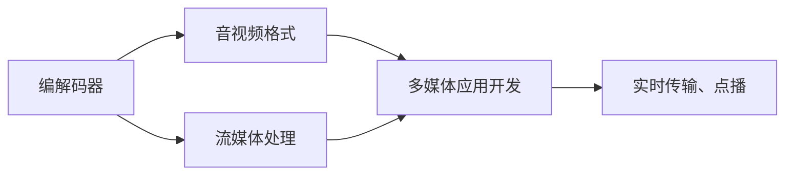

                 

## 1. 背景介绍

### 1.1 问题由来
FFmpeg是一个开源的音视频编解码库，支持几乎所有流行的音视频格式和编解码器，广泛用于视频流传输、音视频编辑、实时音视频处理等多个领域。近年来，随着视频内容的爆发性增长，对音视频处理的需求日益增加，FFmpeg的重要性也日益凸显。然而，FFmpeg的学习曲线较陡峭，一些开发人员往往难以高效利用其功能。

### 1.2 问题核心关键点
本文旨在为FFmpeg的音视频处理应用开发提供一个全面系统的指导。我们将通过一系列的章节详细介绍FFmpeg的核心概念、核心算法、操作步骤，以及其在音视频处理、媒体转码、流媒体传输等实际应用场景中的具体应用。

### 1.3 问题研究意义
深入理解FFmpeg的工作原理和应用技巧，对于掌握音视频处理技术的核心，提升多媒体应用开发水平，具有重要意义。通过对FFmpeg的深入研究，可以帮助开发者更好地处理大规模音视频数据，加速多媒体应用的开发进程，为视频内容的创作、传播和应用提供强有力的技术支持。

## 2. 核心概念与联系

### 2.1 核心概念概述

FFmpeg是一个集成了音视频编解码、格式转换、流媒体处理等多种功能的强大工具。以下是FFmpeg涉及的关键概念：

- **编解码器**：FFmpeg支持众多编解码器，如H.264、HEVC、AAC、MP3等，用于对音视频数据进行编码和解码。
- **音视频格式**：支持多种音视频格式，如MP4、MKV、AVI等，用于存储和管理音视频数据。
- **流媒体处理**：支持实时音视频流的编码、复用、编转码、解码等，适用于直播、点播、视频会议等场景。
- **多媒体应用开发**：涉及音视频采集、处理、合成、编辑等多个方面，实现多媒体内容的创作和展示。

这些概念之间通过FFmpeg的API和命令行工具进行连接，形成了一个庞大的音视频处理生态系统。

### 2.2 核心概念原理和架构的 Mermaid 流程图



这个流程图展示了FFmpeg的核心概念及其之间的关系：

1. **编解码器**负责对音视频数据进行编码和解码。
2. **音视频格式**是音视频数据存储和管理的容器。
3. **流媒体处理**负责实时音视频流的处理，支持直播、点播等功能。
4. **多媒体应用开发**涵盖了音视频数据的采集、处理、合成、编辑等多个方面。

## 3. 核心算法原理 & 具体操作步骤
### 3.1 算法原理概述

FFmpeg的核心算法原理主要涉及音视频的编解码和流媒体处理。以下是FFmpeg的主要算法原理：

1. **编解码算法**：使用各种编解码器对音视频数据进行压缩和解压缩，降低数据传输和存储的带宽和空间需求。
2. **格式转换算法**：将不同格式的音视频数据进行相互转换，便于数据的存储和传输。
3. **流媒体算法**：通过RTP/UDP、RTSP/TCP等协议实现音视频的实时传输和播放。
4. **音视频混合算法**：将多种音视频流进行混合和渲染，实现复杂的音视频效果。

### 3.2 算法步骤详解

#### 3.2.1 音视频编解码

音视频编解码是FFmpeg的核心功能之一。以下是一个简单的音视频编码过程：

1. **输入音视频数据**：将需要编码的音视频数据作为输入。
2. **选择编解码器**：根据需要选择合适的编解码器，如H.264、HEVC、AAC等。
3. **编码处理**：使用选择的编解码器对音视频数据进行压缩，生成编码后的数据流。
4. **输出编码数据**：将编码后的数据流输出到指定位置，如文件、网络流等。

#### 3.2.2 音视频格式转换

音视频格式转换是FFmpeg的另一个重要功能。以下是一个简单的音视频格式转换过程：

1. **输入音视频数据**：将需要转换格式的音视频数据作为输入。
2. **选择目标格式**：根据需要选择合适的目标格式，如MP4、MKV、AVI等。
3. **转换处理**：使用FFmpeg的命令行工具或API对输入数据进行格式转换，生成目标格式的数据流。
4. **输出转换数据**：将转换后的数据流输出到指定位置，如文件、网络流等。

#### 3.2.3 流媒体处理

流媒体处理是FFmpeg在实时音视频传输方面的重要应用。以下是一个简单的流媒体传输过程：

1. **输入流媒体数据**：将需要传输的流媒体数据作为输入，如直播视频流、点播视频流等。
2. **选择协议**：根据需要选择合适的传输协议，如RTP/UDP、RTSP/TCP等。
3. **流媒体传输**：使用FFmpeg的命令行工具或API对输入数据进行实时传输，生成流媒体数据流。
4. **输出流媒体数据**：将传输后的流媒体数据流输出到指定位置，如网络流、视频会议等。

### 3.3 算法优缺点

FFmpeg具有以下优点：

- **功能强大**：支持几乎所有流行的音视频格式和编解码器，适用于各种音视频处理场景。
- **性能优异**：基于优化的编解码算法和流媒体协议，能够高效处理大规模音视频数据。
- **开源免费**：作为开源项目，FFmpeg社区活跃，资源丰富，维护及时。

然而，FFmpeg也存在一些缺点：

- **学习曲线陡峭**：API和命令行工具复杂，初学者可能难以高效使用。
- **处理速度较慢**：对于高分辨率、高码率的音视频数据，处理速度可能较慢。
- **兼容性问题**：部分较老的音视频格式和编解码器可能不支持。

### 3.4 算法应用领域

FFmpeg广泛应用于音视频处理、流媒体传输、视频编辑等多个领域。以下是几个典型的应用场景：

1. **视频编辑**：使用FFmpeg对视频文件进行剪辑、合并、分割、提取音频等处理。
2. **直播视频转码**：将直播视频流转换为不同格式和码率，便于存储和传输。
3. **流媒体直播**：使用FFmpeg实现实时音视频流的采集、编码、传输和播放，支持多种直播协议。
4. **音视频测试**：使用FFmpeg对音视频设备进行测试，检查其编解码性能和兼容性。
5. **多媒体应用开发**：将FFmpeg作为核心库，实现音视频的采集、处理、合成、编辑等功能。

## 4. 数学模型和公式 & 详细讲解  
### 4.1 数学模型构建

FFmpeg中的数学模型主要涉及音视频编码、格式转换和流媒体传输等方面。以下是FFmpeg在音视频编码和格式转换方面的数学模型构建：

- **音视频编码模型**：使用H.264、HEVC等编解码器对音视频数据进行编码，生成压缩后的数据流。模型主要包括输入数据、编解码算法、压缩参数等。
- **格式转换模型**：使用FFmpeg的命令行工具或API对输入数据进行格式转换，生成目标格式的数据流。模型主要包括输入数据、目标格式、转换算法等。

### 4.2 公式推导过程

#### 4.2.1 音视频编码模型

音视频编码模型的基本公式如下：

$$
\text{Compressed Data} = \text{Encoder}(\text{Input Data}, \text{Compression Parameters})
$$

其中，$\text{Input Data}$表示需要编码的音视频数据，$\text{Compression Parameters}$表示编解码器的参数，如码率、帧率、分辨率等，$\text{Compressed Data}$表示压缩后的数据流。

#### 4.2.2 格式转换模型

格式转换模型的基本公式如下：

$$
\text{Output Data} = \text{Converter}(\text{Input Data}, \text{Target Format})
$$

其中，$\text{Input Data}$表示需要转换格式的音视频数据，$\text{Target Format}$表示目标格式，如MP4、MKV等，$\text{Output Data}$表示转换后的数据流。

### 4.3 案例分析与讲解

#### 4.3.1 音视频编码案例

假设需要编码一个1080p分辨率、30fps帧率的视频文件，使用H.264编解码器进行编码，码率为2Mbps。则可以使用以下命令进行编码：

```bash
ffmpeg -i input.mp4 -c:v libx264 -crf 23 -b:v 2M -c:a aac -b:a 128k output.mp4
```

其中，`-i input.mp4`表示输入视频文件，`-c:v libx264`表示使用H.264编解码器进行视频编码，`-crf 23`表示设置压缩质量参数，`-b:v 2M`表示设置视频码率，`-c:a aac`表示使用AAC编解码器进行音频编码，`-b:a 128k`表示设置音频码率。

#### 4.3.2 格式转换案例

假设需要将一个MP4格式的视频文件转换为MKV格式，则可以使用以下命令进行转换：

```bash
ffmpeg -i input.mp4 output.mkv
```

其中，`-i input.mp4`表示输入视频文件，`output.mkv`表示输出视频文件。

## 5. 项目实践：代码实例和详细解释说明
### 5.1 开发环境搭建

#### 5.1.1 环境准备

1. **安装FFmpeg**：首先，需要安装FFmpeg库。可以使用以下命令在Ubuntu系统中安装FFmpeg：

   ```bash
   sudo apt-get update
   sudo apt-get install ffmpeg
   ```

2. **环境配置**：安装FFmpeg后，需要配置环境变量。在终端中执行以下命令，将FFmpeg的bin目录添加到PATH环境变量中：

   ```bash
   export PATH=$PATH:/usr/local/bin:/usr/bin:/usr/sbin:/bin:/usr/games:/home/username/bin
   ```

### 5.2 源代码详细实现

#### 5.2.1 音视频编解码

以下是一个简单的音视频编码代码实现：

```python
import subprocess

# 输入视频文件路径
input_file = "/path/to/input.mp4"

# 输出视频文件路径
output_file = "/path/to/output.mp4"

# 编码参数
params = "-c:v libx264 -crf 23 -b:v 2M -c:a aac -b:a 128k"

# 调用ffmpeg进行编码
subprocess.call(["ffmpeg", "-i", input_file, params, output_file])
```

#### 5.2.2 音视频格式转换

以下是一个简单的音视频格式转换代码实现：

```python
import subprocess

# 输入视频文件路径
input_file = "/path/to/input.mp4"

# 输出视频文件路径
output_file = "/path/to/output.mkv"

# 格式转换命令
params = "-c:v copy -c:a copy"

# 调用ffmpeg进行格式转换
subprocess.call(["ffmpeg", "-i", input_file, params, output_file])
```

### 5.3 代码解读与分析

#### 5.3.1 音视频编解码代码解析

1. **导入subprocess模块**：使用subprocess模块调用FFmpeg的命令行工具进行音视频编解码。
2. **定义输入和输出文件路径**：指定需要编码或转换的视频文件路径和输出文件路径。
3. **定义编码参数**：根据需求设置编解码器、压缩质量、码率等参数。
4. **调用ffmpeg进行编解码**：使用subprocess.call方法调用FFmpeg的命令行工具进行编码或格式转换。

#### 5.3.2 音视频格式转换代码解析

1. **导入subprocess模块**：使用subprocess模块调用FFmpeg的命令行工具进行音视频格式转换。
2. **定义输入和输出文件路径**：指定需要转换的视频文件路径和输出文件路径。
3. **定义格式转换参数**：使用`-c:v copy -c:a copy`参数进行格式转换，保留视频和音频编码。
4. **调用ffmpeg进行格式转换**：使用subprocess.call方法调用FFmpeg的命令行工具进行格式转换。

### 5.4 运行结果展示

#### 5.4.1 音视频编解码

在执行完上述编码命令后，可以在输出路径中找到压缩后的视频文件。可以通过播放或分析工具检查编码后的视频质量、码率等参数，确保编码效果符合预期。

#### 5.4.2 音视频格式转换

在执行完上述格式转换命令后，可以在输出路径中找到转换后的视频文件。可以通过播放或分析工具检查转换后的视频格式、码率等参数，确保格式转换效果符合预期。

## 6. 实际应用场景
### 6.1 音视频编辑

音视频编辑是FFmpeg的重要应用之一。通过FFmpeg，可以对视频文件进行剪辑、合并、分割、提取音频等处理。以下是一个简单的音视频编辑流程：

1. **输入视频文件**：将需要编辑的视频文件作为输入。
2. **编辑处理**：使用FFmpeg对视频文件进行剪辑、合并、分割、提取音频等处理，生成编辑后的视频文件。
3. **输出编辑文件**：将编辑后的视频文件输出到指定位置，如本地磁盘、网络流等。

### 6.2 直播视频转码

直播视频转码是FFmpeg的另一个重要应用。以下是一个简单的直播视频转码流程：

1. **输入直播视频流**：将需要转码的直播视频流作为输入。
2. **转码处理**：使用FFmpeg将直播视频流转换为不同格式和码率，生成转码后的视频流。
3. **输出转码数据**：将转码后的视频流输出到指定位置，如网络流、视频会议等。

### 6.3 流媒体直播

流媒体直播是FFmpeg在实时音视频传输方面的重要应用。以下是一个简单的流媒体直播流程：

1. **输入流媒体数据**：将需要直播的流媒体数据作为输入，如摄像头、麦克风等。
2. **直播处理**：使用FFmpeg对流媒体数据进行实时编码、复用、编转码、解码等处理，生成直播数据流。
3. **输出直播数据**：将直播数据流输出到指定位置，如网络流、视频会议等。

### 6.4 音视频测试

音视频测试是FFmpeg在质量保证方面的应用。以下是一个简单的音视频测试流程：

1. **输入音视频数据**：将需要测试的音视频数据作为输入，如标准测试文件。
2. **测试处理**：使用FFmpeg对音视频数据进行编解码、格式转换等处理，测试其编解码性能和兼容性。
3. **输出测试结果**：将测试结果输出到指定位置，如日志文件、测试报告等。

## 7. 工具和资源推荐
### 7.1 学习资源推荐

为了帮助开发者系统掌握FFmpeg的核心技术，以下是几本优秀的学习资源推荐：

1. **《FFmpeg源码分析》**：深入剖析FFmpeg的源码，理解其核心算法和数据结构。
2. **《FFmpeg视频教程》**：适合初学者的视频教程，涵盖FFmpeg的基础操作和应用场景。
3. **《FFmpeg深度学习应用》**：将FFmpeg与深度学习技术结合，探讨其在多媒体处理中的应用。
4. **《FFmpeg官方文档》**：FFmpeg的官方文档，提供了详细的API和命令行工具使用指南。

### 7.2 开发工具推荐

为了提高FFmpeg的开发效率，以下是几款常用的开发工具推荐：

1. **Visual Studio Code**：轻量级、功能强大的代码编辑器，支持FFmpeg的命令行工具开发。
2. **PyCharm**：Python编程的IDE，支持FFmpeg的Python脚本开发。
3. **Linux Shell**：命令行工具的开发和测试，适合FFmpeg的核心功能开发。

### 7.3 相关论文推荐

为了深入理解FFmpeg的技术原理和应用方法，以下是几篇经典的FFmpeg相关论文推荐：

1. **《FFmpeg中的编解码器》**：介绍FFmpeg支持的多种编解码器及其原理和应用。
2. **《FFmpeg的流媒体处理》**：详细探讨FFmpeg在流媒体处理方面的核心算法和应用。
3. **《FFmpeg的音视频格式转换》**：分析FFmpeg在音视频格式转换方面的技术细节和实现方法。

## 8. 总结：未来发展趋势与挑战

### 8.1 研究成果总结

FFmpeg作为音视频处理领域的核心工具，已经广泛应用于视频流传输、音视频编辑、实时音视频处理等多个领域。其功能强大、性能优异、开源免费等特点，使其成为音视频处理的首选工具。

### 8.2 未来发展趋势

未来，FFmpeg的发展趋势将体现在以下几个方面：

1. **AI辅助编辑**：结合人工智能技术，提供更智能、更高效的音视频编辑功能。
2. **实时流媒体处理**：支持更多实时流媒体协议，提升音视频传输的稳定性和可靠性。
3. **跨平台支持**：进一步扩展平台支持，支持更多操作系统和硬件平台。
4. **新编解码器支持**：支持更多新编解码器，提升音视频处理的灵活性。

### 8.3 面临的挑战

尽管FFmpeg在音视频处理方面取得了显著成就，但仍面临以下挑战：

1. **性能瓶颈**：对于高分辨率、高码率的音视频数据，处理速度较慢，需要进一步优化。
2. **兼容性问题**：部分较老的音视频格式和编解码器可能不支持。
3. **易用性问题**：API和命令行工具较为复杂，初学者可能难以高效使用。

### 8.4 研究展望

为了解决FFmpeg面临的挑战，未来的研究方向包括：

1. **性能优化**：进一步优化编解码算法和流媒体协议，提升音视频处理速度。
2. **兼容性增强**：支持更多新旧音视频格式和编解码器，提升音视频处理的灵活性。
3. **用户友好**：开发更加易于使用的API和命令行工具，提高开发效率。

总之，FFmpeg作为音视频处理领域的核心工具，将继续发挥其重要作用。未来的发展方向将更多地关注性能、兼容性和易用性，使其更好地适应音视频处理的需求。

## 9. 附录：常见问题与解答

### Q1: 为什么使用FFmpeg进行音视频处理？

A: 由于FFmpeg集成了音视频编解码、格式转换、流媒体处理等多种功能，能够高效、稳定地处理大规模音视频数据。同时，FFmpeg的开源特性也使其成为音视频处理的首选工具。

### Q2: 如何选择合适的编解码器？

A: 选择合适的编解码器需要考虑音视频格式、分辨率、码率、帧率等因素。一般来说，H.264、HEVC、AAC等编解码器适用于不同的应用场景。对于高分辨率、高码率的音视频数据，可以选择更加高效的编解码器。

### Q3: 如何使用FFmpeg进行实时流媒体处理？

A: 使用FFmpeg进行实时流媒体处理，可以通过命令行工具或API实现。需要选择合适的编解码器、协议等参数，并使用相应的命令进行实时编码、复用、编转码、解码等处理。

### Q4: 如何提升FFmpeg的性能？

A: 提升FFmpeg性能的方法包括优化编解码算法、使用多核CPU、增加内存缓冲等。同时，也可以使用FFmpeg的优化选项，如多线程处理、缓存优化等，提升音视频处理速度。

### Q5: 如何处理音视频格式转换中的兼容性问题？

A: 处理音视频格式转换中的兼容性问题，可以通过添加相应的编解码器库、配置编码参数等方法。同时，可以使用FFmpeg的命令行工具，尝试不同的参数组合，找到最佳的转换方案。

总之，通过系统学习FFmpeg的核心概念、核心算法和具体操作步骤，可以高效地掌握音视频处理技术，开发出高效、稳定、可靠的多媒体应用。希望本文能为广大开发者提供有价值的指导和参考。

---

作者：禅与计算机程序设计艺术 / Zen and the Art of Computer Programming

