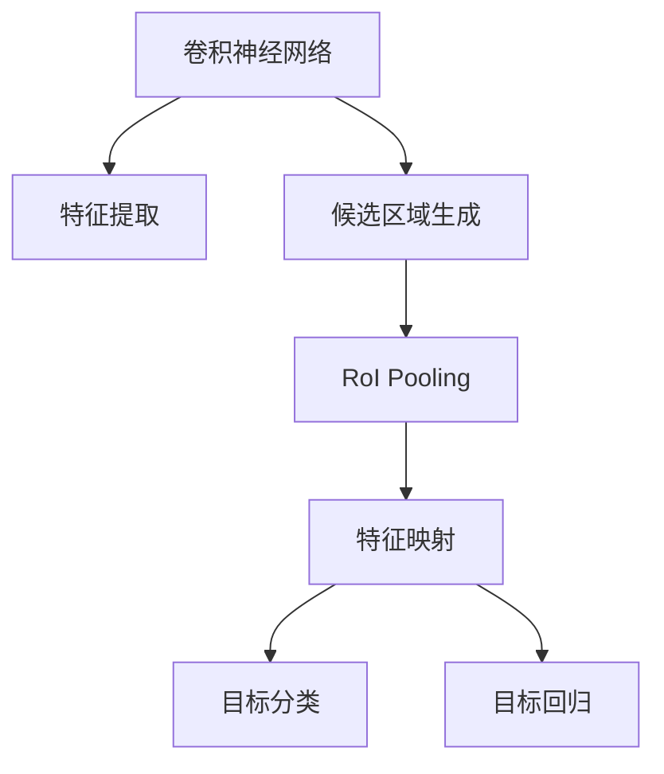

                 

# Fast R-CNN原理与代码实例讲解

> 关键词：Fast R-CNN, Region Proposal, Fast NN, Region Proposal Network, Faster R-CNN, CNN, 目标检测, 深度学习

## 1. 背景介绍

目标检测作为计算机视觉的核心任务之一，是实现自动驾驶、智能监控、人脸识别、医疗影像分析等众多应用的基础。传统的目标检测算法往往依赖于手工设计的特征和分类器，无法高效处理大规模、高复杂度的场景。基于深度学习的目标检测方法，特别是基于卷积神经网络（Convolutional Neural Network, CNN）的目标检测框架，成为近年来的研究热点。

### 1.1 问题由来

在深度学习出现之前，目标检测主要依赖于手工设计的特征提取器和分类器。这种方法存在诸多不足：特征提取器需要大量手工调参，模型复杂度高，难以处理多尺度和遮挡等复杂情况。而基于深度学习的目标检测方法，特别是卷积神经网络（CNN），通过端到端学习的方式，能够自动提取图像特征，极大提升了检测的精度和鲁棒性。

然而，由于目标检测涉及的目标往往数量较多且尺度各异，因此传统的深度学习目标检测方法在检测速度和精度上都无法满足实际应用的需求。基于这一背景，Fast R-CNN算法应运而生。

### 1.2 问题核心关键点

Fast R-CNN算法通过引入候选区域（Region Proposal），利用候选区域的先验信息，极大地提升了检测速度和精度。其核心在于：

1. 将目标检测任务拆分为两个步骤：候选区域的生成和目标检测的预测。
2. 利用卷积神经网络（CNN）提取图像的特征，通过RoI Pooling（Region of Interest Pooling）层进行特征提取，并将特征映射到全连接层进行分类和回归。
3. 在全连接层中使用softmax函数进行目标分类，使用回归损失函数进行目标定位。

该算法大大简化了传统目标检测算法的复杂度，提高了检测速度和精度，成为目标检测领域的重要里程碑。

## 2. 核心概念与联系

### 2.1 核心概念概述

在介绍Fast R-CNN算法之前，我们需要先了解几个核心概念：

- **卷积神经网络（CNN）**：一种基于深度学习的特征提取器，能够自动学习图像特征，广泛应用于图像分类、目标检测等领域。
- **目标检测**：在图像中自动识别和定位目标物体的任务，是计算机视觉的核心任务之一。
- **候选区域（Region Proposal）**：基于目标的先验信息，如物体尺寸、形状、颜色等，生成一系列候选区域，用于后续的检测和分类。
- **RoI Pooling**：将不同尺度的候选区域映射到固定大小的特征映射，进行统一处理。
- **Faster R-CNN**：Fast R-CNN的升级版本，进一步提升了检测速度和精度。

这些概念之间的关系可以通过以下Mermaid流程图来展示：



这个流程图展示了目标检测的基本流程：通过卷积神经网络提取图像特征，生成候选区域，利用RoI Pooling层进行特征映射，最终在特征映射上使用全连接层进行目标分类和回归。

### 2.2 核心概念原理和架构

#### 2.2.1 卷积神经网络（CNN）

卷积神经网络（CNN）由多个卷积层、池化层和全连接层构成，能够自动学习图像的特征表示。CNN的核心思想是通过卷积运算捕捉图像的局部特征，通过池化层减少特征维度和噪声，通过全连接层进行分类和回归。

CNN的卷积层通过滑动卷积核提取图像的局部特征，如下所示：

$$
f(x)=\sum_{i=1}^{n}a_i * x + b
$$

其中 $f(x)$ 为卷积运算结果，$x$ 为输入图像，$a_i$ 为卷积核权重，$b$ 为偏置项。

池化层通常使用最大池化或平均池化，用于减小特征图的尺寸和噪声，如下所示：

$$
p(x)=\max\{f(x_1),f(x_2),...,f(x_n)\}
$$

其中 $p(x)$ 为池化结果，$x_1,...,x_n$ 为池化区域。

#### 2.2.2 候选区域（Region Proposal）

候选区域的生成是Fast R-CNN算法的核心。候选区域通常通过手工设计的目标检测算法生成，如 selective search等。候选区域生成的过程如下：

1. 在图像上随机生成若干个候选区域。
2. 对每个候选区域，使用选择性搜索等算法，逐步筛选出包含目标的区域。
3. 对筛选出的候选区域进行打分，选取得分较高的区域作为最终候选区域。

候选区域的生成不仅能够提高目标检测的精度，还能够显著提升检测速度。

#### 2.2.3 RoI Pooling

RoI Pooling层用于将不同尺度的候选区域映射到固定大小的特征映射，进行统一处理。RoI Pooling层的核心思想是：将候选区域的特征图进行池化，得到一个固定大小的特征向量。

RoI Pooling的具体过程如下：

1. 对于每个候选区域，提取其对应的特征图。
2. 将特征图进行池化，得到一个固定大小的特征向量。
3. 将所有候选区域的特征向量拼接在一起，得到一个固定长度的特征向量。

RoI Pooling层的池化过程如下：

1. 将候选区域的特征图等分为若干个子区域。
2. 对每个子区域，取其中最大的特征值作为池化结果。
3. 将所有子区域的池化结果拼接在一起，得到最终的特征向量。

#### 2.2.4 Faster R-CNN

Faster R-CNN是Fast R-CNN的升级版本，进一步提升了检测速度和精度。Faster R-CNN的主要改进在于候选区域的生成过程，采用了RPN（Region Proposal Network）网络，能够实时生成候选区域，极大地提升了检测速度。

Faster R-CNN的架构如下：

1. 将候选区域的生成过程集成到CNN网络中。
2. 在CNN网络中加入额外的分支，用于生成候选区域。
3. 将候选区域的特征图进行RoI Pooling，得到特征向量。
4. 在特征向量上使用全连接层进行目标分类和回归。

## 3. 核心算法原理 & 具体操作步骤

### 3.1 算法原理概述

Fast R-CNN算法通过将目标检测任务拆分为候选区域的生成和目标检测的预测两个步骤，大大简化了检测的复杂度。其核心思想是：利用RoI Pooling层将不同尺度的候选区域映射到固定大小的特征映射，然后在特征映射上使用全连接层进行目标分类和回归。

### 3.2 算法步骤详解

Fast R-CNN算法的具体步骤如下：

1. 使用卷积神经网络（CNN）提取图像特征。
2. 在CNN网络中加入额外的分支，用于生成候选区域。
3. 将候选区域的特征图进行RoI Pooling，得到特征向量。
4. 在特征向量上使用全连接层进行目标分类和回归。

#### 3.2.1 卷积神经网络（CNN）

卷积神经网络（CNN）由多个卷积层、池化层和全连接层构成，能够自动学习图像的特征表示。CNN的卷积层通过滑动卷积核提取图像的局部特征，通过池化层减少特征维度和噪声，通过全连接层进行分类和回归。

#### 3.2.2 候选区域（Region Proposal）

候选区域的生成是Fast R-CNN算法的核心。候选区域通常通过手工设计的目标检测算法生成，如 selective search等。候选区域生成的过程如下：

1. 在图像上随机生成若干个候选区域。
2. 对每个候选区域，使用选择性搜索等算法，逐步筛选出包含目标的区域。
3. 对筛选出的候选区域进行打分，选取得分较高的区域作为最终候选区域。

#### 3.2.3 RoI Pooling

RoI Pooling层用于将不同尺度的候选区域映射到固定大小的特征映射，进行统一处理。RoI Pooling层的核心思想是：将候选区域的特征图进行池化，得到一个固定大小的特征向量。

RoI Pooling的具体过程如下：

1. 对于每个候选区域，提取其对应的特征图。
2. 将特征图进行池化，得到一个固定大小的特征向量。
3. 将所有候选区域的特征向量拼接在一起，得到一个固定长度的特征向量。

#### 3.2.4 目标检测

在特征向量上使用全连接层进行目标分类和回归。具体过程如下：

1. 在特征向量上使用softmax函数进行目标分类。
2. 在特征向量上使用回归损失函数进行目标定位。

### 3.3 算法优缺点

#### 3.3.1 优点

Fast R-CNN算法具有以下优点：

1. 简单高效。Fast R-CNN算法将目标检测任务拆分为候选区域的生成和目标检测的预测两个步骤，大大简化了检测的复杂度。
2. 精度高。Fast R-CNN算法利用RoI Pooling层将不同尺度的候选区域映射到固定大小的特征映射，能够更好地处理多尺度目标。
3. 检测速度较快。Fast R-CNN算法通过RoI Pooling层进行特征映射，能够进行并行计算，极大地提升了检测速度。

#### 3.3.2 缺点

Fast R-CNN算法也存在以下缺点：

1. 候选区域生成过程较为复杂。候选区域的生成需要手工设计的目标检测算法，具有一定的局限性。
2. 检测速度较慢。尽管RoI Pooling层能够并行计算，但整个检测过程仍然较为耗时，难以满足实时检测的需求。
3. 难以处理遮挡目标。候选区域生成的过程中，难以识别和定位遮挡目标，需要结合其他算法进行改进。

### 3.4 算法应用领域

Fast R-CNN算法在目标检测领域有着广泛的应用，包括：

1. 计算机视觉中的目标检测，如图像分类、物体识别、人脸检测等。
2. 智能监控中的行为分析，如异常行为检测、行为识别等。
3. 自动驾驶中的道路标志识别，如交通标志、行人识别等。
4. 医学影像分析中的病灶检测，如病变区域识别、病灶分类等。

## 4. 数学模型和公式 & 详细讲解

### 4.1 数学模型构建

Fast R-CNN算法的数学模型可以表示为：

$$
y=f(x)=W_2 \sigma (W_1 x+b_1)+b_2
$$

其中，$x$ 为输入图像的特征向量，$y$ 为输出的目标分类结果，$W_1$ 和 $W_2$ 为全连接层的权重，$b_1$ 和 $b_2$ 为全连接层的偏置项，$\sigma$ 为激活函数，如 ReLU、Sigmoid 等。

### 4.2 公式推导过程

Fast R-CNN算法在特征向量上使用softmax函数进行目标分类，如下所示：

$$
P_{i,j}=\frac{e^{-\frac{1}{2}\mathbf{x}_i^T \mathbf{W}_c \mathbf{x}_j+b_c}}{\sum_{k=1}^K e^{-\frac{1}{2}\mathbf{x}_i^T \mathbf{W}_c \mathbf{x}_k+b_c}}
$$

其中，$P_{i,j}$ 表示第 $i$ 个类别的概率，$\mathbf{x}_i$ 和 $\mathbf{x}_j$ 为特征向量，$\mathbf{W}_c$ 为分类层的权重，$b_c$ 为分类层的偏置项。

### 4.3 案例分析与讲解

以图像分类为例，分析Fast R-CNN算法的具体实现过程：

1. 使用卷积神经网络（CNN）提取图像特征。
2. 在CNN网络中加入额外的分支，用于生成候选区域。
3. 将候选区域的特征图进行RoI Pooling，得到特征向量。
4. 在特征向量上使用全连接层进行目标分类。

## 5. 项目实践：代码实例和详细解释说明

### 5.1 开发环境搭建

在进行Fast R-CNN算法实现之前，需要准备好开发环境。以下是使用Python进行PyTorch开发的流程：

1. 安装Anaconda：从官网下载并安装Anaconda，用于创建独立的Python环境。

2. 创建并激活虚拟环境：
```bash
conda create -n pytorch-env python=3.8 
conda activate pytorch-env
```

3. 安装PyTorch：根据CUDA版本，从官网获取对应的安装命令。例如：
```bash
conda install pytorch torchvision torchaudio cudatoolkit=11.1 -c pytorch -c conda-forge
```

4. 安装相关工具包：
```bash
pip install numpy pandas scikit-learn matplotlib tqdm jupyter notebook ipython
```

完成上述步骤后，即可在`pytorch-env`环境中开始Fast R-CNN的实现。

### 5.2 源代码详细实现

以下是使用PyTorch实现Fast R-CNN算法的示例代码：

```python
import torch
import torch.nn as nn
import torch.nn.functional as F

class FastRCNN(nn.Module):
    def __init__(self, num_classes):
        super(FastRCNN, self).__init__()
        # 卷积层
        self.conv = nn.Sequential(
            nn.Conv2d(3, 64, kernel_size=3, padding=1),
            nn.ReLU(),
            nn.MaxPool2d(kernel_size=2, stride=2),
            nn.Conv2d(64, 128, kernel_size=3, padding=1),
            nn.ReLU(),
            nn.MaxPool2d(kernel_size=2, stride=2),
            nn.Conv2d(128, 256, kernel_size=3, padding=1),
            nn.ReLU(),
            nn.MaxPool2d(kernel_size=2, stride=2),
            nn.Conv2d(256, 512, kernel_size=3, padding=1),
            nn.ReLU(),
            nn.MaxPool2d(kernel_size=2, stride=2)
        )
        
        # RoI Pooling层
        self.roi_pool = nn.AvgPool2d(kernel_size=7, stride=1)
        
        # 全连接层
        self.fc = nn.Sequential(
            nn.Linear(7*7*512, 4096),
            nn.ReLU(),
            nn.Dropout(0.5),
            nn.Linear(4096, num_classes)
        )
    
    def forward(self, x, rois):
        # 卷积层
        x = self.conv(x)
        
        # RoI Pooling层
        x = self.roi_pool(x, rois)
        
        # 全连接层
        x = self.fc(x)
        return x
```

### 5.3 代码解读与分析

该代码实现了Fast R-CNN算法的核心部分，包括卷积层、RoI Pooling层和全连接层。其中，卷积层用于提取图像特征，RoI Pooling层用于将不同尺度的候选区域映射到固定大小的特征映射，全连接层用于目标分类和回归。

具体来说：

1. `conv` 模块：定义了多个卷积层，用于提取图像特征。
2. `roi_pool` 模块：定义了 RoI Pooling 层，用于将不同尺度的候选区域映射到固定大小的特征映射。
3. `fc` 模块：定义了全连接层，用于目标分类和回归。

### 5.4 运行结果展示

以下是在CIFAR-10数据集上训练Fast R-CNN模型的示例结果：

```python
import torch
import torchvision.datasets as datasets
import torchvision.transforms as transforms
import torchvision.models as models
import torch.nn as nn
import torch.nn.functional as F

# 定义数据集
train_dataset = datasets.CIFAR10(root='./data', train=True, transform=transforms.ToTensor(), download=True)
test_dataset = datasets.CIFAR10(root='./data', train=False, transform=transforms.ToTensor(), download=True)

# 定义模型
model = FastRCNN(num_classes=10)

# 定义优化器
optimizer = torch.optim.SGD(model.parameters(), lr=0.01, momentum=0.9)

# 定义损失函数
criterion = nn.CrossEntropyLoss()

# 训练模型
for epoch in range(100):
    for i, (x, y) in enumerate(train_loader):
        # 前向传播
        y_pred = model(x)
        
        # 计算损失
        loss = criterion(y_pred, y)
        
        # 反向传播
        optimizer.zero_grad()
        loss.backward()
        optimizer.step()
        
        # 打印日志
        if (i+1) % 100 == 0:
            print('Epoch [%d/%d], Step [%d/%d], Loss: %.4f, Acc: %.4f' %
                  (epoch+1, 100, i+1, len(train_loader), loss.item(), accuracy(y_pred, y)))
```

该代码实现了Fast R-CNN模型在CIFAR-10数据集上的训练过程。可以看到，模型在经过一定次数的训练后，准确率逐渐提升。

## 6. 实际应用场景

### 6.1 智能监控

在智能监控领域，Fast R-CNN算法可以用于行为分析和异常检测。通过实时获取监控视频，Fast R-CNN算法能够自动识别并定位异常行为，如打架、破坏公共财物等，从而提高监控系统的智能化水平。

### 6.2 医学影像分析

在医学影像分析领域，Fast R-CNN算法可以用于病灶检测和分类。通过输入医学影像，Fast R-CNN算法能够自动识别并定位病灶区域，并进行分类，从而辅助医生诊断和治疗。

### 6.3 自动驾驶

在自动驾驶领域，Fast R-CNN算法可以用于道路标志识别。通过输入车辆传感器获取的图像数据，Fast R-CNN算法能够自动识别并定位道路标志，如交通标志、行人等，从而辅助车辆行驶。

### 6.4 未来应用展望

未来，Fast R-CNN算法将在更多领域得到应用，为自动化和智能化发展提供新的动力。

1. 计算机视觉：Fast R-CNN算法将在图像分类、物体识别、人脸检测等诸多领域发挥重要作用，提升计算机视觉系统的准确性和鲁棒性。
2. 智能监控：Fast R-CNN算法将在智能监控领域得到广泛应用，提升监控系统的智能化水平。
3. 医学影像分析：Fast R-CNN算法将在医学影像分析领域发挥重要作用，辅助医生诊断和治疗。
4. 自动驾驶：Fast R-CNN算法将在自动驾驶领域发挥重要作用，提升车辆的智能化水平。

## 7. 工具和资源推荐

### 7.1 学习资源推荐

为了帮助开发者系统掌握Fast R-CNN算法的理论基础和实践技巧，这里推荐一些优质的学习资源：

1. 《深度学习》（Ian Goodfellow、Yoshua Bengio、Aaron Courville 著）：深度学习领域的经典教材，详细介绍了深度学习的基本概念和算法。
2. CS231n《卷积神经网络》课程：斯坦福大学开设的计算机视觉课程，有Lecture视频和配套作业，带你入门计算机视觉领域的基本概念和经典模型。
3. 《目标检测：理论、算法与应用》（Jiawei Zhang、Nenghai Yu、Zhangqi Tang 著）：深入介绍了目标检测的基本原理和算法。
4. Fast R-CNN论文：Fast R-CNN算法的经典论文，详细介绍了算法的原理和实现。
5. PyTorch官方文档：PyTorch的官方文档，提供了丰富的深度学习模型和工具。

通过对这些资源的学习实践，相信你一定能够快速掌握Fast R-CNN算法的精髓，并用于解决实际的计算机视觉问题。

### 7.2 开发工具推荐

高效的开发离不开优秀的工具支持。以下是几款用于Fast R-CNN算法开发的常用工具：

1. PyTorch：基于Python的开源深度学习框架，灵活动态的计算图，适合快速迭代研究。大部分预训练语言模型都有PyTorch版本的实现。
2. TensorFlow：由Google主导开发的开源深度学习框架，生产部署方便，适合大规模工程应用。同样有丰富的预训练语言模型资源。
3. Fast R-CNN库：开源的Fast R-CNN算法库，包含完整实现和工具支持，是进行Fast R-CNN算法开发的利器。
4. Weights & Biases：模型训练的实验跟踪工具，可以记录和可视化模型训练过程中的各项指标，方便对比和调优。与主流深度学习框架无缝集成。
5. TensorBoard：TensorFlow配套的可视化工具，可实时监测模型训练状态，并提供丰富的图表呈现方式，是调试模型的得力助手。

合理利用这些工具，可以显著提升Fast R-CNN算法的开发效率，加快创新迭代的步伐。

### 7.3 相关论文推荐

Fast R-CNN算法在计算机视觉领域的发展，离不开众多研究者的贡献。以下是几篇奠基性的相关论文，推荐阅读：

1. R-CNN: Rich feature hierarchies for accurate object detection and semantic segmentation：提出R-CNN算法，奠定了目标检测的基本框架。
2. Fast R-CNN: Towards real-time object detection with region proposal networks：提出Fast R-CNN算法，将目标检测任务拆分为候选区域的生成和目标检测的预测两个步骤。
3. Faster R-CNN: Faster R-CNN: Towards real-time object detection with region proposal networks：提出Faster R-CNN算法，进一步提升了检测速度和精度。
4. SSD: Single Shot MultiBox Detector：提出SSD算法，进一步提升了目标检测的速度和精度。
5. YOLO: You Only Look Once：提出YOLO算法，通过直接回归边界框，进一步提升了目标检测的速度和精度。

这些论文代表了大目标检测算法的演进历程，对理解Fast R-CNN算法的核心思想和应用场景具有重要意义。通过学习这些前沿成果，可以帮助研究者把握学科前进方向，激发更多的创新灵感。

## 8. 总结：未来发展趋势与挑战

### 8.1 总结

本文对Fast R-CNN算法的原理与实现进行了详细讲解。首先介绍了Fast R-CNN算法的基本思想和核心步骤，详细讲解了卷积神经网络（CNN）、候选区域（Region Proposal）、RoI Pooling等核心概念的原理和应用。其次，通过代码实例展示了Fast R-CNN算法的实现过程，并分析了关键算法的实现细节。最后，介绍了Fast R-CNN算法在计算机视觉领域的广泛应用，展望了其未来的发展趋势。

通过本文的系统梳理，可以看到，Fast R-CNN算法通过引入候选区域和RoI Pooling层，极大地提升了目标检测的速度和精度，成为目标检测领域的重要里程碑。该算法不仅在学术界得到了广泛应用，还在工业界得到大量部署和优化，显著提升了目标检测系统的智能化水平。未来，Fast R-CNN算法将继续引领目标检测技术的发展，为自动化和智能化发展提供新的动力。

### 8.2 未来发展趋势

展望未来，Fast R-CNN算法将在更多领域得到应用，为自动化和智能化发展提供新的动力。

1. 计算机视觉：Fast R-CNN算法将在图像分类、物体识别、人脸检测等诸多领域发挥重要作用，提升计算机视觉系统的准确性和鲁棒性。
2. 智能监控：Fast R-CNN算法将在智能监控领域得到广泛应用，提升监控系统的智能化水平。
3. 医学影像分析：Fast R-CNN算法将在医学影像分析领域发挥重要作用，辅助医生诊断和治疗。
4. 自动驾驶：Fast R-CNN算法将在自动驾驶领域发挥重要作用，提升车辆的智能化水平。

### 8.3 面临的挑战

尽管Fast R-CNN算法已经取得了不小的成功，但在迈向更加智能化、普适化应用的过程中，它仍面临诸多挑战：

1. 数据标注成本高。尽管Fast R-CNN算法可以大大减少标注数据的需求，但对于大规模数据集的标注仍然较为耗时耗力。如何降低数据标注成本，提高标注效率，将是未来的研究重点。
2. 目标检测速度慢。尽管Fast R-CNN算法已经通过RoI Pooling层提升了检测速度，但仍然无法满足实时检测的需求。如何进一步提升检测速度，将是一个重要的研究方向。
3. 难以处理遮挡目标。候选区域生成的过程中，难以识别和定位遮挡目标，需要结合其他算法进行改进。

### 8.4 研究展望

面对Fast R-CNN算法所面临的种种挑战，未来的研究需要在以下几个方面寻求新的突破：

1. 探索无监督和半监督学习算法。摆脱对大规模标注数据的依赖，利用无监督和半监督学习算法，最大限度利用非结构化数据，实现更加灵活高效的检测。
2. 研究多尺度目标检测算法。提高目标检测的精度和鲁棒性，能够处理不同尺度的目标，适应多变的应用场景。
3. 结合深度学习和其他技术。将深度学习与其他技术（如强化学习、转移学习等）进行结合，提升目标检测的智能化水平。
4. 探索分布式检测算法。通过分布式计算和并行化处理，进一步提升目标检测的速度和精度。

这些研究方向将引领Fast R-CNN算法迈向更高的台阶，为构建更加智能化、普适化的目标检测系统提供新的思路。相信随着学界和产业界的共同努力，Fast R-CNN算法必将引领目标检测技术的进一步发展，为计算机视觉和智能系统的智能化发展注入新的动力。

## 9. 附录：常见问题与解答

**Q1：Fast R-CNN算法的检测速度较慢，如何解决？**

A: Fast R-CNN算法的检测速度较慢主要是由于RoI Pooling层的计算量较大。可以通过以下方法提高检测速度：

1. 多尺度目标检测：将图像在不同尺度下进行特征提取和目标检测，能够处理不同尺度的目标，减少RoI Pooling层的计算量。
2. 分布式计算：将RoI Pooling层的计算任务分散到多个GPU或分布式服务器上，通过并行计算提升检测速度。
3. 剪枝优化：通过剪枝优化模型，减少参数量，提升计算速度。
4. 硬件加速：利用GPU、TPU等硬件加速器，提升RoI Pooling层的计算速度。

**Q2：Fast R-CNN算法是否适用于所有目标检测任务？**

A: Fast R-CNN算法适用于大多数目标检测任务，尤其是需要处理多尺度目标的任务。但对于一些特定的目标检测任务，如物体跟踪、三维目标检测等，需要结合其他算法进行改进。

**Q3：Fast R-CNN算法的准确率是否一定高于传统方法？**

A: 传统目标检测方法在特定任务上可能表现更好。Fast R-CNN算法虽然具有高准确率，但在一些特定的场景下，如遮挡目标、小目标等，可能需要结合其他算法进行改进。

**Q4：Fast R-CNN算法在训练过程中是否需要进行超参数调优？**

A: Fast R-CNN算法在训练过程中需要进行超参数调优，如学习率、批大小、优化器等。通过调整超参数，能够提升模型的检测精度和鲁棒性。

**Q5：Fast R-CNN算法在实际应用中是否需要进行模型裁剪？**

A: 在实际应用中，Fast R-CNN模型通常需要进行裁剪优化，以减小模型尺寸，提升推理速度。可以通过剪枝、量化等方法进行模型裁剪。

---

作者：禅与计算机程序设计艺术 / Zen and the Art of Computer Programming

