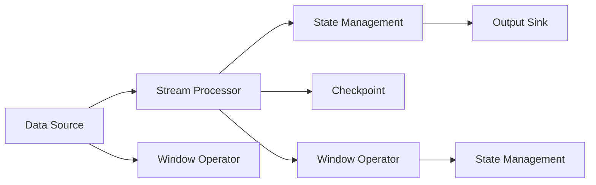

                 

## 1. 背景介绍

**1.1 问题由来**

随着互联网的蓬勃发展和物联网的兴起，大数据和实时数据流的处理需求日益增长。为了高效处理和分析实时数据流，Apache Flink于2014年被推出。Flink是一个开源的流处理平台，它提供了高可用性、高容错性和高性能的流处理能力，广泛应用于实时数据流处理、事件驱动架构和复杂事件处理等领域。

**1.2 问题核心关键点**

Flink Stream的核心在于其对于实时数据流的处理能力，包括但不限于：

1. **事件驱动**：Flink的Stream API提供了一组简单、易于使用的操作符，帮助开发者构建事件驱动的应用程序。
2. **无界数据处理**：Flink支持对无限数据流（如日志流、传感器数据流等）进行处理，能够适应不断变化的数据流特性。
3. **容错性**：Flink提供了基于检查点的容错机制，能够在节点故障时快速恢复数据处理。
4. **高性能**：Flink利用了流处理框架的特性，提供了高效的数据处理和计算能力，适用于大数据量的实时处理。

Flink Stream的这些核心特性使其成为处理大规模实时数据流的理想选择，广泛应用于实时计算、实时分析、实时数据流管理等领域。

**1.3 问题研究意义**

研究Flink Stream原理与代码实例，对于深入理解实时数据流处理技术、提高实时数据处理效率、推动大数据技术的应用与发展具有重要意义：

1. **提高实时处理能力**：通过学习Flink Stream的核心原理，可以更好地设计实时数据流处理流程，提升数据处理速度和效率。
2. **优化实时数据分析**：掌握Flink Stream的操作符和API，能够更高效地进行实时数据分析，提供更准确的业务决策支持。
3. **降低数据处理成本**：Flink Stream的高容错性和高性能特性，可以降低实时数据处理的成本，提高系统的可靠性。
4. **推动大数据技术应用**：Flink Stream作为大数据处理的重要技术，其深入研究和应用将进一步推动大数据技术在各个行业中的应用。

## 2. 核心概念与联系

### 2.1 核心概念概述

为了更好地理解Flink Stream的工作原理和架构，本节将介绍几个关键概念：

- **数据流（Data Stream）**：数据流是指一组连续的、无序的数据元素，通常按照时间顺序排列。Flink Stream处理的数据流可以是来自各种数据源的实时数据。
- **时间窗口（Time Window）**：时间窗口是指在一定时间内收集的数据元素集合，用于计算时间相关的统计量或聚合函数。
- **状态管理（State Management）**：状态管理是指在Flink Stream中维护和管理数据流的中间状态，通常用于计算和保存中间结果。
- **检查点（Checkpoint）**：检查点是Flink Stream的一种容错机制，用于在节点故障时恢复数据流的状态。
- **流处理器（Stream Processor）**：流处理器是指Flink Stream中的计算单元，通过操作符对数据流进行处理和计算。

这些核心概念通过Flink Stream的架构和处理流程紧密联系在一起，构成了其核心框架的基础。

### 2.2 核心概念原理和架构的 Mermaid 流程图



这个流程图展示了Flink Stream的核心处理流程：

1. **数据源**：实时数据流从各种数据源（如Kafka、HTTP、数据库等）进入Flink Stream系统。
2. **流处理器**：数据流通过流处理器中的操作符进行处理和计算，生成中间结果。
3. **状态管理**：中间结果会通过状态管理器进行保存和维护，用于计算和保存中间结果。
4. **检查点**：定期创建检查点，用于在节点故障时恢复数据流的状态。
5. **输出接口**：处理后的结果通过输出接口（如数据库、Kafka等）进行存储和分发。

## 3. 核心算法原理 & 具体操作步骤

### 3.1 算法原理概述

Flink Stream的核心算法原理主要包括以下几个方面：

- **流处理模型**：Flink Stream采用事件驱动的流处理模型，通过操作符对数据流进行处理和计算。
- **时间窗口**：Flink Stream使用时间窗口对数据流进行分组和聚合，支持滑动窗口、固定窗口等不同类型的窗口。
- **容错机制**：Flink Stream通过检查点机制实现容错，保证数据处理的可靠性。
- **状态管理**：Flink Stream使用状态管理器维护和管理中间状态，支持基于值的计算和基于状态的计算。

### 3.2 算法步骤详解

Flink Stream的核心算法步骤包括数据流的输入、处理、聚合和输出，具体步骤如下：

1. **数据源配置**：配置数据源，例如连接Kafka、读取数据库等。
2. **流处理器设计**：选择合适的流处理器操作符，对数据流进行处理和计算。
3. **时间窗口设定**：根据业务需求，设定合适的时间窗口，对数据流进行分组和聚合。
4. **状态管理配置**：配置状态管理器，保存和维护中间结果。
5. **检查点设置**：设置检查点，确保数据流的容错性。
6. **结果输出**：配置输出接口，将处理结果进行存储和分发。

### 3.3 算法优缺点

Flink Stream的优点包括：

- **高性能**：Flink Stream采用流处理模型，能够高效处理大规模实时数据流。
- **高可靠性**：通过检查点机制和容错机制，确保数据处理的可靠性。
- **灵活性**：支持多种数据源和输出接口，灵活应对不同场景。

缺点包括：

- **复杂性**：Flink Stream的设计和配置相对复杂，需要一定的技术积累。
- **资源消耗高**：处理大规模数据流需要较高的计算和内存资源，可能导致资源消耗较大。

### 3.4 算法应用领域

Flink Stream在以下领域得到了广泛应用：

- **实时计算**：用于处理实时数据流，提供实时计算和分析能力。
- **事件驱动架构**：用于构建事件驱动的应用程序，支持复杂事件处理。
- **大数据处理**：用于处理大规模的实时数据流，支持分布式计算和存储。
- **金融交易**：用于处理金融交易数据流，支持高频交易和风险控制。
- **物联网**：用于处理传感器数据流，支持实时监控和分析。

## 4. 数学模型和公式 & 详细讲解 & 举例说明

### 4.1 数学模型构建

Flink Stream的数学模型主要涉及时间窗口、状态管理、检查点等概念。下面通过数学模型来介绍Flink Stream的核心计算。

### 4.2 公式推导过程

假设有一个实时数据流 $\mathcal{S}$，时间窗口为 $[t_1, t_2]$，操作符为 $f$，状态管理器为 $M$，检查点为 $C$。则Flink Stream的计算过程可以表示为：

$$
\text{Result} = f(\mathcal{S}, \text{Window}(\mathcal{S}, [t_1, t_2]), M(\text{Window}(\mathcal{S}, [t_1, t_2])), C(\mathcal{S}, f(\mathcal{S}, \text{Window}(\mathcal{S}, [t_1, t_2]), M(\text{Window}(\mathcal{S}, [t_1, t_2])))
$$

其中，$\text{Window}(\mathcal{S}, [t_1, t_2])$ 表示在时间窗口 $[t_1, t_2]$ 内的数据流子集。$M(\text{Window}(\mathcal{S}, [t_1, t_2]))$ 表示在状态管理器中维护的状态。$C(\mathcal{S}, f(\mathcal{S}, \text{Window}(\mathcal{S}, [t_1, t_2]), M(\text{Window}(\mathcal{S}, [t_1, t_2])))$ 表示在检查点机制中保存的状态。

### 4.3 案例分析与讲解

以一个简单的Flink Stream案例为例，对Flink Stream的核心原理进行说明。

假设有一个实时数据流 $\mathcal{S}$，包含用户的点击数据。我们需要统计每个用户的点击次数，时间窗口为每5分钟一个窗口。则可以使用Flink Stream的操作符来实现：

```python
from pyflink.datastream import StreamExecutionEnvironment
from pyflink.table import StreamTableEnvironment, DataTypes

env = StreamExecutionEnvironment.get_execution_environment()

# 创建TableEnvironment
table_env = StreamTableEnvironment.create(env)

# 连接Kafka数据源
table_env.connect(kafka)

# 创建数据流
table_env.from_elements([{"user_id": "u1", "click_time": "2022-01-01 10:00:00"}, {"user_id": "u2", "click_time": "2022-01-01 10:05:00"}])

# 统计每个用户的点击次数
table_env.window(5 * 60, 2 * 60, "click_time").apply(lambda window: window.count("click_time"))

# 结果输出到控制台
table_env.execute("Stream Table with Window")
```

在这个例子中，我们使用Kafka作为数据源，连接TableEnvironment，使用Window操作符对数据流进行分组和计数。最后，使用print操作符将结果输出到控制台。

## 5. 项目实践：代码实例和详细解释说明

### 5.1 开发环境搭建

在进行Flink Stream实践前，我们需要准备好开发环境。以下是使用Python进行Flink Stream开发的环境配置流程：

1. 安装Apache Flink：从官网下载并安装Flink，选择合适的版本。
2. 配置环境变量：设置JAVA_HOME、PYTHONPATH等环境变量，确保Flink和Python能够正常工作。
3. 安装PyFlink：使用pip安装PyFlink，确保能够使用PyFlink提供的API进行Flink Stream开发。
4. 创建虚拟环境：创建虚拟环境，安装必要的依赖库，确保Python环境稳定。

### 5.2 源代码详细实现

下面我们以一个简单的Flink Stream案例为例，对Flink Stream的代码实现进行说明。

假设有一个实时数据流 $\mathcal{S}$，包含用户的点击数据。我们需要统计每个用户的点击次数，时间窗口为每5分钟一个窗口。则可以使用Flink Stream的操作符来实现：

```python
from pyflink.datastream import StreamExecutionEnvironment
from pyflink.table import StreamTableEnvironment, DataTypes

env = StreamExecutionEnvironment.get_execution_environment()

# 创建TableEnvironment
table_env = StreamTableEnvironment.create(env)

# 连接Kafka数据源
table_env.connect(kafka)

# 创建数据流
table_env.from_elements([{"user_id": "u1", "click_time": "2022-01-01 10:00:00"}, {"user_id": "u2", "click_time": "2022-01-01 10:05:00"}])

# 统计每个用户的点击次数
table_env.window(5 * 60, 2 * 60, "click_time").apply(lambda window: window.count("click_time"))

# 结果输出到控制台
table_env.execute("Stream Table with Window")
```

在这个例子中，我们使用Kafka作为数据源，连接TableEnvironment，使用Window操作符对数据流进行分组和计数。最后，使用print操作符将结果输出到控制台。

### 5.3 代码解读与分析

让我们再详细解读一下关键代码的实现细节：

**连接Kafka数据源**：

```python
table_env.connect(kafka)
```

这里使用了PyFlink提供的Kafka连接器，将实时数据流从Kafka中读取到Flink Stream系统中。

**数据流创建**：

```python
table_env.from_elements([{"user_id": "u1", "click_time": "2022-01-01 10:00:00"}, {"user_id": "u2", "click_time": "2022-01-01 10:05:00"}])
```

这里使用了TableEnvironment的from_elements方法，将元素列表转换为数据流。

**窗口操作**：

```python
table_env.window(5 * 60, 2 * 60, "click_time").apply(lambda window: window.count("click_time"))
```

这里使用了Window操作符，对数据流按照时间窗口进行分组和计数，窗口大小为5分钟，滑动间隔为2分钟。

**结果输出**：

```python
table_env.execute("Stream Table with Window")
```

这里使用了TableEnvironment的execute方法，将结果输出到控制台。

## 6. 实际应用场景

### 6.1 实时计算

Flink Stream在实时计算领域有着广泛的应用，例如：

- **实时数据统计**：统计实时数据流中的各种指标，如流量、访问量等。
- **实时报表生成**：生成实时报表，用于监控和分析业务运营情况。
- **实时预警**：对实时数据流进行实时分析，发现异常情况并进行预警。

### 6.2 事件驱动架构

Flink Stream支持事件驱动架构，用于构建复杂的事件处理系统，例如：

- **实时消息队列**：构建实时消息队列，用于处理大量的事件数据。
- **事件驱动服务**：构建事件驱动服务，支持复杂事件处理和状态管理。
- **实时数据同步**：用于实时数据同步和数据复制。

### 6.3 大数据处理

Flink Stream支持大规模数据的实时处理和分析，例如：

- **大规模数据流处理**：处理大规模的实时数据流，支持分布式计算和存储。
- **实时数据清洗**：对实时数据流进行实时清洗和处理，提升数据质量。
- **实时数据存储**：将实时数据流存储到分布式数据库或文件系统中，支持分布式查询和分析。

### 6.4 未来应用展望

随着Flink Stream技术的不断发展，未来其在以下领域将有更广泛的应用：

- **实时数据分析**：用于实时数据分析和处理，支持复杂数据分析和报告生成。
- **实时推荐系统**：构建实时推荐系统，支持个性化推荐和动态调整。
- **实时监控**：用于实时监控和异常检测，支持业务运营情况实时监控。
- **实时交易**：支持高频交易和实时计算，提高交易效率和安全性。
- **实时风控**：用于实时风险控制和预警，支持实时风险评估和决策。

## 7. 工具和资源推荐

### 7.1 学习资源推荐

为了帮助开发者系统掌握Flink Stream的理论基础和实践技巧，这里推荐一些优质的学习资源：

1. **《Flink官方文档》**：Apache Flink官方文档，提供了详细的API文档和代码示例，是学习Flink Stream的最佳入门资源。
2. **《Flink实战》**：实战类书籍，介绍了Flink Stream的实际应用场景和代码实现。
3. **《Streaming with Flink》**：Google云博客，介绍了Flink Stream的高级功能和优化技巧。
4. **《Apache Flink实战》**：实战类书籍，介绍了Flink Stream的配置和调优技巧。
5. **《Flink高级特性与实战》**：课程类资源，讲解Flink Stream的高级特性和应用场景。

通过对这些资源的学习实践，相信你一定能够快速掌握Flink Stream的精髓，并用于解决实际的流处理问题。

### 7.2 开发工具推荐

高效的开发离不开优秀的工具支持。以下是几款用于Flink Stream开发的常用工具：

1. **Apache Flink**：Flink官方提供的分布式流处理平台，提供了高性能、高可靠性和高可扩展性的流处理能力。
2. **PyFlink**：PyFlink是Python的API，提供了简单易用的API接口，方便Python开发者使用Flink Stream。
3. **Kafka**：Kafka是一个高性能的消息队列系统，广泛用于数据流传输和存储。
4. **Elasticsearch**：Elasticsearch是一个高性能的分布式搜索和分析引擎，用于存储和查询实时数据流。
5. **Tablestore**：Tablestore是阿里云提供的分布式NoSQL数据库，用于存储和查询大规模数据流。

合理利用这些工具，可以显著提升Flink Stream的开发效率，加快创新迭代的步伐。

### 7.3 相关论文推荐

Flink Stream技术的不断发展源于学界的持续研究。以下是几篇奠基性的相关论文，推荐阅读：

1. **Flink: Unified Stream Processing Framework**：Apache Flink的原始论文，介绍了Flink Stream的架构和处理机制。
2. **Apache Flink: Improving Stream Processing with Apache Flink**：介绍Flink Stream的改进和优化方法，提高其处理性能和容错能力。
3. **Stream Processing with Apache Flink**：介绍Flink Stream的高级特性和应用场景，包括实时计算、事件驱动架构和大数据处理等。
4. **Stream Processing with Apache Flink: A Comprehensive Survey**：对Flink Stream的最新研究和应用进行综述，介绍了Flink Stream的核心技术和应用案例。
5. **Real-time Stream Processing in Apache Flink**：介绍Flink Stream在实时流处理和分析中的应用，提供了丰富的实际应用案例。

这些论文代表了大数据流处理技术的最新进展，通过学习这些前沿成果，可以帮助研究者把握学科前进方向，激发更多的创新灵感。

## 8. 总结：未来发展趋势与挑战

### 8.1 总结

本文对Flink Stream原理与代码实例进行了全面系统的介绍。首先阐述了Flink Stream的背景和意义，明确了其在实时数据流处理中的重要作用。其次，从原理到实践，详细讲解了Flink Stream的核心算法和操作步骤，给出了Flink Stream任务开发的完整代码实例。同时，本文还广泛探讨了Flink Stream在实时计算、事件驱动架构和大数据处理等领域的应用前景，展示了Flink Stream的巨大潜力。此外，本文精选了Flink Stream的学习资源和开发工具，力求为读者提供全方位的技术指引。

通过本文的系统梳理，可以看到，Flink Stream作为实时数据流处理的理想选择，其高效、可靠、灵活的特性使其在实时计算、事件驱动架构和大数据处理等领域有着广泛的应用。Flink Stream作为大数据处理的重要技术，其深入研究和应用将进一步推动大数据技术在各个行业中的应用。

### 8.2 未来发展趋势

展望未来，Flink Stream技术将呈现以下几个发展趋势：

1. **性能提升**：随着硬件和软件技术的进步，Flink Stream的处理性能将不断提升，能够处理更大规模的实时数据流。
2. **生态系统扩展**：Flink Stream的生态系统将不断扩展，与其他大数据技术（如Spark、Hadoop等）的集成将更加紧密，提升整体处理能力和灵活性。
3. **分布式架构优化**：Flink Stream的分布式架构将不断优化，支持更大规模的分布式计算和存储，提升系统的可扩展性和容错性。
4. **实时数据分析**：Flink Stream的实时数据分析能力将不断增强，支持更复杂的数据分析任务和报告生成。
5. **混合云部署**：Flink Stream将支持混合云部署，提升系统的弹性和灵活性，支持多云环境下的数据处理和存储。
6. **人工智能集成**：Flink Stream将支持与人工智能技术的深度融合，提升系统的智能化水平，支持更加复杂的实时处理任务。

以上趋势凸显了Flink Stream技术的广阔前景，这些方向的探索发展，将进一步提升Flink Stream的性能和应用范围，为实时数据流处理带来新的突破。

### 8.3 面临的挑战

尽管Flink Stream技术已经取得了显著进展，但在迈向更加智能化、普适化应用的过程中，它仍面临诸多挑战：

1. **复杂性**：Flink Stream的设计和配置相对复杂，需要一定的技术积累。
2. **资源消耗高**：处理大规模数据流需要较高的计算和内存资源，可能导致资源消耗较大。
3. **故障恢复**：在节点故障时，Flink Stream的恢复机制可能不够完善，影响系统的可靠性。
4. **数据一致性**：在分布式环境下，数据的一致性和处理顺序可能存在问题，影响系统的正确性。
5. **实时数据流处理**：在处理实时数据流时，如何保证数据处理的准确性和及时性，仍是亟待解决的问题。

### 8.4 研究展望

面对Flink Stream面临的种种挑战，未来的研究需要在以下几个方面寻求新的突破：

1. **优化分布式架构**：进一步优化Flink Stream的分布式架构，支持更大规模的分布式计算和存储，提升系统的可扩展性和容错性。
2. **提升性能**：优化Flink Stream的算法和数据结构，提升处理性能，支持更大规模的实时数据流处理。
3. **简化配置**：提供更加简化的配置和管理工具，降低用户的使用门槛，提升系统的易用性。
4. **增强容错性**：进一步增强Flink Stream的容错机制，提高系统的可靠性，支持更高效的故障恢复。
5. **提升数据一致性**：优化数据处理机制，提高数据一致性和处理顺序的正确性。

这些研究方向的探索，将进一步提升Flink Stream的性能和应用范围，为实时数据流处理带来新的突破。Flink Stream作为实时数据流处理的重要技术，其深入研究和应用将进一步推动大数据技术在各个行业中的应用，为实时数据流处理带来新的突破。

## 9. 附录：常见问题与解答

**Q1: Flink Stream和Apache Storm有何区别？**

A: Flink Stream和Apache Storm都是实时数据流处理框架，但它们有以下区别：

1. **数据流模型**：Flink Stream采用事件驱动的流处理模型，而Storm采用消息驱动的流处理模型。
2. **容错机制**：Flink Stream使用基于检查点的容错机制，而Storm使用基于消息状态的容错机制。
3. **性能**：Flink Stream在处理大规模数据流时性能更好，而Storm在处理高吞吐量数据流时表现更好。
4. **API**：Flink Stream提供了更丰富的API和工具，方便开发者进行开发和调试。

**Q2: 如何在Flink Stream中进行实时数据分析？**

A: 在Flink Stream中进行实时数据分析，通常使用以下步骤：

1. **数据流创建**：通过TableEnvironment的from_elements方法，将实时数据流转换为表格。
2. **数据处理**：使用TableEnvironment的map、filter等操作符，对数据流进行处理和计算。
3. **结果输出**：使用TableEnvironment的execute方法，将结果输出到控制台或数据库中。

**Q3: Flink Stream支持哪些数据源和输出接口？**

A: Flink Stream支持多种数据源和输出接口，包括：

1. **数据源**：Kafka、Hadoop、Hive、JDBC等。
2. **输出接口**：Hadoop、Hive、JDBC、Elasticsearch等。

**Q4: Flink Stream在分布式环境下的容错性如何保证？**

A: Flink Stream的容错性通过基于检查点的机制实现。具体步骤如下：

1. **设置检查点**：在Flink Stream的配置文件中，设置检查点的间隔和检查点目录。
2. **周期性检查**：Flink Stream周期性地检查当前状态，并将其保存为检查点。
3. **故障恢复**：在节点故障时，Flink Stream从最近的检查点恢复状态，继续执行未完成的操作。

**Q5: 如何优化Flink Stream的性能？**

A: 优化Flink Stream的性能，可以从以下几个方面入手：

1. **优化数据分区**：合理设置数据分区和窗口大小，避免数据倾斜和计算瓶颈。
2. **使用分布式缓存**：使用分布式缓存，如RocksDB、TTLMap等，提高数据访问效率。
3. **减少内存消耗**：优化内存使用，避免内存溢出和垃圾回收。
4. **配置参数优化**：调整Flink Stream的配置参数，如内存分配、任务并行度等，提升系统性能。

这些优化策略，可以帮助提升Flink Stream的性能，支持更大规模的实时数据流处理。

---

作者：禅与计算机程序设计艺术 / Zen and the Art of Computer Programming

