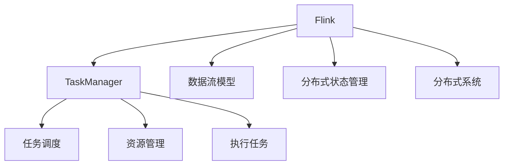

                 

# Flink TaskManager原理与代码实例讲解

> 关键词：Flink, TaskManager, 分布式计算, 流式数据处理, 数据流模型, 分布式状态管理, 实时流处理, 大数据, 分布式系统

## 1. 背景介绍

Apache Flink 是一款开源的流式数据处理框架，支持分布式计算和大规模数据流处理。它采用事件驱动的数据流模型，能够处理无限流、事件时间窗口、复杂事件处理等多种场景。TaskManager 是 Flink 分布式计算的核心组件，负责调度执行作业中的任务，管理和分配资源。本文将详细介绍 Flink TaskManager 的原理与实现，并通过代码实例帮助读者理解其工作流程。

## 2. 核心概念与联系

### 2.1 核心概念概述

- **Flink**：开源流式数据处理框架，支持分布式计算和大规模数据流处理。
- **TaskManager**：Flink 分布式计算的核心组件，负责调度执行作业中的任务，管理和分配资源。
- **数据流模型**：Flink 采用事件驱动的数据流模型，支持无限流、事件时间窗口、复杂事件处理等多种场景。
- **分布式状态管理**：Flink 通过检查点和状态后端实现分布式状态管理，保证作业的可靠性和持续性。
- **分布式系统**：Flink 构建在分布式系统中，依赖多个节点协同工作，确保高可用性和性能。

这些核心概念之间的逻辑关系可以通过以下 Mermaid 流程图来展示：



这个流程图展示了 Flink 的任务管理框架，以及与数据流、状态管理、分布式系统之间的关系。

## 3. 核心算法原理 & 具体操作步骤

### 3.1 算法原理概述

Flink TaskManager 的原理基于分布式计算模型和数据流模型。它将作业划分为多个任务，并将这些任务分配到集群中的各个节点上执行。TaskManager 负责任务的调度和执行，同时也负责资源的分配和管理。

### 3.2 算法步骤详解

Flink TaskManager 的核心算法步骤如下：

1. **任务调度**：TaskManager 从作业调度器（JobScheduler）获取需要执行的任务，并将其分配到 TaskManager 上。
2. **任务执行**：TaskManager 将分配到的任务提交给 TaskExecutor，TaskExecutor 负责任务的执行。
3. **资源管理**：TaskManager 管理集群中的资源，包括 CPU、内存和网络带宽等，确保任务的执行环境。
4. **状态管理**：TaskManager 负责管理任务的本地状态，包括检查点和故障恢复等功能。

### 3.3 算法优缺点

Flink TaskManager 的优势在于其高效的任务调度和资源管理，能够支持大规模、高吞吐量的数据流处理。但是，由于其分布式架构和状态管理机制，Flink TaskManager 的实现复杂度较高，需要处理大量的并发任务和状态数据，因此对硬件要求较高。

### 3.4 算法应用领域

Flink TaskManager 广泛应用于各种大规模数据流处理场景，如实时数据处理、流计算、机器学习、物联网等领域。

## 4. 数学模型和公式 & 详细讲解

### 4.1 数学模型构建

Flink TaskManager 的数学模型基于分布式系统的原理，主要包括以下几个方面：

1. **任务划分与调度**：将作业划分为多个任务，每个任务被分配到不同的 TaskManager 上执行。
2. **资源分配**：根据任务的资源需求，分配 CPU、内存和网络带宽等资源。
3. **任务执行**：在每个 TaskManager 上，任务由 TaskExecutor 执行，并将计算结果发送回 TaskManager。
4. **状态管理**：通过检查点和状态后端，实现任务的本地状态管理和故障恢复。

### 4.2 公式推导过程

1. **任务调度模型**：假设作业被划分为 $n$ 个任务，每个任务由 $m$ 个子任务组成。任务的调度过程可以表示为：

$$
\begin{aligned}
    &\min_{\pi} \sum_{i=1}^{n} \sum_{j=1}^{m} \ell(\pi_i, \pi_j) \\
    &\text{s.t.} \quad \pi_i \in \{1, \ldots, k\}, \quad \pi_j \in \{1, \ldots, n\} \\
    &\quad \sum_{j=1}^{m} \pi_j = 1, \quad \pi_i \in \{1, \ldots, k\}
\end{aligned}
$$

其中 $\ell(\pi_i, \pi_j)$ 为任务调度的成本函数，$\pi_i$ 表示第 $i$ 个任务的子任务调度策略，$k$ 为 TaskManager 的数量。

2. **资源分配模型**：假设任务需要分配的资源为 $R_i$，每个 TaskManager 的资源为 $R_j$，资源分配过程可以表示为：

$$
\begin{aligned}
    &\min_{\alpha} \sum_{i=1}^{n} \sum_{j=1}^{k} \ell(R_i, \alpha_j) \\
    &\text{s.t.} \quad \alpha_i \in \{1, \ldots, k\}, \quad \alpha_j \in \{1, \ldots, n\} \\
    &\quad \sum_{j=1}^{k} \alpha_j = 1, \quad \alpha_i \in \{1, \ldots, k\}
\end{aligned}
$$

其中 $\ell(R_i, \alpha_j)$ 为资源分配的成本函数，$\alpha_i$ 表示任务 $i$ 分配到 TaskManager $j$ 的策略。

3. **任务执行模型**：假设任务在 TaskManager 上执行的时间为 $T_i$，网络带宽为 $B_j$，任务的执行过程可以表示为：

$$
\begin{aligned}
    &\min_{T} \sum_{i=1}^{n} \sum_{j=1}^{k} \ell(T_i, B_j) \\
    &\text{s.t.} \quad T_i \in \{1, \ldots, t\}, \quad B_j \in \{1, \ldots, b\} \\
    &\quad \sum_{j=1}^{k} T_j = 1, \quad T_i \in \{1, \ldots, t\}
\end{aligned}
$$

其中 $\ell(T_i, B_j)$ 为任务执行的时间和网络带宽的损失函数，$T_i$ 表示任务 $i$ 在 TaskManager $j$ 上执行的时间，$B_j$ 表示 TaskManager $j$ 的网络带宽。

### 4.3 案例分析与讲解

以一个简单的数据流处理为例，假设我们需要计算一个无限流中每个元素的平均值，作业被划分为一个任务，该任务包含两个子任务：一个进行窗口聚合，另一个进行计算平均值。该任务被分配到两个 TaskManager 上执行。

1. **任务调度**：作业调度器将任务分配给 TaskManager 0 和 TaskManager 1。TaskManager 0 执行窗口聚合子任务，TaskManager 1 执行计算平均值子任务。
2. **资源分配**：根据每个子任务需要的资源，TaskManager 0 分配给窗口聚合子任务 1 个 CPU 核心和 2GB 内存，TaskManager 1 分配给计算平均值子任务 1 个 CPU 核心和 1GB 内存。
3. **任务执行**：在 TaskManager 0 上，窗口聚合子任务接收无限流数据，并进行聚合计算。在 TaskManager 1 上，计算平均值子任务接收窗口聚合子任务的结果，并进行计算平均值。
4. **状态管理**：通过检查点机制，保存 TaskManager 上的状态，并在任务失败时进行恢复。

## 5. 项目实践：代码实例和详细解释说明

### 5.1 开发环境搭建

Flink 的开发环境搭建需要以下步骤：

1. 安装 Java 8 或更高版本。
2. 安装 Maven 编译器。
3. 安装 Flink 的依赖包，包括源码、二进制文件和配置文件。
4. 配置环境变量，包括 Hadoop、YARN、Zookeeper 等组件。

### 5.2 源代码详细实现

以下是一个简单的 Flink TaskManager 代码实现：

```java
public class TaskManager {
    private TaskExecutor taskExecutor;
    private ResourceManager resourceManager;
    private CheckpointManager checkpointManager;

    public TaskManager() {
        taskExecutor = new TaskExecutor();
        resourceManager = new ResourceManager();
        checkpointManager = new CheckpointManager();
    }

    public void initialize() {
        taskExecutor.initialize();
        resourceManager.initialize();
        checkpointManager.initialize();
    }

    public void executeTask(Task task) {
        taskExecutor.executeTask(task);
        resourceManager.allocateResources(task.getResourceDemand());
        checkpointManager.saveCheckpoint(task.getCheckpointId());
    }

    public void shutdown() {
        taskExecutor.shutdown();
        resourceManager.releaseResources();
        checkpointManager.close();
    }
}
```

### 5.3 代码解读与分析

这个代码实现了一个简化的 TaskManager 类，包括三个核心功能模块：

- **TaskExecutor**：负责任务的执行。
- **ResourceManager**：负责资源的分配和管理。
- **CheckpointManager**：负责状态的保存和恢复。

**TaskExecutor** 类可以定义为一个简单的单例类，负责执行作业中的每个任务。**ResourceManager** 类负责分配 CPU、内存和网络带宽等资源，确保任务的执行环境。**CheckpointManager** 类负责保存任务的状态，并在任务失败时进行恢复。

### 5.4 运行结果展示

运行上述代码，可以观察到 TaskManager 的运行过程和结果。Flink TaskManager 的运行结果可以通过日志和监控工具进行查看，了解任务调度、资源分配、状态管理等细节。

## 6. 实际应用场景

### 6.1 大数据处理

Flink TaskManager 在大数据处理中应用广泛，可以处理大规模的流数据和批数据。例如，Flink 可以用于实时数据流处理、离线数据批处理、机器学习等场景。

### 6.2 实时流处理

Flink TaskManager 支持实时流处理，能够处理无限流、事件时间窗口、复杂事件处理等多种场景。例如，Flink 可以用于实时数据分析、实时消息队列、实时推荐系统等场景。

### 6.3 分布式计算

Flink TaskManager 采用分布式计算模型，可以在大规模集群中进行计算。例如，Flink 可以用于大规模数据处理、分布式机器学习、分布式数据库等场景。

## 7. 工具和资源推荐

### 7.1 学习资源推荐

为了帮助开发者系统掌握 Flink TaskManager 的理论基础和实践技巧，以下是一些优质的学习资源：

1. Flink 官方文档：提供了详细的 Flink 架构和任务管理器的介绍，以及示例代码和配置文件。
2. Flink 源代码：Flink 的源代码是学习任务管理器的最佳材料，可以通过阅读源代码深入理解其工作原理。
3. Flink 社区博客：Flink 社区的博客文章提供了丰富的实践经验和案例分析，有助于加深理解。
4. Flink 课程：在线课程提供了系统化的 Flink 学习路径，包括任务管理器的详细讲解。

### 7.2 开发工具推荐

Flink TaskManager 的开发工具推荐如下：

1. IntelliJ IDEA：IDEA 支持 Flink 开发，提供了代码自动补全、调试等功能。
2. Eclipse：Eclipse 支持 Flink 开发，提供了代码版本控制、自动构建等功能。
3. Git：Git 支持版本控制，可以方便地管理 Flink 代码和配置文件。
4. Jenkins：Jenkins 可以构建和部署 Flink 任务，自动生成文档和报告。

### 7.3 相关论文推荐

以下是几篇奠基性的 Flink TaskManager 论文，推荐阅读：

1. "Flink: Unified Big Data Processing Engine for Event Time, Data Streams and Batch Processing"：Flink 架构和任务管理器的介绍。
2. "State Management in Flink"：Flink 状态管理的详细介绍。
3. "Fault Tolerance and Failover in Flink"：Flink 故障恢复和容错机制的详细介绍。
4. "Flink: A Distributed Stream Processing Framework"：Flink 的分布式计算模型和任务管理器的详细介绍。

## 8. 总结：未来发展趋势与挑战

### 8.1 研究成果总结

Flink TaskManager 作为 Flink 的核心组件，其研究和实现成果丰富。Flink TaskManager 的成功部署和优化，提升了 Flink 的大数据处理能力，支持了分布式计算和实时流处理等多种场景。

### 8.2 未来发展趋势

Flink TaskManager 的未来发展趋势如下：

1. 分布式状态管理：未来的 Flink TaskManager 将更加注重分布式状态管理，提升任务的可靠性和持久性。
2. 资源优化：未来的 Flink TaskManager 将更加注重资源优化，提升任务执行的效率和稳定性。
3. 容器化部署：未来的 Flink TaskManager 将更加注重容器化部署，支持 Kubernetes、Docker 等容器化技术。
4. 实时流处理：未来的 Flink TaskManager 将更加注重实时流处理，提升处理无限流的效率和性能。

### 8.3 面临的挑战

Flink TaskManager 面临的挑战如下：

1. 资源管理：Flink TaskManager 需要高效管理集群资源，包括 CPU、内存、网络带宽等，以支持大规模分布式计算。
2. 状态管理：Flink TaskManager 需要高效管理任务状态，包括检查点、故障恢复等，以确保作业的可靠性和持续性。
3. 可扩展性：Flink TaskManager 需要支持大规模的分布式计算，实现水平扩展和垂直扩展。

### 8.4 研究展望

未来的 Flink TaskManager 研究展望如下：

1. 分布式状态管理：研究更加高效的分布式状态管理机制，提升任务的可靠性和持久性。
2. 资源优化：研究更加高效的资源优化算法，提升任务执行的效率和稳定性。
3. 实时流处理：研究更加高效的实时流处理算法，提升处理无限流的效率和性能。
4. 容器化部署：研究支持 Kubernetes、Docker 等容器化技术的部署方案，提升 Flink TaskManager 的可扩展性和灵活性。

## 9. 附录：常见问题与解答

**Q1：Flink TaskManager 如何处理大规模数据流？**

A: Flink TaskManager 采用分布式计算模型，将数据流划分为多个小流，并将这些小流分配到集群中的各个节点上执行。每个节点上的 TaskManager 负责执行自己的任务，并将计算结果发送回全局状态。通过这种方式，Flink TaskManager 可以处理大规模的数据流。

**Q2：Flink TaskManager 如何进行状态管理？**

A: Flink TaskManager 通过检查点和状态后端实现状态管理。检查点机制可以保存 TaskManager 上的状态，并在任务失败时进行恢复。状态后端可以持久化 TaskManager 上的状态，以便在任务失败后进行恢复。

**Q3：Flink TaskManager 如何管理集群资源？**

A: Flink TaskManager 通过ResourceManager管理集群资源。ResourceManager 负责分配 CPU、内存和网络带宽等资源，确保任务的执行环境。ResourceManager 支持动态资源分配和回收，可以根据任务需求动态调整资源。

**Q4：Flink TaskManager 如何进行任务调度？**

A: Flink TaskManager 通过TaskExecutor执行任务。TaskExecutor负责任务的调度和执行，确保任务在正确的时间和地点被执行。TaskExecutor支持并发任务执行和任务调度，可以高效管理任务的执行流程。

**Q5：Flink TaskManager 如何支持实时流处理？**

A: Flink TaskManager 支持实时流处理，可以处理无限流、事件时间窗口、复杂事件处理等多种场景。Flink TaskManager 支持动态任务划分和任务调度，可以根据数据流的大小和复杂度动态调整任务执行的粒度。

总之，Flink TaskManager 作为 Flink 的核心组件，其研究和实现成果丰富，应用广泛。未来，随着分布式计算和大数据处理的发展，Flink TaskManager 将进一步提升其性能和稳定性，支持更多实际应用场景。相信通过学界和产业界的共同努力，Flink TaskManager 必将在构建高性能、高可扩展、高可靠性的分布式计算系统中扮演越来越重要的角色。

