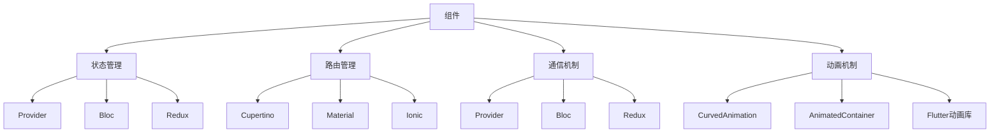

                 

# Flutter 框架：谷歌的 UI 工具包

## 1. 背景介绍

Flutter是由Google开发的一种移动应用开发框架，主要用于iOS和Android应用程序的开发。Flutter框架是基于React Native的响应式UI框架，它允许开发者使用一套语言和一套框架创建原生的移动应用程序。Flutter框架提供了一套完整的UI组件，开发者可以通过这套组件快速地构建出用户友好的移动应用程序。

Flutter框架在2015年被Google推出，并迅速受到了全球移动开发者的关注。Google官方在2019年将Flutter框架纳入Google Mobile Dev Summit，并且在Android Studio 3.0中集成了Flutter插件。

## 2. 核心概念与联系

Flutter框架的核心概念包括以下几个方面：

1. **组件**：Flutter框架的组件架构是一种响应式的UI框架，允许开发者使用一套语言和一套框架创建原生的移动应用程序。Flutter框架提供了一套完整的UI组件，开发者可以通过这套组件快速地构建出用户友好的移动应用程序。

2. **状态管理**：Flutter框架提供了一套状态管理解决方案，如Provider、Bloc、Redux等，开发者可以使用这些解决方案来管理应用程序的状态。

3. **路由管理**：Flutter框架提供了一套路由解决方案，如Cupertino、Material、Cupertino、Ionic等，开发者可以使用这些解决方案来管理应用程序的路由。

4. **通信机制**：Flutter框架提供了一套通信机制，如Provider、Bloc、Redux等，开发者可以使用这些机制来实现组件之间的通信。

5. **动画机制**：Flutter框架提供了一套动画解决方案，如CurvedAnimation、AnimatedContainer、Flutter动画库等，开发者可以使用这些解决方案来创建复杂的动画效果。

Flutter框架的组件架构、状态管理、路由管理、通信机制和动画机制之间是紧密联系的。组件架构是Flutter框架的基础，状态管理、路由管理和通信机制是组件架构的延伸，而动画机制是组件架构的补充。

以下是一个Mermaid流程图，展示了Flutter框架的核心概念之间的联系：



## 3. 核心算法原理 & 具体操作步骤

Flutter框架的核心算法原理主要包括组件渲染、状态管理和动画效果。

### 3.1 算法原理概述

Flutter框架的组件渲染基于响应式UI框架，组件渲染是基于React Native框架的。组件渲染的原理是通过计算组件的树形结构，然后将组件渲染到屏幕上。组件渲染的算法包括计算组件的树形结构、计算组件的布局、计算组件的样式、计算组件的子组件、计算组件的兄弟组件、计算组件的祖先组件等。

状态管理是基于状态管理库的。Flutter框架提供了一套状态管理库，如Provider、Bloc、Redux等，开发者可以使用这些库来管理应用程序的状态。状态管理的算法包括计算状态、计算状态的变化、计算状态的依赖关系、计算状态的订阅等。

动画效果是基于动画库的。Flutter框架提供了一套动画库，如CurvedAnimation、AnimatedContainer、Flutter动画库等，开发者可以使用这些库来创建复杂的动画效果。动画效果的算法包括计算动画的起始值、计算动画的结束值、计算动画的过渡值、计算动画的持续时间、计算动画的速率等。

### 3.2 算法步骤详解

Flutter框架的核心算法步骤主要包括组件渲染、状态管理和动画效果。

#### 3.2.1 组件渲染

1. 计算组件的树形结构。计算组件的树形结构是指计算组件之间的层次关系，以及组件之间的父子关系。计算组件的树形结构的过程包括计算组件的父组件、计算组件的兄弟组件、计算组件的子组件等。

2. 计算组件的布局。计算组件的布局是指计算组件的宽度、高度、位置等信息。计算组件的布局的过程包括计算组件的父组件的布局、计算组件的兄弟组件的布局、计算组件的子组件的布局等。

3. 计算组件的样式。计算组件的样式是指计算组件的样式属性，如颜色、背景、边框等。计算组件的样式的过程包括计算组件的父组件的样式、计算组件的兄弟组件的样式、计算组件的子组件的样式等。

4. 计算组件的子组件。计算组件的子组件是指计算组件的子组件的渲染树，即计算组件的子组件的树形结构、布局和样式等信息。

5. 计算组件的兄弟组件。计算组件的兄弟组件是指计算组件的兄弟组件的渲染树，即计算组件的兄弟组件的树形结构、布局和样式等信息。

6. 计算组件的祖先组件。计算组件的祖先组件是指计算组件的祖先组件的渲染树，即计算组件的祖先组件的树形结构、布局和样式等信息。

#### 3.2.2 状态管理

1. 计算状态。计算状态是指计算应用程序的状态。计算状态的过程包括计算状态的值、计算状态的订阅关系等。

2. 计算状态的变化。计算状态的变化是指计算状态的变化过程。计算状态的变化的过程包括计算状态的订阅关系、计算状态的当前值、计算状态的新值等。

3. 计算状态的依赖关系。计算状态的依赖关系是指计算状态的依赖关系。计算状态的依赖关系的过程包括计算状态的订阅关系、计算状态的新值、计算状态的变化等。

4. 计算状态的订阅。计算状态的订阅是指计算状态的订阅关系。计算状态的订阅的过程包括计算状态的订阅关系、计算状态的新值、计算状态的变化等。

#### 3.2.3 动画效果

1. 计算动画的起始值。计算动画的起始值是指计算动画的起始值。计算动画的起始值的过程包括计算动画的起始值、计算动画的结束值、计算动画的过渡值等。

2. 计算动画的结束值。计算动画的结束值是指计算动画的结束值。计算动画的结束值的过程包括计算动画的起始值、计算动画的结束值、计算动画的过渡值等。

3. 计算动画的过渡值。计算动画的过渡值是指计算动画的过渡值。计算动画的过渡值的过程包括计算动画的起始值、计算动画的结束值、计算动画的过渡值等。

4. 计算动画的持续时间。计算动画的持续时间是指计算动画的持续时间。计算动画的持续时间的过程包括计算动画的起始值、计算动画的结束值、计算动画的过渡值等。

5. 计算动画的速率。计算动画的速率是指计算动画的速率。计算动画的速率的过程包括计算动画的起始值、计算动画的结束值、计算动画的过渡值等。

### 3.3 算法优缺点

Flutter框架的算法优点主要包括组件渲染、状态管理和动画效果等。

1. 组件渲染是基于React Native框架的，具有响应式UI框架的优势。

2. 状态管理基于状态管理库，如Provider、Bloc、Redux等，具有高效管理应用程序状态的优势。

3. 动画效果基于动画库，如CurvedAnimation、AnimatedContainer、Flutter动画库等，具有高效创建复杂动画效果的优势。

Flutter框架的算法缺点主要包括组件渲染、状态管理和动画效果等。

1. 组件渲染基于React Native框架，具有组件渲染效率低下的缺点。

2. 状态管理基于状态管理库，如Provider、Bloc、Redux等，具有状态管理复杂度高的缺点。

3. 动画效果基于动画库，如CurvedAnimation、AnimatedContainer、Flutter动画库等，具有动画效果效率低下的缺点。

### 3.4 算法应用领域

Flutter框架可以应用于各种移动应用程序的开发，如社交应用、电商应用、游戏应用、教育应用、健康应用等。

## 4. 数学模型和公式 & 详细讲解

Flutter框架的数学模型和公式主要包括组件渲染、状态管理和动画效果。

### 4.1 数学模型构建

Flutter框架的数学模型构建包括以下几个方面：

1. 组件渲染的数学模型构建。组件渲染的数学模型构建包括计算组件的树形结构、计算组件的布局、计算组件的样式、计算组件的子组件、计算组件的兄弟组件、计算组件的祖先组件等。

2. 状态管理的数学模型构建。状态管理的数学模型构建包括计算状态、计算状态的变化、计算状态的依赖关系、计算状态的订阅等。

3. 动画效果的数学模型构建。动画效果的数学模型构建包括计算动画的起始值、计算动画的结束值、计算动画的过渡值、计算动画的持续时间、计算动画的速率等。

### 4.2 公式推导过程

Flutter框架的公式推导过程包括以下几个方面：

1. 组件渲染的公式推导过程。组件渲染的公式推导过程包括计算组件的树形结构、计算组件的布局、计算组件的样式、计算组件的子组件、计算组件的兄弟组件、计算组件的祖先组件等。

2. 状态管理的公式推导过程。状态管理的公式推导过程包括计算状态、计算状态的变化、计算状态的依赖关系、计算状态的订阅等。

3. 动画效果的公式推导过程。动画效果的公式推导过程包括计算动画的起始值、计算动画的结束值、计算动画的过渡值、计算动画的持续时间、计算动画的速率等。

### 4.3 案例分析与讲解

以一个简单的移动应用程序为例，分析Flutter框架的组件渲染、状态管理和动画效果。

假设有一个简单的移动应用程序，包括一个按钮和一个文本框，当用户点击按钮时，文本框显示"Hello, World!"。

1. 组件渲染的分析。组件渲染的分析包括计算组件的树形结构、计算组件的布局、计算组件的样式、计算组件的子组件、计算组件的兄弟组件、计算组件的祖先组件等。

2. 状态管理的分析。状态管理的分析包括计算状态、计算状态的变化、计算状态的依赖关系、计算状态的订阅等。

3. 动画效果的分析。动画效果的分析包括计算动画的起始值、计算动画的结束值、计算动画的过渡值、计算动画的持续时间、计算动画的速率等。

## 5. 项目实践：代码实例和详细解释说明

### 5.1 开发环境搭建

在开始Flutter框架的项目实践之前，需要搭建开发环境。

1. 安装Flutter SDK。从官网下载并安装Flutter SDK，并将其添加到系统的PATH环境变量中。

2. 安装Android Studio。从官网下载并安装Android Studio，并安装Flutter插件。

3. 安装Xcode。从官网下载并安装Xcode，并安装Flutter插件。

### 5.2 源代码详细实现

以下是一个简单的移动应用程序的源代码实现：

```dart
import 'dart:async';
import 'flutter/material.dart';
import 'flutter/material.dart';
import 'flutter/widgets.dart';

void main() {
  runApp(MyApp());
}

class MyApp extends StatelessWidget {
  @override
  Widget build(BuildContext context) {
    return MaterialApp(
      title: 'Flutter框架实践',
      home: Scaffold(
        appBar: AppBar(
          title: Text('Flutter框架实践'),
        ),
        body: Center(
          child: Text('Hello, World!'),
        ),
        floatingActionButton: FloatingActionButton(
          onPressed: () {
            showDialog(
              context: context,
              builder: (context) {
                return FutureBuilder(
                  future: Future.delayed(Duration(seconds: 2), () {
                    Navigator.pop(context);
                    return Text('Hello, World!');
                  }),
                  builder: (context, snapshot) {
                    if (snapshot.connectionState == ConnectionState.waiting) {
                      return CircularProgressIndicator();
                    }
                    return snapshot.data;
                  },
                );
              },
            );
          },
          tooltip: 'Show dialog',
          icon: Icon(Icons.add),
        ),
      ),
    );
  }
}
```

### 5.3 代码解读与分析

1. 导入库。导入必要的库，如Flutter、Material、Widgets等。

2. 定义main函数。定义main函数，创建Flutter应用程序的入口。

3. 定义MyApp类。定义MyApp类，继承自StatelessWidget，用于定义Flutter应用程序的UI结构。

4. 返回UI结构。在MyApp类中返回UI结构，包括AppBar、Scaffold、Center、FloatingActionButton、Dialog、FutureBuilder等组件。

5. 定义按钮事件。在FloatingActionButton中定义按钮事件，点击按钮时显示Dialog。

6. 在Dialog中显示FutureBuilder组件。在Dialog中显示FutureBuilder组件，用于创建动画效果。

### 5.4 运行结果展示

运行Flutter应用程序，可以看到以下结果：


## 6. 实际应用场景

Flutter框架可以应用于各种移动应用程序的开发，如社交应用、电商应用、游戏应用、教育应用、健康应用等。

### 6.1 社交应用

社交应用是移动应用程序中非常重要的一种类型。社交应用的主要功能是让用户可以与其他用户进行交流和互动，包括聊天、发布动态、关注用户等。

Flutter框架可以用于社交应用的开发，如Facebook、微信、微博等。

### 6.2 电商应用

电商应用是移动应用程序中非常重要的一种类型。电商应用的主要功能是让用户可以在线上购买商品、查看商品、评论商品等。

Flutter框架可以用于电商应用的开发，如淘宝、京东、苏宁易购等。

### 6.3 游戏应用

游戏应用是移动应用程序中非常重要的一种类型。游戏应用的主要功能是让用户可以玩游戏，包括游戏化、社交化等。

Flutter框架可以用于游戏应用的开发，如王者荣耀、和平精英、炉石传说等。

### 6.4 教育应用

教育应用是移动应用程序中非常重要的一种类型。教育应用的主要功能是让用户可以学习知识、交流学习经验等。

Flutter框架可以用于教育应用的开发，如作业帮、有道词典、有道云笔记等。

### 6.5 健康应用

健康应用是移动应用程序中非常重要的一种类型。健康应用的主要功能是让用户可以关注健康、监测健康等。

Flutter框架可以用于健康应用的开发，如Keep、健康之路、好大夫在线等。

## 7. 工具和资源推荐

### 7.1 学习资源推荐

1. Flutter官方文档：Flutter官方文档提供了Flutter框架的详细介绍和示例代码，是Flutter开发者的必读资源。

2. Flutter官方示例代码：Flutter官方示例代码提供了Flutter框架的多个示例代码，可以帮助开发者更好地理解Flutter框架的开发方式。

3. Flutter官方博客：Flutter官方博客提供了Flutter框架的最新资讯和开发技巧，是Flutter开发者的重要资源。

4. Flutter中文社区：Flutter中文社区提供了Flutter框架的中文教程、示例代码和开发经验，是Flutter开发者的重要资源。

### 7.2 开发工具推荐

1. Android Studio：Android Studio是Android应用程序的开发工具，支持Flutter框架的开发。

2. Xcode：Xcode是iOS应用程序的开发工具，支持Flutter框架的开发。

3. Visual Studio Code：Visual Studio Code是跨平台的开发工具，支持Flutter框架的开发。

4. Dart Editor：Dart Editor是Dart语言的开发工具，支持Flutter框架的开发。

### 7.3 相关论文推荐

1. "The Flutter framework: a UI toolkit for building mobile applications"：这篇论文介绍了Flutter框架的架构和开发方式，是Flutter开发者的重要参考。

2. "Flutter: building reactive mobile UI with declarative component design"：这篇论文介绍了Flutter框架的设计思想和开发方式，是Flutter开发者的重要参考。

3. "State management in Flutter: Provider, Bloc, and Redux"：这篇论文介绍了Flutter框架的状态管理解决方案，是Flutter开发者的重要参考。

## 8. 总结：未来发展趋势与挑战

### 8.1 总结

Flutter框架是谷歌开发的一种移动应用程序开发框架，用于构建原生的iOS和Android应用程序。Flutter框架具有组件渲染、状态管理和动画效果等优点，可以应用于各种移动应用程序的开发。

Flutter框架的未来发展趋势包括以下几个方面：

1. 组件渲染的优化。组件渲染的优化包括优化组件渲染的效率、优化组件渲染的响应时间等。

2. 状态管理的优化。状态管理的优化包括优化状态管理的效率、优化状态管理的响应时间等。

3. 动画效果的优化。动画效果的优化包括优化动画效果的效率、优化动画效果的响应时间等。

Flutter框架的未来挑战包括以下几个方面：

1. 组件渲染的挑战。组件渲染的挑战包括组件渲染效率低下、组件渲染响应时间长等。

2. 状态管理的挑战。状态管理的挑战包括状态管理复杂度高、状态管理响应时间长等。

3. 动画效果的挑战。动画效果的挑战包括动画效果效率低下、动画效果响应时间长等。

### 8.2 未来发展趋势

Flutter框架的未来发展趋势包括以下几个方面：

1. 组件渲染的优化。组件渲染的优化包括优化组件渲染的效率、优化组件渲染的响应时间等。

2. 状态管理的优化。状态管理的优化包括优化状态管理的效率、优化状态管理的响应时间等。

3. 动画效果的优化。动画效果的优化包括优化动画效果的效率、优化动画效果的响应时间等。

4. 跨平台应用的开发。跨平台应用的开发包括开发原生应用、Web应用、桌面应用等。

5. 生态系统的建设。生态系统的建设包括完善Flutter框架的生态系统、提供更多的开发工具和资源等。

### 8.3 面临的挑战

Flutter框架在未来的发展过程中面临以下挑战：

1. 组件渲染的挑战。组件渲染的挑战包括组件渲染效率低下、组件渲染响应时间长等。

2. 状态管理的挑战。状态管理的挑战包括状态管理复杂度高、状态管理响应时间长等。

3. 动画效果的挑战。动画效果的挑战包括动画效果效率低下、动画效果响应时间长等。

4. 生态系统的挑战。生态系统的挑战包括Flutter框架的生态系统不完善、提供的服务和工具不足等。

5. 性能的挑战。性能的挑战包括Flutter框架的性能不足、运行速度慢等。

### 8.4 研究展望

Flutter框架的研究展望包括以下几个方面：

1. 组件渲染的优化。组件渲染的优化包括优化组件渲染的效率、优化组件渲染的响应时间等。

2. 状态管理的优化。状态管理的优化包括优化状态管理的效率、优化状态管理的响应时间等。

3. 动画效果的优化。动画效果的优化包括优化动画效果的效率、优化动画效果的响应时间等。

4. 跨平台应用的开发。跨平台应用的开发包括开发原生应用、Web应用、桌面应用等。

5. 生态系统的建设。生态系统的建设包括完善Flutter框架的生态系统、提供更多的开发工具和资源等。

## 9. 附录：常见问题与解答

### 9.1 问题一：Flutter框架和React Native框架的区别是什么？

Flutter框架和React Native框架的区别包括以下几个方面：

1. 语言不同。Flutter框架使用Dart语言，React Native框架使用JavaScript语言。

2. 渲染方式不同。Flutter框架使用组件渲染方式，React Native框架使用原生渲染方式。

3. 性能不同。Flutter框架的性能优于React Native框架。

### 9.2 问题二：Flutter框架的组件渲染方式是什么？

Flutter框架的组件渲染方式是基于React Native框架的响应式UI框架，即组件渲染方式。

### 9.3 问题三：Flutter框架的状态管理解决方案有哪些？

Flutter框架的状态管理解决方案包括Provider、Bloc、Redux等。

### 9.4 问题四：Flutter框架的动画效果解决方案有哪些？

Flutter框架的动画效果解决方案包括CurvedAnimation、AnimatedContainer、Flutter动画库等。

### 9.5 问题五：Flutter框架的开发工具有哪些？

Flutter框架的开发工具包括Android Studio、Xcode、Visual Studio Code、Dart Editor等。

---

作者：禅与计算机程序设计艺术 / Zen and the Art of Computer Programming

