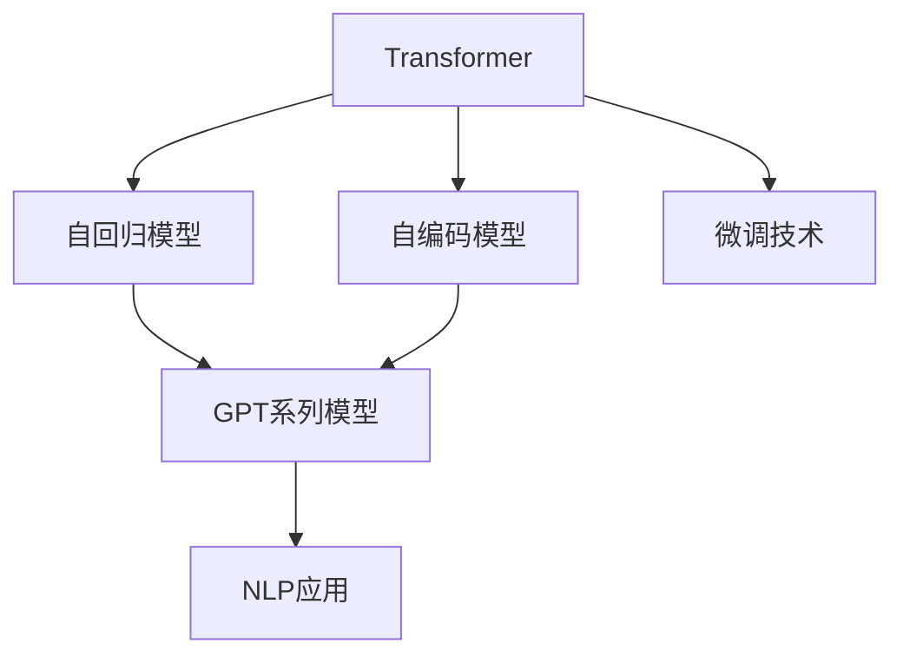

                 

# GPT 系列：语言模型的里程碑

> 关键词：GPT-3, Transformer, 自回归模型, 自编码模型, 预训练, 微调, 自然语言处理(NLP)

## 1. 背景介绍

### 1.1 问题由来
自2018年OpenAI发布第一款生成式预训练语言模型GPT以来，大语言模型(GPT)系列已经迅速成为人工智能领域的热门话题。GPT系列不仅在自然语言处理(NLP)、机器翻译、对话系统等任务上取得了卓越成绩，更以其强大的语言生成和推理能力，引起了广泛的社会关注。

GPT系列的成功，背后有深刻的技术原理和创新设计。本文将详细探讨GPT系列模型的技术核心，从自回归模型和自编码模型入手，深入剖析其原理和架构，梳理GPT 3.0以来的技术演进和未来趋势，并给出实际项目中的代码实例和性能分析。

## 2. 核心概念与联系

### 2.1 核心概念概述

为理解GPT系列模型，我们先回顾一些关键概念：

- **生成式预训练语言模型(Generative Pre-trained Language Model, GPT)**：利用大规模无标签文本数据进行自监督预训练，然后通过有监督的微调任务进行适配。GPT模型在语言生成、自然语言推理、机器翻译等多个领域均有优异表现。

- **自回归模型(Autoregressive Model)**：一种利用前文信息预测后文的语言模型。例如GPT系列模型，通过将当前单词的条件概率转化为对后文单词的条件概率，实现语言生成。

- **自编码模型(Autocoding Model)**：利用前文和后文之间的关系，通过编码器-解码器结构进行文本生成。例如BERT系列模型，通过将输入文本编码成向量表示，然后用解码器生成文本。

- **Transformer架构**：一种基于自注意力机制的神经网络架构，通过多头注意力和残差连接等机制，显著提升了语言模型的训练效率和效果。

- **微调(Fine-tuning)**：在大模型上进行有监督训练，适配特定的下游任务。常见的微调任务包括文本分类、问答、翻译等。

- **自然语言处理(NLP)**：利用计算机对自然语言文本进行处理的学科，涉及语言理解、语言生成、文本分类、机器翻译等多个方面。

这些核心概念构成了GPT系列模型的基础，帮助我们理解其技术精髓。

### 2.2 核心概念原理和架构的 Mermaid 流程图



这个流程图展示了从Transformer到GPT系列模型的演进路径。Transformer作为GPT系列模型的基础架构，通过自回归或自编码的方式，将自然语言文本转化为向量表示，并实现语言生成。微调技术在此基础上，使模型能够适应特定下游任务，从而实现广泛的NLP应用。

## 3. 核心算法原理 & 具体操作步骤

### 3.1 算法原理概述

GPT系列模型的核心算法是自回归生成算法。其核心思想是通过模型学习大量的无标签文本数据，提取语言规律和语法结构，然后利用这些规律进行语言生成。其生成过程可以理解为一种基于序列的推断过程，模型通过计算当前位置前文的条件概率分布，预测下一个单词的概率分布，并根据概率分布选择最可能的单词进行生成。

GPT系列模型分为自回归和自编码两种生成方式，其中自回归模型基于前文预测后文，自编码模型则通过编码器-解码器结构生成文本。在预训练阶段，模型使用大规模无标签文本数据进行自监督学习，学习语言的通用表示。在微调阶段，通过有监督的学习任务，如文本分类、机器翻译、对话生成等，适配特定的下游任务。

### 3.2 算法步骤详解

GPT系列模型的算法步骤主要包括以下几个关键环节：

**Step 1: 预训练**

- **数据准备**：收集大规模无标签文本数据，如维基百科、互联网文章等。
- **模型构建**：选择Transformer架构，并确定模型的超参数。
- **训练过程**：将数据分批次输入模型，进行前向传播和反向传播，最小化损失函数。
- **预训练完成**：在预训练过程中，通过计算前后文的相关性，学习语言模型，生成逼近真实文本的概率分布。

**Step 2: 微调**

- **任务适配**：根据具体任务类型，选择合适的任务适配层，如分类器、解码器等。
- **损失函数**：定义适合当前任务的损失函数，如交叉熵损失、负对数似然损失等。
- **优化器**：选择合适的优化器及其参数，如AdamW、SGD等。
- **训练过程**：将标注数据分批次输入模型，进行前向传播和反向传播，更新模型参数。
- **评估过程**：在验证集和测试集上评估模型性能，选择合适的超参数组合。

**Step 3: 模型部署**

- **模型保存**：将微调后的模型保存到本地或云端存储，方便后续使用。
- **推理过程**：使用模型进行推理，生成新的文本或回答用户查询。
- **监控和优化**：实时监控模型性能，根据反馈进行优化调整。

### 3.3 算法优缺点

GPT系列模型具有以下优点：

1. **高效生成**：利用大规模无标签文本数据进行预训练，生成的文本质量和多样性较高。
2. **通用性强**：适用于多种NLP任务，只需通过微调适配即可。
3. **可解释性**：通过分析模型的生成过程，可以理解模型推理的逻辑。
4. **技术成熟**：经过多年的研究和应用，技术相对成熟，应用广泛。

同时，GPT系列模型也存在一些缺点：

1. **数据依赖**：预训练和微调过程对数据依赖较大，数据质量直接影响模型性能。
2. **计算资源需求高**：模型参数量大，计算和存储资源需求高，训练和推理速度较慢。
3. **可控性差**：生成的文本可能包含有害信息、误导性内容，需要严格监控和控制。
4. **泛化能力有限**：在特定领域的应用中，模型可能无法充分利用领域知识，泛化能力有限。

### 3.4 算法应用领域

GPT系列模型已经在多个领域展示了其强大的应用能力，包括：

- **自然语言处理(NLP)**：文本分类、文本生成、机器翻译、命名实体识别、情感分析等。
- **对话系统**：基于GPT的对话机器人、聊天系统等。
- **文本摘要**：自动摘要生成、新闻精简等。
- **数据增强**：利用GPT生成的文本增强标注数据，提升模型性能。
- **文本推理**：基于GPT的文本推理、解释生成等。

除了以上这些经典应用，GPT系列模型还被应用到更广泛的领域，如可控文本生成、知识图谱构建、创意写作等，为各行各业带来了创新性变革。

## 4. 数学模型和公式 & 详细讲解 & 举例说明

### 4.1 数学模型构建

GPT系列模型的数学模型主要包括以下几个部分：

- **输入表示**：将输入文本转化为模型可以处理的向量表示。
- **自注意力机制**：通过多头自注意力机制，捕捉输入文本中的长距离依赖关系。
- **生成过程**：通过解码器生成目标文本，实现语言生成。

### 4.2 公式推导过程

以下是GPT系列模型的核心公式推导：

$$
\text{Prob}(y_{1:T}|x) = \prod_{t=1}^T \text{Prob}(y_t|y_{<t}, x)
$$

其中 $y_{1:T}$ 表示生成的目标文本序列，$y_t$ 表示第 $t$ 个生成单词，$y_{<t}$ 表示 $y_{1:t-1}$。模型通过计算 $y_t$ 在给定前文 $y_{<t}$ 和输入文本 $x$ 的条件概率，实现语言生成。

**Transformer的注意力机制**：

$$
\text{Attention}(Q, K, V) = \text{softmax}(\frac{QK^T}{\sqrt{d_k}})V
$$

其中 $Q, K, V$ 分别为编码器中的查询向量、键向量和值向量，$d_k$ 为键向量的维度。注意力机制通过计算查询向量 $Q$ 和键向量 $K$ 的内积，得到每个键向量的注意力分数，再乘以值向量 $V$，得到加权后的向量表示。

### 4.3 案例分析与讲解

我们以GPT-3为例，分析其在特定任务上的微调过程。

假设任务为文本分类，具体步骤如下：

1. **数据准备**：收集标注数据集，并划分为训练集、验证集和测试集。
2. **模型选择**：选择GPT-3作为初始化模型。
3. **任务适配**：在模型顶部添加一个分类器，作为微调的任务适配层。
4. **损失函数**：定义交叉熵损失函数，用于计算模型预测与真实标签之间的差距。
5. **优化器**：选择AdamW优化器，设置学习率、批大小等超参数。
6. **训练过程**：将训练集数据分批次输入模型，进行前向传播和反向传播，最小化损失函数。
7. **评估过程**：在验证集和测试集上评估模型性能，根据结果调整超参数。

## 5. 项目实践：代码实例和详细解释说明

### 5.1 开发环境搭建

在进行GPT系列模型的微调项目时，首先需要搭建好开发环境。以下是使用Python和PyTorch进行微调的开发环境配置：

1. 安装Anaconda：从官网下载并安装Anaconda，用于创建独立的Python环境。
2. 创建并激活虚拟环境：
```bash
conda create -n gpt-env python=3.8 
conda activate gpt-env
```
3. 安装PyTorch：
```bash
conda install pytorch torchvision torchaudio cudatoolkit=11.1 -c pytorch -c conda-forge
```
4. 安装GPT-3库：
```bash
pip install transformers
```
5. 安装各类工具包：
```bash
pip install numpy pandas scikit-learn matplotlib tqdm jupyter notebook ipython
```

完成上述步骤后，即可在`gpt-env`环境中开始GPT-3的微调实践。

### 5.2 源代码详细实现

以下是使用Transformers库对GPT-3进行文本分类任务微调的PyTorch代码实现：

```python
from transformers import GPT3LMHeadModel, AdamW
from torch.utils.data import Dataset, DataLoader
import torch

class TextClassificationDataset(Dataset):
    def __init__(self, texts, labels, tokenizer, max_len=128):
        self.texts = texts
        self.labels = labels
        self.tokenizer = tokenizer
        self.max_len = max_len
        
    def __len__(self):
        return len(self.texts)
    
    def __getitem__(self, item):
        text = self.texts[item]
        label = self.labels[item]
        
        encoding = self.tokenizer(text, return_tensors='pt', max_length=self.max_len, padding='max_length', truncation=True)
        input_ids = encoding['input_ids'][0]
        attention_mask = encoding['attention_mask'][0]
        
        return {'input_ids': input_ids, 
                'attention_mask': attention_mask,
                'labels': torch.tensor(label, dtype=torch.long)}
```

**模型微调代码**：

```python
from transformers import GPT3LMHeadModel, AdamW

model = GPT3LMHeadModel.from_pretrained('gpt3', num_labels=2)

optimizer = AdamW(model.parameters(), lr=2e-5)
```

**训练和评估函数**：

```python
from torch.utils.data import DataLoader
from tqdm import tqdm
from sklearn.metrics import accuracy_score

device = torch.device('cuda') if torch.cuda.is_available() else torch.device('cpu')
model.to(device)

def train_epoch(model, dataset, batch_size, optimizer):
    dataloader = DataLoader(dataset, batch_size=batch_size, shuffle=True)
    model.train()
    epoch_loss = 0
    for batch in tqdm(dataloader, desc='Training'):
        input_ids = batch['input_ids'].to(device)
        attention_mask = batch['attention_mask'].to(device)
        labels = batch['labels'].to(device)
        model.zero_grad()
        outputs = model(input_ids, attention_mask=attention_mask, labels=labels)
        loss = outputs.loss
        epoch_loss += loss.item()
        loss.backward()
        optimizer.step()
    return epoch_loss / len(dataloader)

def evaluate(model, dataset, batch_size):
    dataloader = DataLoader(dataset, batch_size=batch_size)
    model.eval()
    preds, labels = [], []
    with torch.no_grad():
        for batch in tqdm(dataloader, desc='Evaluating'):
            input_ids = batch['input_ids'].to(device)
            attention_mask = batch['attention_mask'].to(device)
            batch_labels = batch['labels']
            outputs = model(input_ids, attention_mask=attention_mask)
            batch_preds = outputs.logits.argmax(dim=2).to('cpu').tolist()
            batch_labels = batch_labels.to('cpu').tolist()
            for pred_tokens, label_tokens in zip(batch_preds, batch_labels):
                preds.append(pred_tokens)
                labels.append(label_tokens)
                
    return accuracy_score(labels, preds)
```

**训练流程**：

```python
epochs = 5
batch_size = 16

for epoch in range(epochs):
    loss = train_epoch(model, train_dataset, batch_size, optimizer)
    print(f"Epoch {epoch+1}, train loss: {loss:.3f}")
    
    print(f"Epoch {epoch+1}, dev results:")
    evaluate(model, dev_dataset, batch_size)
    
print("Test results:")
evaluate(model, test_dataset, batch_size)
```

### 5.3 代码解读与分析

**TextClassificationDataset类**：
- `__init__`方法：初始化文本、标签、分词器等关键组件。
- `__len__`方法：返回数据集的样本数量。
- `__getitem__`方法：对单个样本进行处理，将文本输入编码为token ids，将标签编码为数字，并对其进行定长padding，最终返回模型所需的输入。

**训练和评估函数**：
- 使用PyTorch的DataLoader对数据集进行批次化加载，供模型训练和推理使用。
- 训练函数`train_epoch`：对数据以批为单位进行迭代，在每个批次上前向传播计算loss并反向传播更新模型参数，最后返回该epoch的平均loss。
- 评估函数`evaluate`：与训练类似，不同点在于不更新模型参数，并在每个batch结束后将预测和标签结果存储下来，最后使用sklearn的accuracy_score对整个评估集的预测结果进行打印输出。

**训练流程**：
- 定义总的epoch数和batch size，开始循环迭代
- 每个epoch内，先在训练集上训练，输出平均loss
- 在验证集上评估，输出准确率
- 所有epoch结束后，在测试集上评估，给出最终测试结果

## 6. 实际应用场景

### 6.1 智能客服系统

基于GPT系列模型的智能客服系统，可以提供全天候服务，解决传统客服的响应速度慢、高峰期负荷重、人工成本高等问题。GPT-3模型可以处理自然语言理解和生成，能够回答用户咨询，提供个性化服务，大幅提升客户体验和问题解决效率。

在技术实现上，可以收集企业内部的历史客服对话记录，将问题和最佳答复构建成监督数据，在此基础上对GPT-3模型进行微调。微调后的模型能够自动理解用户意图，匹配最合适的答案模板进行回复。对于用户提出的新问题，还可以接入检索系统实时搜索相关内容，动态组织生成回答。

### 6.2 金融舆情监测

金融机构需要实时监测市场舆论动向，以便及时应对负面信息传播，规避金融风险。传统的人工监测方式成本高、效率低，难以应对网络时代海量信息爆发的挑战。基于GPT系列模型的文本分类和情感分析技术，为金融舆情监测提供了新的解决方案。

具体而言，可以收集金融领域相关的新闻、报道、评论等文本数据，并对其进行主题标注和情感标注。在此基础上对GPT-3模型进行微调，使其能够自动判断文本属于何种主题，情感倾向是正面、中性还是负面。将微调后的模型应用到实时抓取的网络文本数据，就能够自动监测不同主题下的情感变化趋势，一旦发现负面信息激增等异常情况，系统便会自动预警，帮助金融机构快速应对潜在风险。

### 6.3 个性化推荐系统

当前的推荐系统往往只依赖用户的历史行为数据进行物品推荐，无法深入理解用户的真实兴趣偏好。基于GPT系列模型的个性化推荐系统可以更好地挖掘用户行为背后的语义信息，从而提供更精准、多样的推荐内容。

在实践中，可以收集用户浏览、点击、评论、分享等行为数据，提取和用户交互的物品标题、描述、标签等文本内容。将文本内容作为模型输入，用户的后续行为（如是否点击、购买等）作为监督信号，在此基础上微调GPT-3模型。微调后的模型能够从文本内容中准确把握用户的兴趣点。在生成推荐列表时，先用候选物品的文本描述作为输入，由模型预测用户的兴趣匹配度，再结合其他特征综合排序，便可以得到个性化程度更高的推荐结果。

### 6.4 未来应用展望

随着GPT系列模型的不断发展，其在更多领域的应用前景愈发广阔。未来，GPT-3将在智慧医疗、智能教育、智慧城市、企业生产、社会治理、文娱传媒等多个领域带来深刻变革。

在智慧医疗领域，基于GPT的对话机器人、知识图谱构建、医疗问答等应用将提升医疗服务的智能化水平，辅助医生诊疗，加速新药开发进程。

在智能教育领域，基于GPT的教育问答、作业批改、知识推荐等应用将因材施教，促进教育公平，提高教学质量。

在智慧城市治理中，基于GPT的城市事件监测、舆情分析、应急指挥等应用将提高城市管理的自动化和智能化水平，构建更安全、高效的未来城市。

此外，在企业生产、社会治理、文娱传媒等众多领域，基于GPT的智能技术应用也将不断涌现，为经济社会发展注入新的动力。相信随着技术的日益成熟，GPT系列模型必将在构建人机协同的智能时代中扮演越来越重要的角色。

## 7. 工具和资源推荐

### 7.1 学习资源推荐

为了帮助开发者系统掌握GPT系列模型的技术基础和实践技巧，这里推荐一些优质的学习资源：

1. 《深度学习与自然语言处理》：吴恩达教授在Coursera上开设的自然语言处理课程，详细讲解了NLP和GPT系列模型的核心算法。
2. 《自然语言处理入门》：斯坦福大学官方提供的NLP入门课程，有丰富的视频、PPT和代码实现，适合初学者入门。
3. 《Transformer理论与实践》：HuggingFace官方博客，系统介绍了Transformer和GPT系列模型的原理和应用，提供了丰富的代码样例。
4. 《深度学习中的自然语言处理》：李宏毅教授在Coursera上开设的NLP课程，内容覆盖全面，讲解深入。
5. 《GPT-3：深度学习与自然语言处理》：Google开发者博客，详细介绍了GPT-3的架构和微调技巧，提供了丰富的代码实现和应用案例。

通过对这些资源的学习实践，相信你一定能够快速掌握GPT系列模型的精髓，并用于解决实际的NLP问题。

### 7.2 开发工具推荐

高效的开发离不开优秀的工具支持。以下是几款用于GPT系列模型开发的常用工具：

1. PyTorch：基于Python的开源深度学习框架，灵活动态的计算图，适合快速迭代研究。GPT系列模型大多支持PyTorch版本的实现。
2. TensorFlow：由Google主导开发的开源深度学习框架，生产部署方便，适合大规模工程应用。GPT系列模型也有TensorFlow版本的实现。
3. HuggingFace Transformers库：集成了众多SOTA语言模型，支持PyTorch和TensorFlow，是进行GPT系列模型微调的重要工具。
4. Weights & Biases：模型训练的实验跟踪工具，可以记录和可视化模型训练过程中的各项指标，方便对比和调优。
5. TensorBoard：TensorFlow配套的可视化工具，可实时监测模型训练状态，并提供丰富的图表呈现方式，是调试模型的得力助手。
6. Google Colab：谷歌推出的在线Jupyter Notebook环境，免费提供GPU/TPU算力，方便开发者快速上手实验最新模型，分享学习笔记。

合理利用这些工具，可以显著提升GPT系列模型的开发效率，加快创新迭代的步伐。

### 7.3 相关论文推荐

GPT系列模型的发展源于学界的持续研究。以下是几篇奠基性的相关论文，推荐阅读：

1. Attention is All You Need：提出了Transformer结构，开启了NLP领域的预训练大模型时代。
2. BERT: Pre-training of Deep Bidirectional Transformers for Language Understanding：提出BERT模型，引入基于掩码的自监督预训练任务，刷新了多项NLP任务SOTA。
3. Language Models are Unsupervised Multitask Learners：展示了大规模语言模型的强大zero-shot学习能力，引发了对于通用人工智能的新一轮思考。
4. GPT-3: Language Models are Few-Shot Learners：提出GPT-3模型，展示了其在少样本学习任务上的优异表现，刷新了多项SOTA。
5. Intern GPT-3：对GPT-3进行了系统性分析，揭示了其语言生成机制和技术挑战。
6. Revisiting Prompt Engineering for Large Language Models：探讨了 Prompt 设计对GPT系列模型生成质量的影响，提出了多项改进策略。

这些论文代表了大语言模型GPT系列的发展脉络。通过学习这些前沿成果，可以帮助研究者把握学科前进方向，激发更多的创新灵感。

## 8. 总结：未来发展趋势与挑战

### 8.1 研究成果总结

本文对GPT系列模型的技术核心进行了详细探讨，从自回归模型和自编码模型入手，深入剖析了GPT系列模型的原理和架构，梳理了GPT 3.0以来的技术演进和未来趋势，并给出了实际项目中的代码实例和性能分析。

通过本文的系统梳理，可以看到，GPT系列模型通过自回归生成算法，利用大规模无标签文本数据进行预训练，具有高效生成、通用性强、可解释性等优点。但同时，数据依赖大、计算资源需求高、可控性差等问题也是不容忽视的。未来，通过更多的研究和应用，相信GPT系列模型将进一步提升其性能和应用范围，为NLP技术的产业化进程带来新的突破。

### 8.2 未来发展趋势

展望未来，GPT系列模型的发展趋势将包括以下几个方面：

1. **模型规模继续增大**：随着算力成本的下降和数据规模的扩张，GPT系列模型的参数量还将继续增长，预训练和微调的数据规模也将进一步扩大。超大模型将带来更加丰富多样的语言生成能力，提升语言模型的泛化性和表现力。
2. **自编码和自回归并重**：未来的模型设计将更多地考虑自编码和自回归的平衡，自编码模型将发挥其结构清晰、泛化能力强的优势，与自回归模型共同提升生成效果。
3. **多模态融合**：未来的GPT系列模型将融合视觉、语音等多模态信息，构建多模态语言模型，提升其在现实世界中的应用能力。
4. **知识图谱整合**：将符号化的先验知识，如知识图谱、逻辑规则等，与神经网络模型进行巧妙融合，引导微调过程学习更准确、合理的语言模型，增强模型的推理能力。
5. **参数高效微调**：开发更加参数高效的微调方法，如Prefix-Tuning、LoRA等，在固定大部分预训练参数的同时，只更新极少量的任务相关参数，进一步降低微调过程中的计算和存储需求。
6. **持续学习**：通过持续学习机制，使GPT系列模型能够不断从新数据中学习，同时保持已学习的知识，避免灾难性遗忘，提高模型的时效性和适应性。

### 8.3 面临的挑战

尽管GPT系列模型已经取得了显著的成就，但在迈向更加智能化、普适化应用的过程中，它仍面临一些挑战：

1. **数据依赖**：预训练和微调过程对大规模无标签数据的依赖较大，数据质量和多样性直接影响模型的性能。
2. **计算资源需求高**：GPT系列模型的参数量较大，训练和推理过程中对计算和存储资源的需求高，如何优化资源使用是一个重要问题。
3. **可控性差**：生成的文本可能包含有害信息、误导性内容，需要严格监控和控制，以避免安全风险。
4. **泛化能力有限**：在特定领域的应用中，模型可能无法充分利用领域知识，泛化能力有限。
5. **可解释性不足**：GPT系列模型的决策过程难以解释，难以对其推理逻辑进行分析和调试。

### 8.4 研究展望

面对GPT系列模型面临的挑战，未来的研究方向需要在以下几个方面寻求新的突破：

1. **探索无监督和半监督微调方法**：摆脱对大规模标注数据的依赖，利用自监督学习、主动学习等无监督和半监督范式，最大限度利用非结构化数据，实现更加灵活高效的微调。
2. **研究参数高效和计算高效的微调范式**：开发更加参数高效的微调方法，在固定大部分预训练参数的同时，只更新极少量的任务相关参数。同时优化微调模型的计算图，减少前向传播和反向传播的资源消耗，实现更加轻量级、实时性的部署。
3. **引入因果分析和博弈论工具**：将因果分析方法引入微调模型，识别出模型决策的关键特征，增强输出解释的因果性和逻辑性。借助博弈论工具刻画人机交互过程，主动探索并规避模型的脆弱点，提高系统稳定性。
4. **纳入伦理道德约束**：在模型训练目标中引入伦理导向的评估指标，过滤和惩罚有偏见、有害的输出倾向。同时加强人工干预和审核，建立模型行为的监管机制，确保输出符合人类价值观和伦理道德。
5. **知识整合能力提升**：将符号化的先验知识，如知识图谱、逻辑规则等，与神经网络模型进行巧妙融合，引导微调过程学习更准确、合理的语言模型。同时加强不同模态数据的整合，实现视觉、语音等多模态信息与文本信息的协同建模。

这些研究方向将推动GPT系列模型的技术成熟和应用普及，使语言模型在更多领域发挥更大的作用，为人机协同的智能时代带来新的突破。

## 9. 附录：常见问题与解答

**Q1：GPT系列模型的预训练过程需要多少数据？**

A: GPT系列模型的预训练过程需要大规模无标签文本数据。通常，GPT-3的预训练数据集包含约750亿个英文单词，预训练过程需要几千个GPU进行几十天的计算。数据规模和计算资源需求较大。

**Q2：GPT系列模型为什么能够在少样本情况下表现优异？**

A: GPT系列模型通过大规模无标签文本数据的预训练，学习到了丰富的语言知识和语义信息，具有很强的语言理解能力和生成能力。在微调过程中，模型能够利用这些知识对新任务进行快速适应，因此能够在少样本情况下表现优异。

**Q3：GPT系列模型在特定领域的应用效果如何？**

A: GPT系列模型在特定领域的应用效果往往不如通用大模型，因为通用大模型涵盖了广泛的语言知识和语义信息，而特定领域的数据集规模和质量可能无法满足通用大模型的需求。因此，需要在特定领域进行进一步预训练和微调，才能获得理想的效果。

**Q4：GPT系列模型与其他大模型相比，有什么优势和劣势？**

A: GPT系列模型具有以下优势：
1. 高效生成：利用大规模无标签文本数据进行预训练，生成的文本质量和多样性较高。
2. 通用性强：适用于多种NLP任务，只需通过微调适配即可。
3. 可解释性：通过分析模型的生成过程，可以理解模型推理的逻辑。

同时，GPT系列模型也存在一些劣势：
1. 数据依赖：预训练和微调过程对大规模无标签数据的依赖较大，数据质量和多样性直接影响模型的性能。
2. 计算资源需求高：GPT系列模型的参数量较大，训练和推理过程中对计算和存储资源的需求高，训练和推理速度较慢。
3. 可控性差：生成的文本可能包含有害信息、误导性内容，需要严格监控和控制。

---

作者：禅与计算机程序设计艺术 / Zen and the Art of Computer Programming

