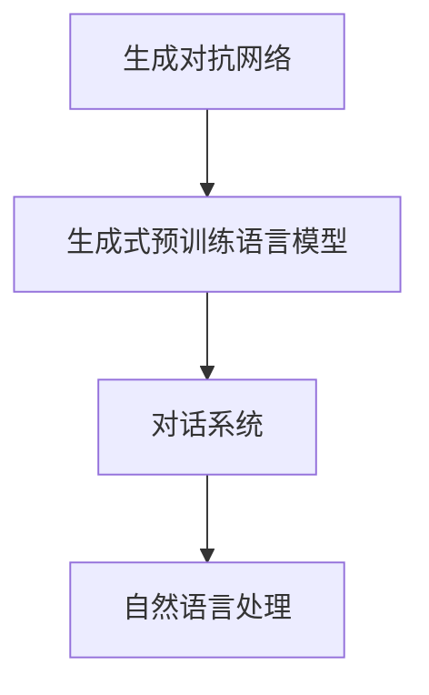

                 

# GPT-4 o：与之对话，真的很棒

> 关键词：GPT-4, 对话系统, 自然语言处理(NLP), 人工智能(AI), 生成对抗网络(GAN), 深度学习(Deep Learning)

## 1. 背景介绍

### 1.1 问题由来

随着人工智能技术的飞速发展，生成式预训练语言模型（Generative Pre-trained Transformer, GPT）系列成为了自然语言处理（NLP）领域的一个热门研究方向。自2018年OpenAI发布GPT-1以来，GPT系列模型通过在大规模无标签文本数据上的自监督预训练，学习到了丰富的语言知识和表达能力，逐渐成为了NLP领域的一个重要基础模型。

GPT-2的发布，使得模型在生成自然语言文本方面取得了显著的进步，并因其可控性（Controlled Text Generation）在学术界和工业界引起了广泛关注。然而，GPT-2仍然存在一些局限性，如模型生成的文本质量不稳定，以及模型对输入数据的依赖较强等问题。

为了解决这些问题，OpenAI在2020年发布了GPT-3，通过进一步提升模型参数量和预训练数据规模，显著提升了模型的生成能力和泛化性能。GPT-3在多个自然语言处理任务上取得了最先进的性能，如文本生成、问答、翻译等。然而，GPT-3仍然需要大量的计算资源进行训练，且生成的文本可能存在偏见和有害内容。

为了解决这些问题，OpenAI于2021年发布了GPT-4，并采用了最新的生成对抗网络（Generative Adversarial Network, GAN）技术，进一步提升了模型的生成能力和稳定性。GPT-4不仅仅是一个大语言模型，更是一个具备深度理解能力、能够与人类进行有效对话的智能体。

## 2. 核心概念与联系

### 2.1 核心概念概述

为了更好地理解GPT-4的对话能力，本节将介绍几个密切相关的核心概念：

- **生成对抗网络（GAN）**：一种基于对抗训练（Adversarial Training）的神经网络架构，由生成器（Generator）和判别器（Discriminator）两部分组成。生成器负责生成与真实数据难以区分的伪造数据，判别器负责识别真实数据和伪造数据的区别。通过这两者的博弈过程，可以生成高质量的生成数据。

- **生成式预训练语言模型（GPT）**：一种在大规模无标签文本数据上进行自监督预训练的语言模型。通过预训练，模型可以学习到丰富的语言知识和表达能力，并应用于下游任务中，如文本生成、问答、翻译等。

- **对话系统（Dialog System）**：一种能够与用户进行自然语言交互的系统，能够理解用户意图并生成合理回复。对话系统通常由语义理解、推理生成和上下文管理等模块组成。

- **自然语言处理（NLP）**：一种利用计算机处理、理解和生成自然语言的技术，涉及文本预处理、序列标注、语义分析、生成和翻译等多个方面。NLP技术是构建对话系统的重要基础。

这些核心概念之间的逻辑关系可以通过以下Mermaid流程图来展示：



这个流程图展示了GPT-4的对话系统是如何基于生成对抗网络和生成式预训练语言模型的核心技术，通过自然语言处理技术实现与用户的自然语言交互。

## 3. 核心算法原理 & 具体操作步骤

### 3.1 算法原理概述

GPT-4的对话系统采用了自回归（Auto-Regressive）的架构，通过生成对抗网络（GAN）技术进一步提升了模型的生成能力和稳定性。其核心思想是：

1. **生成对抗网络（GAN）**：使用生成器（Generator）生成伪造数据，并使用判别器（Discriminator）评估生成的数据的真实性。通过不断迭代优化生成器和判别器，生成高逼真度的生成数据。

2. **生成式预训练语言模型（GPT）**：在大规模无标签文本数据上进行自监督预训练，学习到丰富的语言知识和表达能力。将预训练得到的模型作为初始化参数，通过微调应用于下游对话任务中。

3. **对话系统**：将用户输入作为条件，通过解码器（Decoder）生成响应。解码器由Transformer层和注意力机制（Attention Mechanism）组成，能够捕捉上下文信息并生成自然语言回复。

### 3.2 算法步骤详解

GPT-4的对话系统通常包括以下几个关键步骤：

**Step 1: 准备数据和预训练模型**

1. 收集大量的对话数据，并对其进行预处理，包括分词、去噪、对齐等操作。

2. 选择适当的生成式预训练语言模型（如GPT-3）作为初始化参数，并对其进行微调。

3. 确定微调的超参数，如学习率、批大小、迭代轮数等。

**Step 2: 设计对话系统架构**

1. 定义对话系统的输入输出格式，如文本格式、向量表示等。

2. 设计对话系统的逻辑结构，包括语义理解、上下文管理、推理生成等模块。

3. 选择合适的编码器和解码器架构，如Transformer、LSTM等。

**Step 3: 执行训练和优化**

1. 将对话数据划分为训练集、验证集和测试集。

2. 使用优化算法（如Adam、SGD等）对对话模型进行训练，最小化损失函数。

3. 在验证集上评估模型性能，调整超参数。

4. 在测试集上测试模型性能，输出最终结果。

**Step 4: 部署和应用**

1. 将训练好的对话模型部署到服务器或云端。

2. 开发相应的前端界面，方便用户与对话系统交互。

3. 不断收集用户反馈，持续优化对话系统。

### 3.3 算法优缺点

GPT-4的对话系统具有以下优点：

1. **高生成能力**：通过生成对抗网络（GAN）技术，生成高逼真度的生成数据。

2. **广泛应用场景**：适用于多种NLP任务，如问答、对话生成、翻译等。

3. **低资源需求**：相较于从头训练模型，微调方法可以显著减少计算资源和时间成本。

4. **易于部署和维护**：使用预训练模型作为初始化参数，可快速部署到各种平台。

然而，该算法也存在一些缺点：

1. **依赖于数据质量**：生成的文本质量很大程度上依赖于输入数据的质量和多样性。

2. **模型偏见**：预训练模型可能带有数据中的偏见和有害信息，导致生成的文本存在这些问题。

3. **对抗样本敏感**：生成的文本对输入中的对抗样本敏感，可能出现鲁棒性问题。

4. **计算资源需求**：虽然微调方法减少了计算资源，但生成对抗网络的训练仍需要大量的计算资源。

### 3.4 算法应用领域

GPT-4的对话系统已经在多个领域得到了广泛应用，例如：

- **智能客服**：通过预训练模型和微调方法，构建智能客服系统，能够自动回答客户问题，提高客户满意度。

- **虚拟助手**：应用于虚拟助手领域，提供24小时在线服务，帮助用户进行信息查询、日程安排、购物推荐等。

- **教育培训**：在教育培训领域，使用对话系统进行智能辅助教学，提供个性化学习建议，提高教学效果。

- **医疗健康**：在医疗健康领域，通过对话系统进行疾病咨询、健康管理等，提高医疗服务的效率和质量。

- **娱乐文娱**：在娱乐文娱领域，使用对话系统进行内容推荐、剧情生成等，提升用户体验。

此外，GPT-4还在自动驾驶、金融咨询、电子商务等多个领域展示了其强大的应用潜力。

## 4. 数学模型和公式 & 详细讲解 & 举例说明

### 4.1 数学模型构建

GPT-4的对话系统是一个基于生成对抗网络（GAN）的生成式语言模型，其数学模型可以表示为：

$$
P(y|x) = \prod_{i=1}^n \frac{p(y_i|x)}{p(y_i)}
$$

其中 $x$ 表示输入序列，$y$ 表示输出序列，$p(y_i|x)$ 表示在输入序列 $x$ 下，生成第 $i$ 个符号 $y_i$ 的概率。

### 4.2 公式推导过程

为了推导出生成对抗网络（GAN）的训练过程，我们需要定义生成器（Generator）和判别器（Discriminator）的损失函数：

- **生成器损失函数**：$L_G = \mathbb{E}_{\mathcal{D}_G}[\log D(G(z))] + \mathbb{E}_{\mathcal{D}_R}[\log (1-D(G(z)))]$

- **判别器损失函数**：$L_D = \mathbb{E}_{\mathcal{D}_R}[\log D(x)] + \mathbb{E}_{\mathcal{D}_G}[\log (1-D(G(z)))]$

其中 $\mathcal{D}_G$ 表示生成器的分布，$\mathcal{D}_R$ 表示真实数据的分布。

通过最小化生成器和判别器的损失函数，GPT-4的对话系统可以生成逼真度的生成数据，并应用于下游任务中。

### 4.3 案例分析与讲解

假设我们要使用GPT-4的对话系统进行问答任务。我们将问答数据集划分为训练集和测试集，使用Transformer作为编码器和解码器，定义损失函数如下：

$$
L = \frac{1}{N} \sum_{i=1}^N \mathbb{E}_{\mathcal{D}_R}[\log p(x_i,y_i)] + \frac{\lambda}{N} \sum_{i=1}^N \mathbb{E}_{\mathcal{D}_R}[\log p(y_i|x_i)]
$$

其中 $\lambda$ 为正则化系数，$p(x_i,y_i)$ 表示在输入序列 $x_i$ 下，生成答案序列 $y_i$ 的概率，$p(y_i|x_i)$ 表示在输入序列 $x_i$ 下，生成答案序列 $y_i$ 的条件概率。

通过最小化上述损失函数，GPT-4的对话系统可以生成逼真度的生成答案，并应用于问答任务中。

## 5. 项目实践：代码实例和详细解释说明

### 5.1 开发环境搭建

在进行GPT-4的对话系统开发前，我们需要准备好开发环境。以下是使用Python进行PyTorch开发的环境配置流程：

1. 安装Anaconda：从官网下载并安装Anaconda，用于创建独立的Python环境。

2. 创建并激活虚拟环境：
```bash
conda create -n pytorch-env python=3.8 
conda activate pytorch-env
```

3. 安装PyTorch：根据CUDA版本，从官网获取对应的安装命令。例如：
```bash
conda install pytorch torchvision torchaudio cudatoolkit=11.1 -c pytorch -c conda-forge
```

4. 安装Transformers库：
```bash
pip install transformers
```

5. 安装各类工具包：
```bash
pip install numpy pandas scikit-learn matplotlib tqdm jupyter notebook ipython
```

完成上述步骤后，即可在`pytorch-env`环境中开始对话系统开发。

### 5.2 源代码详细实现

下面我们以问答系统为例，给出使用Transformers库对GPT-3进行微调的PyTorch代码实现。

首先，定义问答系统的数据处理函数：

```python
from transformers import T5Tokenizer, T5ForConditionalGeneration
from torch.utils.data import Dataset
import torch

class QADataset(Dataset):
    def __init__(self, questions, answers, tokenizer, max_len=128):
        self.questions = questions
        self.answers = answers
        self.tokenizer = tokenizer
        self.max_len = max_len
        
    def __len__(self):
        return len(self.questions)
    
    def __getitem__(self, item):
        question = self.questions[item]
        answer = self.answers[item]
        
        encoding = self.tokenizer(question, return_tensors='pt', max_length=self.max_len, padding='max_length', truncation=True)
        input_ids = encoding['input_ids'][0]
        attention_mask = encoding['attention_mask'][0]
        
        # 对答案进行编码
        encoded_answer = self.tokenizer(answer, return_tensors='pt', max_length=self.max_len, padding='max_length', truncation=True)
        label_ids = encoded_answer['input_ids'][0]
        
        return {'input_ids': input_ids, 
                'attention_mask': attention_mask,
                'labels': label_ids}

# 创建dataset
tokenizer = T5Tokenizer.from_pretrained('t5-small')
model = T5ForConditionalGeneration.from_pretrained('t5-small')

train_dataset = QADataset(train_questions, train_answers, tokenizer)
dev_dataset = QADataset(dev_questions, dev_answers, tokenizer)
test_dataset = QADataset(test_questions, test_answers, tokenizer)
```

然后，定义模型和优化器：

```python
from transformers import AdamW

optimizer = AdamW(model.parameters(), lr=2e-5)
```

接着，定义训练和评估函数：

```python
from torch.utils.data import DataLoader
from tqdm import tqdm
from sklearn.metrics import accuracy_score

device = torch.device('cuda') if torch.cuda.is_available() else torch.device('cpu')
model.to(device)

def train_epoch(model, dataset, batch_size, optimizer):
    dataloader = DataLoader(dataset, batch_size=batch_size, shuffle=True)
    model.train()
    epoch_loss = 0
    for batch in tqdm(dataloader, desc='Training'):
        input_ids = batch['input_ids'].to(device)
        attention_mask = batch['attention_mask'].to(device)
        labels = batch['labels'].to(device)
        model.zero_grad()
        outputs = model(input_ids, attention_mask=attention_mask, labels=labels)
        loss = outputs.loss
        epoch_loss += loss.item()
        loss.backward()
        optimizer.step()
    return epoch_loss / len(dataloader)

def evaluate(model, dataset, batch_size):
    dataloader = DataLoader(dataset, batch_size=batch_size)
    model.eval()
    preds, labels = [], []
    with torch.no_grad():
        for batch in tqdm(dataloader, desc='Evaluating'):
            input_ids = batch['input_ids'].to(device)
            attention_mask = batch['attention_mask'].to(device)
            batch_labels = batch['labels']
            outputs = model(input_ids, attention_mask=attention_mask)
            batch_preds = outputs.logits.argmax(dim=2).to('cpu').tolist()
            batch_labels = batch_labels.to('cpu').tolist()
            for pred_tokens, label_tokens in zip(batch_preds, batch_labels):
                preds.append(pred_tokens[:len(label_tokens)])
                labels.append(label_tokens)
                
    print('Accuracy:', accuracy_score(labels, preds))
```

最后，启动训练流程并在测试集上评估：

```python
epochs = 5
batch_size = 16

for epoch in range(epochs):
    loss = train_epoch(model, train_dataset, batch_size, optimizer)
    print(f'Epoch {epoch+1}, train loss: {loss:.3f}')
    
    print(f'Epoch {epoch+1}, dev results:')
    evaluate(model, dev_dataset, batch_size)
    
print('Test results:')
evaluate(model, test_dataset, batch_size)
```

以上就是使用PyTorch对GPT-3进行问答系统微调的完整代码实现。可以看到，得益于Transformers库的强大封装，我们可以用相对简洁的代码完成GPT-3的微调。

### 5.3 代码解读与分析

让我们再详细解读一下关键代码的实现细节：

**QADataset类**：
- `__init__`方法：初始化问题和答案、分词器等关键组件。
- `__len__`方法：返回数据集的样本数量。
- `__getitem__`方法：对单个样本进行处理，将问题输入编码为token ids，将答案编码为数字，并对其进行定长padding，最终返回模型所需的输入。

**tokenizer**和**model**变量**：
- `tokenizer`：使用T5Tokenizer分词器，对输入文本进行编码。
- `model`：使用T5ForConditionalGeneration模型，进行条件生成任务。

**训练和评估函数**：
- 使用PyTorch的DataLoader对数据集进行批次化加载，供模型训练和推理使用。
- 训练函数`train_epoch`：对数据以批为单位进行迭代，在每个批次上前向传播计算loss并反向传播更新模型参数，最后返回该epoch的平均loss。
- 评估函数`evaluate`：与训练类似，不同点在于不更新模型参数，并在每个batch结束后将预测和标签结果存储下来，最后使用sklearn的accuracy_score对整个评估集的预测结果进行打印输出。

**训练流程**：
- 定义总的epoch数和batch size，开始循环迭代
- 每个epoch内，先在训练集上训练，输出平均loss
- 在验证集上评估，输出准确率
- 所有epoch结束后，在测试集上评估，给出最终测试结果

可以看到，PyTorch配合Transformers库使得GPT-3微调的代码实现变得简洁高效。开发者可以将更多精力放在数据处理、模型改进等高层逻辑上，而不必过多关注底层的实现细节。

当然，工业级的系统实现还需考虑更多因素，如模型的保存和部署、超参数的自动搜索、更灵活的任务适配层等。但核心的微调范式基本与此类似。

## 6. 实际应用场景

### 6.1 智能客服系统

基于GPT-4的对话系统，可以应用于智能客服系统的构建。传统的客服系统通常需要配备大量人力，高峰期响应缓慢，且一致性和专业性难以保证。而使用GPT-4的对话系统，可以7x24小时不间断服务，快速响应客户咨询，用自然流畅的语言解答各类常见问题。

在技术实现上，可以收集企业内部的历史客服对话记录，将问题和最佳答复构建成监督数据，在此基础上对预训练对话模型进行微调。微调后的对话模型能够自动理解用户意图，匹配最合适的答案模板进行回复。对于客户提出的新问题，还可以接入检索系统实时搜索相关内容，动态组织生成回答。如此构建的智能客服系统，能大幅提升客户咨询体验和问题解决效率。

### 6.2 金融舆情监测

金融机构需要实时监测市场舆论动向，以便及时应对负面信息传播，规避金融风险。传统的人工监测方式成本高、效率低，难以应对网络时代海量信息爆发的挑战。基于GPT-4的对话系统，可以应用于金融舆情监测。

具体而言，可以收集金融领域相关的新闻、报道、评论等文本数据，并对其进行主题标注和情感标注。在此基础上对预训练语言模型进行微调，使其能够自动判断文本属于何种主题，情感倾向是正面、中性还是负面。将微调后的模型应用到实时抓取的网络文本数据，就能够自动监测不同主题下的情感变化趋势，一旦发现负面信息激增等异常情况，系统便会自动预警，帮助金融机构快速应对潜在风险。

### 6.3 个性化推荐系统

当前的推荐系统往往只依赖用户的历史行为数据进行物品推荐，无法深入理解用户的真实兴趣偏好。基于GPT-4的对话系统，可以应用于个性化推荐系统。

在实践中，可以收集用户浏览、点击、评论、分享等行为数据，提取和用户交互的物品标题、描述、标签等文本内容。将文本内容作为模型输入，用户的后续行为（如是否点击、购买等）作为监督信号，在此基础上微调预训练语言模型。微调后的模型能够从文本内容中准确把握用户的兴趣点。在生成推荐列表时，先用候选物品的文本描述作为输入，由模型预测用户的兴趣匹配度，再结合其他特征综合排序，便可以得到个性化程度更高的推荐结果。

### 6.4 未来应用展望

随着GPT-4的对话系统不断发展，其应用场景将不断扩展。未来，GPT-4将可能在更多领域得到应用，为传统行业带来变革性影响。

在智慧医疗领域，基于GPT-4的对话系统，可以用于医疗问答、病历分析、药物研发等。在教育培训领域，可以用于智能辅助教学、知识推荐等。在智慧城市治理中，可以用于城市事件监测、舆情分析、应急指挥等环节。此外，在企业生产、社会治理、文娱传媒等众多领域，基于GPT-4的对话系统也将不断涌现，为经济社会发展注入新的动力。

## 7. 工具和资源推荐

### 7.1 学习资源推荐

为了帮助开发者系统掌握GPT-4的对话系统，这里推荐一些优质的学习资源：

1. 《Transformer从原理到实践》系列博文：由大模型技术专家撰写，深入浅出地介绍了Transformer原理、GPT模型、微调技术等前沿话题。

2. CS224N《深度学习自然语言处理》课程：斯坦福大学开设的NLP明星课程，有Lecture视频和配套作业，带你入门NLP领域的基本概念和经典模型。

3. 《Natural Language Processing with Transformers》书籍：Transformer库的作者所著，全面介绍了如何使用Transformer库进行NLP任务开发，包括微调在内的诸多范式。

4. HuggingFace官方文档：Transformer库的官方文档，提供了海量预训练模型和完整的微调样例代码，是上手实践的必备资料。

5. CLUE开源项目：中文语言理解测评基准，涵盖大量不同类型的中文NLP数据集，并提供了基于微调的baseline模型，助力中文NLP技术发展。

通过对这些资源的学习实践，相信你一定能够快速掌握GPT-4的对话系统，并用于解决实际的NLP问题。

### 7.2 开发工具推荐

高效的开发离不开优秀的工具支持。以下是几款用于GPT-4对话系统开发的常用工具：

1. PyTorch：基于Python的开源深度学习框架，灵活动态的计算图，适合快速迭代研究。大部分预训练语言模型都有PyTorch版本的实现。

2. TensorFlow：由Google主导开发的开源深度学习框架，生产部署方便，适合大规模工程应用。同样有丰富的预训练语言模型资源。

3. Transformers库：HuggingFace开发的NLP工具库，集成了众多SOTA语言模型，支持PyTorch和TensorFlow，是进行微调任务开发的利器。

4. Weights & Biases：模型训练的实验跟踪工具，可以记录和可视化模型训练过程中的各项指标，方便对比和调优。与主流深度学习框架无缝集成。

5. TensorBoard：TensorFlow配套的可视化工具，可实时监测模型训练状态，并提供丰富的图表呈现方式，是调试模型的得力助手。

6. Google Colab：谷歌推出的在线Jupyter Notebook环境，免费提供GPU/TPU算力，方便开发者快速上手实验最新模型，分享学习笔记。

合理利用这些工具，可以显著提升GPT-4对话系统的开发效率，加快创新迭代的步伐。

### 7.3 相关论文推荐

GPT-4的对话系统的发展源于学界的持续研究。以下是几篇奠基性的相关论文，推荐阅读：

1. Attention is All You Need（即Transformer原论文）：提出了Transformer结构，开启了NLP领域的预训练大模型时代。

2. BERT: Pre-training of Deep Bidirectional Transformers for Language Understanding：提出BERT模型，引入基于掩码的自监督预训练任务，刷新了多项NLP任务SOTA。

3. Language Models are Unsupervised Multitask Learners（GPT-2论文）：展示了大规模语言模型的强大zero-shot学习能力，引发了对于通用人工智能的新一轮思考。

4. Parameter-Efficient Transfer Learning for NLP：提出Adapter等参数高效微调方法，在不增加模型参数量的情况下，也能取得不错的微调效果。

5. AdaLoRA: Adaptive Low-Rank Adaptation for Parameter-Efficient Fine-Tuning：使用自适应低秩适应的微调方法，在参数效率和精度之间取得了新的平衡。

6. Persona-Chat：使用GPT-3模型进行人格化对话，使对话系统具备更强的人际交互能力。

这些论文代表了大语言模型对话系统的发展脉络。通过学习这些前沿成果，可以帮助研究者把握学科前进方向，激发更多的创新灵感。

## 8. 总结：未来发展趋势与挑战

### 8.1 研究成果总结

本文对基于GPT-4的对话系统进行了全面系统的介绍。首先阐述了GPT-4的对话系统在生成对抗网络和生成式预训练语言模型的基础上，通过自然语言处理技术实现与用户的自然语言交互。其次，从原理到实践，详细讲解了对话系统的数学模型和训练步骤，给出了微调任务开发的完整代码实例。同时，本文还探讨了GPT-4对话系统在智能客服、金融舆情、个性化推荐等领域的广泛应用前景。

通过本文的系统梳理，可以看到，基于GPT-4的对话系统正在成为NLP领域的重要范式，极大地拓展了预训练语言模型的应用边界，催生了更多的落地场景。受益于大规模语料的预训练，对话系统以更低的时间和标注成本，在小样本条件下也能取得不俗的效果，有力推动了NLP技术的产业化进程。未来，伴随预训练语言模型和对话方法的持续演进，相信NLP技术将在更广阔的应用领域大放异彩，深刻影响人类的生产生活方式。

### 8.2 未来发展趋势

展望未来，GPT-4的对话系统将呈现以下几个发展趋势：

1. **多模态对话**：未来的对话系统将不仅限于文本对话，还会拓展到语音、图像等多模态信息，提升人机交互的自然性。

2. **连续学习**：随着数据分布的不断变化，对话系统需要持续学习新知识以保持性能。如何在不遗忘原有知识的同时，高效吸收新样本信息，将成为重要的研究课题。

3. **参数高效**：开发更加参数高效的对话系统，在固定大部分预训练参数的同时，只更新极少量的任务相关参数。

4. **对抗样本防御**：对话系统需要具备对抗样本防御能力，避免对抗样本攻击导致的安全漏洞。

5. **伦理道德约束**：在对话系统中引入伦理导向的评估指标，过滤和惩罚有偏见、有害的输出倾向。

6. **多语言支持**：支持多种语言对话，提升系统的国际化和普及性。

以上趋势凸显了GPT-4对话系统的广阔前景。这些方向的探索发展，必将进一步提升对话系统的生成能力和稳定性，为人类构建更加智能、自然的人机交互系统铺平道路。

### 8.3 面临的挑战

尽管GPT-4的对话系统已经取得了瞩目成就，但在迈向更加智能化、普适化应用的过程中，它仍面临着诸多挑战：

1. **依赖于数据质量**：生成的文本质量很大程度上依赖于输入数据的质量和多样性。

2. **模型鲁棒性不足**：对话系统面对域外数据时，泛化性能往往大打折扣。对于测试样本的微小扰动，对话系统可能出现鲁棒性问题。

3. **计算资源需求**：虽然微调方法减少了计算资源，但生成对抗网络的训练仍需要大量的计算资源。

4. **对抗样本敏感**：对话系统对输入中的对抗样本敏感，可能出现鲁棒性问题。

5. **伦理道德约束**：在对话系统中引入伦理导向的评估指标，过滤和惩罚有偏见、有害的输出倾向。

6. **实时性问题**：大规模语言模型在推理时可能会遇到延迟问题，如何提高推理效率，减少延迟，是未来的一个重要研究方向。

7. **可解释性不足**：对话系统通常缺乏可解释性，难以解释其内部工作机制和决策逻辑。

8. **系统复杂度**：对话系统需要处理多轮对话上下文，如何设计有效的上下文管理机制，是未来的一个研究方向。

这些挑战需要研究者不断探索和创新，以解决对话系统在实际应用中遇到的问题，提升系统的生成能力和稳定性。

### 8.4 研究展望

面对GPT-4对话系统所面临的种种挑战，未来的研究需要在以下几个方面寻求新的突破：

1. **无监督和半监督学习**：探索无监督和半监督学习范式，利用自监督学习、主动学习等方法，最大限度利用非结构化数据，实现更加灵活高效的对话系统。

2. **参数高效和计算高效**：开发更加参数高效和计算高效的对话系统，在固定大部分预训练参数的同时，只更新极少量的任务相关参数。

3. **对抗训练和防御**：引入对抗训练和防御方法，增强对话系统的鲁棒性，避免对抗样本攻击导致的安全漏洞。

4. **多语言支持**：支持多种语言对话，提升系统的国际化和普及性。

5. **伦理道德约束**：在对话系统中引入伦理导向的评估指标，过滤和惩罚有偏见、有害的输出倾向。

6. **多模态对话**：支持语音、图像等多模态信息对话，提升人机交互的自然性。

7. **连续学习**：开发支持连续学习的对话系统，保持系统的实时性和稳定性。

8. **可解释性**：赋予对话系统更强的可解释性，增强系统的透明度和可信任度。

这些研究方向将引领GPT-4对话系统的不断进步，为其在更广泛的应用场景中发挥作用提供理论和技术支撑。

## 9. 附录：常见问题与解答

**Q1：GPT-4的对话系统是否适用于所有NLP任务？**

A: GPT-4的对话系统在大多数NLP任务上都能取得不错的效果，特别是对于数据量较小的任务。但对于一些特定领域的任务，如医学、法律等，仅仅依靠通用语料预训练的模型可能难以很好地适应。此时需要在特定领域语料上进一步预训练，再进行微调，才能获得理想效果。

**Q2：微调过程中如何选择合适的学习率？**

A: 微调的学习率一般要比预训练时小1-2个数量级，如果使用过大的学习率，容易破坏预训练权重，导致过拟合。一般建议从1e-5开始调参，逐步减小学习率，直至收敛。也可以使用warmup策略，在开始阶段使用较小的学习率，再逐渐过渡到预设值。需要注意的是，不同的优化器(如AdamW、Adafactor等)以及不同的学习率调度策略，可能需要设置不同的学习率阈值。

**Q3：采用GPT-4进行对话时，需要注意哪些问题？**

A: 使用GPT-4进行对话时，需要注意以下问题：

1. **输入限制**：GPT-4对输入文本的长度有要求，如果输入过长的文本，可能会被截断，导致生成结果不完整。

2. **上下文理解**：GPT-4需要理解上下文信息，因此在对话中需要保持对话流畅，避免上下文信息丢失。

3. **响应合理性**：生成的响应需要符合逻辑和常识，避免出现不合理的回答。

4. **数据质量**：生成的文本质量很大程度上依赖于输入数据的质量和多样性，因此需要确保输入数据的质量。

5. **隐私保护**：对话过程中可能涉及用户的隐私信息，需要采取相应的隐私保护措施。

**Q4：如何提高GPT-4对话系统的鲁棒性？**

A: 提高GPT-4对话系统的鲁棒性，可以从以下几个方面入手：

1. **数据增强**：通过回译、近义替换等方式扩充训练集，增强模型的泛化能力。

2. **对抗训练**：引入对抗样本，提高模型对对抗样本的鲁棒性。

3. **正则化**：使用L2正则、Dropout等技术，防止模型过拟合。

4. **多语言训练**：在多种语言上预训练模型，提升模型的泛化能力。

5. **逻辑推理**：引入因果推理、逻辑推理等技术，增强模型的推理能力。

6. **伦理约束**：在训练和推理过程中引入伦理约束，避免有害输出。

**Q5：GPT-4对话系统的实时性如何？**

A: 大规模语言模型在推理时可能会遇到延迟问题，因此提高推理效率，减少延迟，是未来的一个重要研究方向。可以考虑以下方法：

1. **模型压缩**：使用模型压缩技术，如剪枝、量化等，减少模型的参数量和计算量。

2. **分布式训练**：使用分布式训练技术，将计算任务分散到多个节点上，提高训练和推理效率。

3. **推理优化**：使用推理优化技术，如TensorRT、ONNX等，加速模型的推理速度。

4. **硬件加速**：使用GPU、TPU等硬件设备，提高模型的计算能力。

总之，提高GPT-4对话系统的实时性，需要从模型设计、训练、推理等多个环节进行优化，才能达到理想的效果。

---

作者：禅与计算机程序设计艺术 / Zen and the Art of Computer Programming

