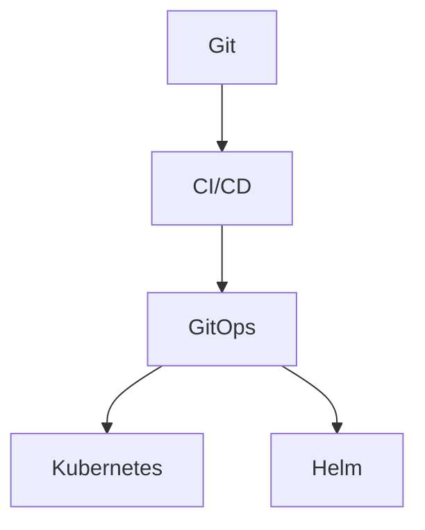
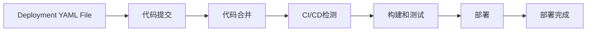

                 

# GitOps工作流：持续部署的最佳实践

## 1. 背景介绍

### 1.1 问题由来

在软件开发过程中，持续部署（Continuous Deployment，CD）已经成为不可或缺的重要一环。然而，随着软件规模的不断扩大和业务需求的频繁变化，传统的手工部署方式变得越来越不可持续。这种情况下，GitOps应运而生，通过将代码仓库（Git）与持续部署流水线（CI/CD）绑定，构建了“代码即基础设施”（Infra as Code）的概念，使持续部署的过程变得高效、透明和可追溯。

GitOps强调将部署决策记录在代码仓库中，通过自动化工具将代码转化为实际的部署操作，从而实现持续、稳定、可重复的交付过程。这一方法不仅能提高部署效率，还能降低错误率，确保系统稳定性，并符合微服务架构、云原生应用等现代技术的要求。

### 1.2 问题核心关键点

GitOps工作流的核心在于其将软件开发和运维流程自动化、标准化和版本化，使得整个软件生命周期中的每一个决策都有记录、有回溯、有版本管理。其关键点包括以下几点：

- **代码即基础设施**：将应用程序的配置和资源定义在代码仓库中，使持续部署流水线依据代码仓库的内容自动进行部署。
- **声明式配置**：通过代码仓库中的声明性配置文件（如Helm、Kubernetes等）描述目标环境的配置，而非直接编写命令式脚本。
- **自动化部署**：利用CI/CD工具自动检测、构建、测试和部署代码，确保软件更新始终符合预期。
- **可追溯性**：记录每一次的部署操作，以便于回溯和审计。
- **分支管理**：采用分支策略（如Git Flow、GitLab Flow等）进行版本管理，确保不同环境下的代码独立发布。

## 2. 核心概念与联系

### 2.1 核心概念概述

为了更好地理解GitOps工作流的概念和流程，本节将介绍几个关键概念及其相互联系：

- **Git**：版本控制系统，用于管理代码的增删改查操作，记录版本历史，支持团队协作开发。
- **CI/CD**：持续集成/持续交付/持续部署的缩写，通过自动化工具和流程实现软件开发生命周期的自动化。
- **GitOps**：结合Git和CI/CD的实践，强调代码与配置的统一管理和持续部署，提升软件交付效率和可靠性。
- **Kubernetes**：容器编排平台，提供自动化资源调度和管理，支持复杂应用程序的部署和扩展。
- **Helm**：包管理工具，用于管理Kubernetes中的应用程序配置和资源。

这些概念通过一个Mermaid流程图表示其相互联系：



这个流程图展示了几者之间的逻辑关系：Git用于代码管理，CI/CD用于自动化构建和部署，而GitOps则通过将这些流程与Git集成，形成了代码即基础设施的持续部署工作流。同时，Kubernetes和Helm作为现代CI/CD工具，提供了更为细粒度和灵活的资源管理和配置方式，是GitOps实践中的重要组成部分。

## 3. 核心算法原理 & 具体操作步骤

### 3.1 算法原理概述

GitOps工作流基于持续集成/持续部署（CI/CD）的基本原理，通过自动化工具和流程实现代码仓库与部署流程的集成。其核心算法原理包括以下几个方面：

- **配置管理**：通过代码仓库中的配置文件描述目标环境的配置，如Kubernetes中的Deployment、Service等资源。
- **版本控制**：使用Git进行代码和配置的统一管理，记录每次变更，确保每次部署都有可追溯的版本。
- **自动化构建和部署**：通过CI/CD工具（如Jenkins、GitLab CI、GitHub Actions等）自动化执行代码构建、测试和部署流程。
- **安全审计**：记录每一次的部署操作，确保所有操作都有日志可查，便于问题追踪和安全审计。

### 3.2 算法步骤详解

GitOps工作流的具体步骤包括以下几个关键环节：

1. **配置文件编写**：在代码仓库中编写配置文件，如Kubernetes的Deployment、Service、Helm Chart等，描述目标环境的配置和资源。
2. **CI/CD配置**：在CI/CD工具中配置代码仓库的Git路径，并定义自动化构建和部署的流程。
3. **构建和测试**：CI/CD工具自动从代码仓库拉取最新代码，执行构建和测试任务，确保代码质量。
4. **部署**：CI/CD工具根据配置文件自动部署到目标环境，如Kubernetes集群。
5. **回滚和审计**：记录每一次部署操作，保留审计日志，确保可追溯和问题回滚。

### 3.3 算法优缺点

GitOps工作流具有以下优点：

- **高效部署**：通过自动化流程，大大缩短了从代码提交到部署完成的时间。
- **一致性保证**：配置文件统一管理，确保每次部署都有可追溯的版本。
- **易于维护**：通过版本控制，便于跟踪和回溯变更。
- **透明性高**：所有部署操作都有日志记录，便于审计和问题追踪。

同时，也存在一些缺点：

- **学习成本高**：对于不熟悉CI/CD和Kubernetes等工具的开发者，可能需要较长时间的学习和实践。
- **复杂度增加**：特别是对于大规模、复杂的系统，配置文件和自动化流程的复杂度也会增加。
- **资源占用高**：持续部署需要较多的计算资源，特别是在大规模系统中。

### 3.4 算法应用领域

GitOps工作流在以下几个领域得到了广泛应用：

- **云原生应用**：通过GitOps实现Kubernetes等云原生平台的自动化部署和扩展。
- **微服务架构**：适用于微服务架构中的服务管理和部署，确保服务版本独立发布。
- **DevOps实践**：结合DevOps文化和持续交付，提升开发和运维的效率和质量。
- **容器化应用**：配合Docker、Kubernetes等容器技术，实现应用的可移植和可扩展。
- **跨团队协作**：统一管理配置和版本，促进不同团队间的协作开发和持续交付。

## 4. 数学模型和公式 & 详细讲解 & 举例说明

### 4.1 数学模型构建

为了更好地描述GitOps工作流的数学模型，我们以Kubernetes Deployment为例，构建其数学模型：

假设有一个Kubernetes Deployment，其配置文件名为`deployment.yaml`，其中定义了Pod的镜像、副本数量、环境变量等信息。其部署流程可以表示为如下状态转换图：



在状态转换图中，每个状态都可以通过公式来描述，例如：

- **代码提交**：表示代码从Git仓库中提交到合并请求的状态。其公式为：

  $$
  \text{Code Commits} = \sum_{i=1}^{N} \text{commits}_i
  $$

  其中，$N$为代码提交次数，$\text{commits}_i$为每次提交的代码数。

- **CI/CD检测**：表示CI/CD工具对代码构建和测试的检测状态。其公式为：

  $$
  \text{CI/CD Check} = \text{Build Success Rate} \times \text{Test Pass Rate}
  $$

  其中，$\text{Build Success Rate}$为构建成功的比例，$\text{Test Pass Rate}$为测试通过的比例。

- **构建和测试**：表示CI/CD工具对代码进行构建和测试的状态。其公式为：

  $$
  \text{Build and Test} = \text{Build Duration} + \text{Test Duration}
  $$

  其中，$\text{Build Duration}$为构建持续时间，$\text{Test Duration}$为测试持续时间。

- **部署**：表示代码部署到Kubernetes集群的状态。其公式为：

  $$
  \text{Deployment} = \text{Deploy Success Rate} \times \text{Deploy Duration}
  $$

  其中，$\text{Deploy Success Rate}$为部署成功的比例，$\text{Deploy Duration}$为部署持续时间。

- **部署完成**：表示代码部署到目标环境后的状态。其公式为：

  $$
  \text{Deployment Complete} = 1 - \text{Failure Rate}
  $$

  其中，$\text{Failure Rate}$为部署失败的率。

### 4.2 公式推导过程

通过上述状态转换图，我们可以进一步推导出GitOps工作流的数学模型。以Kubernetes Deployment为例，其部署流程的数学模型可以表示为：

$$
\text{Total Deployment Time} = \text{Code Commits} + \text{CI/CD Check} + \text{Build and Test} + \text{Deployment}
$$

其中，$\text{Code Commits}$、$\text{CI/CD Check}$、$\text{Build and Test}$、$\text{Deployment}$都可以通过上述公式计算得到。

### 4.3 案例分析与讲解

为了更好地理解GitOps工作流的数学模型，我们以一个简单的Web应用为例，进行具体分析。假设这个Web应用基于Docker容器，通过Kubernetes部署。

首先，在Git仓库中编写Docker镜像和Kubernetes Deployment配置文件：

```bash
# Dockerfile
FROM nginx:latest
COPY index.html /usr/share/nginx/html/index.html

# Kubernetes Deployment.yaml
apiVersion: apps/v1
kind: Deployment
metadata:
  name: webapp
spec:
  replicas: 3
  selector:
    matchLabels:
      app: webapp
  template:
    metadata:
      labels:
        app: webapp
    spec:
      containers:
      - name: webapp
        image: mywebapp:latest
        ports:
        - containerPort: 80
```

然后，将Docker镜像构建并推送到Docker Hub，同时在Git仓库中提交配置文件：

```bash
# 构建Docker镜像
docker build -t mywebapp .
docker push mywebapp

# 提交代码
git add .
git commit -m "Update webapp configuration"
git push origin master
```

接着，通过CI/CD工具（如GitLab CI）配置自动化流程：

```yaml
stages:
  - build
  - test
  - deploy

build:
  stage: build
  script:
    - docker build -t mywebapp .
    - docker push mywebapp

test:
  stage: test
  script:
    - docker run --rm mywebapp:latest curl http://127.0.0.1:80 | grep "Welcome to"

deploy:
  stage: deploy
  script:
    - kubectl apply -f deployment.yaml
```

最后，通过GitOps工作流实现持续部署：

1. **代码提交**：在Git仓库中提交新代码。
2. **CI/CD检测**：CI/CD工具检测代码提交，触发构建流程。
3. **构建和测试**：构建Docker镜像并推送到Docker Hub，测试Web应用是否正常运行。
4. **部署**：部署Web应用到Kubernetes集群中。
5. **部署完成**：记录部署成功状态。

通过这一过程，我们可以看到GitOps工作流如何将代码管理与持续部署自动化集成，实现高效、可追溯的持续部署。

## 5. 项目实践：代码实例和详细解释说明

### 5.1 开发环境搭建

在实践GitOps工作流前，我们需要准备好开发环境。以下是使用Kubernetes和Helm进行GitOps实践的环境配置流程：

1. 安装Kubernetes集群：搭建一个Kubernetes集群，可以使用Minikube、GKE、AWS EKS等。
2. 安装Helm：通过helm3 install command 安装Helm包管理工具。
3. 创建Git仓库：在GitHub或其他代码托管平台创建仓库，用于存储Docker镜像和Kubernetes配置文件。
4. 配置CI/CD工具：在Jenkins、GitLab CI、GitHub Actions等工具中配置代码仓库的Git路径和自动化构建和部署流程。

### 5.2 源代码详细实现

下面我们以Kubernetes Deployment为例，给出使用Helm和Jenkins进行GitOps实践的PyTorch代码实现。

首先，编写Kubernetes Deployment配置文件：

```yaml
apiVersion: apps/v1
kind: Deployment
metadata:
  name: mywebapp
spec:
  replicas: 3
  selector:
    matchLabels:
      app: mywebapp
  template:
    metadata:
      labels:
        app: mywebapp
    spec:
      containers:
      - name: mywebapp
        image: mywebapp:latest
        ports:
        - containerPort: 80
```

然后，在Jenkins中配置自动化流程：

1. **代码仓库配置**：在Jenkins中配置代码仓库的Git路径。
2. **构建步骤**：编写构建脚本，将代码仓库中的Kubernetes配置文件渲染为Helm Chart，并构建Docker镜像。
3. **测试步骤**：编写测试脚本，使用Docker镜像启动Web应用，检查其是否正常运行。
4. **部署步骤**：编写部署脚本，使用Helm Chart安装Kubernetes Deployment到集群中。

最后，通过GitOps工作流实现持续部署：

1. **代码提交**：在Git仓库中提交新代码。
2. **CI/CD检测**：Jenkins检测代码提交，触发构建和测试流程。
3. **构建和测试**：构建Docker镜像并测试Web应用。
4. **部署**：使用Helm Chart将Web应用部署到Kubernetes集群中。
5. **部署完成**：记录部署成功状态。

### 5.3 代码解读与分析

让我们再详细解读一下关键代码的实现细节：

**Helm配置文件**：
- 定义了Web应用的Kubernetes Deployment配置。

**Jenkins脚本**：
- 配置代码仓库的Git路径，定义构建、测试和部署流程。
- 通过`helm render`命令将配置文件渲染为Helm Chart。
- 通过`docker build`命令构建Docker镜像。
- 通过`docker run`命令启动Web应用，检查其是否正常运行。
- 通过`helm install`命令将Web应用部署到Kubernetes集群中。

**Git仓库**：
- 存储Docker镜像和Kubernetes配置文件。
- 使用`git add`和`git commit`命令提交新代码。

通过这一过程，我们可以看到GitOps工作流如何将代码管理与持续部署自动化集成，实现高效、可追溯的持续部署。

## 6. 实际应用场景

### 6.1 智能客服系统

基于GitOps工作流的智能客服系统，可以实现高效的持续部署和自动化管理。通过将智能客服系统的配置文件统一管理在Git仓库中，结合CI/CD工具和Kubernetes，可以实现智能客服系统的快速构建、测试和部署。

在实际应用中，智能客服系统需要频繁更新和迭代，以适应新的业务需求和客户体验。通过GitOps工作流，开发者可以快速响应变化，将新代码提交到Git仓库，并自动触发CI/CD流程，构建和测试新的智能客服系统。同时，通过Kubernetes实现自动部署和扩展，确保系统的高可用性和稳定性。

### 6.2 金融舆情监测系统

金融舆情监测系统需要实时监测大量的金融新闻和市场评论，并及时响应舆情变化。通过GitOps工作流，可以实现金融舆情监测系统的持续部署和自动化管理。

具体而言，金融舆情监测系统的配置文件和代码统一管理在Git仓库中，结合CI/CD工具和Kubernetes，可以实现实时抓取和处理金融新闻，自动部署和更新舆情监测模型，确保系统的实时性和准确性。同时，通过GitOps工作流，记录每一次的部署操作，便于问题追踪和安全审计。

### 6.3 个性化推荐系统

个性化推荐系统需要根据用户行为数据和兴趣偏好，实时推荐个性化的内容。通过GitOps工作流，可以实现个性化推荐系统的持续部署和自动化管理。

具体而言，个性化推荐系统的配置文件和代码统一管理在Git仓库中，结合CI/CD工具和Kubernetes，可以实现实时处理用户行为数据，自动部署和更新推荐模型，确保推荐结果的个性化和时效性。同时，通过GitOps工作流，记录每一次的部署操作，便于问题追踪和安全审计。

### 6.4 未来应用展望

随着GitOps工作流的不断发展和完善，其在更多领域的应用前景将更加广阔。

- **智慧医疗**：通过GitOps实现医疗系统的持续部署和自动化管理，提升医疗服务的智能化水平。
- **智能教育**：通过GitOps实现教育系统的持续部署和自动化管理，提升教育服务的智能化水平。
- **智慧城市**：通过GitOps实现城市管理系统的持续部署和自动化管理，提升城市治理的智能化水平。
- **智能制造**：通过GitOps实现工业系统的持续部署和自动化管理，提升生产效率和质量。

此外，在更多垂直行业的应用中，GitOps工作流将发挥越来越重要的作用，推动各行各业数字化转型和智能化升级。

## 7. 工具和资源推荐

### 7.1 学习资源推荐

为了帮助开发者系统掌握GitOps工作流的理论基础和实践技巧，这里推荐一些优质的学习资源：

1. **《GitOps: Continuous Delivery with Helm, Kubernetes, and Git》**：这本书详细介绍了GitOps的概念、实践和应用，是GitOps领域的重要参考资料。
2. **《Kubernetes in Action》**：这本书是Kubernetes领域的经典之作，介绍了Kubernetes的基本概念和最佳实践。
3. **《Helm: A Kubernetes Package Manager》**：这本书介绍了Helm的用法和最佳实践，帮助开发者更好地管理Kubernetes资源。
4. **GitLab GitOps用户指南**：GitLab提供的GitOps用户指南，详细介绍了GitLab CI/CD和GitOps的最佳实践。
5. **Kubernetes官方文档**：Kubernetes官方文档是学习Kubernetes的最好资源，提供了丰富的示例和API参考。

通过对这些资源的学习实践，相信你一定能够快速掌握GitOps工作流的精髓，并用于解决实际的持续部署问题。

### 7.2 开发工具推荐

高效的开发离不开优秀的工具支持。以下是几款用于GitOps工作流开发的常用工具：

1. **Git**：版本控制系统，用于管理代码的增删改查操作，记录版本历史，支持团队协作开发。
2. **CI/CD工具**：如Jenkins、GitLab CI、GitHub Actions等，用于自动化构建、测试和部署流程。
3. **Kubernetes**：容器编排平台，提供自动化资源调度和管理，支持复杂应用程序的部署和扩展。
4. **Helm**：包管理工具，用于管理Kubernetes中的应用程序配置和资源。
5. **GitHub/GitLab**：代码托管平台，提供代码仓库管理和版本控制功能。

合理利用这些工具，可以显著提升GitOps工作流的开发效率，加快创新迭代的步伐。

### 7.3 相关论文推荐

GitOps工作流的不断发展离不开学界的持续研究。以下是几篇奠基性的相关论文，推荐阅读：

1. **《Infrastructure as Code: A Survey》**：这篇文章综述了Infra as Code的现状和发展方向，介绍了GitOps等前沿技术。
2. **《Kubernetes: A SIGMA Cloud Platform for Engineering Processes》**：这篇文章介绍了Kubernetes在工程过程中的应用，强调了Kubernetes和GitOps的结合。
3. **《Deploying Helm: A Survey of Kubernetes Package Management Tools》**：这篇文章介绍了Helm的用法和最佳实践，帮助开发者更好地管理Kubernetes资源。
4. **《GitLab CI/CD User Guide》**：GitLab提供的CI/CD用户指南，详细介绍了GitLab CI/CD和GitOps的最佳实践。
5. **《Continuous Delivery in the Age of Microservices: A Survey》**：这篇文章综述了微服务架构下的持续交付技术，介绍了GitOps在微服务中的应用。

这些论文代表了大语言模型微调技术的发展脉络。通过学习这些前沿成果，可以帮助研究者把握学科前进方向，激发更多的创新灵感。

## 8. 总结：未来发展趋势与挑战

### 8.1 总结

本文对GitOps工作流的背景、核心概念、算法原理、操作步骤和实际应用进行了全面系统的介绍。首先阐述了GitOps工作流的背景和重要性，明确了GitOps在持续部署中的独特价值。其次，从原理到实践，详细讲解了GitOps的数学模型和关键步骤，给出了GitOps工作流的完整代码实例。同时，本文还广泛探讨了GitOps工作流在多个行业领域的应用前景，展示了GitOps工作流的巨大潜力。此外，本文精选了GitOps工作流的学习资源，力求为读者提供全方位的技术指引。

通过本文的系统梳理，可以看到，GitOps工作流已经成为了持续部署的重要范式，极大地提升了软件交付的效率和质量。未来，伴随GitOps工作流的不断发展，将进一步推动软件开发生命周期的自动化和标准化，为数字化转型和技术创新提供重要支持。

### 8.2 未来发展趋势

展望未来，GitOps工作流将呈现以下几个发展趋势：

1. **自动化程度提高**：随着自动化工具的不断进步，GitOps工作流的自动化程度将进一步提高，减少人工干预和手动操作。
2. **多云管理支持**：GitOps工作流将支持多云环境下的资源管理，实现跨云环境的自动化部署和扩展。
3. **环境一致性增强**：通过更严格的版本控制和环境一致性检查，确保不同环境下的代码和配置一致。
4. **用户体验优化**：通过更友好的用户界面和操作流程，提升开发者和运维人员的体验。
5. **安全性和合规性加强**：通过更严格的权限控制和日志审计，增强GitOps工作流的安全性和合规性。
6. **混合部署支持**：支持多种部署方式，如Kubernetes、AWS ECS、Google Cloud Run等，满足不同场景的需求。

以上趋势凸显了GitOps工作流技术的广阔前景。这些方向的探索发展，必将进一步提升持续部署的效率和质量，为数字化转型和技术创新提供重要支持。

### 8.3 面临的挑战

尽管GitOps工作流已经取得了瞩目成就，但在迈向更加智能化、普适化应用的过程中，它仍面临着诸多挑战：

1. **学习曲线陡峭**：对于不熟悉Git、Kubernetes等工具的开发者，可能需要较长时间的学习和实践。
2. **配置复杂度高**：特别是对于大规模、复杂的系统，配置文件和自动化流程的复杂度也会增加。
3. **资源占用高**：持续部署需要较多的计算资源，特别是在大规模系统中。
4. **版本控制困难**：特别是在多分支、多环境的情况下，版本控制和合并管理变得复杂。
5. **跨团队协作难度大**：不同团队之间的协作和沟通成本较高，特别是在使用不同的Git仓库和CI/CD工具时。

正视GitOps工作流面临的这些挑战，积极应对并寻求突破，将使GitOps工作流走向更加成熟和实用。相信随着学界和产业界的共同努力，这些挑战终将一一被克服，GitOps工作流必将在构建高效、稳定、可追溯的持续部署系统方面发挥更加重要的作用。

### 8.4 研究展望

面对GitOps工作流所面临的挑战，未来的研究需要在以下几个方面寻求新的突破：

1. **简化配置管理**：开发更加直观、易用的配置管理工具，减少配置文件和自动化流程的复杂度。
2. **优化资源使用**：通过更高效的资源管理和调度算法，减少资源占用，提升持续部署的效率。
3. **加强版本控制**：开发更加强大的版本控制和合并管理工具，支持多分支、多环境下的版本控制。
4. **提升跨团队协作**：通过更好的工具和流程设计，降低不同团队之间的协作和沟通成本。
5. **增强安全性和合规性**：通过更严格的权限控制和日志审计，增强GitOps工作流的安全性和合规性。
6. **支持多种部署方式**：支持多种部署方式，如Kubernetes、AWS ECS、Google Cloud Run等，满足不同场景的需求。

这些研究方向的探索，必将引领GitOps工作流技术迈向更高的台阶，为构建高效、稳定、可追溯的持续部署系统提供重要支持。面向未来，GitOps工作流需要与其他持续交付技术进行更深入的融合，如DevOps、容器技术等，多路径协同发力，共同推动数字化转型和智能化升级。只有勇于创新、敢于突破，才能不断拓展GitOps工作流的边界，让持续部署技术更好地服务于数字化转型和智能化升级的趋势。

## 9. 附录：常见问题与解答

**Q1：什么是GitOps？**

A: GitOps是一种软件开发实践，强调将持续部署的决策记录在代码仓库中，通过自动化工具和流程实现代码仓库与部署流程的集成，提升持续部署的效率和质量。

**Q2：如何配置GitOps工作流？**

A: 配置GitOps工作流需要选择合适的Git仓库、CI/CD工具和Kubernetes集群，并编写配置文件。具体步骤如下：
1. 搭建Kubernetes集群，创建Git仓库。
2. 安装CI/CD工具（如Jenkins、GitLab CI、GitHub Actions等）。
3. 编写Kubernetes配置文件和代码。
4. 配置CI/CD工具，自动触发构建、测试和部署流程。
5. 在Kubernetes集群中自动部署和扩展应用程序。

**Q3：如何优化GitOps工作流的性能？**

A: 优化GitOps工作流的性能可以从以下几个方面入手：
1. 使用更高效的构建工具和算法，如Docker、Kubernetes等。
2. 优化部署流程，减少不必要的操作和资源消耗。
3. 采用混合精度训练和梯度累积等技术，减少资源占用。
4. 使用容器编排工具，实现更灵活的资源管理和调度。

**Q4：如何确保GitOps工作流的安全性和合规性？**

A: 确保GitOps工作流的安全性和合规性需要采取以下措施：
1. 采用严格的权限控制和访问审计，确保只有授权人员可以访问和修改代码仓库。
2. 记录每一次的部署操作，保留审计日志，便于问题追踪和安全审计。
3. 定期进行安全扫描和漏洞检测，及时发现和修复安全漏洞。
4. 遵循相关的合规标准和法规，如GDPR、ISO 27001等，确保系统符合合规要求。

**Q5：GitOps与DevOps有什么区别？**

A: GitOps和DevOps都是软件开发和运维的最佳实践，但侧重点略有不同。GitOps强调通过代码仓库记录和自动化管理持续部署的决策，实现高效的、可追溯的持续部署。而DevOps则注重整个软件开发生命周期的自动化和协作，包括持续集成、持续交付、持续部署等各个环节。

**Q6：GitOps适用于哪些场景？**

A: GitOps适用于任何需要持续部署的软件系统，特别是大规模、复杂的系统。常见的应用场景包括云原生应用、微服务架构、DevOps实践、容器化应用、跨团队协作等。

通过本文的系统梳理，可以看到，GitOps工作流已经成为持续部署的重要范式，极大地提升了软件交付的效率和质量。未来，伴随GitOps工作流的不断发展，将进一步推动软件开发生命周期的自动化和标准化，为数字化转型和技术创新提供重要支持。面向未来，GitOps工作流需要与其他持续交付技术进行更深入的融合，如DevOps、容器技术等，多路径协同发力，共同推动数字化转型和智能化升级。只有勇于创新、敢于突破，才能不断拓展GitOps工作流的边界，让持续部署技术更好地服务于数字化转型和智能化升级的趋势。

