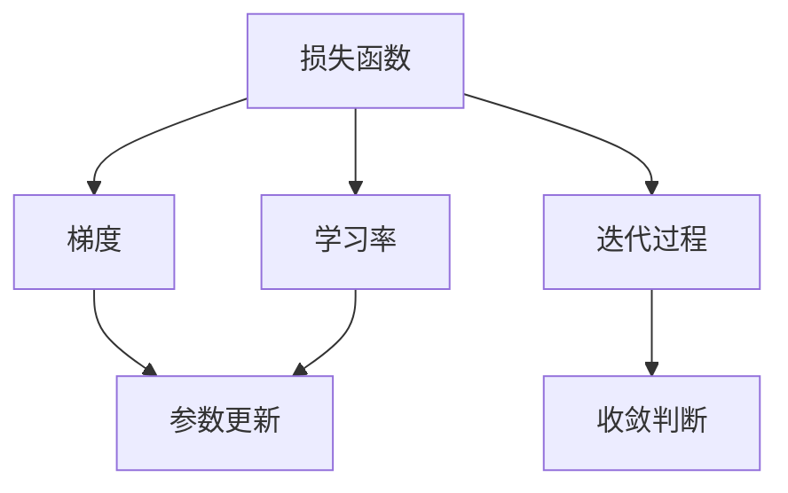

                 

# Gradient Descent原理与代码实例讲解

> 关键词：梯度下降, 机器学习, 优化算法, 训练过程, 参数更新

## 1. 背景介绍

### 1.1 问题由来
在机器学习领域，梯度下降(Gradient Descent)是一种广泛应用的优化算法，用于最小化损失函数，寻找最优模型参数。它在监督学习、无监督学习和强化学习中都有重要应用。理解和掌握梯度下降的原理与代码实现，对于从事机器学习、深度学习和数据分析的从业者来说，是非常重要的基础技能。

### 1.2 问题核心关键点
梯度下降的核心在于通过连续迭代，逐步调整模型参数，使其向损失函数的极小值靠近。在每一次迭代中，算法计算损失函数关于参数的梯度，并据此更新参数，以减小损失函数值。具体而言，包括以下几个关键步骤：

1. 随机初始化模型参数。
2. 计算损失函数对每个参数的梯度。
3. 根据梯度方向和大小更新参数。
4. 重复以上过程直至损失函数收敛或达到预设迭代次数。

## 2. 核心概念与联系

### 2.1 核心概念概述

为更好地理解梯度下降的原理，本节将介绍几个密切相关的核心概念：

- 损失函数(Loss Function)：衡量模型输出与真实标签之间的差异。在监督学习中，通常使用交叉熵损失、均方误差损失等。
- 梯度(Gradient)：损失函数关于模型参数的导数，反映了参数变化对损失函数的影响。
- 学习率(Learning Rate)：控制参数更新大小的超参数，通常设置为一个较小的正数。
- 收敛性(Convergence)：梯度下降算法最终能否收敛到损失函数的极小值点，取决于学习率、损失函数性质等因素。

这些概念之间的逻辑关系可以通过以下Mermaid流程图来展示：



这个流程图展示了损失函数、梯度、学习率、参数更新和迭代过程之间的关系，以及迭代过程中如何通过梯度计算参数更新，并判断是否收敛。

## 3. 核心算法原理 & 具体操作步骤
### 3.1 算法原理概述

梯度下降算法的基本思想是，通过迭代调整模型参数，使得损失函数逐步减小，直到达到极小值。在每次迭代中，梯度下降算法首先计算损失函数关于模型参数的梯度，然后根据梯度方向和大小调整参数，更新模型。具体公式如下：

$$
\theta = \theta - \eta \nabla_{\theta}\mathcal{L}(\theta)
$$

其中，$\theta$为模型参数，$\eta$为学习率，$\nabla_{\theta}\mathcal{L}(\theta)$为损失函数对参数的梯度。

梯度下降算法分为批量梯度下降(Batch Gradient Descent, BGD)、随机梯度下降(Stochastic Gradient Descent, SGD)和小批量梯度下降(Mini-batch Gradient Descent)三种形式。它们的主要区别在于每次迭代中使用的样本数量不同，具体如下：

- 批量梯度下降：每次使用全部训练样本计算梯度。
- 随机梯度下降：每次仅使用一个训练样本计算梯度。
- 小批量梯度下降：每次使用一小批(通常几十到几百个)训练样本计算梯度。

### 3.2 算法步骤详解

梯度下降的详细操作步骤如下：

**Step 1: 初始化模型参数**
- 随机初始化模型参数 $\theta_0$，通常采用正态分布随机数。

**Step 2: 计算梯度**
- 对训练集中的每个样本 $x_i$，计算损失函数 $\mathcal{L}(\theta)$ 对参数的梯度 $\nabla_{\theta}\mathcal{L}(\theta)$。

**Step 3: 更新参数**
- 根据梯度方向和大小，调整参数 $\theta$。

**Step 4: 迭代更新**
- 重复以上步骤，直到损失函数收敛或达到预设迭代次数。

### 3.3 算法优缺点

梯度下降算法的优点包括：

1. 简单易实现：算法逻辑清晰，易于理解和实现。
2. 广泛适用：适用于各种模型和优化问题。
3. 收敛性质：在一定条件下，梯度下降算法能够收敛到损失函数的极小值点。

其缺点包括：

1. 容易陷入局部最优：梯度下降算法可能陷入局部极小值，而非全局最优。
2. 收敛速度慢：在复杂的高维空间中，梯度下降可能需要较长时间才能收敛。
3. 学习率难以选择：学习率的选择对算法性能影响较大，但难以设定最优值。
4. 敏感性：对噪声和初始值较为敏感。

### 3.4 算法应用领域

梯度下降算法广泛应用于机器学习和深度学习中，包括但不限于以下几个领域：

- 线性回归和逻辑回归：通过最小化均方误差损失或交叉熵损失，优化线性模型和逻辑回归模型的参数。
- 神经网络：在反向传播算法中，梯度下降被用来更新神经网络中的权重和偏置。
- 深度学习优化器：如Adam、Adagrad、RMSprop等，均基于梯度下降算法设计。
- 强化学习：在Q-learning、SARSA等算法中，梯度下降用于更新Q值或状态值函数。

## 4. 数学模型和公式 & 详细讲解  
### 4.1 数学模型构建

考虑一个简单的线性回归问题，其中训练集为 $(x_i,y_i)$，$x_i \in \mathbb{R}^n$ 为特征向量，$y_i \in \mathbb{R}$ 为真实标签。假设模型的输出为 $\hat{y} = \theta_0 + \theta_1x_1 + \cdots + \theta_nx_n$，损失函数为均方误差损失 $L(\theta) = \frac{1}{N}\sum_{i=1}^N (y_i - \hat{y}_i)^2$。

### 4.2 公式推导过程

对于均方误差损失函数 $L(\theta)$，其对参数 $\theta_j$ 的偏导数为：

$$
\frac{\partial L(\theta)}{\partial \theta_j} = -2\frac{1}{N}\sum_{i=1}^N (y_i - \hat{y}_i)x_{ij}
$$

因此，梯度下降算法的参数更新公式为：

$$
\theta_j = \theta_j - \eta \frac{1}{N}\sum_{i=1}^N (y_i - \hat{y}_i)x_{ij}
$$

其中，$\eta$ 为学习率，通常设置在0到1之间。

### 4.3 案例分析与讲解

考虑一个简单的二分类问题，其中训练集为 $(x_i,y_i)$，$x_i \in \mathbb{R}^n$ 为特征向量，$y_i \in \{0,1\}$ 为真实标签。假设模型的输出为 $\hat{y} = \sigma(\theta_0 + \theta_1x_1 + \cdots + \theta_nx_n)$，其中 $\sigma$ 为sigmoid函数，损失函数为交叉熵损失 $L(\theta) = -\frac{1}{N}\sum_{i=1}^N y_i\log \hat{y}_i + (1-y_i)\log (1-\hat{y}_i)$。

对交叉熵损失函数 $L(\theta)$ 求参数 $\theta_j$ 的偏导数为：

$$
\frac{\partial L(\theta)}{\partial \theta_j} = -\frac{1}{N}\sum_{i=1}^N \bigg(\frac{y_i}{\hat{y}_i} - \frac{1-y_i}{1-\hat{y}_i}\bigg)x_{ij}
$$

因此，梯度下降算法的参数更新公式为：

$$
\theta_j = \theta_j - \eta \frac{1}{N}\sum_{i=1}^N \bigg(\frac{y_i}{\hat{y}_i} - \frac{1-y_i}{1-\hat{y}_i}\bigg)x_{ij}
$$

在实际应用中，我们通常使用随机梯度下降(SGD)或小批量梯度下降(Mini-batch GD)，以加速训练过程。

## 5. 项目实践：代码实例和详细解释说明
### 5.1 开发环境搭建

在进行梯度下降实践前，我们需要准备好开发环境。以下是使用Python进行SciPy开发的环境配置流程：

1. 安装Anaconda：从官网下载并安装Anaconda，用于创建独立的Python环境。

2. 创建并激活虚拟环境：
```bash
conda create -n scipy-env python=3.8 
conda activate scipy-env
```

3. 安装SciPy：
```bash
conda install scipy
```

4. 安装NumPy、matplotlib等工具包：
```bash
pip install numpy matplotlib
```

完成上述步骤后，即可在`scipy-env`环境中开始梯度下降实践。

### 5.2 源代码详细实现

这里我们以线性回归为例，给出使用SciPy进行梯度下降的Python代码实现。

```python
import numpy as np
from scipy.optimize import minimize

# 线性回归模型
def linear_regression(X, y, theta):
    return np.dot(X, theta)

# 计算损失函数
def loss_function(X, y, theta):
    return (1 / (2 * len(y)) * np.sum(np.square(linear_regression(X, y, theta) - y)))

# 计算梯度
def gradient(X, y, theta):
    return (1 / len(y)) * np.dot(X.T, (linear_regression(X, y, theta) - y))

# 梯度下降函数
def gradient_descent(X, y, theta_0, learning_rate, num_iters):
    for i in range(num_iters):
        theta = np.copy(theta_)
        grad = gradient(X, y, theta)
        theta_ = theta - learning_rate * grad
    return theta_

# 数据生成
np.random.seed(42)
X = 2 * np.random.rand(100, 1) + 1
y = 4 + 3 * X + np.random.randn(100, 1)
theta_0 = 0

# 运行梯度下降
theta = gradient_descent(X, y, theta_0, 0.01, 1000)
print('theta:', theta)
```

在代码中，我们使用SciPy的`minimize`函数进行最小化损失函数，实现梯度下降。首先定义线性回归模型和损失函数，然后计算梯度，最后使用梯度下降函数进行迭代更新。

### 5.3 代码解读与分析

让我们再详细解读一下关键代码的实现细节：

**linear_regression函数**：
- 实现线性回归模型，输入特征向量 $X$、标签向量 $y$ 和模型参数 $\theta$，输出预测结果。

**loss_function函数**：
- 实现均方误差损失函数，输入特征向量 $X$、标签向量 $y$ 和模型参数 $\theta$，输出损失值。

**gradient函数**：
- 实现梯度计算函数，输入特征向量 $X$、标签向量 $y$ 和模型参数 $\theta$，输出损失函数对参数的梯度。

**gradient_descent函数**：
- 实现梯度下降函数，输入特征向量 $X$、标签向量 $y$、初始化参数 $\theta_0$、学习率 $\eta$ 和迭代次数 $num\_iters$，返回最终模型参数 $\theta$。

**数据生成**：
- 生成随机特征向量 $X$ 和标签向量 $y$，并设置初始化参数 $\theta_0$。

**运行梯度下降**：
- 调用梯度下降函数进行迭代更新，输出最终模型参数 $\theta$。

可以看到，SciPy的`minimize`函数提供了方便的一站式解决方案，简化了梯度下降的实现过程。此外，SciPy还支持多种优化算法，如牛顿法、共轭梯度法等，可以根据具体问题进行选择。

当然，工业级的系统实现还需考虑更多因素，如超参数自动搜索、模型并行优化等，但核心的梯度下降算法基本与此类似。

## 6. 实际应用场景
### 6.1 线性回归

梯度下降在线性回归中有着广泛应用，可以用于预测连续型变量。例如，在房价预测问题中，可以使用梯度下降模型拟合房价与房间数量、面积等特征之间的关系，从而预测未观测到的房价。

### 6.2 神经网络

梯度下降在神经网络中也有重要应用。在反向传播算法中，梯度下降用于更新神经网络中的权重和偏置。通过梯度下降，神经网络能够逐步调整参数，减小损失函数值，最终得到最优解。

### 6.3 强化学习

在强化学习中，梯度下降用于更新Q值或状态值函数。通过梯度下降，智能体可以逐步优化决策策略，最大化累积奖励。例如，在Q-learning算法中，梯度下降用于更新Q值，从而指导智能体在状态空间中采取最优行动。

### 6.4 未来应用展望

随着梯度下降算法的不断发展，未来在机器学习和深度学习领域，它将继续发挥重要作用。新的优化算法和技术将不断涌现，如自适应学习率算法、局部随机梯度下降等，进一步提升梯度下降的性能和效率。

在实际应用中，梯度下降还可以与先验知识、专家系统等其他技术结合，形成更加强大、灵活的优化方案。例如，在强化学习中，可以将梯度下降与启发式算法、元学习等技术结合，提高智能体的学习能力和适应性。

## 7. 工具和资源推荐
### 7.1 学习资源推荐

为了帮助开发者系统掌握梯度下降的理论与实践，这里推荐一些优质的学习资源：

1. 《机器学习》（周志华著）：详细介绍了梯度下降算法的基本原理和变种形式，适合初学者系统学习。

2. 《深度学习》（Ian Goodfellow等著）：介绍了各种深度学习优化算法，包括梯度下降、自适应学习率算法等，适合深入学习。

3. Coursera的《机器学习》课程：由斯坦福大学Andrew Ng教授开设，介绍了梯度下降算法及其变种形式，适合在线学习。

4. Google的TensorFlow官方文档：详细介绍了TensorFlow中的优化器，包括梯度下降、自适应学习率算法等，适合深入理解。

5. PyTorch官方文档：详细介绍了PyTorch中的优化器，包括梯度下降、自适应学习率算法等，适合理解实际应用。

通过对这些资源的学习实践，相信你一定能够快速掌握梯度下降算法的精髓，并用于解决实际的优化问题。

### 7.2 开发工具推荐

高效的开发离不开优秀的工具支持。以下是几款用于梯度下降优化的常用工具：

1. SciPy：Python的科学计算库，提供了优化算法、线性代数等基础工具，适合优化问题求解。

2. TensorFlow：由Google主导开发的深度学习框架，提供了丰富的优化器，适合大规模模型训练。

3. PyTorch：由Facebook开发的深度学习框架，提供了灵活的动态计算图，适合研究型应用。

4. MXNet：由Amazon开发的深度学习框架，支持多种优化算法，适合分布式训练。

5. Keras：基于TensorFlow、Theano等后端的高级API，提供了简单易用的优化器接口，适合快速原型开发。

6. Scikit-learn：Python的机器学习库，提供了多种优化算法，适合小规模问题求解。

合理利用这些工具，可以显著提升梯度下降的开发效率，加快创新迭代的步伐。

### 7.3 相关论文推荐

梯度下降算法的理论和实践已经积累了丰富的研究成果。以下是几篇奠基性的相关论文，推荐阅读：

1. Gradient Descent, an Optimization Algorithm: Theoretical Foundations and Convergence Analysis：详细分析了梯度下降算法的收敛性和收敛速度。

2. A Tutorial on Gradient Descent Optimizers：介绍了多种梯度下降优化算法，包括SGD、Adam、Adagrad等。

3. On the Convergence Properties of Adaptive Gradient Methods in Deep Learning：讨论了自适应学习率算法的收敛性，适合深入学习。

4. Scaled Adaptive Learning Rate for Deep Learning：提出了Loshap词采学习率算法，进一步提升了梯度下降的性能。

5. RMSprop: A Simple Extension to Adam that Diminishes the Impact of the Relative Learning Rate on the Acceleration of SGD: An Empirical Study：提出了RMSprop算法，改进了梯度下降的收敛性。

这些论文代表了大规模优化算法的最新研究进展，通过学习这些前沿成果，可以帮助研究者把握学科前进方向，激发更多的创新灵感。

## 8. 总结：未来发展趋势与挑战

### 8.1 总结

本文对梯度下降算法的原理与代码实现进行了详细讲解。首先阐述了梯度下降算法的背景和核心概念，明确了其在大规模优化问题中的重要地位。其次，从理论到实践，详细讲解了梯度下降算法的数学原理和关键步骤，给出了梯度下降任务开发的完整代码实例。同时，本文还广泛探讨了梯度下降算法在实际应用中的各种场景，展示了其广泛的适用性和巨大的潜力。此外，本文精选了梯度下降算法的各类学习资源，力求为读者提供全方位的技术指引。

通过本文的系统梳理，可以看到，梯度下降算法在机器学习和深度学习领域已经取得了广泛的应用，成为优化问题的核心工具。受益于科学计算工具的进步和优化理论的发展，梯度下降算法在未来仍将发挥重要作用。未来，随着算法优化和硬件加速的进一步突破，梯度下降算法将能够支持更复杂的优化问题，带来更加高效、灵活的优化方案。

### 8.2 未来发展趋势

展望未来，梯度下降算法将呈现以下几个发展趋势：

1. 自适应学习率算法：通过动态调整学习率，提高梯度下降的收敛速度和稳定性。未来将涌现更多自适应学习率算法，如Adam、Adagrad等。

2. 局部随机梯度下降：通过减少每次迭代使用的样本数量，提高梯度下降的计算效率和灵活性。局部随机梯度下降算法将得到广泛应用。

3. 分布式优化：在分布式计算环境中，梯度下降算法需要考虑模型并行、参数同步等问题。未来将涌现更多分布式优化算法，如Hogwild、Spark等。

4. 预训练与微调：在大规模预训练和微调过程中，梯度下降算法需要考虑优化器的选择和参数更新策略。未来将涌现更多预训练与微调算法，如BERT微调、LoRA等。

5. 自监督学习：在自监督学习中，梯度下降算法需要考虑如何最大化模型对未标注数据的利用效率。未来将涌现更多自监督学习算法，如SimCLR、 contrastive learning等。

这些趋势凸显了梯度下降算法的广阔前景。这些方向的探索发展，必将进一步提升机器学习模型的性能和效率，为应用场景提供更强大、灵活的优化工具。

### 8.3 面临的挑战

尽管梯度下降算法已经取得了显著进展，但在迈向更加智能化、普适化应用的过程中，它仍面临着诸多挑战：

1. 收敛速度：在复杂高维空间中，梯度下降算法收敛速度较慢，需要进一步优化算法和硬件性能。

2. 学习率选择：学习率的选择对梯度下降的性能影响较大，但难以设定最优值。未来需要开发更多自适应学习率算法，以提高学习率选择精度。

3. 内存占用：在处理大规模数据时，梯度下降算法需要大量的内存空间，需要进一步优化内存使用。

4. 模型复杂性：在高维空间中，梯度下降算法需要处理更多参数，需要进一步优化模型结构和算法复杂性。

5. 鲁棒性：在存在噪声和异常数据的情况下，梯度下降算法容易产生偏差，需要进一步提高算法的鲁棒性。

6. 可解释性：梯度下降算法的内部工作机制和决策逻辑难以解释，需要进一步提高算法的可解释性。

7. 分布式优化：在分布式计算环境中，梯度下降算法需要考虑模型并行和参数同步等问题，需要进一步优化分布式优化算法。

这些挑战凸显了梯度下降算法在大规模优化问题中的局限性，未来需要从算法、硬件、模型等多个维度协同发力，以应对日益复杂的优化问题。

### 8.4 研究展望

面对梯度下降算法所面临的挑战，未来的研究需要在以下几个方面寻求新的突破：

1. 探索更高效的优化算法：开发更加高效的优化算法，如自适应学习率算法、局部随机梯度下降等，以提高梯度下降的收敛速度和稳定性。

2. 优化硬件性能：通过硬件加速和分布式计算，提升梯度下降算法的计算效率和内存使用效率，支持更大规模模型的训练。

3. 提高模型复杂性：开发更加灵活和高效的结构化模型，减少梯度下降的计算复杂性，支持更复杂的高维优化问题。

4. 提高鲁棒性：通过鲁棒优化技术，提高梯度下降算法对噪声和异常数据的鲁棒性，避免梯度下降的偏差。

5. 增强可解释性：通过可解释优化技术，提高梯度下降算法的可解释性，使决策过程更加透明和可信。

6. 优化分布式优化：开发更高效的分布式优化算法，支持大规模模型的分布式训练和优化。

这些研究方向将进一步推动梯度下降算法的发展，使其能够更好地应对复杂高维优化问题，为机器学习模型的应用带来新的突破。总之，梯度下降算法需要从算法、硬件、模型等多个维度进行深入研究，方能在未来的机器学习中发挥更大的作用。

## 9. 附录：常见问题与解答

**Q1: 梯度下降算法的基本思想是什么？**

A: 梯度下降算法的基本思想是通过迭代调整模型参数，使得损失函数逐步减小，直到达到极小值。在每次迭代中，梯度下降算法首先计算损失函数关于模型参数的梯度，然后根据梯度方向和大小调整参数，更新模型。

**Q2: 梯度下降算法有哪些变种？**

A: 梯度下降算法有多种变种，如批量梯度下降(Batch Gradient Descent, BGD)、随机梯度下降(Stochastic Gradient Descent, SGD)和小批量梯度下降(Mini-batch Gradient Descent)。它们的主要区别在于每次迭代中使用的样本数量不同，具体包括：

- 批量梯度下降：每次使用全部训练样本计算梯度。
- 随机梯度下降：每次仅使用一个训练样本计算梯度。
- 小批量梯度下降：每次使用一小批(通常几十到几百个)训练样本计算梯度。

**Q3: 学习率的选择对梯度下降有什么影响？**

A: 学习率的选择对梯度下降的性能影响较大。如果学习率设置过大，容易发生梯度爆炸；如果学习率设置过小，收敛速度较慢。通常建议从1e-5开始调参，逐步减小学习率，直至收敛。

**Q4: 梯度下降算法是否适用于所有优化问题？**

A: 梯度下降算法适用于大多数优化问题，特别是对于损失函数凸的情况。但对于非凸函数，梯度下降算法可能收敛到局部极小值，而非全局最优。此外，梯度下降算法对数据的分布也较为敏感，对于非独立同分布的数据，需要进一步改进。

**Q5: 如何缓解梯度下降的过拟合问题？**

A: 过拟合是梯度下降算法面临的主要问题之一。常见的缓解策略包括：

- 数据增强：通过回译、近义替换等方式扩充训练集。
- 正则化：使用L2正则、Dropout等方法，防止模型过度拟合。
- 早停法：在验证集上监测模型性能，一旦性能下降，立即停止训练。
- 自适应学习率：如Adam、Adagrad等算法，动态调整学习率，避免过拟合。

这些策略往往需要根据具体问题进行选择，合理组合以优化梯度下降的性能。

**Q6: 梯度下降算法如何应用于神经网络？**

A: 在神经网络中，梯度下降被用于反向传播算法，用于更新权重和偏置。具体步骤包括：

- 计算损失函数关于权重和偏置的梯度。
- 根据梯度方向和大小，调整权重和偏置，更新模型。
- 重复以上步骤，直至损失函数收敛或达到预设迭代次数。

通过梯度下降算法，神经网络可以逐步调整参数，减小损失函数值，最终得到最优解。

**Q7: 如何优化梯度下降算法的收敛速度？**

A: 为了提高梯度下降算法的收敛速度，可以采用以下策略：

- 自适应学习率：如Adam、Adagrad等算法，动态调整学习率，提高收敛速度。
- 批量梯度下降：使用更多的样本，减少噪声的影响，加快收敛。
- 局部随机梯度下降：减少每次迭代使用的样本数量，提高计算效率。
- 分布式优化：使用多台机器并行计算，加快训练速度。

这些策略可以根据具体问题进行选择，合理组合以优化梯度下降的性能。

**Q8: 梯度下降算法在实际应用中需要注意哪些问题？**

A: 在实际应用中，梯度下降算法需要注意以下问题：

- 学习率选择：学习率的选择对梯度下降的性能影响较大，但难以设定最优值。
- 模型复杂性：在高维空间中，梯度下降算法需要处理更多参数，需要进一步优化模型结构和算法复杂性。
- 分布式优化：在分布式计算环境中，梯度下降算法需要考虑模型并行和参数同步等问题。
- 鲁棒性：在存在噪声和异常数据的情况下，梯度下降算法容易产生偏差，需要进一步提高算法的鲁棒性。
- 可解释性：梯度下降算法的内部工作机制和决策逻辑难以解释，需要进一步提高算法的可解释性。

这些问题是梯度下降算法在实际应用中需要注意的关键点，合理应对这些挑战，可以提升梯度下降算法的性能和可靠性。

---

作者：禅与计算机程序设计艺术 / Zen and the Art of Computer Programming

