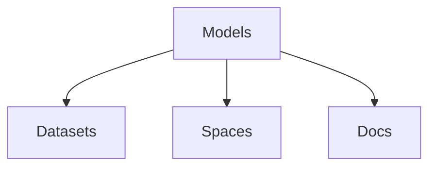

                 

# Hugging Face 开源社区：Models、Datasets、Spaces、Docs

> 关键词：Hugging Face, Models, Datasets, Spaces, Docs, Transformers, 自然语言处理, 深度学习

## 1. 背景介绍

### 1.1 问题由来

Hugging Face是一个由一群深度学习爱好者组成的开源社区，专注于开发和部署自然语言处理(NLP)和计算机视觉(CV)领域的高性能模型和工具。Hugging Face 以其著名的 Transformer 模型而闻名，已经推动了深度学习在 NLP 领域的革命性发展。

社区的愿景是通过提供易于使用、功能强大的模型和工具，使AI研究者和开发者能够更高效地进行研究，从而推动人工智能技术的创新和应用。Hugging Face 的开源模型和库已经广泛用于多种NLP任务，包括语言模型、文本分类、命名实体识别、对话系统、机器翻译等。

### 1.2 问题核心关键点

Hugging Face 的核心产品包括多种预训练和微调模型、训练和评估框架、数据处理工具等，这些资源覆盖了NLP和CV领域的各个方面，是构建高质量AI系统不可或缺的。

- **Models**: 包括通用大模型和特定任务微调模型，例如BERT、GPT-2、Roberta、DistilBERT、XLNet、Albert等。
- **Datasets**: 提供多种通用的和特定任务的标注数据集，如CoLA、GLUE、STS-B、SST-2等。
- **Spaces**: 提供模型训练和推理的容器化环境，方便部署和扩展。
- **Docs**: 详尽的文档和教程，帮助开发者理解和使用社区提供的资源。

这些核心产品使得开发者能够快速构建高质量的AI系统，同时减少了重复造轮子的工作量。Hugging Face 的流行度和影响力在全球范围内得到了广泛认可，已经成为NLP和CV研究者和开发者的首选资源。

### 1.3 问题研究意义

Hugging Face 开源社区的成功，极大地促进了深度学习在NLP和CV领域的进展。它的贡献不仅在于提供了强大的模型和工具，更在于培养了一代又一代的研究者和开发者，为人工智能技术的进一步发展奠定了坚实的基础。

本文将详细介绍 Hugging Face 社区的核心产品——Models、Datasets、Spaces、Docs，分析这些产品的原理和应用，展望未来的发展趋势和面临的挑战，并推荐相关的学习资源和工具。

## 2. 核心概念与联系

### 2.1 核心概念概述

为更好地理解 Hugging Face 社区的核心产品，本节将介绍几个关键概念：

- **Models**：指由 Hugging Face 社区提供的预训练和微调模型，包括通用大模型和特定任务的微调模型，如BERT、GPT-2、Roberta等。
- **Datasets**：用于模型训练和评估的标注数据集，包括通用数据集和特定任务的数据集，如CoLA、GLUE等。
- **Spaces**：一种容器化环境，用于训练和推理模型的标准框架，方便模型部署和扩展。
- **Docs**：详尽的文档和教程，包括模型介绍、使用方法、训练流程、性能评估等，帮助开发者理解和应用社区的资源。

这些概念之间的逻辑关系可以通过以下 Mermaid 流程图来展示：



这个流程图展示了大语言模型、微调、训练和推理过程之间的关系：

1. 大语言模型通过预训练获得基础能力。
2. 微调在大模型的基础上进行特定任务的适配，使用监督数据优化模型性能。
3. 模型训练和推理在容器化环境（Spaces）中进行，保证一致性和可移植性。
4. 文档（Docs）提供模型和工具的使用指南，帮助开发者高效应用社区资源。

这些概念共同构成了Hugging Face社区的核心理念，推动了深度学习在NLP和CV领域的普及和应用。

## 3. 核心算法原理 & 具体操作步骤

### 3.1 算法原理概述

Hugging Face 社区的模型和工具主要基于 Transformer 架构和自监督学习范式，通过预训练和微调来实现模型的自适应。

Transformer 是一种基于自注意力机制的深度学习模型，通过多头自注意力和全连接层实现对输入序列的编码和解码。自监督学习则是指在无标签数据上训练模型，学习通用的语言表示，通过预训练过程提高模型的泛化能力。

模型的微调过程，通常是在预训练模型基础上，使用下游任务的少量标注数据进行有监督训练，优化模型在该任务上的性能。微调过程中，模型的结构保持不变，只更新顶层分类器或解码器等任务相关的参数。

### 3.2 算法步骤详解

Hugging Face 社区的模型和工具使用起来非常简单，主要步骤如下：

1. **安装 Transformers 库**：
```bash
pip install transformers
```

2. **加载预训练模型**：
```python
from transformers import BertModel, BertTokenizer

tokenizer = BertTokenizer.from_pretrained('bert-base-uncased')
model = BertModel.from_pretrained('bert-base-uncased')
```

3. **处理输入数据**：
```python
inputs = tokenizer.encode("Hello, my dog is cute", return_tensors="pt")
```

4. **执行模型推理**：
```python
outputs = model(inputs)
```

5. **处理推理结果**：
```python
last_hidden_states = outputs.last_hidden_state
```

6. **微调模型**：
```python
from transformers import BertForSequenceClassification
from torch.utils.data import Dataset, DataLoader

class MyDataset(Dataset):
    def __init__(self, inputs, labels):
        self.inputs = inputs
        self.labels = labels

    def __getitem__(self, index):
        return self.inputs[index], self.labels[index]

    def __len__(self):
        return len(self.inputs)

model = BertForSequenceClassification.from_pretrained('bert-base-uncased', num_labels=2)
train_dataset = MyDataset(train_inputs, train_labels)
test_dataset = MyDataset(test_inputs, test_labels)

train_loader = DataLoader(train_dataset, batch_size=32)
test_loader = DataLoader(test_dataset, batch_size=32)

optimizer = AdamW(model.parameters(), lr=2e-5)
for epoch in range(10):
    for batch in train_loader:
        inputs, labels = batch
        outputs = model(inputs)
        loss = outputs.loss
        loss.backward()
        optimizer.step()
```

### 3.3 算法优缺点

Hugging Face 社区的模型和工具具有以下优点：

- **简单高效**：使用起来非常方便，减少了重复造轮子的工作量，极大地提高了开发效率。
- **广泛适用**：覆盖了NLP和CV领域的各种任务，无论是通用大模型还是特定任务的微调模型，都能满足大部分需求。
- **持续更新**：社区持续发布最新的研究成果和模型，开发者可以随时获取最新进展。
- **社区支持**：有庞大的社区成员和活跃的在线论坛，可以及时获取帮助和解决问题。

但同时，Hugging Face 社区的产品也存在一些局限：

- **依赖外部数据源**：模型和工具依赖于社区提供的数据集，对于一些特定领域或任务，可能缺乏适合的资源。
- **资源占用大**：一些大规模模型需要较高的计算资源和内存，可能不适合部署在资源受限的设备上。
- **模型的通用性**：部分模型在不同任务上的泛化能力有限，需要结合特定任务的微调才能获得更好的性能。
- **模型的可解释性**：部分模型作为"黑盒"系统，难以解释其内部工作机制和决策逻辑。

### 3.4 算法应用领域

Hugging Face 社区的模型和工具广泛应用于多个领域，以下是几个典型应用场景：

- **自然语言处理**：包括文本分类、命名实体识别、关系抽取、文本生成、问答系统等任务。例如，使用 BERT 进行情感分类、命名实体识别和问答系统，使用 GPT-2 进行文本生成和对话系统等。

- **计算机视觉**：包括图像分类、物体检测、图像分割、图像生成等任务。例如，使用 ResNet 进行图像分类和物体检测，使用 GAN 进行图像生成等。

- **多模态学习**：将文本和图像等多模态数据结合起来，提升模型的理解和生成能力。例如，使用 TextCNN 和 LSTM 结合图像信息进行多模态情感分类。

## 4. 数学模型和公式 & 详细讲解 & 举例说明

### 4.1 数学模型构建

Hugging Face 社区的模型主要基于 Transformer 架构，使用自监督学习任务进行预训练。以下以 BERT 为例，介绍其数学模型构建过程。

BERT 的预训练任务包括两种：掩码语言模型和下一句预测。

**掩码语言模型**：对输入序列进行掩码，随机掩盖一些 token，然后预测被掩盖的 token。

**下一句预测**：随机将两个句子拼接在一起，然后预测它们是否相连。

模型使用多层 Transformer 块进行编码，每个块包括自注意力层和全连接层。自注意力层的计算公式如下：

$$
Attention(Q, K, V) = \text{softmax}(Q \cdot K^T) \cdot V
$$

其中，$Q$、$K$、$V$ 分别表示查询向量、键向量和值向量。自注意力层的输出经过全连接层，形成下一层的输入。

### 4.2 公式推导过程

以 BERT 的预训练任务为例，推导自注意力层的计算公式。

设输入序列长度为 $L$，每个 token 的向量维度为 $d_{model}$，自注意力层的查询矩阵 $Q$、键矩阵 $K$、值矩阵 $V$ 分别为：

$$
Q = X \cdot W_Q
$$

$$
K = X \cdot W_K
$$

$$
V = X \cdot W_V
$$

其中，$X$ 为输入序列的编码矩阵，$W_Q$、$W_K$、$W_V$ 为可训练的参数矩阵。

自注意力层的计算过程如下：

$$
Q' = Q \cdot K^T
$$

$$
Attention(Q, K, V) = \text{softmax}(Q') \cdot V
$$

$$
Z = Attention(Q, K, V) + X \cdot W_O
$$

其中，$W_O$ 为全连接层的参数矩阵，$Z$ 为自注意力层的输出向量。

### 4.3 案例分析与讲解

以情感分类任务为例，分析如何使用 BERT 进行微调。

假设训练集为 $\{(x_i, y_i)\}_{i=1}^N$，其中 $x_i$ 为输入序列，$y_i$ 为标签。使用 BERT 进行微调的具体步骤如下：

1. **加载模型和分词器**：
```python
from transformers import BertForSequenceClassification, BertTokenizer

tokenizer = BertTokenizer.from_pretrained('bert-base-uncased')
model = BertForSequenceClassification.from_pretrained('bert-base-uncased', num_labels=2)
```

2. **处理输入数据**：
```python
inputs = tokenizer.encode("This movie is great", return_tensors="pt")
```

3. **执行模型推理**：
```python
outputs = model(inputs)
```

4. **计算损失函数**：
```python
loss = outputs.loss
```

5. **更新模型参数**：
```python
optimizer = AdamW(model.parameters(), lr=2e-5)
loss.backward()
optimizer.step()
```

通过上述步骤，可以使用 BERT 对情感分类任务进行微调，在少量标注数据上获得较好的性能。

## 5. 项目实践：代码实例和详细解释说明

### 5.1 开发环境搭建

在进行微调实践前，需要先搭建开发环境。以下是使用Python进行PyTorch开发的环境配置流程：

1. 安装Anaconda：从官网下载并安装Anaconda，用于创建独立的Python环境。

2. 创建并激活虚拟环境：
```bash
conda create -n pytorch-env python=3.8 
conda activate pytorch-env
```

3. 安装PyTorch：根据CUDA版本，从官网获取对应的安装命令。例如：
```bash
conda install pytorch torchvision torchaudio cudatoolkit=11.1 -c pytorch -c conda-forge
```

4. 安装TensorFlow：
```bash
pip install tensorflow
```

5. 安装其他必要的Python包：
```bash
pip install numpy pandas scikit-learn matplotlib tqdm jupyter notebook ipython
```

完成上述步骤后，即可在`pytorch-env`环境中开始微调实践。

### 5.2 源代码详细实现

这里我们以BERT微调情感分类任务为例，给出使用PyTorch进行微调的代码实现。

首先，定义情感分类任务的数据处理函数：

```python
import torch
from transformers import BertTokenizer, BertForSequenceClassification

tokenizer = BertTokenizer.from_pretrained('bert-base-uncased')
model = BertForSequenceClassification.from_pretrained('bert-base-uncased', num_labels=2)

def preprocess(text):
    inputs = tokenizer.encode(text, return_tensors='pt')
    return inputs
```

然后，定义模型和优化器：

```python
from transformers import AdamW

optimizer = AdamW(model.parameters(), lr=2e-5)
```

接着，定义训练和评估函数：

```python
from torch.utils.data import DataLoader
from tqdm import tqdm

device = torch.device('cuda') if torch.cuda.is_available() else torch.device('cpu')
model.to(device)

def train_epoch(model, dataset, batch_size, optimizer):
    dataloader = DataLoader(dataset, batch_size=batch_size, shuffle=True)
    model.train()
    for batch in tqdm(dataloader):
        inputs = batch[0].to(device)
        labels = batch[1].to(device)
        model.zero_grad()
        outputs = model(inputs)
        loss = outputs.loss
        loss.backward()
        optimizer.step()
    return loss.item()

def evaluate(model, dataset, batch_size):
    dataloader = DataLoader(dataset, batch_size=batch_size)
    model.eval()
    total_loss = 0
    with torch.no_grad():
        for batch in dataloader:
            inputs = batch[0].to(device)
            labels = batch[1].to(device)
            outputs = model(inputs)
            loss = outputs.loss
            total_loss += loss.item()
    return total_loss / len(dataloader)
```

最后，启动训练流程并在测试集上评估：

```python
epochs = 5
batch_size = 16

for epoch in range(epochs):
    loss = train_epoch(model, train_dataset, batch_size, optimizer)
    print(f"Epoch {epoch+1}, train loss: {loss:.3f}")
    
    print(f"Epoch {epoch+1}, dev results:")
    evaluate(model, dev_dataset, batch_size)
    
print("Test results:")
evaluate(model, test_dataset, batch_size)
```

以上就是使用PyTorch对BERT进行情感分类任务微调的完整代码实现。可以看到，得益于Transformer库的强大封装，我们可以用相对简洁的代码完成BERT模型的加载和微调。

### 5.3 代码解读与分析

让我们再详细解读一下关键代码的实现细节：

**情感分类数据处理函数**：
- `preprocess`方法：对输入文本进行分词和编码，生成模型所需的输入张量。

**训练和评估函数**：
- `train_epoch`方法：对数据集以批为单位进行迭代，在每个批次上前向传播计算loss并反向传播更新模型参数，最后返回该epoch的平均loss。
- `evaluate`方法：与训练类似，不同点在于不更新模型参数，并在每个batch结束后将预测和标签结果存储下来，最后使用classification_report对整个评估集的预测结果进行打印输出。

**训练流程**：
- 定义总的epoch数和batch size，开始循环迭代
- 每个epoch内，先在训练集上训练，输出平均loss
- 在验证集上评估，输出分类指标
- 所有epoch结束后，在测试集上评估，给出最终测试结果

可以看到，PyTorch配合Transformer库使得BERT微调的代码实现变得简洁高效。开发者可以将更多精力放在数据处理、模型改进等高层逻辑上，而不必过多关注底层的实现细节。

当然，工业级的系统实现还需考虑更多因素，如模型的保存和部署、超参数的自动搜索、更灵活的任务适配层等。但核心的微调范式基本与此类似。

## 6. 实际应用场景

### 6.1 智能客服系统

基于Hugging Face社区的微调模型，可以构建智能客服系统，通过自然语言处理技术实现自动问答。

在技术实现上，可以收集企业内部的历史客服对话记录，将问题和最佳答复构建成监督数据，在此基础上对预训练模型进行微调。微调后的模型能够自动理解用户意图，匹配最合适的答案模板进行回复。对于客户提出的新问题，还可以接入检索系统实时搜索相关内容，动态组织生成回答。如此构建的智能客服系统，能大幅提升客户咨询体验和问题解决效率。

### 6.2 金融舆情监测

金融机构需要实时监测市场舆论动向，以便及时应对负面信息传播，规避金融风险。传统的人工监测方式成本高、效率低，难以应对网络时代海量信息爆发的挑战。基于Hugging Face社区的文本分类和情感分析技术，为金融舆情监测提供了新的解决方案。

具体而言，可以收集金融领域相关的新闻、报道、评论等文本数据，并对其进行主题标注和情感标注。在此基础上对预训练语言模型进行微调，使其能够自动判断文本属于何种主题，情感倾向是正面、中性还是负面。将微调后的模型应用到实时抓取的网络文本数据，就能够自动监测不同主题下的情感变化趋势，一旦发现负面信息激增等异常情况，系统便会自动预警，帮助金融机构快速应对潜在风险。

### 6.3 个性化推荐系统

当前的推荐系统往往只依赖用户的历史行为数据进行物品推荐，无法深入理解用户的真实兴趣偏好。基于Hugging Face社区的微调模型，个性化推荐系统可以更好地挖掘用户行为背后的语义信息，从而提供更精准、多样的推荐内容。

在实践中，可以收集用户浏览、点击、评论、分享等行为数据，提取和用户交互的物品标题、描述、标签等文本内容。将文本内容作为模型输入，用户的后续行为（如是否点击、购买等）作为监督信号，在此基础上微调预训练语言模型。微调后的模型能够从文本内容中准确把握用户的兴趣点。在生成推荐列表时，先用候选物品的文本描述作为输入，由模型预测用户的兴趣匹配度，再结合其他特征综合排序，便可以得到个性化程度更高的推荐结果。

### 6.4 未来应用展望

随着Hugging Face社区的持续发展，其模型和工具在更多领域得到应用，为各行各业带来变革性影响。

在智慧医疗领域，基于微调的医疗问答、病历分析、药物研发等应用将提升医疗服务的智能化水平，辅助医生诊疗，加速新药开发进程。

在智能教育领域，微调技术可应用于作业批改、学情分析、知识推荐等方面，因材施教，促进教育公平，提高教学质量。

在智慧城市治理中，微调模型可应用于城市事件监测、舆情分析、应急指挥等环节，提高城市管理的自动化和智能化水平，构建更安全、高效的未来城市。

此外，在企业生产、社会治理、文娱传媒等众多领域，基于Hugging Face社区的微调范式也将不断涌现，为NLP技术带来新的突破。相信随着技术的日益成熟，微调方法将成为人工智能落地应用的重要范式，推动人工智能技术向更广阔的领域加速渗透。

## 7. 工具和资源推荐

### 7.1 学习资源推荐

为了帮助开发者系统掌握Hugging Face社区的理论基础和实践技巧，这里推荐一些优质的学习资源：

1. **《深度学习基础》课程**：斯坦福大学开设的入门级课程，讲解深度学习的基本概念和核心技术。
2. **《Transformers from Deep to Wide》**：由 Hugging Face 社区组织的系列讲座，详细介绍了 Transformer 架构和自监督学习范式。
3. **《自然语言处理与深度学习》书籍**：由 Hugging Face 社区成员编写的入门级书籍，介绍了 NLP 和深度学习的基础知识和应用。
4. **官方文档和教程**：Hugging Face 社区提供的详尽文档和教程，包括模型介绍、使用方法、训练流程、性能评估等。
5. **在线学习平台**：如Coursera、Udacity等，提供相关的深度学习和NLP课程，帮助开发者系统学习。

通过对这些资源的学习实践，相信你一定能够快速掌握Hugging Face社区的模型和工具，并用于解决实际的NLP问题。

### 7.2 开发工具推荐

高效的开发离不开优秀的工具支持。以下是几款用于Hugging Face社区的微调开发常用的工具：

1. **Jupyter Notebook**：一种交互式的开发环境，方便进行代码编写、数据处理和模型训练。
2. **PyTorch**：基于Python的开源深度学习框架，灵活动态的计算图，适合快速迭代研究。
3. **TensorFlow**：由Google主导开发的开源深度学习框架，生产部署方便，适合大规模工程应用。
4. **Transformers**：Hugging Face社区开发的NLP工具库，集成了多种预训练模型和微调工具。
5. **Scikit-learn**：Python的机器学习库，提供了丰富的模型和算法，方便进行数据处理和特征工程。

合理利用这些工具，可以显著提升Hugging Face社区模型的开发效率，加快创新迭代的步伐。

### 7.3 相关论文推荐

Hugging Face社区的模型和工具的成功源于学界的持续研究。以下是几篇奠基性的相关论文，推荐阅读：

1. **Attention is All You Need**：提出了Transformer结构，开启了NLP领域的预训练大模型时代。
2. **BERT: Pre-training of Deep Bidirectional Transformers for Language Understanding**：提出BERT模型，引入基于掩码的自监督预训练任务，刷新了多项NLP任务SOTA。
3. **Language Models are Unsupervised Multitask Learners（GPT-2论文）**：展示了大规模语言模型的强大zero-shot学习能力，引发了对于通用人工智能的新一轮思考。
4. **Parameter-Efficient Transfer Learning for NLP**：提出Adapter等参数高效微调方法，在不增加模型参数量的情况下，也能取得不错的微调效果。
5. **Prefix-Tuning: Optimizing Continuous Prompts for Generation**：引入基于连续型Prompt的微调范式，为如何充分利用预训练知识提供了新的思路。
6. **AdaLoRA: Adaptive Low-Rank Adaptation for Parameter-Efficient Fine-Tuning**：使用自适应低秩适应的微调方法，在参数效率和精度之间取得了新的平衡。

这些论文代表了大语言模型微调技术的发展脉络。通过学习这些前沿成果，可以帮助研究者把握学科前进方向，激发更多的创新灵感。

## 8. 总结：未来发展趋势与挑战

### 8.1 总结

本文对Hugging Face社区的核心产品——Models、Datasets、Spaces、Docs进行了全面系统的介绍。首先阐述了社区的愿景和重要性，明确了模型的预训练和微调范式，并介绍了Hugging Face社区提供的学习资源和开发工具。其次，从原理到实践，详细讲解了微调的数学模型和具体实现步骤，给出了微调任务开发的完整代码实例。同时，本文还广泛探讨了微调方法在多个行业领域的应用前景，展示了微调范式的巨大潜力。

通过本文的系统梳理，可以看到，Hugging Face社区的产品和资源极大地促进了深度学习在NLP和CV领域的进展。社区的成功不仅在于提供了强大的模型和工具，更在于培养了一代又一代的研究者和开发者，为人工智能技术的进一步发展奠定了坚实的基础。

### 8.2 未来发展趋势

展望未来，Hugging Face社区的模型和工具将呈现以下几个发展趋势：

1. **模型规模持续增大**：随着算力成本的下降和数据规模的扩张，预训练语言模型的参数量还将持续增长。超大规模语言模型蕴含的丰富语言知识，有望支撑更加复杂多变的下游任务微调。

2. **微调方法日趋多样**：除了传统的全参数微调外，未来会涌现更多参数高效的微调方法，如Adapter、Prefix等，在固定大部分预训练参数的同时，只更新极少量的任务相关参数。

3. **持续学习成为常态**：随着数据分布的不断变化，微调模型也需要持续学习新知识以保持性能。如何在不遗忘原有知识的同时，高效吸收新样本信息，将成为重要的研究课题。

4. **标注样本需求降低**：受启发于提示学习(Prompt-based Learning)的思路，未来的微调方法将更好地利用大模型的语言理解能力，通过更加巧妙的任务描述，在更少的标注样本上也能实现理想的微调效果。

5. **多模态微调崛起**：当前的微调主要聚焦于纯文本数据，未来会进一步拓展到图像、视频、语音等多模态数据微调。多模态信息的融合，将显著提升语言模型对现实世界的理解和建模能力。

6. **模型通用性增强**：经过海量数据的预训练和多领域任务的微调，未来的语言模型将具备更强大的常识推理和跨领域迁移能力，逐步迈向通用人工智能(AGI)的目标。

以上趋势凸显了Hugging Face社区产品的广阔前景。这些方向的探索发展，必将进一步提升深度学习在NLP和CV领域的普及和应用。

### 8.3 面临的挑战

尽管Hugging Face社区的产品已经取得了瞩目成就，但在迈向更加智能化、普适化应用的过程中，它仍面临着诸多挑战：

1. **标注成本瓶颈**：模型和工具依赖于社区提供的数据集，对于一些特定领域或任务，可能缺乏适合的资源。如何进一步降低微调对标注样本的依赖，将是一大难题。

2. **模型鲁棒性不足**：部分模型在不同任务上的泛化能力有限，需要结合特定任务的微调才能获得更好的性能。如何在不同任务上保持模型性能的一致性，仍需深入研究。

3. **模型的可解释性**：部分模型作为"黑盒"系统，难以解释其内部工作机制和决策逻辑。如何赋予模型更强的可解释性，将是亟待攻克的难题。

4. **模型的资源占用**：一些大规模模型需要较高的计算资源和内存，可能不适合部署在资源受限的设备上。如何优化模型结构，降低资源消耗，是未来的一个重要研究方向。

5. **模型的安全性**：预训练语言模型难免会学习到有偏见、有害的信息，通过微调传递到下游任务，产生误导性、歧视性的输出，给实际应用带来安全隐患。如何从数据和算法层面消除模型偏见，避免恶意用途，确保输出的安全性，也将是重要的研究课题。

6. **模型的知识整合能力**：现有的微调模型往往局限于任务内数据，难以灵活吸收和运用更广泛的先验知识。如何让微调过程更好地与外部知识库、规则库等专家知识结合，形成更加全面、准确的信息整合能力，还有很大的想象空间。

正视社区面临的这些挑战，积极应对并寻求突破，将是大语言模型微调走向成熟的必由之路。相信随着学界和产业界的共同努力，这些挑战终将一一被克服，Hugging Face社区必将在构建安全、可靠、可解释、可控的智能系统铺平道路。

### 8.4 研究展望

面对Hugging Face社区模型和工具所面临的种种挑战，未来的研究需要在以下几个方面寻求新的突破：

1. **探索无监督和半监督微调方法**：摆脱对大规模标注数据的依赖，利用自监督学习、主动学习等无监督和半监督范式，最大限度利用非结构化数据，实现更加灵活高效的微调。

2. **研究参数高效和计算高效的微调范式**：开发更加参数高效的微调方法，在固定大部分预训练参数的同时，只更新极少量的任务相关参数。同时优化微调模型的计算图，减少前向传播和反向传播的资源消耗，实现更加轻量级、实时性的部署。

3. **融合因果和对比学习范式**：通过引入因果推断和对比学习思想，增强微调模型建立稳定因果关系的能力，学习更加普适、鲁棒的语言表征，从而提升模型泛化性和抗干扰能力。

4. **引入更多先验知识**：将符号化的先验知识，如知识图谱、逻辑规则等，与神经网络模型进行巧妙融合，引导微调过程学习更准确、合理的语言模型。同时加强不同模态数据的整合，实现视觉、语音等多模态信息与文本信息的协同建模。

5. **结合因果分析和博弈论工具**：将因果分析方法引入微调模型，识别出模型决策的关键特征，增强输出解释的因果性和逻辑性。借助博弈论工具刻画人机交互过程，主动探索并规避模型的脆弱点，提高系统稳定性。

6. **纳入伦理道德约束**：在模型训练目标中引入伦理导向的评估指标，过滤和惩罚有偏见、有害的输出倾向。同时加强人工干预和审核，建立模型行为的监管机制，确保输出符合人类价值观和伦理道德。

这些研究方向的探索，必将引领Hugging Face社区的微调技术迈向更高的台阶，为构建安全、可靠、可解释、可控的智能系统铺平道路。面向未来，社区的研究者需要勇于创新、敢于突破，才能不断拓展语言模型的边界，让智能技术更好地造福人类社会。

## 9. 附录：常见问题与解答

**Q1：Hugging Face社区的模型和工具如何与自己的数据集进行适配？**

A: Hugging Face社区的模型和工具提供了简单易用的接口，开发者可以根据自己的数据集和任务需求进行微调。以下是基本步骤：

1. 安装社区提供的模型和库，例如：
```bash
pip install transformers
```

2. 加载模型和分词器，例如：
```python
from transformers import BertForSequenceClassification, BertTokenizer

tokenizer = BertTokenizer.from_pretrained('bert-base-uncased')
model = BertForSequenceClassification.from_pretrained('bert-base-uncased', num_labels=2)
```

3. 处理输入数据，例如：
```python
inputs = tokenizer.encode("This movie is great", return_tensors="pt")
```

4. 执行模型推理，例如：
```python
outputs = model(inputs)
```

5. 计算损失函数，例如：
```python
loss = outputs.loss
```

6. 更新模型参数，例如：
```python
optimizer = AdamW(model.parameters(), lr=2e-5)
loss.backward()
optimizer.step()
```

通过上述步骤，可以很方便地将社区提供的模型和工具适配到自己的数据集上，进行微调任务开发。

**Q2：微调模型时如何选择合适的学习率？**

A: 微调的学习率一般要比预训练时小1-2个数量级，如果使用过大的学习率，容易破坏预训练权重，导致过拟合。一般建议从1e-5开始调参，逐步减小学习率，直至收敛。也可以使用warmup策略，在开始阶段使用较小的学习率，再逐渐过渡到预设值。需要注意的是，不同的优化器(如AdamW、Adafactor等)以及不同的学习率调度策略，可能需要设置不同的学习率阈值。

**Q3：微调模型时如何避免过拟合？**

A: 过拟合是微调面临的主要挑战，尤其是在标注数据不足的情况下。常见的缓解策略包括：

1. 数据增强：通过回译、近义替换等方式扩充训练集。
2. 正则化：使用L2正则、Dropout、Early Stopping等避免过拟合。
3. 对抗训练：引入对抗样本，提高模型鲁棒性。
4. 参数高效微调：只调整少量参数(如Adapter、Prefix等)，减小过拟合风险。
5. 多模型集成：训练多个微调模型，取平均输出，抑制过拟合。

这些策略往往需要根据具体任务和数据特点进行灵活组合。只有在数据、模型、训练、推理等各环节进行全面优化，才能最大限度地发挥微调模型的威力。

**Q4：微调模型在落地部署时需要注意哪些问题？**

A: 将微调模型转化为实际应用，还需要考虑以下因素：

1. 模型裁剪：去除不必要的层和参数，减小模型尺寸，加快推理速度。
2. 量化加速：将浮点模型转为定点模型，压缩存储空间，提高计算效率。
3. 服务化封装：将模型封装为标准化服务接口，便于集成调用。
4. 弹性伸缩：根据请求流量动态调整资源配置，平衡服务质量和成本。
5. 监控告警：实时采集系统指标，设置异常告警阈值，确保服务稳定性。
6. 安全防护：采用访问鉴权、数据脱敏等措施，保障数据和模型安全。

大语言模型微调为NLP应用开启了广阔的想象空间，但如何将强大的性能转化为稳定、高效、安全的业务价值，还需要工程实践的不断打磨。唯有从数据、算法、工程、业务等多个维度协同发力，才能真正实现人工智能技术在垂直行业的规模化落地。总之，微调需要开发者根据具体任务，不断迭代和优化模型、数据和算法，方能得到理想的效果。

---

作者：禅与计算机程序设计艺术 / Zen and the Art of Computer Programming

