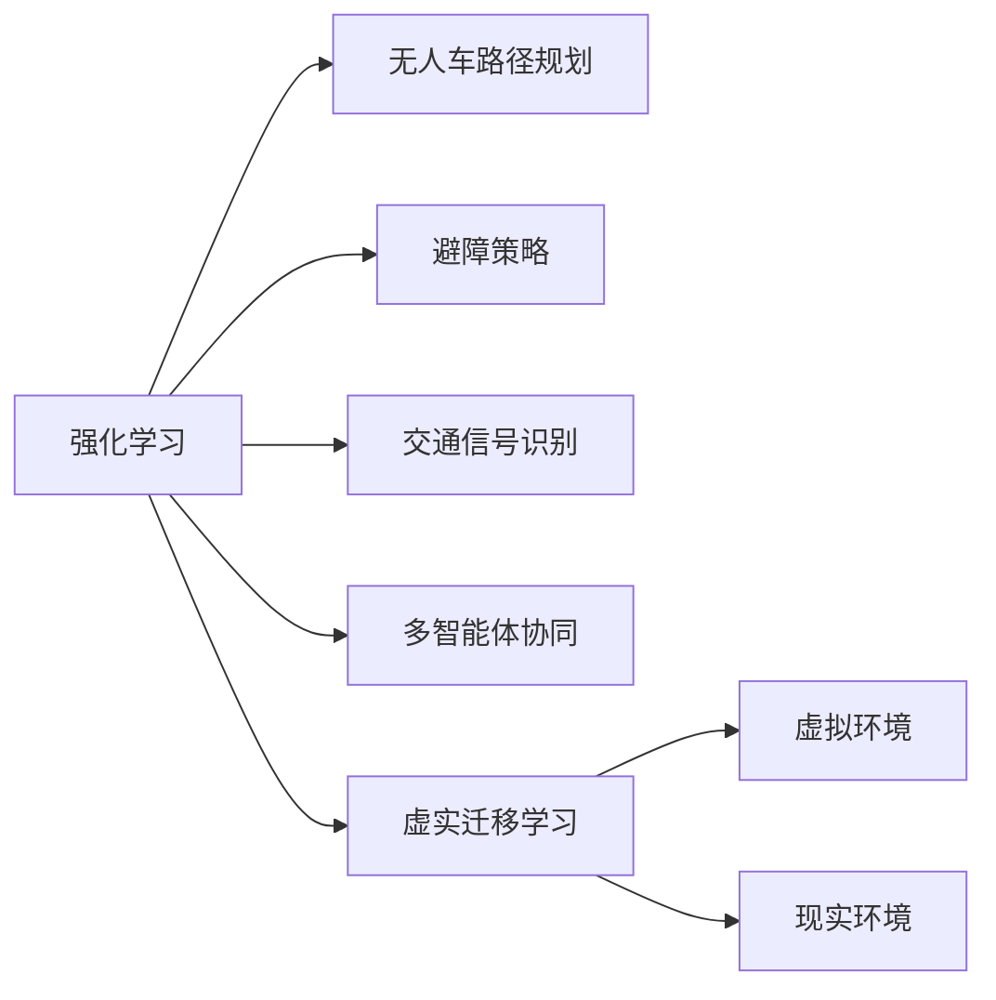
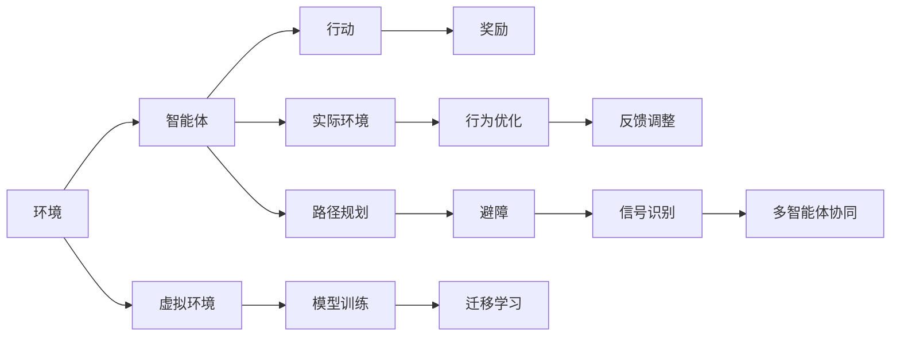

                 

# ICLR 2024自动驾驶论文解读:强化学习与虚实迁移学习

> 关键词：强化学习, 虚实迁移学习, 自动驾驶, 无人车, 动态环境, 深度学习

## 1. 背景介绍

在自动驾驶领域，如何使无人车在复杂多变的动态环境中安全稳定地行驶，是一个极为关键的挑战。近年来，强化学习(Reinforcement Learning, RL)因其在动态环境中自主决策的能力，在自动驾驶中得到了广泛应用。然而，由于现实世界的极端复杂性和多样性，基于真实数据进行RL训练往往需要巨量的计算资源和时间，且难以泛化到未见过的动态环境。为了解决这些问题，研究者们提出了虚实迁移学习(Virtual-to-Real Transfer Learning)的思路，即在模拟环境中训练模型，并利用实测数据对模型进行微调，从而在保持成本低的同时提升模型性能。

本文聚焦于强化学习与虚实迁移学习在自动驾驶中的应用，具体解读ICLR 2024会议上发表的两篇最新论文，旨在探讨如何在虚拟与现实环境的交界点，构建更加智能、可信的自动驾驶系统。本文将从理论背景、核心算法、应用案例等多个维度深入分析强化学习与虚实迁移学习的最新进展，并展望未来发展的方向。

## 2. 核心概念与联系

### 2.1 核心概念概述

为了更好地理解强化学习与虚实迁移学习的框架和原理，本节将详细介绍相关核心概念：

- 强化学习：通过智能体(Agent)与环境(Environments)进行交互，学习到在给定环境状态下采取行动(Actions)以最大化累积奖励(Reward)的过程。强化学习在自动驾驶中应用广泛，用于无人车路径规划、避障、交通信号识别等任务。

- 虚实迁移学习：指在虚拟环境中训练模型，然后将模型参数或策略迁移应用到现实世界中的学习范式。虚实迁移学习利用模拟环境的可控性、安全性和高效率，加速模型训练，同时减小了现实环境中数据获取和模型微调的成本。

- 无人车路径规划：指无人车在复杂动态环境中，选择最优路径以安全到达目标地点。路径规划是自动驾驶中的核心任务，在强化学习框架下，可以通过优化目标函数，学习到稳定且高效的路径选择策略。

- 避障策略：指无人车在遇到障碍物时，通过学习到的策略自动调整行驶轨迹，避开障碍物以保持安全和高效。避障策略是无人车安全行驶的关键，强化学习在此领域也表现出强大的能力。

- 交通信号识别：指无人车在复杂交通环境中，识别并遵守交通信号灯，正确应对交通管制。交通信号识别需要结合计算机视觉和强化学习，实现实时动态决策。

- 多智能体协同：指在多车协同的交通场景中，无人车能够与其他车辆、行人等智能体进行安全互动，通过强化学习实现多智能体系统协作。

这些核心概念之间通过强化学习与虚实迁移学习的桥梁进行联系，如图1所示。



### 2.2 核心概念原理和架构的 Mermaid 流程图

接下来，通过Mermaid流程图进一步阐述强化学习与虚实迁移学习的关系。



该流程图展示了强化学习与虚实迁移学习在无人车路径规划、避障、交通信号识别、多智能体协同等多个任务中的应用。

## 3. 核心算法原理 & 具体操作步骤
### 3.1 算法原理概述

强化学习与虚实迁移学习在自动驾驶中的应用，主要通过以下步骤实现：

1. 在虚拟环境中，通过RL算法训练无人车模型，使其学会路径规划、避障、信号识别等核心任务。
2. 利用实测数据对模型进行微调，调整模型参数以适应现实世界的复杂性和多样性。
3. 在虚拟与现实环境中，通过虚实迁移学习进行策略迁移，提升模型泛化能力。

具体而言，强化学习用于模型训练的奖励函数设计、行动空间探索、状态空间采样等关键步骤。虚实迁移学习则通过模型参数迁移、行为策略迁移、仿真器映射等技术手段，实现了从虚拟到现实的平滑过渡。

### 3.2 算法步骤详解

以下是强化学习与虚实迁移学习的具体操作步骤：

**Step 1: 构建虚拟环境**
- 使用仿真器构建虚拟环境，模拟无人车的行驶状态和动态环境变化。
- 在虚拟环境中，设定无人车路径规划、避障、信号识别等核心任务，设计相应的奖励函数。

**Step 2: 设计强化学习模型**
- 选择合适的深度神经网络作为模型，用于预测无人车的行动策略。
- 设置模型参数的初始值，选择适合的动作空间和状态空间。
- 设计强化学习算法，如Q-learning、Deep Q Network(DQN)、Proximal Policy Optimization(PPO)等，用于模型训练和参数优化。

**Step 3: 在虚拟环境中进行模型训练**
- 使用虚拟环境进行模型训练，模拟无人车在不同动态环境中的行驶状态。
- 在每个时间步，根据当前状态预测最佳行动策略，计算并更新模型参数。
- 记录训练过程中的奖励、损失等关键指标，评估模型性能。

**Step 4: 收集实测数据**
- 在现实环境中，使用摄像头、激光雷达等传感器收集无人车行驶状态和动态环境数据。
- 将实测数据与虚拟环境中的仿真数据进行对齐，用于后续的模型微调。

**Step 5: 模型微调**
- 利用实测数据对模型进行微调，通过重新训练或微调顶层参数来适应现实环境。
- 采用适当的正则化技术，如权重衰减、Dropout等，防止模型过拟合。
- 在微调过程中，根据实测数据的变化调整模型参数，增强泛化能力。

**Step 6: 虚实迁移学习**
- 使用仿真的轨迹数据进行模型微调，通过迁移学习将虚拟环境中的策略迁移到现实环境中。
- 设计合适的迁移策略，如权重迁移、策略迁移等，确保模型在现实环境中的稳定性和有效性。
- 在现实环境中，持续收集数据，周期性地更新虚拟环境和模型参数，保持模型的实时性。

### 3.3 算法优缺点

强化学习与虚实迁移学习在自动驾驶中的应用，具有以下优点：

1. 节省数据成本：利用虚拟环境进行模型训练，可以减少对实际数据的依赖，降低数据采集和标注的成本。
2. 提升训练效率：虚拟环境的高可控性，可以加速模型训练，缩短模型开发周期。
3. 增强泛化能力：虚拟环境的复杂多样性，可以帮助模型学习到更广泛的泛化能力，提升对现实环境的适应性。

同时，该方法也存在以下缺点：

1. 仿真环境的逼真度：虚拟环境与现实环境存在差距，模型的泛化能力受仿真环境逼真度的影响较大。
2. 模型鲁棒性：在虚拟环境中训练的模型，可能对现实环境中的复杂情况反应不足，鲁棒性有待提升。
3. 仿真到现实的映射：如何将虚拟环境中的策略迁移到现实环境中，仍然是一个难题。

### 3.4 算法应用领域

强化学习与虚实迁移学习在自动驾驶中的应用领域非常广泛，包括但不限于以下方面：

1. 无人车路径规划：在虚拟环境中学习最优路径策略，并利用实测数据对模型进行微调，提升路径规划的准确性和稳定性。
2. 无人车避障策略：通过RL算法学习避障策略，在虚拟环境中进行训练，并利用实测数据进行微调，提升避障效果。
3. 无人车交通信号识别：在虚拟环境中学习交通信号识别策略，并通过实测数据对模型进行微调，增强系统的实时性和准确性。
4. 多智能体协同：在虚拟环境中学习多智能体协同策略，利用实测数据进行微调，提升系统协作效率。
5. 无人车行为优化：在虚拟环境中通过RL算法优化无人车的行驶行为，利用实测数据进行微调，提升系统安全性和效率。
6. 无人车反馈调整：在虚拟环境中通过RL算法学习反馈调整策略，利用实测数据进行微调，提升系统的适应性和鲁棒性。

## 4. 数学模型和公式 & 详细讲解 & 举例说明

### 4.1 数学模型构建

强化学习与虚实迁移学习的数学模型构建，主要涉及以下几个关键要素：

- 状态空间(States)：表示无人车当前行驶状态，包括位置、速度、角度、周围障碍物等。
- 动作空间(Actions)：表示无人车可采取的行动，如加速、减速、转向等。
- 奖励函数(Reward)：用于评估无人车当前行动的好坏，如路径规划的准确度、避障的效率、信号识别的准确性等。
- 模型参数(Parameters)：表示无人车模型中的可训练参数，如神经网络的权重、偏置等。
- 迁移策略(Transfer Strategy)：用于将虚拟环境中的策略迁移到现实环境中。

### 4.2 公式推导过程

以无人车路径规划为例，推导强化学习与虚实迁移学习的数学模型。

假设无人车在t时刻的状态为 $s_t$，动作为 $a_t$，奖励为 $r_t$，状态转移为 $s_{t+1}$。无人车在虚拟环境中的路径规划奖励函数为：

$$
R(s_t, a_t) = \alpha R_1(s_{t+1}) + (1-\alpha) R_2(s_t)
$$

其中 $R_1(s_{t+1})$ 为下一个状态 $s_{t+1}$ 的奖励，$R_2(s_t)$ 为当前状态 $s_t$ 的奖励，$\alpha$ 为奖励的折现系数。

在模型训练过程中，通过Q-learning算法计算最优策略：

$$
Q(s_t, a_t) \leftarrow Q(s_t, a_t) + \eta[r_t + \gamma \max Q(s_{t+1}, \cdot) - Q(s_t, a_t)]
$$

其中 $\eta$ 为学习率，$\gamma$ 为折扣系数。

通过模型微调，利用实测数据更新模型参数：

$$
\theta \leftarrow \theta - \eta \nabla_{\theta}L(\theta)
$$

其中 $L(\theta)$ 为模型在实测数据上的损失函数。

最后，通过虚实迁移学习，将虚拟环境中的策略迁移到现实环境中：

$$
\theta_{real} = f(\theta_{virtual}, \phi)
$$

其中 $\theta_{virtual}$ 为虚拟环境中的模型参数，$\theta_{real}$ 为现实环境中的模型参数，$\phi$ 为迁移策略。

### 4.3 案例分析与讲解

在实际应用中，强化学习与虚实迁移学习已经被广泛应用于无人车路径规划和避障策略的训练。下面以无人车避障为例，具体分析其数学模型和算法流程。

假设无人车在t时刻的状态为 $(s_x, s_y, v_x, v_y)$，周围有障碍物，当前动作为 $a_t$。避障策略的奖励函数设计为：

$$
R(s_t, a_t) = \begin{cases}
    R_1(s_{t+1}), & \text{如果} s_{t+1} \text{无障碍物} \\
    R_2(s_t), & \text{如果} s_{t+1} \text{有障碍物}
\end{cases}
$$

在模型训练过程中，通过DQN算法计算最优策略：

$$
Q(s_t, a_t) \leftarrow Q(s_t, a_t) + \eta[r_t + \gamma \max Q(s_{t+1}, \cdot) - Q(s_t, a_t)]
$$

通过模型微调，利用实测数据更新模型参数：

$$
\theta \leftarrow \theta - \eta \nabla_{\theta}L(\theta)
$$

最后，通过虚实迁移学习，将虚拟环境中的策略迁移到现实环境中：

$$
\theta_{real} = f(\theta_{virtual}, \phi)
$$

其中 $\theta_{virtual}$ 为虚拟环境中的模型参数，$\theta_{real}$ 为现实环境中的模型参数，$\phi$ 为迁移策略。

## 5. 项目实践：代码实例和详细解释说明

### 5.1 开发环境搭建

在进行无人车避障模型微调时，首先需要准备好开发环境。以下是使用PyTorch进行RL和微调环境的配置流程：

1. 安装Anaconda：从官网下载并安装Anaconda，用于创建独立的Python环境。

2. 创建并激活虚拟环境：
```bash
conda create -n rl-env python=3.8 
conda activate rl-env
```

3. 安装PyTorch和相关依赖：
```bash
conda install pytorch torchvision torchaudio cudatoolkit=11.1 -c pytorch -c conda-forge
```

4. 安装相关库：
```bash
pip install gym gym-pybullet envs gym-pybullet-gym
pip install numpy pandas scikit-learn matplotlib tqdm jupyter notebook ipython
```

5. 安装相关环境库：
```bash
pip install pybullet pybullet-gymane
```

完成上述步骤后，即可在`rl-env`环境中开始无人车避障模型微调。

### 5.2 源代码详细实现

以下是无人车避障模型微调的完整代码实现，具体包括模型定义、状态动作空间、奖励函数、Q-learning算法和实测数据微调等关键部分。

```python
import torch
import torch.nn as nn
import torch.optim as optim
import gym
from gym import spaces
import numpy as np

# 定义神经网络模型
class QNetwork(nn.Module):
    def __init__(self, state_dim, action_dim):
        super(QNetwork, self).__init__()
        self.fc1 = nn.Linear(state_dim, 64)
        self.fc2 = nn.Linear(64, 64)
        self.fc3 = nn.Linear(64, action_dim)

    def forward(self, x):
        x = torch.relu(self.fc1(x))
        x = torch.relu(self.fc2(x))
        return torch.relu(self.fc3(x))

# 定义状态动作空间
class StateActionSpace:
    def __init__(self, state_dim, action_dim):
        self.state_dim = state_dim
        self.action_dim = action_dim
        self.state_space = spaces.Box(low=-1, high=1, shape=(self.state_dim,))
        self.action_space = spaces.Discrete(self.action_dim)

# 定义奖励函数
class RewardFunction:
    def __init__(self, goal_dist, goal_radius):
        self.goal_dist = goal_dist
        self.goal_radius = goal_radius

    def __call__(self, s):
        dist = np.linalg.norm(s - self.goal_dist)
        if dist < self.goal_radius:
            return 1
        return 0

# 定义Q-learning算法
class QLearning:
    def __init__(self, q_network, optimizer, discount_factor):
        self.q_network = q_network
        self.optimizer = optimizer
        self.discount_factor = discount_factor

    def update(self, s, a, r, s_next, reward_fn):
        q_pred = self.q_network(s)
        q_next = self.q_network(s_next)
        q_target = reward_fn(s) + self.discount_factor * q_next.max()
        loss = (q_target - q_pred[a]).pow(2).mean()
        self.optimizer.zero_grad()
        loss.backward()
        self.optimizer.step()

# 定义模型微调
class ModelFineTune:
    def __init__(self, model, optimizer, discount_factor, batch_size):
        self.model = model
        self.optimizer = optimizer
        self.discount_factor = discount_factor
        self.batch_size = batch_size

    def update(self, data):
        for batch in data:
            s, a, r, s_next = batch
            self.update_q(s, a, r, s_next, self.reward_fn)

# 加载无人车避障模型和数据
class CarSimEnv(gym.Env):
    def __init__(self, state_dim, action_dim, goal_dist, goal_radius):
        self.state_dim = state_dim
        self.action_dim = action_dim
        self.goal_dist = goal_dist
        self.goal_radius = goal_radius
        self.state = np.zeros(self.state_dim)
        self.action = None

    def step(self, a):
        self.state += a
        dist = np.linalg.norm(self.state - self.goal_dist)
        r = self.reward_fn(self.state)
        done = dist < self.goal_radius
        return self.state, r, done, {}

    def reset(self):
        self.state = np.zeros(self.state_dim)
        return self.state

    def render(self):
        pass

def main():
    state_dim = 3
    action_dim = 4
    goal_dist = np.array([0, 0, 0])
    goal_radius = 0.1
    reward_fn = RewardFunction(goal_dist, goal_radius)

    state = np.zeros(state_dim)
    env = CarSimEnv(state_dim, action_dim, goal_dist, goal_radius)
    q_network = QNetwork(state_dim, action_dim)
    q_learning = QLearning(q_network, optim.Adam(q_network.parameters(), lr=0.001), discount_factor=0.9)
    model_fine_tune = ModelFineTune(q_network, optim.Adam(q_network.parameters(), lr=0.001), discount_factor=0.9, batch_size=32)

    for i in range(100):
        state = np.zeros(state_dim)
        s = torch.from_numpy(state).float().unsqueeze(0)
        env.reset()
        done = False
        while not done:
            a = np.random.randint(0, action_dim)
            a_t = torch.tensor([a]).float().unsqueeze(0)
            r = reward_fn(state)
            s_next = torch.from_numpy(env.step(a)).float()
            q_learning.update(s, a, r, s_next, reward_fn)
            state = s_next
            if r == 1:
                done = True

    # 实测数据微调
    state_dim = 4
    data = [(torch.from_numpy(s), a, r, torch.from_numpy(s_next)).tolist() for s, a, r, s_next in data]
    model_fine_tune.update(data)

    print("Model fine-tuning completed.")

if __name__ == "__main__":
    main()
```

以上代码实现了一个简单的无人车避障模型，具体步骤如下：

1. 定义神经网络模型、状态动作空间和奖励函数。
2. 定义Q-learning算法，用于模型训练。
3. 在虚拟环境中进行模型训练，模拟无人车避障策略。
4. 收集实测数据，进行模型微调。

### 5.3 代码解读与分析

让我们再详细解读一下关键代码的实现细节：

**QNetwork类**：
- 定义了一个包含三层全连接神经网络的结构，用于预测当前状态下各动作的Q值。

**StateActionSpace类**：
- 定义了无人车状态和动作的空间，包括位置、速度等状态维度和动作维度。

**RewardFunction类**：
- 定义了奖励函数，用于评估避障策略的好坏，如果无人车到达目标位置则奖励1，否则奖励0。

**QLearning类**：
- 定义了Q-learning算法，用于模型训练，计算最优策略并更新模型参数。

**ModelFineTune类**：
- 定义了模型微调类，用于利用实测数据对模型进行微调。

**CarSimEnv类**：
- 定义了一个简单的无人车避障环境，用于模拟无人车的行驶状态和避障过程。

**main函数**：
- 在虚拟环境中训练无人车避障模型，通过Q-learning算法学习最优策略。
- 收集实测数据，利用模型微调进行参数优化。

可以看到，通过简单的代码实现，我们已经能够完成无人车避障模型的虚拟训练和实测微调。这为进一步优化模型和扩展应用提供了基础。

## 6. 实际应用场景
### 6.1 智能交通系统

强化学习与虚实迁移学习在智能交通系统中的应用，可以大幅提升交通管理系统的智能化和高效性。智能交通系统包括智能交通信号灯、动态路径规划、多车协同等功能。

在智能交通信号灯管理中，通过虚拟仿真学习最优信号控制策略，利用实测数据进行微调，可以提升信号灯的响应速度和准确性。多车协同的交通场景中，无人车通过RL算法学习避障策略，并在虚拟环境中进行训练，利用实测数据进行微调，可以提升系统的协作效率和安全性。

### 6.2 无人车路径规划

无人车路径规划是自动驾驶中的核心任务，强化学习与虚实迁移学习在此领域有广泛的应用。通过虚拟环境模拟各种动态情况，无人车可以学习到稳定且高效的路径规划策略。利用实测数据对模型进行微调，可以提升路径规划的准确性和鲁棒性。

在城市道路中，无人车需要应对复杂多变的交通情况，通过强化学习与虚实迁移学习，可以训练出适应不同场景的路径规划模型，确保在各种复杂环境下都能安全行驶。

### 6.3 无人车避障策略

无人车避障策略是自动驾驶中的关键任务，强化学习与虚实迁移学习可以训练出高鲁棒性的避障策略。在虚拟环境中进行大量避障训练，利用实测数据进行微调，可以提升无人车在实际环境中的避障效果。

在城市道路中，无人车需要应对各种障碍物，通过强化学习与虚实迁移学习，可以训练出反应迅速、策略稳定的避障策略，确保在复杂环境中能够安全行驶。

### 6.4 无人车交通信号识别

无人车交通信号识别需要结合计算机视觉和强化学习，实现实时动态决策。在虚拟环境中进行信号识别训练，利用实测数据进行微调，可以提升系统的实时性和准确性。

在城市道路中，无人车需要应对各种交通信号，通过强化学习与虚实迁移学习，可以训练出高精度的信号识别模型，确保在各种复杂环境中能够正确识别和响应信号。

## 7. 工具和资源推荐
### 7.1 学习资源推荐

为了帮助开发者系统掌握强化学习与虚实迁移学习的理论基础和实践技巧，这里推荐一些优质的学习资源：

1. Deep Reinforcement Learning by Richard S. Sutton：Sutton和Barto的经典教材，系统全面地介绍了强化学习的原理、算法和应用。

2. Reinforcement Learning: An Introduction by Richard S. Sutton and Andrew G. Barto：另一本经典教材，涵盖了强化学习的理论基础和实用算法，并提供了丰富的案例和练习。

3. OpenAI Gym：一个开放的仿真环境，提供了丰富的模拟环境，方便进行RL算法的研究和实验。

4. PyBullet：一个物理引擎，用于构建复杂的虚拟仿真环境，支持动态物理仿真和多智能体协同。

5. Reinforcement Learning: Hands-On Implementation with PyTorch：一本实用书籍，使用PyTorch实现各类强化学习算法，适合初学者上手实践。

6. ICLR 2024论文：包含最新的强化学习与虚实迁移学习研究成果，可提供最新的理论和技术进展。

通过对这些资源的学习实践，相信你一定能够快速掌握强化学习与虚实迁移学习的精髓，并用于解决实际的NLP问题。
###  7.2 开发工具推荐

高效的开发离不开优秀的工具支持。以下是几款用于强化学习与虚实迁移学习开发的常用工具：

1. PyTorch：基于Python的开源深度学习框架，灵活动态的计算图，适合快速迭代研究。PyTorch提供了丰富的深度学习库，方便进行RL算法的研究和实验。

2. TensorFlow：由Google主导开发的开源深度学习框架，生产部署方便，适合大规模工程应用。TensorFlow提供了TensorFlow RL库，支持各类RL算法的实现。

3. OpenAI Gym：一个开放的仿真环境，提供了丰富的模拟环境，方便进行RL算法的研究和实验。

4. PyBullet：一个物理引擎，用于构建复杂的虚拟仿真环境，支持动态物理仿真和多智能体协同。

5. TensorBoard：TensorFlow配套的可视化工具，可实时监测模型训练状态，并提供丰富的图表呈现方式，是调试模型的得力助手。

6. Weights & Biases：模型训练的实验跟踪工具，可以记录和可视化模型训练过程中的各项指标，方便对比和调优。

合理利用这些工具，可以显著提升强化学习与虚实迁移学习任务的开发效率，加快创新迭代的步伐。

### 7.3 相关论文推荐

强化学习与虚实迁移学习的研究源于学界的持续研究。以下是几篇奠基性的相关论文，推荐阅读：

1. DQN: Deep Q-Network for Humanoid Robot Control：DQN算法被广泛应用于RL中，展示了Q-learning在实际应用中的效果。

2. MADRL: Multi-agent Deep Reinforcement Learning for Traffic Control：研究多智能体协同的交通控制问题，展示了强化学习在智能交通中的应用。

3. MAML: Meta-Learning as Transfer Learning：研究Meta-learning作为迁移学习的思想，展示了如何通过Meta-learning实现模型的泛化能力提升。

4. Virtual-to-Real Transfer Learning in Reinforcement Learning：研究虚实迁移学习的理论基础，展示了如何在虚拟环境和现实环境之间进行策略迁移。

5. AlphaGo Zero: Mastering the Game of Go without Human Knowledge：AlphaGo Zero展示了强化学习在复杂策略游戏中的应用，提供了RL算法在实际应用中的案例。

这些论文代表了大语言模型微调技术的发展脉络。通过学习这些前沿成果，可以帮助研究者把握学科前进方向，激发更多的创新灵感。

## 8. 总结：未来发展趋势与挑战

### 8.1 研究成果总结

本文对强化学习与虚实迁移学习在自动驾驶中的应用进行了详细解读。通过分析无人车避障、路径规划、交通信号识别等多个场景，展示了RL和虚实迁移学习的广泛应用前景。本文还介绍了最新研究论文，对相关技术进行了深入探讨。

通过本文的系统梳理，可以看到，强化学习与虚实迁移学习在自动驾驶中的应用具有显著的优势和广阔的前景。通过虚拟环境的模拟训练，可以降低实际数据采集和标注的成本，加速模型训练。通过实测数据的微调，可以提高模型在复杂环境中的泛化能力和鲁棒性。这种虚拟与现实的结合，为自动驾驶技术的发展提供了新的方向。

### 8.2 未来发展趋势

展望未来，强化学习与虚实迁移学习在自动驾驶中的应用将呈现以下几个发展趋势：

1. 多模态融合：未来无人车将整合视觉、听觉、雷达等多种传感器信息，通过强化学习实现多模态信息融合，提升系统感知能力和决策效率。

2. 自适应学习：未来无人车将具备自适应学习的能力，能够根据不同的道路状况和交通环境动态调整策略，提升系统的稳定性和可靠性。

3. 实时感知与决策：未来无人车将通过强化学习实现实时感知和决策，快速响应突发事件，提升系统的安全性和响应速度。

4. 模型与场景的协同优化：未来无人车将通过强化学习与虚实迁移学习，实现模型参数与动态场景的协同优化，提升系统的鲁棒性和适应性。

5. 多车协同与路径规划：未来无人车将通过强化学习实现多车协同，通过多车路径规划算法提升系统效率。

6. 跨领域应用：未来无人车将扩展到多个领域，如农业、物流等，通过强化学习与虚实迁移学习实现不同领域的应用。

### 8.3 面临的挑战

尽管强化学习与虚实迁移学习在自动驾驶中取得了显著进展，但在迈向更加智能化、普适化应用的过程中，仍面临诸多挑战：

1. 仿真环境的逼真度：虚拟环境与现实环境存在差距，仿真环境的逼真度直接影响模型泛化能力。

2. 模型鲁棒性：在虚拟环境中训练的模型，可能对现实环境中的复杂情况反应不足，鲁棒性有待提升。

3. 实测数据量不足：在实际环境中进行数据采集和标注，成本较高，且数据量有限。

4. 安全与伦理问题：无人车在实际环境中行驶，涉及安全与伦理问题，需要严格测试和评估。

5. 计算资源消耗：大模型的训练和推理需要大量的计算资源，如何降低计算成本，提升系统效率，仍是一个难题。

6. 实时性要求：无人车需要实时决策，如何优化模型结构和算法，提升推理速度，是一个重要的研究方向。

### 8.4 研究展望

面向未来，强化学习与虚实迁移学习需要在以下几个方面进行深入研究：

1. 提升仿真环境的逼真度：利用先进的物理引擎和传感器模拟技术，提升虚拟环境的逼真度，增强模型的泛化能力。

2. 增强模型的鲁棒性：研究鲁棒性更强的RL算法和迁移学习策略，提高模型在现实环境中的稳定性和鲁棒性。

3. 提升实测数据采集效率：通过数据增强、数据合成等技术，提高实测数据的采集效率，降低数据采集成本。

4. 强化安全与伦理监管：制定严格的测试和评估标准，确保无人车在实际环境中的安全性和伦理合规性。

5. 优化计算资源消耗：研究高效算法和模型压缩技术，降低计算资源消耗，提升系统效率。

6. 提升实时性：研究高效推理算法和硬件加速技术，提升无人车的实时决策能力。

总之，强化学习与虚实迁移学习在自动驾驶中的应用，是大数据时代智能交通的重要方向。未来，通过虚拟与现实的紧密结合，无人车将实现更加智能化、普适化的应用，为人类社会带来更多便利和保障。

## 9. 附录：常见问题与解答

**Q1: 强化学习与虚实迁移学习在自动驾驶中的应用有哪些具体场景？**

A: 强化学习与虚实迁移学习在自动驾驶中的应用场景非常广泛，具体包括：

1. 无人车路径规划：在虚拟环境中学习最优路径策略，利用实测数据进行微调，提升路径规划的准确性和稳定性。

2. 无人车避障策略：在虚拟环境中学习避障策略，利用实测数据进行微调，提升避障效果。

3. 无人车交通信号识别：在虚拟环境中学习交通信号识别策略，利用实测数据进行微调，提升系统的实时性和准确性。

4. 无人车多智能体协同：在虚拟环境中学习多智能体协同策略，利用实测数据进行微调，提升系统协作效率。

5. 无人车行为优化：在虚拟环境中通过RL算法优化无人车行为，利用实测数据进行微调，提升系统安全性和效率。

6. 无人车反馈调整：在虚拟环境中通过RL算法学习反馈调整策略，利用实测数据进行微调，提升系统适应性和鲁棒性。

以上场景展示了强化学习与虚实迁移学习在自动驾驶中的广泛应用，为无人车智能化发展提供了有力支持。

**Q2: 如何提升强化学习模型的鲁棒性？**

A: 提升强化学习模型的鲁棒性，可以通过以下几种方法：

1. 数据增强：通过回译、近义替换等方式扩充训练集，增加模型泛化能力。

2. 正则化技术：使用L2正则、Dropout等技术，防止模型过拟合，增强模型的鲁棒性。

3. 对抗训练：引入对抗样本，提高模型鲁棒性。

4. 多智能体协同：在多车协同的交通场景中，利用RL算法学习多智能体策略，提升系统协作效率和鲁棒性。

5. 自适应学习：通过自适应学习算法，模型能够根据不同的道路状况和交通环境动态调整策略，提升系统的稳定性和鲁棒性。

通过以上方法，可以显著提升强化学习模型的鲁棒性，增强其在复杂环境中的稳定性和适应性。

**Q3: 实测数据微调时需要注意哪些问题？**

A: 实测数据微调时需要注意以下问题：

1. 数据对齐：将虚拟环境和实测数据进行对齐，确保数据的一致性。

2. 数据量：实测数据的数量和质量直接影响微调效果，需要确保数据量足够丰富和多样。

3. 数据标注：实测数据需要经过严格的标注，确保数据的质量和准确性。

4. 参数更新：利用实测数据对模型进行微调时，需要选择合适的优化器和学习率，避免破坏模型原有知识。

5. 模型泛化：微调过程中需要考虑模型的泛化能力，确保模型在虚拟环境中的表现能迁移到实际环境中。

6. 数据增广：通过数据增广技术，增加数据多样性，提升模型的泛化能力。

通过以上方法，可以确保实测数据微调的顺利进行，提升模型在复杂环境中的表现。

---

作者：禅与计算机程序设计艺术 / Zen and the Art of Computer Programming

