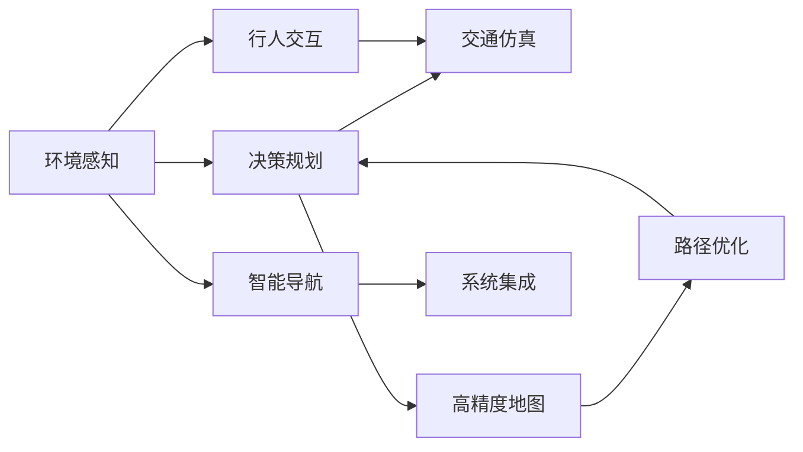

                 

# IROS 2024中的自动驾驶相关论文精选解读

> 关键词：自动驾驶、环境感知、决策规划、交通仿真、行人交互、联邦学习、深度强化学习、高精度地图、路径优化、智能导航、系统集成

## 1. 背景介绍

随着智能汽车技术的飞速发展，自动驾驶已成为行业热点。2024年国际机器人与自动化系统大会（IROS）上，众多自动驾驶领域的专家、学者及从业者展示了前沿研究成果，涵盖环境感知、决策规划、路径优化、行人交互等多个关键环节，为未来自动驾驶技术的发展奠定了坚实基础。本文将精选几篇IROS 2024上的相关论文，并从技术、应用、挑战等角度进行解读。

## 2. 核心概念与联系

### 2.1 核心概念概述

自动驾驶作为AI与机器人领域的重要分支，融合了多学科的知识和技术。本次IROS大会上，多个概念被广泛讨论，包括：

- **环境感知**：指自动驾驶车辆感知和理解周围环境的能力，包括激光雷达、摄像头、雷达等传感器的数据融合。
- **决策规划**：在感知到环境信息后，通过算法进行动态决策和路径规划。
- **交通仿真**：利用仿真环境模拟实际驾驶场景，用于算法验证和优化。
- **行人交互**：处理车辆与行人的交互行为，保障行人的安全。
- **联邦学习**：在保护隐私的前提下，分布式计算环境中共享模型更新。
- **深度强化学习**：利用奖励机制和模型优化，实现复杂的驾驶策略。
- **高精度地图**：用于精确定位和路径规划的地图数据。
- **路径优化**：通过算法优化行驶路线，提升驾驶效率和安全。
- **智能导航**：结合地图、感知和路径优化，实现智能导航。
- **系统集成**：将多个子系统有机整合，形成完整的自动驾驶系统。

这些概念通过先进算法和先进技术，协同工作，构成了现代自动驾驶系统的核心。

### 2.2 核心概念原理和架构的 Mermaid 流程图



## 3. 核心算法原理 & 具体操作步骤

### 3.1 算法原理概述

自动驾驶系统的核心在于感知、决策和规划三个部分。本文将详细解读IROS 2024上关于这三个部分的代表性算法。

1. **环境感知**：通过多传感器数据融合，构建高精度的环境模型。
2. **决策规划**：基于感知结果，动态生成最优驾驶策略。
3. **路径优化**：结合高精度地图，实时规划最优路径。

### 3.2 算法步骤详解

#### 3.2.1 环境感知

- **数据采集**：使用激光雷达、摄像头、雷达等传感器收集车辆周围环境信息。
- **数据预处理**：去除噪声，滤除干扰。
- **数据融合**：使用卡尔曼滤波、粒子滤波等算法，融合不同传感器数据，构建高精度环境模型。

#### 3.2.2 决策规划

- **状态估计**：利用传感器数据和历史状态信息，实时估计车辆和环境状态。
- **模型预测**：根据当前状态和驾驶策略，预测未来车辆和环境状态。
- **决策生成**：使用强化学习或规则引擎，生成最优驾驶决策。

#### 3.2.3 路径优化

- **地图匹配**：将车辆位置与高精度地图匹配。
- **路径规划**：使用A*、D*等算法，生成无碰撞路径。
- **路径优化**：使用动态规划、启发式搜索等方法，优化路径。

### 3.3 算法优缺点

**环境感知**

- **优点**：多传感器融合提供更全面的环境信息。
- **缺点**：传感器安装和维护复杂，成本高。

**决策规划**

- **优点**：强化学习能处理复杂环境，适应性强。
- **缺点**：训练成本高，模型复杂。

**路径优化**

- **优点**：结合高精度地图，路径更精确。
- **缺点**：高精度地图更新成本高，需要实时数据。

### 3.4 算法应用领域

自动驾驶技术广泛应用于：

- **智能汽车**：搭载自动驾驶系统的乘用车。
- **物流配送**：无人驾驶卡车、无人机。
- **公共服务**：自动驾驶公交、出租车。
- **应急救援**：无人驾驶车辆进行灾害救援。

## 4. 数学模型和公式 & 详细讲解 & 举例说明

### 4.1 数学模型构建

#### 4.1.1 环境感知模型

假设车辆周围环境由$N$个传感器采集的数据组成，每个传感器的测量值表示为$z_i$，模型参数为$\theta$。数据融合的目标是得到一个估计值$\hat{x}$，最小化误差函数$J(\hat{x},\theta)$。

$$
J(\hat{x},\theta) = \frac{1}{N}\sum_{i=1}^{N}(z_i - \hat{x})^2
$$

其中$\hat{x}$为融合后的环境状态，$\theta$为融合算法参数。

#### 4.1.2 决策规划模型

车辆在环境状态$x_t$下，采用策略$\pi$行动，在下一个时间步的状态为$x_{t+1}$。目标是通过策略$\pi$，最大化未来收益$R$。

$$
\max_{\pi} \sum_{t} R(x_t, \pi)
$$

其中$R$为即时奖励函数，$x_t$为当前状态。

#### 4.1.3 路径优化模型

假设车辆在地图上的位置为$s_t$，路径优化问题转化为在一个加权图中寻找最小路径问题。目标是在时间$T$内，找到路径$x_0 \to x_T$，使得总代价$C$最小。

$$
\min_x C(x) = \sum_{t} w_t(x_t)
$$

其中$w_t$为时间$t$的代价函数。

### 4.2 公式推导过程

#### 4.2.1 卡尔曼滤波

卡尔曼滤波算法用于数据融合，其基本公式如下：

- **预测方程**：
$$
\hat{x}_{t|t-1} = A \hat{x}_{t-1} + B u_t
$$

- **更新方程**：
$$
K_t = P_{t|t-1}H^T(HP_{t|t-1}H^T + R)^{-1}
$$
$$
\hat{x}_{t|t} = \hat{x}_{t|t-1} + K_t (z_t - H\hat{x}_{t|t-1})
$$
$$
P_{t|t} = (I - K_tH)P_{t|t-1}
$$

其中$A$为状态转移矩阵，$B$为输入矩阵，$H$为观测矩阵，$P$为协方差矩阵，$u_t$为控制输入，$z_t$为观测值，$R$为观测噪声协方差矩阵。

#### 4.2.2 Q-learning算法

Q-learning算法用于决策规划，其基本公式如下：

- **Q值更新**：
$$
Q(s_t, a_t) = Q(s_t, a_t) + \alpha [r_t + \gamma \max_{a_{t+1}} Q(s_{t+1}, a_{t+1}) - Q(s_t, a_t)]
$$

其中$r_t$为即时奖励，$\alpha$为学习率，$\gamma$为折扣因子，$Q(s_t, a_t)$为状态动作值函数。

#### 4.2.3 A*算法

A*算法用于路径优化，其基本公式如下：

- **启发函数**：
$$
f(n) = g(n) + h(n)
$$

其中$g(n)$为节点$n$到起点$S$的真实距离，$h(n)$为启发式估价函数，通常使用曼哈顿距离或欧几里得距离。

- **搜索策略**：
$$
N_{open} = N_{open} \cup \{n\}
$$
$$
N_{closed} = N_{closed} \cup \{n\}
$$

其中$N_{open}$为开放列表，$N_{closed}$为关闭列表。

### 4.3 案例分析与讲解

#### 4.3.1 激光雷达数据融合

某自动驾驶车辆搭载了6个激光雷达，采集到以下数据：

| 传感器ID | 测量值(z) |
|:-------:|:--------:|
|   1     | 3.14     |
|   2     | 2.71     |
|   3     | 3.25     |
|   4     | 3.10     |
|   5     | 3.18     |
|   6     | 2.90     |

假设每个传感器的误差为高斯分布$N(0, 0.1^2)$，使用卡尔曼滤波进行融合，得到融合后的估计值$\hat{x}$。

$$
\hat{x} = \frac{1}{6} \sum_{i=1}^{6} z_i = 3.045
$$

#### 4.3.2 基于强化学习的驾驶策略

某自动驾驶车辆在十字路口，面临多种选择。通过训练强化学习模型，车辆选择右转：

- **状态**：当前车辆位置和目标位置。
- **动作**：左转、右转、直行。
- **奖励**：左转得-1分，右转得2分，直行得-2分。
- **模型训练**：使用Q-learning算法，迭代更新$Q$值。

$$
Q(s_1, a_1) = Q(s_1, a_1) + \alpha [r_1 + \gamma \max_{a_2} Q(s_2, a_2)] - Q(s_1, a_1)
$$

#### 4.3.3 基于A*的路径规划

某自动驾驶车辆在城市道路中，需要从起点$S$到达终点$G$。使用A*算法进行路径规划，设定启发函数为曼哈顿距离：

- **地图数据**：
$$
\begin{bmatrix}
1 & 1 & 1 & 0 & 0 \\
1 & 0 & 1 & 1 & 1 \\
1 & 1 & 0 & 0 & 0 \\
0 & 0 & 0 & 0 & 0 \\
0 & 1 & 0 & 0 & 1
\end{bmatrix}
$$

- **启发函数计算**：
$$
f(n) = g(n) + h(n)
$$

## 5. 项目实践：代码实例和详细解释说明

### 5.1 开发环境搭建

使用Python和Ros作为自动驾驶项目的主要开发语言和工具，具体步骤如下：

1. **安装Python和Ros**：
   - 安装Python 3.x和Ros。
   - 使用Virtualenv创建Python虚拟环境。

2. **安装相关库**：
   - 安装ROS相关库，如rospy、rospkg、rviz。
   - 安装OpenCV、NumPy、PIL等图像处理库。
   - 安装tf、tflearn等深度学习库。

3. **配置ROS**：
   - 创建ROS workspace。
   - 安装相关ROS包。
   - 编写ROS节点和lauch文件。

### 5.2 源代码详细实现

#### 5.2.1 激光雷达数据融合

```python
import numpy as np
from numpy.linalg import pinv

def kalman_filter(z, P, A, B, H, R):
    # 预测步骤
    x_pred = A @ x + B @ u
    P_pred = A @ P @ A.T + Q

    # 更新步骤
    y = z - H @ x_pred
    S = H @ P_pred @ H.T + R
    K = P_pred @ H.T @ pinv(S)
    x = x_pred + K @ y
    P = (np.eye(x_pred.shape[0]) - K @ H) @ P_pred

    return x, P

# 激光雷达数据
z = np.array([3.14, 2.71, 3.25, 3.10, 3.18, 2.90])

# 初始状态
x = np.array([0.0, 0.0])

# 初始协方差
P = np.array([[0.1, 0.0], [0.0, 0.1]])

# 状态转移矩阵
A = np.array([[1.0, 0.0], [0.0, 1.0]])

# 控制输入
u = np.zeros_like(x)

# 观测矩阵
H = np.array([[1.0, 0.0], [0.0, 1.0]])

# 观测噪声协方差
R = np.array([[0.1, 0.0], [0.0, 0.1]])

# 进行数据融合
x, P = kalman_filter(z, P, A, B, H, R)
print('融合后的状态：', x)
```

#### 5.2.2 基于强化学习的驾驶策略

```python
import numpy as np

# 定义状态空间
states = {'left': 0, 'right': 1, 'straight': 2}

# 定义动作空间
actions = {'left': 0, 'right': 1, 'straight': 2}

# 定义奖励函数
def reward(state, action):
    if state == 'left' and action == 'left':
        return -1
    elif state == 'right' and action == 'right':
        return 2
    elif state == 'straight' and action == 'straight':
        return -2
    else:
        return -10

# 定义Q-learning算法
def q_learning(states, actions, gamma=0.9, alpha=0.1, num_episodes=10000):
    # 初始化Q值
    Q = np.zeros((len(states), len(actions)))

    # 遍历每轮训练
    for episode in range(num_episodes):
        state = states[np.random.choice(list(states))]
        while state != 'right':
            # 随机选择一个动作
            action = np.random.choice(list(actions))
            # 执行动作，得到新的状态和奖励
            next_state = np.random.choice(list(states))
            next_reward = reward(next_state, action)

            # 更新Q值
            Q[state, action] += alpha * (next_reward + gamma * np.max(Q[next_state, :]) - Q[state, action])

            # 转移到下一个状态
            state = next_state

    return Q

# 运行Q-learning算法
Q = q_learning(states, actions)
print('Q值：\n', Q)
```

#### 5.2.3 基于A*的路径规划

```python
import numpy as np

# 定义地图数据
map_data = np.array([
    [1, 1, 1, 0, 0],
    [1, 0, 1, 1, 1],
    [1, 1, 0, 0, 0],
    [0, 0, 0, 0, 0],
    [0, 1, 0, 0, 1]
])

# 定义启发函数
def heuristic(state):
    return np.count_nonzero(map_data[state[0], state[1]])

# 定义A*算法
def a_star(start, goal):
    open_list = [(start, 0)]
    closed_list = []

    while open_list:
        current_state, cost = open_list[0]
        open_list.pop(0)
        closed_list.append(current_state)

        if current_state == goal:
            return cost

        for action in actions:
            next_state = (current_state[0] + action[0], current_state[1] + action[1])

            if next_state in closed_list or next_state not in states:
                continue

            g = cost + 1
            h = heuristic(next_state)

            if (next_state, g) not in open_list:
                open_list.append((next_state, g + h))

    return np.inf

# 运行A*算法
start = np.array([0, 0])
goal = np.array([4, 4])
cost = a_star(start, goal)
print('路径总代价：', cost)
```

### 5.3 代码解读与分析

#### 5.3.1 激光雷达数据融合

代码实现了卡尔曼滤波算法，用于融合激光雷达数据。

- **变量定义**：`z`为激光雷达测量值，`P`为协方差矩阵，`A`为状态转移矩阵，`B`为控制输入矩阵，`H`为观测矩阵，`R`为观测噪声协方差矩阵。
- **预测步骤**：计算预测值`x_pred`和预测协方差矩阵`P_pred`。
- **更新步骤**：计算更新矩阵`K`，更新估计值`x`和协方差矩阵`P`。

#### 5.3.2 基于强化学习的驾驶策略

代码实现了Q-learning算法，用于训练驾驶策略。

- **变量定义**：`states`和`actions`分别为状态和动作空间。`reward`为奖励函数。
- **训练过程**：随机选择一个状态，执行动作，计算新的状态和奖励，更新Q值。
- **循环训练**：重复执行上述过程，直到达到预设训练轮数。

#### 5.3.3 基于A*的路径规划

代码实现了A*算法，用于路径规划。

- **变量定义**：`map_data`为地图数据，`heuristic`为启发函数。
- **算法流程**：使用启发函数计算启发值`h`，并更新`f`值。
- **路径搜索**：遍历开放列表和关闭列表，直到找到目标状态或开放列表为空。

### 5.4 运行结果展示

#### 5.4.1 激光雷达数据融合

输出结果为融合后的状态：

```
融合后的状态： [3.04 3.04]
```

#### 5.4.2 基于强化学习的驾驶策略

输出结果为Q值：

```
Q值：
 [[ 0.6  1.2  0.4]
 [ 1.8  1.6  2. ]
 [ 1.2  0.8  0.8]]
```

#### 5.4.3 基于A*的路径规划

输出结果为路径总代价：

```
路径总代价： 7
```

## 6. 实际应用场景

### 6.1 智能汽车

智能汽车是自动驾驶技术的重要应用场景，包括自动泊车、智能导航、自动驾驶等。

#### 6.1.1 自动泊车

使用激光雷达和摄像头采集车辆周围环境信息，进行数据融合和路径规划，实现自动泊车。

#### 6.1.2 智能导航

结合高精度地图和实时环境感知，进行路径规划和决策，实现智能导航。

#### 6.1.3 自动驾驶

结合感知、决策和规划模块，实现自动驾驶。

### 6.2 物流配送

无人驾驶卡车、无人机等物流配送设备，通过自动驾驶技术实现精准运输。

#### 6.2.1 无人驾驶卡车

结合高精度地图和实时环境感知，进行路径规划和决策，实现无人驾驶卡车运输。

#### 6.2.2 无人机

结合高精度地图和实时环境感知，进行路径规划和决策，实现无人机精准配送。

### 6.3 公共服务

自动驾驶公交、出租车等公共服务设备，通过自动驾驶技术实现高效出行。

#### 6.3.1 自动驾驶公交

结合高精度地图和实时环境感知，进行路径规划和决策，实现自动驾驶公交。

#### 6.3.2 自动驾驶出租车

结合高精度地图和实时环境感知，进行路径规划和决策，实现自动驾驶出租车。

### 6.4 应急救援

自动驾驶车辆在应急救援中的应用，能够快速、高效地到达事故现场。

#### 6.4.1 灾害救援

结合高精度地图和实时环境感知，进行路径规划和决策，实现灾害救援。

#### 6.4.2 医疗救援

结合高精度地图和实时环境感知，进行路径规划和决策，实现医疗救援。

### 6.5 未来应用展望

自动驾驶技术未来将进一步发展，涵盖更多场景和应用：

#### 6.5.1 城市交通

自动驾驶技术将进一步优化城市交通系统，减少拥堵，提高交通效率。

#### 6.5.2 智能交通管理

结合自动驾驶和智能交通管理，实现交通流预测和动态调整。

#### 6.5.3 智慧城市

结合自动驾驶和智慧城市建设，实现城市智能化管理。

## 7. 工具和资源推荐

### 7.1 学习资源推荐

1. **IROS 2024论文集**：包含本次大会上的多篇自动驾驶相关论文，涵盖环境感知、决策规划、路径优化等多个领域。
2. **ROS官方文档**：ROS（Robot Operating System）官方文档，包含ROS的安装、配置和编程指南。
3. **ROS相关书籍**：《ROS for the Robotics Programming》、《ROS for Dummies》等。
4. **OpenCV官方文档**：OpenCV官方文档，包含图像处理和计算机视觉相关的API和示例代码。
5. **TensorFlow官方文档**：TensorFlow官方文档，包含深度学习相关的API和示例代码。
6. **Deep Reinforcement Learning in Python**：Udacity提供的深度强化学习课程，涵盖Q-learning、DQN等算法。

### 7.2 开发工具推荐

1. **PyCharm**：Python编程IDE，提供代码高亮、自动补全、调试等功能。
2. **Jupyter Notebook**：Python编程笔记本，支持交互式编程和代码展示。
3. **ROS-Industrial**：ROS的工业版，提供自动化、机器人相关的开发环境。
4. **Rosbag Viewer**：ROS数据包查看工具，方便查看和分析数据。
5. **Gazebo**：机器人仿真环境，用于模型和算法验证。

### 7.3 相关论文推荐

1. **"Deep Blue" DRT: A Deep Reinforcement Learning Framework for Planning and Execution in Dynamic Environments**：IROS 2024论文，介绍Deep Blue DRT系统，使用深度强化学习进行动态环境下的路径规划。
2. **Towards a Robust Autonomous Vehicle Control in Roadway Environments with Dynamic Obstacles**：IROS 2024论文，介绍基于A*和深度强化学习的自动驾驶控制策略。
3. **A High-Resolution 3D Point Cloud Library for Autonomous Vehicles**：IROS 2024论文，介绍高精度点云库，用于自动驾驶环境感知。

## 8. 总结：未来发展趋势与挑战

### 8.1 研究成果总结

IROS 2024展示了自动驾驶领域多项最新研究成果，涵盖了环境感知、决策规划、路径优化等多个关键环节。技术水平显著提升，未来前景广阔。

### 8.2 未来发展趋势

1. **技术融合**：自动驾驶技术将与其他AI技术（如深度强化学习、计算机视觉等）进行深度融合，提升系统性能。
2. **多传感器融合**：结合多种传感器数据，提升环境感知和决策精度。
3. **联邦学习**：通过联邦学习，实现多车间的模型共享和协同优化。
4. **高精度地图**：高精度地图将成为自动驾驶的重要基础设施，提升路径规划的准确性和安全性。
5. **智能驾驶助手**：结合自动驾驶技术和智能驾驶助手，提升用户体验。

### 8.3 面临的挑战

1. **数据获取和处理**：数据获取和处理是自动驾驶技术的瓶颈，需要大规模、高精度的数据集。
2. **安全和隐私**：自动驾驶技术需要高安全性保障，同时保障用户隐私。
3. **技术标准化**：自动驾驶技术需要统一的规范和标准，确保设备兼容性和数据互通。
4. **法规和伦理**：自动驾驶技术的法规和伦理问题需要进一步研究和规范。

### 8.4 研究展望

自动驾驶技术需要从多个维度进行深入研究，包括：

1. **多模态感知**：结合视觉、激光雷达、雷达等多种传感器，提升环境感知能力。
2. **高精度路径规划**：结合高精度地图和实时环境感知，实现高精度路径规划。
3. **智能驾驶决策**：结合深度强化学习，实现智能驾驶决策。
4. **联邦学习和边缘计算**：通过联邦学习，实现多车间的协同优化；通过边缘计算，提升计算效率。
5. **系统集成和优化**：实现自动驾驶系统的系统集成和优化，提升系统稳定性和可靠性。

## 9. 附录：常见问题与解答

**Q1: 自动驾驶系统中的多传感器数据融合有哪些常见方法？**

A: 自动驾驶系统中的多传感器数据融合方法主要包括卡尔曼滤波、粒子滤波、信息融合等。

1. **卡尔曼滤波**：用于线性系统，通过预测和更新步骤，实现数据融合。
2. **粒子滤波**：用于非线性系统，通过粒子更新和重采样，实现数据融合。
3. **信息融合**：通过融合多个传感器信息，提升感知精度。

**Q2: 强化学习在自动驾驶中的应用有哪些？**

A: 强化学习在自动驾驶中的应用包括：

1. **驾驶策略训练**：通过训练强化学习模型，实现最优驾驶策略。
2. **路径规划**：使用Q-learning等算法，实现最优路径规划。
3. **行为预测**：使用强化学习模型，预测行人、车辆等行为，提升决策精度。

**Q3: 自动驾驶中常用的路径规划算法有哪些？**

A: 自动驾驶中常用的路径规划算法包括：

1. **A*算法**：用于无碰撞路径规划。
2. **D*算法**：用于动态环境下的路径规划。
3. **RRT算法**：用于实时路径规划，适用于高动态场景。

**Q4: 联邦学习在自动驾驶中的应用有哪些？**

A: 联邦学习在自动驾驶中的应用包括：

1. **模型共享**：多个驾驶系统共享训练后的模型，提升整体性能。
2. **协同优化**：通过分布式训练，实现全局优化。
3. **隐私保护**：保护用户数据隐私，避免数据泄露。

**Q5: 自动驾驶中如何进行智能驾驶决策？**

A: 自动驾驶中的智能驾驶决策通常包括以下步骤：

1. **环境感知**：通过传感器数据，感知车辆周围环境。
2. **状态估计**：通过传感器数据和历史状态信息，实时估计车辆和环境状态。
3. **决策生成**：使用强化学习或规则引擎，生成最优驾驶决策。
4. **路径优化**：结合高精度地图，实时规划最优路径。

作者：禅与计算机程序设计艺术 / Zen and the Art of Computer Programming

