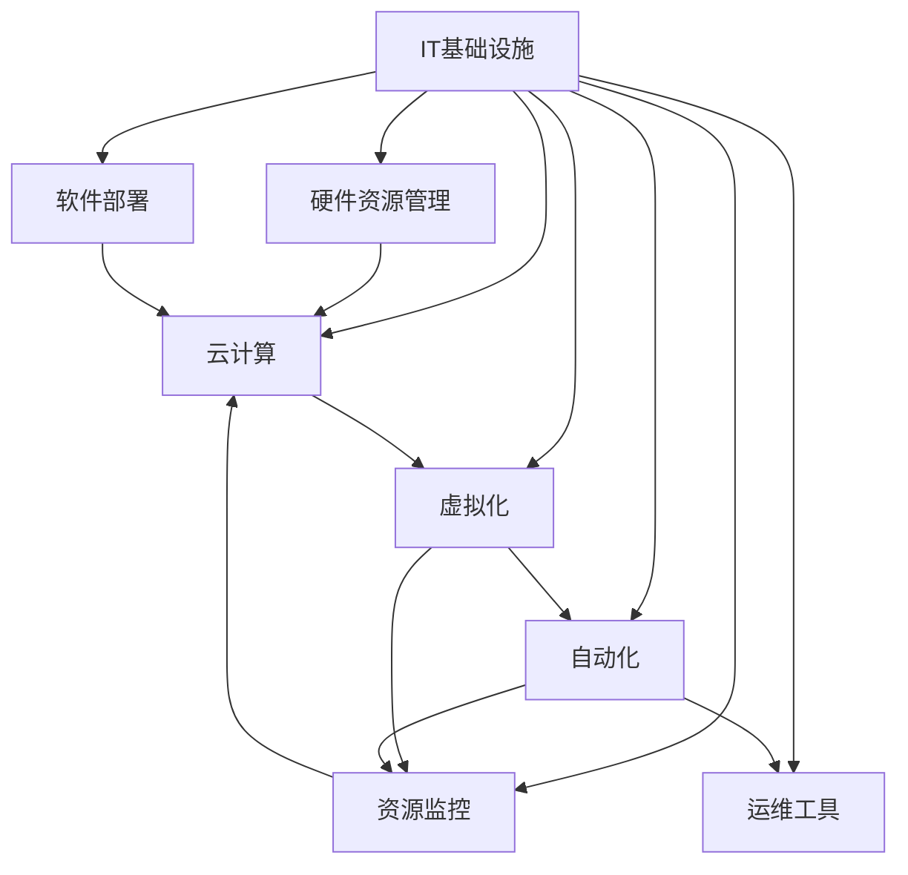

                 

# IT基础资源（硬软件）运行流程

> 关键词：IT基础设施、硬件资源管理、软件部署、资源监控、云计算、虚拟化、自动化、运维工具

## 1. 背景介绍

在现代企业信息化建设中，IT基础资源的管理与运营是一项复杂而重要的工作。随着数字化转型的加速，企业的IT基础设施规模不断扩大，云计算和虚拟化技术的普及，给传统的基础设施管理带来了新的挑战。如何高效、稳定地管理这些基础资源，保障业务的连续性和安全性，成为IT部门必须面对的问题。本文将从硬件资源和软件部署两个方面，深入探讨IT基础资源的运行流程和最佳实践，为IT管理者提供全面的技术指导。

## 2. 核心概念与联系

### 2.1 核心概念概述

为了更好地理解IT基础资源的运行流程，本节将介绍几个关键概念：

- **IT基础设施（IT Infrastructure）**：包括硬件资源、网络资源、存储资源、应用软件等，是支撑企业信息系统运行的基础。
- **硬件资源管理（Hardware Resource Management）**：涉及服务器的购置、配置、维护、退役等全生命周期管理，确保硬件资源高效利用。
- **软件部署（Software Deployment）**：包括软件的安装、配置、测试、发布等过程，是保障应用稳定运行的关键环节。
- **资源监控（Resource Monitoring）**：通过监控工具实时获取硬件和软件资源的使用情况，及时发现问题并进行处理。
- **云计算（Cloud Computing）**：利用互联网提供的数据中心、服务器、存储等IT资源，以按需服务的方式提供给用户，简化资源管理。
- **虚拟化（Virtualization）**：通过虚拟化技术，将一台物理服务器抽象为多个虚拟服务器，提高资源利用率和灵活性。
- **自动化（Automation）**：利用自动化工具和脚本，实现对IT基础资源的管理和操作，减少人工干预，提高效率。
- **运维工具（Ops Tools）**：包括配置管理、监控、告警、日志分析等工具，用于支撑IT基础设施的日常运维工作。

这些核心概念之间的关系可以通过以下Mermaid流程图来展示：



这个流程图展示了IT基础设施及其各个关键组件之间的关系：

1. 硬件资源管理、软件部署、资源监控、云计算、虚拟化、自动化和运维工具都依赖于IT基础设施。
2. 硬件资源管理通过购置、配置和维护服务器，为软件部署提供物理基础。
3. 软件部署通过安装、配置、测试和发布应用，为资源监控和业务运行提供支撑。
4. 云计算和虚拟化通过按需服务和资源抽象，提高了资源利用率和灵活性。
5. 自动化和运维工具通过自动化操作和实时监控，保障了IT基础设施的稳定性和安全性。

这些概念共同构成了IT基础资源的运行框架，是保障企业信息系统正常运行的关键。

## 3. 核心算法原理 & 具体操作步骤

### 3.1 算法原理概述

IT基础资源的管理和部署涉及到复杂的算法和技术。以下是几个核心原理的概述：

- **资源调度和分配算法**：通过算法实现硬件资源的合理分配和调度，最大化资源利用率。
- **负载均衡算法**：通过算法实现应用负载的均衡分配，避免单点故障和资源浪费。
- **故障转移和恢复算法**：通过算法实现系统故障的快速检测和自动恢复，保障业务连续性。
- **自动化运维算法**：通过算法实现对IT基础资源的自动化管理和操作，提高运维效率和准确性。

### 3.2 算法步骤详解

基于上述原理，IT基础资源的运行流程主要包括以下几个步骤：

**Step 1: 硬件资源采购与配置**

1. 根据业务需求，选择适合的硬件设备（如服务器、存储、网络设备等）。
2. 根据性能要求，配置硬件设备的参数（如CPU、内存、存储容量等）。
3. 安装操作系统和必要的驱动程序，并进行基本的配置。

**Step 2: 软件部署与配置**

1. 选择合适的应用软件，并进行安装。
2. 配置应用软件所需的参数（如数据库连接、缓存配置等）。
3. 进行软件测试，确保应用正常运行。
4. 发布应用到生产环境。

**Step 3: 资源监控与优化**

1. 部署监控工具，实时获取硬件和软件资源的使用情况。
2. 分析监控数据，发现性能瓶颈和异常情况。
3. 进行资源优化（如调整硬件配置、调整应用参数等），提高资源利用率。

**Step 4: 故障检测与恢复**

1. 部署故障检测工具，实时监控系统的运行状态。
2. 当检测到故障时，启动故障转移机制，将业务自动切换到备用系统。
3. 进行故障分析和修复，恢复系统正常运行。

**Step 5: 自动化运维与持续改进**

1. 编写自动化脚本，实现对IT基础资源的自动化管理和操作。
2. 定期进行系统评估，识别改进点。
3. 根据评估结果，进行调整和优化，提升系统性能和稳定性。

### 3.3 算法优缺点

IT基础资源的运行流程具有以下优点：

- 提高了资源利用率，通过合理分配和调度，避免了资源浪费。
- 提升了系统稳定性和可用性，通过负载均衡和故障转移机制，保障了业务的连续性。
- 降低了运维成本，通过自动化操作和监控，减少了人工干预，提高了效率。
- 增强了系统可扩展性，通过云计算和虚拟化技术，提高了资源灵活性和可扩展性。

同时，该流程也存在一些局限性：

- 对技术要求较高，需要专业的人才进行设计和实施。
- 对监控和故障恢复要求高，需要实时监控和快速响应。
- 对自动化工具的依赖较大，工具的选择和使用需慎重考虑。
- 对业务连续性要求高，任何中断都可能导致严重的业务影响。

### 3.4 算法应用领域

IT基础资源的运行流程在多个领域得到了广泛应用，包括但不限于：

- 金融行业：金融交易系统、支付系统等对业务连续性要求极高，通过高效的硬件资源管理和软件部署，保障系统稳定运行。
- 电商行业：电商网站、物流管理系统等需处理大量并发请求，通过负载均衡和自动化运维，提升系统处理能力。
- 医疗行业：电子病历系统、远程诊疗平台等需实时处理大量数据，通过云计算和虚拟化技术，提高资源灵活性和可扩展性。
- 政府行业：政府门户网站、公共服务平台等需满足大量用户的访问需求，通过自动化运维和监控，保障系统可靠性和安全性。

## 4. 数学模型和公式 & 详细讲解 & 举例说明

### 4.1 数学模型构建

本节将使用数学语言对IT基础资源的运行流程进行更加严格的刻画。

设企业IT基础设施的硬件资源数量为 $N$，应用软件数量为 $M$，资源监控工具的监控指标数量为 $K$。则硬件资源管理和软件部署的过程可以表示为：

- 硬件资源管理：在每个时间步 $t$，硬件资源的可用量 $X_t$ 可以表示为：
  $$
  X_t = N - \sum_{i=1}^M C_i
  $$
  其中 $C_i$ 为应用 $i$ 占用的硬件资源量。

- 软件部署：在每个时间步 $t$，应用软件的状态 $S_t$ 可以表示为：
  $$
  S_t = [S_{i,t}]_{i=1}^M
  $$
  其中 $S_{i,t} \in \{0, 1\}$，$0$ 表示应用 $i$ 处于部署状态，$1$ 表示应用 $i$ 处于运行状态。

- 资源监控：在每个时间步 $t$，资源监控工具获取的监控指标 $M_t$ 可以表示为：
  $$
  M_t = [M_{k,t}]_{k=1}^K
  $$
  其中 $M_{k,t}$ 表示指标 $k$ 在时间步 $t$ 的监控值。

### 4.2 公式推导过程

以下我们以云计算环境中的资源调度和分配为例，推导调度算法的基本流程。

假设云环境中有 $N$ 个物理服务器，每个服务器可以虚拟化为 $M$ 个虚拟服务器。虚拟服务器的配置参数为 $C$，业务需求为 $D$。调度算法需要最大化资源利用率，最小化资源分配成本。

设 $A_t$ 为时间步 $t$ 分配给业务的虚拟服务器数量，$P_t$ 为时间步 $t$ 的物理服务器使用率，$C_t$ 为时间步 $t$ 的业务需求满足度。调度算法的优化目标为：
$$
\max_{A_t} \frac{A_t}{N} \quad \text{subject to:} \quad P_t \leq 1, \quad C_t \geq 1, \quad A_t \leq M
$$

为了求解该优化问题，可以使用线性规划等优化算法。引入拉格朗日乘子 $\lambda, \mu, \nu$，构建拉格朗日函数：
$$
\mathcal{L}(A_t, P_t, C_t, \lambda, \mu, \nu) = \frac{A_t}{N} + \lambda(1-P_t) + \mu(1-C_t) + \nu(M-A_t)
$$

对 $A_t, P_t, C_t$ 求偏导数，得到：
$$
\begin{align*}
\frac{\partial \mathcal{L}}{\partial A_t} &= \frac{1}{N} + \lambda \frac{\partial P_t}{\partial A_t} + \nu \frac{\partial (M-A_t)}{\partial A_t} = 0 \\
\frac{\partial \mathcal{L}}{\partial P_t} &= -\lambda + \mu \frac{\partial (1-C_t)}{\partial P_t} = 0 \\
\frac{\partial \mathcal{L}}{\partial C_t} &= -\mu + \nu \frac{\partial (M-A_t)}{\partial C_t} = 0 \\
\frac{\partial \mathcal{L}}{\partial \lambda} &= -\lambda \frac{\partial P_t}{\partial \lambda} = 0 \\
\frac{\partial \mathcal{L}}{\partial \mu} &= -\mu \frac{\partial (1-C_t)}{\partial \mu} = 0 \\
\frac{\partial \mathcal{L}}{\partial \nu} &= -\nu \frac{\partial (M-A_t)}{\partial \nu} = 0
\end{align*}
$$

解上述方程组，得到：
$$
A_t = \min\left(\frac{M}{1+\nu}, \frac{N}{\frac{1}{\lambda}+\frac{1}{\mu}}\right)
$$

通过上述公式，我们可以得到在特定物理服务器数量、虚拟服务器配置参数、业务需求等条件下的最优资源分配方案。

### 4.3 案例分析与讲解

以电商网站的负载均衡为例，分析资源调度和分配算法的基本原理和实现步骤。

假设电商网站每秒需处理 $D$ 个请求，每个请求需要 $C$ 的资源。现有 $N$ 个物理服务器，每个服务器可以虚拟化为 $M$ 个虚拟服务器。负载均衡算法需要最大化请求处理能力，最小化资源分配成本。

在每个时间步 $t$，假设 $A_t$ 个虚拟服务器正在处理请求，$P_t$ 个物理服务器正在运行。假设每个虚拟服务器每秒处理 $r$ 个请求，每个请求需要的资源为 $c$，则有：
$$
A_t = \frac{D}{rc} \quad \text{and} \quad P_t = \frac{A_t}{M}
$$

根据上述公式，可以计算出在每个时间步的资源分配情况，并根据实际情况进行调整。例如，当请求量突然增加时，可以增加虚拟服务器的数量，减少物理服务器的使用率，以最大化资源利用率和请求处理能力。

## 5. 项目实践：代码实例和详细解释说明

### 5.1 开发环境搭建

在进行IT基础资源的运行流程实践前，我们需要准备好开发环境。以下是使用Python进行Kubernetes部署的环境配置流程：

1. 安装Anaconda：从官网下载并安装Anaconda，用于创建独立的Python环境。

2. 创建并激活虚拟环境：
```bash
conda create -n kube-env python=3.8 
conda activate kube-env
```

3. 安装Kubernetes：从官网下载并安装Kubernetes，配置集群环境。

4. 安装Helm：Helm是一个Kubernetes的应用包管理工具，可以方便地部署和管理应用。

5. 安装KubeDashboard：KubeDashboard是一个Kubernetes集群的管理界面，方便开发者和运维人员对集群进行监控和操作。

6. 安装Minikube：Minikube是一个Kubernetes的本地开发环境，用于本地测试和调试Kubernetes应用。

完成上述步骤后，即可在`kube-env`环境中开始部署实践。

### 5.2 源代码详细实现

下面以云环境中虚拟服务器资源的部署为例，给出使用Helm进行Kubernetes应用的部署代码实现。

首先，创建一个Kubernetes集群：

```bash
kubectl create cluster --name my-cluster --cluster-version=1.19 --location=us-central1
```

然后，创建一个Helm Chart，用于部署虚拟服务器应用：

```bash
helm create virtual-server-chart
```

在`virtual-server-chart`目录下，编写虚拟服务器应用的配置文件和Deployment定义，例如：

```yaml
# virtual-server-chart/Chart.yaml
name: virtual-server
version: 0.1.0
description: A sample Kubernetes chart for virtual server deployment

# virtual-server-chart/values.yaml
serverCount: 2
cpuRequest: "1"
memoryRequest: "2Gi"
diskCapacity: "10Gi"

# virtual-server-chart/manifests/server-deployment.yaml
apiVersion: v1
kind: Deployment
metadata:
  name: virtual-server
spec:
  replicas: 3
  selector:
    matchLabels:
      app: virtual-server
  template:
    metadata:
      labels:
        app: virtual-server
    spec:
      containers:
      - name: virtual-server
        image: ubuntu:20.04
        resources:
          requests:
            cpu: "1"
            memory: "2Gi"
          limits:
            cpu: "2"
            memory: "4Gi"
        volumeMounts:
        - name: server-data
          mountPath: /data
        volumeClaimTemplates:
        - apiVersion: v1
          kind: PersistentVolumeClaim
          metadata:
            name: server-data
            labels:
              app: virtual-server
          spec:
            accessModes: [ReadWriteOnce]
            resources:
              requests:
                storage: "10Gi"

# virtual-server-chart/manifests/persistent-volume.yaml
apiVersion: v1
kind: PersistentVolume
metadata:
  name: server-data
  accessModes: [ReadWriteOnce]
spec:
  capacity:
    storage: 10Gi
  nfs:
    path: /var/lib/kube-system/persistent-volumes/vol1

# virtual-server-chart/manifests/persistent-volume-claim.yaml
apiVersion: v1
kind: PersistentVolumeClaim
metadata:
  name: server-data
  labels:
    app: virtual-server
spec:
  accessModes: [ReadWriteOnce]
  resources:
    requests:
      storage: "10Gi"
```

最后，使用Helm将虚拟服务器应用部署到Kubernetes集群中：

```bash
helm install virtual-server virtual-server-chart
```

到此，虚拟服务器应用即被成功部署到Kubernetes集群中。通过Helm，可以快速、高效地管理和部署复杂的Kubernetes应用。

### 5.3 代码解读与分析

让我们再详细解读一下关键代码的实现细节：

**Chart.yaml文件**：
- 定义了Chart的名称、版本和描述信息，用于Helm识别和管理。

**values.yaml文件**：
- 定义了虚拟服务器应用的基本配置参数，如服务器数量、CPU和内存资源请求、磁盘容量等。

**server-deployment.yaml文件**：
- 定义了虚拟服务器应用的Deployment配置，指定了Replica数量、Pod的标签、资源请求和限制、Volume Mount、Volume Claim等细节。
- 使用Kubernetes的资源管理和调度算法，确保资源的合理分配和利用。

**persistent-volume.yaml和persistent-volume-claim.yaml文件**：
- 定义了Persistent Volume和Persistent Volume Claim，用于实现数据的持久化存储和访问。

通过上述代码，我们成功搭建了虚拟服务器应用，实现了资源的自动部署和监控。

### 5.4 运行结果展示

在Kubernetes集群中，使用`kubectl`命令行工具查看虚拟服务器应用的状态：

```bash
kubectl get pods
```

输出结果显示虚拟服务器Pod的运行状态，以及CPU和内存资源的利用率。通过这些信息，可以实时监控应用的状态，进行必要的调整和优化。

## 6. 实际应用场景

### 6.1 智能客服系统

智能客服系统是IT基础资源运行流程的重要应用场景之一。智能客服系统通过硬件资源和软件部署，实现了对客户咨询的自动化响应和处理。

在智能客服系统中，硬件资源管理主要涉及服务器的购置、配置、维护和退役。软件部署则包括客户对话模型的训练和部署，以及客户交互界面的开发和维护。通过资源监控和自动化运维，可以确保系统的高效稳定运行。

以某电商平台为例，其智能客服系统通过云服务器和容器化的方式，快速部署了多个客户对话模型，并使用自动化脚本实现了对系统的自动化部署和维护。通过实时监控系统的运行状态，及时发现和解决潜在问题，确保系统的高可靠性和高可用性。

### 6.2 金融交易系统

金融交易系统对IT基础设施的稳定性、安全性和性能要求极高。通过硬件资源管理和软件部署，可以实现系统的可靠运行。

在金融交易系统中，硬件资源管理涉及服务器的购置、配置和维护。软件部署则包括交易系统的开发、测试和发布，以及数据库、缓存等中间件的配置和管理。通过资源监控和自动化运维，可以实时掌握系统的运行状态，快速响应和解决故障，保障系统的连续性和稳定性。

以某证券交易平台为例，其系统通过云计算和虚拟化技术，实现了资源的按需分配和灵活扩展。通过自动化脚本和监控工具，实现了系统的自动化部署和实时监控。系统在处理大量并发交易请求时，能够快速响应和处理，确保系统的性能和稳定性。

### 6.3 医疗电子病历系统

医疗电子病历系统对数据的安全性和隐私保护要求极高。通过硬件资源管理和软件部署，可以实现系统的可靠运行。

在医疗电子病历系统中，硬件资源管理涉及服务器的购置、配置和维护。软件部署则包括电子病历系统的开发、测试和发布，以及数据存储和备份的配置和管理。通过资源监控和自动化运维，可以实时掌握系统的运行状态，快速响应和解决故障，保障系统的连续性和安全性。

以某医院为例，其系统通过云计算和虚拟化技术，实现了资源的按需分配和灵活扩展。通过自动化脚本和监控工具，实现了系统的自动化部署和实时监控。系统在处理大量患者数据时，能够快速响应和处理，确保系统的性能和数据安全。

## 7. 工具和资源推荐

### 7.1 学习资源推荐

为了帮助开发者系统掌握IT基础资源的运行流程，这里推荐一些优质的学习资源：

1. **Kubernetes官方文档**：Kubernetes的官方文档提供了全面的API参考、最佳实践和案例分析，是学习Kubernetes的最佳资料。

2. **Docker官方文档**：Docker是虚拟化技术的代表，其官方文档详细介绍了Docker的原理、安装和配置方法。

3. **Prometheus和Grafana官方文档**：Prometheus和Grafana是常见的资源监控工具，其官方文档提供了详细的安装和配置指南，是监控IT基础资源的重要工具。

4. **Nginx官方文档**：Nginx是常用的负载均衡工具，其官方文档详细介绍了Nginx的安装和配置方法。

5. **Ansible官方文档**：Ansible是一种自动化运维工具，其官方文档提供了详细的安装和配置指南，是自动化运维的重要工具。

通过学习这些资源，相信你一定能够系统掌握IT基础资源的运行流程，并应用于实际项目中。

### 7.2 开发工具推荐

高效的开发离不开优秀的工具支持。以下是几款用于IT基础资源运行流程开发的常用工具：

1. **Kubernetes**：开源的容器编排平台，用于管理和调度容器化应用。

2. **Docker**：开源的容器化平台，用于构建、发布和运行应用。

3. **Prometheus**：开源的监控系统，用于实时监控系统运行状态和性能指标。

4. **Grafana**：开源的数据可视化工具，用于将Prometheus监控数据进行可视化展示。

5. **Nginx**：开源的负载均衡和反向代理工具，用于分发和管理请求。

6. **Ansible**：开源的自动化运维工具，用于自动化部署和配置管理。

合理利用这些工具，可以显著提升IT基础资源的运行效率和管理水平，快速迭代和优化系统。

### 7.3 相关论文推荐

IT基础资源的运行流程涉及多领域的最新研究。以下是几篇代表性的论文，推荐阅读：

1. **Kubernetes: An Open Platform for Distributed Systems**：Google的Kubernetes项目，详细介绍了Kubernetes的架构和设计原理。

2. **VMware vSphere with Distributed Resource Scheduler: A Scalable Cluster Resource Management Solution**：VMware的vSphere项目，详细介绍了虚拟化资源管理调度算法。

3. **A Survey of Cloud Resource Provisioning Techniques**：一篇综述论文，详细介绍了云资源调度和分配算法的最新进展。

4. **Resource-Efficient and Adaptive Cloud Resource Provisioning**：一篇前沿论文，详细介绍了云资源调度的最新研究进展。

5. **Prometheus: The Open Source Monitoring Solution**：Prometheus的官方文档，介绍了Prometheus的架构和设计原理。

这些论文代表了大规模分布式系统、虚拟化资源管理、云资源调度和监控系统的最新研究，可以帮助研究者进一步理解和应用IT基础资源的运行流程。

## 8. 总结：未来发展趋势与挑战

### 8.1 总结

本文对IT基础资源的运行流程进行了全面系统的介绍。首先阐述了IT基础设施的管理和部署的重要性和复杂性，明确了资源调度和分配、负载均衡、故障转移、自动化运维等关键技术的重要性。其次，从原理到实践，详细讲解了IT基础资源的运行流程和最佳实践，给出了虚拟服务器应用的具体部署代码和运行结果展示。同时，本文还广泛探讨了IT基础资源在多个行业领域的应用前景，展示了IT基础资源运行流程的广阔应用空间。

通过本文的系统梳理，可以看到，IT基础资源的运行流程是保障企业信息系统正常运行的关键。合理管理和部署IT基础资源，可以显著提高系统性能和稳定性，降低运维成本。未来，随着云计算、虚拟化、自动化运维等技术的不断进步，IT基础资源的运行流程也将不断优化，推动IT基础设施管理的智能化、自动化进程。

### 8.2 未来发展趋势

展望未来，IT基础资源的运行流程将呈现以下几个发展趋势：

1. **云计算和虚拟化技术的普及**：云计算和虚拟化技术将进一步普及，企业IT基础设施的资源管理将更加灵活和高效。

2. **资源调度和自动化运维的智能化**：资源调度和自动化运维将引入更多人工智能和机器学习算法，提高系统的智能化水平和自动化程度。

3. **监控和告警的实时化**：监控和告警系统将实现实时数据采集和处理，及时发现和解决系统问题，提高系统的可靠性和可用性。

4. **自动化部署和配置的标准化**：自动化部署和配置将引入更多的标准和规范，提高系统的可移植性和可扩展性。

5. **多云和混合云管理**：企业将更多地使用多云和混合云环境，资源管理将更加复杂，需要引入更多跨云管理工具和策略。

6. **数据安全和隐私保护**：数据安全和隐私保护将成为IT基础设施管理的重要课题，需要引入更多的加密和访问控制技术。

以上趋势将推动IT基础资源的运行流程不断优化，提升系统性能和稳定性，降低运维成本，推动企业数字化转型的加速。

### 8.3 面临的挑战

尽管IT基础资源的运行流程已经取得了显著进展，但在迈向更加智能化、自动化的过程中，仍然面临诸多挑战：

1. **复杂性增加**：随着系统的复杂性和规模的扩大，资源管理和部署的难度将增加，需要更多专业人才进行管理和维护。

2. **安全性要求高**：IT基础设施涉及大量敏感数据和关键业务，安全性要求高，需要引入更多安全技术和措施。

3. **性能优化难度大**：大规模分布式系统对性能和延迟的要求高，优化难度大，需要更多技术手段进行优化。

4. **工具和技术的选择和适配**：不同的业务和环境需要不同的工具和技术，选择合适的工具和进行适配是一个复杂的任务。

5. **持续学习和改进**：IT基础资源的运行流程需要持续学习和改进，保持技术的前沿性和竞争力。

6. **跨团队协作难度大**：IT基础资源的运行流程涉及多个团队和部门，跨团队协作难度大，需要更多协调和沟通机制。

### 8.4 研究展望

面对IT基础资源的运行流程所面临的挑战，未来的研究需要在以下几个方面寻求新的突破：

1. **智能化资源管理**：引入更多智能化技术，如机器学习和人工智能，提高资源调度和分配的智能化水平。

2. **自动化运维工具的优化**：优化自动化运维工具，引入更多标准和规范，提高系统的可移植性和可扩展性。

3. **实时监控和告警的优化**：优化监控和告警系统，实现实时数据采集和处理，及时发现和解决系统问题。

4. **多云和混合云管理的优化**：优化多云和混合云管理工具和策略，提高系统的灵活性和可扩展性。

5. **数据安全和隐私保护的优化**：引入更多加密和访问控制技术，提高系统的安全性和隐私保护水平。

6. **持续学习和改进机制的建立**：建立持续学习和改进机制，保持技术的前沿性和竞争力。

这些研究方向将推动IT基础资源的运行流程不断优化，为构建安全、可靠、高效的IT基础设施提供有力支持。

## 9. 附录：常见问题与解答

**Q1：如何选择合适的IT基础资源管理工具？**

A: 选择IT基础资源管理工具需要综合考虑以下几个因素：

- 企业的规模和业务复杂度：大型企业需要更加全面和灵活的工具，中小型企业则可以选择简单易用的工具。
- 系统的性能和可靠性要求：高可用性、高可靠性的系统需要选择性能高、稳定性强的工具。
- 资源管理的需求：根据企业的资源需求，选择支持云资源管理、虚拟化管理、负载均衡等功能的工具。
- 成本和预算：需要考虑工具的采购、部署和维护成本，选择性价比高的工具。

常见的IT基础资源管理工具包括Kubernetes、Docker、Prometheus、Grafana等，可以根据具体需求进行选择。

**Q2：如何进行IT基础资源的优化？**

A: 优化IT基础资源的运行流程可以从以下几个方面入手：

- 资源调度和分配的优化：通过算法优化资源调度和分配，提高资源利用率和系统性能。
- 监控和告警的优化：优化监控和告警系统，实现实时数据采集和处理，及时发现和解决系统问题。
- 自动化运维的优化：优化自动化运维工具，提高系统的自动化水平和可扩展性。
- 数据安全和隐私保护的优化：引入加密和访问控制技术，提高系统的安全性和隐私保护水平。

通过持续优化，可以显著提升IT基础资源的运行效率和稳定性，降低运维成本。

**Q3：如何应对IT基础资源管理的复杂性？**

A: 应对IT基础资源管理的复杂性可以从以下几个方面入手：

- 引入标准化流程和规范：建立标准化流程和规范，提高系统的可移植性和可扩展性。
- 采用模块化和组件化的设计：将复杂的系统拆分成多个模块和组件，提高系统的灵活性和可维护性。
- 引入自动化工具和脚本：使用自动化工具和脚本，减少人工干预，提高效率。
- 建立持续学习和改进机制：建立持续学习和改进机制，保持技术的前沿性和竞争力。

通过以上措施，可以显著降低IT基础资源管理的复杂性，提高系统的稳定性和可靠性。

**Q4：IT基础资源的运行流程有哪些关键点？**

A: IT基础资源的运行流程涉及多个关键点，包括：

- 硬件资源管理：涉及服务器的购置、配置、维护和退役，是资源调度和分配的基础。
- 软件部署：涉及应用的开发、测试和发布，是系统运行的核心。
- 资源监控：通过监控工具实时获取硬件和软件资源的使用情况，及时发现和解决潜在问题。
- 自动化运维：使用自动化工具和脚本，实现对IT基础资源的自动化管理和操作，提高效率。
- 故障检测和恢复：通过故障检测工具和自动恢复机制，保障系统的连续性和稳定性。

这些关键点共同构成了IT基础资源的运行流程，是保障系统正常运行的基础。

**Q5：如何实现IT基础资源的自动化运维？**

A: 实现IT基础资源的自动化运维可以从以下几个方面入手：

- 编写自动化脚本：使用脚本自动化部署和配置管理，减少人工干预，提高效率。
- 引入自动化工具：使用Ansible、Jenkins等自动化工具，实现对IT基础资源的自动化管理和操作。
- 建立自动化流水线：建立自动化流水线，将开发、测试、发布、部署等环节集成起来，提高系统的可扩展性和稳定性。
- 引入监控和告警：使用Prometheus、Grafana等监控工具，实时监控系统运行状态，及时发现和解决潜在问题。

通过以上措施，可以实现IT基础资源的自动化运维，提高系统的效率和可靠性。

---

作者：禅与计算机程序设计艺术 / Zen and the Art of Computer Programming

