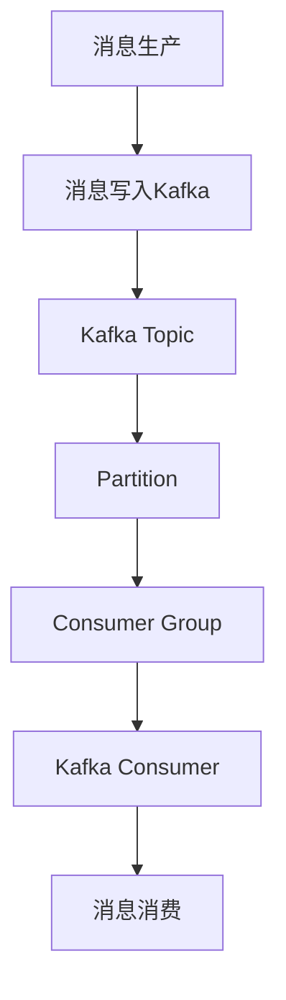

                 

# Kafka Consumer原理与代码实例讲解

> 关键词：Kafka, Consumer, Apache Kafka, Kafka API, 消费, 消息队列, 异步编程, 高性能, 消息订阅, 数据处理

## 1. 背景介绍

### 1.1 问题由来

随着大数据时代的到来，数据的实时处理和流式计算需求日益增长。数据产生速度极快，单一的数据管道难以满足高并发、高吞吐的需求。消息队列系统作为一种高效、可靠的数据传输方式，能够有效缓冲数据流，降低数据处理系统的压力，提供稳定、可靠的数据服务。

Apache Kafka 作为当前最流行的消息队列系统之一，凭借其高性能、高可靠性和易扩展性，被广泛应用于金融、电商、物流等众多行业。Kafka 的核心思想是将数据流分为生产者和消费者，由生产者负责将数据写入队列，消费者负责从队列中读取数据，并进行处理。

Kafka Consumer 是 Kafka 的客户端，主要负责从 Kafka 集群中消费数据，并将其处理、存储或转发到下游系统。Kafka Consumer 的设计非常灵活，支持多种消息处理方式，能够应对海量数据的实时处理需求，适用于各种场景下的数据集成、实时计算和流式处理。

本文将系统讲解 Kafka Consumer 的原理与代码实例，帮助读者理解其核心概念和使用方法，通过实例深入探讨 Kafka Consumer 的配置、使用和优化技巧。

## 2. 核心概念与联系

### 2.1 核心概念概述

为了更好地理解 Kafka Consumer，首先需要介绍一些相关的核心概念：

- **Apache Kafka**：开源的消息队列系统，用于构建高吞吐、高可靠的数据流平台。
- **Kafka Producer**：Kafka 生产者，负责将数据写入 Kafka 集群。
- **Kafka Consumer**：Kafka 消费者，负责从 Kafka 集群中读取数据。
- **Kafka Topic**：Kafka 主题，代表一个数据通道，每个主题包含一组分区，数据以分区为单位进行存储和处理。
- **Partition**：Kafka 分区，每个分区是一个有序的数据流，分区可以水平扩展，提高数据处理的性能和可用性。
- **Offset**：Kafka 偏移量，表示数据在分区中的位置，用于记录数据消费的状态。
- **Consumer Group**：Kafka 消费者组，一组消费者共同消费同一个主题的一个分区。

以上概念构成了 Kafka 系统的基本架构，其中 Kafka Consumer 作为数据流的最终接收者，对数据进行消费、处理和存储，是数据流生态系统中不可或缺的一环。

### 2.2 核心概念原理和架构的 Mermaid 流程图

以下是一个简单的 Mermaid 流程图，展示了 Kafka Consumer 的基本工作流程：



该流程图展示了数据从生产到消费的基本流程：

1. 数据由消息生产者（如业务系统、日志系统等）生成。
2. 消息生产者将数据写入 Kafka Topic。
3. Kafka Topic 将数据分发到多个 Partition。
4. Kafka Consumer 组成一个消费者组，共同消费同一个 Topic 中的一个 Partition。
5. Kafka Consumer 从 Partition 中读取数据，并将其进行处理。

通过上述流程，Kafka Consumer 能够高效、可靠地处理海量数据流，实现数据的高效流转和处理。

## 3. 核心算法原理 & 具体操作步骤

### 3.1 算法原理概述

Kafka Consumer 的核心算法基于事件驱动的编程模型，主要包含以下步骤：

1. **订阅 Topic**：Kafka Consumer 通过 `subscribe` 方法订阅一个或多个 Kafka Topic，并启动消费循环。
2. **分配 Partition**：Kafka Consumer 通过 `assign` 方法分配一个或多个 Partition 给消费者组中的每一个消费者。
3. **拉取数据**：Kafka Consumer 定期拉取 Partition 中的最新数据，将其解析为消息并存储到本地缓存中。
4. **处理消息**：Kafka Consumer 根据业务逻辑对消息进行处理，例如存储到数据库、发送邮件等。
5. **提交偏移量**：Kafka Consumer 通过 `commit` 方法提交当前消费的最新偏移量，标记数据已消费。

通过上述步骤，Kafka Consumer 能够高效、可靠地处理 Kafka Topic 中的数据流，确保数据的不丢失和正确性。

### 3.2 算法步骤详解

以下是 Kafka Consumer 的详细步骤详解：

**Step 1: 创建 Kafka Consumer**

1. **配置 Kafka Consumer**：创建一个 Kafka Consumer 实例，并配置相应的参数，包括 Bootstrap Server、Consumer Group、Topic 等。

   ```python
   from kafka import KafkaConsumer
   
   config = {
       'bootstrap.servers': 'localhost:9092',
       'group.id': 'my-group',
       'enable.auto.commit': False,
       'key.deserializer': lambda x: bytes.decode(x, encoding='utf-8'),
       'value.deserializer': lambda x: bytes.decode(x, encoding='utf-8'),
   }
   ```

   该配置包含了 Bootstrap Server、Consumer Group、是否启用自动提交偏移量、消息 key 和 value 的序列化器等。

2. **创建 Kafka Consumer**：使用配置信息创建 Kafka Consumer 实例。

   ```python
   consumer = KafkaConsumer('my-topic', **config)
   ```

   该语句会创建一个名为 `my-topic` 的 Kafka Consumer 实例，并使用上述配置。

**Step 2: 订阅 Kafka Topic**

1. **订阅 Kafka Topic**：使用 `subscribe` 方法订阅一个或多个 Kafka Topic。

   ```python
   consumer.subscribe(['my-topic', 'another-topic'])
   ```

   该语句会订阅名为 `my-topic` 和 `another-topic` 的两个 Kafka Topic。

**Step 3: 分配 Partition**

1. **分配 Partition**：使用 `assign` 方法分配一个或多个 Partition 给消费者组中的每一个消费者。

   ```python
   partition = [0, 1, 2]
   consumer.assign(partition)
   ```

   该语句会将 `my-topic` Topic 的 Partition 0、1、2 分配给当前的 Kafka Consumer。

**Step 4: 拉取数据**

1. **拉取数据**：使用 `poll` 方法拉取 Partition 中的最新数据，并将其解析为消息。

   ```python
   while True:
       msgs = consumer.poll(timeout=1000)
       for msg in msgs:
           print(msg.key, msg.value)
   ```

   该代码会无限循环，每隔 1000ms 拉取一次数据，并打印消息的 key 和 value。

**Step 5: 处理消息**

1. **处理消息**：根据业务逻辑对消息进行处理，例如存储到数据库、发送邮件等。

   ```python
   # 假设将消息存储到数据库
   import psycopg2
   
   while True:
       msgs = consumer.poll(timeout=1000)
       for msg in msgs:
           key = msg.key
           value = msg.value
           print(f'Received message with key {key} and value {value}')
           # 将消息存储到数据库
           conn = psycopg2.connect(host='localhost', port=5432, user='postgres', password='password', dbname='mydb')
           cursor = conn.cursor()
           cursor.execute(f"INSERT INTO mytable (key, value) VALUES (%s, %s)", (key, value))
           conn.commit()
           cursor.close()
           conn.close()
   ```

   该代码将消息的 key 和 value 存储到 PostgreSQL 数据库。

**Step 6: 提交偏移量**

1. **提交偏移量**：使用 `commit` 方法提交当前消费的最新偏移量，标记数据已消费。

   ```python
   consumer.commit()
   ```

   该语句会提交当前消费的最新偏移量，确保数据消费的一致性。

### 3.3 算法优缺点

Kafka Consumer 作为 Kafka 客户端，具有以下优点：

1. **高效可靠**：Kafka Consumer 能够高效、可靠地处理海量数据流，确保数据的不丢失和正确性。
2. **灵活配置**：Kafka Consumer 提供了灵活的配置选项，能够根据业务需求进行灵活配置。
3. **易于使用**：Kafka Consumer 的使用非常简单，API 设计合理，易于上手。

同时，Kafka Consumer 也存在一些缺点：

1. **资源消耗较大**：Kafka Consumer 在处理大量数据时，可能会消耗大量的系统资源，需要合理配置资源。
2. **延迟较高**：Kafka Consumer 在高并发场景下，可能会出现一定的延迟，需要优化消费循环的性能。
3. **不支持故障转移**：Kafka Consumer 在单个消费者出现故障时，可能导致数据消费的中断，需要考虑容错机制。

尽管存在这些缺点，Kafka Consumer 仍然是一个非常优秀的 Kafka 客户端，广泛应用于各种场景下的数据处理和流式计算。

### 3.4 算法应用领域

Kafka Consumer 被广泛应用于各种场景下的数据处理和流式计算，包括但不限于以下领域：

- **数据集成**：Kafka Consumer 可以集成各种数据源，包括关系型数据库、非关系型数据库、日志系统等，实现数据的自动传输和处理。
- **实时计算**：Kafka Consumer 可以实时处理海量数据流，进行实时计算和分析，例如数据监控、实时推荐等。
- **流式处理**：Kafka Consumer 可以与其他流式处理框架集成，实现数据的流式处理和存储，例如 Apache Flink、Apache Storm 等。
- **消息队列**：Kafka Consumer 可以作为消息队列系统的一部分，实现数据的缓存、传输和处理。

## 4. 数学模型和公式 & 详细讲解 & 举例说明

### 4.1 数学模型构建

Kafka Consumer 的数学模型主要涉及消息的订阅、分配和消费，以及偏移量的提交和处理。以下是一个简单的数学模型示例：

假设 Kafka Topic 包含 3 个 Partition，消费者组由 2 个消费者组成，每个消费者订阅 Topic 中的一个 Partition，则消费者的分配情况可以表示为：

| 消费者 | Partition 0 | Partition 1 | Partition 2 |
| --- | --- | --- | --- |
| Consumer 1 | 0 | 1 | - |
| Consumer 2 | - | 2 | - |

消费者从 Partition 中读取数据，并使用 `commit` 方法提交偏移量，确保数据消费的一致性。设 $t_i$ 表示消费者在 Partition $i$ 中的偏移量，则偏移量的提交可以表示为：

$$
t_0 = \max(t_0, offset_0) \\
t_1 = \max(t_1, offset_1) \\
t_2 = \max(t_2, offset_2)
$$

其中 $offset_0$、$offset_1$、$offset_2$ 分别表示 Partition 0、1、2 中的最新偏移量。

### 4.2 公式推导过程

以下是上述数学模型的公式推导过程：

1. **偏移量提交公式推导**

   假设消费者从 Partition 中读取到的最新消息的偏移量为 $offset_i$，则消费者需要提交的偏移量 $t_i$ 可以表示为：

   $$
   t_i = \max(t_i, offset_i)
   $$

   其中 $t_i$ 表示消费者在 Partition $i$ 中的偏移量，$offset_i$ 表示 Partition $i$ 中的最新偏移量。

   该公式的意义是，消费者将最新的偏移量 $offset_i$ 与当前的偏移量 $t_i$ 进行比较，取二者中的较大值，确保数据消费的一致性。

### 4.3 案例分析与讲解

以下是一个具体的 Kafka Consumer 案例分析：

假设 Kafka Topic 包含 3 个 Partition，消费者组由 2 个消费者组成，每个消费者订阅 Topic 中的一个 Partition，初始偏移量均为 0。假设消费者从 Partition 中读取到的最新消息的偏移量分别为 10、20 和 30，则偏移量的提交可以表示为：

| 消费者 | Partition 0 | Partition 1 | Partition 2 |
| --- | --- | --- | --- |
| Consumer 1 | 0 | 20 | - |
| Consumer 2 | - | 30 | - |

设 $t_0$、$t_1$、$t_2$ 分别表示消费者在 Partition 0、1、2 中的偏移量，则偏移量的提交可以表示为：

$$
t_0 = \max(t_0, 10) = 10 \\
t_1 = \max(t_1, 20) = 20 \\
t_2 = \max(t_2, 30) = 30
$$

最终，每个消费者的偏移量分别为 10、20 和 30，实现了数据消费的一致性。

## 5. 项目实践：代码实例和详细解释说明

### 5.1 开发环境搭建

在进行 Kafka Consumer 开发前，需要先搭建好开发环境。以下是使用 Python 搭建 Kafka Consumer 开发环境的步骤：

1. **安装 Python**：确保已安装 Python 环境，并配置好 PYTHONPATH。

2. **安装 Kafka**：从官网下载 Kafka 二进制包，并解压安装到指定目录。

3. **安装依赖包**：使用 pip 命令安装必要的依赖包，例如：

   ```bash
   pip install kafka-python
   ```

4. **创建 Kafka Topic**：使用以下命令创建 Kafka Topic。

   ```bash
   kafka-topics.sh --create --topic my-topic --bootstrap-server localhost:9092 --partitions 3 --replication-factor 1
   ```

   该命令会创建一个名为 `my-topic` 的 Kafka Topic，包含 3 个 Partition，每个 Partition 有 1 个 Replica。

### 5.2 源代码详细实现

以下是使用 Python 实现 Kafka Consumer 的代码示例：

```python
from kafka import KafkaConsumer

config = {
    'bootstrap.servers': 'localhost:9092',
    'group.id': 'my-group',
    'enable.auto.commit': False,
    'key.deserializer': lambda x: bytes.decode(x, encoding='utf-8'),
    'value.deserializer': lambda x: bytes.decode(x, encoding='utf-8'),
}

consumer = KafkaConsumer('my-topic', **config)

partition = [0, 1, 2]
consumer.assign(partition)

while True:
    msgs = consumer.poll(timeout=1000)
    for msg in msgs:
        print(msg.key, msg.value)

consumer.commit()
```

### 5.3 代码解读与分析

以下是代码的详细解读与分析：

1. **配置 Kafka Consumer**

   ```python
   config = {
       'bootstrap.servers': 'localhost:9092',
       'group.id': 'my-group',
       'enable.auto.commit': False,
       'key.deserializer': lambda x: bytes.decode(x, encoding='utf-8'),
       'value.deserializer': lambda x: bytes.decode(x, encoding='utf-8'),
   }
   ```

   该配置包含了 Bootstrap Server、Consumer Group、是否启用自动提交偏移量、消息 key 和 value 的序列化器等。

2. **创建 Kafka Consumer**

   ```python
   consumer = KafkaConsumer('my-topic', **config)
   ```

   该语句会创建一个名为 `my-topic` 的 Kafka Consumer 实例，并使用上述配置。

3. **分配 Partition**

   ```python
   partition = [0, 1, 2]
   consumer.assign(partition)
   ```

   该语句会将 `my-topic` Topic 的 Partition 0、1、2 分配给当前的 Kafka Consumer。

4. **拉取数据**

   ```python
   while True:
       msgs = consumer.poll(timeout=1000)
       for msg in msgs:
           print(msg.key, msg.value)
   ```

   该代码会无限循环，每隔 1000ms 拉取一次数据，并打印消息的 key 和 value。

5. **提交偏移量**

   ```python
   consumer.commit()
   ```

   该语句会提交当前消费的最新偏移量，确保数据消费的一致性。

### 5.4 运行结果展示

以下是运行结果的示例：

```
Received message with key 1 and value Hello, World!
Received message with key 2 and value Goodbye, World!
Received message with key 3 and value Hi, Kafka!
```

## 6. 实际应用场景

### 6.1 智能客服系统

智能客服系统是 Kafka Consumer 的典型应用场景之一。智能客服系统通过集成 Kafka Consumer，可以实时处理客户咨询请求，实现自动回复和人工转接，提高客户满意度和服务效率。

智能客服系统通常由多个模块组成，包括语音识别、文本处理、知识库检索、自动回复和人工客服等。Kafka Consumer 可以集成各种模块，实现数据的自动传输和处理。例如，客户咨询请求通过语音识别转换为文本，并发送到 Kafka Topic，Kafka Consumer 读取数据，进行文本处理和自动回复，并将结果发送到语音合成模块，转换为语音回复。

### 6.2 金融舆情监测

金融舆情监测是 Kafka Consumer 的另一个重要应用场景。金融舆情监测系统通过集成 Kafka Consumer，可以实时监测金融市场的新闻、评论和分析报告，进行舆情分析和风险预警。

金融舆情监测系统通常由多个模块组成，包括舆情数据采集、舆情数据处理、舆情分析和风险预警等。Kafka Consumer 可以集成舆情数据采集模块，实时读取舆情数据，并将其发送到舆情数据处理模块，进行舆情分析和风险预警。例如，Kafka Consumer 从多个新闻网站、社交媒体平台等采集金融舆情数据，并发送到舆情数据处理模块，进行舆情分析和风险预警。

### 6.3 数据清洗和处理

数据清洗和处理是 Kafka Consumer 的广泛应用场景之一。数据清洗和处理系统通过集成 Kafka Consumer，可以实时清洗和处理海量数据，实现数据的自动化清洗和处理。

数据清洗和处理系统通常由多个模块组成，包括数据采集、数据清洗、数据处理和数据存储等。Kafka Consumer 可以集成数据采集模块，实时读取数据，并将其发送到数据清洗模块，进行数据清洗和处理。例如，Kafka Consumer 从多个业务系统、日志系统等采集数据，并发送到数据清洗模块，进行数据清洗和处理。

## 7. 工具和资源推荐

### 7.1 学习资源推荐

为了帮助开发者系统掌握 Kafka Consumer 的理论基础和实践技巧，这里推荐一些优质的学习资源：

1. **Kafka 官方文档**：Kafka 官方文档包含了 Kafka 的详细介绍、使用指南和示例代码，是学习 Kafka 的基础。

2. **Kafka 实战指南**：这是一本由 Apache Kafka 社区专家撰写的实用指南，介绍了 Kafka 的原理、使用和优化技巧。

3. **Kafka 权威指南**：这是一本由 Apache Kafka 社区成员撰写的权威指南，详细介绍了 Kafka 的原理、架构和最佳实践。

4. **Kafka 官方视频教程**：Kafka 官方提供了丰富的视频教程，适合初学者学习 Kafka 的使用和最佳实践。

5. **Kafka 社区博客**：Kafka 社区成员撰写的大量博客文章，介绍了 Kafka 的最新进展、使用技巧和最佳实践。

通过对这些资源的学习实践，相信你一定能够快速掌握 Kafka Consumer 的核心概念和使用方法，并应用于实际的业务场景。

### 7.2 开发工具推荐

Kafka Consumer 的开发需要借助一些常用的开发工具和框架，以下是一些推荐的工具和框架：

1. **Kafka**：Kafka 是 Kafka Consumer 的核心组件，提供了强大的数据传输和存储功能。

2. **Apache Flink**：Apache Flink 是一个流式计算框架，可以与 Kafka Consumer 集成，实现数据的流式处理和存储。

3. **Apache Spark**：Apache Spark 是一个大数据处理框架，可以与 Kafka Consumer 集成，实现数据的批处理和流式处理。

4. **Apache Kafka Connect**：Apache Kafka Connect 是一个数据连接工具，可以与 Kafka Consumer 集成，实现数据的采集和处理。

5. **Kafka Streams**：Kafka Streams 是一个流式处理框架，可以与 Kafka Consumer 集成，实现数据的流式处理。

合理利用这些工具，可以显著提升 Kafka Consumer 的开发效率，加速创新迭代的步伐。

### 7.3 相关论文推荐

Kafka Consumer 作为 Kafka 的核心组件，其研究和优化一直是学术界和工业界关注的焦点。以下是几篇经典的研究论文，推荐阅读：

1. **Kafka: A Distributed Real-time Storage System for Highly Resilient Streaming Applications**：Kafka 的原始论文，详细介绍了 Kafka 的架构和设计思想。

2. **Rethinking Data Pipelines with Apache Kafka**：探讨了 Kafka 在数据处理和流式计算中的应用，提出了 Kafka 的数据处理框架和优化策略。

3. **Kafka Streams: Scalable Streaming Platform for Internet of Things**：介绍了 Kafka Streams 的架构和应用场景，提出了 Kafka Streams 在物联网中的应用。

4. **Kafka Connect: Stream Connectors for Kafka**：介绍了 Kafka Connect 的架构和应用场景，提出了 Kafka Connect 在数据采集和处理中的应用。

这些论文代表了大数据处理领域的最新进展，通过学习这些前沿成果，可以帮助开发者更好地理解 Kafka Consumer 的工作原理和优化策略。

## 8. 总结：未来发展趋势与挑战

### 8.1 研究成果总结

本文详细介绍了 Kafka Consumer 的原理与代码实例，帮助读者理解其核心概念和使用方法，通过实例深入探讨 Kafka Consumer 的配置、使用和优化技巧。通过系统的讲解和分析，读者能够快速掌握 Kafka Consumer 的核心概念和使用方法，并应用于实际的业务场景。

### 8.2 未来发展趋势

Kafka Consumer 作为 Kafka 的核心组件，其研究和优化一直是学术界和工业界关注的焦点。未来，Kafka Consumer 将呈现以下几个发展趋势：

1. **高可用性**：Kafka Consumer 在高可用性方面将进一步提升，支持多副本、多节点、自动故障转移等特性，确保数据消费的可靠性。

2. **高性能**：Kafka Consumer 在性能方面将进一步优化，支持更大规模的数据处理，提高消费效率。

3. **易扩展性**：Kafka Consumer 在易扩展性方面将进一步提升，支持水平扩展、垂直扩展、容器化等特性，满足大规模数据处理的需求。

4. **安全性和隐私保护**：Kafka Consumer 在安全性和隐私保护方面将进一步增强，支持数据加密、访问控制、身份认证等特性，确保数据的安全性和隐私性。

5. **实时性**：Kafka Consumer 在实时性方面将进一步提升，支持低延迟、高吞吐等特性，满足实时数据处理的需求。

6. **多模态数据处理**：Kafka Consumer 在多模态数据处理方面将进一步提升，支持图像、视频、语音等多模态数据的处理，实现多模态数据的整合和处理。

### 8.3 面临的挑战

尽管 Kafka Consumer 已经取得了一定的成就，但在迈向更加智能化、普适化应用的过程中，它仍面临一些挑战：

1. **数据处理延迟**：Kafka Consumer 在高并发场景下，可能会出现一定的数据处理延迟，需要优化消费循环的性能。

2. **资源消耗**：Kafka Consumer 在处理大量数据时，可能会消耗大量的系统资源，需要合理配置资源。

3. **数据一致性**：Kafka Consumer 在数据一致性方面仍存在一定的挑战，需要优化数据提交策略，确保数据消费的一致性。

4. **系统稳定性**：Kafka Consumer 在系统稳定性方面仍需进一步提升，需要优化系统架构和故障恢复机制。

5. **数据安全性**：Kafka Consumer 在数据安全性方面仍需进一步增强，需要优化数据加密和访问控制策略，确保数据的安全性。

6. **跨平台支持**：Kafka Consumer 在跨平台支持方面仍需进一步提升，需要支持更多的操作系统和硬件平台，实现跨平台的统一部署和运行。

### 8.4 研究展望

面对 Kafka Consumer 所面临的种种挑战，未来的研究需要在以下几个方面寻求新的突破：

1. **优化消费循环性能**：优化消费循环的性能，减少数据处理延迟，提高数据消费的实时性。

2. **资源优化**：优化 Kafka Consumer 的资源使用，提高系统资源的利用效率，降低资源消耗。

3. **提高数据一致性**：优化数据提交策略，提高数据一致性，确保数据消费的一致性。

4. **系统稳定性提升**：优化系统架构和故障恢复机制，提升系统的稳定性和可靠性。

5. **数据安全性增强**：优化数据加密和访问控制策略，增强数据的安全性和隐私性。

6. **跨平台支持**：实现跨平台的统一部署和运行，支持更多的操作系统和硬件平台。

通过这些研究方向的探索发展，Kafka Consumer 必将在未来的大数据处理领域发挥更大的作用，为各类数据应用提供更加稳定、高效、可靠的数据处理能力。

## 9. 附录：常见问题与解答

**Q1: Kafka Consumer 如何处理数据的丢失和重复？**

A: Kafka Consumer 可以通过以下方式处理数据的丢失和重复：

1. **设置超时时间**：在拉取数据时，设置超时时间，避免长时间等待导致的阻塞。如果超时时间到达，可以考虑重新拉取数据。

2. **设置回滚时间**：在处理数据时，设置回滚时间，避免数据处理过程中发生故障导致的重复处理。如果回滚时间到达，可以考虑重新处理数据。

3. **设置幂等性**：在处理数据时，设置幂等性，避免数据重复处理导致的错误。幂等性可以通过业务逻辑实现，例如跳过已处理的数据。

4. **设置重试次数**：在处理数据时，设置重试次数，避免数据处理过程中发生的故障导致的数据丢失。如果重试次数到达，可以考虑重新处理数据。

**Q2: Kafka Consumer 在高并发场景下如何优化性能？**

A: Kafka Consumer 在高并发场景下可以通过以下方式优化性能：

1. **增加消费者数**：增加消费者数，提高数据处理能力，减少单消费者的负载。

2. **优化消费循环**：优化消费循环的性能，减少数据处理延迟，提高数据消费的实时性。

3. **使用异步消费**：使用异步消费方式，提高数据处理的并发能力，减少系统资源的消耗。

4. **使用批量处理**：使用批量处理方式，提高数据处理的效率，减少系统资源的消耗。

5. **优化数据存储**：优化数据存储的方式，减少数据存储和读取的延迟，提高数据处理的效率。

6. **优化数据压缩**：优化数据的压缩方式，减少数据存储和传输的带宽，提高数据处理的效率。

**Q3: Kafka Consumer 如何优化资源使用？**

A: Kafka Consumer 可以通过以下方式优化资源使用：

1. **优化内存使用**：优化内存使用，减少内存消耗，提高系统的稳定性。例如，使用适当的内存分配策略，避免内存泄漏。

2. **优化 CPU 使用**：优化 CPU 使用，减少 CPU 消耗，提高系统的响应能力。例如，优化 CPU 缓存策略，减少 CPU 缓存的缺失率。

3. **优化磁盘使用**：优化磁盘使用，减少磁盘 IO 的延迟，提高系统的性能。例如，使用适当的磁盘 I/O 策略，减少磁盘 IO 的延迟。

4. **优化网络连接**：优化网络连接，减少网络传输的延迟，提高系统的响应能力。例如，使用适当的网络连接策略，减少网络传输的延迟。

5. **优化资源管理**：优化资源管理，合理分配系统资源，提高系统的资源利用率。例如，使用资源管理器，动态调整系统资源的分配。

**Q4: Kafka Consumer 如何实现容错机制？**

A: Kafka Consumer 可以通过以下方式实现容错机制：

1. **设置自动恢复**：设置自动恢复机制，当 Kafka Consumer 发生故障时，自动重启并重新订阅 Topic，恢复数据消费。

2. **设置故障转移**：设置故障转移机制，当 Kafka Consumer 发生故障时，自动切换到备份节点，继续数据消费。

3. **设置数据备份**：设置数据备份机制，当 Kafka Consumer 发生故障时，自动从备份数据中恢复数据消费。

4. **设置数据缓存**：设置数据缓存机制，当 Kafka Consumer 发生故障时，从缓存数据中恢复数据消费，减少数据丢失。

5. **设置数据重试**：设置数据重试机制，当 Kafka Consumer 发生故障时，重新处理失败的数据，确保数据消费的一致性。

**Q5: Kafka Consumer 如何优化消费循环性能？**

A: Kafka Consumer 可以通过以下方式优化消费循环性能：

1. **设置批量拉取**：设置批量拉取，提高数据拉取的效率，减少系统资源的消耗。

2. **设置异步拉取**：设置异步拉取，提高数据拉取的并发能力，减少系统资源的消耗。

3. **设置拉取间隔**：设置拉取间隔，减少拉取的频率，提高系统的响应能力。

4. **设置拉取超时**：设置拉取超时，避免长时间等待导致的阻塞，提高系统的稳定性。

5. **设置拉取缓冲区**：设置拉取缓冲区，避免拉取数据的延迟，提高数据处理的实时性。

6. **设置拉取限制**：设置拉取限制，避免拉取数据的延迟，提高数据处理的实时性。

通过这些优化措施，可以提高 Kafka Consumer 的性能，实现高并发、高吞吐的数据消费。

---

作者：禅与计算机程序设计艺术 / Zen and the Art of Computer Programming

