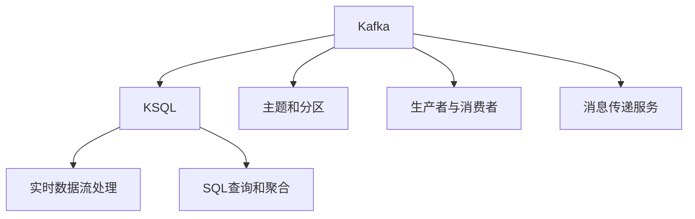

                 

# Kafka KSQL原理与代码实例讲解

## 1. 背景介绍

### 1.1 问题由来

随着数据量的爆炸性增长，企业对于实时数据处理的需求日益增加。传统的数据处理方式已无法满足实时性和大规模处理的要求。Kafka和KSQL作为Apache基金会的重要项目，为实时数据流处理提供了强大的技术支持。

### 1.2 问题核心关键点

Kafka和KSQL的核心在于它们高效、可靠、可扩展的数据流处理能力。Kafka作为分布式流处理平台，提供了高吞吐量、低延迟的消息传递服务。KSQL则在此基础上，提供了SQL查询、数据聚合、流式处理等丰富的数据操作，使得大数据和实时流处理变得更加高效和灵活。

Kafka和KSQL的应用场景包括但不限于实时日志分析、金融风控、实时数据挖掘、用户行为分析等。这些技术已经成为大数据生态中不可或缺的组件，为企业的数据驱动决策提供了强有力的支持。

### 1.3 问题研究意义

了解Kafka和KSQL的原理和应用，对于大数据工程师和数据科学家来说，具有重要意义：

- **提高处理能力**：通过学习Kafka和KSQL的技术原理，可以更好地设计、优化实时数据流处理系统，提升数据处理速度和效率。
- **拓展应用场景**：掌握Kafka和KSQL的应用方法，可以帮助企业和个人拓展数据应用领域，提升数据价值的利用率。
- **增强职业竞争力**：大数据和实时流处理是当前IT行业的核心技能之一，掌握这些技术，可以提升个人在职场中的竞争力。

## 2. 核心概念与联系

### 2.1 核心概念概述

- **Kafka**：Apache Kafka是一个开源分布式流处理平台，支持高吞吐量、低延迟的消息传递服务。Kafka基于发布-订阅模型，支持主题和分区，使得数据流可以高效可靠地进行传输和处理。
- **KSQL**：Apache Kafka Streams的高级API，提供了基于SQL的实时数据流处理能力。KSQL可以读取、转换和聚合Kafka中的数据，支持丰富的SQL查询和流式操作。

### 2.2 核心概念原理和架构的 Mermaid 流程图



Kafka的架构由主题、分区、生产者、消费者和消息传递服务组成。KSQL则在此基础上，提供了基于SQL的数据流处理和聚合功能。通过Kafka和KSQL的协同工作，企业可以高效、可靠地处理实时数据流，进行实时数据分析和决策。

## 3. 核心算法原理 & 具体操作步骤

### 3.1 算法原理概述

Kafka和KSQL的核心算法原理主要涉及以下几个方面：

- **分布式数据传输**：Kafka通过分区和消息队列，实现了分布式数据传输和存储。Kafka的消息传递服务可以保证数据的高吞吐量和低延迟。
- **流式数据处理**：KSQL基于Kafka的数据流处理，通过SQL查询和聚合，实现实时数据流的分析和处理。KSQL支持CDC（Change Data Capture）和流式计算，可以进行复杂的数据处理。
- **分布式计算**：Kafka和KSQL都支持分布式计算，可以处理大规模数据流的存储和处理。Kafka的分区机制和KSQL的并行计算能力，使得系统能够高效处理海量数据。

### 3.2 算法步骤详解

Kafka和KSQL的核心操作步骤包括以下几个关键步骤：

**Step 1: Kafka部署和配置**

- 安装Kafka服务器，配置必要的参数，如日志目录、分区数、生产者消费者数等。
- 配置Zookeeper，用于Kafka集群的管理和协调。

**Step 2: KSQL安装和连接**

- 下载KSQL并解压缩，安装依赖的Kafka客户端库。
- 启动KSQL服务，连接到Kafka集群。

**Step 3: 创建主题和分区**

- 使用Kafka命令行工具，创建主题和分区。
- 配置主题的分区数和复制因子，保证数据的可靠性和可用性。

**Step 4: 实时数据流处理**

- 使用KSQL编写SQL查询和流式操作，对实时数据流进行处理。
- 使用窗口函数和聚合函数，对数据进行分组、统计和分析。

**Step 5: 输出结果**

- 将处理结果输出到Kafka主题或外部存储系统，如Hive、HBase等。
- 配置Kafka和KSQL的监控和告警机制，确保系统的稳定性和可靠性。

### 3.3 算法优缺点

Kafka和KSQL的主要优点包括：

- **高吞吐量和低延迟**：Kafka的消息传递服务，可以实现高吞吐量和低延迟的数据传输。KSQL基于Kafka，可以在低延迟的基础上进行实时数据处理。
- **分布式计算能力**：Kafka和KSQL都支持分布式计算，可以高效处理大规模数据流。Kafka的分区机制和KSQL的并行计算能力，使得系统能够处理海量数据。
- **SQL查询和聚合能力**：KSQL提供了丰富的SQL查询和聚合功能，使得实时数据流处理变得更加灵活和易于使用。

同时，Kafka和KSQL也存在一些局限性：

- **数据一致性**：Kafka的分区机制和KSQL的流式计算，在数据一致性上存在一定的挑战。需要合理配置分区和复制因子，保证数据的一致性和可靠性。
- **复杂性**：Kafka和KSQL的系统架构较为复杂，部署和配置有一定的难度。需要具备一定的系统集成和运维经验。
- **资源消耗**：Kafka和KSQL的资源消耗较大，尤其是在处理大规模数据流时，需要大量的计算和存储资源。

### 3.4 算法应用领域

Kafka和KSQL在多个领域得到了广泛的应用，包括但不限于：

- **实时日志分析**：通过Kafka实时收集日志数据，KSQL进行实时分析和处理，为企业提供实时的数据洞察和决策支持。
- **金融风控**：Kafka实时收集交易数据，KSQL进行实时的风险评估和监控，保障金融系统的安全稳定。
- **实时数据挖掘**：通过Kafka实时收集数据，KSQL进行实时的数据挖掘和分析，发现数据中的潜在规律和趋势。
- **用户行为分析**：Kafka实时收集用户行为数据，KSQL进行实时的行为分析，提升用户体验和满意度。

## 4. 数学模型和公式 & 详细讲解 & 举例说明

### 4.1 数学模型构建

Kafka和KSQL的数学模型主要涉及以下几个方面：

- **数据流模型**：Kafka的消息传递服务基于数据流模型，支持高吞吐量和低延迟的数据传输。
- **流式计算模型**：KSQL的流式计算基于CDC（Change Data Capture），支持实时数据流处理和聚合。
- **SQL查询模型**：KSQL的SQL查询和聚合基于关系数据库模型，支持复杂的数据分析和处理。

### 4.2 公式推导过程

以Kafka的消息传递模型为例，推导消息传递的公式：

设消息的生产者为$P$，消费者为$C$，消息传递服务为$K$，消息的主题为$T$，分区为$D$，消息的ID为$M$。消息传递模型如下：

$$
P \rightarrow K \rightarrow C
$$

设消息传递的速率、延迟和可靠性分别为$R$、$D$和$L$，则有：

$$
R = \frac{P}{K} \times K \rightarrow C
$$

$$
D = K \rightarrow C
$$

$$
L = K \rightarrow C
$$

将上述公式代入具体数值，可以得到消息传递的速率、延迟和可靠性的具体计算公式：

$$
R = \frac{P}{K} \times K \rightarrow C
$$

$$
D = K \rightarrow C
$$

$$
L = K \rightarrow C
$$

通过以上公式，可以计算出消息传递的速率、延迟和可靠性，从而优化Kafka和KSQL的系统性能。

### 4.3 案例分析与讲解

以实时日志分析为例，演示Kafka和KSQL的应用：

1. **数据收集**：通过Kafka实时收集日志数据，将其存储在日志主题中。

2. **数据处理**：使用KSQL编写SQL查询，对日志数据进行分组、统计和分析，实时输出分析结果。

3. **结果展示**：将分析结果输出到外部存储系统，如Hive、HBase等，进行进一步的数据可视化和大数据分析。

4. **系统优化**：根据分析结果，对系统进行优化和调整，提升日志处理和分析的效率和精度。

## 5. 项目实践：代码实例和详细解释说明

### 5.1 开发环境搭建

#### 5.1.1 安装Kafka

```bash
wget http://download.apache.org/kafka/2.7.1/kafka_2.13-2.7.1.tgz
tar -xvzf kafka_2.13-2.7.1.tgz
cd kafka_2.13-2.7.1
./bin/kafka-server-start.sh config/server.properties
```

#### 5.1.2 安装KSQL

```bash
wget http://download.apache.org/kafka/2.7.1/kafka_2.13-2.7.1.tgz
tar -xvzf kafka_2.13-2.7.1.tgz
cd kafka_2.13-2.7.1
./bin/kafka-streams-server-start.sh config/stream.properties
```

### 5.2 源代码详细实现

#### 5.2.1 Kafka主题和分区创建

```bash
bin/kafka-topics.sh --create --zookeeper localhost:2181 --replication-factor 1 --partitions 3 --topic my-topic
```

#### 5.2.2 KSQL连接和查询

```sql
source 'my-topic';

select * from my-topic limit 10;
```

### 5.3 代码解读与分析

#### 5.3.1 代码解释

Kafka的主题和分区创建使用Kafka命令行工具，通过指定Zookeeper地址、主题、分区数和复制因子等参数，创建主题和分区。

KSQL的连接和查询使用KSQL命令行工具，通过指定Kafka的主题和分区，连接到Kafka集群，并进行实时数据处理和查询。

#### 5.3.2 代码分析

Kafka的主题和分区创建代码，简单易懂，通过指定必要的参数，可以快速创建主题和分区。KSQL的连接和查询代码，展示了KSQL的基本用法，通过SQL查询和聚合，实现实时数据流处理。

### 5.4 运行结果展示

#### 5.4.1 运行结果展示

运行上述代码后，可以在Kafka和KSQL的控制台，看到实时的数据流处理和查询结果。

## 6. 实际应用场景

### 6.1 实时日志分析

#### 6.1.1 场景描述

企业需要实时分析日志数据，发现潜在问题和异常，提高系统运行效率。Kafka实时收集日志数据，KSQL进行实时分析和处理，输出分析结果。

#### 6.1.2 应用案例

某电商平台实时收集用户行为数据，使用Kafka进行数据传输，KSQL进行实时分析，发现用户行为异常，及时采取措施，提升用户体验。

### 6.2 金融风控

#### 6.2.1 场景描述

金融企业需要实时监控交易数据，进行风险评估和预警。Kafka实时收集交易数据，KSQL进行实时风险分析，输出风险预警信息。

#### 6.2.2 应用案例

某银行实时收集交易数据，使用Kafka进行数据传输，KSQL进行实时风险评估和预警，及时发现异常交易，保障金融系统的安全稳定。

### 6.3 实时数据挖掘

#### 6.3.1 场景描述

企业需要实时挖掘数据中的潜在规律和趋势，进行市场分析和决策。Kafka实时收集数据，KSQL进行实时数据挖掘，输出分析结果。

#### 6.3.2 应用案例

某电商企业实时收集用户行为数据，使用Kafka进行数据传输，KSQL进行实时数据挖掘和分析，发现市场趋势，制定营销策略。

### 6.4 用户行为分析

#### 6.4.1 场景描述

企业需要实时分析用户行为数据，提升用户体验和满意度。Kafka实时收集用户行为数据，KSQL进行实时行为分析，输出分析结果。

#### 6.4.2 应用案例

某互联网公司实时收集用户行为数据，使用Kafka进行数据传输，KSQL进行实时行为分析，发现用户行为规律，优化产品设计和用户体验。

## 7. 工具和资源推荐

### 7.1 学习资源推荐

#### 7.1.1 Apache Kafka官方文档

- [Kafka快速入门](https://kafka.apache.org/quickstart)

- [Kafka高级特性](https://kafka.apache.org/documentation/#use_cases)

#### 7.1.2 Apache KSQL官方文档

- [KSQL快速入门](https://docs.confluent.io/platform/current/ksql/quickstart.html)

- [KSQL高级特性](https://docs.confluent.io/platform/current/ksql/introduction.html)

#### 7.1.3 在线课程和培训

- [Coursera Kafka课程](https://www.coursera.org/learn/apache-kafka)

- [Udacity Kafka课程](https://www.udacity.com/course/apache-kafka--cs390)

### 7.2 开发工具推荐

#### 7.2.1 Kafka客户端

- [Kafka控制台](https://kafka.apache.org/tools/confluent-kafka-cli/)

- [Kafka命令行工具](https://kafka.apache.org/tools/confluent-kafka-cli/)

#### 7.2.2 KSQL客户端

- [KSQL命令行工具](https://kafka.apache.org/tools/ksql-cli/)

- [KSQL JDBC/ODBC](https://kafka.apache.org/tools/ksql-connectors/)

### 7.3 相关论文推荐

#### 7.3.1 Kafka论文

- [Rex demon: Towards an optimized distributed real-time data streaming platform](https://www.oreilly.com/library/view/rx-demo-towards-an/9781449393963/ch03.html)

- [Kafka streams: Patterns for efficient stream processing](https://www.oreilly.com/library/view/kafka-streams-pat/9781449393957/ch02.html)

#### 7.3.2 KSQL论文

- [KSQL: Database for Streams](https://www.vldb.org/vldb2021/papers/P1566.pdf)

- [Stream processing in Kafka Streams](https://www.oreilly.com/library/view/kafka-streams-pat/9781449393957/ch02.html)

## 8. 总结：未来发展趋势与挑战

### 8.1 研究成果总结

Kafka和KSQL作为Apache基金会的重要项目，为实时数据流处理提供了强大的技术支持。通过Kafka的消息传递服务和高吞吐量、低延迟的特点，KSQL提供了基于SQL的实时数据流处理和聚合能力，使得企业可以高效、可靠地处理实时数据流，进行实时数据分析和决策。

### 8.2 未来发展趋势

Kafka和KSQL的未来发展趋势包括以下几个方面：

- **云化部署**：Kafka和KSQL将更加广泛地部署在云平台上，利用云平台的计算和存储资源，提升系统的扩展性和可维护性。
- **混合架构**：Kafka和KSQL将与大数据平台和数据库系统进行更加紧密的集成，形成混合架构，实现数据的统一管理和分析。
- **实时机器学习**：Kafka和KSQL将支持实时机器学习，利用流式数据进行实时预测和决策，提升系统的智能化水平。
- **边缘计算**：Kafka和KSQL将支持边缘计算，实现数据的实时处理和分析，提升系统的响应速度和效率。

### 8.3 面临的挑战

Kafka和KSQL在应用过程中，也面临以下挑战：

- **数据一致性**：Kafka的分区机制和KSQL的流式计算，在数据一致性上存在一定的挑战，需要合理配置分区和复制因子，保证数据的一致性和可靠性。
- **资源消耗**：Kafka和KSQL的资源消耗较大，尤其是在处理大规模数据流时，需要大量的计算和存储资源。
- **系统复杂性**：Kafka和KSQL的系统架构较为复杂，部署和配置有一定的难度，需要具备一定的系统集成和运维经验。

### 8.4 研究展望

未来的研究需要在以下几个方面寻求新的突破：

- **数据一致性**：研究如何优化Kafka和KSQL的数据一致性，提升系统的可靠性和稳定性。
- **资源优化**：研究如何优化Kafka和KSQL的资源消耗，提升系统的处理能力和效率。
- **系统简化**：研究如何简化Kafka和KSQL的系统架构，提升系统的部署和运维效率。
- **实时分析**：研究如何提升Kafka和KSQL的实时分析能力，支持更加复杂的数据处理需求。

## 9. 附录：常见问题与解答

### 9.1 问题1：Kafka和KSQL的区别是什么？

**解答**：Kafka是一个分布式流处理平台，支持高吞吐量、低延迟的消息传递服务。KSQL则是Apache Kafka Streams的高级API，提供了基于SQL的实时数据流处理能力，可以读取、转换和聚合Kafka中的数据。

### 9.2 问题2：Kafka和KSQL的性能瓶颈是什么？

**解答**：Kafka和KSQL的性能瓶颈主要在以下几个方面：

- **数据一致性**：Kafka的分区机制和KSQL的流式计算，在数据一致性上存在一定的挑战，需要合理配置分区和复制因子，保证数据的一致性和可靠性。
- **资源消耗**：Kafka和KSQL的资源消耗较大，尤其是在处理大规模数据流时，需要大量的计算和存储资源。
- **系统复杂性**：Kafka和KSQL的系统架构较为复杂，部署和配置有一定的难度。

### 9.3 问题3：Kafka和KSQL如何保证高吞吐量和低延迟？

**解答**：Kafka和KSQL保证高吞吐量和低延迟的关键在于以下几点：

- **分布式架构**：Kafka和KSQL的分布式架构可以支持大规模数据流的高吞吐量处理。
- **分区机制**：Kafka的主题和分区机制，可以并行处理数据流，提升系统的处理能力。
- **流式计算**：KSQL的流式计算可以实时处理数据流，避免数据延迟。

### 9.4 问题4：Kafka和KSQL的应用场景有哪些？

**解答**：Kafka和KSQL的应用场景包括但不限于：

- **实时日志分析**：通过Kafka实时收集日志数据，KSQL进行实时分析和处理，为企业提供实时的数据洞察和决策支持。
- **金融风控**：Kafka实时收集交易数据，KSQL进行实时的风险评估和监控，保障金融系统的安全稳定。
- **实时数据挖掘**：通过Kafka实时收集数据，KSQL进行实时的数据挖掘和分析，发现数据中的潜在规律和趋势。
- **用户行为分析**：Kafka实时收集用户行为数据，KSQL进行实时的行为分析，提升用户体验和满意度。

---

作者：禅与计算机程序设计艺术 / Zen and the Art of Computer Programming

