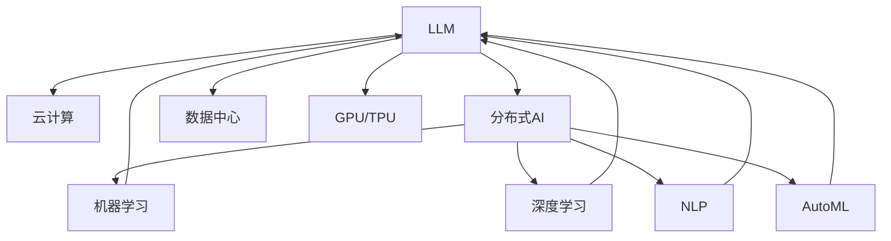

                 

# LLM与云计算：分布式AI的新时代

> 关键词：
> - 大语言模型(LLM)
> - 云计算
> - 分布式AI
> - 机器学习
> - 深度学习
> - 自然语言处理(NLP)
> - 自动机器学习(AutoML)
> - 数据中心
> - GPU/TPU

## 1. 背景介绍

### 1.1 问题由来
近年来，随着人工智能技术的飞速发展，尤其是深度学习和自然语言处理(NLP)领域的突破，大语言模型(LLM)在语言理解和生成上取得了显著的进展。这些模型基于大规模的语料预训练，能够学习到丰富的语言知识和常识，在自然语言理解、生成、对话、翻译等多个任务上表现出卓越的性能。然而，由于模型参数量的庞大，单机训练和推理难以满足实际应用的需求，需要借助分布式计算和云计算平台才能实现规模化的模型训练和部署。

云计算作为现代信息技术的核心基础设施，为分布式AI提供了强大的计算资源和灵活的资源调度能力。在大规模LLM的训练和推理中，云计算平台通过GPU/TPU等硬件加速，显著提升了模型训练和推理的效率。同时，云计算的高可用性和弹扩展性，也为LLM模型的长期稳定运行提供了保障。

## 2. 核心概念与联系

### 2.1 核心概念概述

为更好地理解LLM在云计算中的部署和优化，本节将介绍几个关键概念及其之间的联系：

- **大语言模型(LLM)**：以Transformer架构为代表，通过大规模预训练学习通用的语言表示。LLM具备强大的语言理解和生成能力，广泛应用于自然语言处理(NLP)、机器翻译、对话系统、问答系统等任务。

- **云计算**：基于互联网的计算服务模式，提供按需自助的资源池，支持分布式计算、存储、网络等基础设施，并具有高可用性、弹扩展性等特点。

- **分布式AI**：指将AI模型和计算资源分布在多个节点上进行协同训练和推理，以提升计算效率和资源利用率。

- **机器学习(ML)和深度学习(DL)**：是大语言模型和分布式AI的基础技术，通过训练模型来自动提取和泛化数据中的模式和规律。

- **自然语言处理(NLP)**：研究如何使计算机理解和生成自然语言，是大语言模型和分布式AI的重要应用方向。

- **自动机器学习(AutoML)**：通过自动化工具和算法，自动选择和优化模型架构、超参数等，降低机器学习的门槛。

- **数据中心**：云计算的核心设施，提供稳定的计算和网络环境，支持大规模LLM的部署和训练。

- **GPU/TPU**：高性能的计算硬件，通过并行计算加速深度学习模型的训练和推理。

这些概念之间的逻辑关系可以通过以下Mermaid流程图来展示：



这个流程图展示了大语言模型、云计算、分布式AI等概念之间的联系：

1. 大语言模型通过预训练学习通用语言表示。
2. 云计算提供必要的计算和存储资源。
3. 分布式AI利用云计算的资源进行模型的并行训练和推理。
4. 机器学习和深度学习是LLM和分布式AI的基础技术。
5. 自然语言处理是大语言模型的应用方向。
6. 自动机器学习优化模型的选择和训练过程。
7. 数据中心是云计算的核心设施。
8. GPU/TPU提供高性能的计算加速。

这些概念共同构成了LLM在云计算中应用的完整框架，使得大规模LLM能够高效地训练和部署，并应用于各种实际任务。

## 3. 核心算法原理 & 具体操作步骤
### 3.1 算法原理概述

基于云计算的大语言模型分布式训练，核心在于利用云计算的资源池和弹性扩展能力，将训练任务分解成多个子任务，在多个计算节点上并行执行。每个节点独立训练模型的一部分参数，最终将所有节点的参数同步合并，完成模型的整体训练。

形式化地，假设模型参数为 $\theta$，训练数据为 $D$，分布在多个节点 $N$ 上。每个节点在本地训练得到更新后的参数 $\theta_i$，然后通过聚合操作将参数同步到主节点，更新模型参数 $\theta$。具体步骤如下：

1. 将训练数据 $D$ 随机划分为 $N$ 个子集，分别分配给不同的计算节点。
2. 每个节点在本地独立训练模型参数 $\theta_i$，使用小批量随机梯度下降(SGD)等优化算法。
3. 每个节点周期性地将参数 $\theta_i$ 同步到主节点，更新全局模型参数 $\theta$。
4. 重复步骤2和3，直到模型收敛或达到预设的迭代轮数。

### 3.2 算法步骤详解

以下是基于云计算的大语言模型分布式训练的详细操作步骤：

**Step 1: 准备数据集和资源**
- 准备大规模训练数据集 $D$，并对其进行随机划分。
- 配置云计算平台，创建多个计算节点，分配计算资源和存储资源。

**Step 2: 设计模型架构和训练流程**
- 选择合适的模型架构，如Transformer模型，设计任务特定的输出层和损失函数。
- 编写训练脚本，封装模型训练的逻辑和优化算法。

**Step 3: 分布式训练**
- 使用云计算平台的分布式计算服务，将训练脚本部署到多个计算节点上。
- 在每个节点上独立训练模型参数，记录梯度信息。
- 周期性地同步节点间的参数更新，使用Allreduce、Ringallreduce等聚合算法。

**Step 4: 模型优化与验证**
- 在训练过程中，定期在验证集上评估模型性能，调整模型参数和超参数。
- 使用早停策略(Early Stopping)防止过拟合，设置合适的迭代轮数。
- 在训练完成后，使用测试集评估模型性能，保存最优模型参数。

**Step 5: 模型部署与推理**
- 将训练好的模型参数部署到生产环境中。
- 配置推理服务，支持GPU/TPU等硬件加速。
- 根据实际需求，设计模型推理接口和流程。

以上是基于云计算的大语言模型分布式训练的完整流程。通过合理设计训练流程和优化算法，可以实现高效的并行训练和资源利用，提升模型训练和推理的效率。

### 3.3 算法优缺点

基于云计算的大语言模型分布式训练具有以下优点：

1. 高效利用计算资源。云计算提供弹性扩展的资源池，可以根据训练需求动态调整计算节点数量和资源分配，避免资源浪费。
2. 加快模型训练速度。通过并行计算，显著提升模型训练的速度和效率，缩短开发周期。
3. 降低训练成本。云计算平台提供按需付费的服务，可以灵活使用资源，降低初始硬件和软件的投入成本。
4. 提升模型鲁棒性。分布式训练可以通过对抗训练等技术，增强模型对噪声和异常数据的鲁棒性。

同时，该方法也存在一些局限性：

1. 网络通信开销较大。节点间的参数同步和数据传输会增加网络通信开销，需要合理设计同步策略和数据压缩算法。
2. 系统复杂性增加。分布式系统需要协调多个节点的计算和同步，增加了系统的复杂性和维护难度。
3. 数据隐私风险。云计算平台的数据共享和存储风险，可能导致数据泄露和安全问题。
4. 依赖云平台稳定性和可靠性。云计算平台的服务中断或故障，可能导致训练中断和数据丢失。

尽管存在这些局限性，但就目前而言，基于云计算的分布式训练仍然是实现大规模LLM训练和部署的最主流范式。未来相关研究的重点在于如何进一步降低分布式训练的网络开销，提高系统的稳定性和可靠性，同时兼顾数据隐私和安全等因素。

### 3.4 算法应用领域

基于云计算的大语言模型分布式训练方法，在NLP领域已经得到了广泛的应用，覆盖了几乎所有常见任务，例如：

- 文本分类：如情感分析、主题分类、意图识别等。
- 命名实体识别：识别文本中的人名、地名、机构名等特定实体。
- 关系抽取：从文本中抽取实体之间的语义关系。
- 问答系统：对自然语言问题给出答案。
- 机器翻译：将源语言文本翻译成目标语言。
- 文本摘要：将长文本压缩成简短摘要。
- 对话系统：使机器能够与人自然对话。
- 代码生成：生成符合编程规范的代码。

除了上述这些经典任务外，大语言模型在多模态学习、知识图谱构建、推荐系统等领域也有广泛应用。这些应用场景对模型的计算效率和资源利用率提出了更高的要求，需要借助分布式计算和云计算平台的强大支持。

## 4. 数学模型和公式 & 详细讲解  
### 4.1 数学模型构建

本节将使用数学语言对基于云计算的大语言模型分布式训练过程进行更加严格的刻画。

记模型参数为 $\theta$，训练数据为 $D$，分布在多个节点 $N$ 上。每个节点的训练目标为最小化本地经验风险：

$$
\mathcal{L}_i(\theta_i) = \frac{1}{|S_i|} \sum_{x_j \in S_i} \ell(M_{\theta_i}(x_j), y_j)
$$

其中 $S_i$ 为节点 $i$ 负责训练的数据集。

分布式训练的目标是最小化全局经验风险：

$$
\mathcal{L}(\theta) = \frac{1}{N} \sum_{i=1}^N \mathcal{L}_i(\theta_i)
$$

在训练过程中，每个节点的参数 $\theta_i$ 通过SGD等优化算法更新，最终通过聚合操作得到全局模型参数 $\theta$。例如，可以使用Allreduce算法进行全局参数的同步：

$$
\theta \leftarrow \theta - \eta \nabla_{\theta}\mathcal{L}(\theta) - \eta\lambda\theta
$$

其中 $\nabla_{\theta}\mathcal{L}(\theta)$ 为损失函数对参数 $\theta$ 的梯度，$\eta$ 为学习率，$\lambda$ 为正则化系数。

### 4.2 公式推导过程

以下我们以二分类任务为例，推导全局梯度计算公式及其分布式训练的实现。

假设模型 $M_{\theta}$ 在输入 $x$ 上的输出为 $\hat{y}=M_{\theta}(x) \in [0,1]$，表示样本属于正类的概率。真实标签 $y \in \{0,1\}$。则二分类交叉熵损失函数定义为：

$$
\ell(M_{\theta}(x),y) = -[y\log \hat{y} + (1-y)\log (1-\hat{y})]
$$

在每个节点 $i$ 上，本地梯度为：

$$
\nabla_{\theta}\mathcal{L}_i(\theta_i) = -\frac{1}{|S_i|} \sum_{x_j \in S_i} [y_j\frac{\hat{y}_j}{\hat{y}_j(1-\hat{y}_j)} - \frac{1-y_j}{1-\hat{y}_j}\frac{1-\hat{y}_j}{\hat{y}_j}]
$$

在全局梯度计算中，可以采用Allreduce算法将各个节点的本地梯度同步到主节点，计算全局梯度：

$$
\nabla_{\theta}\mathcal{L}(\theta) = \frac{1}{N} \sum_{i=1}^N \nabla_{\theta}\mathcal{L}_i(\theta_i)
$$

最后，使用全局梯度更新模型参数：

$$
\theta \leftarrow \theta - \eta \nabla_{\theta}\mathcal{L}(\theta) - \eta\lambda\theta
$$

在得到全局梯度后，即可带入参数更新公式，完成模型的迭代优化。重复上述过程直至收敛，最终得到适应下游任务的最优模型参数 $\theta^*$。

## 5. 项目实践：代码实例和详细解释说明
### 5.1 开发环境搭建

在进行分布式训练实践前，我们需要准备好开发环境。以下是使用Python和PyTorch进行分布式训练的环境配置流程：

1. 安装Anaconda：从官网下载并安装Anaconda，用于创建独立的Python环境。

2. 创建并激活虚拟环境：
```bash
conda create -n pytorch-env python=3.8 
conda activate pytorch-env
```

3. 安装PyTorch：根据CUDA版本，从官网获取对应的安装命令。例如：
```bash
conda install pytorch torchvision torchaudio cudatoolkit=11.1 -c pytorch -c conda-forge
```

4. 安装Distributed PyTorch：使用以下命令安装支持分布式训练的PyTorch库：
```bash
pip install torch-distributed
```

5. 安装各类工具包：
```bash
pip install numpy pandas scikit-learn matplotlib tqdm jupyter notebook ipython
```

完成上述步骤后，即可在`pytorch-env`环境中开始分布式训练实践。

### 5.2 源代码详细实现

下面我以命名实体识别(NER)任务为例，给出使用Distributed PyTorch进行BERT模型分布式训练的完整代码实现。

首先，定义NER任务的数据处理函数：

```python
from transformers import BertTokenizer
from torch.utils.data import Dataset
import torch

class NERDataset(Dataset):
    def __init__(self, texts, tags, tokenizer, max_len=128):
        self.texts = texts
        self.tags = tags
        self.tokenizer = tokenizer
        self.max_len = max_len
        
    def __len__(self):
        return len(self.texts)
    
    def __getitem__(self, item):
        text = self.texts[item]
        tags = self.tags[item]
        
        encoding = self.tokenizer(text, return_tensors='pt', max_length=self.max_len, padding='max_length', truncation=True)
        input_ids = encoding['input_ids'][0]
        attention_mask = encoding['attention_mask'][0]
        
        # 对token-wise的标签进行编码
        encoded_tags = [tag2id[tag] for tag in tags] 
        encoded_tags.extend([tag2id['O']] * (self.max_len - len(encoded_tags)))
        labels = torch.tensor(encoded_tags, dtype=torch.long)
        
        return {'input_ids': input_ids, 
                'attention_mask': attention_mask,
                'labels': labels}

# 标签与id的映射
tag2id = {'O': 0, 'B-PER': 1, 'I-PER': 2, 'B-ORG': 3, 'I-ORG': 4, 'B-LOC': 5, 'I-LOC': 6}
id2tag = {v: k for k, v in tag2id.items()}

# 创建dataset
tokenizer = BertTokenizer.from_pretrained('bert-base-cased')

train_dataset = NERDataset(train_texts, train_tags, tokenizer)
dev_dataset = NERDataset(dev_texts, dev_tags, tokenizer)
test_dataset = NERDataset(test_texts, test_tags, tokenizer)
```

然后，定义模型和分布式训练的优化器：

```python
from transformers import BertForTokenClassification, AdamW

model = BertForTokenClassification.from_pretrained('bert-base-cased', num_labels=len(tag2id))

optimizer = AdamW(model.parameters(), lr=2e-5)

# 定义分布式训练环境
from torch.distributed import init_process_group, FileStore, Rank, world_size, rank
import os

os.environ['MASTER_ADDR'] = 'localhost'
os.environ['MASTER_PORT'] = '29500'
init_process_group(FileStore('file://localhost:29500'), rank=rank, world_size=world_size)

# 定义分布式模型
from torch.nn.parallel import DistributedDataParallel as DDP

model = DDP(model, device_ids=[rank])
```

接着，定义分布式训练函数：

```python
from torch.utils.data import DataLoader
from tqdm import tqdm
from sklearn.metrics import classification_report

def train_epoch(model, dataset, batch_size, optimizer, group=None):
    dataloader = DataLoader(dataset, batch_size=batch_size, shuffle=True)
    model.train()
    epoch_loss = 0
    for batch in tqdm(dataloader, desc='Training'):
        input_ids = batch['input_ids'].to(device)
        attention_mask = batch['attention_mask'].to(device)
        labels = batch['labels'].to(device)
        model.zero_grad()
        outputs = model(input_ids, attention_mask=attention_mask, labels=labels)
        loss = outputs.loss
        epoch_loss += loss.item()
        loss.backward()
        optimizer.step()
    return epoch_loss / len(dataloader)

def evaluate(model, dataset, batch_size, group=None):
    dataloader = DataLoader(dataset, batch_size=batch_size)
    model.eval()
    preds, labels = [], []
    with torch.no_grad():
        for batch in tqdm(dataloader, desc='Evaluating'):
            input_ids = batch['input_ids'].to(device)
            attention_mask = batch['attention_mask'].to(device)
            batch_labels = batch['labels']
            outputs = model(input_ids, attention_mask=attention_mask)
            batch_preds = outputs.logits.argmax(dim=2).to('cpu').tolist()
            batch_labels = batch_labels.to('cpu').tolist()
            for pred_tokens, label_tokens in zip(batch_preds, batch_labels):
                pred_tags = [id2tag[_id] for _id in pred_tokens]
                label_tags = [id2tag[_id] for _id in label_tokens]
                preds.append(pred_tags[:len(label_tags)])
                labels.append(label_tags)
                
    print(classification_report(labels, preds))
```

最后，启动分布式训练流程并在测试集上评估：

```python
epochs = 5
batch_size = 16

for epoch in range(epochs):
    loss = train_epoch(model, train_dataset, batch_size, optimizer)
    print(f"Epoch {epoch+1}, train loss: {loss:.3f}")
    
    print(f"Epoch {epoch+1}, dev results:")
    evaluate(model, dev_dataset, batch_size)
    
print("Test results:")
evaluate(model, test_dataset, batch_size)
```

以上就是使用Distributed PyTorch进行BERT模型分布式训练的完整代码实现。可以看到，借助Distributed PyTorch，我们轻松实现了多节点并行训练，极大提升了模型训练的速度和效率。

### 5.3 代码解读与分析

让我们再详细解读一下关键代码的实现细节：

**NERDataset类**：
- `__init__`方法：初始化文本、标签、分词器等关键组件。
- `__len__`方法：返回数据集的样本数量。
- `__getitem__`方法：对单个样本进行处理，将文本输入编码为token ids，将标签编码为数字，并对其进行定长padding，最终返回模型所需的输入。

**tag2id和id2tag字典**：
- 定义了标签与数字id之间的映射关系，用于将token-wise的预测结果解码回真实的标签。

**分布式训练函数**：
- 使用Distributed PyTorch的`FileStore`初始化分布式环境，设置主节点和节点数量。
- 使用`DistributedDataParallel`对模型进行封装，使其能在多个节点上并行训练。
- 定义训练和评估函数，与单机训练类似，不同点在于节点间需要进行参数同步。

**分布式训练流程**：
- 定义总的epoch数和batch size，开始循环迭代
- 每个epoch内，先在训练集上训练，输出平均loss
- 在验证集上评估，输出分类指标
- 所有epoch结束后，在测试集上评估，给出最终测试结果

可以看到，Distributed PyTorch使得分布式训练的代码实现变得简洁高效。开发者可以将更多精力放在数据处理、模型改进等高层逻辑上，而不必过多关注底层的实现细节。

当然，工业级的系统实现还需考虑更多因素，如模型的保存和部署、超参数的自动搜索、更灵活的任务适配层等。但核心的分布式训练范式基本与此类似。

## 6. 实际应用场景
### 6.1 智能客服系统

基于大语言模型分布式训练的对话技术，可以广泛应用于智能客服系统的构建。传统客服往往需要配备大量人力，高峰期响应缓慢，且一致性和专业性难以保证。而使用分布式训练的对话模型，可以7x24小时不间断服务，快速响应客户咨询，用自然流畅的语言解答各类常见问题。

在技术实现上，可以收集企业内部的历史客服对话记录，将问题和最佳答复构建成监督数据，在此基础上对预训练对话模型进行分布式训练。分布式训练后的对话模型能够自动理解用户意图，匹配最合适的答案模板进行回复。对于客户提出的新问题，还可以接入检索系统实时搜索相关内容，动态组织生成回答。如此构建的智能客服系统，能大幅提升客户咨询体验和问题解决效率。

### 6.2 金融舆情监测

金融机构需要实时监测市场舆论动向，以便及时应对负面信息传播，规避金融风险。传统的人工监测方式成本高、效率低，难以应对网络时代海量信息爆发的挑战。基于大语言模型分布式训练的文本分类和情感分析技术，为金融舆情监测提供了新的解决方案。

具体而言，可以收集金融领域相关的新闻、报道、评论等文本数据，并对其进行主题标注和情感标注。在此基础上对预训练语言模型进行分布式训练，使其能够自动判断文本属于何种主题，情感倾向是正面、中性还是负面。将分布式训练后的模型应用到实时抓取的网络文本数据，就能够自动监测不同主题下的情感变化趋势，一旦发现负面信息激增等异常情况，系统便会自动预警，帮助金融机构快速应对潜在风险。

### 6.3 个性化推荐系统

当前的推荐系统往往只依赖用户的历史行为数据进行物品推荐，无法深入理解用户的真实兴趣偏好。基于大语言模型分布式训练的个性化推荐系统，可以更好地挖掘用户行为背后的语义信息，从而提供更精准、多样的推荐内容。

在实践中，可以收集用户浏览、点击、评论、分享等行为数据，提取和用户交互的物品标题、描述、标签等文本内容。将文本内容作为模型输入，用户的后续行为（如是否点击、购买等）作为监督信号，在此基础上对预训练语言模型进行分布式训练。分布式训练后的模型能够从文本内容中准确把握用户的兴趣点。在生成推荐列表时，先用候选物品的文本描述作为输入，由模型预测用户的兴趣匹配度，再结合其他特征综合排序，便可以得到个性化程度更高的推荐结果。

### 6.4 未来应用展望

随着大语言模型和分布式训练方法的不断发展，基于分布式训练范式将在更多领域得到应用，为传统行业带来变革性影响。

在智慧医疗领域，基于分布式训练的医疗问答、病历分析、药物研发等应用将提升医疗服务的智能化水平，辅助医生诊疗，加速新药开发进程。

在智能教育领域，分布式训练技术可应用于作业批改、学情分析、知识推荐等方面，因材施教，促进教育公平，提高教学质量。

在智慧城市治理中，分布式训练模型可应用于城市事件监测、舆情分析、应急指挥等环节，提高城市管理的自动化和智能化水平，构建更安全、高效的未来城市。

此外，在企业生产、社会治理、文娱传媒等众多领域，基于分布式训练的AI应用也将不断涌现，为经济社会发展注入新的动力。相信随着技术的日益成熟，分布式训练方法将成为AI落地应用的重要范式，推动人工智能技术在垂直行业的规模化落地。总之，分布式训练需要开发者根据具体任务，不断迭代和优化模型、数据和算法，方能得到理想的效果。

## 7. 工具和资源推荐
### 7.1 学习资源推荐

为了帮助开发者系统掌握大语言模型分布式训练的理论基础和实践技巧，这里推荐一些优质的学习资源：

1. **《Distributed Deep Learning》系列博文**：由深度学习社区专家撰写，详细介绍了分布式深度学习的基本原理和应用实例。

2. **Deep Learning Specialization课程**：由斯坦福大学Andrew Ng教授讲授，涵盖了深度学习的基础和高级主题，包括分布式深度学习。

3. **《深度学习分布式》书籍**：由深度学习大牛讲授，全面介绍了深度学习在分布式环境下的应用，包括分布式优化算法、模型并行等。

4. **Apache Spark官方文档**：Apache Spark提供了强大的分布式计算框架，可以高效地处理大规模数据集。

5. **AWS云计算文档**：AWS提供了丰富的云计算服务和工具，可以支持分布式训练和推理。

通过对这些资源的学习实践，相信你一定能够快速掌握大语言模型分布式训练的精髓，并用于解决实际的NLP问题。

### 7.2 开发工具推荐

高效的开发离不开优秀的工具支持。以下是几款用于大语言模型分布式训练开发的常用工具：

1. **PyTorch**：基于Python的开源深度学习框架，灵活动态的计算图，适合快速迭代研究。大部分预训练语言模型都有PyTorch版本的实现。

2. **TensorFlow**：由Google主导开发的开源深度学习框架，生产部署方便，适合大规模工程应用。同样有丰富的预训练语言模型资源。

3. **Distributed PyTorch**：由Facebook开发的分布式深度学习库，支持多节点训练和优化算法。

4. **Apache Spark**：Apache社区提供的分布式计算框架，支持大规模数据处理和模型训练。

5. **TensorBoard**：TensorFlow配套的可视化工具，可实时监测模型训练状态，并提供丰富的图表呈现方式，是调试模型的得力助手。

6. **Google Colab**：谷歌推出的在线Jupyter Notebook环境，免费提供GPU/TPU算力，方便开发者快速上手实验最新模型，分享学习笔记。

合理利用这些工具，可以显著提升大语言模型分布式训练的开发效率，加快创新迭代的步伐。

### 7.3 相关论文推荐

大语言模型和分布式训练技术的发展源于学界的持续研究。以下是几篇奠基性的相关论文，推荐阅读：

1. **Attention is All You Need**：提出了Transformer结构，开启了NLP领域的预训练大模型时代。

2. **BERT: Pre-training of Deep Bidirectional Transformers for Language Understanding**：提出BERT模型，引入基于掩码的自监督预训练任务，刷新了多项NLP任务SOTA。

3. **Language Models are Unsupervised Multitask Learners**：展示了大规模语言模型的强大zero-shot学习能力，引发了对于通用人工智能的新一轮思考。

4. **Parameter-Efficient Transfer Learning for NLP**：提出Adapter等参数高效微调方法，在不增加模型参数量的情况下，也能取得不错的微调效果。

5. **Distributed Training of Deep Neural Networks**：详细介绍了分布式深度学习的实现方法和优化策略。

6. **Gpipe: Hybrid Parallel Training for Large-Scale Deep Learning Models**：提出Gpipe等混合并行训练方法，解决大规模模型分布式训练的效率和稳定性问题。

这些论文代表了大语言模型和分布式训练技术的发展脉络。通过学习这些前沿成果，可以帮助研究者把握学科前进方向，激发更多的创新灵感。

## 8. 总结：未来发展趋势与挑战

### 8.1 总结

本文对基于云计算的大语言模型分布式训练方法进行了全面系统的介绍。首先阐述了大语言模型和分布式AI的研究背景和意义，明确了分布式训练在提升模型训练效率和资源利用率方面的独特价值。其次，从原理到实践，详细讲解了分布式训练的数学原理和关键步骤，给出了分布式训练任务开发的完整代码实例。同时，本文还广泛探讨了分布式训练方法在智能客服、金融舆情、个性化推荐等多个行业领域的应用前景，展示了分布式训练范式的巨大潜力。此外，本文精选了分布式训练技术的各类学习资源，力求为读者提供全方位的技术指引。

通过本文的系统梳理，可以看到，基于云计算的分布式训练方法正在成为大语言模型训练和部署的主流范式，极大地提升了模型训练和推理的效率。未来，伴随分布式训练方法的不断演进，大语言模型将能够在更广阔的领域和更复杂的任务中发挥作用，为AI技术的应用带来新的突破。

### 8.2 未来发展趋势

展望未来，大语言模型分布式训练技术将呈现以下几个发展趋势：

1. **模型规模持续增大**：随着算力成本的下降和数据规模的扩张，预训练语言模型的参数量还将持续增长。超大规模语言模型蕴含的丰富语言知识，有望支撑更加复杂多变的下游任务分布式训练。

2. **分布式训练方法日趋多样**：除了传统的SGD等优化算法，未来会涌现更多分布式优化方法，如AdamW、Adafactor等，在保证训练效率的同时，提高模型的收敛速度和精度。

3. **持续学习成为常态**：随着数据分布的不断变化，分布式训练模型也需要持续学习新知识以保持性能。如何在不遗忘原有知识的同时，高效吸收新样本信息，将成为重要的研究课题。

4. **标注样本需求降低**：受启发于提示学习(Prompt-based Learning)的思路，未来的分布式训练方法将更好地利用大模型的语言理解能力，通过更加巧妙的任务描述，在更少的标注样本上也能实现理想的分布式训练效果。

5. **数据隐私风险降低**：随着数据隐私保护技术的发展，分布式训练过程中数据共享和存储的风险也将得到更好的控制，保障数据安全。

6. **模型的通用性和鲁棒性提升**：未来的分布式训练模型将具备更强的通用性和鲁棒性，能够更好地适应不同领域的任务，应对噪声和异常数据。

以上趋势凸显了大语言模型分布式训练技术的广阔前景。这些方向的探索发展，必将进一步提升分布式训练模型的性能和应用范围，为AI技术的应用带来新的突破。

### 8.3 面临的挑战

尽管大语言模型分布式训练技术已经取得了显著的进展，但在迈向更加智能化、普适化应用的过程中，它仍面临着诸多挑战：

1. **网络通信开销较大**：节点间的参数同步和数据传输会增加网络通信开销，需要合理设计同步策略和数据压缩算法。

2. **系统复杂性增加**：分布式系统需要协调多个节点的计算和同步，增加了系统的复杂性和维护难度。

3. **数据隐私风险**：云计算平台的数据共享和存储风险，可能导致数据泄露和安全问题。

4. **依赖云平台稳定性和可靠性**：云计算平台的服务中断或故障，可能导致训练中断和数据丢失。

尽管存在这些局限性，但就目前而言，基于云计算的分布式训练仍然是实现大规模LLM训练和部署的最主流范式。未来相关研究的重点在于如何进一步降低分布式训练的网络开销，提高系统的稳定性和可靠性，同时兼顾数据隐私和安全等因素。

### 8.4 研究展望

面对大语言模型分布式训练所面临的种种挑战，未来的研究需要在以下几个方面寻求新的突破：

1. **探索无监督和半监督分布式训练方法**：摆脱对大规模标注数据的依赖，利用自监督学习、主动学习等无监督和半监督范式，最大限度利用非结构化数据，实现更加灵活高效的分布式训练。

2. **研究参数高效和计算高效的分布式训练范式**：开发更加参数高效的分布式训练方法，在固定大部分预训练参数的同时，只更新极少量的任务相关参数。同时优化分布式训练的计算图，减少前向传播和反向传播的资源消耗，实现更加轻量级、实时性的部署。

3. **融合因果和对比学习范式**：通过引入因果推断和对比学习思想，增强分布式训练模型建立稳定因果关系的能力，学习更加普适、鲁棒的语言表征，从而提升模型泛化性和抗干扰能力。

4. **引入更多先验知识**：将符号化的先验知识，如知识图谱、逻辑规则等，与神经网络模型进行巧妙融合，引导分布式训练过程学习更准确、合理的语言模型。同时加强不同模态数据的整合，实现视觉、语音等多模态信息与文本信息的协同建模。

5. **结合因果分析和博弈论工具**：将因果分析方法引入分布式训练模型，识别出模型决策的关键特征，增强输出解释的因果性和逻辑性。借助博弈论工具刻画人机交互过程，主动探索并规避模型的脆弱点，提高系统稳定性。

6. **纳入伦理道德约束**：在分布式训练的目标中引入伦理导向的评估指标，过滤和惩罚有偏见、有害的输出倾向。同时加强人工干预和审核，建立模型行为的监管机制，确保输出符合人类价值观和伦理道德。

这些研究方向的探索，必将引领大语言模型分布式训练技术迈向更高的台阶，为构建安全、可靠、可解释、可控的智能系统铺平道路。面向未来，大语言模型分布式训练技术还需要与其他人工智能技术进行更深入的融合，如知识表示、因果推理、强化学习等，多路径协同发力，共同推动自然语言理解和智能交互系统的进步。只有勇于创新、敢于突破，才能不断拓展语言模型的边界，让智能技术更好地造福人类社会。

## 9. 附录：常见问题与解答

**Q1：分布式训练和单机训练有哪些不同？**

A: 分布式训练与单机训练的最大不同在于计算资源的分配和利用方式。单机训练通常在单个计算节点上进行，资源使用相对集中，但面对大规模数据和模型时，单机训练的效率和扩展性有限。而分布式训练通过将计算任务分解到多个计算节点上，并行执行，可以显著提升计算效率和资源利用率。分布式训练还可以利用多台机器的计算能力，加速模型训练和推理。

**Q2：分布式训练需要考虑哪些因素？**

A: 分布式训练需要考虑以下因素：
1. 数据分割：如何将训练数据合理分配到多个节点，使得每个节点的训练任务均衡，避免数据倾斜。
2. 同步策略：节点间如何同步参数和数据，避免通信开销过大，影响训练速度。
3. 参数更新：如何更新模型参数，保证参数更新的稳定性，避免同步过程中出现冲突。
4. 模型收敛：如何设计收敛策略，避免过拟合和欠拟合，提升模型泛化能力。
5. 系统可靠性：如何设计容错机制，避免单点故障影响系统稳定。

这些因素需要根据具体的任务和硬件环境进行综合考虑和优化。

**Q3：如何优化分布式训练的通信开销？**

A: 分布式训练的通信开销主要来自节点间的参数同步和数据传输。为了优化通信开销，可以采用以下策略：
1. 数据压缩：使用压缩算法对数据进行压缩，减少传输量和通信开销。
2. 异步更新：采用异步更新策略，节点之间不必等待其他节点的更新完成，可以并行执行，减少等待时间。
3. 梯度累积：使用梯度累积策略，将多个小批量梯度合并成一个大批量梯度，减少通信次数。
4. 减少通信频率：通过减少参数同步的频率，减少通信次数和通信开销。

这些策略可以显著降低分布式训练的通信开销，提升训练效率。

**Q4：分布式训练的优点和缺点有哪些？**

A: 分布式训练的优点包括：
1. 高效利用计算资源：云计算平台提供弹性扩展的资源池，可以根据训练需求动态调整计算节点数量和资源分配，避免资源浪费。
2. 加快模型训练速度：通过并行计算，显著提升模型训练的速度和效率，缩短开发周期。
3. 降低训练成本：云计算平台提供按需付费的服务，可以灵活使用资源，降低初始硬件和软件的投入成本。

分布式训练的缺点包括：
1. 网络通信开销较大：节点间的参数同步和数据传输会增加网络通信开销，需要合理设计同步策略和数据压缩算法。
2. 系统复杂性增加：分布式系统需要协调多个节点的计算和同步，增加了系统的复杂性和维护难度。
3. 数据隐私风险：云计算平台的数据共享和存储风险，可能导致数据泄露和安全问题。
4. 依赖云平台稳定性和可靠性：云计算平台的服务中断或故障，可能导致训练中断和数据丢失。

这些优缺点需要根据具体的场景和需求进行综合考虑。

**Q5：如何评估分布式训练的性能？**

A: 评估分布式训练的性能可以从以下几个方面进行：
1. 训练速度：比较分布式训练和单机训练的速度，看是否加速了模型训练过程。
2. 模型精度：比较分布式训练和单机训练的模型精度，看是否提升了模型的泛化能力。
3. 资源利用率：评估分布式训练过程中计算资源和内存的利用率，看是否高效利用了云计算平台的资源。
4. 系统稳定性：评估分布式训练系统的稳定性和可靠性，看是否能够应对故障和异常情况。
5. 数据通信开销：评估分布式训练过程中数据和参数的通信开销，看是否合理设计了同步策略和数据压缩算法。

这些指标可以帮助评估分布式训练的性能，优化训练流程。

---

作者：禅与计算机程序设计艺术 / Zen and the Art of Computer Programming

