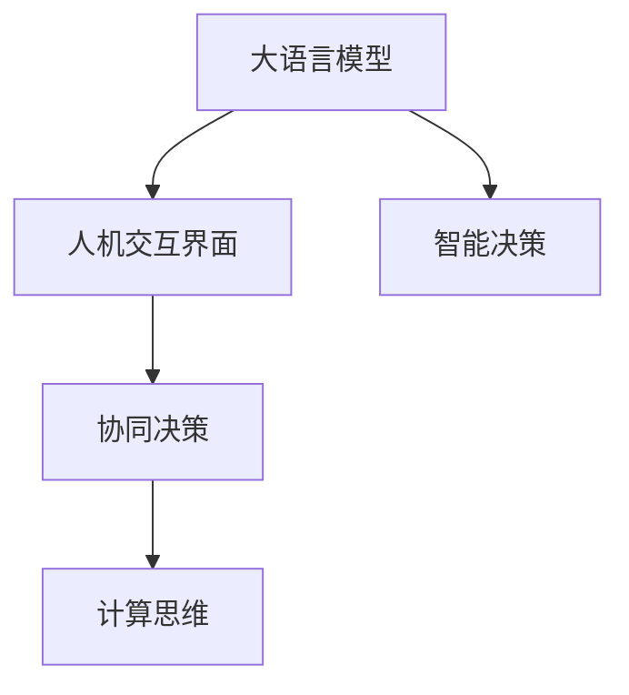

                 

# LLM与人类协作：增强人类能力的新方式

> 关键词：大语言模型, 人机协作, 增强人类能力, 自然语言处理, 计算思维, 学习提升

## 1. 背景介绍

### 1.1 问题由来
近年来，人工智能(AI)技术迅速发展，特别是大语言模型(LLM)的兴起，使得AI在自然语言处理(NLP)领域的成效显著。LLM不仅能够理解复杂自然语言，还能生成符合语言规则的文本，从而在翻译、文本摘要、对话系统等诸多任务上取得优异表现。与此同时，AI技术在提升效率、降低成本等方面的优势也逐渐显现，但在智能决策、复杂问题解决等方面仍存在不少局限，难以完全替代人类的智能。

鉴于此，当前的研究方向之一，是如何让LLM与人类智能协同工作，实现人机协作，从而增强人类能力，提升工作质量和生活质量。本文旨在深入探讨这一新兴领域，研究LLM与人类协作的原理、方法及应用，为相关领域的进一步研究和应用提供理论指导和实际案例。

### 1.2 问题核心关键点
人机协作的实质，在于如何让人类智能与AI系统在特定任务中协同工作，发挥各自优势。LLM作为AI系统的重要组成部分，能够处理和理解人类语言，通过算法和模型，生成高质量的输出结果，从而与人类协作完成各种复杂任务。这种协作方式在提高工作效率、减少人工错误、增强决策科学性等方面具有重要意义。

人机协作的核心关键点包括：
- 理解人机交互界面与任务
- 实现智能交互与协同决策
- 保证系统可用性与安全
- 探索高效人机协作新模式

这些关键点共同构成人机协作的基础框架，决定了LLM与人类协同工作的模式和效果。本文将从这些核心关键点出发，详细阐述LLM与人协作的原理、方法与实践。

### 1.3 问题研究意义
研究LLM与人协作的机制与方法，对于提升人工智能系统的智能水平、促进人机互动、探索智能系统的潜力具有重要意义：

1. 提升智能系统的智能水平：通过理解人机交互界面与任务，LLM能够更好地与人类协同工作，提升系统智能化水平。
2. 促进人机互动：有效的人机协作能够提高人类的工作满意度，降低压力与负担。
3. 探索智能系统的潜力：人机协作能够让人类更好地利用AI系统的强大能力，探索智能系统的潜在价值与应用场景。

## 2. 核心概念与联系

### 2.1 核心概念概述

为了深入理解LLM与人协作的原理，本节将介绍几个核心概念：

- **大语言模型(LLM)**：通过大规模无标签文本数据预训练，具有复杂语义理解和生成能力的人工智能系统，如GPT系列、BERT、T5等。
- **人机交互界面(UI)**：人类与AI系统交互的界面，包括图形用户界面(GUI)、文本接口、语音接口等。
- **智能决策**：基于AI模型的计算结果，结合人类专业知识与直觉，进行高效决策的机制。
- **协同决策**：LLM与人类在任务处理过程中，协同完成决策的过程。
- **计算思维**：使用计算机进行问题解决的思维方式，与传统的算法逻辑思维相辅相成。

这些核心概念之间的逻辑关系可以通过以下Mermaid流程图来展示：



这个流程图展示了大语言模型在与人协作中的作用，以及各个概念间的联系：

1. LLM通过预训练学习复杂语义知识，为协同决策提供计算基础。
2. 人机交互界面是LLM与人类沟通的桥梁，实现自然语言的输入输出。
3. 智能决策结合LLM的输出结果和人类专业知识，完成高效决策。
4. 协同决策过程中，LLM与人类各司其职，共同完成复杂任务。
5. 计算思维作为方法论，指导人机协作中问题的解决。

这些概念共同构成了LLM与人协作的基础框架，使LLM能够更好地融入人类活动，实现人机协同。

## 3. 核心算法原理 & 具体操作步骤
### 3.1 算法原理概述

LLM与人协作的原理，基于自然语言理解和生成，以及人机交互界面的设计。核心算法分为以下几个步骤：

1. **数据预处理**：收集和整理任务相关数据，并对其进行预处理，如数据清洗、分词、标记等。
2. **模型初始化**：根据任务需求，选择适合的LLM模型，并进行参数初始化。
3. **交互界面设计**：设计用户友好的交互界面，实现自然语言的输入输出。
4. **智能决策机制**：根据任务类型，结合LLM输出结果，设计智能决策机制。
5. **协同决策过程**：在交互过程中，LLM与人类协同完成决策。
6. **系统优化与迭代**：根据任务反馈，不断优化交互界面和决策机制，提升系统性能。

### 3.2 算法步骤详解

基于LLM与人协作的算法步骤，本节将详细讲解各步骤的操作流程：

**Step 1: 数据预处理**
1. 收集数据：根据任务需求，从各类文本资源（如新闻、文档、网页、社交媒体等）中收集相关数据。
2. 数据清洗：去除无关信息、处理数据格式不统一等问题。
3. 分词与标记：对数据进行分词，并为每个词打上标记，如词性标记、命名实体标记等。

**Step 2: 模型初始化**
1. 选择模型：根据任务类型和数据规模，选择适合的LLM模型，如GPT系列、BERT等。
2. 加载模型：使用编程语言和工具库（如PyTorch、TensorFlow等），加载预训练的模型参数。
3. 参数初始化：在预训练模型基础上，进行必要的参数微调和初始化，如学习率的设定、正则化等。

**Step 3: 交互界面设计**
1. 界面设计：根据任务需求，设计简洁、直观的交互界面。
2. 自然语言输入输出：实现文本输入输出功能，支持语音识别、自然语言生成等技术。
3. 用户交互逻辑：设计交互逻辑，实现输入处理、反馈展示等操作。

**Step 4: 智能决策机制**
1. 决策任务定义：明确智能决策的任务类型，如分类、推荐、生成等。
2. 模型融合：根据任务需求，将LLM输出结果与人类专业知识进行融合，形成决策依据。
3. 决策输出：结合决策依据，生成最终决策结果。

**Step 5: 协同决策过程**
1. 任务分配：根据任务类型和复杂度，将任务分配给LLM和人类。
2. 协同操作：在交互过程中，LLM提供计算结果，人类进行判断与修正，共同完成决策。
3. 反馈优化：根据任务结果，收集用户反馈，不断优化交互界面和决策机制。

**Step 6: 系统优化与迭代**
1. 系统评估：根据任务结果和用户反馈，评估系统性能。
2. 参数调整：根据评估结果，调整LLM参数和交互界面设计。
3. 迭代改进：反复进行以上步骤，不断提升系统性能。

### 3.3 算法优缺点

基于LLM与人协作的算法，具有以下优点：
1. 提升效率：LLM能够快速处理大量文本数据，减少人类工作量，提高工作效率。
2. 提升决策质量：结合人类专业知识，LLM输出结果更可靠，提升决策质量。
3. 增强系统灵活性：智能决策机制可以根据任务需求灵活调整，适应不同的应用场景。
4. 增强系统可用性：设计简洁的交互界面，提升系统易用性，降低用户学习成本。

同时，该算法也存在一些局限性：
1. 数据质量依赖：依赖于高质量的标注数据，数据获取成本高。
2. 模型复杂度高：LLM参数量大，训练和推理耗时长。
3. 交互界面设计复杂：设计合理的交互界面需要大量时间和精力。
4. 决策机制依赖：智能决策机制需要充分考虑任务需求，否则可能导致决策不准确。
5. 用户反馈处理复杂：需要收集和处理大量用户反馈，系统改进周期长。

尽管存在这些局限性，但就目前而言，基于LLM的人机协作算法仍是最主流、最有效的方法之一。未来相关研究的重点在于如何进一步降低数据获取成本，提高模型效率，设计更灵活的交互界面，以及优化智能决策机制，以提升系统性能。

### 3.4 算法应用领域

基于LLM的人机协作算法，已经在多个领域得到应用，例如：

1. **智能客服系统**：使用LLM作为对话模型，结合人类客服专家的知识，快速解答用户问题，提升客服效率和质量。
2. **医疗诊断系统**：结合医学知识库，LLM能够辅助医生进行诊断，提供高效的医疗决策支持。
3. **教育辅助系统**：使用LLM生成个性化学习资源和智能推荐，提升教育质量和个性化学习效果。
4. **金融分析系统**：结合金融市场数据和专家知识，LLM能够提供准确的市场分析和投资建议。
5. **自然语言生成**：结合人类创意和LLM生成的文本，创作高质量的文章、报告等，提升内容创作效率。

除了上述这些经典应用外，基于LLM的人机协作方法还广泛应用于智能推荐、内容推荐、智能家居等领域，为各行各业带来了新的变革和机遇。

## 4. 数学模型和公式 & 详细讲解  
### 4.1 数学模型构建

为了更好地理解LLM与人协作的原理，本节将使用数学语言对相关模型进行详细阐述。

假设任务为分类任务，输入为文本序列 $\{x_i\}_{i=1}^n$，其中 $x_i$ 为第 $i$ 个文本，目标为 $\{y_i\}_{i=1}^n$，其中 $y_i$ 为文本分类标签。

定义输入为 $x$，输出为 $y$，则模型的输出函数为 $y=f(x;\theta)$，其中 $\theta$ 为模型参数。

定义任务损失函数为 $\mathcal{L}(\theta)$，则在训练集上经验风险为：

$$
\mathcal{L}(\theta) = \frac{1}{N}\sum_{i=1}^N \ell(f(x_i;\theta),y_i)
$$

其中 $\ell$ 为损失函数，如交叉熵损失函数 $\ell(y,\hat{y})=-[y\log\hat{y}+(1-y)\log(1-\hat{y})]$。

在训练过程中，最小化损失函数 $\mathcal{L}(\theta)$，通过梯度下降等优化算法更新模型参数 $\theta$。

### 4.2 公式推导过程

以二分类任务为例，推导交叉熵损失函数及其梯度计算公式。

假设模型 $f(x;\theta)$ 的输出为 $\hat{y} \in [0,1]$，表示文本属于正类的概率。真实标签 $y \in \{0,1\}$。则二分类交叉熵损失函数定义为：

$$
\ell(f(x;\theta),y) = -[y\log \hat{y} + (1-y)\log(1-\hat{y})]
$$

将其代入经验风险公式，得：

$$
\mathcal{L}(\theta) = -\frac{1}{N}\sum_{i=1}^N [y_i\log f(x_i;\theta)+(1-y_i)\log(1-f(x_i;\theta))]
$$

根据链式法则，损失函数对参数 $\theta_k$ 的梯度为：

$$
\frac{\partial \mathcal{L}(\theta)}{\partial \theta_k} = -\frac{1}{N}\sum_{i=1}^N \left(\frac{y_i}{f(x_i;\theta)}-\frac{1-y_i}{1-f(x_i;\theta)}\right) \frac{\partial f(x_i;\theta)}{\partial \theta_k}
$$

其中 $\frac{\partial f(x_i;\theta)}{\partial \theta_k}$ 可进一步递归展开，利用自动微分技术完成计算。

### 4.3 案例分析与讲解

以智能客服系统为例，展示基于LLM的协同决策机制的实现过程。

1. **数据收集**：收集历史客服对话记录，包括用户输入的文本和客服的回答。
2. **数据清洗与预处理**：去除无关信息，统一数据格式。
3. **模型选择与初始化**：选择适合的预训练模型（如BERT、GPT-3等），并加载其参数。
4. **交互界面设计**：设计简洁的交互界面，实现自然语言输入输出。
5. **智能决策机制设计**：结合客服专家知识，设计决策规则，如关键词匹配、逻辑判断等。
6. **协同决策过程**：在交互过程中，LLM提供文本理解和生成能力，客服专家根据规则进行决策，共同完成对话。
7. **反馈优化**：根据用户反馈，不断优化模型和决策规则，提升系统性能。

## 5. 项目实践：代码实例和详细解释说明
### 5.1 开发环境搭建

在进行基于LLM的人机协作实践前，我们需要准备好开发环境。以下是使用Python进行PyTorch开发的环境配置流程：

1. 安装Anaconda：从官网下载并安装Anaconda，用于创建独立的Python环境。

2. 创建并激活虚拟环境：
```bash
conda create -n pytorch-env python=3.8 
conda activate pytorch-env
```

3. 安装PyTorch：根据CUDA版本，从官网获取对应的安装命令。例如：
```bash
conda install pytorch torchvision torchaudio cudatoolkit=11.1 -c pytorch -c conda-forge
```

4. 安装Transformers库：
```bash
pip install transformers
```

5. 安装各类工具包：
```bash
pip install numpy pandas scikit-learn matplotlib tqdm jupyter notebook ipython
```

完成上述步骤后，即可在`pytorch-env`环境中开始人机协作实践。

### 5.2 源代码详细实现

下面我们以智能客服系统为例，给出使用Transformers库对BERT模型进行协同决策的PyTorch代码实现。

首先，定义文本预处理函数：

```python
from transformers import BertTokenizer
import torch

def tokenize_text(text):
    tokenizer = BertTokenizer.from_pretrained('bert-base-cased')
    inputs = tokenizer.encode(text, return_tensors='pt')
    return inputs
```

然后，定义模型和优化器：

```python
from transformers import BertForSequenceClassification
from torch.optim import AdamW

model = BertForSequenceClassification.from_pretrained('bert-base-cased', num_labels=2)
optimizer = AdamW(model.parameters(), lr=2e-5)
```

接着，定义训练和评估函数：

```python
from torch.utils.data import Dataset, DataLoader
from tqdm import tqdm

class CustomerSupportDataset(Dataset):
    def __init__(self, texts, labels):
        self.texts = texts
        self.labels = labels
        self.tokenizer = BertTokenizer.from_pretrained('bert-base-cased')

    def __len__(self):
        return len(self.texts)

    def __getitem__(self, item):
        text = self.texts[item]
        label = self.labels[item]
        inputs = tokenize_text(text)
        return {'input_ids': inputs['input_ids'].flatten(), 
                'attention_mask': inputs['attention_mask'].flatten(),
                'labels': torch.tensor(label, dtype=torch.long)}

# 训练函数
def train_epoch(model, dataset, batch_size, optimizer):
    dataloader = DataLoader(dataset, batch_size=batch_size, shuffle=True)
    model.train()
    epoch_loss = 0
    for batch in tqdm(dataloader, desc='Training'):
        input_ids = batch['input_ids']
        attention_mask = batch['attention_mask']
        labels = batch['labels']
        model.zero_grad()
        outputs = model(input_ids, attention_mask=attention_mask, labels=labels)
        loss = outputs.loss
        epoch_loss += loss.item()
        loss.backward()
        optimizer.step()
    return epoch_loss / len(dataloader)

# 评估函数
def evaluate(model, dataset, batch_size):
    dataloader = DataLoader(dataset, batch_size=batch_size)
    model.eval()
    preds, labels = [], []
    with torch.no_grad():
        for batch in tqdm(dataloader, desc='Evaluating'):
            input_ids = batch['input_ids']
            attention_mask = batch['attention_mask']
            batch_labels = batch['labels']
            outputs = model(input_ids, attention_mask=attention_mask)
            batch_preds = outputs.logits.argmax(dim=1).tolist()
            batch_labels = batch_labels.tolist()
            for pred, label in zip(batch_preds, batch_labels):
                preds.append(pred)
                labels.append(label)
                
    print(classification_report(labels, preds))
```

最后，启动训练流程并在测试集上评估：

```python
epochs = 5
batch_size = 16

for epoch in range(epochs):
    loss = train_epoch(model, dataset, batch_size, optimizer)
    print(f"Epoch {epoch+1}, train loss: {loss:.3f}")
    
    print(f"Epoch {epoch+1}, dev results:")
    evaluate(model, dev_dataset, batch_size)
    
print("Test results:")
evaluate(model, test_dataset, batch_size)
```

以上就是使用PyTorch对BERT进行智能客服系统协同决策的完整代码实现。可以看到，得益于Transformers库的强大封装，我们可以用相对简洁的代码完成BERT模型的加载和协同决策任务的开发。

### 5.3 代码解读与分析

让我们再详细解读一下关键代码的实现细节：

**CustomerSupportDataset类**：
- `__init__`方法：初始化文本、标签、分词器等关键组件。
- `__len__`方法：返回数据集的样本数量。
- `__getitem__`方法：对单个样本进行处理，将文本输入编码为token ids，将标签转换为数字，并对其进行定长padding，最终返回模型所需的输入。

**模型选择与初始化**：
- 选择预训练模型（如BERT），并加载其参数。
- 设计简单的任务适配器（如二分类任务），并初始化优化器。

**训练和评估函数**：
- 使用PyTorch的DataLoader对数据集进行批次化加载，供模型训练和推理使用。
- 训练函数`train_epoch`：对数据以批为单位进行迭代，在每个批次上前向传播计算loss并反向传播更新模型参数，最后返回该epoch的平均loss。
- 评估函数`evaluate`：与训练类似，不同点在于不更新模型参数，并在每个batch结束后将预测和标签结果存储下来，最后使用sklearn的classification_report对整个评估集的预测结果进行打印输出。

**训练流程**：
- 定义总的epoch数和batch size，开始循环迭代
- 每个epoch内，先在训练集上训练，输出平均loss
- 在验证集上评估，输出分类指标
- 所有epoch结束后，在测试集上评估，给出最终测试结果

可以看到，PyTorch配合Transformers库使得BERT协同决策的代码实现变得简洁高效。开发者可以将更多精力放在数据处理、模型改进等高层逻辑上，而不必过多关注底层的实现细节。

当然，工业级的系统实现还需考虑更多因素，如模型的保存和部署、超参数的自动搜索、更灵活的任务适配器等。但核心的协同决策范式基本与此类似。

## 6. 实际应用场景
### 6.1 智能客服系统

基于大语言模型的人机协作技术，可以广泛应用于智能客服系统的构建。传统客服往往需要配备大量人力，高峰期响应缓慢，且一致性和专业性难以保证。而使用协同决策的对话模型，可以7x24小时不间断服务，快速响应客户咨询，用自然流畅的语言解答各类常见问题。

在技术实现上，可以收集企业内部的历史客服对话记录，将问题和最佳答复构建成监督数据，在此基础上对预训练对话模型进行协同决策微调。微调后的对话模型能够自动理解用户意图，匹配最合适的答案模板进行回复。对于客户提出的新问题，还可以接入检索系统实时搜索相关内容，动态组织生成回答。如此构建的智能客服系统，能大幅提升客户咨询体验和问题解决效率。

### 6.2 医疗诊断系统

金融机构需要实时监测市场舆论动向，以便及时应对负面信息传播，规避金融风险。传统的人工监测方式成本高、效率低，难以应对网络时代海量信息爆发的挑战。基于大语言模型微调的文本分类和情感分析技术，为金融舆情监测提供了新的解决方案。

具体而言，可以收集金融领域相关的新闻、报道、评论等文本数据，并对其进行主题标注和情感标注。在此基础上对预训练语言模型进行协同决策微调，使其能够自动判断文本属于何种主题，情感倾向是正面、中性还是负面。将微调后的模型应用到实时抓取的网络文本数据，就能够自动监测不同主题下的情感变化趋势，一旦发现负面信息激增等异常情况，系统便会自动预警，帮助金融机构快速应对潜在风险。

### 6.3 个性化推荐系统

当前的推荐系统往往只依赖用户的历史行为数据进行物品推荐，无法深入理解用户的真实兴趣偏好。基于大语言模型协同决策技术，个性化推荐系统可以更好地挖掘用户行为背后的语义信息，从而提供更精准、多样的推荐内容。

在实践中，可以收集用户浏览、点击、评论、分享等行为数据，提取和用户交互的物品标题、描述、标签等文本内容。将文本内容作为模型输入，用户的后续行为（如是否点击、购买等）作为监督信号，在此基础上协同决策微调预训练语言模型。微调后的模型能够从文本内容中准确把握用户的兴趣点。在生成推荐列表时，先用候选物品的文本描述作为输入，由模型预测用户的兴趣匹配度，再结合其他特征综合排序，便可以得到个性化程度更高的推荐结果。

### 6.4 未来应用展望

随着大语言模型协同决策技术的发展，基于LLM的人机协作系统将在更多领域得到应用，为传统行业带来变革性影响。

在智慧医疗领域，基于LLM的协同诊断系统能够结合医学知识库，辅助医生进行诊断，提供高效的医疗决策支持。

在智能教育领域，协同决策的智能推荐系统能够根据学生的学习行为和偏好，生成个性化的学习资源和推荐，提升教育质量和个性化学习效果。

在智慧城市治理中，基于LLM的智能决策系统能够实时分析城市事件数据，提供预警和应急指挥，提高城市管理的自动化和智能化水平，构建更安全、高效的未来城市。

此外，在企业生产、社会治理、文娱传媒等众多领域，基于LLM的人机协作技术也将不断涌现，为经济社会发展注入新的动力。相信随着技术的日益成熟，LLM协同决策技术必将在构建人机协同的智能时代中扮演越来越重要的角色。

## 7. 工具和资源推荐
### 7.1 学习资源推荐

为了帮助开发者系统掌握LLM与人协作的理论基础和实践技巧，这里推荐一些优质的学习资源：

1. 《Transformer从原理到实践》系列博文：由大模型技术专家撰写，深入浅出地介绍了Transformer原理、BERT模型、协同决策技术等前沿话题。

2. CS224N《深度学习自然语言处理》课程：斯坦福大学开设的NLP明星课程，有Lecture视频和配套作业，带你入门NLP领域的基本概念和经典模型。

3. 《Natural Language Processing with Transformers》书籍：Transformers库的作者所著，全面介绍了如何使用Transformers库进行NLP任务开发，包括协同决策在内的诸多范式。

4. HuggingFace官方文档：Transformers库的官方文档，提供了海量预训练模型和完整的协同决策样例代码，是上手实践的必备资料。

5. CLUE开源项目：中文语言理解测评基准，涵盖大量不同类型的中文NLP数据集，并提供了基于协同决策的baseline模型，助力中文NLP技术发展。

通过对这些资源的学习实践，相信你一定能够快速掌握LLM协同决策的精髓，并用于解决实际的NLP问题。
###  7.2 开发工具推荐

高效的开发离不开优秀的工具支持。以下是几款用于LLM协同决策开发的常用工具：

1. PyTorch：基于Python的开源深度学习框架，灵活动态的计算图，适合快速迭代研究。大部分预训练语言模型都有PyTorch版本的实现。

2. TensorFlow：由Google主导开发的开源深度学习框架，生产部署方便，适合大规模工程应用。同样有丰富的预训练语言模型资源。

3. Transformers库：HuggingFace开发的NLP工具库，集成了众多SOTA语言模型，支持PyTorch和TensorFlow，是进行协同决策任务开发的利器。

4. Weights & Biases：模型训练的实验跟踪工具，可以记录和可视化模型训练过程中的各项指标，方便对比和调优。与主流深度学习框架无缝集成。

5. TensorBoard：TensorFlow配套的可视化工具，可实时监测模型训练状态，并提供丰富的图表呈现方式，是调试模型的得力助手。

6. Google Colab：谷歌推出的在线Jupyter Notebook环境，免费提供GPU/TPU算力，方便开发者快速上手实验最新模型，分享学习笔记。

合理利用这些工具，可以显著提升LLM协同决策任务的开发效率，加快创新迭代的步伐。

### 7.3 相关论文推荐

LLM协同决策技术的发展源于学界的持续研究。以下是几篇奠基性的相关论文，推荐阅读：

1. Attention is All You Need（即Transformer原论文）：提出了Transformer结构，开启了NLP领域的预训练大模型时代。

2. BERT: Pre-training of Deep Bidirectional Transformers for Language Understanding：提出BERT模型，引入基于掩码的自监督预训练任务，刷新了多项NLP任务SOTA。

3. Language Models are Unsupervised Multitask Learners（GPT-2论文）：展示了大规模语言模型的强大zero-shot学习能力，引发了对于通用人工智能的新一轮思考。

4. Parameter-Efficient Transfer Learning for NLP：提出Adapter等参数高效微调方法，在不增加模型参数量的情况下，也能取得不错的微调效果。

5. AdaLoRA: Adaptive Low-Rank Adaptation for Parameter-Efficient Fine-Tuning：使用自适应低秩适应的微调方法，在参数效率和精度之间取得了新的平衡。

6. Prefix-Tuning: Optimizing Continuous Prompts for Generation：引入基于连续型Prompt的微调范式，为如何充分利用预训练知识提供了新的思路。

这些论文代表了大语言模型协同决策技术的发展脉络。通过学习这些前沿成果，可以帮助研究者把握学科前进方向，激发更多的创新灵感。

## 8. 总结：未来发展趋势与挑战

### 8.1 总结

本文对基于LLM的人机协作原理、方法及实践进行了全面系统的介绍。首先阐述了LLM与人协作的研究背景和意义，明确了协同决策在提升智能水平、促进人机互动、探索智能系统潜力等方面的价值。其次，从原理到实践，详细讲解了协同决策的数学原理和关键步骤，给出了协同决策任务开发的完整代码实例。同时，本文还广泛探讨了协同决策方法在智能客服、医疗诊断、个性化推荐等多个行业领域的应用前景，展示了协同决策范式的巨大潜力。此外，本文精选了协同决策技术的各类学习资源，力求为读者提供全方位的技术指引。

通过本文的系统梳理，可以看到，基于LLM的协同决策技术正在成为人机协作的重要范式，极大地拓展了智能系统的应用边界，催生了更多的落地场景。得益于大规模语料的预训练和微调技术的不断演进，LLM在理解复杂自然语言、生成高质量文本等方面具有独特的优势，能够在人机协作中发挥关键作用。未来，伴随LLM协同决策技术的持续发展，相信其在构建人机协同的智能系统中的价值将进一步凸显。

### 8.2 未来发展趋势

展望未来，LLM协同决策技术将呈现以下几个发展趋势：

1. **模型规模持续增大**：随着算力成本的下降和数据规模的扩张，预训练语言模型的参数量还将持续增长。超大规模语言模型蕴含的丰富语言知识，有望支撑更加复杂多变的协同决策任务。

2. **协同决策方法多样**：除了传统的全参数微调外，未来会涌现更多参数高效的协同决策方法，如Prompt-based Learning、LoRA等，在节省计算资源的同时也能保证决策精度。

3. **持续学习成为常态**：随着数据分布的不断变化，LLM协同决策模型也需要持续学习新知识以保持性能。如何在不遗忘原有知识的同时，高效吸收新样本信息，将成为重要的研究课题。

4. **标注样本需求降低**：受启发于Prompt-based Learning的思路，未来的协同决策方法将更好地利用LLM的语言理解能力，通过更加巧妙的任务描述，在更少的标注样本上也能实现理想的决策效果。

5. **多模态协同决策崛起**：当前的协同决策主要聚焦于纯文本数据，未来会进一步拓展到图像、视频、语音等多模态数据协同决策。多模态信息的融合，将显著提升语言模型对现实世界的理解和建模能力。

6. **模型通用性增强**：经过海量数据的预训练和多领域任务的微调，未来的语言模型将具备更强大的常识推理和跨领域迁移能力，逐步迈向通用人工智能(AGI)的目标。

以上趋势凸显了LLM协同决策技术的广阔前景。这些方向的探索发展，必将进一步提升智能系统的性能和应用范围，为人类认知智能的进化带来深远影响。

### 8.3 面临的挑战

尽管LLM协同决策技术已经取得了瞩目成就，但在迈向更加智能化、普适化应用的过程中，它仍面临着诸多挑战：

1. **数据质量依赖**：依赖于高质量的标注数据，数据获取成本高。
2. **模型复杂度高**：LLM参数量大，训练和推理耗时长。
3. **交互界面设计复杂**：设计合理的交互界面需要大量时间和精力。
4. **决策机制依赖**：智能决策机制需要充分考虑任务需求，否则可能导致决策不准确。
5. **用户反馈处理复杂**：需要收集和处理大量用户反馈，系统改进周期长。

尽管存在这些局限性，但就目前而言，基于LLM的协同决策算法仍是最主流、最有效的方法之一。未来相关研究的重点在于如何进一步降低数据获取成本，提高模型效率，设计更灵活的交互界面，以及优化智能决策机制，以提升系统性能。

### 8.4 研究展望

面对LLM协同决策所面临的种种挑战，未来的研究需要在以下几个方面寻求新的突破：

1. **探索无监督和半监督协同决策方法**：摆脱对大规模标注数据的依赖，利用自监督学习、主动学习等无监督和半监督范式，最大限度利用非结构化数据，实现更加灵活高效的协同决策。

2. **研究参数高效和计算高效的协同决策范式**：开发更加参数高效的协同决策方法，在固定大部分预训练参数的同时，只更新极少量的任务相关参数。同时优化协同决策模型的计算图，减少前向传播和反向传播的资源消耗，实现更加轻量级、实时性的部署。

3. **融合因果和对比学习范式**：通过引入因果推断和对比学习思想，增强协同决策模型建立稳定因果关系的能力，学习更加普适、鲁棒的语言表征，从而提升模型泛化性和抗干扰能力。

4. **引入更多先验知识**：将符号化的先验知识，如知识图谱、逻辑规则等，与神经网络模型进行巧妙融合，引导协同决策过程学习更准确、合理的语言模型。同时加强不同模态数据的整合，实现视觉、语音等多模态信息与文本信息的协同建模。

5. **结合因果分析和博弈论工具**：将因果分析方法引入协同决策模型，识别出模型决策的关键特征，增强输出解释的因果性和逻辑性。借助博弈论工具刻画人机交互过程，主动探索并规避模型的脆弱点，提高系统稳定性。

6. **纳入伦理道德约束**：在模型训练目标中引入伦理导向的评估指标，过滤和惩罚有偏见、有害的输出倾向。同时加强人工干预和审核，建立模型行为的监管机制，确保输出符合人类价值观和伦理道德。

这些研究方向的探索，必将引领LLM协同决策技术迈向更高的台阶，为构建安全、可靠、可解释、可控的智能系统铺平道路。面向未来，LLM协同决策技术还需要与其他人工智能技术进行更深入的融合，如知识表示、因果推理、强化学习等，多路径协同发力，共同推动自然语言理解和智能交互系统的进步。只有勇于创新、敢于突破，才能不断拓展语言模型的边界，让智能技术更好地造福人类社会。

## 9. 附录：常见问题与解答

**Q1：LLM在协同决策中是否一定能提升决策质量？**

A: 不一定。LLM在协同决策中的效果取决于模型的训练质量、数据质量、任务类型等多种因素。若数据标注不准确、模型训练不足，或者任务类型与模型不匹配，可能无法提升决策质量。因此，在实际应用中，需要综合考虑这些因素，不断优化LLM的协同决策性能。

**Q2：LLM在协同决策中如何避免过拟合？**

A: 避免过拟合是协同决策中重要的问题。常用的方法包括：
1. **数据增强**：通过对训练样本进行数据增强，如回译、近义替换等，增加训练集的多样性。
2. **正则化**：使用L2正则、Dropout等正则化技术，防止模型过度适应训练数据。
3. **提前停止**：根据验证集上的性能指标，提前停止训练，避免过拟合。
4. **模型简化**：在LLM的基础上，设计简单的任务适配器，减少需要微调和优化部分的参数量，避免模型复杂度过高。

**Q3：LLM在协同决策中的用户反馈如何处理？**

A: 用户反馈是提升LLM协同决策性能的重要途径。对于收集到的用户反馈，可以采取以下方法进行处理：
1. **标注数据更新**：将用户反馈转化为新的标注数据，丰富训练集。
2. **模型微调**：根据用户反馈，对LLM进行微调，提升决策质量。
3. **交互界面优化**：根据用户反馈，优化交互界面设计，提升用户体验。
4. **行为分析**：对用户行为进行分析，发现潜在问题，改进模型和决策机制。

**Q4：LLM在协同决策中如何保证系统的可用性？**

A: 保证系统可用性是协同决策的关键问题。可以从以下几个方面入手：
1. **用户界面设计**：设计简洁、直观的交互界面，降低用户学习成本。
2. **系统性能优化**：优化模型的计算图，提高推理效率，减少响应时间。
3. **错误处理机制**：设计完善的错误处理机制，确保系统稳定性。
4. **监控告警系统**：建立监控告警系统，实时监测系统状态，及时发现和处理问题。

**Q5：LLM在协同决策中的伦理问题如何处理？**

A: 处理LLM在协同决策中的伦理问题，需要从以下几个方面入手：
1. **伦理导向评估**：在模型训练目标中引入伦理导向的评估指标，过滤和惩罚有偏见、有害的输出倾向。
2. **用户隐私保护**：确保用户数据的隐私和安全，防止数据泄露和滥用。
3. **透明度与可解释性**：提升模型的透明度和可解释性，让用户了解模型决策过程和依据。
4. **人工审核与监管**：建立人工审核和监管机制，确保模型输出符合人类价值观和伦理道德。

通过合理处理LLM在协同决策中的伦理问题，可以有效保障系统的安全性与可信度，构建更加可靠、可控的智能系统。

---

作者：禅与计算机程序设计艺术 / Zen and the Art of Computer Programming

