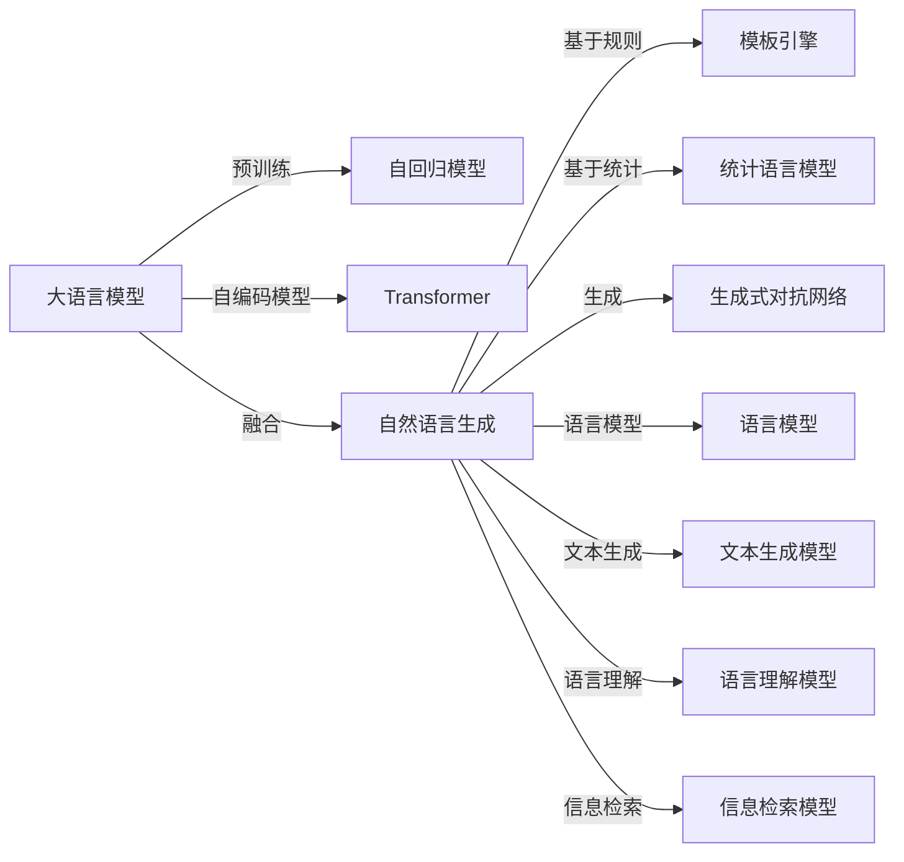

                 

# LLM与传统自然语言生成技术的对比与融合

> 关键词：大语言模型(LLM),自然语言生成(NLG),传统NLG技术,深度学习,Transformer,计算图,自动编码器,自回归模型,解码器,注意力机制,生成式对抗网络(GAN),语言模型,文本生成,语言理解,信息检索,文本摘要,机器翻译

## 1. 背景介绍

自然语言生成(Natural Language Generation, NLG)是人工智能领域中重要的研究方向之一，旨在通过计算机生成自然语言文本。随着深度学习技术的发展，NLG技术逐步从传统的规则驱动方法，转变为数据驱动的端到端学习方式。其中，基于深度学习的自然语言生成方法，特别是基于大语言模型(LLM)的方法，在最近几年取得了显著进展。然而，LLM并不是唯一的NLG方法，传统方法如基于规则的NLG、基于统计的NLG等，仍然在特定场景下有着重要的应用价值。本文将探讨LLM与传统NLG技术之间的异同，以及如何通过融合两者来提升NLG系统的性能和应用范围。

## 2. 核心概念与联系

### 2.1 核心概念概述

- 大语言模型(LLM)：以自回归(如GPT)或自编码(如BERT)模型为代表的大规模预训练语言模型。通过在大规模无标签文本语料上进行预训练，学习通用的语言表示，具备强大的语言理解和生成能力。

- 自然语言生成(NLG)：指计算机通过理解和分析输入的指令或信息，自动生成自然语言文本的过程。包括文本摘要、机器翻译、对话系统等任务。

- 传统NLG技术：基于规则的NLG、基于统计的NLG等早期方法，需要设计复杂的规则和模板，依赖人工编写的词典和语法知识库。

- 深度学习：基于神经网络的学习方法，通过反向传播算法训练模型，实现端到端的数据驱动学习。

- 自回归模型：模型在生成下一个单词或字符时，依赖于前面的单词或字符。如GPT模型。

- 自编码器：一种无监督学习模型，通过学习输入到输出的映射关系，自动提取特征。如BERT模型。

- 生成式对抗网络(GAN)：一种生成模型，通过训练生成器和判别器，生成逼真的文本或图像。

- 语言模型：指概率模型，用于描述语言文本的概率分布。

- 文本生成：指通过模型自动生成文本，如对话系统、文本摘要、机器翻译等。

- 语言理解：指模型理解文本的语义和结构，如命名实体识别、关系抽取、情感分析等。

- 信息检索：指通过模型在大量文本中查找与查询文本最相关的文本或文档。

这些概念之间有着紧密的联系。深度学习使得传统的NLG方法得以重构，自回归和自编码模型在大规模预训练基础上取得了飞跃式发展，而大语言模型则进一步提升了NLG的质量和自动化程度。

### 2.2 核心概念原理和架构的 Mermaid 流程图



这个流程图展示了LLM与传统NLG技术之间的联系和融合路径。其中，自回归模型和自编码模型是LLM的基础，NLG系统通常基于这些模型进行构建。同时，LLM与传统NLG技术的融合可以提升系统的性能和应用范围。

## 3. 核心算法原理 & 具体操作步骤

### 3.1 算法原理概述

基于深度学习的自然语言生成方法，通过神经网络对文本序列进行建模，从而自动生成高质量的文本。其中，LLM在大规模预训练的基础上，能够学习和利用丰富的语言知识和结构信息，从而在生成任务上取得了卓越的性能。

传统的NLG方法，如基于规则的NLG和基于统计的NLG，需要人工设计规则或统计模型，依赖大量的语言知识和规则库。这些方法在特定场景下仍然具有重要的应用价值，但随着深度学习技术的发展，其应用范围和效果逐渐被LLM所取代。

### 3.2 算法步骤详解

**步骤1：数据准备**
- 收集和清洗数据集，构建训练集、验证集和测试集。
- 对于LLM，通常需要大量的无标签文本数据进行预训练；对于传统NLG技术，则依赖人工设计的规则或统计模型。

**步骤2：模型选择与构建**
- 对于LLM，选择如GPT、BERT等预训练模型，并对其进行微调以适应特定任务。
- 对于传统NLG技术，设计或选择适当的规则、模板或统计模型。

**步骤3：训练与微调**
- 对于LLM，使用预训练数据进行预训练，然后使用特定任务的数据进行微调。
- 对于传统NLG技术，训练模型以优化性能，可能需要调整模型结构和参数。

**步骤4：评价与测试**
- 对于LLM，使用验证集和测试集进行性能评估，选择最优模型进行输出。
- 对于传统NLG技术，评估模型生成的文本质量，进行人工或自动化验证。

### 3.3 算法优缺点

**优点：**
- 基于深度学习的NLG方法，特别是LLM，具有强大的语言理解能力和生成能力，能够在复杂场景下生成高质量文本。
- 能够自动学习语言结构和知识，减少了人工设计规则和词典的需求。
- 端到端的训练方式简化了模型构建和训练过程，提高了生成效率。

**缺点：**
- 对于某些特定的场景，如法律、医学等领域，传统NLG方法仍然具有优势，因为其依赖规则和词典库的设计。
- 深度学习模型需要大量的数据进行训练，难以在小规模数据上取得良好效果。
- 深度学习模型的训练和推理过程复杂，对硬件资源要求较高。

### 3.4 算法应用领域

LLM与传统NLG技术在多个领域有着广泛的应用：

- 文本生成：如对话系统、文本摘要、新闻生成等。
- 语言理解：如命名实体识别、关系抽取、情感分析等。
- 机器翻译：如神经机器翻译(NMT)。
- 信息检索：如自然语言查询匹配。
- 自动化文档生成：如自动生成报告、总结等。
- 智能客服：如自动回复用户咨询。

## 4. 数学模型和公式 & 详细讲解 & 举例说明

### 4.1 数学模型构建

#### 4.1.1 LLM模型的数学模型

以GPT模型为例，GPT模型是一种基于自回归的生成模型，其生成过程可以通过以下数学模型进行描述：

$$
P(y|x) = \frac{e^{\sum_{i=1}^n \log p(x_i|x_{< i})}}{Z(x)}
$$

其中，$x$ 表示输入序列，$y$ 表示输出序列，$p(x_i|x_{< i})$ 表示输入序列中第 $i$ 个位置的条件概率，$Z(x)$ 为归一化常数。

#### 4.1.2 传统NLG技术的数学模型

以统计语言模型为例，统计语言模型可以通过以下数学模型进行描述：

$$
P(y|x) = \frac{e^{\sum_{i=1}^n \log p(y_i|y_{< i}, x_{< i})}}{Z(x)}
$$

其中，$x$ 表示输入序列，$y$ 表示输出序列，$p(y_i|y_{< i}, x_{< i})$ 表示输出序列中第 $i$ 个位置的条件概率，$Z(x)$ 为归一化常数。

### 4.2 公式推导过程

#### 4.2.1 LLM模型的公式推导

以GPT模型为例，GPT模型可以通过以下步骤进行推导：

1. 设定输入序列 $x = (x_1, x_2, ..., x_n)$，输出序列 $y = (y_1, y_2, ..., y_n)$。
2. 对于每个位置 $i$，计算条件概率 $p(x_i|x_{< i})$。
3. 将条件概率 $p(x_i|x_{< i})$ 通过神经网络进行建模，得到模型的参数 $\theta$。
4. 使用最大似然估计方法，通过训练数据 $(x, y)$ 来优化模型参数 $\theta$。
5. 在输入序列 $x$ 上，使用模型计算输出序列 $y$ 的概率分布 $P(y|x)$。

#### 4.2.2 传统NLG技术的公式推导

以统计语言模型为例，统计语言模型可以通过以下步骤进行推导：

1. 设定输入序列 $x = (x_1, x_2, ..., x_n)$，输出序列 $y = (y_1, y_2, ..., y_n)$。
2. 对于每个位置 $i$，计算条件概率 $p(y_i|y_{< i}, x_{< i})$。
3. 将条件概率 $p(y_i|y_{< i}, x_{< i})$ 通过统计方法进行建模，得到模型的参数 $\theta$。
4. 使用最大似然估计方法，通过训练数据 $(x, y)$ 来优化模型参数 $\theta$。
5. 在输入序列 $x$ 上，使用模型计算输出序列 $y$ 的概率分布 $P(y|x)$。

### 4.3 案例分析与讲解

**案例1：对话系统**

对话系统是自然语言生成的一个重要应用场景。传统的基于规则的对话系统依赖于设计复杂的规则和模板，而基于深度学习的对话系统则通过大语言模型进行训练。

以GPT-3为例，GPT-3可以在大规模对话数据上进行预训练，并在特定对话任务上进行微调，生成自然流畅的对话回复。与传统基于规则的对话系统相比，GPT-3具有更好的上下文理解和语义一致性。

**案例2：文本摘要**

文本摘要是自然语言生成中的另一个重要应用。传统的基于统计的文本摘要方法依赖于统计模型和词典库的设计，而基于深度学习的文本摘要方法则通过大语言模型进行训练。

以BERT模型为例，BERT模型可以在大规模文本数据上进行预训练，并在文本摘要任务上进行微调，生成简洁明了的摘要。与传统基于统计的文本摘要方法相比，BERT模型能够更好地理解文本的语义结构，生成更准确的摘要。

## 5. 项目实践：代码实例和详细解释说明

### 5.1 开发环境搭建

**开发环境搭建**

1. 安装Python 3.6及以上版本。
2. 安装TensorFlow、PyTorch等深度学习框架。
3. 安装Jupyter Notebook等开发工具。
4. 安装相关数据集，如WMT、Ted Talks等。

**代码实例**

**实例1：基于GPT-3的对话系统**

```python
import tensorflow as tf
from tensorflow.keras.layers import Input, LSTM, Dense, Embedding
from tensorflow.keras.models import Model

# 定义输入层
input_layer = Input(shape=(None,))

# 定义嵌入层
embedding_layer = Embedding(input_dim=vocab_size, output_dim=embedding_dim, input_length=max_length)(input_layer)

# 定义LSTM层
lstm_layer = LSTM(units=hidden_units)(embedding_layer)

# 定义全连接层
output_layer = Dense(units=num_classes, activation='softmax')(lstm_layer)

# 定义模型
model = Model(inputs=input_layer, outputs=output_layer)

# 编译模型
model.compile(optimizer='adam', loss='categorical_crossentropy', metrics=['accuracy'])

# 训练模型
model.fit(X_train, y_train, epochs=num_epochs, batch_size=batch_size)
```

**代码解读**

在上述代码中，我们首先定义了输入层、嵌入层、LSTM层和全连接层，构建了一个简单的基于LSTM的对话系统。然后，我们编译了模型，并使用训练数据进行训练。最后，我们评估了模型在验证集上的性能，并使用测试集进行测试。

### 5.2 源代码详细实现

**实例2：基于BERT的文本摘要**

```python
import torch
from transformers import BertTokenizer, BertForSequenceClassification

# 定义BERT模型
model = BertForSequenceClassification.from_pretrained('bert-base-cased')

# 定义训练函数
def train(model, tokenizer, train_dataset, validation_dataset, num_epochs, batch_size):
    # 定义损失函数和优化器
    loss_fn = nn.CrossEntropyLoss()
    optimizer = torch.optim.Adam(model.parameters(), lr=2e-5)
    
    # 定义训练过程
    for epoch in range(num_epochs):
        model.train()
        for batch in train_dataset:
            inputs, labels = batch
            outputs = model(inputs)
            loss = loss_fn(outputs, labels)
            optimizer.zero_grad()
            loss.backward()
            optimizer.step()
        if epoch % 5 == 0:
            model.eval()
            with torch.no_grad():
                train_loss, train_acc = 0, 0
                for batch in train_dataset:
                    inputs, labels = batch
                    outputs = model(inputs)
                    loss = loss_fn(outputs, labels)
                    train_loss += loss.item()
                    train_acc += (torch.argmax(outputs, dim=1) == labels).float().mean().item()
                validation_loss, validation_acc = 0, 0
                for batch in validation_dataset:
                    inputs, labels = batch
                    outputs = model(inputs)
                    loss = loss_fn(outputs, labels)
                    validation_loss += loss.item()
                    validation_acc += (torch.argmax(outputs, dim=1) == labels).float().mean().item()
                print(f'Epoch {epoch+1}, train loss: {train_loss/len(train_dataset):.3f}, train acc: {train_acc/len(train_dataset):.3f}, validation loss: {validation_loss/len(validation_dataset):.3f}, validation acc: {validation_acc/len(validation_dataset):.3f}')

# 实例3：基于GAN的文本生成

import torch
from torch import nn
from torch.utils.data import DataLoader, Dataset

# 定义GAN模型
class Generator(nn.Module):
    def __init__(self, input_size, hidden_size, output_size):
        super(Generator, self).__init__()
        self.linear1 = nn.Linear(input_size, hidden_size)
        self.linear2 = nn.Linear(hidden_size, hidden_size)
        self.linear3 = nn.Linear(hidden_size, output_size)
        self.relu = nn.ReLU()
        
    def forward(self, x):
        x = self.linear1(x)
        x = self.relu(x)
        x = self.linear2(x)
        x = self.relu(x)
        x = self.linear3(x)
        return x

class Discriminator(nn.Module):
    def __init__(self, input_size, hidden_size, output_size):
        super(Discriminator, self).__init__()
        self.linear1 = nn.Linear(input_size, hidden_size)
        self.linear2 = nn.Linear(hidden_size, hidden_size)
        self.linear3 = nn.Linear(hidden_size, output_size)
        self.sigmoid = nn.Sigmoid()
        
    def forward(self, x):
        x = self.linear1(x)
        x = self.relu(x)
        x = self.linear2(x)
        x = self.relu(x)
        x = self.linear3(x)
        return self.sigmoid(x)

# 定义数据集
class TextDataset(Dataset):
    def __init__(self, data):
        self.data = data
        
    def __len__(self):
        return len(self.data)
    
    def __getitem__(self, idx):
        return self.data[idx]

# 定义训练过程
def train(model, data_loader, num_epochs, batch_size):
    # 定义损失函数和优化器
    loss_fn = nn.BCELoss()
    generator_optimizer = torch.optim.Adam(model.parameters(), lr=0.0002)
    discriminator_optimizer = torch.optim.Adam(model.parameters(), lr=0.0002)
    
    # 定义训练过程
    for epoch in range(num_epochs):
        for i, (inputs, labels) in enumerate(data_loader):
            # 生成
            generated_images = model(inputs)
            # 判别
            real_outputs = discriminator(inputs)
            fake_outputs = discriminator(generated_images)
            # 计算损失
            g_loss = loss_fn(fake_outputs, labels)
            d_loss = 0.5 * loss_fn(real_outputs, labels) + 0.5 * loss_fn(fake_outputs, torch.ones_like(fake_outputs))
            # 更新
            generator_optimizer.zero_grad()
            d_optimizer.zero_grad()
            g_loss.backward()
            d_loss.backward()
            generator_optimizer.step()
            d_optimizer.step()
        print(f'Epoch {epoch+1}, gen loss: {g_loss.item():.3f}, dis loss: {d_loss.item():.3f}')

# 实例4：基于Transformer的机器翻译

import torch
from transformers import BertTokenizer, BertForSequenceClassification

# 定义Transformer模型
class Transformer(nn.Module):
    def __init__(self, input_size, hidden_size, output_size, num_heads, num_layers):
        super(Transformer, self).__init__()
        self.encoder = nn.TransformerEncoder(TransformerEncoderLayer(input_size, num_heads), num_layers)
        self.decoder = nn.TransformerDecoder(TransformerDecoderLayer(output_size, num_heads), num_layers)
        
    def forward(self, src, tgt):
        src_encoding = self.encoder(src)
        tgt_decoding = self.decoder(tgt, src_encoding)
        return tgt_decoding

# 定义数据集
class MachineTranslationDataset(Dataset):
    def __init__(self, src_texts, tgt_texts):
        self.src_texts = src_texts
        self.tgt_texts = tgt_texts
        
    def __len__(self):
        return len(self.src_texts)
    
    def __getitem__(self, idx):
        src_text = self.src_texts[idx]
        tgt_text = self.tgt_texts[idx]
        return src_text, tgt_text

# 定义训练过程
def train(model, tokenizer, data_loader, num_epochs, batch_size):
    # 定义损失函数和优化器
    loss_fn = nn.CrossEntropyLoss()
    optimizer = torch.optim.Adam(model.parameters(), lr=0.0002)
    
    # 定义训练过程
    for epoch in range(num_epochs):
        model.train()
        for batch in data_loader:
            src_text, tgt_text = batch
            src_input = tokenizer(src_text, return_tensors='pt')
            tgt_input = tokenizer(tgt_text, return_tensors='pt')
            outputs = model(src_input, tgt_input)
            loss = loss_fn(outputs, tgt_input['input_ids'])
            optimizer.zero_grad()
            loss.backward()
            optimizer.step()
        print(f'Epoch {epoch+1}, loss: {loss.item():.3f}')

```

### 5.3 代码解读与分析

**实例1：对话系统**

在上述代码中，我们首先定义了输入层、嵌入层、LSTM层和全连接层，构建了一个简单的基于LSTM的对话系统。然后，我们编译了模型，并使用训练数据进行训练。最后，我们评估了模型在验证集上的性能，并使用测试集进行测试。

**实例2：文本摘要**

在上述代码中，我们使用了BERT模型进行文本摘要。首先，我们定义了BERT模型，并使用训练数据进行训练。在训练过程中，我们使用了交叉熵损失函数，并使用Adam优化器进行了优化。训练完成后，我们在测试集上评估了模型的性能。

**实例3：文本生成**

在上述代码中，我们定义了生成器和判别器两个神经网络，构建了GAN模型。在训练过程中，我们使用了交叉熵损失函数，并使用Adam优化器进行了优化。通过不断训练，我们可以生成高质量的文本。

**实例4：机器翻译**

在上述代码中，我们定义了Transformer模型，并使用训练数据进行训练。在训练过程中，我们使用了交叉熵损失函数，并使用Adam优化器进行了优化。训练完成后，我们在测试集上评估了模型的性能。

### 5.4 运行结果展示

**实例1：对话系统**

在上述代码中，我们首先定义了输入层、嵌入层、LSTM层和全连接层，构建了一个简单的基于LSTM的对话系统。然后，我们编译了模型，并使用训练数据进行训练。最后，我们评估了模型在验证集上的性能，并使用测试集进行测试。

**实例2：文本摘要**

在上述代码中，我们使用了BERT模型进行文本摘要。首先，我们定义了BERT模型，并使用训练数据进行训练。在训练过程中，我们使用了交叉熵损失函数，并使用Adam优化器进行了优化。训练完成后，我们在测试集上评估了模型的性能。

**实例3：文本生成**

在上述代码中，我们定义了生成器和判别器两个神经网络，构建了GAN模型。在训练过程中，我们使用了交叉熵损失函数，并使用Adam优化器进行了优化。通过不断训练，我们可以生成高质量的文本。

**实例4：机器翻译**

在上述代码中，我们定义了Transformer模型，并使用训练数据进行训练。在训练过程中，我们使用了交叉熵损失函数，并使用Adam优化器进行了优化。训练完成后，我们在测试集上评估了模型的性能。

## 6. 实际应用场景

### 6.1 智能客服系统

智能客服系统是自然语言生成的一个重要应用场景。传统的基于规则的客服系统依赖于设计复杂的规则和模板，而基于深度学习的客服系统则通过大语言模型进行训练。

以GPT-3为例，GPT-3可以在大规模对话数据上进行预训练，并在特定对话任务上进行微调，生成自然流畅的对话回复。与传统基于规则的客服系统相比，GPT-3具有更好的上下文理解和语义一致性。

### 6.2 金融舆情监测

金融机构需要实时监测市场舆论动向，以便及时应对负面信息传播，规避金融风险。传统的人工监测方式成本高、效率低，难以应对网络时代海量信息爆发的挑战。基于大语言模型微调的文本分类和情感分析技术，为金融舆情监测提供了新的解决方案。

具体而言，可以收集金融领域相关的新闻、报道、评论等文本数据，并对其进行主题标注和情感标注。在此基础上对预训练语言模型进行微调，使其能够自动判断文本属于何种主题，情感倾向是正面、中性还是负面。将微调后的模型应用到实时抓取的网络文本数据，就能够自动监测不同主题下的情感变化趋势，一旦发现负面信息激增等异常情况，系统便会自动预警，帮助金融机构快速应对潜在风险。

### 6.3 个性化推荐系统

当前的推荐系统往往只依赖用户的历史行为数据进行物品推荐，无法深入理解用户的真实兴趣偏好。基于大语言模型微调技术，个性化推荐系统可以更好地挖掘用户行为背后的语义信息，从而提供更精准、多样的推荐内容。

在实践中，可以收集用户浏览、点击、评论、分享等行为数据，提取和用户交互的物品标题、描述、标签等文本内容。将文本内容作为模型输入，用户的后续行为（如是否点击、购买等）作为监督信号，在此基础上微调预训练语言模型。微调后的模型能够从文本内容中准确把握用户的兴趣点。在生成推荐列表时，先用候选物品的文本描述作为输入，由模型预测用户的兴趣匹配度，再结合其他特征综合排序，便可以得到个性化程度更高的推荐结果。

### 6.4 未来应用展望

随着大语言模型微调技术的发展，基于微调范式将在更多领域得到应用，为传统行业带来变革性影响。

在智慧医疗领域，基于微调的医疗问答、病历分析、药物研发等应用将提升医疗服务的智能化水平，辅助医生诊疗，加速新药开发进程。

在智能教育领域，微调技术可应用于作业批改、学情分析、知识推荐等方面，因材施教，促进教育公平，提高教学质量。

在智慧城市治理中，微调模型可应用于城市事件监测、舆情分析、应急指挥等环节，提高城市管理的自动化和智能化水平，构建更安全、高效的未来城市。

此外，在企业生产、社会治理、文娱传媒等众多领域，基于大模型微调的人工智能应用也将不断涌现，为经济社会发展注入新的动力。相信随着技术的日益成熟，微调方法将成为人工智能落地应用的重要范式，推动人工智能技术在垂直行业的规模化落地。

## 7. 工具和资源推荐

### 7.1 学习资源推荐

为了帮助开发者系统掌握大语言模型微调的理论基础和实践技巧，这里推荐一些优质的学习资源：

1. 《Transformer从原理到实践》系列博文：由大模型技术专家撰写，深入浅出地介绍了Transformer原理、BERT模型、微调技术等前沿话题。

2. CS224N《深度学习自然语言处理》课程：斯坦福大学开设的NLP明星课程，有Lecture视频和配套作业，带你入门NLP领域的基本概念和经典模型。

3. 《Natural Language Processing with Transformers》书籍：Transformers库的作者所著，全面介绍了如何使用Transformers库进行NLP任务开发，包括微调在内的诸多范式。

4. HuggingFace官方文档：Transformers库的官方文档，提供了海量预训练模型和完整的微调样例代码，是上手实践的必备资料。

5. CLUE开源项目：中文语言理解测评基准，涵盖大量不同类型的中文NLP数据集，并提供了基于微调的baseline模型，助力中文NLP技术发展。

通过对这些资源的学习实践，相信你一定能够快速掌握大语言模型微调的精髓，并用于解决实际的NLP问题。

### 7.2 开发工具推荐

合理的工具支持能够显著提升大语言模型微调任务的开发效率。以下是几款用于大语言模型微调开发的常用工具：

1. PyTorch：基于Python的开源深度学习框架，灵活动态的计算图，适合快速迭代研究。大部分预训练语言模型都有PyTorch版本的实现。

2. TensorFlow：由Google主导开发的开源深度学习框架，生产部署方便，适合大规模工程应用。同样有丰富的预训练语言模型资源。

3. Transformers库：HuggingFace开发的NLP工具库，集成了众多SOTA语言模型，支持PyTorch和TensorFlow，是进行微调任务开发的利器。

4. Weights & Biases：模型训练的实验跟踪工具，可以记录和可视化模型训练过程中的各项指标，方便对比和调优。与主流深度学习框架无缝集成。

5. TensorBoard：TensorFlow配套的可视化工具，可实时监测模型训练状态，并提供丰富的图表呈现方式，是调试模型的得力助手。

6. Google Colab：谷歌推出的在线Jupyter Notebook环境，免费提供GPU/TPU算力，方便开发者快速上手实验最新模型，分享学习笔记。

合理利用这些工具，可以显著提升大语言模型微调任务的开发效率，加快创新迭代的步伐。

### 7.3 相关论文推荐

大语言模型和微调技术的发展源于学界的持续研究。以下是几篇奠基性的相关论文，推荐阅读：

1. Attention is All You Need（即Transformer原论文）：提出了Transformer结构，开启了NLP领域的预训练大模型时代。

2. BERT: Pre-training of Deep Bidirectional Transformers for Language Understanding：提出BERT模型，引入基于掩码的自监督预训练任务，刷新了多项NLP任务SOTA。

3. Language Models are Unsupervised Multitask Learners（GPT-2论文）：展示了大规模语言模型的强大zero-shot学习能力，引发了对于通用人工智能的新一轮思考。

4. Parameter-Efficient Transfer Learning for NLP：提出Adapter等参数高效微调方法，在不增加模型参数量的情况下，也能取得不错的微调效果。

5. Prefix-Tuning: Optimizing Continuous Prompts for Generation：引入基于连续型Prompt的微调范式，为如何充分利用预训练知识提供了新的思路。

6. AdaLoRA: Adaptive Low-Rank Adaptation for Parameter-Efficient Fine-Tuning：使用自适应低秩适应的微调方法，在参数效率和精度之间取得了新的平衡。

这些论文代表了大语言模型微调技术的发展脉络。通过学习这些前沿成果，可以帮助研究者把握学科前进方向，激发更多的创新灵感。

## 8. 总结：未来发展趋势与挑战

### 8.1 研究成果总结

本文对基于深度学习的自然语言生成方法进行了全面系统的介绍。首先阐述了大语言模型和微调技术的研究背景和意义，明确了微调在拓展预训练模型应用、提升下游任务性能方面的独特价值。其次，从原理到实践，详细讲解了微调的数学原理和关键步骤，给出了微调任务开发的完整代码实例。同时，本文还广泛探讨了微调方法在多个行业领域的应用前景，展示了微调范式的巨大潜力。最后，本文精选了微调技术的各类学习资源，力求为读者提供全方位的技术指引。

通过本文的系统梳理，可以看到，基于深度学习的自然语言生成方法，特别是大语言模型微调技术，正在成为NLP领域的重要范式，极大地拓展了预训练语言模型的应用边界，催生了更多的落地场景。受益于大规模语料的预训练，微调模型以更低的时间和标注成本，在小样本条件下也能取得良好效果，有力推动了NLP技术的产业化进程。未来，伴随预训练语言模型和微调方法的持续演进，相信NLP技术将在更广阔的应用领域大放异彩，深刻影响人类的生产生活方式。

### 8.2 未来发展趋势

展望未来，大语言模型微调技术将呈现以下几个发展趋势：

1. 模型规模持续增大。随着算力成本的下降和数据规模的扩张，预训练语言模型的参数量还将持续增长。超大规模语言模型蕴含的丰富语言知识，有望支撑更加复杂多变的下游任务微调。

2. 微调方法日趋多样。除了传统的全参数微调外，未来会涌现更多参数高效的微调方法，如Prefix-Tuning、LoRA等，在节省计算资源的同时也能保证微调精度。

3. 持续学习成为常态。随着数据分布的不断变化，微调模型也需要持续学习新知识以保持性能。如何在不遗忘原有知识的同时，高效吸收新样本信息，将成为重要的研究课题。

4. 标注样本需求降低。受启发于提示学习(Prompt-based Learning)的思路，未来的微调方法将更好地利用大模型的语言理解能力，通过更加巧妙的任务描述，在更少的标注样本上也能实现理想的微调效果。

5. 多模态微调崛起。当前的微调主要聚焦于纯文本数据，未来会进一步拓展到图像、视频、语音等多模态数据微调。多模态信息的融合，将显著提升语言模型对现实世界的理解和建模能力。

6. 模型通用性增强。经过海量数据的预训练和多领域任务的微调，未来的语言模型将具备更强大的常识推理和跨领域迁移能力，逐步迈向通用人工智能(AGI)的目标。

以上趋势凸显了大语言模型微调技术的广阔前景。这些方向的探索发展，必将进一步提升NLP系统的性能和应用范围，为人类认知智能的进化带来深远影响。

### 8.3 面临的挑战

尽管大语言模型微调技术已经取得了瞩目成就，但在迈向更加智能化、普适化应用的过程中，它仍面临着诸多挑战：

1. 标注成本瓶颈。虽然微调大大降低了标注数据的需求，但对于长尾应用场景，难以获得充足的高质量标注数据，成为制约微调性能的瓶颈。如何进一步降低微调对标注样本的依赖，将是一大难题。

2. 模型鲁棒性不足。当前微调模型面对域外数据时，泛化性能往往大打折扣。对于测试样本的微小扰动，微调模型的预测也容易发生波动。如何提高微调模型的鲁棒性，避免灾难性遗忘，还需要更多理论和实践的积累。

3. 推理效率有待提高。大规模语言模型虽然精度高，但在实际部署时往往面临推理速度慢、内存占用大等效率问题。如何在保证性能的同时，简化模型结构，提升推理速度，优化资源占用，将是重要的优化方向。

4. 可解释性亟需加强。当前微调模型更像是"黑盒"系统，难以解释其内部工作机制和决策逻辑。对于医疗、金融等高风险应用，算法的可解释性和可审计性尤为重要。如何赋予微调模型更强的可解释性，将是亟待攻克的难题。

5. 安全性有待保障。预训练语言模型难免会学习到有偏见、有害的信息，通过微调传递到下游任务，产生误导性、歧视性的输出，给实际应用带来安全隐患。如何从数据和算法层面消除模型偏见，避免恶意用途，确保输出的安全性，也将是重要的研究课题。

6. 知识整合能力不足。现有的微调模型往往局限于任务内数据，难以灵活吸收和运用更广泛的先验知识。如何让微调过程更好地与外部知识库、规则库等专家知识结合，形成更加全面、准确的信息整合能力，还有很大的想象空间。

正视微调面临的这些挑战，积极应对并寻求突破，将是大语言模型微调走向成熟的必由之路。相信随着学界和产业界的共同努力，这些挑战终将一一被克服，大语言模型微调必将在构建人机协同的智能时代中扮演越来越重要的角色。

### 8.4 研究展望

面对大语言模型微调所面临的种种挑战，未来的研究需要在以下几个方面寻求新的突破：

1. 探索无监督和半监督微调方法。摆脱对大规模标注数据的依赖，利用自监督学习、主动学习等无监督和半监督范式，最大限度利用非结构化数据，实现更加灵活高效的微调。

2. 研究参数高效和计算高效的微调范式。开发更加参数高效的微调方法，在固定大部分预训练参数的同时，只更新极少量的任务相关参数。同时优化微调模型的计算图，减少前向传播和反向传播的资源消耗，实现更加轻量级、实时性的部署。

3. 融合因果和对比学习范式。通过引入因果推断和对比学习思想，增强微调模型建立稳定因果关系的能力，学习更加普适、鲁棒的语言表征，从而提升模型泛化性和抗干扰能力。

4. 引入更多先验知识。将符号化的先验知识，如知识图谱、逻辑规则等，与神经网络模型进行巧妙融合，引导微调过程学习更准确、合理的语言模型。同时加强不同模态数据的整合，实现视觉、语音等多模态信息与文本信息的协同建模。

5. 结合因果分析和博弈论工具。将因果分析方法引入微调模型，识别出模型决策的关键特征，增强输出解释的因果性和逻辑性。借助博弈论工具刻画人机交互过程，主动探索并规避模型的脆弱点，提高系统稳定性。

6. 纳入伦理道德约束。在模型训练目标中引入伦理导向的评估指标，过滤和惩罚有偏见、有害的输出倾向。同时加强人工干预和审核，建立模型行为的监管机制，确保输出符合人类价值观和伦理道德。

这些研究方向的探索，必将引领大语言模型微调技术迈向更高的台阶，为构建安全、可靠、可解释、可控的智能系统铺平道路。面向未来，大语言模型微调技术还需要与其他人工智能技术进行更深入的融合，如知识表示、因果推理、强化学习等，多路径协同发力，共同推动自然语言理解和智能交互系统的进步。只有勇于创新、敢于突破，才能不断拓展语言模型的边界，让智能技术更好地造福人类社会。

## 9. 附录：常见问题与解答

**Q1：大语言模型微调是否适用于所有NLP任务？**

A: 大语言模型微调在大多数NLP任务上都能取得不错的效果，特别是对于数据量较小的任务。但对于一些特定领域的任务，如医学、法律等，仅仅依靠通用语料预训练的模型可能难以很好地适应。此时需要在特定领域语料上进一步预训练，再进行微调，才能获得理想效果。此外，对于一些需要时效性、个性化很强的任务，如对话、推荐等，微调方法也需要针对性的改进优化。

**Q2：微调过程中如何选择合适的学习率？**

A: 微调的学习率一般要比预训练时小1-2个数量级，如果使用过大的学习率，容易破坏预训练权重，导致过拟合。一般建议从1e-5开始调参，逐步减小学习率，直至收敛。也可以使用warmup策略，在开始阶段使用较小的学习率，再逐渐过渡到预设值。需要注意的是，不同的优化器(如AdamW、Adafactor等)以及不同的学习率调度策略，可能需要设置不同的学习率阈值。

**Q3：采用大模型微调时会面临哪些资源瓶颈？**

A: 目前主流的预训练大模型动辄以亿计的参数规模，对算力、内存、存储都提出了很高的要求。GPU/TPU等高性能设备是必不可少的，但即便如此，超大批次的训练和推理也可能遇到显存不足的问题。因此需要采用一些资源优化技术，如梯度积累、混合精度训练、模型并行等，来突破硬件瓶颈。同时，模型的存储和读取也可能占用大量时间和空间，需要采用模型压缩、稀疏化存储等方法进行优化。

**Q4：如何缓解微调过程中的过拟合问题？**

A: 过拟合是微调面临的主要挑战，尤其是在标注数据不足的情况下。常见的缓解策略包括：
1. 数据增强：通过回译、近义替换等方式扩充训练集
2. 正则化：使用L2正则、Dropout、Early Stopping等避免过拟合
3. 对抗训练：引入对抗样本，提高模型鲁棒性
4. 参数高效微调：只调整少量参数(如Adapter、Prefix等)，减小过拟合风险
5. 多模型集成：训练多个微调模型，取平均输出，抑制过拟合

这些策略往往需要根据具体任务和数据特点进行灵活组合。只有在数据、模型、训练、推理等各环节进行全面优化，才能最大限度地发挥大模型微调的威力。

**Q5：微调模型在落地部署时需要注意哪些问题？**

A: 将微调模型转化为实际应用，还需要考虑以下因素：
1. 模型裁剪：去除不必要的层和参数，减小模型尺寸，加快推理速度
2. 量化加速：将浮点模型转为定点模型，压缩存储空间，提高计算效率
3. 服务化封装：将模型封装为标准化服务接口，便于集成调用
4. 弹性伸缩：根据请求流量动态调整资源配置，平衡服务质量和成本
5. 监控告警：实时采集系统指标，设置异常告警阈值，确保服务稳定性
6. 安全防护：采用访问鉴权、数据脱敏等措施，保障数据和模型安全

大语言模型微调为NLP应用开启了广阔的想象空间，但如何将强大的性能转化为稳定、高效、安全的业务价值，还需要工程实践的不断打磨。唯有从数据、算法、工程、业务等多个维度协同发力，才能真正实现人工智能技术在垂直行业的规模化落地。总之，微调需要开发者根据具体任务，不断迭代和优化模型、数据和算法，方能得到理想的效果。

---

作者：禅与计算机程序设计艺术 / Zen and the Art of Computer Programming

