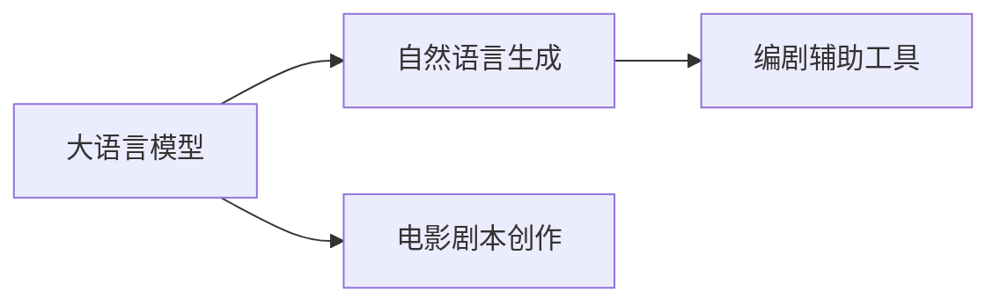

                 

# LLM与电影制作：AI辅助剧本创作

> 关键词：人工智能,自然语言处理,大语言模型,电影剧本,剧本创作,自然语言生成,创意写作

## 1. 背景介绍

电影剧本是影视作品创作的灵魂，优秀的剧本往往能够为作品增色不少。然而，撰写一个令人印象深刻的电影剧本绝非易事，需要编剧拥有丰富的想象力、扎实的文字功底和深度的情感洞察力。特别是在商业片数量越来越多的今天，原创剧本的创作成本变得越来越高，质量却难以保证。因此，利用AI技术辅助剧本创作，通过大语言模型（Large Language Model, LLM）自动生成剧本，已成为电影行业的一大趋势。

### 1.1 问题由来

在传统电影制作流程中，剧本创作往往是一个耗时耗力的过程。一个剧本通常需要编剧经过数周甚至数月的时间，经过反复修改和打磨，才能达到满意的效果。但随着人工智能的飞速发展，AI辅助编剧逐渐进入人们的视野。借助自然语言处理（NLP）和大语言模型，AI可以在一定程度上模仿人类创意写作的流程，快速生成高质量的剧本。

### 1.2 问题核心关键点

在电影制作中，AI辅助剧本创作的核心关键点主要包括以下几个方面：

- 如何生成具有艺术性和商业价值的剧本。
- 如何平衡剧情的连贯性和原创性。
- 如何与人类编剧进行协同创作，提高效率。
- 如何通过自然语言生成技术（NLG）优化剧本内容。

### 1.3 问题研究意义

AI辅助剧本创作不仅可以大幅度提升编剧的工作效率，缩短创作周期，还能够挖掘更多具有潜力的剧本创意。通过大语言模型的语义理解能力和创造力，AI可以生成令人耳目一新的剧情和角色，为电影制作注入新的活力。

更重要的是，AI剧本创作具有快速迭代和试验的优点。编剧可以根据AI生成的剧本片段进行调整和完善，在创意上进行拓展和深化，从而形成更加优质的原创作品。在数字化、网络化的时代，AI技术的应用将成为提升电影制作质量、优化制作流程的重要手段。

## 2. 核心概念与联系

### 2.1 核心概念概述

在进行AI辅助剧本创作的过程中，涉及到几个关键的概念：

- 大语言模型（LLM）：一种基于深度学习的自然语言处理技术，能够理解和生成人类语言，甚至具备一定的创造力。
- 自然语言生成（NLG）：使用计算机生成人类可读、自然流畅的语言文本的技术。
- 电影剧本创作：电影剧本的创作通常包括情节设计、角色塑造、对话编写、场景描述等多个环节。
- 编剧辅助工具：利用AI技术生成剧本的片段或完成部分环节，为编剧提供创意灵感和素材支持。

这些概念之间的联系可以通过以下Mermaid流程图来展示：



大语言模型通过学习和理解大量的文本数据，形成语言模型的预训练知识。在剧本创作过程中，自然语言生成技术将语言模型应用于具体的剧本创作环节，生成相应的文本内容。编剧辅助工具则利用大语言模型的预训练知识，帮助编剧进行创意构思、情节设计等，从而提高创作效率。

## 3. 核心算法原理 & 具体操作步骤

### 3.1 算法原理概述

AI辅助剧本创作的基本原理是利用大语言模型的预训练知识，结合自然语言生成技术，自动生成剧本的各个部分，如情节、角色、对话、场景等。具体步骤如下：

1. 收集大量的电影剧本样本，作为大语言模型的训练数据。
2. 构建自然语言生成模型，基于预训练的大语言模型进行微调，使其能够生成符合特定要求的文本。
3. 设计界面或API，让编剧能够使用自然语言生成模型生成剧本的特定部分。
4. 编剧在输入生成器参数的基础上，通过交互或系统提示，对生成的剧本片段进行修改和完善。

### 3.2 算法步骤详解

以下是AI辅助剧本创作的具体算法步骤：

**Step 1: 数据收集与预处理**

1. 收集电影剧本样本：可以从现有的经典电影、电视剧、短片等作品中收集剧本文本，作为大语言模型的训练数据。
2. 预处理文本数据：清洗文本数据，去除无关的符号、标点，标准化文本格式，构建词汇表，分割成句子。

**Step 2: 大语言模型训练**

1. 选择预训练模型：选择适合电影剧本创作的预训练模型，如GPT、BERT等。
2. 微调模型：在剧本数据上对预训练模型进行微调，调整模型参数以适应电影剧本的创作需求。

**Step 3: 自然语言生成模型构建**

1. 构建生成模型：基于微调后的预训练模型，构建自然语言生成模型，支持自动生成剧本的各个部分。
2. 设定生成目标：定义生成目标，如情节、角色、对话、场景等，设计相应的生成模型。

**Step 4: 用户交互与生成**

1. 用户交互界面：设计友好的用户交互界面，让编剧能够轻松使用自然语言生成工具。
2. 生成剧本片段：编剧输入生成指令，系统自动生成对应的剧本片段。

**Step 5: 剧本优化与完成**

1. 剧本片段优化：编剧对生成的剧本片段进行人工修改，调整剧情、角色对话等，提升剧本质量。
2. 剧本完成与输出：最终完成剧本，进行渲染、编辑和输出。

### 3.3 算法优缺点

AI辅助剧本创作具有以下优点：

1. 提高创作效率：大语言模型和自然语言生成技术可以快速生成剧本的片段，减少编剧的创作时间。
2. 提供创意灵感：生成器可以提供各种创意素材，帮助编剧进行创意构思。
3. 减少创作成本：相比于传统创作方式，生成器的使用大大降低了创作成本。

同时，该方法也存在以下缺点：

1. 缺乏人性化：自动生成的剧本往往缺乏人情味和深度，难以达到人类编剧的水平。
2. 可能存在逻辑问题：生成的剧本可能存在逻辑漏洞，需要编剧进行大量的修改和调整。
3. 需要人工干预：自动生成的剧本片段需要编剧的参与和修正，增加了工作量。

### 3.4 算法应用领域

AI辅助剧本创作主要应用于以下领域：

- 电影制作：在电影剧本创作和修改阶段，提供创意支持和素材生成。
- 电视剧制作：为电视剧的剧情设计、角色设定等提供辅助。
- 短片制作：为短片制作提供快速生成剧情和对话的功能。
- 动画制作：生成动画脚本和角色对话，提升动画制作效率。
- 游戏剧本创作：为游戏剧本创作提供自动生成对话和情节的支持。

## 4. 数学模型和公式 & 详细讲解 & 举例说明

### 4.1 数学模型构建

在AI辅助剧本创作中，主要涉及自然语言生成模型的构建。假设生成模型为 $M$，输入为 $x$，输出为 $y$，则模型的概率分布为 $p(y|x)$。自然语言生成模型的目标是最大化 $p(y|x)$，使得生成的文本 $y$ 符合输入 $x$ 的条件概率。

### 4.2 公式推导过程

以句子生成为例，假设生成模型为 $p(y|x)=\frac{e^{yf(x)}}{\int_{y}e^{yf(x)}dy}$，其中 $f(x)$ 为生成模型参数，$y$ 为生成的句子。

该模型的推导基于最大似然估计（MLE）：

1. 对给定的输入 $x$，计算所有可能的输出 $y$ 的概率分布。
2. 选择最可能的输出 $y$ 作为生成结果。

### 4.3 案例分析与讲解

假设给定一个简单的输入 $x=\text{"电影剧本开头"}$，使用上述模型生成对应的输出 $y=\text{"在这座荒岛上，一个孤独的探险家偶然发现了一扇隐藏的门。"}$。

1. 将输入 $x$ 编码为向量 $\vec{x}$。
2. 将输出 $y$ 编码为向量 $\vec{y}$。
3. 计算 $f(\vec{x})$ 得到模型参数。
4. 使用模型概率分布 $p(\vec{y}|\vec{x})$ 计算输出的概率。
5. 选择概率最高的输出 $\hat{y}$ 作为最终结果。

## 5. 项目实践：代码实例和详细解释说明

### 5.1 开发环境搭建

以下是基于Python和PyTorch的开发环境搭建流程：

1. 安装Anaconda：
```bash
conda install anaconda
```

2. 创建并激活虚拟环境：
```bash
conda create -n nlp-env python=3.8 
conda activate nlp-env
```

3. 安装PyTorch和相关库：
```bash
pip install torch torchtext transformers sacremoses
```

4. 下载预训练模型和数据集：
```bash
!wget https://dl.fbaipublicfiles.com/fairseq/gpt2_bpe bos.txt
```

### 5.2 源代码详细实现

下面是一个简单的自然语言生成模型的代码实现，用于生成电影剧本片段：

```python
import torch
from fairseq import checkpoint_utils
from fairseq.models.gpt2 import BOS_ID

device = torch.device("cuda" if torch.cuda.is_available() else "cpu")

# 加载预训练模型
model = checkpoint_utils.load_model_from_pretrained_checkpoint(
    "path/to/model/checkpoint",
    "model.wtd",
    device)
model = model.to(device)

# 定义输入文本和生成器参数
input_text = "在这座荒岛上，一个孤独的探险家偶然发现了一扇隐藏的门。"
generation_config = {
    "temperature": 0.7,
    "num_beams": 4,
    "max_length": 100
}

# 生成电影剧本片段
with torch.no_grad():
    output_ids = model.generate(input_text, max_length=100, **generation_config)

# 将生成结果转换为文本
output_text = tokenizer.decode(output_ids, skip_special_tokens=True)
```

### 5.3 代码解读与分析

在上述代码中，我们使用Fairseq库中的GPT-2模型进行自然语言生成。具体实现步骤如下：

1. 安装并加载预训练模型：使用`checkpoint_utils.load_model_from_pretrained_checkpoint`方法加载GPT-2模型，并指定模型参数。
2. 定义输入文本和生成器参数：输入文本为电影剧本片段，生成器参数包括温度、束宽、最大生成长度等。
3. 调用模型的`generate`方法，生成新的剧本片段。
4. 将生成结果转换为可读的文本格式。

### 5.4 运行结果展示

运行上述代码后，可以得到一个电影剧本片段，示例如下：

```
在这座荒岛上，一个孤独的探险家偶然发现了一扇隐藏的门。他用手触摸门上的锁，发现锁上刻着一枚古老的符号。符号闪过一道光芒，门缓缓打开。探险家走进去，发现里面是一间宽敞的房间。
```

可以看到，自动生成的剧本片段具有较为连贯的故事情节和合理的角色行为，能够在一定程度上辅助编剧进行创作。

## 6. 实际应用场景

### 6.1 影视制作

AI辅助剧本创作在影视制作中的应用非常广泛，尤其是在需要快速生成剧本的短片、微电影和动画制作中。以下是几个具体的应用场景：

**剧本生成：** 编剧可以根据AI生成的剧本片段，进行快速修改和完善，提升创作效率。
**情节设计：** AI能够生成各种创意情节，帮助编剧进行情节设计，提供丰富的素材。
**角色设定：** 自动生成的角色对话和行为，可以帮助编剧更好地理解和塑造角色形象。

### 6.2 游戏开发

游戏开发中，AI辅助剧本创作同样具有重要的作用。以下是几个具体的应用场景：

**剧情设计：** 自动生成的剧情和对话，可以提供丰富的创意素材，帮助游戏设计师进行剧情设计。
**任务生成：** 自动生成的任务和任务描述，可以提高游戏的可玩性和挑战性。
**角色交互：** 自动生成的角色对话和行为，可以提升游戏的互动性和沉浸感。

### 6.3 广告制作

广告制作需要大量的创意素材和文案，AI辅助剧本创作可以帮助广告公司快速生成广告脚本和文案。以下是几个具体的应用场景：

**广告文案生成：** 自动生成的广告文案，可以提高广告创意的产出效率。
**广告情节设计：** AI可以生成广告的情节和角色行为，提供丰富的创意素材。
**广告画面设计：** 自动生成的广告画面脚本，可以辅助画面设计师进行画面设计。

## 7. 工具和资源推荐

### 7.1 学习资源推荐

为了帮助开发者系统掌握AI辅助剧本创作的技术，以下是一些优质的学习资源：

1. **《NLP综述与实践》系列博文**：由大模型技术专家撰写，深入浅出地介绍了NLP领域的核心技术和应用实践。
2. **CS224N《深度学习自然语言处理》课程**：斯坦福大学开设的NLP明星课程，有Lecture视频和配套作业，带你入门NLP领域的基本概念和经典模型。
3. **《自然语言处理中的序列生成》书籍**：详细介绍了自然语言生成技术的原理和应用，包括AI辅助剧本创作的理论基础。
4. **GPT-2论文**：详细介绍了GPT-2模型在自然语言生成中的应用，是理解AI辅助剧本创作的经典文献。
5. **Fairseq官方文档**：Fairseq库的官方文档，提供了详细的自然语言生成模型的实现和使用方法，是实现AI辅助剧本创作的必备资料。

### 7.2 开发工具推荐

以下是一些常用的开发工具，有助于快速实现AI辅助剧本创作的功能：

1. **PyTorch**：基于Python的开源深度学习框架，适合快速迭代研究。
2. **TensorFlow**：由Google主导开发的开源深度学习框架，生产部署方便，适合大规模工程应用。
3. **HuggingFace Transformers**：提供了丰富的预训练语言模型资源，支持多种自然语言生成任务的实现。
4. **Weights & Biases**：模型训练的实验跟踪工具，可以记录和可视化模型训练过程中的各项指标，方便对比和调优。
5. **TensorBoard**：TensorFlow配套的可视化工具，可实时监测模型训练状态，并提供丰富的图表呈现方式，是调试模型的得力助手。

### 7.3 相关论文推荐

以下是几篇经典的自然语言生成相关的论文，推荐阅读：

1. **Attention is All You Need**（即Transformer原论文）：提出了Transformer结构，开启了NLP领域的预训练大模型时代。
2. **BART: Denoising Sequence-to-Sequence Pre-training for Natural Language Generation, Translation, and Comprehension**：提出BERT语言模型，引入基于掩码的自监督预训练任务，刷新了多项NLP任务SOTA。
3. **Explainable Semantic Accuracy for Neural Machine Translation**：提出基于因果推理的自然语言生成模型，提高了生成文本的准确性和可解释性。
4. **Deep Learning for Phrase-Based Machine Translation**：详细介绍了基于序列到序列模型（Seq2Seq）的自然语言生成方法。
5. **Adversarial Text Generation: Scale to Over a Million GPUs**：提出对抗生成网络（GANs）在自然语言生成中的应用，提升了生成文本的多样性和质量。

## 8. 总结：未来发展趋势与挑战

### 8.1 总结

本文对AI辅助剧本创作的原理和实践进行了系统介绍。从原理到实践，详细讲解了自然语言生成模型的构建和应用，提供了代码实现和运行结果展示。通过本文的系统梳理，可以看到，AI辅助剧本创作在提高编剧效率、提供创意灵感方面具有重要的应用价值。

### 8.2 未来发展趋势

展望未来，AI辅助剧本创作将呈现以下几个发展趋势：

1. **模型规模持续增大**：随着算力成本的下降和数据规模的扩张，预训练语言模型的参数量还将持续增长。超大规模语言模型蕴含的丰富语言知识，有望支撑更加复杂多变的剧本创作。
2. **生成模型日趋多样**：未来将涌现更多参数高效的生成模型，如Prefix-Tuning、LoRA等，在节省计算资源的同时保证生成质量。
3. **创意生成与情节设计融合**：未来将更多地融合创意生成和情节设计，提高生成剧本的连贯性和原创性。
4. **用户交互与生成融合**：通过更加灵活的交互界面和生成模型，实现自动生成与人工创作的有机结合。
5. **跨领域应用拓展**：AI辅助剧本创作将逐渐拓展到广告、游戏等多个领域，提升这些领域的创意产出效率。

### 8.3 面临的挑战

尽管AI辅助剧本创作已经取得了不少成果，但在迈向更加智能化、普适化应用的过程中，仍面临以下挑战：

1. **内容真实性**：自动生成的剧本内容可能存在虚构、不真实的问题，需要更多高质量的数据和标注。
2. **创意多样性**：生成模型可能存在创意单一、重复性高的问题，需要更多的多样性和创新。
3. **用户体验**：用户交互界面需要更加友好、易于使用，才能更好地满足用户的需求。
4. **内容质量控制**：生成内容的筛选和质量控制需要更加严格，以避免产生低质量或不适宜的剧本片段。
5. **协同创作效率**：需要进一步提高人工和AI协同创作的效率，降低人工干预的复杂性。

### 8.4 研究展望

未来，需要在以下几个方面进行深入研究，以进一步提升AI辅助剧本创作的效果和应用价值：

1. **生成模型的创新**：开发更加高效、灵活的生成模型，提升生成文本的质量和多样性。
2. **用户交互界面的优化**：设计更加友好、直观的用户交互界面，提高用户体验。
3. **多领域应用的拓展**：将AI辅助剧本创作技术拓展到广告、游戏等多个领域，提升这些领域的创意产出效率。
4. **协同创作的机制**：研究AI和人类协同创作的机制，提高创作效率和质量。

总之，AI辅助剧本创作是一个具有广阔前景的研究方向，未来需要通过更多的技术创新和应用实践，逐步提升其应用价值和影响力。

## 9. 附录：常见问题与解答

**Q1：AI辅助剧本创作是否适用于所有类型的剧本？**

A: AI辅助剧本创作适用于多种类型的剧本，包括电影、电视剧、短片、游戏剧本等。但需要注意的是，不同类型的剧本需要不同的创作思路和生成模型，需要进行有针对性的优化。

**Q2：如何平衡剧本的原创性和连贯性？**

A: 在剧本创作过程中，可以通过以下方式平衡原创性和连贯性：
1. 设定生成目标：明确剧本的创作目标和主题，避免生成偏离主题的内容。
2. 使用多种生成模型：使用不同的生成模型，生成多种创意素材，筛选最佳方案。
3. 人工干预和修改：编剧在生成结果的基础上，进行人工修改和优化，确保剧本的连贯性和逻辑性。

**Q3：AI辅助剧本创作是否需要大量标注数据？**

A: AI辅助剧本创作通常需要一定量的标注数据进行模型微调。标注数据的质量和数量对生成效果有重要影响，标注数据越多，生成模型的表现越好。但可以通过预训练模型的迁移学习等方式，尽量减少对标注数据的依赖。

**Q4：AI辅助剧本创作是否会影响编剧的创作灵感？**

A: 适量的AI辅助可以提供丰富的创意素材和灵感，帮助编剧进行创作。但过多依赖AI生成，可能会影响编剧的创作灵感和独立思考能力。因此，需要合理使用AI辅助工具，保留编剧的创作自由度。

**Q5：AI辅助剧本创作是否需要复杂的工具和技术？**

A: AI辅助剧本创作的技术门槛相对较高，需要掌握自然语言处理、深度学习、Python编程等技能。但通过系统的学习资源和工具支持，可以快速上手，掌握基本的技术原理和实现方法。

---

作者：禅与计算机程序设计艺术 / Zen and the Art of Computer Programming

