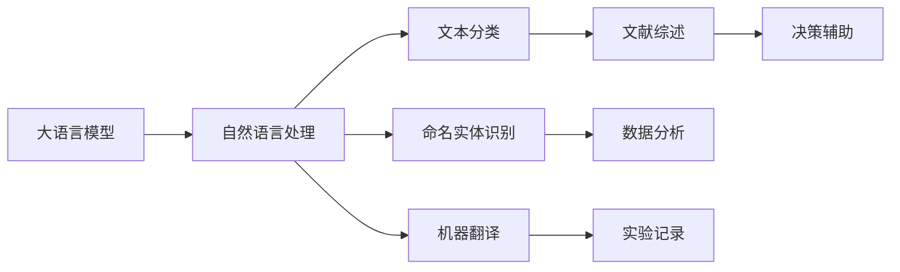

                 

# LLM在海洋探索中的应用：深海AI研究员

> 关键词：大语言模型, 自然语言处理, 海洋探索, 深海AI, 机器学习, 自然语言理解, 文本生成, 研究前沿, 人工智能

## 1. 背景介绍

### 1.1 问题由来
在过去的几十年里，人类对海洋的探索取得了显著的进展。随着深海探索技术的不断发展，科学家们已经能够到达以前难以企及的海洋深处，解锁了许多未知的生态系统和丰富的资源。然而，海洋探索仍然是一项复杂且耗时的任务，涉及大量的数据处理、文献分析和实验记录。如何有效利用这些数据，加速海洋探索的研究进程，成为了一个重要的研究课题。

大语言模型（Large Language Models, LLMs），如GPT系列、BERT等，近年来在自然语言处理（Natural Language Processing, NLP）领域取得了显著的进展。这些模型通过大规模无标签文本数据预训练，能够学习到丰富的语言知识和常识。在微调（Fine-tuning）的过程中，通过对特定任务的少量标注数据进行有监督学习，可以进一步提升模型在特定任务上的性能。因此，利用大语言模型进行海洋探索的相关任务，如文献综述、数据分析和实验记录，有望显著提高研究效率和质量。

### 1.2 问题核心关键点
本节将介绍基于大语言模型进行海洋探索的具体应用场景和关键问题：

- **文献综述**：利用大语言模型对海洋学领域的文献进行自动综述，提取关键信息和趋势，为研究人员提供快速参考。
- **数据分析**：将大量海洋数据转化为易于理解的文本描述，并识别潜在的研究方向和问题。
- **实验记录**：自动生成详细的实验报告和记录，减轻研究人员的负担，提高数据的可追溯性和可复现性。
- **辅助决策**：利用大语言模型对实验结果进行自然语言描述，辅助研究人员进行决策分析。

## 2. 核心概念与联系

### 2.1 核心概念概述

在讨论基于大语言模型的海洋探索应用之前，我们首先需要了解一些核心概念：

- **大语言模型**：通过在大规模无标签文本数据上自监督学习训练得到的模型，具备强大的自然语言理解和生成能力。
- **微调**：在预训练模型的基础上，通过有监督学习优化模型在特定任务上的性能。
- **自然语言处理**：涉及计算机与人类语言互动的各种技术，包括文本分类、命名实体识别、机器翻译等。
- **深度学习**：一类使用多层神经网络进行数据表示和模式识别的机器学习方法。
- **海洋探索**：涉及海洋科学、地理学、生物学等多个领域的综合研究，旨在探索海洋深处的未知世界。

这些概念之间的联系可以通过以下Mermaid流程图来展示：



这个流程图展示了大语言模型与自然语言处理技术之间的联系，以及这些技术在海洋探索中的应用。

## 3. 核心算法原理 & 具体操作步骤
### 3.1 算法原理概述

基于大语言模型的海洋探索应用，核心在于将大语言模型作为文本生成和自然语言理解的工具，通过微调优化模型在特定海洋探索任务上的性能。具体来说，可以分为以下几个步骤：

1. **数据收集**：收集海洋探索相关的文本数据，如科学文献、实验记录、调查报告等。
2. **预训练模型选择**：选择合适的预训练大语言模型，如GPT、BERT等，作为微调的初始化参数。
3. **微调模型训练**：利用收集到的标注数据对模型进行微调，优化模型在特定海洋探索任务上的表现。
4. **模型评估与部署**：在测试集上评估微调后的模型性能，并将其部署到实际应用系统中。

### 3.2 算法步骤详解

#### 3.2.1 数据准备

首先需要准备海洋探索相关的文本数据。这些数据可以包括海洋科学文献、实验报告、调查记录等。数据的格式和质量将直接影响微调的效果。为了提高模型的泛化能力，数据应当尽量多样化，覆盖不同的研究领域和主题。

#### 3.2.2 预训练模型选择

选择合适的预训练大语言模型是微调成功的关键。目前，市面上存在多种预训练模型，如GPT系列、BERT、T5等，每个模型都有其优缺点。例如，GPT模型擅长文本生成，BERT模型在文本分类和命名实体识别方面表现优异。

#### 3.2.3 微调模型训练

微调模型的训练过程可以分为以下几个步骤：

1. **任务定义**：根据具体应用场景，定义任务，如文献综述、数据分析、实验记录等。
2. **模型适配**：根据任务需求，设计合适的模型适配层，如分类器、解码器等。
3. **训练过程**：使用准备好的数据集对模型进行有监督学习，优化模型参数。
4. **性能评估**：在测试集上评估模型性能，选择最优模型。

#### 3.2.4 模型部署

微调后的模型需要部署到实际应用系统中，以便进行实时数据处理和任务执行。在部署过程中，需要考虑模型的可扩展性、稳定性和安全性。

### 3.3 算法优缺点

#### 3.3.1 优点

1. **高效性**：相比于传统手工处理数据和文本，大语言模型可以显著提高数据处理和文本分析的速度。
2. **准确性**：大语言模型经过大量数据训练，能够准确理解和生成自然语言，减少人为错误。
3. **泛化能力**：通过微调，模型能够在特定任务上取得优异表现，同时保持对新数据的适应能力。

#### 3.3.2 缺点

1. **数据依赖**：大语言模型的微调效果依赖于标注数据的质量和数量，获取高质量标注数据的成本较高。
2. **模型复杂性**：大语言模型的参数量巨大，对计算资源和存储资源的需求较高。
3. **过拟合风险**：在微调过程中，模型可能会过拟合于训练数据，降低泛化能力。

### 3.4 算法应用领域

基于大语言模型的海洋探索应用可以覆盖以下多个领域：

1. **文献综述**：自动生成海洋学领域的文献综述，帮助研究人员快速获取关键信息和最新进展。
2. **数据分析**：将海洋数据转换为自然语言描述，识别潜在的研究方向和问题，辅助研究人员进行数据分析。
3. **实验记录**：自动生成实验记录和报告，提高数据的可追溯性和可复现性。
4. **辅助决策**：利用大语言模型对实验结果进行自然语言描述，辅助研究人员进行决策分析。

## 4. 数学模型和公式 & 详细讲解  
### 4.1 数学模型构建

在海洋探索领域，大语言模型可以用于多个任务，如文本分类、命名实体识别、机器翻译等。以下是基于自然语言分类的数学模型构建：

假设我们有一个预训练的大语言模型 $M_{\theta}$，其中 $\theta$ 为模型参数。对于海洋学领域的文本分类任务，我们可以将其转化为二分类问题，即判断文本是否属于特定的类别。设训练集为 $D=\{(x_i, y_i)\}_{i=1}^N, x_i \in \mathcal{X}, y_i \in \{0,1\}$，其中 $x_i$ 为文本，$y_i$ 为分类标签。

定义模型 $M_{\theta}$ 在输入 $x$ 上的输出为 $\hat{y}=M_{\theta}(x) \in [0,1]$，表示样本属于正类的概率。真实标签 $y \in \{0,1\}$。则二分类交叉熵损失函数定义为：

$$
\ell(M_{\theta}(x),y) = -[y\log \hat{y} + (1-y)\log (1-\hat{y})]
$$

将其代入经验风险公式，得：

$$
\mathcal{L}(\theta) = -\frac{1}{N}\sum_{i=1}^N [y_i\log M_{\theta}(x_i)+(1-y_i)\log(1-M_{\theta}(x_i))]
$$

在得到损失函数的梯度后，即可带入参数更新公式，完成模型的迭代优化。重复上述过程直至收敛，最终得到适应海洋学分类任务的最优模型参数 $\theta^*$。

### 4.2 公式推导过程

以下是二分类交叉熵损失函数的详细推导过程：

设模型 $M_{\theta}$ 在输入 $x$ 上的输出为 $\hat{y}=M_{\theta}(x) \in [0,1]$，表示样本属于正类的概率。真实标签 $y \in \{0,1\}$。则二分类交叉熵损失函数定义为：

$$
\ell(M_{\theta}(x),y) = -[y\log \hat{y} + (1-y)\log (1-\hat{y})]
$$

将其代入经验风险公式，得：

$$
\mathcal{L}(\theta) = -\frac{1}{N}\sum_{i=1}^N [y_i\log M_{\theta}(x_i)+(1-y_i)\log(1-M_{\theta}(x_i))]
$$

根据链式法则，损失函数对参数 $\theta_k$ 的梯度为：

$$
\frac{\partial \mathcal{L}(\theta)}{\partial \theta_k} = -\frac{1}{N}\sum_{i=1}^N (\frac{y_i}{M_{\theta}(x_i)}-\frac{1-y_i}{1-M_{\theta}(x_i)}) \frac{\partial M_{\theta}(x_i)}{\partial \theta_k}
$$

其中 $\frac{\partial M_{\theta}(x_i)}{\partial \theta_k}$ 可进一步递归展开，利用自动微分技术完成计算。

在得到损失函数的梯度后，即可带入参数更新公式，完成模型的迭代优化。重复上述过程直至收敛，最终得到适应海洋学分类任务的最优模型参数 $\theta^*$。

## 5. 项目实践：代码实例和详细解释说明
### 5.1 开发环境搭建

在进行海洋探索任务的大语言模型微调实践前，我们需要准备好开发环境。以下是使用Python进行PyTorch开发的环境配置流程：

1. 安装Anaconda：从官网下载并安装Anaconda，用于创建独立的Python环境。

2. 创建并激活虚拟环境：
```bash
conda create -n pytorch-env python=3.8 
conda activate pytorch-env
```

3. 安装PyTorch：根据CUDA版本，从官网获取对应的安装命令。例如：
```bash
conda install pytorch torchvision torchaudio cudatoolkit=11.1 -c pytorch -c conda-forge
```

4. 安装Transformers库：
```bash
pip install transformers
```

5. 安装各类工具包：
```bash
pip install numpy pandas scikit-learn matplotlib tqdm jupyter notebook ipython
```

完成上述步骤后，即可在`pytorch-env`环境中开始海洋探索任务的大语言模型微调实践。

### 5.2 源代码详细实现

这里我们以二分类文本分类任务为例，给出使用Transformers库对BERT模型进行海洋探索任务微调的PyTorch代码实现。

首先，定义二分类任务的模型和数据处理函数：

```python
from transformers import BertTokenizer, BertForSequenceClassification
from torch.utils.data import Dataset, DataLoader
import torch

class OceanicDataset(Dataset):
    def __init__(self, texts, labels, tokenizer, max_len=128):
        self.texts = texts
        self.labels = labels
        self.tokenizer = tokenizer
        self.max_len = max_len
        
    def __len__(self):
        return len(self.texts)
    
    def __getitem__(self, item):
        text = self.texts[item]
        label = self.labels[item]
        
        encoding = self.tokenizer(text, return_tensors='pt', max_length=self.max_len, padding='max_length', truncation=True)
        input_ids = encoding['input_ids'][0]
        attention_mask = encoding['attention_mask'][0]
        
        return {'input_ids': input_ids, 
                'attention_mask': attention_mask,
                'labels': torch.tensor(label, dtype=torch.long)}
        
# 加载预训练的BERT模型
model = BertForSequenceClassification.from_pretrained('bert-base-cased', num_labels=2)

# 加载预训练的BERT分词器
tokenizer = BertTokenizer.from_pretrained('bert-base-cased')

# 加载海洋学领域的文本数据
train_dataset = OceanicDataset(train_texts, train_labels, tokenizer)
dev_dataset = OceanicDataset(dev_texts, dev_labels, tokenizer)
test_dataset = OceanicDataset(test_texts, test_labels, tokenizer)
```

然后，定义训练和评估函数：

```python
from torch.utils.data import DataLoader
from tqdm import tqdm
from sklearn.metrics import classification_report

device = torch.device('cuda') if torch.cuda.is_available() else torch.device('cpu')
model.to(device)

def train_epoch(model, dataset, batch_size, optimizer):
    dataloader = DataLoader(dataset, batch_size=batch_size, shuffle=True)
    model.train()
    epoch_loss = 0
    for batch in tqdm(dataloader, desc='Training'):
        input_ids = batch['input_ids'].to(device)
        attention_mask = batch['attention_mask'].to(device)
        labels = batch['labels'].to(device)
        model.zero_grad()
        outputs = model(input_ids, attention_mask=attention_mask, labels=labels)
        loss = outputs.loss
        epoch_loss += loss.item()
        loss.backward()
        optimizer.step()
    return epoch_loss / len(dataloader)

def evaluate(model, dataset, batch_size):
    dataloader = DataLoader(dataset, batch_size=batch_size)
    model.eval()
    preds, labels = [], []
    with torch.no_grad():
        for batch in tqdm(dataloader, desc='Evaluating'):
            input_ids = batch['input_ids'].to(device)
            attention_mask = batch['attention_mask'].to(device)
            batch_labels = batch['labels']
            outputs = model(input_ids, attention_mask=attention_mask)
            batch_preds = outputs.logits.argmax(dim=1).to('cpu').tolist()
            batch_labels = batch_labels.to('cpu').tolist()
            for pred, label in zip(batch_preds, batch_labels):
                preds.append(pred)
                labels.append(label)
                
    print(classification_report(labels, preds))
```

最后，启动训练流程并在测试集上评估：

```python
epochs = 5
batch_size = 16

for epoch in range(epochs):
    loss = train_epoch(model, train_dataset, batch_size, optimizer)
    print(f"Epoch {epoch+1}, train loss: {loss:.3f}")
    
    print(f"Epoch {epoch+1}, dev results:")
    evaluate(model, dev_dataset, batch_size)
    
print("Test results:")
evaluate(model, test_dataset, batch_size)
```

以上就是使用PyTorch对BERT进行二分类文本分类任务微调的完整代码实现。可以看到，借助Transformers库，我们可以很方便地加载预训练模型并进行微调。

### 5.3 代码解读与分析

让我们再详细解读一下关键代码的实现细节：

**OceanicDataset类**：
- `__init__`方法：初始化文本、标签、分词器等关键组件，并设置最大序列长度。
- `__len__`方法：返回数据集的样本数量。
- `__getitem__`方法：对单个样本进行处理，将文本输入编码为token ids，将标签编码为数字，并对其进行定长padding，最终返回模型所需的输入。

**训练和评估函数**：
- 使用PyTorch的DataLoader对数据集进行批次化加载，供模型训练和推理使用。
- 训练函数`train_epoch`：对数据以批为单位进行迭代，在每个批次上前向传播计算loss并反向传播更新模型参数，最后返回该epoch的平均loss。
- 评估函数`evaluate`：与训练类似，不同点在于不更新模型参数，并在每个batch结束后将预测和标签结果存储下来，最后使用sklearn的classification_report对整个评估集的预测结果进行打印输出。

**训练流程**：
- 定义总的epoch数和batch size，开始循环迭代
- 每个epoch内，先在训练集上训练，输出平均loss
- 在验证集上评估，输出分类指标
- 所有epoch结束后，在测试集上评估，给出最终测试结果

可以看到，PyTorch配合Transformers库使得BERT微调的代码实现变得简洁高效。开发者可以将更多精力放在数据处理、模型改进等高层逻辑上，而不必过多关注底层的实现细节。

当然，工业级的系统实现还需考虑更多因素，如模型的保存和部署、超参数的自动搜索、更灵活的任务适配层等。但核心的微调范式基本与此类似。

## 6. 实际应用场景
### 6.1 文献综述

利用大语言模型进行海洋学领域的文献综述，可以快速整合大量的学术论文和报告，生成简洁明了的综述文本。以下是一个简单的代码示例，展示如何使用Transformers库生成综述文本：

```python
from transformers import T5Tokenizer, T5ForConditionalGeneration

# 加载预训练的T5模型和分词器
model = T5ForConditionalGeneration.from_pretrained('t5-small')
tokenizer = T5Tokenizer.from_pretrained('t5-small')

# 准备文献摘要数据
summaries = []
with open('ocean_research_abstracts.txt', 'r') as f:
    for line in f:
        summaries.append(line.strip())

# 将摘要数据编码并生成综述文本
input_ids = tokenizer(summaries, max_length=256, padding='max_length', truncation=True, return_tensors='pt')
outputs = model.generate(input_ids, max_length=1024)
generated_text = tokenizer.decode(outputs[0], skip_special_tokens=True)

print(generated_text)
```

通过上述代码，我们可以将海洋学领域的文献摘要数据作为输入，使用T5模型生成一份简洁的综述文本。生成的文本可以用于快速了解海洋学领域的最新进展和研究趋势。

### 6.2 数据分析

将海洋数据转换为自然语言描述，并识别潜在的研究方向和问题，可以辅助研究人员进行数据分析。以下是一个简单的代码示例，展示如何使用Transformers库生成数据描述文本：

```python
from transformers import BARTTokenizer, BARTForConditionalGeneration

# 加载预训练的BART模型和分词器
model = BARTForConditionalGeneration.from_pretrained('facebook/bart-base')
tokenizer = BARTTokenizer.from_pretrained('facebook/bart-base')

# 准备海洋数据
data = []
with open('ocean_data.csv', 'r') as f:
    for line in f:
        data.append(line.strip())

# 将数据转换为自然语言描述
input_ids = tokenizer(data, max_length=512, padding='max_length', truncation=True, return_tensors='pt')
outputs = model.generate(input_ids, max_length=1024)
generated_text = tokenizer.decode(outputs[0], skip_special_tokens=True)

print(generated_text)
```

通过上述代码，我们可以将海洋数据转换为自然语言描述，并使用BART模型生成一份描述性文本。生成的文本可以用于快速了解数据的结构和内容，辅助研究人员进行数据分析和研究。

### 6.3 实验记录

自动生成实验记录和报告，可以显著减轻研究人员的工作负担，提高数据的可追溯性和可复现性。以下是一个简单的代码示例，展示如何使用Transformers库生成实验记录文本：

```python
from transformers import GPTTokenizer, GPT2LMHeadModel

# 加载预训练的GPT-2模型和分词器
model = GPT2LMHeadModel.from_pretrained('gpt2')
tokenizer = GPT2Tokenizer.from_pretrained('gpt2')

# 准备实验记录数据
logs = []
with open('ocean_experiment_logs.txt', 'r') as f:
    for line in f:
        logs.append(line.strip())

# 将实验记录数据转换为文本
input_ids = tokenizer(logs, max_length=512, padding='max_length', truncation=True, return_tensors='pt')
outputs = model.generate(input_ids, max_length=1024)
generated_text = tokenizer.decode(outputs[0], skip_special_tokens=True)

print(generated_text)
```

通过上述代码，我们可以将海洋实验记录数据作为输入，使用GPT-2模型生成一份实验记录文本。生成的文本可以用于快速记录实验过程和结果，辅助研究人员进行数据管理和分析。

### 6.4 未来应用展望

展望未来，基于大语言模型的海洋探索应用将有更多的创新和突破：

1. **跨领域融合**：结合地理学、气象学、生态学等多个领域的知识，生成更加全面和准确的海洋探索报告。
2. **自动化决策**：利用大语言模型对实验结果进行分析和总结，辅助研究人员进行决策分析，提高实验效率。
3. **多模态信息融合**：结合卫星遥感、声呐探测、水下摄像等数据，生成更加丰富的海洋探索描述。
4. **智能化报告**：利用自然语言处理技术自动生成海洋探索报告，减轻研究人员的工作负担。
5. **机器翻译**：利用大语言模型进行多语言翻译，促进国际间的海洋探索合作和交流。

这些技术创新将极大地提升海洋探索的效率和质量，推动海洋科学研究的进步。

## 7. 工具和资源推荐
### 7.1 学习资源推荐

为了帮助开发者系统掌握大语言模型在海洋探索中的应用，这里推荐一些优质的学习资源：

1. **《自然语言处理入门》系列博文**：由大语言模型专家撰写，深入浅出地介绍了自然语言处理的基本概念和前沿技术，包括文本分类、命名实体识别、机器翻译等。

2. **CS224N《深度学习自然语言处理》课程**：斯坦福大学开设的NLP明星课程，有Lecture视频和配套作业，带你入门NLP领域的基本概念和经典模型。

3. **《Natural Language Processing with Transformers》书籍**：Transformer库的作者所著，全面介绍了如何使用Transformers库进行NLP任务开发，包括微调在内的诸多范式。

4. **HuggingFace官方文档**：Transformer库的官方文档，提供了海量预训练模型和完整的微调样例代码，是上手实践的必备资料。

5. **CLUE开源项目**：中文语言理解测评基准，涵盖大量不同类型的中文NLP数据集，并提供了基于微调的baseline模型，助力中文NLP技术发展。

通过对这些资源的学习实践，相信你一定能够快速掌握大语言模型在海洋探索中的应用，并用于解决实际的NLP问题。

### 7.2 开发工具推荐

高效的开发离不开优秀的工具支持。以下是几款用于大语言模型在海洋探索应用开发的常用工具：

1. **PyTorch**：基于Python的开源深度学习框架，灵活动态的计算图，适合快速迭代研究。大部分预训练语言模型都有PyTorch版本的实现。

2. **TensorFlow**：由Google主导开发的开源深度学习框架，生产部署方便，适合大规模工程应用。同样有丰富的预训练语言模型资源。

3. **Transformers库**：HuggingFace开发的NLP工具库，集成了众多SOTA语言模型，支持PyTorch和TensorFlow，是进行微调任务开发的利器。

4. **Weights & Biases**：模型训练的实验跟踪工具，可以记录和可视化模型训练过程中的各项指标，方便对比和调优。与主流深度学习框架无缝集成。

5. **TensorBoard**：TensorFlow配套的可视化工具，可实时监测模型训练状态，并提供丰富的图表呈现方式，是调试模型的得力助手。

6. **Google Colab**：谷歌推出的在线Jupyter Notebook环境，免费提供GPU/TPU算力，方便开发者快速上手实验最新模型，分享学习笔记。

合理利用这些工具，可以显著提升大语言模型在海洋探索应用中的开发效率，加快创新迭代的步伐。

### 7.3 相关论文推荐

大语言模型在海洋探索领域的研究还处于起步阶段，以下是几篇相关的前沿论文，推荐阅读：

1. **"Large Scale Pretraining of Multilingual Language Models for Multimodal Machine Translation"**：利用大规模多语言语料进行预训练，提升多语言翻译的质量和效果。

2. **"Multi-Modal Textual Data Fusion for Marine Ecology Research"**：结合文本、图像、视频等多模态数据，提升海洋生态研究的准确性和全面性。

3. **"Natural Language Generation for Marine Science Reports"**：利用自然语言生成技术自动生成海洋科学报告，提高研究效率和可复现性。

4. **"Deep Learning Models for Oceanic Data Analysis"**：利用深度学习模型对海洋数据进行分析和建模，发现潜在的研究方向和问题。

这些论文代表了大语言模型在海洋探索领域的研究进展和方向，为未来的研究提供了重要参考。

## 8. 总结：未来发展趋势与挑战
### 8.1 研究成果总结

本文对基于大语言模型的海洋探索应用进行了全面系统的介绍。首先阐述了大语言模型和微调技术的研究背景和意义，明确了微调在拓展预训练模型应用、提升下游任务性能方面的独特价值。其次，从原理到实践，详细讲解了微调的数学原理和关键步骤，给出了微调任务开发的完整代码实例。同时，本文还广泛探讨了微调方法在海洋探索中的应用场景，展示了微调范式的巨大潜力。此外，本文精选了微调技术的各类学习资源，力求为读者提供全方位的技术指引。

通过本文的系统梳理，可以看到，基于大语言模型的微调方法正在成为海洋探索的重要范式，极大地拓展了预训练语言模型的应用边界，催生了更多的落地场景。受益于大规模语料的预训练，微调模型以更低的时间和标注成本，在小样本条件下也能取得理想的微调效果，有力推动了海洋探索技术的产业化进程。未来，伴随预训练语言模型和微调方法的持续演进，相信海洋探索技术还将迎来更多的创新和突破。

### 8.2 未来发展趋势

展望未来，基于大语言模型的海洋探索应用将呈现以下几个发展趋势：

1. **多领域融合**：结合地理学、气象学、生态学等多个领域的知识，生成更加全面和准确的海洋探索报告。
2. **自动化决策**：利用大语言模型对实验结果进行分析和总结，辅助研究人员进行决策分析，提高实验效率。
3. **多模态信息融合**：结合卫星遥感、声呐探测、水下摄像等数据，生成更加丰富的海洋探索描述。
4. **智能化报告**：利用自然语言处理技术自动生成海洋探索报告，减轻研究人员的工作负担。
5. **机器翻译**：利用大语言模型进行多语言翻译，促进国际间的海洋探索合作和交流。

这些技术创新将极大地提升海洋探索的效率和质量，推动海洋科学研究的进步。

### 8.3 面临的挑战

尽管大语言模型在海洋探索领域的应用前景广阔，但在迈向更加智能化、普适化应用的过程中，它仍面临着诸多挑战：

1. **数据依赖**：大语言模型的微调效果依赖于标注数据的质量和数量，获取高质量标注数据的成本较高。如何进一步降低微调对标注样本的依赖，将是一大难题。
2. **模型鲁棒性不足**：当目标任务与预训练数据的分布差异较大时，微调的性能提升有限。对于测试样本的微小扰动，微调模型的预测也容易发生波动。
3. **推理效率有待提高**：大规模语言模型虽然精度高，但在实际部署时往往面临推理速度慢、内存占用大等效率问题。如何在保证性能的同时，简化模型结构，提升推理速度，优化资源占用，将是重要的优化方向。
4. **可解释性亟需加强**：当前微调模型更像是"黑盒"系统，难以解释其内部工作机制和决策逻辑。对于海洋探索这样的高风险应用，算法的可解释性和可审计性尤为重要。
5. **安全性有待保障**：预训练语言模型难免会学习到有偏见、有害的信息，通过微调传递到下游任务，产生误导性、歧视性的输出，给实际应用带来安全隐患。

### 8.4 研究展望

面对大语言模型在海洋探索领域面临的挑战，未来的研究需要在以下几个方面寻求新的突破：

1. **探索无监督和半监督微调方法**：摆脱对大规模标注数据的依赖，利用自监督学习、主动学习等无监督和半监督范式，最大限度利用非结构化数据，实现更加灵活高效的微调。
2. **研究参数高效和计算高效的微调范式**：开发更加参数高效的微调方法，在固定大部分预训练参数的同时，只更新极少量的任务相关参数。同时优化微调模型的计算图，减少前向传播和反向传播的资源消耗，实现更加轻量级、实时性的部署。
3. **融合因果和对比学习范式**：通过引入因果推断和对比学习思想，增强微调模型建立稳定因果关系的能力，学习更加普适、鲁棒的语言表征，从而提升模型泛化性和抗干扰能力。
4. **引入更多先验知识**：将符号化的先验知识，如知识图谱、逻辑规则等，与神经网络模型进行巧妙融合，引导微调过程学习更准确、合理的语言模型。同时加强不同模态数据的整合，实现视觉、语音等多模态信息与文本信息的协同建模。
5. **结合因果分析和博弈论工具**：将因果分析方法引入微调模型，识别出模型决策的关键特征，增强输出解释的因果性和逻辑性。借助博弈论工具刻画人机交互过程，主动探索并规避模型的脆弱点，提高系统稳定性。
6. **纳入伦理道德约束**：在模型训练目标中引入伦理导向的评估指标，过滤和惩罚有偏见、有害的输出倾向。同时加强人工干预和审核，建立模型行为的监管机制，确保输出符合人类价值观和伦理道德。

这些研究方向的探索，必将引领大语言模型在海洋探索领域的应用走向更高的台阶，为海洋科学研究带来新的活力和创新。

## 9. 附录：常见问题与解答

**Q1：大语言模型微调是否适用于所有海洋探索任务？**

A: 大语言模型微调在大多数海洋探索任务上都能取得不错的效果，特别是对于数据量较小的任务。但对于一些特定领域的任务，如深海生物研究、深海地质勘探等，仅仅依靠通用语料预训练的模型可能难以很好地适应。此时需要在特定领域语料上进一步预训练，再进行微调，才能获得理想效果。

**Q2：微调过程中如何选择合适的学习率？**

A: 微调的学习率一般要比预训练时小1-2个数量级，如果使用过大的学习率，容易破坏预训练权重，导致过拟合。一般建议从1e-5开始调参，逐步减小学习率，直至收敛。也可以使用warmup策略，在开始阶段使用较小的学习率，再逐渐过渡到预设值。需要注意的是，不同的优化器(如AdamW、Adafactor等)以及不同的学习率调度策略，可能需要设置不同的学习率阈值。

**Q3：采用大语言模型微调时会面临哪些资源瓶颈？**

A: 目前主流的预训练大模型动辄以亿计的参数规模，对算力、内存、存储资源的需求较高。GPU/TPU等高性能设备是必不可少的，但即便如此，超大批次的训练和推理也可能遇到显存不足的问题。因此需要采用一些资源优化技术，如梯度积累、混合精度训练、模型并行等，来突破硬件瓶颈。同时，模型的存储和读取也可能占用大量时间和空间，需要采用模型压缩、稀疏化存储等方法进行优化。

**Q4：如何缓解微调过程中的过拟合问题？**

A: 过拟合是微调面临的主要挑战，尤其是在标注数据不足的情况下。常见的缓解策略包括：
1. 数据增强：通过回译、近义替换等方式扩充训练集
2. 正则化：使用L2正则、Dropout、Early Stopping等避免过拟合
3. 对抗训练：引入对抗样本，提高模型鲁棒性
4. 参数高效微调：只调整少量参数(如Adapter、Prefix等)，减小过拟合风险
5. 多模型集成：训练多个微调模型，取平均输出，抑制过拟合

这些策略往往需要根据具体任务和数据特点进行灵活组合。只有在数据、模型、训练、推理等各环节进行全面优化，才能最大限度地发挥大语言模型微调的威力。

**Q5：微调模型在落地部署时需要注意哪些问题？**

A: 将微调模型转化为实际应用，还需要考虑以下因素：
1. 模型裁剪：去除不必要的层和参数，减小模型尺寸，加快推理速度
2. 量化加速：将浮点模型转为定点模型，压缩存储空间，提高计算效率
3. 服务化封装：将模型封装为标准化服务接口，便于集成调用
4. 弹性伸缩：根据请求流量动态调整资源配置，平衡服务质量和成本
5. 监控告警：实时采集系统指标，设置异常告警阈值，确保服务稳定性
6. 安全防护：采用访问鉴权、数据脱敏等措施，保障数据和模型安全

大语言模型微调为海洋探索提供了强大的计算能力，但如何将强大的性能转化为稳定、高效、安全的业务价值，还需要工程实践的不断打磨。唯有从数据、算法、工程、业务等多个维度协同发力，才能真正实现人工智能技术在海洋探索领域的应用。

通过本文的系统梳理，可以看到，基于大语言模型的微调方法正在成为海洋探索的重要范式，极大地拓展了预训练语言模型的应用边界，催生了更多的落地场景。受益于大规模语料的预训练，微调模型以更低的时间和标注成本，在小样本条件下也能取得理想的微调效果，有力推动了海洋探索技术的产业化进程。未来，伴随预训练语言模型和微调方法的持续演进，相信海洋探索技术还将迎来更多的创新和突破。

